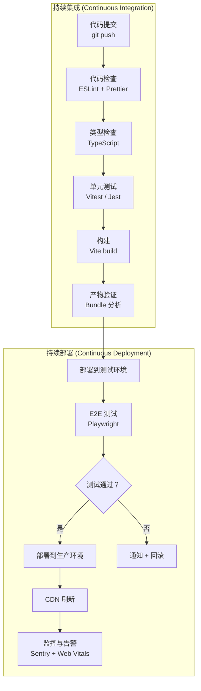
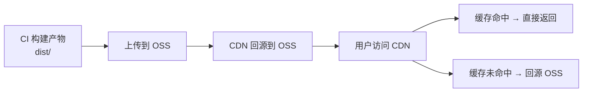

# 前端 CI/CD

## ⭐ 面试重点速览

| 知识模块 | 重点内容 | 面试频率 |
|----------|----------|----------|
| CI/CD 流程 | 代码检查→单元测试→构建→部署→监控 | 极高 |
| GitHub Actions | Workflow 配置、Job 依赖、环境变量、Secret 管理 | 高 |
| 自动化部署 | 静态资源 OSS + CDN、Docker + Nginx、灰度发布 | 高 |

---

## 前端 CI/CD 流程



---

## 前端 CI/CD 关键步骤

### 1. 代码检查（Lint）

```yaml
# GitHub Actions 中的 lint 步骤
- name: Lint
  run: |
    npx eslint . --max-warnings 0
    npx prettier --check .
```

### 2. 类型检查

```yaml
- name: Type Check
  run: npx tsc --noEmit
```

### 3. 单元测试

```yaml
- name: Unit Tests
  run: npx vitest run --coverage
```

### 4. 构建

```yaml
- name: Build
  run: npx vite build
  env:
    VITE_API_BASE: ${{ secrets.VITE_API_BASE }}
```

### 5. 产物分析

```yaml
- name: Bundle Analysis
  run: |
    npx vite-bundle-visualizer
    # 检查 bundle 大小是否超过阈值
    BUNDLE_SIZE=$(du -sh dist)
    echo "Bundle size: $BUNDLE_SIZE"
```

---

## GitHub Actions 实践

### 完整 Workflow 配置

```yaml
# .github/workflows/ci-cd.yml
name: CI/CD Pipeline

on:
  push:
    branches: [main, develop]
  pull_request:
    branches: [main]

# 环境变量
env:
  NODE_VERSION: '20'
  PNPM_VERSION: '9'

jobs:
  # =============================================
  # Job 1: 代码检查
  # =============================================
  lint:
    name: Lint & Type Check
    runs-on: ubuntu-latest
    steps:
      - name: Checkout
        uses: actions/checkout@v4

      - name: Setup pnpm
        uses: pnpm/action-setup@v4
        with:
          version: ${{ env.PNPM_VERSION }}

      - name: Setup Node.js
        uses: actions/setup-node@v4
        with:
          node-version: ${{ env.NODE_VERSION }}
          cache: 'pnpm'

      - name: Install dependencies
        run: pnpm install --frozen-lockfile

      - name: ESLint
        run: pnpm lint

      - name: TypeScript Check
        run: pnpm typecheck

  # =============================================
  # Job 2: 单元测试
  # =============================================
  test:
    name: Unit Tests
    runs-on: ubuntu-latest
    needs: lint  # 依赖 lint job 完成
    steps:
      - name: Checkout
        uses: actions/checkout@v4

      - name: Setup pnpm
        uses: pnpm/action-setup@v4
        with:
          version: ${{ env.PNPM_VERSION }}

      - name: Setup Node.js
        uses: actions/setup-node@v4
        with:
          node-version: ${{ env.NODE_VERSION }}
          cache: 'pnpm'

      - name: Install dependencies
        run: pnpm install --frozen-lockfile

      - name: Run Tests
        run: pnpm test -- --coverage

      - name: Upload Coverage
        uses: actions/upload-artifact@v4
        with:
          name: coverage
          path: coverage/

  # =============================================
  # Job 3: 构建
  # =============================================
  build:
    name: Build
    runs-on: ubuntu-latest
    needs: [lint, test]  # 依赖 lint 和 test 完成
    steps:
      - name: Checkout
        uses: actions/checkout@v4

      - name: Setup pnpm
        uses: pnpm/action-setup@v4
        with:
          version: ${{ env.PNPM_VERSION }}

      - name: Setup Node.js
        uses: actions/setup-node@v4
        with:
          node-version: ${{ env.NODE_VERSION }}
          cache: 'pnpm'

      - name: Install dependencies
        run: pnpm install --frozen-lockfile

      - name: Build
        run: pnpm build
        env:
          VITE_API_BASE: ${{ secrets.VITE_API_BASE }}
          VITE_SENTRY_DSN: ${{ secrets.VITE_SENTRY_DSN }}

      - name: Upload Build Artifact
        uses: actions/upload-artifact@v4
        with:
          name: dist
          path: dist/

  # =============================================
  # Job 4: 部署到测试环境
  # =============================================
  deploy-staging:
    name: Deploy to Staging
    runs-on: ubuntu-latest
    needs: build
    if: github.ref == 'refs/heads/develop'
    environment:
      name: staging
      url: https://staging.example.com
    steps:
      - name: Download Build Artifact
        uses: actions/download-artifact@v4
        with:
          name: dist
          path: dist/

      - name: Deploy to OSS
        uses: manyuanrong/setup-ossutil@v3
        with:
          endpoint: ${{ secrets.OSS_ENDPOINT }}
          access-key-id: ${{ secrets.OSS_ACCESS_KEY_ID }}
          access-key-secret: ${{ secrets.OSS_ACCESS_KEY_SECRET }}

      - name: Upload to OSS
        run: |
          ossutil cp -r dist/ oss://staging-bucket/ --update

      - name: Refresh CDN
        run: |
          curl -X POST "https://cdn.example.com/refresh" \
            -H "Authorization: Bearer ${{ secrets.CDN_TOKEN }}" \
            -d '{"paths": ["/*"]}'

  # =============================================
  # Job 5: 部署到生产环境
  # =============================================
  deploy-production:
    name: Deploy to Production
    runs-on: ubuntu-latest
    needs: build
    if: github.ref == 'refs/heads/main'
    environment:
      name: production
      url: https://example.com
    steps:
      - name: Download Build Artifact
        uses: actions/download-artifact@v4
        with:
          name: dist
          path: dist/

      - name: Deploy to OSS
        uses: manyuanrong/setup-ossutil@v3
        with:
          endpoint: ${{ secrets.OSS_ENDPOINT }}
          access-key-id: ${{ secrets.OSS_ACCESS_KEY_ID }}
          access-key-secret: ${{ secrets.OSS_ACCESS_KEY_SECRET }}

      - name: Upload to OSS
        run: |
          # 先上传到带版本号的目录
          VERSION=$(date +%Y%m%d%H%M%S)
          ossutil cp -r dist/ oss://prod-bucket/releases/$VERSION/ --update
          # 更新 latest 软链接（或修改 Nginx 配置指向新版本）

      - name: Refresh CDN
        run: |
          curl -X POST "https://cdn.example.com/refresh" \
            -H "Authorization: Bearer ${{ secrets.CDN_TOKEN }}" \
            -d '{"paths": ["/*"]}'

      - name: Notify Deployment
        if: success()
        uses: slackapi/slack-github-action@v1
        with:
          payload: |
            {
              "text": "Production deployment successful! :rocket:\nVersion: ${{ github.sha }}\nURL: https://example.com"
            }
        env:
          SLACK_WEBHOOK_URL: ${{ secrets.SLACK_WEBHOOK }}
```

---

## 自动化部署方案

### 方案一：静态资源 OSS + CDN



**优点**：成本低、配置简单、高可用
**适用**：纯静态 SPA 应用（如管理后台、官网）

```yaml
# 部署到阿里云 OSS 的简化步骤
- name: Upload to OSS
  run: |
    # 1. HTML 文件不缓存（确保用户总是获取最新版本）
    ossutil cp dist/index.html oss://bucket/ --cache-control "no-cache"

    # 2. 带 hash 的静态资源长期缓存
    ossutil cp -r dist/assets/ oss://bucket/assets/ --cache-control "public,max-age=31536000,immutable"
```

### 方案二：Docker + Nginx

```dockerfile
# Dockerfile
FROM node:20-alpine AS builder
WORKDIR /app
COPY package.json pnpm-lock.yaml ./
RUN npm install -g pnpm && pnpm install --frozen-lockfile
COPY . .
RUN pnpm build

FROM nginx:alpine
# 复制构建产物到 Nginx 静态目录
COPY --from=builder /app/dist /usr/share/nginx/html
# 复制 Nginx 配置
COPY nginx.conf /etc/nginx/conf.d/default.conf
EXPOSE 80
CMD ["nginx", "-g", "daemon off;"]
```

```nginx
# nginx.conf
server {
    listen 80;
    server_name example.com;

    root /usr/share/nginx/html;
    index index.html;

    # Gzip 压缩
    gzip on;
    gzip_types text/plain text/css application/json application/javascript text/xml;

    # 静态资源缓存
    location /assets/ {
        expires 1y;
        add_header Cache-Control "public, immutable";
    }

    # SPA 路由回退
    location / {
        try_files $uri $uri/ /index.html;
        add_header Cache-Control "no-cache";
    }

    # API 反向代理
    location /api/ {
        proxy_pass http://backend:8080;
        proxy_set_header Host $host;
        proxy_set_header X-Real-IP $remote_addr;
    }
}
```

```yaml
# GitHub Actions 中的 Docker 部署步骤
- name: Build and Push Docker Image
  uses: docker/build-push-action@v5
  with:
    context: .
    push: true
    tags: |
      registry.example.com/frontend:${{ github.sha }}
      registry.example.com/frontend:latest

- name: Deploy to Server
  run: |
    ssh deploy@server "docker pull registry.example.com/frontend:latest && docker-compose up -d"
```

---

## 版本管理与回滚

### 版本号策略

```yaml
# 构建时生成版本号
- name: Generate Version
  run: |
    VERSION=$(node -p "require('./package.json').version")
    BUILD_ID=$(date +%Y%m%d%H%M%S)-${GITHUB_SHA::7}
    echo "VERSION=${VERSION}-${BUILD_ID}" >> $GITHUB_ENV

# 部署到带版本号的目录
- name: Deploy Versioned
  run: |
    ossutil cp -r dist/ oss://bucket/releases/${VERSION}/
```

### 快速回滚

```bash
# 回滚到上一个版本
LATEST_VERSION=$(ossutil ls oss://bucket/releases/ | tail -2 | head -1)
ossutil cp -r oss://bucket/releases/${LATEST_VERSION}/ oss://bucket/current/ --update
# 刷新 CDN
curl -X POST "https://cdn.example.com/refresh" -d '{"paths": ["/*"]}' -H "Authorization: Bearer ${CDN_TOKEN}"
```

---

## 面试高频问题汇总

### Q1：前端 CI/CD 的关键步骤有哪些？

标准的六步流程：

1. **代码检查（Lint）**：ESLint + Prettier，确保代码质量和风格统一
2. **类型检查（Type Check）**：TypeScript 编译检查，提前发现类型错误
3. **单元测试（Unit Test）**：Vitest/Jest 运行测试用例，确保核心逻辑正确
4. **构建（Build）**：Vite/Webpack 打包，注入环境变量
5. **部署（Deploy）**：上传到 OSS + CDN 或 Docker 容器化部署
6. **监控（Monitor）**：Sentry 错误追踪 + Web Vitals 性能监控

### Q2：如何实现前端项目的快速回滚？

**静态资源 OSS 方案**：

1. 每次部署上传到带版本号的目录（如 `releases/v1.2.3-20240607/`）
2. 保留最近 5-10 个版本
3. 回滚时，将 CDN 或 Nginx 指向旧版本目录
4. 刷新 CDN 缓存

**Docker 方案**：

1. 每次构建打 tag（如 `frontend:v1.2.3`）
2. 回滚时直接部署旧 tag 的镜像
3. `docker-compose up -d` 即可快速切换

### Q3：如何保证前端 CI/CD 的安全性？

1. **Secret 管理**：所有敏感信息（API Key、Token）使用 GitHub Secrets，不硬编码
2. **环境隔离**：测试环境、生产环境使用不同的 Secret 和配置
3. **依赖锁定**：`pnpm install --frozen-lockfile` 确保 CI 环境依赖与本地一致
4. **产物校验**：部署前检查构建产物大小，异常时阻止部署
5. **部署审批**：生产环境部署需要人工审批（GitHub Environment Protection Rules）

---

## 面试追问环节

**Q：你们项目的 CI/CD 流水线跑一次需要多久？做过哪些优化？**

1. **缓存策略**：缓存 `node_modules`（pnpm store）和构建缓存，减少重复安装
2. **并行执行**：Lint 和 Test 并行运行，减少总耗时
3. **增量检查**：只检查变更文件（lint-staged），而非全量
4. **按需构建**：Monorepo 项目使用 Turborepo 增量构建
5. **实际数据**：从原来的 15 分钟优化到 3 分钟

**Q：前端项目部署后，用户看到旧版本怎么办？**

这是经典的**前端缓存问题**，解决方案：

1. **HTML 不缓存**：`Cache-Control: no-cache`，确保用户总是获取最新 HTML
2. **静态资源 hash 命名**：`main.a1b2c3d4.js`，文件内容变化 → hash 变化 → 新 URL
3. **CDN 刷新**：部署后自动刷新 CDN 缓存
4. **灰度发布**：先部署到部分服务器，确认无误后全量发布

**Q：如果 CI/CD 流水线失败了怎么办？**

1. **自动通知**：Slack/钉钉/飞书通知相关开发人员
2. **阻断部署**：失败后不部署，保留上一个可用版本
3. **快速修复**：开发人员修复后重新 push，触发新流水线
4. **紧急回滚**：如果已经部署了问题版本，快速回滚到上一个稳定版本