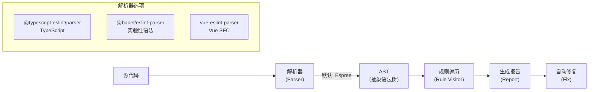
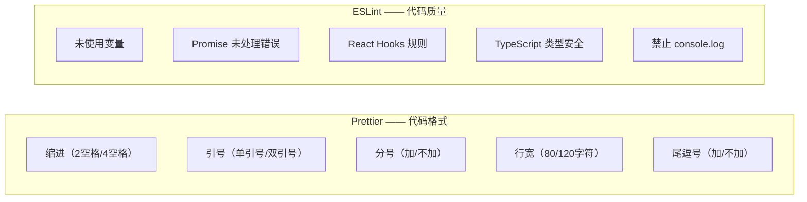
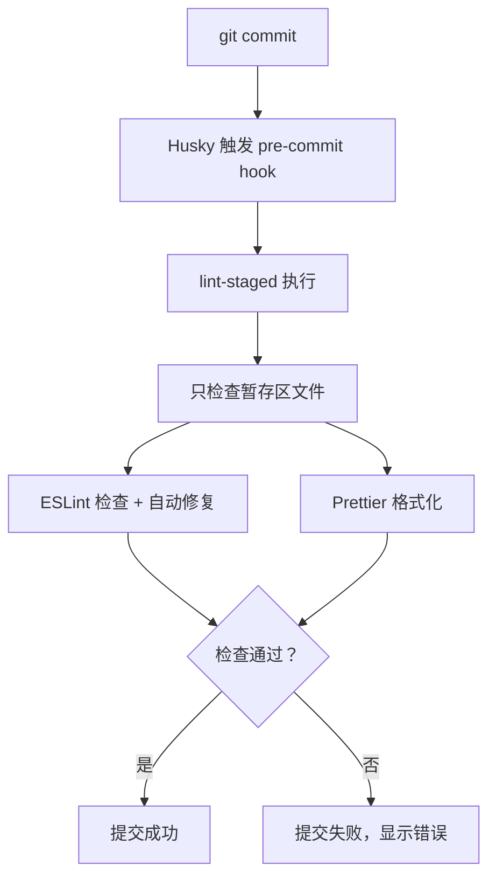

# 代码规范

## ⭐ 面试重点速览

| 知识模块 | 重点内容 | 面试频率 |
|----------|----------|----------|
| ESLint 原理 | AST 解析、规则机制、配置继承、插件开发 | 极高 |
| Prettier 与 ESLint 分工 | 格式 vs 质量、冲突解决、eslint-config-prettier | 极高 |
| Husky + lint-staged | Git Hooks 自动化、pre-commit 检查 | 高 |
| commitlint | 约定式提交规范、commit message 校验 | 中高 |

---

## ESLint 原理

### 核心架构



::: tip AST 是什么？
AST（Abstract Syntax Tree，抽象语法树）是源代码的树形结构表示。ESLint 先将代码解析为 AST，然后**遍历 AST 的每个节点**，检查是否符合规则定义。

```javascript
// 源代码
const x = 1

// 对应的 AST（简化）
{
  type: "VariableDeclaration",
  kind: "const",
  declarations: [{
    type: "VariableDeclarator",
    id: { type: "Identifier", name: "x" },
    init: { type: "Literal", value: 1 }
  }]
}
```
:::

### 规则机制

每条 ESLint 规则是一个**访问者模式**的实现：

```javascript
// 简化的 ESLint 规则示例：禁止使用 var
module.exports = {
  meta: {
    type: 'suggestion',
    docs: { description: '禁止使用 var 声明变量' },
    fixable: 'code',   // 支持自动修复
    schema: [],        // 规则配置项 schema
  },

  create(context) {
    return {
      // 访问 VariableDeclaration 节点
      VariableDeclaration(node) {
        if (node.kind === 'var') {
          context.report({
            node,
            message: '禁止使用 var，请使用 const 或 let',
            // 自动修复：将 var 替换为 const
            fix(fixer) {
              // 获取 var 关键字的位置
              const varToken = context
                .getSourceCode()
                .getFirstToken(node, { filter: t => t.value === 'var' })
              // 替换为 const
              return fixer.replaceText(varToken, 'const')
            },
          })
        }
      },
    }
  },
}
```

### 配置继承

```javascript
// .eslintrc.js（传统配置格式）
module.exports = {
  root: true, // 停止向上查找配置

  // 继承的配置（从右到左合并，右边覆盖左边）
  extends: [
    'eslint:recommended',                     // ESLint 内置推荐规则
    'plugin:@typescript-eslint/recommended',  // TS 规则
    'plugin:vue/vue3-recommended',            // Vue 3 规则
    'prettier',                               // 关闭与 Prettier 冲突的规则（必须放最后）
  ],

  parser: '@typescript-eslint/parser',
  parserOptions: {
    ecmaVersion: 'latest',
    sourceType: 'module',
    ecmaFeatures: { jsx: true },
  },

  plugins: ['@typescript-eslint', 'vue'],

  // 自定义规则
  rules: {
    'no-console': 'warn',                    // 关闭级别：off/warn/error
    'no-unused-vars': ['error', { args: 'none' }],
    '@typescript-eslint/no-explicit-any': 'error',
    'vue/multi-word-component-names': 'off',
  },

  // 针对特定文件的覆盖配置
  overrides: [
    {
      files: ['*.test.ts', '*.spec.ts'],
      rules: { 'no-console': 'off' },
    },
  ],
}
```

```javascript
// eslint.config.js（Flat Config，ESLint 9+ 新格式）
import js from '@eslint/js'
import tseslint from 'typescript-eslint'
import vuePlugin from 'eslint-plugin-vue'

export default tseslint.config(
  js.configs.recommended,
  ...tseslint.configs.recommended,
  ...vuePlugin.configs['flat/recommended'],
  {
    rules: {
      'no-console': 'warn',
    },
  },
  {
    // 忽略文件
    ignores: ['dist/**', 'node_modules/**'],
  }
)
```

---

## Prettier 与 ESLint 分工

### 职责划分



| 工具 | 关注点 | 典型问题 | 是否可自动修复 |
|------|--------|----------|---------------|
| **Prettier** | 代码格式（How it looks） | 缩进、引号、分号、换行 | 全部可自动修复 |
| **ESLint** | 代码质量（How it works） | 逻辑错误、潜在 bug、最佳实践 | 部分可自动修复 |

### 冲突解决

::: danger ESLint 和 Prettier 冲突的核心原因
两者都试图控制代码格式（如缩进、引号），当规则不一致时就会冲突。例如 ESLint 要求双引号但 Prettier 配置了单引号。
:::

**解决方案**：

```bash
# 1. 安装依赖
npm install -D prettier eslint-config-prettier eslint-plugin-prettier
```

```javascript
// .eslintrc.js
module.exports = {
  extends: [
    'eslint:recommended',
    'plugin:@typescript-eslint/recommended',
    // ⭐ 关键：prettier 必须放在最后，关闭与 Prettier 冲突的 ESLint 规则
    'prettier',
  ],
  // 不推荐使用 eslint-plugin-prettier（将 Prettier 作为 ESLint 规则运行，性能差）
}
```

```json
// .prettierrc
{
  "semi": false,
  "singleQuote": true,
  "trailingComma": "all",
  "printWidth": 100,
  "tabWidth": 2,
  "arrowParens": "always"
}
```

::: tip 推荐实践
- **格式化**：用 Prettier 负责，保存时自动格式化（VS Code 配置 `"editor.formatOnSave": true`）
- **质量检查**：用 ESLint 负责，在提交前检查（Husky + lint-staged）
- **`eslint-config-prettier`**：关闭 ESLint 中与 Prettier 冲突的规则，让 Prettier 独占格式化
- **不要**使用 `eslint-plugin-prettier`（将 Prettier 作为 ESLint 规则运行），性能差且容易出错
:::

---

## Husky + lint-staged

### 工作流程



### 配置

```bash
# 安装依赖
npm install -D husky lint-staged

# 初始化 Husky
npx husky init
```

```bash
# .husky/pre-commit
npx lint-staged
```

```json
// package.json
{
  "lint-staged": {
    "*.{js,jsx,ts,tsx}": [
      "eslint --fix",       // 先 ESLint 自动修复
      "prettier --write"    // 再 Prettier 格式化
    ],
    "*.{css,scss,less}": [
      "stylelint --fix",
      "prettier --write"
    ],
    "*.{json,md,yaml}": [
      "prettier --write"
    ]
  }
}
```

```bash
# .husky/commit-msg —— 提交信息检查
npx --no -- commitlint --edit $1
```

::: warning Husky 常见问题
- **Husky 不触发**：检查 `.git/hooks/` 目录是否有正确的 hook 文件，运行 `npx husky install` 重新安装
- **跳过 hook**：`git commit -m "msg" --no-verify` 跳过所有检查（紧急情况使用，不建议）
- **lint-staged 慢**：确认只检查 `*.{ts,tsx}` 等必要文件，避免检查 `node_modules` 和 `dist`
:::

---

## commitlint

### 约定式提交（Conventional Commits）

```bash
<type>(<scope>): <subject>          # 提交标题

<body>                              # 提交详情（可选）

<footer>                            # 脚注（可选，如 BREAKING CHANGE）
```

**Type 类型**：

| Type | 说明 | 示例 |
|------|------|------|
| `feat` | 新功能 | `feat(auth): 新增 JWT 登录功能` |
| `fix` | 修复缺陷 | `fix(api): 修复用户列表分页错误` |
| `docs` | 文档变更 | `docs(readme): 更新安装说明` |
| `style` | 代码格式 | `style(button): 统一缩进为 2 空格` |
| `refactor` | 重构 | `refactor(utils): 提取公共日期处理函数` |
| `perf` | 性能优化 | `perf(list): 使用虚拟列表优化渲染` |
| `test` | 测试 | `test(login): 添加登录单元测试` |
| `chore` | 构建/工具 | `chore(deps): 升级 Vite 到 6.0` |
| `ci` | CI 配置 | `ci(actions): 添加自动部署流水线` |

### 配置

```javascript
// commitlint.config.js
module.exports = {
  extends: ['@commitlint/config-conventional'],
  rules: {
    // type 必须在枚举值中
    'type-enum': [2, 'always', [
      'feat', 'fix', 'docs', 'style', 'refactor',
      'perf', 'test', 'chore', 'ci', 'build',
    ]],
    // type 必须小写
    'type-case': [2, 'always', 'lower-case'],
    // subject 不能为空
    'subject-empty': [2, 'never'],
    // subject 不能以句号结尾
    'subject-full-stop': [2, 'never', '.'],
    // header 最大长度 72
    'header-max-length': [2, 'always', 72],
  },
}
```

---

## 完整的代码规范体系搭建

```bash
# 1. 初始化项目
npm init -y

# 2. ESLint + TypeScript
npm install -D eslint @typescript-eslint/parser @typescript-eslint/eslint-plugin

# 3. Prettier
npm install -D prettier eslint-config-prettier

# 4. Husky + lint-staged
npm install -D husky lint-staged
npx husky init

# 5. commitlint
npm install -D @commitlint/cli @commitlint/config-conventional

# 6. 创建配置文件
echo '{}' > .prettierrc
echo 'module.exports = { extends: ["@commitlint/config-conventional"] }' > commitlint.config.js
```

---

## 面试高频问题汇总

### Q1：ESLint 和 Prettier 冲突怎么解决？

**标准三步方案**：

1. **安装 `eslint-config-prettier`**：关闭 ESLint 中所有与 Prettier 冲突的格式化规则
2. **extends 中 `prettier` 放最后**：确保 Prettier 的配置覆盖 ESLint 的格式规则
3. **分工明确**：Prettier 负责格式化（保存时自动执行），ESLint 负责代码质量（提交时检查）

**不要使用 `eslint-plugin-prettier`**：它将 Prettier 作为 ESLint 规则运行，性能差，且错误信息不直观。

### Q2：ESLint 的规则是怎么工作的？

ESLint 使用**访问者模式**（Visitor Pattern）遍历 AST：

1. **解析**：Parser 将源代码解析为 AST
2. **遍历**：每条规则注册感兴趣的 AST 节点类型（如 `VariableDeclaration`）
3. **检查**：当遍历到对应节点时，触发规则的 `create()` 方法
4. **报告**：`context.report()` 生成错误/警告信息
5. **修复**：如果规则支持 `fixable`，可以自动修复代码

### Q3：为什么要用 commitlint？

1. **自动生成 CHANGELOG**：基于 commit message 自动生成版本发布日志
2. **语义化版本**：根据 type 自动判断版本号（`feat` → minor，`fix` → patch）
3. **提交历史可读**：统一的格式让提交历史一目了然
4. **团队规范**：强制团队成员遵循统一的提交规范

---

## 面试追问环节

**Q：如果团队有人不喜欢 Prettier 的默认配置怎么办？**

1. **协商原则**：团队投票决定配置，少数服从多数
2. **最小化配置**：尽量使用 Prettier 默认值，减少 bikeshedding（无意义的争论）
3. **强制执行**：配置一旦确定，通过 CI 强制检查，不接受个人偏好
4. **工具辅助**：VS Code 配置 `"editor.formatOnSave": true`，让格式化成为无感操作

**Q：ESLint 的 Flat Config 和旧配置有什么区别？**

- **Flat Config**（ESLint 9+）：使用 `eslint.config.js`，配置是数组，支持 ESM，更灵活
- **旧配置**（ESLint 8-）：使用 `.eslintrc.js`，配置是对象，`extends` 链式继承

**Q：lint-staged 为什么只检查暂存文件而不是全量检查？**

两个原因：
1. **性能**：全量检查大型项目可能需要 30s+，每次提交都等待不可接受
2. **范围**：只检查本次变更的文件，避免修复历史遗留问题（应该单独处理）

但如果团队想逐步提升代码质量，可以定期运行全量检查并修复历史问题。