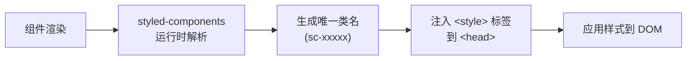
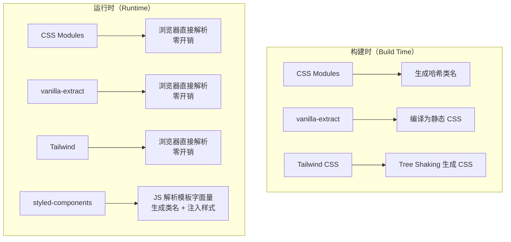

# 现代 CSS 工程化方案对比

## ⭐ 面试重点速览

| 知识模块 | 重点内容 | 面试频率 |
|----------|----------|----------|
| CSS Modules | 局部作用域原理、composes 组合、与 CSS 预处理器配合、:global/:local 语法 | 极高 |
| CSS-in-JS | styled-components 运行时方案、编译时方案（pandacss/vanilla-extract）、与 React 生态关系 | 极高 |
| 原子化 CSS | Tailwind CSS 设计理念、优点（开发速度/一致性）、缺点（HTML 臃肿/学习曲线）、自定义设计令牌 | 极高 |
| 三种方案对比 | 作用域隔离、运行时性能、学习曲线、适用场景、社区生态、与框架的耦合度 | 极高 |

---

## 一、CSS Modules：局部作用域 + 组合

CSS Modules 不是官方规范，而是一种**构建时方案**，由 Webpack/Vite 等打包工具实现。它的核心思想是：**将 CSS 类名自动转换为局部唯一的类名，实现样式隔离**。

### 1.1 局部作用域原理

```css
/* Button.module.css */
.button {
  background: #409eff;
  border-radius: 4px;
  padding: 8px 16px;
}

.primary {
  background: #409eff;
  color: #fff;
}

.danger {
  background: #e74c3c;
  color: #fff;
}
```

```tsx
// Button.tsx
import styles from './Button.module.css'

export const Button = ({ variant = 'primary' }) => {
  return (
    <button className={`${styles.button} ${styles[variant]}`}>
      点击
    </button>
  )
}
```

编译后的 HTML 和 CSS：

```html
<!-- 实际渲染的 HTML -->
<button class="Button_button__a1b2c Button_primary__d3e4f">点击</button>
```

```css
/* 编译后的 CSS — 类名被哈希化 */
.Button_button__a1b2c { background: #409eff; border-radius: 4px; padding: 8px 16px; }
.Button_primary__d3e4f { background: #409eff; color: #fff; }
```

::: tip 核心原理
CSS Modules 的构建工具（如 css-loader）在编译阶段：
1. 解析 `.module.css` 文件中的类名
2. 为每个类名生成**唯一的哈希标识**（通常结合文件名 + 类名 + 哈希）
3. 导出 JS 对象，key 为原始类名，value 为哈希后的类名
4. 替换 CSS 文件中的类名为哈希名
:::

### 1.2 composes：样式组合

CSS Modules 提供了 `composes` 关键字，可以复用其他类的样式（类似 Sass 的 `@extend`，但编译时合并）：

```css
/* base.module.css */
.textCenter {
  text-align: center;
}

/* Button.module.css */
.button {
  composes: textCenter from './base.module.css'; /* 从其他文件引入 */
  padding: 8px 16px;
}

.primary {
  composes: button;                             /* 从当前文件组合 */
  background: #409eff;
  color: #fff;
}

.danger {
  composes: button;
  background: #e74c3c;
}
```

编译后，`composes` 会将多个类名合并到一个规则中，不会产生冗余代码：

```css
.Button_primary__d3e4f { background: #409eff; color: #fff; padding: 8px 16px; text-align: center; }
```

**composes vs Sass @extend 对比**：

| 维度 | composes | Sass @extend |
|------|----------|-------------|
| 处理时机 | 构建时（Webpack/Vite） | Sass 编译时 |
| 参数支持 | 不支持 | 不支持 |
| 跨文件 | 通过 `from` 语法 | 需要先 `@import`/`@use` |
| 去重机制 | 直接合并属性，更高效 | 群组选择器（可能产生特异性问题） |
| 与 JS 交互 | 可导出对象供 JS 使用 | 无 |

### 1.3 :global 和 :local

```css
/* 默认所有类名都是局部作用域 */
.button { /* 等同于 :local(.button) */ }

/* 声明全局样式 — 绕过哈希处理 */
:global(.ant-btn) {
  /* 覆盖 Ant Design 等第三方组件库的样式 */
  border-radius: 8px;
}

/* 混合使用 */
.card :global(.title) {
  /* .card__hash .title — 局部作用域下的全局类名 */
  font-size: 18px;
}
```

### 1.4 与 CSS 预处理器配合

CSS Modules 和 Sass/Less 是**互补关系**，可以同时使用：

```scss
/* Button.module.scss */
$primary: #409eff;

@mixin button-base {
  padding: 8px 16px;
  border-radius: 4px;
  cursor: pointer;
}

.button {
  @include button-base;
  background: $primary;
}

// 动态生成多个变体
@each $variant in (primary, success, warning, danger) {
  .#{$variant} {
    @include button-base;
    // Sass 变量无法在 composes 中使用，但此处可以用 @extend 替代
  }
}
```

配置方式（Vite 示例）：

```typescript
// vite.config.ts
import { defineConfig } from 'vite'

export default defineConfig({
  css: {
    modules: {
      // 自定义生成类名的规则
      generateScopedName: '[name]__[local]__[hash:base64:5]',
      // 开发环境可使用类名便于调试
      // generateScopedName: '[name]__[local]',
    },
  },
})
```

---

## 二、CSS-in-JS：样式即组件

CSS-in-JS 将 CSS 写在 JavaScript/TypeScript 中，利用 JS 的动态能力（变量、函数、条件）来生成样式。它彻底解决了全局作用域污染问题，并实现了**样式与组件的真正共置（Co-location）**。

### 2.1 运行时方案：styled-components

```tsx
import styled from 'styled-components'

// 基础样式组件
const Button = styled.button`
  padding: 8px 16px;
  border-radius: 4px;
  border: none;
  cursor: pointer;
  font-size: ${props => props.theme.fontSize};  /* 使用主题变量 */

  /* 动态样式 — 基于 props */
  background: ${props => {
    switch (props.$variant) {
      case 'primary': return '#409eff';
      case 'danger': return '#e74c3c';
      default: return '#ccc';
    }
  }};

  /* 伪类 */
  &:hover {
    opacity: 0.85;
  }
`

// 样式继承 — 基于已有组件扩展
const PrimaryButton = styled(Button)`
  background: #409eff;
  color: #fff;
`

// 使用
<Button $variant="primary">提交</Button>
<PrimaryButton>确认</PrimaryButton>
```

**运行时方案的原理**：



::: warning 运行时方案的代价
- **运行时开销**：每次组件渲染都需要解析模板字面量、生成唯一类名、注入样式
- **Bundle 体积**：styled-components 运行时约 12KB（gzipped），但实际项目中通常更大
- **SSR 复杂**：需要额外配置服务端样式收集和注水（hydration）
- **调试困难**：生成的类名是哈希值，DevTools 中难以定位源码
:::

### 2.2 编译时方案（零运行时）

为解决运行时 CSS-in-JS 的性能问题，**编译时方案（Zero-Runtime）** 成为新趋势。

#### vanilla-extract

在构建时将 TypeScript 样式编译为静态 CSS 文件：

```typescript
// styles.css.ts（.css.ts 后缀，vanilla-extract 才会编译）
import { style, createVar } from '@vanilla-extract/css'

// CSS 变量（类型安全）
const primaryColor = createVar()

export const button = style({
  padding: '8px 16px',
  borderRadius: '4px',
  background: primaryColor,

  // 伪类
  ':hover': {
    opacity: 0.85,
  },

  // 媒体查询
  '@media': {
    'screen and (max-width: 768px)': {
      width: '100%',
    },
  },
})

// 变体（recipe 模式）
export const buttonVariant = style({
  variants: {
    size: {
      small: { padding: '4px 8px' },
      medium: { padding: '8px 16px' },
      large: { padding: '12px 24px' },
    },
  },
})
```

```tsx
// 组件中使用
import { button, buttonVariant } from './styles.css'

export const Button = ({ children }) => (
  <button className={`${button} ${buttonVariant.size.medium}`}>
    {children}
  </button>
)
```

#### Panda CSS

```typescript
// panda.config.ts
import { defineConfig } from '@pandacss/dev'

export default defineConfig({
  // 基于设计令牌生成原子化工具类
  theme: {
    tokens: {
      colors: {
        primary: { value: '#409eff' },
        danger: { value: '#e74c3c' },
      },
    },
  },
})
```

```tsx
import { css } from 'styled-system/css'

// 编译时生成静态 CSS，零运行时开销
<button className={css({
  bg: 'primary',
  color: 'white',
  px: '4',
  py: '2',
  rounded: 'md',
  _hover: { opacity: 0.85 },
})}>
  提交
</button>
```

### 2.3 运行时 vs 编译时对比

| 维度 | 运行时（styled-components/Emotion） | 编译时（vanilla-extract/Panda CSS） |
|------|-------------------------------------|--------------------------------------|
| **运行时开销** | 有（解析模板字面量、注入样式） | 零（纯静态 CSS 文件） |
| **Bundle 体积** | 包含运行时（12KB+） | 无运行时代码 |
| **动态样式** | 天然支持（基于 props） | 需要通过 CSS 变量或预定义变体 |
| **SSR** | 需要额外配置 | 原生支持（静态 CSS） |
| **类型安全** | 较弱（模板字面量） | 强（TypeScript 原生） |
| **学习曲线** | 低（接近原生 CSS 写法） | 中（需要学习 API 和配置） |
| **调试体验** | 类名哈希、难定位 | 可读的类名 |
| **代表库** | styled-components、Emotion | vanilla-extract、Panda CSS、Linaria |

### 2.4 与 React 生态的关系

CSS-in-JS 几乎与 React 生态深度绑定，React 的组件化思想天然适合 CSS-in-JS：

```tsx
// 主题系统 — 运行时动态切换
import { ThemeProvider } from 'styled-components'

const darkTheme = {
  bg: '#1a1a2e',
  text: '#e0e0e0',
  primary: '#409eff',
}

const lightTheme = {
  bg: '#ffffff',
  text: '#333333',
  primary: '#409eff',
}

function App() {
  const [isDark, setIsDark] = useState(false)

  return (
    <ThemeProvider theme={isDark ? darkTheme : lightTheme}>
      <Button>主题切换</Button>
    </ThemeProvider>
  )
}
```

::: danger CSS-in-JS 的争议
React 18+ 和 Next.js 13+ 的 Server Components 架构与运行时 CSS-in-JS 不兼容（Server Components 不支持 `useState`/`useEffect`，而运行时 CSS-in-JS 需要客户端运行时）。这导致业界逐渐从运行时 CSS-in-JS 转向编译时方案或 Tailwind CSS。
:::

---

## 三、原子化 CSS（Tailwind CSS）

原子化 CSS 的核心理念是：**一个类名只做一件事**。每个类名对应一个 CSS 属性，通过组合大量原子类来构建 UI。

### 3.1 设计理念

```html
<!-- 传统方式：语义化类名 -->
<button class="btn btn-primary btn-large">
  提交
</button>

<!-- 原子化 CSS：功能化类名 -->
<button class="px-4 py-2 bg-blue-500 text-white rounded-lg hover:bg-blue-600 transition-colors">
  提交
</button>
```

每个原子类对应一个 CSS 声明：

```css
/* Tailwind 生成的 CSS */
.px-4 { padding-left: 1rem; padding-right: 1rem; }
.py-2 { padding-top: 0.5rem; padding-bottom: 0.5rem; }
.bg-blue-500 { background-color: #3b82f6; }
.text-white { color: #ffffff; }
.rounded-lg { border-radius: 0.5rem; }
.hover\:bg-blue-600:hover { background-color: #2563eb; }
```

### 3.2 设计令牌（Design Tokens）

Tailwind 的核心优势在于**统一的设计令牌系统**：

```javascript
// tailwind.config.js
module.exports = {
  theme: {
    extend: {
      colors: {
        // 自定义品牌色，自动生成 bg-brand-50 ~ bg-brand-900
        brand: {
          50: '#eff6ff',
          100: '#dbeafe',
          500: '#3b82f6',
          700: '#1d4ed8',
          900: '#1e3a8a',
        },
      },
      spacing: {
        // 扩展间距值
        '18': '4.5rem',
        '88': '22rem',
      },
      screens: {
        // 自定义断点
        'tablet': '640px',
        'desktop': '1024px',
      },
    },
  },
  // 通过 content 配置实现 Tree Shaking
  content: ['./src/**/*.{js,jsx,ts,tsx}'],
}
```

### 3.3 优点

**1. 开发速度极快**

不需要在 CSS 文件和组件文件之间来回切换，所有样式都在 HTML/JSX 中完成：

```tsx
// 5 秒完成一个卡片组件
<div className="max-w-sm rounded-2xl shadow-lg bg-white overflow-hidden">
  
  <div className="p-6">
    <h3 className="text-xl font-bold text-gray-900 mb-2">{title}</h3>
    <p className="text-gray-600 text-sm">{description}</p>
  </div>
</div>
```

**2. 设计一致性**

所有开发者使用同一套设计令牌（颜色、间距、字号），避免"每个开发者有自己的审美"：

```text
# 传统 CSS 的问题
开发者 A: padding: 15px; font-size: 14px; color: #333;
开发者 B: padding: 16px; font-size: 13px; color: #444;
# → 设计不一致，难以维护

# Tailwind 的约束
开发者 A 和 B 都只能从预定义的 p-4 / text-sm / text-gray-700 中选择
```

**3. Tree Shaking 极致**

Tailwind 通过在构建时扫描 `content` 配置中指定的文件，只生成实际使用的 CSS 类。一个典型的 Tailwind 项目最终 CSS 文件约 3-8KB（gzipped）。

**4. 响应式设计直观**

```html
<!-- 响应式断点前缀：sm / md / lg / xl / 2xl -->
<div class="
  grid
  grid-cols-1           /* 手机：1 列 */
  sm:grid-cols-2         /* 平板：2 列 */
  lg:grid-cols-3         /* 桌面：3 列 */
  xl:grid-cols-4         /* 大屏：4 列 */
">
```

### 3.4 缺点

**1. HTML 臃肿**

```html
<!-- 真实项目中的 Tailwind 代码 -->
<div class="flex items-center justify-between px-6 py-4 bg-white
  border-b border-gray-200 hover:bg-gray-50 transition-colors
  duration-200 ease-in-out cursor-pointer rounded-t-xl
  shadow-sm dark:bg-gray-800 dark:border-gray-700
  dark:hover:bg-gray-750">
```

::: warning 应对 HTML 臃肿的策略
- **组件封装**：将重复的样式组合封装为组件，如 `<Card>`、`<Button>`
- **@apply 指令**：将常用样式组合提取为自定义类（但过度使用会失去原子化优势）
- **编辑器插件**：Tailwind CSS IntelliSense 提供自动补全和预览
:::

**2. 学习曲线**

```text
需要记忆约 200+ 类名：
- 布局：flex, grid, block, inline, ...
- 间距：p-{size}, m-{size}, gap-{size}, ...
- 尺寸：w-{size}, h-{size}, max-w-{size}, ...
- 颜色：bg-{color}-{shade}, text-{color}-{shade}, ...
- 排版：text-{size}, font-{weight}, leading-{size}, ...
```

虽然有 IntelliSense 辅助，但团队新成员仍需要 1-2 周适应期。

**3. 样式与结构耦合**

样式直接写在 HTML 中，更换设计风格时可能需要修改大量组件的 className。这违背了"关注点分离"原则，但与组件化开发趋势并不矛盾。

**4. 动态样式能力有限**

```tsx
// ❌ Tailwind 无法动态生成类名
<div className={`bg-${color}-500`}>  // 动态拼接无效，Tailwind 无法静态分析

// ✅ 正确做法：使用完整的类名映射
const colorMap = {
  primary: 'bg-blue-500',
  danger: 'bg-red-500',
  success: 'bg-green-500',
}
<div className={colorMap[variant]}>
```

### 3.5 @apply 与组件封装

Tailwind 提供了 `@apply` 指令，可以将原子类组合为自定义语义类：

```css
/* 在 CSS 文件中使用 @apply */
@tailwind base;
@tailwind components;
@tailwind utilities;

@layer components {
  .btn-primary {
    @apply px-4 py-2 bg-blue-500 text-white rounded-lg
           hover:bg-blue-600 transition-colors
           focus:outline-none focus:ring-2 focus:ring-blue-300;
  }

  .card {
    @apply rounded-2xl shadow-lg bg-white overflow-hidden;
  }
}
```

::: tip 使用建议
- `@apply` 适合提取**高频复用**的样式组合（如按钮、卡片、表单）
- 不要过度使用 `@apply`，否则会退化回传统 CSS 写法，失去原子化的优势
- 优先使用**组件封装**而非 `@apply` 来复用样式
:::

---

## 四、三种方案深度对比

### 4.1 核心维度对比表

| 维度 | CSS Modules | CSS-in-JS（运行时） | Tailwind CSS（原子化） |
|------|-------------|---------------------|----------------------|
| **作用域隔离** | 构建时哈希，局部作用域 | 运行时生成唯一类名，完全隔离 | 全局作用域（依赖类名唯一性） |
| **运行时性能** | 无运行时开销 | 有运行时开销（解析 + 注入） | 无运行时开销 |
| **CSS 文件大小** | 中等（按模块拆分） | 取决于组件数量 | 极小（3-8KB gzipped，Tree Shaking） |
| **学习曲线** | 低（就是 CSS） | 中（模板字面量 + props） | 中高（200+ 类名记忆） |
| **类型安全** | 弱（类名是字符串） | 中（可结合 TS 但模板字面量弱） | 弱（类名是字符串） |
| **动态样式** | 通过 CSS 变量 + 内联样式 | 天然支持（基于 props） | 受限于静态分析，需要完整类名 |
| **SSR 兼容** | 原生支持 | 需要额外配置 | 原生支持 |
| **框架耦合** | 无（任何框架可用） | 强依赖 React 生态 | 无（任何框架可用） |
| **社区生态** | 成熟（Webpack/Vite 原生支持） | 成熟（React 生态标配） | 极其活跃（GitHub 80k+ Stars） |
| **调试体验** | 可读的哈希类名 | 哈希类名，难定位 | 原始类名，但 HTML 冗长 |
| **设计一致性** | 需自行维护设计令牌 | 可结合 ThemeProvider | 内置设计令牌系统 |
| **适用场景** | 通用项目，React/Vue 均适用 | React 项目，需要动态样式 | 快速开发，重视一致性 |

### 4.2 代码量对比：同一个按钮组件

```tsx
// ===== CSS Modules =====
// Button.module.css
.button { padding: 8px 16px; border-radius: 4px; }
.primary { background: #409eff; color: #fff; }
.danger { background: #e74c3c; color: #fff; }

// Button.tsx
import styles from './Button.module.css'
<button className={`${styles.button} ${styles[variant]}`}>

// ===== CSS-in-JS (styled-components) =====
const Button = styled.button`
  padding: 8px 16px;
  border-radius: 4px;
  background: ${p => p.$variant === 'danger' ? '#e74c3c' : '#409eff'};
  color: #fff;
`
<Button $variant="danger">

// ===== Tailwind CSS =====
<button className="px-4 py-2 bg-blue-500 text-white rounded
                   hover:bg-blue-600 transition-colors">
```

### 4.3 性能对比



::: tip 性能结论
- **CSS Modules / Tailwind / vanilla-extract**：构建时处理，运行时零开销，性能最优
- **styled-components / Emotion**：运行时处理，首次渲染和频繁更新时有额外开销
- 对于 Next.js Server Components 或性能敏感场景，优先选择编译时方案
:::

---

## 五、面试高频问题

### Q1: CSS Modules 和 CSS-in-JS 的核心区别是什么？

| 对比维度 | CSS Modules | CSS-in-JS |
|----------|-------------|-----------|
| **样式定义位置** | 独立的 `.module.css` 文件 | JS/TS 文件中（模板字面量或对象） |
| **处理时机** | 构建时（哈希化） | 运行时（styled-components）或构建时（vanilla-extract） |
| **动态样式** | 通过 CSS 变量或条件类名 | 天然支持（基于 props/state） |
| **与框架耦合** | 无（通用） | 强依赖 React |

**核心区别**：CSS Modules 是**样式文件的模块化**（CSS 仍是 CSS），CSS-in-JS 是**样式定义方式的变革**（CSS 变成了 JS 的一部分）。

### Q2: 原子化 CSS（Tailwind）的优缺点？

**优点**：
1. **开发速度极快**：不需要切换文件，直接在 HTML 中写样式
2. **设计一致性**：统一的设计令牌，避免每个开发者自定义数值
3. **CSS 体积极小**：Tree Shaking 后只有 3-8KB gzipped
4. **响应式直观**：断点前缀（sm:/md:/lg:）让响应式设计一目了然
5. **易于维护**：删除组件时样式自动删除，不存在"僵尸 CSS"

**缺点**：
1. **HTML 臃肿**：大量类名堆砌，可读性差
2. **学习曲线**：需要记忆 200+ 类名
3. **动态样式受限**：不能动态拼接类名（如 `bg-${color}-500`）
4. **样式与结构耦合**：更换设计风格需要修改大量组件
5. **团队接受度**：部分开发者抵触"在 HTML 中写样式"

### Q3: 运行时 CSS-in-JS 和编译时 CSS-in-JS 有什么区别？

| 维度 | 运行时（styled-components） | 编译时（vanilla-extract/Panda CSS） |
|------|---------------------------|--------------------------------------|
| 处理时机 | 浏览器运行时 | 构建时 |
| 产物 | JS bundle + 运行时注入 CSS | 静态 CSS 文件 |
| 性能 | 有运行时开销 | 无运行时开销 |
| 动态样式 | 天然支持（props） | 通过 CSS 变量或预定义变体 |
| SSR 兼容 | 需要额外配置 | 原生支持 |
| 代表库 | styled-components、Emotion | vanilla-extract、Panda CSS、Linaria |

**趋势**：React Server Components 推动行业从运行时 CSS-in-JS 转向编译时方案。

### Q4: 在实际项目中如何选择 CSS 方案？

```
┌─────────────────────────────────────────────────────────┐
│                    选型决策树                            │
├─────────────────────────────────────────────────────────┤
│                                                         │
│  需要动态样式（基于 props/state）？                      │
│    ├── 是 → 是否需要 SSR / Server Components？           │
│    │         ├── 是 → vanilla-extract / Panda CSS       │
│    │         └── 否 → styled-components / Emotion       │
│    │                                                    │
│    └── 否 → 重视开发速度和设计一致性？                    │
│              ├── 是 → Tailwind CSS                      │
│              └── 否 → 需要框架无关？                     │
│                        ├── 是 → CSS Modules + Sass      │
│                        └── 否 → CSS Modules             │
│                                                         │
└─────────────────────────────────────────────────────────┘
```

---

## 六、面试追问环节

**Q：CSS Modules 的 `composes` 和 Sass 的 `@extend` 有什么区别？**

`composes` 是**构建时属性合并**，直接将多个类的属性合并为一个规则，不会产生群组选择器。
`@extend` 是 Sass 的**编译时选择器合并**，使用群组选择器复用样式，可能影响选择器顺序和特异性。

在实际项目中，`composes` 更安全、更可控，推荐优先使用。

**Q：Tailwind 的 Tree Shaking 是怎么实现的？**

Tailwind 通过 `content` 配置扫描项目中所有文件，使用正则匹配找到实际使用的类名，然后只生成这些类名对应的 CSS。这个过程在构建时完成，利用 PurgeCSS（Tailwind v2）或 Tailwind 内置的 JIT 引擎（v3+）。

关键点：**只能做静态分析**，所以动态拼接的类名（如 `bg-${color}-500`）无法被识别，需要写完整的类名映射。

**Q：如果团队中有成员不喜欢 Tailwind，你会怎么说服他们？**

1. **用数据说话**：展示使用 Tailwind 的项目的 CSS 体积、开发速度对比
2. **渐进式引入**：新组件用 Tailwind，旧组件保持原样，逐步迁移
3. **强调约束即自由**：统一的设计令牌避免了"像素级争论"
4. **承认局限性**：Tailwind 不适合所有场景（如复杂动画、SVG 样式），在合适的地方用它
5. **工具辅助**：安装 IntelliSense 插件，降低记忆负担

::: danger 容易翻车的点
- 分不清 `composes` 和 `@extend` 的区别，在面试中混为一谈
- 不知道 CSS Modules 是构建时方案，CSS-in-JS 有运行时和编译时两种
- 过度推崇某一种方案，缺乏客观对比（面试官想看的是权衡能力）
- 不知道 Tailwind 的 Tree Shaking 只能做静态分析，动态拼接类名会失效
- 认为 CSS-in-JS 就是 styled-components，不知道 vanilla-extract 等编译时方案
- 在 React Server Components 场景下推荐运行时 CSS-in-JS（这是致命错误）
:::

---

## 总结

- **CSS Modules**：构建时方案，局部作用域 + composes 组合，适合任何框架，通用性最强
- **CSS-in-JS（运行时）**：styled-components/Emotion，动态样式能力强，但有运行时开销，与 React Server Components 不兼容
- **CSS-in-JS（编译时）**：vanilla-extract/Panda CSS，零运行时，类型安全，是 CSS-in-JS 的未来方向
- **Tailwind CSS**：原子化 CSS，开发速度最快，设计一致性最强，适合快速迭代和团队协作
- 没有银弹，选型取决于**项目规模、团队偏好、性能要求、动态样式需求**四个维度
- 实际项目中，以上方案可以混合使用（如 Tailwind 处理 90% 的样式 + CSS Modules 处理复杂组件样式）