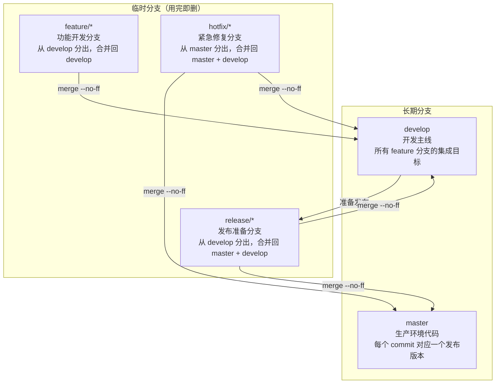
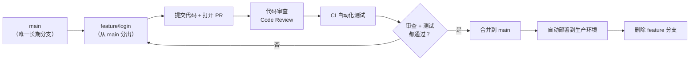
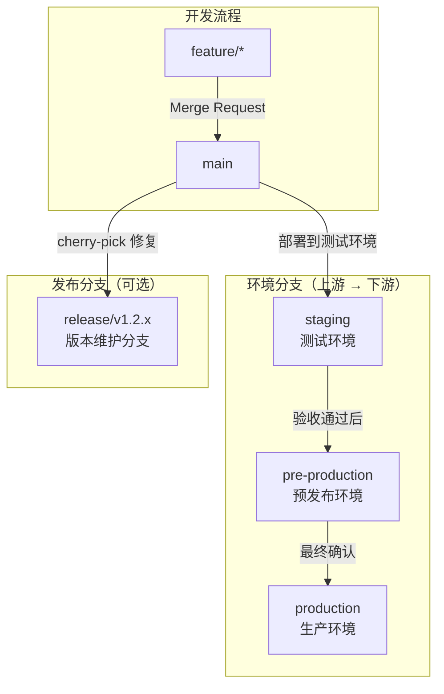
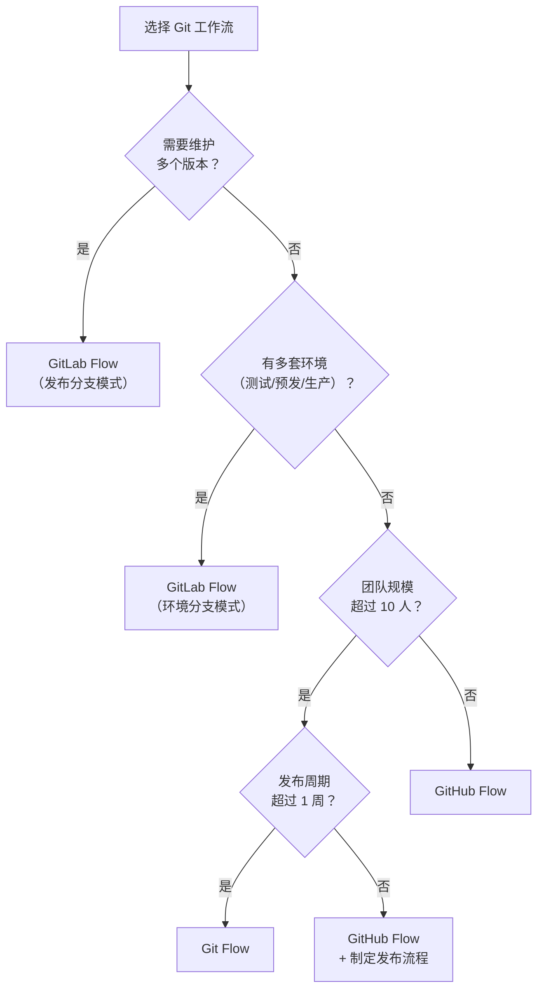

# Git 工作流对比

## ⭐ 面试重点速览

| 知识模块 | 重点内容 | 面试频率 |
|----------|----------|----------|
| Git Flow | 主分支/develop/feature/release/hotfix 五分支模型 | 极高 |
| GitHub Flow | main + feature branch 简化模型 | 极高 |
| GitLab Flow | 环境分支 + 发布分支，支持按环境部署 | 高 |
| 三种工作流对比 | 复杂度、适用场景、团队规模、发布频率 | 高 |
| 常用 Git 命令 | rebase vs merge、cherry-pick、stash、reset vs revert | 极高 |

---

## Git Flow（经典分支模型）

Git Flow 由 Vincent Driessen 于 2010 年提出，是最经典的 Git 分支管理模型，定义了**五类核心分支**。



### 分支详解

| 分支类型 | 生命周期 | 来源 | 合并目标 | 命名示例 |
|----------|----------|------|----------|----------|
| **master** | 永久 | - | - | `master` |
| **develop** | 永久 | - | - | `develop` |
| **feature** | 临时（开发完成后删除） | develop | develop | `feature/user-login` |
| **release** | 临时（发布后删除） | develop | master + develop | `release/v1.2.0` |
| **hotfix** | 临时（修复后删除） | master | master + develop | `hotfix/v1.2.1` |

### 完整操作流程

```bash
# =============================================
# 1. 创建 feature 分支
# =============================================
git checkout develop
git checkout -b feature/user-login

# ... 开发功能，多次提交 ...

# 功能开发完成，合并回 develop
git checkout develop
git merge --no-ff feature/user-login  # --no-ff 保留分支历史
git branch -d feature/user-login

# =============================================
# 2. 准备发布 —— 创建 release 分支
# =============================================
git checkout develop
git checkout -b release/v1.2.0

# 在 release 分支上做最后的修复（版本号、文档、小 bug）
# 注意：不在 release 分支上添加新功能！
git commit -m "chore: 更新版本号到 1.2.0"

# 合并到 master（打 tag）
git checkout master
git merge --no-ff release/v1.2.0
git tag -a v1.2.0 -m "Release v1.2.0"

# 合并回 develop（确保 develop 包含 release 中的修复）
git checkout develop
git merge --no-ff release/v1.2.0
git branch -d release/v1.2.0

# =============================================
# 3. 紧急修复 —— 创建 hotfix 分支
# =============================================
git checkout master
git checkout -b hotfix/v1.2.1-fix-login

# ... 修复 bug ...

git checkout master
git merge --no-ff hotfix/v1.2.1-fix-login
git tag -a v1.2.1 -m "Hotfix: 修复登录异常"

# 合并回 develop
git checkout develop
git merge --no-ff hotfix/v1.2.1-fix-login
git branch -d hotfix/v1.2.1-fix-login
```

::: tip Git Flow 的优势
- **结构清晰**：每种分支职责明确，新人容易理解
- **版本管理规范**：tag 对应生产版本，任何时候都能回滚到历史版本
- **并行开发**：多个 feature 分支同时开发，互不干扰
- **发布隔离**：release 分支隔离发布前的准备工作，不影响 develop 的持续开发
:::

::: warning Git Flow 的劣势
- **分支过多**：日常开发至少维护 2 个长期分支 + 多个临时分支
- **合并繁琐**：hotfix 需要合并到 master 和 develop 两个分支
- **发布周期长**：不适合持续部署（一天多次发布）的场景
- **不适合小型团队**：分支管理成本高于收益
:::

---

## GitHub Flow（简化分支模型）

GitHub Flow 是 GitHub 官方推荐的**极简工作流**，只有一条长期分支 `main` 和临时 feature 分支。



### 核心原则

1. **`main` 分支始终可部署**：任何合并到 main 的代码都必须是经过测试、可立即部署的
2. **从 main 创建 feature 分支**：所有新功能、修复都从 main 分出
3. **使用 Pull Request**：所有合并必须通过 PR，进行代码审查
4. **合并后立即部署**：合并到 main 后立即触发 CI/CD 部署到生产环境

### 操作流程

```bash
# 1. 从 main 创建 feature 分支
git checkout main
git pull origin main
git checkout -b feature/add-search

# 2. 开发 + 提交
git add .
git commit -m "feat: 添加搜索功能"

# 3. 推送到远程，创建 Pull Request
git push origin feature/add-search

# 4. 代码审查通过后，合并到 main（在 GitHub 上操作）
# 使用 Squash Merge 或 Rebase Merge 保持 main 历史干净

# 5. 删除 feature 分支
git branch -d feature/add-search
```

::: tip GitHub Flow 的适用场景
- **持续部署团队**：每天多次发布，main 分支始终可部署
- **SaaS 产品**：Web 应用、API 服务等不需要版本号管理的项目
- **小型团队**：5-10 人的团队，沟通成本低
- **开源项目**：通过 PR 和 Code Review 协调社区贡献
:::

---

## GitLab Flow（环境分支 + 发布分支）

GitLab Flow 在 GitHub Flow 基础上增加了**环境分支**和**发布分支**的概念，更适合需要管理多环境的项目。



### 两种模式

#### 模式一：环境分支（Environment Branches）

适用于有多个部署环境的项目（测试 → 预发布 → 生产）：

```bash
# 环境分支是单向流动的：main → staging → pre-production → production
# 每次合并都是从上游到下游，代码逐步"晋升"

# 部署到测试环境
git checkout staging
git merge main

# 测试通过后，部署到预发布环境
git checkout pre-production
git merge staging

# 预发布验收通过后，部署到生产环境
git checkout production
git merge pre-production
```

#### 模式二：发布分支（Release Branches）

适用于需要维护多个版本的软件产品（如 iOS/Android App、桌面软件）：

```bash
# 每个大版本创建一个发布分支
git checkout -b release/v2.0.x main

# 在发布分支上只修复 bug（不添加新功能）
# 修复通过 cherry-pick 同步到 main
git checkout release/v2.0.x
git cherry-pick <commit-hash>  # 从 main 挑选修复提交

# 发布时打 tag
git tag -a v2.0.1 -m "Release v2.0.1"
```

::: tip GitLab Flow 的特点
- **环境分支**：支持多环境部署，代码从上游到下游逐级流动
- **发布分支**：支持维护多个版本，适合需要长期维护的软件产品
- **Merge Request**：类似 GitHub 的 PR，支持代码审查和 CI/CD 集成
- **灵活性**：可以根据项目需求选择只使用环境分支或只使用发布分支
:::

---

## 三种工作流对比

| 对比维度 | Git Flow | GitHub Flow | GitLab Flow |
|----------|----------|-------------|-------------|
| **长期分支数** | 2 个（master + develop） | 1 个（main） | 1 个（main）+ 环境分支/发布分支 |
| **分支复杂度** | 高（5 类分支） | 低（2 类分支） | 中（3-4 类分支） |
| **适用团队规模** | 10 人以上 | 5-10 人 | 5-20 人 |
| **发布频率** | 定期发布（如每两周一次） | 持续部署（每天多次） | 持续部署 + 版本管理 |
| **版本管理** | Tag 管理版本 | 不强调版本号 | Tag + 发布分支 |
| **多环境支持** | 不支持（需额外改造） | 不支持 | 原生支持（环境分支） |
| **旧版本维护** | 不支持（需额外改造） | 不支持 | 原生支持（发布分支） |
| **学习成本** | 高 | 低 | 中 |
| **典型场景** | 传统企业级应用、客户端软件 | SaaS 产品、开源项目 | 有多个部署环境的 SaaS 产品 |
| **代表公司** | 传统软件公司 | GitHub、Netflix | GitLab |

### 选择建议



---

## 常用 Git 命令

### rebase vs merge

这是面试中**最高频**的 Git 问题。

| 对比维度 | `git merge` | `git rebase` |
|----------|-------------|--------------|
| **本质** | 创建一个合并提交，保留分支历史 | 将当前分支的提交"移植"到目标分支 |
| **结果** | 产生一个 merge commit | 线性历史，无额外 commit |
| **历史记录** | 保留完整的分支拓扑 | 线性、干净，但丢失分支信息 |
| **冲突处理** | 一次性解决所有冲突 | 逐个提交解决冲突 |
| **适用场景** | 合并 feature 到 main/develop | 在 feature 分支上同步主分支最新代码 |
| **风险** | 低 | 中等（改写历史，不要 rebase 已推送的提交） |

```bash
# =============================================
# merge 示例
# =============================================
git checkout main
git merge feature/login
# 结果：
#   A---B---C---D  main
#        \     /
#         E---F    feature/login
# D 是 merge commit

# =============================================
# rebase 示例
# =============================================
git checkout feature/login
git rebase main
# 结果：
#   A---B---C---E'---F'  feature/login
# 线性历史，E' 和 F' 是重新应用的提交

# =============================================
# 交互式 rebase（压缩提交）
# =============================================
git rebase -i HEAD~3  # 交互式处理最近 3 个提交
# 可以：pick（保留）、squash（合并）、reword（修改信息）、drop（删除）
```

::: danger rebase 的黄金法则
**永远不要 rebase 已经推送到远程仓库的公共分支！**

`git rebase` 会改写提交历史（生成新的 commit hash），如果其他人已经基于你的提交开始工作，rebase 会导致严重的冲突和混乱。

安全做法：只在**本地 feature 分支**上使用 rebase，推送前清理提交历史。
:::

### cherry-pick

将某个提交**精确地应用到另一个分支**，只转移该提交的改动。

```bash
# 基本用法
git cherry-pick <commit-hash>

# 一次 cherry-pick 多个提交
git cherry-pick <hash1> <hash2> <hash3>

# cherry-pick 一个范围的提交（不包含 A）
git cherry-pick A..B

# 发生冲突时解决后继续
git cherry-pick --continue
# 或者放弃 cherry-pick
git cherry-pick --abort
```

**典型使用场景**：

```bash
# 场景1：hotfix 修复需要同步到 develop
# 在 master 上修复了一个 bug，但 develop 分支有自己的进展
# 不想把整个 master 合并过来，只想要这个修复
git checkout develop
git cherry-pick <hotfix-commit-hash>

# 场景2：错误地提交到了错误的分支
# 应该提交到 feature-A，但错提交到了 feature-B
git checkout feature-A
git cherry-pick <commit-hash>  # 把提交复制到 feature-A
git checkout feature-B
git reset --hard HEAD~1         # 从 feature-B 中移除这个提交
```

### stash

临时保存工作区的修改，让工作区恢复干净状态。

```bash
# 保存当前修改（包括暂存区和工作区）
git stash
# 等同于 git stash push

# 保存时添加描述信息
git stash push -m "WIP: 用户登录功能开发中"

# 保存时包括未跟踪的文件
git stash push -u

# 查看所有 stash
git stash list
# 输出：stash@{0}: On feature/login: WIP: 用户登录功能开发中

# 恢复最近的 stash（不删除 stash 记录）
git stash apply

# 恢复最近的 stash（删除 stash 记录）
git stash pop

# 恢复指定的 stash
git stash pop stash@{1}

# 删除一个 stash
git stash drop stash@{0}

# 清空所有 stash
git stash clear
```

**典型使用场景**：

```bash
# 场景1：开发中需要紧急切换分支处理 bug
git stash push -m "feature: 支付功能开发中"
git checkout hotfix/urgent-bug
# ... 修复 bug ...
git checkout feature/payment
git stash pop  # 恢复之前的工作

# 场景2：想看看当前分支不做修改时的原始状态
git stash
# ... 测试原始代码行为 ...
git stash pop
```

### reset vs revert

| 对比维度 | `git reset` | `git revert` |
|----------|-------------|--------------|
| **本质** | 移动 HEAD 指针，**改写历史** | 创建一个**新的提交**来撤销之前的改动 |
| **历史记录** | 被撤销的提交可能丢失 | 被撤销的提交仍然保留，新增一个"反向"提交 |
| **是否安全** | 危险（对公共分支） | 安全（不改变历史） |
| **适用场景** | 本地分支的提交整理 | 撤销已推送的公共提交 |

```bash
# =============================================
# git reset 三种模式
# =============================================

# --soft：只移动 HEAD，保留暂存区和工作区
git reset --soft HEAD~1
# 用途：撤销上一次 commit，但保留所有代码改动（重新提交）

# --mixed（默认）：移动 HEAD + 清空暂存区，保留工作区
git reset HEAD~1
# 用途：撤销 commit 和 add，但保留代码改动

# --hard：移动 HEAD + 清空暂存区 + 清空工作区
git reset --hard HEAD~1
# ⚠️ 危险！所有改动永久丢失！

# =============================================
# git revert —— 安全撤销
# =============================================

# 撤销一个提交，生成一个新的"反向提交"
git revert <commit-hash>

# 撤销多个连续的提交（不包含 A）
git revert A..B

# 使用 revert 提交多次撤销，最终合并为一个回滚提交
git revert --no-commit A..B
git commit -m "revert: 回滚功能 X"
```

::: danger reset 的风险
`git reset --hard` 会**永久删除**工作区和暂存区的改动，无法恢复。在执行前务必确认：
- 不需要的改动已经 stash 或 commit
- 没有同事依赖你即将删除的提交（如果是公共分支）
- 已经使用 `git reflog` 确认要回退到的位置

如果需要撤销已推送的提交，必须使用 `git revert`，不能使用 `git reset` + `git push --force`。
:::

---

## 面试高频问题汇总

### Q1：Git Flow 和 GitHub Flow 的区别是什么？

**核心区别在于分支复杂度**：

| 维度 | Git Flow | GitHub Flow |
|------|----------|-------------|
| 分支类型 | 5 类（master/develop/feature/release/hotfix） | 2 类（main/feature） |
| 开发主线 | develop（功能开发主线） | main（始终可部署） |
| 发布流程 | 正式的 release 分支，打 tag 后合并到 master | 合并到 main 后立即部署 |
| 热修复 | 专用的 hotfix 分支，从 master 分出 | 从 main 分出 feature 分支，合并后立即部署 |

**一句话总结**：Git Flow 适合**有明确发布周期**的传统项目，GitHub Flow 适合**持续部署**的现代 Web 应用。

### Q2：rebase 和 merge 的区别？什么时候用哪个？

- **merge**：创建合并提交，保留完整的分支历史。适合**合并 feature 到公共分支**（如 main/develop），因为不改变历史。
- **rebase**：将当前分支的提交"移植"到目标分支上，生成线性历史。适合**在 feature 分支上同步主分支最新代码**，保持提交历史干净。

**最佳实践**：
- 在 feature 分支上使用 `git rebase main` 同步最新代码
- 使用 `git merge --no-ff feature/xxx` 将 feature 合并到 main
- 发布前使用 `git rebase -i` 整理提交历史（压缩、重排、修改信息）

### Q3：git reset --soft、--mixed、--hard 的区别？

| 模式 | HEAD | 暂存区（Index） | 工作区（Working Directory） |
|------|------|----------------|---------------------------|
| `--soft` | 移动 | 保留 | 保留 |
| `--mixed`（默认） | 移动 | 清空 | 保留 |
| `--hard` | 移动 | 清空 | 清空（不可恢复） |

---

## 面试追问环节

**Q：你们团队用什么工作流？为什么？**

典型回答框架：
1. 说明当前团队规模、项目类型、发布频率
2. 解释选择的工作流及其原因
3. 如果有定制，说明定制了什么、为什么

**示例**：
> 我们团队 8 人，开发 SaaS 产品，每天发布 2-3 次。我们使用 GitHub Flow 的变体：main 分支 + feature 分支 + PR 审查 + CI/CD 自动部署。我们没有选择 Git Flow 是因为发布太频繁，维护 release 分支的成本高于收益。

**Q：如何处理 merge 冲突？**

1. **预防**：频繁 `git pull` 或 `git rebase main`，减少冲突概率
2. **解决**：使用 IDE 的冲突解决工具（VS Code 的三路合并视图）
3. **策略**：理解冲突代码的上下文，与相关同事沟通确认保留哪部分
4. **测试**：解决冲突后运行测试，确保功能正常

**Q：git stash 和 git branch 有什么区别？**

- `git stash`：临时保存**未提交的改动**，不创建分支，适合快速切换上下文
- `git branch`：创建一个**完整的分支**，包含所有提交历史，适合长期的功能开发

**stash 适合**："我开发到一半，需要紧急修复一个 bug，5 分钟就能回来"
**branch 适合**："我要开发一个新功能，可能需要 2 天时间"

**Q：cherry-pick 有什么风险？**

cherry-pick 创建了一个**新的**提交（不同的 commit hash），如果之后 merge 包含原始提交的分支，Git 会认为这是一次新的改动，可能导致：
- 重复的代码变更（虽然 Git 通常能自动处理）
- 合并冲突（如果 cherry-pick 的代码在原始分支上被修改）

**最佳实践**：cherry-pick 后立即在原始分支上标记该提交已被挑选，或尽快合并原始分支。