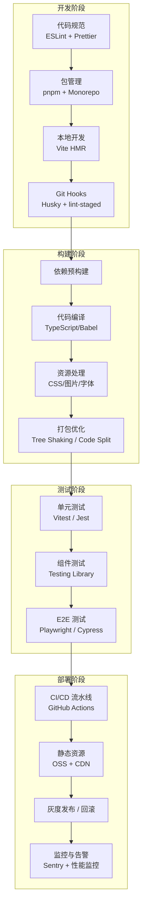
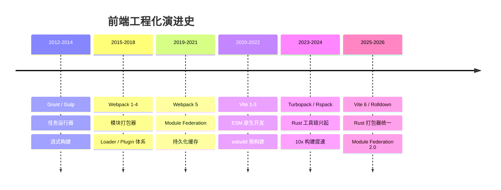

# 前端工程化概览

## ⭐ 面试重点速览

| 知识模块 | 重点内容 | 面试频率 |
|----------|----------|----------|
| 包管理与 Monorepo | npm/yarn/pnpm 对比、幽灵依赖、pnpm 硬链接机制、Turborepo | 高 |
| 构建工具 | Vite 6 vs Turbopack vs Rspack、ESM 原生开发、Rust 工具链 | 极高 |
| 代码规范 | ESLint + Prettier 分工、Husky + lint-staged、commitlint | 中高 |
| 微前端 | qiankun JS 沙箱、Module Federation、样式隔离 | 中高 |
| CI/CD | GitHub Actions 流水线、自动化部署 OSS + CDN | 中高 |
| CSS 工程化方案 | CSS Modules / CSS-in-JS / Tailwind 原子化 CSS 对比 | 中高 |
| Git 工作流 | Git Flow / GitHub Flow / GitLab Flow 对比、rebase vs merge | 中 |
| 前端测试 | 测试金字塔、Jest/Vitest 单元测试、Playwright E2E | 中高 |

---

## 什么是前端工程化

前端工程化是指将软件工程的方法论应用于前端开发，通过**规范化、模块化、组件化、自动化**四大手段，解决日益复杂的前端项目在开发、构建、部署、维护各阶段的问题，最终实现**高效、高质量、可维护**的交付体系。

::: tip 核心目标
前端工程化不是某个具体工具，而是一套**贯穿开发全生命周期的方法论体系**：
- **规范化**：代码风格统一、Git 提交规范、目录结构约束
- **模块化**：ESM / CommonJS 模块拆分、依赖管理、Monorepo
- **组件化**：UI 组件复用、业务逻辑封装、跨项目共享
- **自动化**：构建打包、CI/CD、自动化测试、自动部署
:::

---

## 全链路工程化体系

---

## 各子模块简介

| 子模块 | 核心内容 | 关键工具 |
|--------|----------|----------|
| [包管理与 Monorepo](./package-manager.md) | npm/yarn/pnpm 对比、幽灵依赖、pnpm 硬链接、Turborepo 增量构建 | pnpm、Turborepo、Nx |
| [构建工具](./build-tools/index.md) | Vite 6 双引擎、Turbopack 增量计算、Rspack Webpack 兼容 | Vite、Turbopack、Rspack |
| [代码规范](./code-standards.md) | ESLint AST 规则、Prettier 格式化、Husky Git Hooks、commitlint | ESLint、Prettier、Husky |
| [微前端](./micro-frontends.md) | qiankun 沙箱隔离、Module Federation、single-spa | qiankun、Module Federation |
| [CI/CD](./ci-cd.md) | 前端自动化流程、GitHub Actions 实践 | 自动化检查→构建→部署 | 1~2 天 |
| [CSS 工程化方案](./css-architectures.md) | CSS Modules/CSS-in-JS/Tailwind | 对比选型 | 1~2 天 |
| [Git 工作流](./git-workflow.md) | Git Flow/GitHub Flow/GitLab Flow | rebase vs merge | 1 天 |
| [前端测试](./testing.md) | 测试金字塔/Jest/Vitest/Playwright | 单元测试/E2E | 2~3 天 |

---

## 工程化演进脉络

---

## 面试高频问题汇总

### Q1：前端工程化解决了什么问题？

前端工程化解决的是**规模化协作**问题。当项目从单人单页发展到多人多页、从简单静态页面发展到复杂 SPA / SSR 应用时：

- **开发效率**：HMR 热更新替代手动刷新，TypeScript 类型系统减少运行时错误
- **代码质量**：ESLint + Prettier 统一代码风格，自动化测试覆盖核心逻辑
- **协作规范**：Git Hooks 强制检查、约定式提交，减少无效 Code Review
- **构建性能**：从 Webpack 冷启动 30s+ 到 Vite 毫秒级启动
- **部署安全**：CI/CD 自动化流水线，灰度发布 + 快速回滚

::: danger 面试中容易暴露的问题
只罗列工具名称而说不清每个工具解决的具体问题，这是工程化面试的**致命伤**。面试官关注的是你**为什么选择这个工具**以及**它解决了什么痛点**，而不是你会用这个工具。
:::

### Q2：如何从零搭建一个企业级前端项目？

完整的工程化项目搭建步骤：

1. **包管理器选择**：pnpm + workspace 实现 Monorepo
2. **构建工具**：Vite 6（新项目）/ Rspack（Webpack 迁移）
3. **代码规范**：ESLint + Prettier + Husky + lint-staged + commitlint
4. **TypeScript 严格模式**：开启 `strict: true`，配置路径别名
5. **测试框架**：Vitest（单元测试）+ Playwright（E2E）
6. **CI/CD**：GitHub Actions 配置 lint → test → build → deploy 流水线
7. **部署方案**：静态资源 OSS + CDN，或 Docker + Nginx 容器化
8. **监控体系**：Sentry 错误追踪 + Web Vitals 性能监控

### Q3：Vite 为什么比 Webpack 快那么多？

核心在于**开发模式下的架构差异**：

- **Webpack**：必须将所有模块打包成一个或多个 bundle 后才启动开发服务器，项目越大启动越慢
- **Vite**：利用浏览器原生 ESM 能力，按需编译，只编译当前页面实际 import 的模块。依赖使用 esbuild（Go 编写）预构建，速度快 10-100 倍

生产环境下 Vite 6 使用 Rolldown（Rust）替代 Rollup，构建速度也有显著提升。

### Q4：Monorepo 和 Multirepo 怎么选？

| 场景 | 推荐方案 | 原因 |
|------|----------|------|
| 多个项目共享组件/工具库 | Monorepo | 统一版本管理，跨项目重构更容易 |
| 独立部署的微服务 | Multirepo | 独立 CI/CD，团队自治 |
| 10 人以下小团队 | Monorepo | 降低管理开销 |
| 100 人以上大团队 | 混合方案 | 核心库 Monorepo + 业务项目 Multirepo |

---

## 面试追问环节

**Q：你们项目的构建时间多长？做过哪些优化？**

这是一个**必问的实战问题**。回答思路：

1. 先描述现状（如 Webpack 冷启动 45s，Vite 迁移后降到 2s）
2. 列举具体优化手段：拆分 node_modules vendor chunk、开启持久化缓存、升级到 Rust 工具链
3. 强调数据对比（构建时间从 X 降到 Y）

**Q：pnpm 解决了 npm 的什么问题？**

三个核心问题：
- **幽灵依赖**：npm 的扁平化 node_modules 导致可以访问未声明的依赖
- **磁盘占用**：npm 每个项目复制一份，pnpm 使用全局 store + 硬链接
- **安装速度**：pnpm 的硬链接不需要复制文件内容，速度更快

**Q：如果让你设计一个构建工具，你会考虑哪些核心能力？**

1. **开发体验**：毫秒级冷启动、增量编译、精准 HMR
2. **构建性能**：并行编译、持久化缓存、按需编译
3. **生态兼容**：兼容现有 Webpack/Vite 插件生态
4. **产物优化**：Tree Shaking、Code Splitting、资源压缩
5. **扩展性**：插件机制、自定义 Loader/Transform