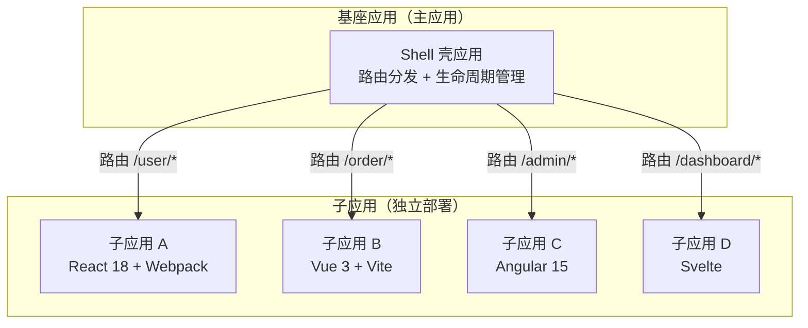
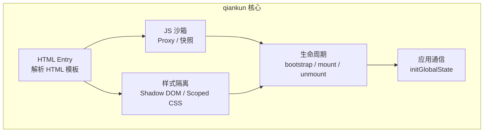

# 微前端

## ⭐ 面试重点速览

| 知识模块 | 重点内容 | 面试频率 |
|----------|----------|----------|
| 微前端架构价值 | 独立部署、技术栈无关、增量升级、团队自治 | 极高 |
| qiankun 原理 | HTML Entry、JS 沙箱（Proxy/快照）、样式隔离 | 极高 |
| single-spa | 微前端基础框架、生命周期管理 | 中 |
| Module Federation | Webpack 5 模块联邦、Vite 模块联邦、运行时共享 | 高 |

---

## 微前端架构价值

### 什么是微前端

微前端（Micro Frontends）是一种将前端应用**分解为更小、更简单的独立模块**的架构模式，每个模块可以由不同团队独立开发、测试和部署。



### 核心价值

| 价值 | 说明 | 典型场景 |
|------|------|----------|
| **独立部署** | 子应用可以独立发布，互不影响 | 电商平台：商品模块、订单模块、用户模块独立上线 |
| **技术栈无关** | 每个子应用可以使用不同框架 | 老项目用 jQuery，新项目用 Vue 3，渐进式迁移 |
| **增量升级** | 逐个替换旧系统，避免大规模重写 | 将 Angular 1.x 应用逐步迁移到 React |
| **团队自治** | 不同团队独立开发，减少协作成本 | 多个业务线团队并行开发 |
| **故障隔离** | 一个子应用崩溃不影响其他子应用 | 支付模块故障不影响商品浏览 |

::: danger 微前端不是银弹
微前端也带来了复杂性：
- **性能开销**：多个子应用加载额外的 JS/CSS，首屏可能变慢
- **环境隔离**：JS 沙箱、CSS 隔离、全局变量冲突处理
- **通信成本**：子应用间通信比单体应用复杂
- **运维成本**：多个子应用的 CI/CD 流水线、版本管理

**建议**：10 人以下团队、项目不复杂时，单体应用更合适。
:::

---

## qiankun 原理

qiankun 是基于 single-spa 的微前端框架，由蚂蚁集团开源，是目前国内最流行的微前端方案。

### 核心架构



### HTML Entry

qiankun 通过**解析 HTML 模板**来加载子应用，而不是直接加载 JS bundle：

```javascript
// 注册子应用
import { registerMicroApps, start } from 'qiankun'

registerMicroApps([
  {
    name: 'react-app',
    // ⭐ HTML Entry：直接指向子应用的 HTML 入口
    entry: '//localhost:3001',
    container: '#subapp-container',
    activeRule: '/react',
    // 子应用生命周期
    props: { sharedData: {} },
  },
  {
    name: 'vue-app',
    entry: '//localhost:3002',
    container: '#subapp-container',
    activeRule: '/vue',
  },
])

start()
```

::: tip HTML Entry 的优势
- **零配置接入**：子应用不需要额外配置，只需提供可访问的 URL
- **独立开发**：子应用可以独立开发和部署，有自己完整的 HTML/JS/CSS
- **自动解析**：qiankun 自动解析 HTML 中的 `<script>` 和 `<link>` 标签，注入到容器中
:::

### JS 沙箱实现

JS 沙箱是 qiankun 最核心的机制，用于隔离子应用的全局变量，防止冲突。

#### 方案一：Proxy 沙箱（推荐）

```javascript
// 简化版 Proxy 沙箱实现
class ProxySandbox {
  constructor(name) {
    this.name = name
    // 伪造的 window 对象
    this.fakeWindow = {}
    // 记录修改的全局变量（用于卸载时恢复）
    this.modifiedProps = new Map()

    // ⭐ 核心：使用 Proxy 拦截 window 的读写
    this.proxy = new Proxy(window, {
      // 读取：优先从 fakeWindow 读取，否则从真实 window 读取
      get(target, key) {
        if (key in this.fakeWindow) {
          return this.fakeWindow[key]
        }
        return target[key]
      },

      // 写入：写入 fakeWindow，记录修改
      set(target, key, value) {
        // 记录原始值，用于卸载时恢复
        if (!this.modifiedProps.has(key)) {
          this.modifiedProps.set(key, target[key])
        }
        this.fakeWindow[key] = value
        return true
      },
    })
  }

  // 激活沙箱
  active() {
    // 恢复之前记录的修改
    this.modifiedProps.forEach((value, key) => {
      window[key] = this.fakeWindow[key]
    })
  }

  // 关闭沙箱
  inactive() {
    // 恢复 window 的原始值
    this.modifiedProps.forEach((originalValue, key) => {
      window[key] = originalValue
    })
  }
}
```

#### 方案二：快照沙箱（兼容旧浏览器）

```javascript
// 简化版快照沙箱实现
class SnapshotSandbox {
  constructor(name) {
    this.name = name
    this.windowSnapshot = {}  // 快照存储
    this.modifyPropsMap = {}  // 修改记录
  }

  // 激活：保存当前 window 快照，恢复子应用修改
  active() {
    // 1. 保存当前 window 的快照
    for (const key of Object.keys(window)) {
      this.windowSnapshot[key] = window[key]
    }
    // 2. 恢复子应用的修改
    Object.keys(this.modifyPropsMap).forEach(key => {
      window[key] = this.modifyPropsMap[key]
    })
  }

  // 关闭：记录子应用修改，恢复 window 快照
  inactive() {
    // 1. 记录子应用对 window 的修改
    for (const key of Object.keys(window)) {
      if (window[key] !== this.windowSnapshot[key]) {
        this.modifyPropsMap[key] = window[key]
        // 2. 恢复 window 到快照状态
        window[key] = this.windowSnapshot[key]
      }
    }
  }
}
```

### 样式隔离

| 方案 | 原理 | 优点 | 缺点 |
|------|------|------|------|
| **Shadow DOM** | 浏览器原生隔离 | 完美隔离，互不影响 | 部分 UI 库不兼容（如弹窗挂载到 body） |
| **Scoped CSS** | 自动添加前缀（如 `data-qiankun="app1"`） | 兼容性好 | 无法隔离动态插入的样式 |
| **CSS Modules** | 构建时生成唯一类名 | 零运行时开销 | 需要子应用配合 |
| **约定命名空间** | BEM 或 CSS 前缀 | 最简单 | 依赖人工维护 |

```javascript
// qiankun 配置样式隔离
registerMicroApps([
  {
    name: 'react-app',
    entry: '//localhost:3001',
    container: '#subapp-container',
    activeRule: '/react',
    // ⭐ 开启严格的样式隔离（使用 Shadow DOM）
    sandbox: {
      experimentalStyleIsolation: true,  // Scoped CSS
      strictStyleIsolation: true,         // Shadow DOM（更严格）
    },
  },
])
```

---

## single-spa 基础

single-spa 是微前端的**基础框架**，qiankun 在其之上进行了封装。理解 single-spa 有助于理解微前端的底层原理。

### 生命周期

```javascript
// single-spa 子应用必须导出三个生命周期函数
const reactApp = {
  // 初始化（只执行一次）
  bootstrap() {
    return Promise.resolve()
  },

  // 挂载（每次激活时执行）
  mount(props) {
    return new Promise((resolve) => {
      ReactDOM.render(<App />, document.getElementById('app'))
      resolve()
    })
  },

  // 卸载（每次离开时执行）
  unmount(props) {
    return new Promise((resolve) => {
      ReactDOM.unmountComponentAtNode(document.getElementById('app'))
      resolve()
    })
  },
}
```

```javascript
// 注册和启动
import { registerApplication, start } from 'single-spa'

registerApplication({
  name: 'reactApp',
  app: () => import('./reactApp'),  // 懒加载子应用
  activeWhen: '/react',              // 激活路由
})

start()
```

---

## Module Federation（模块联邦）

### Webpack 5 Module Federation

```javascript
// webpack.config.js —— 宿主应用
module.exports = {
  plugins: [
    new ModuleFederationPlugin({
      name: 'host',
      remotes: {
        // 声明远程应用
        app1: 'app1@http://localhost:3001/remoteEntry.js',
        app2: 'app2@http://localhost:3002/remoteEntry.js',
      },
      shared: {
        react: { singleton: true, eager: true },  // 单例共享
        'react-dom': { singleton: true, eager: true },
      },
    }),
  ],
}
```

```javascript
// webpack.config.js —— 远程应用
module.exports = {
  plugins: [
    new ModuleFederationPlugin({
      name: 'app1',
      filename: 'remoteEntry.js',  // 远程入口文件
      exposes: {
        // 暴露的模块
        './Button': './src/components/Button',
        './Header': './src/components/Header',
        './store': './src/store',
      },
      shared: ['react', 'react-dom'],
    }),
  ],
}
```

```javascript
// 宿主应用中使用远程组件
import React, { Suspense, lazy } from 'react'

// 动态导入远程组件
const RemoteButton = lazy(() => import('app1/Button'))
const RemoteHeader = lazy(() => import('app1/Header'))

function App() {
  return (
    <Suspense fallback={<div>Loading...</div>}>
      <RemoteHeader />
      <RemoteButton onClick={() => alert('clicked')}>
        Remote Button
      </RemoteButton>
    </Suspense>
  )
}
```

### Vite Module Federation

```typescript
// vite.config.ts
import federation from '@originjs/vite-plugin-federation'

export default defineConfig({
  plugins: [
    federation({
      name: 'host-app',
      remotes: {
        remote_app: 'http://localhost:5001/assets/remoteEntry.js',
      },
      shared: ['react', 'react-dom'],
    }),
  ],
  build: {
    target: 'esnext',
  },
})
```

---

## 微前端通信方案

| 方案 | 原理 | 适用场景 |
|------|------|----------|
| **Props 传递** | 主应用通过 props 向子应用传递数据 | 简单的主→子单向通信 |
| **initGlobalState** | qiankun 内置的全局状态管理 | 简单的跨应用状态共享 |
| **Custom Events** | 浏览器原生事件机制 | 松耦合的跨应用通信 |
| **Shared Store** | 共享状态管理库（如 Redux/Zustand） | 复杂的状态管理需求 |
| **URL 参数** | 通过 URL query 传递 | 页面跳转时的参数传递 |

```javascript
// qiankun initGlobalState 示例
import { initGlobalState } from 'qiankun'

// 主应用初始化全局状态
const actions = initGlobalState({ user: { name: 'Guest' } })

// 监听状态变化
actions.onGlobalStateChange((state, prev) => {
  console.log('状态变化:', state, prev)
})

// 修改状态
actions.setGlobalState({ user: { name: 'Admin' } })
```

---

## 面试高频问题汇总

### Q1：微前端解决了什么问题？

微前端解决的是**大型前端应用的组织和协作问题**：

1. **巨石应用困境**：当单体应用代码量超过 10 万行，构建时间 5 分钟+，任何改动都影响全局
2. **技术栈锁定**：无法在单体应用中混用不同框架（React + Vue）
3. **团队协作瓶颈**：所有团队修改同一个代码仓库，合并冲突频繁
4. **增量升级困难**：无法逐步替换旧技术栈，只能全部重写

### Q2：qiankun 的 JS 沙箱是怎么实现的？

qiankun 提供两种沙箱方案：

**Proxy 沙箱（现代浏览器）**：
- 使用 `new Proxy(window, handler)` 拦截 window 的读写
- 读操作：优先从子应用自己的 `fakeWindow` 读取
- 写操作：写入 `fakeWindow`，同时记录原始值用于卸载时恢复

**快照沙箱（兼容旧浏览器）**：
- 激活时：保存当前 window 的快照，恢复子应用之前修改的值
- 关闭时：记录子应用对 window 的修改，恢复 window 到快照状态

### Q3：Module Federation 和 qiankun 有什么区别？

| 维度 | qiankun | Module Federation |
|------|---------|-------------------|
| **粒度** | 应用级（整个子应用） | 模块级（单个组件/模块） |
| **加载方式** | HTML Entry（完整 HTML） | JS Entry（remoteEntry.js） |
| **隔离性** | JS 沙箱 + CSS 隔离 | 依赖共享（shared） |
| **通信** | initGlobalState / props | 函数调用 / props |
| **构建工具** | 框架无关 | Webpack 5 / Vite Plugin |
| **适用场景** | 独立应用组合 | 组件级共享 |

---

## 面试追问环节

**Q：微前端项目的性能怎么优化？**

1. **公共依赖提取**：将 React/Vue 等公共依赖作为 `externals` 或 `shared`，避免重复加载
2. **预加载**：qiankun 的 `prefetch` 配置，在空闲时预加载子应用
3. **按需加载**：根据路由懒加载子应用，减少首屏体积
4. **CDN 加速**：子应用的静态资源部署到 CDN
5. **缓存策略**：子应用的 JS/CSS 使用 `contenthash` 命名，充分利用浏览器缓存

**Q：微前端子应用之间如何通信？**

1. **简单场景**：qiankun 的 `initGlobalState` 或 Custom Events
2. **复杂场景**：通过 Module Federation 共享状态管理库
3. **最佳实践**：尽量减少跨应用通信，保持子应用独立性。如果通信频繁，说明拆分粒度可能不合理

**Q：微前端项目的 CI/CD 怎么做？**

每个子应用有独立的 CI/CD 流水线，主应用只负责注册和路由分发。关键是：
- 子应用独立构建和部署
- 主应用通过配置中心动态获取子应用的入口地址
- 灰度发布时，可以只灰度某个子应用，不影响其他子应用