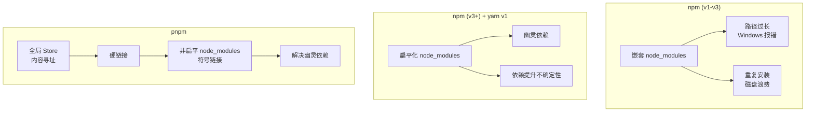
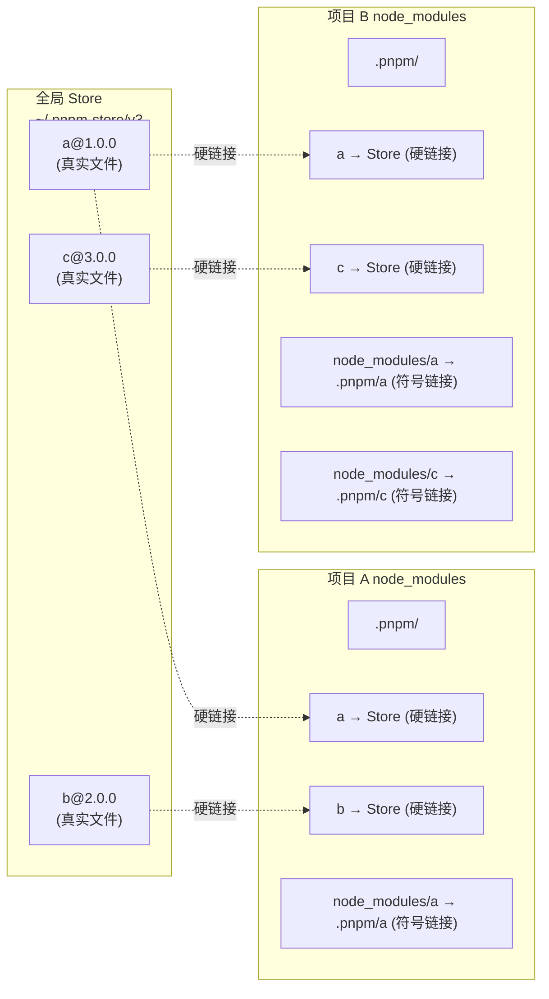
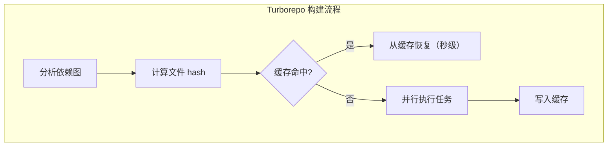

# 包管理与 Monorepo

## ⭐ 面试重点速览

| 知识模块 | 重点内容 | 面试频率 |
|----------|----------|----------|
| npm/yarn/pnpm 对比 | 安装速度、磁盘占用、node_modules 结构差异 | 极高 |
| 幽灵依赖 | 产生原因、危害、pnpm 解决方案 | 极高 |
| pnpm 机制 | 硬链接 + 符号链接、内容寻址存储 | 高 |
| Monorepo | pnpm workspace、Turborepo 增量构建 | 高 |
| lockfile | 作用机制、版本锁定策略 | 中 |

---

## npm / yarn / pnpm 全方位对比



| 特性 | npm | yarn (v1 / v4) | pnpm |
|------|-----|----------------|------|
| **node_modules 结构** | 扁平化（v3+） | 扁平化 | 非扁平（符号链接模拟） |
| **安装速度** | 较慢 | 较快（并行下载） | 最快（硬链接免复制） |
| **磁盘占用** | 大（每个项目一份副本） | 较大 | 小（全局 store 共享） |
| **幽灵依赖** | 存在 | 存在 | **不存在**（严格隔离） |
| **Monorepo 支持** | workspaces（基础） | workspaces | workspaces（原生） |
| **lockfile 格式** | package-lock.json | yarn.lock / yarn-4.lock | pnpm-lock.yaml |
| **依赖提升（hoisting）** | 默认提升 | 默认提升 | 默认不提升（可配置） |

---

## Hoisting 原理与幽灵依赖问题

### 什么是依赖提升（Hoisting）？

npm 为了避免嵌套层级过深（node_modules 地狱），将所有依赖**提升到顶层的 node_modules**，形成扁平化结构：

```
# npm 扁平化后（可能出现）
node_modules/
├── A@1.0.0
├── B@1.0.0
├── C@2.0.0      # 被提升到顶层（虽然你只依赖 A 和 B）
└── D@1.0.0      # 被提升到顶层
```

### 什么是幽灵依赖（Phantom Dependency）？

幽灵依赖是指：**你的代码引用了 `package.json` 中没有声明的包，但因为 npm 的依赖提升，该包恰好被提升到了顶层 node_modules，导致代码可以正常运行**。

::: danger 幽灵依赖的危害
```javascript
// package.json 中没有声明 dayjs，但某个依赖间接依赖了它
// npm flat 后，dayjs 被提升到了 node_modules 顶层
// 以下代码在 npm 下可以正常运行，但在 pnpm 下会报错！
import dayjs from 'dayjs' // !!! 幽灵依赖

console.log(dayjs().format('YYYY-MM-DD'))
```

**问题**：
1. **隐式依赖**：版本升级时，间接依赖可能被移除，导致项目报错
2. **版本不确定性**：不同机器上提升策略可能不同，导致行为不一致
3. **安全问题**：审核依赖时容易遗漏
:::

---

## pnpm 核心机制：硬链接 + 符号链接



::: tip pnpm 三层链接机制
1. **全局 Store**：`~/.pnpm-store/v3/` 存储所有包的真实文件，使用内容寻址（CAS）按 hash 组织
2. **硬链接（Hard Link）**：项目 `node_modules/.pnpm/` 通过硬链接指向全局 Store，不复制文件内容，磁盘占用接近 0
3. **符号链接（Symbolic Link）**：项目 `node_modules/` 顶层通过符号链接指向 `.pnpm/` 中的对应包，**只暴露直接依赖**
:::

### pnpm 为什么严格？

```bash
# pnpm 的 node_modules 结构
node_modules/
├── .pnpm/                    # 所有依赖的真实存储（硬链接）
│   ├── react@18.2.0/
│   │   └── node_modules/
│   │       └── react/        # 硬链接 → 全局 Store
│   └── scheduler@0.23.0/
│       └── node_modules/
│           └── scheduler/
├── react -> .pnpm/react@18.2.0/node_modules/react      # 符号链接（只暴露直接依赖）
└── vue -> .pnpm/vue@3.5.0/node_modules/vue
# 注意：scheduler 是 react 的依赖，不会出现在顶层！
# 代码中无法 import 'scheduler' → 幽灵依赖被彻底杜绝
```

---

## pnpm Workspace 配置

### Monorepo 项目结构

```yaml
# pnpm-workspace.yaml
packages:
  - 'packages/*'     # 公共包（组件库、工具库）
  - 'apps/*'         # 应用（管理后台、H5、小程序）
  - '!**/test/**'    # 排除测试目录
```

```json
// 根 package.json
{
  "scripts": {
    "dev": "turbo dev",              // 并行启动所有应用
    "build": "turbo build",          // Turborepo 增量构建
    "lint": "turbo lint",
    "test": "turbo test"
  },
  "devDependencies": {
    "turbo": "^2.0.0",
    "typescript": "^5.5.0"
  }
}
```

### 子包引用

```json
// apps/admin/package.json
{
  "name": "@myorg/admin",
  "dependencies": {
    "@myorg/ui": "workspace:*",       // workspace 协议 —— 引用本地包
    "@myorg/utils": "workspace:^1.0.0"
  }
}
```

---

## Monorepo vs 多仓库对比

| 维度 | Monorepo（单仓） | Multirepo（多仓） |
|------|-----------------|-------------------|
| **代码共享** | 直接 import，零成本 | 需要发布 npm 包，版本管理复杂 |
| **重构成本** | 低（一次修改，全仓生效） | 高（需要逐个仓库提交和发版） |
| **CI/CD** | 需要增量构建（Turborepo） | 独立流水线，天然隔离 |
| **权限控制** | 较难细粒度控制 | 仓库级别天然隔离 |
| **代码规模** | 随项目增长，clone 变慢 | 每个仓库较小 |
| **适用场景** | 紧密协作的小团队 / 跨项目共享 | 独立部署的微服务 / 大团队 |

---

## Turborepo 增量构建



### Turborepo 核心能力

**1. 缓存机制**

```json
// turbo.json
{
  "pipeline": {
    "build": {
      "dependsOn": ["^build"],  // 先构建依赖包
      "outputs": ["dist/**", ".next/**"],     // 缓存输出目录
      "cache": true
    },
    "test": {
      "dependsOn": ["build"],
      "cache": true,
      "inputs": ["src/**", "test/**"]         // 缓存输入文件
    },
    "dev": {
      "cache": false,                          // 开发模式不使用缓存
      "persistent": true                       // 长期运行
    }
  }
}
```

**2. 并行执行**

Turborepo 根据依赖图自动决定任务执行顺序。如果 `app-a` 依赖 `lib-b`，则先构建 `lib-b`，再并行构建 `app-a` 和 `app-c`（如果它们都依赖 `lib-b`）。

**3. 远程缓存（Remote Cache）**

```bash
# Vercel 远程缓存 —— 团队成员共享缓存
turbo build --remote-cache
```

::: warning Turborepo 的坑
- 缓存 key 是基于文件 hash 的，环境变量变化不会触发缓存失效（需手动配置 `env`）
- 依赖图的 `^` 前缀很重要：`dependsOn: ["^build"]` 表示先构建依赖它的包，再构建自己
- 如果某个包构建失败，下游所有包都会失败（fail-fast 策略）
:::

---

## lockfile 机制

| lockfile | 包管理器 | 格式 | 特点 |
|----------|----------|------|------|
| `package-lock.json` | npm | JSON | 嵌套结构，文件较大 |
| `yarn.lock` | Yarn (v1/v4) | YAML-like | 简洁紧凑，合并冲突处理优秀 |
| `pnpm-lock.yaml` | pnpm | YAML | 与 pnpm 的虚拟存储结构对应 |

::: tip lockfile 的核心作用
1. **锁定依赖版本**：确保团队成员和 CI 环境安装的依赖完全一致
2. **记录依赖树**：包括间接依赖的精确版本，保证可复现构建
3. **加速安装**：npm/pnpm 可跳过解析步骤，直接按 lockfile 安装

**重要**：lockfile **必须提交到 Git**。`.gitignore` 中不应包含 lockfile，否则不同环境可能安装不同版本的依赖。
:::

---

## 面试高频问题汇总

### Q1：pnpm 为什么比 npm 快？

**三个核心原因**：

1. **硬链接免复制**：npm/yarn 每个项目完整复制依赖文件，pnpm 使用硬链接直接指向全局 Store，无需复制文件内容
2. **非扁平结构**：不需要做复杂的依赖提升算法，安装逻辑更简单
3. **并行下载**：所有包管理器都支持并行下载，但 pnpm 的实现效率更高

以安装一个包含 1000 个依赖的项目为例：
- npm：45s（复制所有文件）
- yarn：30s（并行 + 缓存）
- pnpm：10s（硬链接 + 非扁平）

### Q2：什么是幽灵依赖？pnpm 如何解决？

幽灵依赖是 npm/yarn 扁平化 node_modules 的副产品 —— 间接依赖被提升到顶层，代码可以 `import` 未在 `package.json` 声明的包。

pnpm 的解决方案：
- 所有依赖存储在 `.pnpm/` 虚拟目录
- 顶层 `node_modules/` **只用符号链接暴露直接依赖**
- 间接依赖无法被 `import`，运行时直接报错

### Q3：Monorepo 中的循环依赖怎么处理？


**解决方法**：
1. **提取公共模块**：将共享逻辑抽到 `lib-core`，A 和 B 都依赖 `lib-core`
2. **使用 peerDependencies**：不直接依赖，而是声明为对等依赖
3. **Turborepo 检测**：`turbo build --graph` 可输出依赖图，自动检测循环
4. **根本原则**：在架构层面避免循环依赖，它是设计缺陷的信号

---

## 面试追问环节

**Q：为什么你的项目选择 pnpm 而不是 yarn？**

三个决策因素：
1. **磁盘效率**：多个 Monorepo 子项目共享依赖，pnpm 节省 50%+ 磁盘
2. **幽灵依赖杜绝**：pnpm 严格模式防止依赖混乱，提高代码可维护性
3. **原生 Monorepo**：workspace 协议 `workspace:*` 比 yarn 的 `workspace:*` 更可靠

**Q：lockfile 冲突了怎么办？**

1. pnpm 最佳：删除 lockfile，`pnpm install` 重新生成（pnpm 的 lockfile 确定性最强）
2. npm：手动解决冲突，或者接受一方的版本，另一人重新 install
3. **预防措施**：在 CI 中加入 lockfile 完整性检查 `pnpm install --frozen-lockfile`

**Q：Turborepo 的缓存 key 是如何计算的？**

缓存 key = hash(包名 + 依赖项 hash + 源代码文件 hash + 环境变量)

只有当前一个依赖都没变、源代码完全不变的**秒级缓存命中**时，才会跳过构建，否则重新执行并更新缓存。