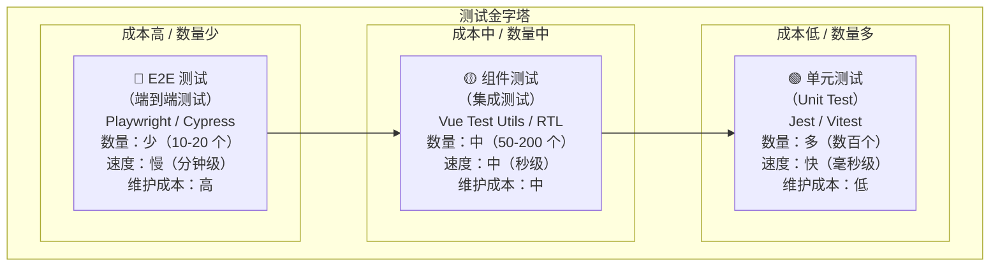
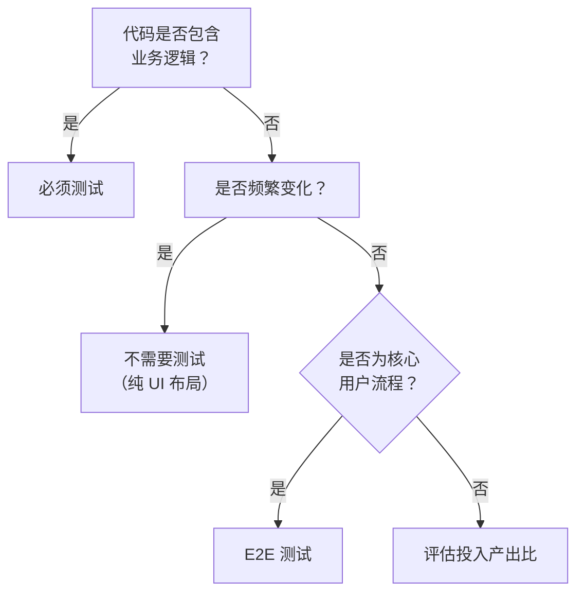

# 前端测试

## ⭐ 面试重点速览

| 知识模块 | 重点内容 | 面试频率 |
|----------|----------|----------|
| 测试金字塔 | 单元测试 → 组件测试 → E2E 测试 三层模型 | 极高 |
| 单元测试（Jest/Vitest） | 匹配器、mock 函数、快照测试、代码覆盖率 | 极高 |
| 组件测试（Testing Library） | 查询元素、模拟事件、断言渲染结果 | 高 |
| E2E 测试（Playwright/Cypress） | 用户视角、跨浏览器、截图对比、网络拦截 | 高 |
| 测试策略 | 哪些需要测试、哪些不需要、覆盖率目标 | 中高 |

---

## 测试金字塔

测试金字塔是由 Mike Cohn 提出的经典测试策略模型，描述了不同类型测试的**数量比例**和**投入产出比**。



### 三层详解

| 层级 | 测试范围 | 典型工具 | 运行速度 | 维护成本 | 数量占比 |
|------|----------|----------|----------|----------|----------|
| **单元测试** | 单个函数、方法、工具类 | Jest / Vitest | 毫秒级 | 低 | 70% |
| **组件测试** | 单个组件及其交互 | Vue Test Utils / RTL | 秒级 | 中 | 20% |
| **E2E 测试** | 完整用户流程 | Playwright / Cypress | 分钟级 | 高 | 10% |

::: tip 测试金字塔的核心原则
- **越底层，测试越多**：单元测试覆盖所有边界情况，成本最低
- **越顶层，测试越少**：E2E 测试只覆盖核心业务流程，成本最高
- **不要倒置金字塔**：如果 E2E 测试比单元测试还多，说明测试策略有问题
- **不要变成冰淇淋筒**：UI 测试多、单元测试少，测试运行慢、维护成本高
:::

---

## 单元测试（Jest / Vitest）

### 基础用法

```javascript
// =============================================
// 一个完整的单元测试文件
// =============================================
import { describe, it, expect, beforeAll, beforeEach } from 'vitest'

// 被测试的函数
function add(a, b) {
  return a + b
}

function getUser(id) {
  if (id <= 0) throw new Error('Invalid ID')
  return { id, name: `User ${id}` }
}

// 测试套件
describe('add 函数', () => {
  // 测试用例
  it('两个正数相加', () => {
    expect(add(1, 2)).toBe(3)
  })

  it('负数相加', () => {
    expect(add(-1, -2)).toBe(-3)
  })

  it('小数相加', () => {
    // 浮点数不要用 toBe，用 toBeCloseTo
    expect(add(0.1, 0.2)).toBeCloseTo(0.3)
  })
})

describe('getUser 函数', () => {
  it('正常返回用户对象', () => {
    const user = getUser(1)
    // 对象比较用 toEqual
    expect(user).toEqual({ id: 1, name: 'User 1' })
  })

  it('非法 ID 抛出异常', () => {
    // 测试异常用 toThrow
    expect(() => getUser(0)).toThrow('Invalid ID')
    expect(() => getUser(-1)).toThrow()
  })
})
```

### 常用匹配器

```javascript
// =============================================
// 基本匹配器
// =============================================
expect(2 + 2).toBe(4)               // 严格相等（===）
expect({ a: 1 }).toEqual({ a: 1 })  // 深度相等
expect(null).toBeNull()             // 是 null
expect(undefined).toBeUndefined()   // 是 undefined
expect(1).toBeDefined()             // 不是 undefined
expect(true).toBeTruthy()           // 真值
expect(false).toBeFalsy()           // 假值

// =============================================
// 数字匹配器
// =============================================
expect(4).toBeGreaterThan(3)        // 大于
expect(4).toBeGreaterThanOrEqual(4) // 大于等于
expect(4).toBeLessThan(5)           // 小于
expect(4).toBeLessThanOrEqual(4)    // 小于等于
expect(0.1 + 0.2).toBeCloseTo(0.3)  // 浮点数

// =============================================
// 字符串匹配器
// =============================================
expect('Hello World').toMatch(/Hello/)  // 正则匹配
expect('Hello World').toContain('lo')   // 包含子串

// =============================================
// 数组/可迭代对象匹配器
// =============================================
expect([1, 2, 3]).toContain(2)          // 包含元素
expect([1, 2, 3]).toHaveLength(3)       // 长度
expect(new Set([1, 2])).toContain(1)    // Set 也支持

// =============================================
// 异常匹配器
// =============================================
expect(() => { throw new Error('fail') }).toThrow()
expect(() => { throw new Error('fail') }).toThrow('fail')
expect(() => { throw new Error('fail') }).toThrow(/fail/)
```

### Mock 函数

Mock 是单元测试中**最核心的技术**，用于隔离被测代码的依赖。

```javascript
import { describe, it, expect, vi } from 'vitest'

// =============================================
// 1. 创建 Mock 函数
// =============================================
describe('Mock 函数基础', () => {
  it('观察函数调用', () => {
    const mockFn = vi.fn()

    mockFn('hello', 42)
    mockFn('world')

    // 断言调用次数
    expect(mockFn).toHaveBeenCalledTimes(2)
    // 断言参数
    expect(mockFn).toHaveBeenCalledWith('hello', 42)
    // 断言返回值
    expect(mockFn).toHaveReturned()
  })

  it('指定返回值', () => {
    const mockFn = vi.fn()
    mockFn.mockReturnValue('default')       // 默认返回值
    mockFn.mockReturnValueOnce('first')      // 第一次调用返回
    mockFn.mockReturnValueOnce('second')     // 第二次调用返回

    expect(mockFn()).toBe('first')
    expect(mockFn()).toBe('second')
    expect(mockFn()).toBe('default')         // 后续调用返回默认值
  })

  it('模拟异步函数', () => {
    const mockFn = vi.fn()
    mockFn.mockResolvedValue({ data: 'ok' })     // 返回 Promise
    mockFn.mockRejectedValue(new Error('fail'))  // 返回 rejected Promise

    // 测试异步
    await expect(mockFn()).resolves.toEqual({ data: 'ok' })
  })
})

// =============================================
// 2. Mock 模块
// =============================================
describe('Mock 模块', () => {
  it('Mock 整个模块', () => {
    // 模拟 axios 模块
    vi.mock('axios', () => ({
      default: {
        get: vi.fn().mockResolvedValue({ data: { id: 1 } }),
        post: vi.fn().mockResolvedValue({ data: { success: true } }),
      }
    }))
  })

  it('Mock 部分模块', () => {
    // 模拟 lodash 的 debounce
    vi.mock('lodash/debounce', () => ({
      default: vi.fn((fn) => fn),  // 直接返回原函数，跳过防抖
    }))
  })
})

// =============================================
// 3. Spy（监听真实函数的调用）
// =============================================
describe('Spy 监听', () => {
  it('监听 console.log', () => {
    // 创建 spy，但保留原始实现
    const spy = vi.spyOn(console, 'log')

    console.log('test message')

    expect(spy).toHaveBeenCalledWith('test message')

    // 恢复原始实现
    spy.mockRestore()
  })

  it('Spy 并替换实现', () => {
    // 创建 spy，但替换实现
    const spy = vi.spyOn(Math, 'random').mockReturnValue(0.5)

    expect(Math.random()).toBe(0.5)
    expect(Math.random()).toBe(0.5)

    spy.mockRestore()
  })
})
```

### 快照测试（Snapshot Testing）

快照测试用于确保 UI 组件或数据结构的**输出不意外改变**。

```javascript
import { describe, it, expect } from 'vitest'

describe('快照测试', () => {
  it('简单数据快照', () => {
    const user = {
      id: 1,
      name: '张三',
      roles: ['admin', 'editor'],
      createdAt: '2024-01-01',
    }

    // 第一次运行：生成快照文件
    // 后续运行：与快照文件对比，不一致则失败
    expect(user).toMatchSnapshot()

    // 有意义的快照名称
    expect(user).toMatchSnapshot('用户张三的快照')
  })

  it('内联快照（自动写入测试文件）', () => {
    const result = { sum: 3, product: 2 }
    // 内联快照：`npx vitest --update` 自动更新测试文件
    expect(result).toMatchInlineSnapshot(`
      {
        "product": 2,
        "sum": 3,
      }
    `)
  })
})
```

::: warning 快照测试的注意事项
- **快照文件必须提交到 Git**：它们是测试的一部分，不是临时文件
- **快照失败时确认原因**：是预期变更还是意外 bug？用 `--update` 更新快照
- **不要过度使用**：快照适合稳定的输出（如纯函数、序列化数据），不适合频繁变化的 UI
- **快照内容要小**：全量渲染整个页面的快照难以维护，优先快照局部组件
:::

### 代码覆盖率

```bash
# 运行测试并生成覆盖率报告
npx vitest run --coverage

# 或使用 Jest
npx jest --coverage
```

覆盖率报告示例：

```
File              | % Stmts | % Branch | % Funcs | % Lines | Uncovered Line
------------------|---------|----------|---------|---------|----------------
 utils/format.ts  |   95.45 |    83.33 |     100 |   95.45 | 42
 utils/validate.ts|   87.50 |    66.67 |      80 |   87.50 | 18-22,35
 components/      |   72.34 |    55.00 |   66.67 |   72.34 | ...
------------------|---------|----------|---------|---------|----------------
All files         |   85.16 |    68.33 |   82.25 |   85.16 |
```

| 覆盖率类型 | 含义 | 说明 |
|-----------|------|------|
| **Stmts**（语句） | 被执行的语句比例 | 最基本的覆盖率 |
| **Branch**（分支） | 每个分支（if/else/switch）是否都被测试 | 最难达到 100% |
| **Funcs**（函数） | 被调用的函数比例 | 确保每个函数至少被测试一次 |
| **Lines**（行） | 被执行的代码行比例 | 类似 Stmts，但按行计算 |

::: tip 覆盖率目标
- **核心业务逻辑**：80%+ 覆盖率（重点在分支覆盖率）
- **工具函数**：90%+ 覆盖率
- **UI 组件**：不需要追求高覆盖率，重点测试交互逻辑
- **不要盲目追求 100%**：为了覆盖率而写测试，往往产出低质量的测试用例
:::

---

## 组件测试（Vue Test Utils / React Testing Library）

### 核心原则

组件测试应该**从用户角度**测试组件行为，而不是测试内部实现细节。

```javascript
// ⚠️ 不好的测试：测试内部状态
expect(wrapper.vm.count).toBe(1)

// ✅ 好的测试：测试用户看到的内容
expect(screen.getByText('计数：1')).toBeInTheDocument()
```

### Vue Test Utils 示例

```javascript
import { describe, it, expect } from 'vitest'
import { mount } from '@vue/test-utils'
import Counter from './Counter.vue'

describe('Counter 组件', () => {
  // =============================================
  // 渲染测试
  // =============================================
  it('渲染初始计数', () => {
    const wrapper = mount(Counter)
    expect(wrapper.text()).toContain('计数：0')
  })

  it('渲染传入的 props', () => {
    const wrapper = mount(Counter, {
      props: { initialCount: 10 }
    })
    expect(wrapper.text()).toContain('计数：10')
  })

  // =============================================
  // 交互测试
  // =============================================
  it('点击按钮增加计数', async () => {
    const wrapper = mount(Counter)

    // 查找按钮并点击
    await wrapper.find('[data-testid="increment"]').trigger('click')

    // 断言文本更新
    expect(wrapper.text()).toContain('计数：1')
  })

  // =============================================
  // 事件测试
  // =============================================
  it('组件触发 change 事件', async () => {
    const wrapper = mount(Counter)
    await wrapper.find('[data-testid="increment"]').trigger('click')

    // 断言组件触发了自定义事件
    expect(wrapper.emitted('change')).toBeTruthy()
    // 断言事件参数
    expect(wrapper.emitted('change')[0]).toEqual([1])
  })

  // =============================================
  // 插槽测试
  // =============================================
  it('渲染默认插槽内容', () => {
    const wrapper = mount(Counter, {
      slots: {
        default: '<span class="custom-label">自定义标签</span>'
      }
    })
    expect(wrapper.find('.custom-label').exists()).toBe(true)
  })
})
```

### React Testing Library 示例

```javascript
import { describe, it, expect } from 'vitest'
import { render, screen, fireEvent, waitFor } from '@testing-library/react'
import userEvent from '@testing-library/user-event'
import Counter from './Counter'

describe('Counter 组件', () => {
  // =============================================
  // 查询元素
  // =============================================
  it('渲染初始计数', () => {
    render(<Counter initialCount={0} />)

    // 多种查询方式
    expect(screen.getByText('计数：0')).toBeInTheDocument()
    expect(screen.getByRole('button', { name: '+' })).toBeInTheDocument()
    expect(screen.getByTestId('counter-value')).toHaveTextContent('0')
  })

  // =============================================
  // 模拟用户事件
  // =============================================
  it('点击按钮增加计数', async () => {
    const user = userEvent.setup()
    render(<Counter />)

    // 使用 userEvent（推荐，更接近真实用户行为）
    await user.click(screen.getByRole('button', { name: '+' }))

    expect(screen.getByTestId('counter-value')).toHaveTextContent('1')
  })

  // =============================================
  // 异步断言
  // =============================================
  it('异步加载数据', async () => {
    render(<UserList />)

    // 初始状态：显示加载中
    expect(screen.getByText('加载中...')).toBeInTheDocument()

    // 等待异步数据加载完成
    await waitFor(() => {
      expect(screen.getByText('张三')).toBeInTheDocument()
    })
  })
})
```

### 常用查询方法

| 查询类型 | 方法 | 找不到时 | 找到多个时 | 适用场景 |
|----------|------|----------|-----------|----------|
| `getBy...` | `getByText`、`getByRole` | 抛出错误 | 抛出错误 | 确定元素存在 |
| `queryBy...` | `queryByText`、`queryByRole` | 返回 null | 抛出错误 | 测试元素不存在 |
| `findBy...` | `findByText`、`findByRole` | 抛出错误（异步） | 抛出错误（异步） | 异步出现的元素 |
| `getAllBy...` | `getAllByText`、`getAllByRole` | 抛出错误 | 返回数组 | 多个元素 |

优先使用 `getByRole`（最接近无障碍体验），其次是 `getByText`、`getByLabelText`，最后才用 `getByTestId`。

---

## E2E 测试（Playwright / Cypress）

### Playwright 示例

```javascript
// =============================================
// playwright.config.ts
// =============================================
import { defineConfig } from '@playwright/test'

export default defineConfig({
  testDir: './e2e',
  timeout: 30000,
  // 支持多浏览器
  projects: [
    { name: 'chromium', use: { ...devices['Desktop Chrome'] } },
    { name: 'firefox', use: { ...devices['Desktop Firefox'] } },
    { name: 'webkit', use: { ...devices['Desktop Safari'] } },
    // 移动端测试
    { name: 'mobile', use: { ...devices['iPhone 13'] } },
  ],
  webServer: {
    command: 'npm run dev',
    port: 5173,
    reuseExistingServer: true,
  },
})
```

```javascript
// =============================================
// e2e/login.spec.ts —— 登录流程 E2E 测试
// =============================================
import { test, expect } from '@playwright/test'

test.describe('用户登录流程', () => {
  test('正常登录流程', async ({ page }) => {
    // 1. 访问登录页面
    await page.goto('/login')

    // 2. 填写表单
    await page.fill('[data-testid="username"]', 'admin')
    await page.fill('[data-testid="password"]', 'password123')

    // 3. 点击登录按钮
    await page.click('[data-testid="login-button"]')

    // 4. 断言：跳转到首页
    await expect(page).toHaveURL('/')

    // 5. 断言：页面显示用户名
    await expect(page.locator('[data-testid="user-name"]'))
      .toContainText('admin')
  })

  test('错误密码显示提示', async ({ page }) => {
    await page.goto('/login')
    await page.fill('[data-testid="username"]', 'admin')
    await page.fill('[data-testid="password"]', 'wrong')

    await page.click('[data-testid="login-button"]')

    // 断言：显示错误提示
    await expect(page.locator('.error-message'))
      .toContainText('用户名或密码错误')
  })
})

// =============================================
// 网络拦截
// =============================================
test('模拟 API 响应', async ({ page }) => {
  // 拦截 API 请求，返回模拟数据
  await page.route('**/api/users', (route) => {
    route.fulfill({
      status: 200,
      contentType: 'application/json',
      body: JSON.stringify([
        { id: 1, name: '模拟用户1' },
        { id: 2, name: '模拟用户2' },
      ]),
    })
  })

  await page.goto('/users')
  await expect(page.locator('[data-testid="user-1"]')).toContainText('模拟用户1')
})

// =============================================
// 截图对比
// =============================================
test('页面视觉回归测试', async ({ page }) => {
  await page.goto('/dashboard')

  // 全页截图对比（首次运行生成参考图，后续运行对比）
  await expect(page).toHaveScreenshot('dashboard.png', {
    fullPage: true,
    maxDiffPixelRatio: 0.01,  // 允许 1% 的像素差异
  })
})
```

### Cypress 示例

```javascript
// =============================================
// cypress/e2e/checkout.cy.js —— 购物车结算流程
// =============================================
describe('购物车结算流程', () => {
  beforeEach(() => {
    // 每个测试前访问首页
    cy.visit('/')
  })

  it('添加商品到购物车并结算', () => {
    // 1. 添加商品
    cy.get('[data-testid="add-to-cart-1"]').click()

    // 2. 断言：购物车数量更新
    cy.get('[data-testid="cart-count"]').should('contain', '1')

    // 3. 进入购物车
    cy.get('[data-testid="cart-link"]').click()

    // 4. 断言：商品在购物车中
    cy.get('[data-testid="cart-item"]').should('have.length', 1)

    // 5. 点击结算
    cy.get('[data-testid="checkout-button"]').click()

    // 6. 断言：跳转到结算页面
    cy.url().should('include', '/checkout')
  })
})
```

### Playwright vs Cypress 对比

| 对比维度 | Playwright | Cypress |
|----------|-----------|---------|
| **浏览器支持** | Chromium / Firefox / WebKit | Chromium / Firefox / Edge（WebKit 实验性） |
| **语言支持** | JS / TS / Python / Java / .NET | 仅 JS / TS |
| **多标签页** | 原生支持 | 不支持（需 workaround） |
| **网络拦截** | 原生支持，功能强大 | 原生支持（cy.intercept） |
| **移动端模拟** | 原生支持 | 部分支持 |
| **组件测试** | 支持（实验性） | 原生支持 |
| **调试体验** | VS Code 插件 + Trace Viewer | 时间旅行调试（最亮眼） |
| **学习曲线** | 中 | 低（API 更直观） |
| **社区生态** | 快速增长 | 成熟，资源丰富 |

---

## 测试策略

### 哪些需要测试？



| 需要测试 | 不需要测试 |
|----------|-----------|
| 工具函数（格式化、校验、计算） | 简单的 getter/setter |
| 核心业务逻辑（交易、权限、状态机） | 第三方库的封装（库本身已测试） |
| 组件交互（表单提交、弹窗逻辑） | 纯样式变化（CSS 动画） |
| API 请求处理（loading/error/success） | 非关键代码（如实验性功能） |
| 关键用户流程（登录、支付、注册） | 频繁变化的代码（重构后再写测试） |

### 测试命令配置

```json
// package.json
{
  "scripts": {
    "test": "vitest",
    "test:ui": "vitest --ui",
    "test:coverage": "vitest run --coverage",
    "test:e2e": "playwright test",
    "test:e2e:ui": "playwright test --ui",
    "test:all": "npm run test:coverage && npm run test:e2e"
  }
}
```

---

## 面试高频问题汇总

### Q1：测试金字塔是什么？

测试金字塔是一种测试策略模型，将测试分为三层：

1. **底层（单元测试）**：数量最多、速度最快、成本最低。测试单个函数/方法。
2. **中层（组件/集成测试）**：数量中等。测试组件渲染和交互。
3. **顶层（E2E 测试）**：数量最少、速度最慢、成本最高。测试完整用户流程。

核心原则：**越底层测试越多，越顶层测试越少**。不要倒置金字塔（E2E 测试过多导致 CI 运行缓慢）。

### Q2：单元测试和 E2E 测试的区别是什么？

| 维度 | 单元测试 | E2E 测试 |
|------|----------|----------|
| 测试范围 | 单个函数/方法 | 完整用户流程 |
| 运行速度 | 毫秒级 | 分钟级 |
| 依赖 | 无外部依赖，完全隔离 | 需要真实浏览器、服务器、数据库 |
| 稳定性 | 高（不依赖外部环境） | 低（网络、服务器、浏览器都可能影响） |
| 维护成本 | 低 | 高 |
| 发现问题 | 代码逻辑错误 | 集成问题、UI 问题、用户流程问题 |
| 典型工具 | Jest / Vitest | Playwright / Cypress |

### Q3：什么是 Mock？什么时候需要 Mock？

Mock 是测试中**替换真实依赖**的技术，用于隔离被测代码。

**需要 Mock 的场景**：
- 网络请求（API 调用）：避免依赖外部服务，控制返回数据
- 定时器（setTimeout/setInterval）：跳过等待时间
- 随机数（Math.random）：让测试结果可预测
- 文件系统、数据库：避免依赖外部环境
- 第三方库的副作用：隔离不相关的代码

**不需要 Mock 的场景**：
- 纯函数：直接测试即可
- 简单的工具函数：Mock 反而增加复杂度
- 被测代码的核心逻辑：Mock 了核心逻辑，测试就失去意义

---

## 面试追问环节

**Q：你们项目的测试覆盖率是多少？**

典型回答框架：
- 核心业务逻辑：80%+ 覆盖率
- 工具函数：90%+ 覆盖率
- UI 组件：不追求覆盖率，重点测试交互逻辑
- CI 中设置了覆盖率阈值，低于阈值不允许合并

**Q：快照测试有什么优缺点？**

优点：
- 快速发现 UI 意外变更
- 写起来简单，一行代码搞定

缺点：
- 快照文件大，难以 code review
- 快照失败时，可能直接 `--update` 而不仔细检查
- 不适用于频繁变化的 UI 组件

最佳实践：快照测试用于**稳定的数据输出**（如序列化结果、纯函数输出），而非整个页面。

**Q：什么是 TDD（测试驱动开发）？**

TDD 是"先写测试，再写代码"的开发方式，遵循 Red-Green-Refactor 循环：

1. **Red**：写一个失败的测试
2. **Green**：写最少的代码让测试通过
3. **Refactor**：重构代码，保持测试通过

TDD 的优势：确保代码可测试，减少 bug，提高代码质量。
TDD 的挑战：学习成本高，初期开发速度慢，不适合探索性开发。

**Q：E2E 测试太慢怎么办？**

1. **并行运行**：Playwright 支持多 worker 并行执行测试
2. **只测核心流程**：不要为所有页面写 E2E 测试，只覆盖关键业务路径
3. **使用 Mock API**：减少后端依赖，加快测试速度
4. **分片（Sharding）**：在 CI 中将测试分到多个机器上运行
5. **独立运行**：每个测试用例独立，不相互依赖，便于并行