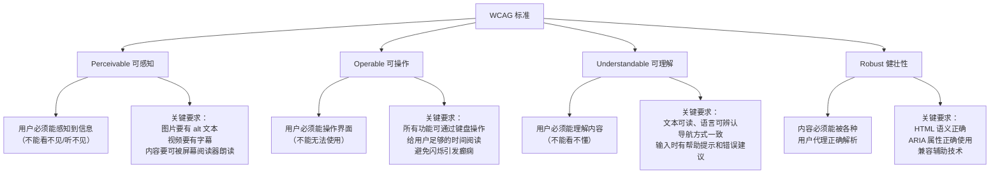

# 可访问性 A11y

## ⭐ 面试重点速览

| 知识模块 | 重点内容 | 面试频率 |
|----------|----------|----------|
| WCAG 标准 | POUR 四大原则（可感知、可操作、可理解、健壮性）、三级合规标准 A/AA/AAA | 高 |
| ARIA 角色与属性 | role/aria-label/aria-labelledby/aria-hidden/aria-expanded 的使用场景 | 极高 |
| 键盘导航 | tabindex 取值（0/-1/大于0）、focus 管理、skip link 跳转链接 | 极高 |
| 语义化 HTML | 语义标签对可访问性的价值、与 ARIA 的配合使用 | 极高 |
| 面试问答 | 如何让一个 div 按钮可访问？aria-label 和 aria-labelledby 的区别？ | 极高 |

---

## 一、什么是 Web 可访问性（A11y）

### 1.1 基本概念

**Web 可访问性**（Accessibility，简称 A11y，其中 11 代表 a 和 y 之间省略的 11 个字母）是指让网站、工具和技术被设计得让**残障人士**也能使用。具体来说，就是让用户能够：

- **感知**页面内容和界面元素
- **理解**页面的信息和操作方式
- **导航**和与页面进行交互
- **贡献**内容（如表单提交、评论等）

可访问性惠及的用户群体包括：

- **视觉障碍**：盲人、低视力、色盲/色弱
- **听觉障碍**：聋人或听力受损
- **运动障碍**：无法使用鼠标，依赖键盘或辅助设备
- **认知障碍**：阅读困难、注意力障碍、记忆力问题
- **神经多样性**：自闭症、ADHD 等

### 1.2 WCAG 标准

WCAG（Web Content Accessibility Guidelines，Web 内容无障碍指南）是 W3C 发布的国际标准，当前最新版本为 WCAG 2.2（起草中 WCAG 3.0）。

**WCAG 三级合规标准**：

| 级别 | 含义 | 是否必须 | 示例 |
|------|------|----------|------|
| **A（最低）** | 最基本的可访问性要求 | 必须满足，否则完全无法访问 | 图片必须有 alt 文本、表单控件必须有 label |
| **AA（中）** | 常见障碍的解决方案 | 大多数网站目标 | 颜色对比度至少 4.5:1、键盘可聚焦元素有可见焦点指示器 |
| **AAA（高）** | 最高级别的可访问性 | 不是所有网站都必须 | 颜色对比度至少 7:1、手语翻译视频内容 |

### 1.3 POUR 四大原则

WCAG 的核心是 **POUR 原则**，所有具体标准都围绕这四个原则展开：



::: tip 记住 POUR
**P**erceivable（可感知）- **O**perable（可操作）- **U**nderstandable（可理解）- **R**obust（健壮性）。这是面试中讨论可访问性时必提的框架。
:::

---

## 二、ARIA 角色与属性

### 2.1 ARIA 是什么

**ARIA**（Accessible Rich Internet Applications）是一套 W3C 规范，用于补充 HTML 的语义信息，让**动态内容**和**高级 UI 控件**能够被辅助技术（如屏幕阅读器）正确理解。

ARIA 主要通过两类属性来增强可访问性：

- **角色（role）**：告诉辅助技术这个元素是什么（按钮？导航？对话框？）
- **状态与属性（aria-*）**：描述元素的当前状态和相关属性

### 2.2 核心 ARIA 角色

| role 值 | 含义 | 适用场景 |
|---------|------|----------|
| `role="button"` | 将元素标记为按钮 | 用 div/span 模拟的按钮 |
| `role="navigation"` | 导航区域 | `<nav>` 标签等效，用于标记导航区块 |
| `role="main"` | 主要内容区域 | `<main>` 标签等效 |
| `role="banner"` | 页头区域 | `<header>` 标签等效 |
| `role="contentinfo"` | 页脚区域 | `<footer>` 标签等效 |
| `role="dialog"` | 对话框 | 弹出模态框，需配合 `aria-modal="true"` |
| `role="alert"` | 重要通知 | 动态插入的提示信息，屏幕阅读器会立即朗读 |
| `role="tablist"` / `role="tab"` / `role="tabpanel"` | 标签页组件 | 构建可访问的标签页 |
| `role="listbox"` / `role="option"` | 下拉选择框 | 自定义下拉组件 |
| `role="presentation"` / `role="none"` | 移除语义 | 取消元素的语义含义（如装饰性表格） |

```html
<!-- 使用 role 标记自定义组件 -->
<div class="custom-tabs" role="tablist">
    <button role="tab" aria-selected="true" aria-controls="panel1">
        标签页 1
    </button>
    <button role="tab" aria-selected="false" aria-controls="panel2">
        标签页 2
    </button>
</div>
<div id="panel1" role="tabpanel" aria-labelledby="tab1">
    标签页 1 的内容
</div>
```

### 2.3 核心 ARIA 属性

| 属性 | 用途 | 示例 |
|------|------|------|
| `aria-label` | 给元素提供一个**屏幕阅读器使用的文本标签**，替代视觉标签 | 关闭按钮：`<button aria-label="关闭">X</button>` |
| `aria-labelledby` | 通过**引用其他元素的 ID** 来提供标签，优先级高于 aria-label | `<h2 id="title">标题</h2><div role="region" aria-labelledby="title">` |
| `aria-describedby` | 引用一个或多个元素作为**描述性文本**（补充说明） | `<input aria-describedby="password-hint"><div id="password-hint">至少 8 位</div>` |
| `aria-hidden` | 是否对辅助技术**隐藏**元素（`true` 表示隐藏） | 装饰性图标：`<span class="icon" aria-hidden="true">🎨</span>` |
| `aria-expanded` | 表示一个可展开控件**当前是否展开** | 折叠面板按钮：`<button aria-expanded="false">展开</button>` |
| `aria-selected` | 表示元素是否处于**选中状态** | 标签页：`<button role="tab" aria-selected="true">` |
| `aria-modal` | 表示元素是否为**模态对话框** | `<div role="dialog" aria-modal="true">` |
| `aria-live` | 定义动态内容的**朗读优先级** | 状态提示：`<div aria-live="polite">` |
| `aria-controls` | 表示当前元素**控制哪个元素** | 按钮控制面板：`<button aria-controls="panel1">` |
| `aria-required` | 表示表单控件是否**必填** | `<input aria-required="true">` |

### 2.4 aria-label vs aria-labelledby 的核心区别

| 维度 | `aria-label` | `aria-labelledby` |
|------|-------------|-------------------|
| **定义方式** | 直接在属性值中写文本 | 引用页面上其他元素的 ID |
| **可见性** | 文本对视觉用户不可见 | 引用的文本可以是可见的 |
| **多语言支持** | 需要动态修改属性值 | 引用元素可以自动跟随页面语言切换 |
| **优先级** | 当 `aria-labelledby` 同时存在时，`aria-labelledby` 优先 | 优先级高于 `aria-label` 和原生标签 |
| **适用场景** | 没有可见文本标签时 | 页面上已有可见文本可以复用 |

```html
<!-- aria-label：直接写文本 -->
<button aria-label="关闭对话框">
    <svg><!-- 关闭图标 --></svg>
</button>
<!-- 屏幕阅读器朗读："关闭对话框，按钮" -->

<!-- aria-labelledby：引用已有文本 -->
<h2 id="section-title">热门文章</h2>
<div role="region" aria-labelledby="section-title">
    <!-- 文章列表 -->
</div>
<!-- 屏幕阅读器朗读："热门文章，区域" -->
```

::: danger 常见错误
不要在 `<div>` 或 `<span>` 等非交互元素上使用 `aria-label`，它不会生效。`aria-label` 仅对**交互元素**（按钮、链接、表单控件）和 **landmark 角色**（role="navigation" 等）有效。
:::

### 2.5 aria-live 动态内容朗读

`aria-live` 属性用于告诉屏幕阅读器，当动态内容发生变化时，如何朗读给用户：

| 值 | 行为 | 适用场景 |
|-----|------|----------|
| `"off"`（默认） | 不朗读更新 | 不需要通知的更新 |
| `"polite"` | 等当前朗读结束后再朗读更新内容 | 大多数通知场景：状态更新、加载完成 |
| `"assertive"` | 立即中断当前朗读，播报更新内容 | 紧急通知：错误提示、重要警告 |

```html
<!-- 状态提示区域：后台更新时自动朗读 -->
<div aria-live="polite" aria-atomic="true" class="sr-only">
    <!-- 动态插入的文本会被屏幕阅读器朗读 -->
</div>

<!-- 表单验证错误：立即朗读 -->
<div role="alert" aria-live="assertive">
    用户名不能为空！
</div>
```

::: tip 提示
`role="alert"` 隐式等效于 `aria-live="assertive"` 和 `aria-atomic="true"`，代表紧急通知，屏幕阅读器会立刻朗读。
:::

---

## 三、键盘导航

### 3.1 为什么键盘导航很重要

- **运动障碍用户**：无法使用鼠标，依靠键盘操作
- **盲人用户**：使用屏幕阅读器时，依赖键盘快捷键导航
- **高级用户**：键盘操作效率更高，是良好的用户体验
- **法律要求**：WCAG 2.1 准则要求所有功能必须可通过键盘操作

### 3.2 tabindex 详解

`tabindex` 属性控制元素是否可以通过 Tab 键聚焦，以及聚焦顺序：

| 值 | 行为 | 使用建议 |
|-----|------|----------|
| `tabindex="0"` | 元素可以被 Tab 键聚焦，按 DOM 顺序排列 | ✅ 推荐：让非交互元素可聚焦 |
| `tabindex="-1"` | 不可被 Tab 键聚焦，但可通过 JS 的 `focus()` 聚焦 | ✅ 推荐：模态框 focus 管理、skip link 目标 |
| `tabindex="1"` 或更大值 | 改变 Tab 顺序，数值越小越先聚焦 | ❌ 不推荐：破坏自然 Tab 顺序，难以维护 |

```html
<!-- ❌ 错误：使用正数 tabindex 改变顺序 -->
<button tabindex="3">按钮 A</button>
<button tabindex="1">按钮 B</button>  <!-- 先聚焦 B，再聚焦 A，不符合直觉 -->
<button tabindex="2">按钮 C</button>

<!-- ✅ 正确：DOM 顺序决定了 Tab 顺序 -->
<button>按钮 B</button>
<button>按钮 C</button>
<button>按钮 A</button>

<!-- ✅ 让非交互元素可聚焦 -->
<div tabindex="0" role="button" onclick="handleClick()" onkeydown="handleKey(event)">
    自定义按钮
</div>
```

### 3.3 Focus 管理

焦点管理是构建可访问 UI 组件的关键，特别是在模态框、下拉菜单、单页应用路由切换时。

**场景一：模态框焦点管理**

```javascript
// 模态框打开时：保存当前焦点，将焦点移到模态框内
let previousFocus;

function openModal() {
    const modal = document.getElementById('modal');
    // 保存当前的焦点元素
    previousFocus = document.activeElement;
    
    // 显示模态框
    modal.style.display = 'block';
    modal.setAttribute('aria-hidden', 'false');
    
    // 将焦点移到模态框内的第一个可聚焦元素
    const firstFocusable = modal.querySelector(
        'button, [href], input, select, textarea, [tabindex]:not([tabindex="-1"])'
    );
    firstFocusable?.focus();
    
    // 焦点陷阱：确保 Tab 键在模态框内循环
    trapFocus(modal);
}

function closeModal() {
    const modal = document.getElementById('modal');
    modal.style.display = 'none';
    modal.setAttribute('aria-hidden', 'true');
    
    // 恢复焦点到打开模态框之前的元素
    previousFocus?.focus();
}
```

**焦点陷阱（Focus Trap）实现**：

```javascript
// 焦点陷阱：Tab 和 Shift+Tab 在模态框内循环
function trapFocus(container) {
    const focusableElements = container.querySelectorAll(
        'button, [href], input, select, textarea, [tabindex]:not([tabindex="-1"])'
    );
    const firstFocusable = focusableElements[0];
    const lastFocusable = focusableElements[focusableElements.length - 1];

    container.addEventListener('keydown', (e) => {
        if (e.key === 'Tab') {
            if (e.shiftKey) {
                // Shift+Tab：如果当前在第一个元素，跳到最后一个
                if (document.activeElement === firstFocusable) {
                    e.preventDefault();
                    lastFocusable.focus();
                }
            } else {
                // Tab：如果当前在最后一个元素，跳到第一个
                if (document.activeElement === lastFocusable) {
                    e.preventDefault();
                    firstFocusable.focus();
                }
            }
        }
    });
}
```

**场景二：Skip Link（跳过导航链接）**

Skip Link 是页面顶部的一个隐藏链接，让键盘用户可以直接跳到主要内容，跳过重复的导航栏：

```html
<!-- Skip Link 实现 -->
<a href="#main-content" class="skip-link">
    跳转到主要内容
</a>

<style>
.skip-link {
    position: absolute;
    top: -100px;
    left: 0;
    background: #000;
    color: #fff;
    padding: 8px 16px;
    z-index: 10000;
    text-decoration: none;
}
/* 只有聚焦时才显示 */
.skip-link:focus {
    top: 0;
}
</style>

<!-- 页面主要内容区域 -->
<main id="main-content" tabindex="-1">
    <!-- 设置 tabindex="-1" 使 anchor 可以接收焦点 -->
    <h1>页面标题</h1>
    <!-- 内容 -->
</main>
```

> Skip Link 是 WCAG 2.4.1（Bypass Blocks）的要求，也是 A 级标准的必要项。

### 3.4 键盘事件处理

自定义交互组件必须处理键盘事件：

```javascript
// 自定义下拉菜单的键盘操作
const menuButton = document.getElementById('menu-button');
const menuList = document.getElementById('menu-list');
const menuItems = menuList.querySelectorAll('[role="menuitem"]');
let currentIndex = -1;

menuButton.addEventListener('keydown', (e) => {
    switch (e.key) {
        case 'Enter':
        case ' ':
            e.preventDefault();
            toggleMenu();
            break;
        case 'ArrowDown':
            e.preventDefault();
            openMenu();
            focusMenuItem(0);
            break;
        case 'ArrowUp':
            e.preventDefault();
            openMenu();
            focusMenuItem(menuItems.length - 1);
            break;
        case 'Escape':
            closeMenu();
            menuButton.focus();
            break;
    }
});

menuList.addEventListener('keydown', (e) => {
    switch (e.key) {
        case 'ArrowDown':
            e.preventDefault();
            focusMenuItem((currentIndex + 1) % menuItems.length);
            break;
        case 'ArrowUp':
            e.preventDefault();
            focusMenuItem((currentIndex - 1 + menuItems.length) % menuItems.length);
            break;
        case 'Escape':
            closeMenu();
            menuButton.focus();
            break;
    }
});

function focusMenuItem(index) {
    currentIndex = index;
    menuItems[index].focus();
}
```

::: tip 键盘操作建议
对于自定义组件，应遵循 WAI-ARIA 设计模式（WAI-ARIA Authoring Practices）中的键盘交互规范：
- 按钮：Enter 或 Space
- 链接：Enter
- 菜单选项：Arrow 键上下移动，Enter 选择，Escape 关闭
- 标签页：Arrow 键左右切换
- 对话框：Escape 关闭
:::

---

## 四、语义化 HTML 对可访问性的价值

### 4.1 为什么语义化 HTML 很重要

使用正确的 HTML 标签，远比你手动添加 ARIA 属性更有效。浏览器和辅助技术对原生 HTML 元素有内置的语义理解：

```html
<!-- ❌ 非语义化 —— 辅助技术不知道这是什么 -->
<div class="nav">
    <div class="nav-item" onclick="goTo('/home')">首页</div>
    <div class="nav-item" onclick="goTo('/about')">关于</div>
</div>

<!-- ✅ 语义化 —— 辅助技术可以识别为导航和链接 -->
<nav>
    <ul>
        <li><a href="/home">首页</a></li>
        <li><a href="/about">关于</a></li>
    </ul>
</nav>
```

### 4.2 常见语义化标签对照

| 非语义化 | 语义化 | 内置可访问性 |
|----------|--------|-------------|
| `<div class="header">` | `<header>` | 隐式 `role="banner"` |
| `<div class="nav">` | `<nav>` | 隐式 `role="navigation"` |
| `<div class="content">` | `<main>` | 隐式 `role="main"` |
| `<div class="footer">` | `<footer>` | 隐式 `role="contentinfo"` |
| `<div class="article">` | `<article>` | 独立内容块，屏幕阅读器可导航 |
| `<div class="section">` | `<section>` | 隐式 `role="region"`，配合标题生成大纲 |
| `<div class="sidebar">` | `<aside>` | 隐式 `role="complementary"` |
| `<span onclick="...">` | `<button>` | 原生支持键盘操作（Enter/Space）、焦点管理、禁用状态 |
| `<span onclick="...">` | `<a href="...">` | 原生支持键盘操作（Enter）、焦点管理、链接行为 |
| `<div class="table">` | `<table>` + `<caption>` + `<th>` | 屏幕阅读器可朗读行列关系 |

### 4.3 表单语义化

表单是最需要语义化的区域之一：

```html
<!-- ❌ 非语义化表单 -->
<div>
    <span>用户名</span>
    <input type="text" placeholder="请输入用户名">
</div>
<!-- 问题：屏幕阅读器无法将"用户名"和输入框关联起来 -->

<!-- ✅ 语义化表单 -->
<div>
    <label for="username">用户名</label>
    <input type="text" id="username" name="username" required>
</div>
<!-- 屏幕阅读器聚焦输入框时朗读："用户名，编辑文本，必填" -->

<!-- ✅ 隐式关联（label 包裹 input） -->
<label>
    用户名
    <input type="text" name="username">
</label>

<!-- ✅ 使用 fieldset 和 legend 分组 -->
<fieldset>
    <legend>选择你的兴趣</legend>
    <label><input type="checkbox" name="interest" value="sports"> 运动</label>
    <label><input type="checkbox" name="interest" value="music"> 音乐</label>
    <label><input type="checkbox" name="interest" value="reading"> 阅读</label>
</fieldset>
```

### 4.4 标题层级 (Heading Hierarchy)

正确的标题层级不仅有助于 SEO，对屏幕阅读器也至关重要。屏幕阅读器用户可以按标题跳转浏览页面：

```html
<!-- ❌ 错误的标题使用 -->
<h1>网站标题</h1>
<h3>次级标题</h3>  <!-- 跳过了 h2，破坏层级结构 -->
<h2>另一个标题</h2>  <!-- 逻辑混乱 -->

<!-- ✅ 正确的标题层级 -->
<h1>网站标题</h1>
  <h2>章节标题</h2>
    <h3>子章节标题</h3>
    <h3>另一个子章节</h3>
  <h2>另一个章节</h2>
    <h3>子章节</h3>
```

### 4.5 图片的 alt 属性

```html
<!-- 信息性图片：提供有意义的替代文本 -->


<!-- 装饰性图片：使用空 alt -->


<!-- 功能性图片（如图标按钮）：描述功能而非外观 -->
<button>
    
</button>

<!-- 复杂图片：使用 longdesc 或 aria-describedby 提供详细描述 -->

<div id="diagram-desc" hidden>详细描述系统架构的各个组件及其关系...</div>
```

::: warning 不要为装饰性图片写 alt 文本
装饰性图片（纯视觉效果、不含信息）应使用空 alt：`alt=""`。如果写了 alt 文本，屏幕阅读器会朗读它，反而干扰用户。
:::

---

## 五、实战：如何让一个 div 按钮可访问

### 5.1 问题分析

原生 `<button>` 元素自带以下可访问性能力：

- 可以通过 Tab 键聚焦
- 可以通过 Enter 和 Space 键触发
- 隐式 `role="button"`
- 支持 `disabled` 属性
- 会被屏幕阅读器识别为"按钮"

如果使用 `<div>` 或 `<span>` 来实现按钮，这些能力都不会自动具备。

### 5.2 完整解决方案

```html
<!-- 1. 基础可访问 div 按钮 -->
<div
    role="button"
    tabindex="0"
    aria-label="保存草稿"
    class="custom-btn"
    onclick="saveDraft()"
    onkeydown="if(event.key==='Enter'||event.key===' '){event.preventDefault();saveDraft()}"
>
    💾
</div>
```

```javascript
// 2. 使用 JS 封装可访问的 div 按钮
class AccessibleButton {
    constructor(element, options = {}) {
        this.el = element;
        this.label = options.label || '';
        this.disabled = options.disabled || false;
        this.pressed = options.pressed; // toggle 按钮
        this.expanded = options.expanded; // 展开按钮
        this.init();
    }

    init() {
        // 设置角色
        this.el.setAttribute('role', 'button');
        // 可聚焦
        this.el.setAttribute('tabindex', this.disabled ? '-1' : '0');
        // 标签
        if (this.label) {
            this.el.setAttribute('aria-label', this.label);
        }
        // 禁用状态
        if (this.disabled) {
            this.el.setAttribute('aria-disabled', 'true');
        }
        // 按下状态（toggle）
        if (this.pressed !== undefined) {
            this.el.setAttribute('aria-pressed', String(this.pressed));
        }
        // 展开状态
        if (this.expanded !== undefined) {
            this.el.setAttribute('aria-expanded', String(this.expanded));
        }

        // 键盘事件：Enter 和 Space 触发点击
        this.el.addEventListener('keydown', (e) => {
            if (this.disabled) return;
            if (e.key === 'Enter' || e.key === ' ') {
                e.preventDefault();
                this.el.click();
            }
        });
    }

    // 切换 toggle 状态
    toggle() {
        if (this.pressed !== undefined) {
            this.pressed = !this.pressed;
            this.el.setAttribute('aria-pressed', String(this.pressed));
        }
    }
}
```

### 5.3 检查清单：div 按钮是否可访问

| 检查项 | 要求 | 实现方式 |
|--------|------|----------|
| 角色声明 | 辅助技术知道这是按钮 | `role="button"` |
| 键盘可聚焦 | Tab 键可访问 | `tabindex="0"` |
| 键盘可触发 | Enter/Space 触发点击 | 绑定 `keydown` 事件 |
| 有标签 | 屏幕阅读器可朗读按钮功能 | `aria-label` 或文本内容 |
| 禁用状态 | 禁用时不可操作 | `aria-disabled="true"` + `tabindex="-1"` |
| 展开/选中状态 | toggle 按钮的状态 | `aria-pressed` / `aria-expanded` |

::: danger 最佳实践提醒
**尽量使用原生 `<button>`，不要用 `<div>` 模拟！** 只有当你确实需要特殊样式且无法通过 CSS 修改 `<button>` 时才考虑自定义。原生按钮自带所有可访问性，不需要任何额外工作。

如果一定要用 `<div>`，以上的所有检查项都必须满足。
:::

---

## 六、面试高频问题汇总

### Q1：如何让一个 div 按钮可访问？

**要点回答**：

1. 设置 `role="button"` —— 告诉辅助技术这是一个按钮
2. 设置 `tabindex="0"` —— 让按钮可以通过 Tab 键聚焦
3. 绑定键盘事件处理 Enter 和 Space 键 —— 标准按钮的键盘行为
4. 提供 `aria-label` 或文本内容 —— 让屏幕阅读器有东西可读
5. 如果禁用，设置 `aria-disabled="true"` 和 `tabindex="-1"`
6. 如果是 toggle 按钮，设置 `aria-pressed`；如果是展开按钮，设置 `aria-expanded`

**最重要的一点**：除非万不得已，**直接用原生 `<button>`**，不要模拟。

### Q2：aria-label 和 aria-labelledby 的区别？

**要点回答**：

| 维度 | aria-label | aria-labelledby |
|------|-----------|-----------------|
| 定义方式 | 属性值直接写文本 | 引用页面元素的 ID |
| 可见性 | 文本不可见（仅辅助技术读取） | 引用的文本可以是非隐藏的可见内容 |
| 优先级 | 低于 aria-labelledby | 同时存在时 aria-labelledby 优先 |
| 适用场景 | 没有可见文本标签时（图标按钮） | 页面上已有可见文本可以复用（form 标题） |

**示例对比**：

```html
<!-- aria-label：图标按钮 -->
<button aria-label="搜索">
    <span class="icon-search" aria-hidden="true"></span>
</button>

<!-- aria-labelledby：引用已有文本 -->
<h3 id="form-title">个人信息</h3>
<form aria-labelledby="form-title">
    <!-- 表单内容 -->
</form>
```

### Q3：什么时候用 aria-hidden="true"？

- **装饰性元素**：纯视觉效果的图标、分隔线
- **重复或冗余内容**：已经被其他方式传达的信息
- **隐藏/折叠的内容**：折叠面板、下拉菜单中的内容
- **正在加载的临时占位符**

**注意**：`aria-hidden="true"` 隐藏的是语义信息，**不影响元素的可视化显示**。不要把它和 `display: none` 或 `visibility: hidden` 混淆。

### Q4：tabindex 的 0、-1、大于 0 有什么区别？

| 值 | 行为 | 使用场景 |
|-----|------|----------|
| `tabindex="0"` | Tab 键可聚焦，按 DOM 顺序排列 | 让非交互元素（div、span）可聚焦 |
| `tabindex="-1"` | Tab 键不可聚焦，但可用 JS `focus()` 聚焦 | 模态框焦点管理、skip link 目标 |
| `tabindex > 0` | Tab 键可聚焦，数值小的先聚焦 | **不推荐**，破坏自然 Tab 顺序 |

最佳实践：**永远不要使用大于 0 的 tabindex**。

### Q5：WAI-ARIA 的第一条规则是什么？

**如果你可以使用原生 HTML 元素或属性来实现所需语义和行为，就通过使用原生 HTML 来实现，而不是重新利用一个元素并添加 ARIA 角色、状态或属性使其可访问。**

简单说：**能用原生 HTML 就用原生 HTML，不要自己造轮子。** 这也是 ARIA 规范中的第一条规则。

### Q6：什么是 Skip Link？为什么需要它？

Skip Link（跳过导航链接）是页面顶部的一个链接，让键盘用户跳转到页面主要内容。它解决了键盘用户每次加载页面都要按很多次 Tab 键才能到达主要内容的问题。

实现方式：一个带有 `href="#main"` 的链接，配合 `id="main"` 且 `tabindex="-1"` 的目标元素。通常通过 CSS 默认隐藏，仅在聚焦时显示。

### Q7：CSS 的 `display: none` 和 `aria-hidden="true"` 有什么区别？

| 属性 | 视觉效果 | 辅助技术 | 可聚焦 |
|------|----------|----------|--------|
| `display: none` | 隐藏 | 隐藏 | 不可聚焦 |
| `visibility: hidden` | 隐藏 | 隐藏 | 不可聚焦 |
| `aria-hidden="true"` | **不影响** | 隐藏 | 仍然可聚焦（需结合 tabindex="-1" 处理） |

核心区别：`aria-hidden` 只影响语义暴露，不影响视觉和交互。它告诉辅助技术"忽略这个元素"，但元素仍然可见且可交互。

---

## 七、总结

Web 可访问性是前端开发中不可忽视的环节，在面试中重要性日益增长。核心要点：

- **WCAG 标准**以 POUR 四大原则为基础，分为 A/AA/AAA 三级
- **ARIA 属性**为动态 UI 组件提供语义信息，`role` 定义角色，`aria-*` 定义状态和属性
- **键盘导航**通过 `tabindex` 和焦点管理实现，`tabindex` 只用 0 和 -1，不用正数
- **语义化 HTML** 是可访问性的基础，原生标签自带的语义远优于手动添加 ARIA
- 面试高频题：div 按钮可访问化、aria-label vs aria-labelledby、tabindex 用法、Skip Link

记住 WAI-ARIA 第一条规则：**能用原生 HTML 就别用 ARIA**。先语义化，再 ARIA 补充。