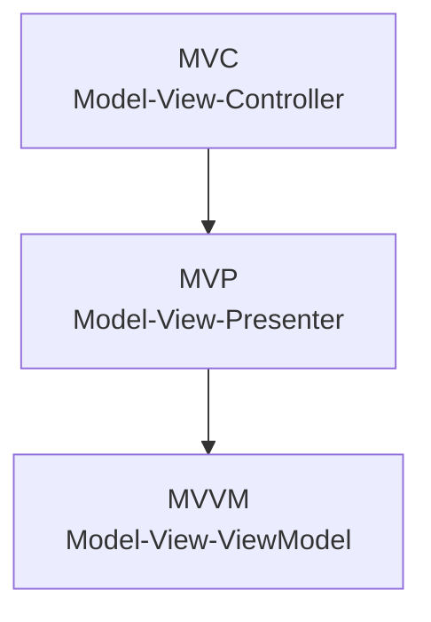
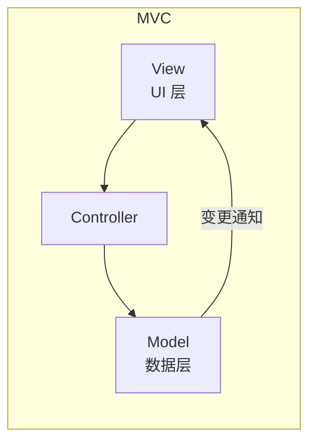
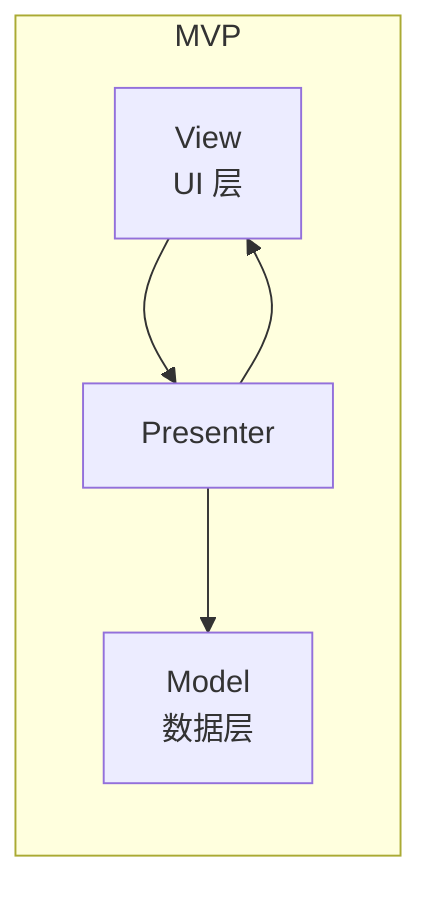
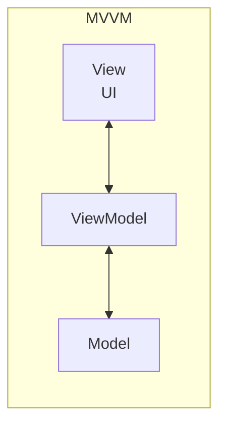

# 前端设计模式

## ⭐ 面试重点速览

| 知识模块 | 重点内容 | 面试频率 |
|----------|----------|----------|
| 八大设计模式 | 观察者/发布订阅/单例/代理/装饰器/策略/工厂/适配器 | 极高 |
| 观察者 vs 发布订阅 | 核心区别：直接通知 vs 事件中心 | 极高 |
| MVC/MVP/MVVM | 三者对比、单向依赖 vs 双向绑定 | 极高 |
| Vue 中用了哪些设计模式 | 响应式（观察者）、插槽（装饰器）、混入（适配器）等 | 极高 |
| 发布订阅模式应用 | 前端应用场景，手写简单实现 | 高 |

---

## 一、前端常见设计模式总结

设计模式是针对常见问题的**通用可复用解决方案**，不是强制性规范，而是经验总结。前端开发中最常用的设计模式包括以下八种。

---

### 1.1 观察者模式（Observer Pattern）

#### 定义
一个目标对象（Subject）维护一个依赖它的观察者（Observer）列表，当目标状态发生变化时，**主动通知**所有观察者，观察者自动更新。

#### 核心特点
- 目标（Subject）知道自己被哪些观察者观察，持有观察者引用列表
- 目标状态变化时，主动调用观察者的 `update` 方法通知
- **一对多依赖关系**，一个变化触发多个观察者更新

#### 前端应用场景
- Vue 响应式原理（数据变化触发视图更新）
- DOM 事件监听机制
- MVC/MVVM 架构中的数据-视图更新
- 事件总线（早期实现）

#### 代码示例

```javascript
// 目标对象（被观察者）
class Subject {
  constructor() {
    // 存储所有观察者
    this.observers = [];
  }

  // 添加观察者
  addObserver(observer) {
    this.observers.push(observer);
  }

  // 移除观察者
  removeObserver(observer) {
    this.observers = this.observers.filter(o => o !== observer);
  }

  // 通知所有观察者更新
  notify(data) {
    this.observers.forEach(observer => {
      observer.update(data);
    });
  }
}

// 观察者接口
class Observer {
  constructor(name) {
    this.name = name;
  }

  update(data) {
    console.log(`[${this.name}] 收到更新:`, data);
  }
}

// 使用示例
const subject = new Subject();
const observer1 = new Observer('观察者1');
const observer2 = new Observer('观察者2');

subject.addObserver(observer1);
subject.addObserver(observer2);
subject.notify({ message: '状态变化了' });
// 输出：
// [观察者1] 收到更新: { message: '状态变化了' }
// [观察者2] 收到更新: { message: '状态变化了' }
```

::: tip 观察者模式本质
观察者模式中，Subject 直接调用 Observer 的 update 方法。观察者知道 Subject，Subject 也知道所有观察者，耦合度较高。
:::

---

### 1.2 发布订阅模式（Pub/Sub Pattern）

#### 定义
发布者和订阅者**不直接耦合**，通过一个**事件中心（Event Channel/Event Bus）**传递消息。发布者只负责发布事件，不关心谁订阅；订阅者只订阅感兴趣的事件，不关心谁发布。

#### 核心特点
- 引入了第三方**事件中心**作为中介
- 发布者和订阅者完全解耦，互相不知道对方存在
- 事件类型作为路由，相同事件类型的发布和订阅会匹配

#### 前端应用场景
- Vue 事件总线（Event Bus）
- 浏览器的 DOM 事件系统（基于事件流，类似思路）
- Node.js 的 EventEmitter
- 模块间通信（解耦跨模块依赖）
- 微前端跨应用通信

#### 代码示例

```javascript
// 事件中心
class EventEmitter {
  constructor() {
    // key: 事件名, value: 回调函数数组
    this.events = new Map();
  }

  // 订阅事件
  on(eventName, callback) {
    if (!this.events.has(eventName)) {
      this.events.set(eventName, []);
    }
    this.events.get(eventName).push(callback);
    // 返回取消订阅函数
    return () => this.off(eventName, callback);
  }

  // 取消订阅
  off(eventName, callback) {
    if (!this.events.has(eventName)) return;
    const callbacks = this.events.get(eventName);
    this.events.set(
      eventName,
      callbacks.filter(cb => cb !== callback)
    );
  }

  // 发布事件，传递数据
  emit(eventName, ...data) {
    if (!this.events.has(eventName)) return;
    this.events.get(eventName).forEach(callback => {
      callback(...data);
    });
  }

  // 只订阅一次
  once(eventName, callback) {
    const wrapper = (...data) => {
      callback(...data);
      this.off(eventName, wrapper);
    };
    this.on(eventName, wrapper);
  }

  // 清空所有订阅
  clear() {
    this.events.clear();
  }
}

// 使用示例
const emitter = new EventEmitter();

// 订阅者 A 订阅 login 事件
const unsubscribe = emitter.on('login', (userInfo) => {
  console.log('用户登录了:', userInfo);
});

// 订阅者 B 也订阅 login 事件
emitter.on('login', () => {
  console.log('发送统计数据到服务器');
});

// 发布者发布 login 事件，不需要知道谁订阅了
emitter.emit('login', { id: 1, name: 'Alice' });
// 输出：
// 用户登录了: { id: 1, name: 'Alice' }
// 发送统计数据到服务器

// 取消订阅
unsubscribe();
emitter.emit('login', { id: 2, name: 'Bob' });
// 只有统计数据输出，第一个订阅者不再收到通知
```

---

### 1.3 单例模式（Singleton Pattern）

#### 定义
一个类**只能创建一个实例**，提供全局访问入口。再次创建实例时返回已有实例。

#### 核心特点
- 构造函数私有，禁止直接 new
- 静态方法获取唯一实例
- 全局共享同一个实例

#### 前端应用场景
- 全局弹窗（Modal、Toast）避免重复创建
- Redux/Vuex 的 store 实例
- 全局配置管理器
- 日志收集器
- 数据库连接池

#### 代码示例

```javascript
// 实现方式一：闭包 + 构造函数
class Singleton {
  constructor(name) {
    if (Singleton.instance) {
      return Singleton.instance; // 如果已有实例，直接返回
    }
    this.name = name;
    Singleton.instance = this; // 保存实例
    return this;
  }

  getName() {
    return this.name;
  }
}

// 测试
const s1 = new Singleton('实例1');
const s2 = new Singleton('实例2');
console.log(s1 === s2); // true —— 同一个实例！
console.log(s1.getName()); // '实例1' —— 第一次创建后不会再改变

// 实现方式二：惰性加载（Proxy 模式）
function createSingleton(ctor) {
  let instance = null;
  return (...args) => {
    if (!instance) {
      instance = new ctor(...args);
    }
    return instance;
  };
}

class Logger {
  constructor(name) {
    this.name = name;
  }

  log(msg) {
    console.log(`[${this.name}] ${msg}`);
  }
}

const getLogger = createSingleton(Logger);
const logger1 = getLogger('GlobalLogger');
const logger2 = getLogger('AnotherLogger');
console.log(logger1 === logger2); // true —— 仍然是同一个实例

// ES6 模块天然实现单例
// config.js
// export default { apiUrl: 'http://api.example.com' };
// 任何地方 import 都是同一个对象
```

::: tip 单例 vs 全局变量
- 单例：延迟创建，只在首次访问时创建实例
- 全局变量：程序启动就创建，即使不用也占用资源
- 单例更符合惰性加载原则
:::

---

### 1.4 代理模式（Proxy Pattern）

#### 定义
为一个对象提供一个**代理**，控制对这个对象的访问。代理对象负责接收请求，转发给目标对象，并可以在转发前后做额外处理。

#### 核心特点
- 代理和目标实现相同接口，对使用者透明
- 可以控制对象的创建、访问、销毁
- 在不修改目标对象代码的情况下增强功能

#### 前端应用场景
- Vue 3 的响应式（`new Proxy()`）
- 拦截 API 请求（添加统一错误处理、日志）
- 缓存代理（缓存计算结果，避免重复计算）
- 虚拟代理（延迟加载图片）
- 保护代理（控制权限访问）
- 防抖节流代理

#### 代码示例

```javascript
// 例子1：图片懒加载（虚拟代理）
class PreLoader {
  constructor(src) {
    this.src = src;
    this.img = null;
    this.placeholder = 'data:image/gif;base64,R0lGODlhAQABAIAAAMLCwgAAACH5BAAAAAAALAAAAAABAAEAAAICRAEAOw==';
    this.loadImage();
  }

  loadImage() {
    this.img = new Image();
    this.img.src = this.placeholder; // 先显示占位图
    document.body.appendChild(this.img);

    // 使用代理在真实图片加载完成后替换
    const realImage = new Image();
    realImage.onload = () => {
      this.img.src = realImage.src; // 加载完成后替换为真实地址
    };
    realImage.src = this.src;
  }

  render() {
    return this.img;
  }
}

// 例子2：ES6 Proxy 实现缓存代理
function cached(fn) {
  const cache = new Map();
  return new Proxy(fn, {
    apply(target, thisArg, args) {
      const key = JSON.stringify(args);
      if (cache.has(key)) {
        console.log('从缓存读取:', key);
        return cache.get(key);
      }
      const result = Reflect.apply(target, thisArg, args);
      cache.set(key, result);
      return result;
    }
  });
}

// 斐波那契计算，缓存结果避免重复递归
const fib = cached((n) => {
  console.log(`计算 fib(${n})`);
  if (n <= 1) return n;
  return fib(n - 1) + fib(n - 2);
});

console.log(fib(10));
// 计算每个 n 只进行一次
// 第二次调用 fib(10) 会直接从缓存读取

// 例子3：Vue 3 响应式简化版
const reactive = (target) => {
  return new Proxy(target, {
    get(obj, prop) {
      console.log(`读取属性: ${String(prop)}`);
      // 这里可以触发依赖收集
      return Reflect.get(obj, prop);
    },
    set(obj, prop, value) {
      console.log(`设置属性: ${String(prop)} = ${value}`);
      // 这里可以触发更新通知
      return Reflect.set(obj, prop, value);
    }
  });
};

const state = reactive({ count: 0 });
state.count;       // 读取属性: count
state.count = 1;   // 设置属性: count = 1
```

---

### 1.5 装饰器模式（Decorator Pattern）

#### 定义
**不改变原对象结构**，动态地给一个对象添加一些额外的职责。装饰器模式比继承更加灵活。

#### 核心特点
- 组合优于继承，避免类爆炸
- 装饰器和被装饰对象实现相同接口，对调用者透明
- 可以层层包装，动态添加功能

#### 前端应用场景
- ES7 `@decorator` 语法（类装饰器、属性装饰器、方法装饰器）
- Vue 中混合（mixins）扩展组件功能
- React 高阶组件（HOC）本质就是装饰器模式
- 日志、权限、性能监控等横切关注点
- CSS 类名组合（给元素添加不同样式类）

#### 代码示例

```javascript
// 例子1：面向对象方式装饰器
// 基础组件
class Coffee {
  cost() {
    return 10; // 基础咖啡 10 元
  }

  name() {
    return '纯咖啡';
  }
}

// 装饰器基类
class CoffeeDecorator {
  constructor(coffee) {
    this.coffee = coffee;
  }

  cost() {
    return this.coffee.cost();
  }

  name() {
    return this.coffee.name();
  }
}

// 加奶装饰器
class MilkDecorator extends CoffeeDecorator {
  cost() {
    return super.cost() + 3; // 加奶 +3 元
  }

  name() {
    return super.name() + ' + 牛奶';
  }
}

// 加糖装饰器
class SugarDecorator extends CoffeeDecorator {
  cost() {
    return super.cost() + 1; // 加糖 +1 元
  }

  name() {
    return super.name() + ' + 糖';
  }
}

// 使用：可以灵活组合
let coffee = new Coffee();
coffee = new MilkDecorator(coffee);
coffee = new SugarDecorator(coffee);

console.log(coffee.name()); // 纯咖啡 + 牛奶 + 糖
console.log(coffee.cost()); // 14

// 例子2：ES 装饰器语法（TypeScript / Babel）
// 方法装饰器：日志记录
function log(target, propertyKey, descriptor) {
  const original = descriptor.value;
  descriptor.value = function(...args) {
    console.log(`调用 ${propertyKey}，参数:`, args);
    const result = original.apply(this, args);
    console.log(`返回结果:`, result);
    return result;
  };
  return descriptor;
}

// 类装饰器：给类添加属性
function addTimestamp(constructor) {
  constructor.prototype.timestamp = Date.now();
  return constructor;
}

@addTimestamp
class User {
  @log
  sayHello(name) {
    return `Hello, ${name}`;
  }
}

// 例子3：React 高阶组件（装饰器模式的典型应用）
// withLoading 装饰组件，添加 loading 功能
const withLoading = (Component) => (props) => {
  if (props.loading) {
    return <div>Loading...</div>;
  }
  return <Component {...props} />;
};

// 使用
@withLoading
class UserList extends React.Component {
  // ...
}
```

---

### 1.6 策略模式（Strategy Pattern）

#### 定义
定义一系列算法，把它们一个个封装起来，并且使它们可以**互相替换**。算法可以独立于使用它的客户端而变化。

#### 核心特点
- 封装变化：把可变的算法抽出来
- 多态替换：根据场景选择不同策略
- 避免大量 if-else 或 switch 语句

#### 前端应用场景
- 表单验证（不同规则对应不同验证策略）
- 支付方式选择（支付宝/微信/银联不同策略）
- 路由守卫（不同权限不同策略）
- 动画缓动函数（不同算法对应不同效果）
- 日期格式化（不同格式对应不同策略）

#### 代码示例

```javascript
// 例子：表单验证策略模式
// 定义各种验证策略
const strategies = {
  required: (value, errorMsg) => {
    if (!value) return errorMsg;
  },
  minLength: (value, length, errorMsg) => {
    if (value.length < length) return errorMsg;
  },
  maxLength: (value, length, errorMsg) => {
    if (value.length > length) return errorMsg;
  },
  email: (value, errorMsg) => {
    const reg = /^[^\s@]+@[^\s@]+\.[^\s@]+$/;
    if (!reg.test(value)) return errorMsg;
  },
  pattern: (value, regex, errorMsg) => {
    if (!regex.test(value)) return errorMsg;
  }
};

// 验证器上下文
class Validator {
  constructor() {
    this.rules = [];
  }

  // 添加验证规则
  add(value, ruleName, ...args) {
    this.rules.push(() => {
      return strategies[ruleName](value, ...args);
    });
    return this;
  }

  // 执行验证，返回第一个错误
  validate() {
    for (const rule of this.rules) {
      const errorMsg = rule();
      if (errorMsg) {
        return { valid: false, message: errorMsg };
      }
    }
    return { valid: true };
  }
}

// 使用示例
const validator = new Validator();
const username = 'abc';

validator
  .add(username, 'required', '用户名不能为空')
  .add(username, 'minLength', 6, '用户名至少6位');

const result = validator.validate();
console.log(result); // { valid: false, message: '用户名至少6位' }

// 例子：支付策略
const paymentStrategies = {
  alipay(amount) {
    console.log(`使用支付宝支付 ${amount} 元`);
    // 调用支付宝 SDK
  },
  wechat(amount) {
    console.log(`使用微信支付 ${amount} 元`);
    // 调用微信 SDK
  },
  unionpay(amount) {
    console.log(`使用银联支付 ${amount} 元`);
    // 调用银联 SDK
  }
};

function pay(amount, method) {
  const strategy = paymentStrategies[method];
  if (!strategy) {
    throw new Error(`不支持的支付方式: ${method}`);
  }
  return strategy(amount);
}

pay(100, 'alipay'); // 使用支付宝支付 100 元
```

---

### 1.7 工厂模式（Factory Pattern）

#### 定义
定义一个用于创建对象的接口，让子类决定实例化哪一个类。工厂方法使一个类的实例化延迟到其子类。简单工厂模式是更常用的变种。

#### 核心特点
- 将对象创建和使用分离
- 统一创建入口，隐藏创建细节
- 根据参数动态决定创建哪种对象

#### 前端应用场景
- Vue 的 `createVNode` 函数（工厂方法创建虚拟节点）
- React 组件工厂（高阶组件创建变体组件）
- Promise 构造函数就是工厂（`Promise.resolve()`）
- jQuery 的 `$` 选择器工厂
- UI 组件库中根据类型创建不同组件

#### 代码示例

```javascript
// 例子1：简单工厂模式 - 创建不同形状
class Circle {
  constructor(radius) {
    this.radius = radius;
  }
  draw() {
    console.log(`绘制圆形，半径 ${this.radius}`);
  }
}

class Rectangle {
  constructor(width, height) {
    this.width = width;
    this.height = height;
  }
  draw() {
    console.log(`绘制矩形，${this.width} x ${this.height}`);
  }
}

// 工厂
class ShapeFactory {
  createShape(type, ...args) {
    switch (type) {
      case 'circle':
        return new Circle(...args);
      case 'rectangle':
        return new Rectangle(...args);
      default:
        throw new Error(`未知形状: ${type}`);
    }
  }
}

// 使用
const factory = new ShapeFactory();
const circle = factory.createShape('circle', 5);
circle.draw(); // 绘制圆形，半径 5

// 例子2：前端实际应用 - 根据类型创建不同按钮组件
function createButton(type, props) {
  switch (type) {
    case 'primary':
      return { ...props, className: 'btn btn-primary' };
    case 'danger':
      return { ...props, className: 'btn btn-danger' };
    case 'ghost':
      return { ...props, className: 'btn btn-ghost' };
    default:
      return { ...props, className: 'btn' };
  }
}

// 例子3：抽象工厂模式 - 创建不同风格的整套 UI
class UIFactory {
  createButton() {}
  createInput() {}
  createCard() {}
}

class LightUIFactory extends UIFactory {
  createButton() { return new LightButton(); }
  createInput() { return new LightInput(); }
  createCard() { return new LightCard(); }
}

class DarkUIFactory extends UIFactory {
  createButton() { return new DarkButton(); }
  createInput() { return new DarkInput(); }
  createCard() { return new DarkCard(); }
}

// 根据用户主题选择使用不同工厂
function getUIFactory(theme) {
  return theme === 'dark' ? new DarkUIFactory() : new LightUIFactory();
}
```

---

### 1.8 适配器模式（Adapter Pattern）

#### 定义
将一个类的接口转换成客户希望的另一个接口。适配器让原本接口不兼容的类可以合作无间。

#### 核心特点
- 解决接口不兼容问题
- 包装旧接口，提供新接口
- 不改变原有实现，只做接口转换

#### 前端应用场景
- 封装旧 API 提供新接口（兼容代码升级）
- 第三方库适配（提供统一接口）
- Vue 混入（mixins）适配不同组件
- AJAX 适配 fetch 接口
- 数据格式转换

#### 代码示例

```javascript
// 例子1：适配旧 API 为新 API
// 旧接口：使用 callbacks
function oldApiGet(url, successCallback, errorCallback) {
  // xhr 请求，成功调用 successCallback，失败调用 errorCallback
}

// 适配器：包装成 Promise 接口
function adaptedGet(url) {
  return new Promise((resolve, reject) => {
    oldApiGet(url,
      (data) => resolve(data),
      (error) => reject(error)
    );
  });
}

// 使用新接口
async function getData() {
  try {
    const data = await adaptedGet('/api/data');
    console.log(data);
  } catch (e) {
    console.error(e);
  }
}

// 例子2：适配不同数据格式
// 旧数据格式：[{ key: 'name', value: 'Alice' }, { key: 'age', value: 28 }]
// 需要转换成：{ name: 'Alice', age: 28 }
class OldDataAdapter {
  constructor(oldData) {
    this.oldData = oldData;
  }

  getNewFormat() {
    return this.oldData.reduce((obj, item) => {
      obj[item.key] = item.value;
      return obj;
    }, {});
  }
}

// 例子3：Vue 中使用 mixin 适配功能
// 原有不同组件需要添加追踪功能，通过混入适配
const trackingMixin = {
  mounted() {
    this.$trackView(this.$options.name);
  },
  methods: {
    trackEvent(action) {
      console.log('Tracking:', this.$options.name, action);
    }
  }
};

// 在任意组件中混入，不需要修改组件原有结构
export default {
  name: 'UserPage',
  mixins: [trackingMixin], // 适配器混入
  data() { return {}; },
  // ... 原有组件代码
};
```

---

## 二、观察者模式 vs 发布订阅模式 核心区别

这是一道非常高频的面试题，很多人混淆这两个模式。请记住核心区别：

| 维度 | 观察者模式 | 发布订阅模式 |
|------|-----------|-------------|
| 耦合关系 | **紧耦合**：目标直接持有观察者引用 | **松耦合**：通过事件中心中介，发布者订阅者互不认识 |
| 通信方式 | 目标主动调用观察者的 `update` | 发布者发事件给事件中心，事件中心通知订阅者 |
| 依赖关系 | 目标知道观察者存在 | 发布者不知道订阅者，订阅者不知道发布者 |
| 参与者 | 目标 + 观察者（两个角色） | 发布者 + 事件中心 + 订阅者（三个角色） |
| 复杂度 | 简单 | 稍复杂 |
| 解耦程度 | 较低 | 很高 |

```mermaid
flowchart LR
    subgraph 观察者模式
        S[Subject 目标] --> O1[Observer 1]
        S --> O2[Observer 2]
        S --> O3[Observer 3]
        S --直接调用 update--> O1
        S --直接调用 update--> O2
    end

    subgraph 发布订阅模式
        P[Publisher 发布者] --> E[Event 事件中心]
        E --> S1[Subscriber 1]
        E --> S2[Subscriber 2]
        P --发布事件--> E
        E --通知订阅者--> S1
        P 不认识 S1，S1 不认识 P
    end
```

::: tip 一句话区别
- **观察者模式**：Subject 知道 Observer，直接发通知给 Observer —— **直接通知**
- **发布订阅模式**：Publisher 只发事件给 Event Bus，不知道 Subscriber —— **间接通知**

观察者模式是**一对直接依赖**，发布订阅是**多对多通过第三方调度**。
:::

**实际前端应用总结**：
- 观察者模式更偏向底层：Vue 响应式、DOM 事件监听
- 发布订阅模式更偏向应用层：模块间通信、跨组件解耦

---

## 三、MVC / MVP / MVVM 对比

### 3.1 架构演进图



### 3.2 三种架构示意图

#### MVC



**MVC 各部分职责**：
- **Model**：业务数据和业务逻辑，独立于 UI
- **View**：展示 UI，接收用户输入，渲染结果
- **Controller**：协调 Model 和 View，处理业务流程

**特点**：View 可以直接从 Model 读取数据，Controller 接收用户输入 -> 更新 Model -> View 展示更新后的数据。

#### MVP



**MVP 改进 MVC**：
- View 和 Model 完全分离，不直接交互
- 所有交互都通过 Presenter
- Presenter 持有 View 接口引用，更新 View
- 更好的分离关注点，方便单元测试

#### MVVM



**MVVM 核心思想**：
- **双向绑定**：View 变化自动更新到 ViewModel，ViewModel 变化自动更新到 View
- 开发者只需要关注数据，ViewModel 负责同步 View 和 Model
- View 非常轻薄，只负责渲染，不处理业务逻辑
- Vue、React（接近）、Angular 都是 MVVM 风格

### 3.3 三者对比表

| 维度 | MVC | MVP | MVVM |
|------|-----|-----|------|
| **依赖关系** | View 依赖 Model，Controller 协调 | View 和 Model 完全分离，Presenter 居中协调 | View 依赖 ViewModel，ViewModel 同步 Model 和 View |
| **View 和 Model 直接交互** | 是 | 否 | 否 |
| **双向绑定** | 无 | 无 | 核心特性 |
| **开发者职责** | Controller 处理逻辑，View 展示 | Presenter 处理逻辑，View 只做展示 | ViewModel 处理逻辑，View 绑定数据 |
| **可测试性** | 难（View 依赖 Model） | 容易（Presenter 依赖接口，可 mock View） | 中等（逻辑在 ViewModel，可测试） |
| **代码量** | 中等 | 较多 | 较少（绑定自动做很多事） |
| **代表框架** | 传统后端 MVC（Rails/Django）、早期前端 | 安卓开发、WinForm | Vue、Angular、React（单向数据流） |
| **视图更新** | 开发者手动更新 | 开发者手动更新 | 数据驱动自动更新 |

### 3.4 关键区别理解

```
MVC → 单向：用户操作 View → Controller 更新 Model → View 重新渲染
MVP → 双向：View 操作 → Presenter 更新 Model → Presenter 更新 View
MVVM → 自动绑定：View 变化 → ViewModel 更新 Model → Model 变化自动同步 View
```

::: tip MVVM 的核心优势
通过**数据绑定**和**依赖追踪**，开发者不需要手动操作 DOM 更新视图，只需要修改数据，视图自动更新。大大减少了样板代码，让开发者专注业务逻辑。
:::

---

## 四、面试高频问题汇总

### Q1：Vue 中用了哪些设计模式？举几个例子说明。

这是一道非常高频的面试题，需要从多个层面回答：

| 设计模式 | 在 Vue 中的应用 |
|----------|----------------|
| **观察者模式** | 响应式核心：data 变化通知 watcher 更新视图 |
| **发布订阅模式** | Vue 实例 `$on/$emit/$off` 实现事件总线 |
| **单例模式** | 根 Vue 实例唯一，全局 `Vuex.store` 单例 |
| **代理模式** | Vue 3 使用 `Proxy` 拦截对象读写实现响应式 |
| **装饰器模式** | 混入（mixins）、Vue 装饰器语法、高阶组件 |
| **工厂模式** | `createApp`、`h()`/`createVNode` 工厂方法创建 VNode |
| **适配器模式** | 不同平台（web/weex/native）适配相同 API，混入扩展组件功能 |
| **策略模式** | 不同编译策略（开发/生产）、不同指令处理策略 |

**重点举例说明**：

1. **观察者模式实现响应式**：
   - data 中每个属性被 Observe 包装成依赖收集器
   - 模板渲染时收集依赖（Watcher）
   - 数据修改时，notify 通知所有 Watcher 更新视图
   - 核心就是观察者模式：Subject（data 属性） + Observer（Watcher）

2. **Proxy 代理模式实现响应式**：
   - Vue 3 不用 `Object.defineProperty`，改用 `new Proxy()`
   - Proxy 拦截目标对象的所有操作（get/set/deleteProperty 等）
   - 在拦截过程中做依赖收集和触发更新
   - 不需要像 Vue 2 那样递归遍历 `data` 做响应式转换

3. **$on/$emit 发布订阅模式**：
   - Vue 实例本身作为事件中心
   - 发布者 `vm.$emit('event', data)`
   - 订阅者 `vm.$on('event', handler)`
   - 典型的发布订阅模式，用于兄弟组件通信

### Q2：发布订阅模式在前端有哪些应用？

1. **模块间/组件间通信**：
   - Event Bus（事件总线），解耦跨模块依赖
   - 兄弟组件通信，不需要通过父组件层层传递

2. **自定义事件系统**：
   - Node.js 中 `EventEmitter`，所有异步事件都基于它
   - DOM 事件系统设计思想类似发布订阅

3. **异步流程控制**：
   - 多个异步任务完成后回调，可以用发布订阅计数
   - 替代回调地狱，虽然现在 Promise 更常用，但思路相通

4. **日志系统**：
   - 不同模块发布不同日志级别事件
   - 控制台、上报服务器分别订阅，各自处理

5. **插件机制**：
   - 核心框架发布生命周期事件
   - 插件订阅对应事件做扩展，不侵入核心代码

6. **微前端**：
   - 主应用和子应用通过全局事件总线通信
   - 完全解耦，不知道对方存在

**手写简单的 EventEmitter 也是高频考点**，代码见前文。

### Q3：单例模式的应用场景，如何实现？

**应用场景**：
- 全局状态管理（Redux/Vuex store）
- 全局弹窗（避免重复创建 Modal）
- 日志收集器
- 配置管理器
- 数据库连接池

**实现要点**：
- 构造函数判断实例是否已存在，存在直接返回
- 使用静态属性保存实例
- 闭包实现惰性创建

```javascript
// 面试手写单例
class Singleton {
  constructor() {
    if (Singleton.instance) {
      return Singleton.instance;
    }
    // 初始化逻辑...
    Singleton.instance = this;
    return this;
  }
}
```

### Q4：装饰器模式和继承的区别是什么？什么时候用装饰器？

| 装饰器模式 | 继承 |
|-----------|------|
| 组合关系（has-a） | 继承关系（is-a） |
| 运行时动态添加 | 编译时静态确定 |
| 可以层层叠加 | 子类继承父类，层级越多越复杂 |
| 不会产生类爆炸 | 功能组合会导致大量子类（类爆炸） |
| 符合开闭原则（对扩展开放，对修改关闭） | 修改继承需要修改父类，违反开闭 |

**什么时候用装饰器**：
- 需要给对象动态添加功能，又不想生成太多子类
- 功能可以组合（比如咖啡+奶+糖，可以任意组合）
- 不改变原对象接口，只增强功能

**React 中的 HOC（高阶组件）就是装饰器模式的典型应用**：
- 不修改原组件，通过包装添加额外功能（loading、权限、日志等）
- 可以多层包装，多个高阶组件叠加

### Q5：策略模式解决了什么问题？

策略模式解决**大量 if-else / switch 语句**的问题：

- 把每个分支逻辑抽成独立策略类
- 运行时根据条件选择不同策略
- 新增策略只需要添加新类，不影响原有代码
- 符合开闭原则

**前端常见例子**：表单验证、不同支付方式、不同权限验证规则。

---

## 五、总结

前端开发中最常用的设计模式：

| 模式 | 核心思想 | 典型应用 |
|------|---------|----------|
| **观察者** | 一对多依赖，状态变化通知所有观察者 | Vue 响应式、DOM 事件 |
| **发布订阅** | 事件中心中介，发布者订阅者解耦 | Event Bus、Node.js EventEmitter |
| **单例** | 一个类只能创建一个实例 | 全局 store、弹窗 |
| **代理** | 控制对象访问，转发请求 | Vue 3 Proxy、缓存、懒加载 |
| **装饰器** | 不改变结构动态添加功能 | ES 装饰器、React HOC、mixins |
| **策略** | 算法封装，互相替换 | 表单验证、支付方式 |
| **工厂** | 封装对象创建，隐藏细节 | createVNode、$ 选择器 |
| **适配器** | 接口不兼容转换 | 旧 API 包装、第三方库适配 |

MVC/MVP/MVVM 是架构模式，不是设计模式，但经常放在一起对比：

- **MVC**：View 可以直接读 Model，Controller 协调
- **MVP**：View 和 Model 完全分离，Presenter 全权处理
- **MVVM**：双向数据绑定，数据驱动自动更新视图

设计模式不是银弹，不要为了用模式而用模式。根据场景选择合适的方案，够用就行。