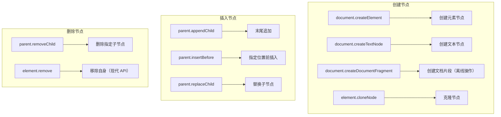
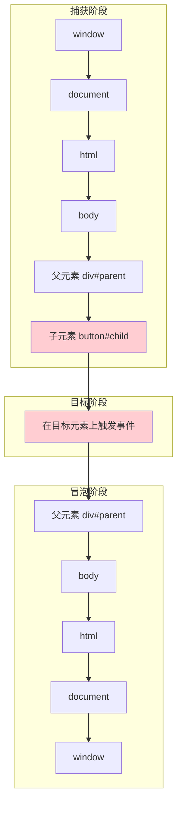
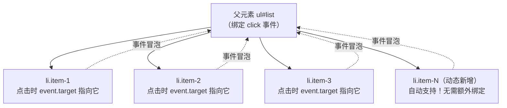

# DOM & BOM 核心

## ⭐ 面试重点速览

| 知识模块 | 重点内容 | 面试频率 |
|----------|----------|----------|
| DOM 查询 | getElementById/querySelector/querySelectorAll 区别 | 极高 |
| DOM 操作 | createElement/appendChild/removeChild/replaceChild/cloneNode | 极高 |
| 事件流 | 捕获 → 目标 → 冒泡三阶段、addEventListener 第三个参数 | 极高 |
| 事件委托 | 原理、优点、实现方式、event.target 判断 | 极高 |
| 阻止冒泡与默认行为 | stopPropagation/stopImmediatePropagation/preventDefault | 极高 |
| BOM 核心 API | window/location/navigator/history 常用属性和方法 | 高 |

---

## 一、DOM 核心 API

### 1.1 DOM 查询方法对比

| 方法 | 返回值 | 实时性 | 性能 | 选择器语法 |
|------|--------|--------|------|-----------|
| `getElementById` | 单个元素或 null | 实时 | 最快 | 仅 ID |
| `getElementsByClassName` | **动态 HTMLCollection** | 实时 | 快 | 仅类名 |
| `getElementsByTagName` | **动态 HTMLCollection** | 实时 | 快 | 仅标签名 |
| `querySelector` | 第一个匹配元素或 null | **静态快照** | 较慢 | CSS 选择器 |
| `querySelectorAll` | **静态 NodeList** | 静态快照 | 较慢 | CSS 选择器 |

```javascript
// 关键区别演示 —— 动态 vs 静态
const liveList = document.getElementsByClassName('item');  // 实时 HTMLCollection
const staticList = document.querySelectorAll('.item');      // 静态 NodeList

console.log(liveList.length);   // 假设 3
console.log(staticList.length); // 假设 3

// 动态添加一个新元素
const newItem = document.createElement('div');
newItem.className = 'item';
document.body.appendChild(newItem);

console.log(liveList.length);   // 4 —— 自动反映 DOM 变化！
console.log(staticList.length); // 3 —— 仍然是快照值

// 面试结论：
// getElementsByXXX 返回的是动态集合，始终反映最新的 DOM 状态
// querySelectorAll 返回的是静态快照，不会随 DOM 变化而更新
```

::: tip 选择建议
- 按 ID 查询：优先使用 `getElementById`（性能最优）
- 高频访问同一集合：`getElementsByClassName`（动态集合，无需重复查询）
- 复杂 CSS 选择器：`querySelector` / `querySelectorAll`（灵活性最高）
- 不需要动态更新的集合：`querySelectorAll`（静态快照，避免意外行为）
:::

### 1.2 DOM 操作核心方法



```javascript
// === DOM 操作完整示例 ===

// 1. 创建元素
const container = document.createElement('div');
container.className = 'container';
container.setAttribute('data-id', 'main');

// 2. 创建文本节点
const text = document.createTextNode('Hello World');
container.appendChild(text);

// 3. insertBefore —— 在指定节点前插入
const refNode = document.getElementById('ref');
refNode.parentNode.insertBefore(container, refNode);

// 4. replaceChild —— 替换子节点
const oldChild = document.getElementById('old');
const newChild = document.createElement('span');
newChild.textContent = '替换后的内容';
oldChild.parentNode.replaceChild(newChild, oldChild);

// 5. cloneNode —— 克隆节点
const source = document.getElementById('template');
const shallow = source.cloneNode(false);   // 浅克隆：只克隆节点本身
const deep = source.cloneNode(true);        // 深克隆：克隆节点及其所有后代

// 6. removeChild vs remove
const target = document.getElementById('target');
target.parentNode.removeChild(target); // 传统方式，需要父节点
// target.remove();                    // 现代方式（IE 不支持），直接移除自身
```

### 1.3 DocumentFragment —— 批量操作优化

```javascript
// ❌ 低效做法：每次循环都触发一次回流
const list = document.getElementById('list');
for (let i = 0; i < 1000; i++) {
    const li = document.createElement('li');
    li.textContent = `Item ${i}`;
    list.appendChild(li);  // 每次 append 都触发回流！
}

// ✅ 高效做法：使用 DocumentFragment 批量操作
const list2 = document.getElementById('list2');
const fragment = document.createDocumentFragment();  // 文档片段，不在 DOM 树中
for (let i = 0; i < 1000; i++) {
    const li = document.createElement('li');
    li.textContent = `Item ${i}`;
    fragment.appendChild(li);  // 在内存中操作，不触发回流
}
list2.appendChild(fragment);  // 一次性挂载，只触发一次回流
// fragment 被挂载后会自动清空，无需手动清理
```

---

## 二、事件流

### 2.1 事件流三阶段

DOM 事件流分为三个阶段：**捕获阶段（Capture）→ 目标阶段（Target）→ 冒泡阶段（Bubble）**。



```javascript
// 事件流三阶段演示
const parent = document.getElementById('parent');
const child = document.getElementById('child');

// 捕获阶段监听（第三个参数 true）
parent.addEventListener('click', () => {
    console.log('父元素 - 捕获阶段');
}, true);

// 冒泡阶段监听（第三个参数 false 或省略，默认值）
parent.addEventListener('click', () => {
    console.log('父元素 - 冒泡阶段');
}, false);

// 目标元素监听
child.addEventListener('click', () => {
    console.log('子元素 - 目标阶段');
});

// 点击子元素后的输出顺序：
// 父元素 - 捕获阶段  （捕获阶段，从外到内）
// 子元素 - 目标阶段  （目标阶段，按注册顺序）
// 父元素 - 冒泡阶段  （冒泡阶段，从内到外）
```

### 2.2 addEventListener 第三个参数详解

```javascript
// addEventListener 的第三个参数可以是 boolean 或 options 对象
element.addEventListener(type, listener, useCapture);           // boolean
element.addEventListener(type, listener, options);              // options 对象

// options 对象支持的属性
element.addEventListener('click', handler, {
    capture: false,    // 是否在捕获阶段触发（等同于 useCapture）
    once: true,        // 触发一次后自动移除监听器
    passive: true,     // 不会调用 preventDefault()，提升滚动性能
    signal: controller.signal  // AbortSignal，可用于移除监听器
});
```

::: warning `passive: true` 的使用场景
移动端滚动性能优化中，`passive: true` 非常重要。浏览器在滚动事件触发时，如果不知道是否会调用 `preventDefault()`，必须等待事件处理完成才能滚动，导致延迟。设置 `passive: true` 后，浏览器知道不会阻止默认行为，可以立即开始滚动。

```javascript
// ✅ 移动端滚动优化
document.addEventListener('touchstart', handler, { passive: true });
document.addEventListener('touchmove', handler, { passive: true });

// Chrome 56+ 已将 document 级别的 touchstart/touchmove 默认设为 passive
```
:::

---

## 三、事件委托（事件代理）

### 3.1 核心原理

事件委托利用**事件冒泡**机制，将子元素的事件处理程序绑定到父元素上，通过 `event.target` 判断实际触发事件的元素。



### 3.2 实现与优点

```javascript
// ❌ 不使用事件委托：每个子元素单独绑定
const items = document.querySelectorAll('.item');
items.forEach(item => {
    item.addEventListener('click', (e) => {
        console.log('点击了:', e.target.textContent);
    });
});
// 问题：新增的 .item 元素没有事件绑定

// ✅ 使用事件委托：在父元素上绑定一次
const list = document.getElementById('list');
list.addEventListener('click', (e) => {
    // 通过 event.target 判断实际点击的元素
    const target = e.target.closest('.item');  // 或 e.target.matches('.item')
    if (target) {
        console.log('点击了:', target.textContent);
    }
});
// 优点：动态新增的 .item 元素自动支持点击事件
```

**事件委托的三大优点**：

| 优点 | 说明 |
|------|------|
| **减少内存占用** | 只需一个事件处理器，而非为每个子元素单独绑定 |
| **支持动态元素** | 新增的子元素自动获得事件处理能力，无需重新绑定 |
| **简化代码维护** | 事件逻辑集中在一处，修改方便 |

### 3.3 注意事项

```javascript
// 注意 1：有些事件不冒泡，无法使用事件委托
// 不冒泡的事件：focus、blur、load、unload、mouseenter、mouseleave、resize、scroll
// 替代方案：使用 focusin（冒泡）代替 focus，mouseover（冒泡）代替 mouseenter

// 注意 2：必须判断 event.target 是否为目标元素
list.addEventListener('click', (e) => {
    // 使用 closest() 向上查找，兼容嵌套结构
    const item = e.target.closest('.item');
    if (!item) return;  // 关键：不是目标元素则不处理

    // 处理逻辑
    console.log('点击了 item:', item.dataset.id);
});

// 注意 3：e.target vs e.currentTarget
list.addEventListener('click', (e) => {
    console.log(e.target);        // 实际触发事件的元素（可能是 li 内部的 span）
    console.log(e.currentTarget); // 绑定事件的元素（始终是 ul#list）
});
```

---

## 四、阻止冒泡与默认行为

### 4.1 三个核心方法对比

| 方法 | 作用 | 影响范围 | 能否继续触发同元素其他监听器 |
|------|------|----------|------------------------------|
| `event.stopPropagation()` | 阻止事件继续传播（捕获和冒泡） | 阻止向父级传播 | 是 |
| `event.stopImmediatePropagation()` | 阻止事件传播 + 阻止同元素其他监听器 | 阻止传播 + 阻止同元素其他监听器 | 否 |
| `event.preventDefault()` | 阻止浏览器默认行为 | 仅阻止默认行为 | 是 |

```javascript
// stopPropagation vs stopImmediatePropagation 的区别
element.addEventListener('click', (e) => {
    console.log('第一个监听器');
    e.stopImmediatePropagation();  // 阻止后续监听器 + 阻止冒泡
});

element.addEventListener('click', (e) => {
    console.log('第二个监听器');   // 不会执行！被 stopImmediatePropagation 阻止
});

// 如果使用 stopPropagation()，第二个监听器仍然会执行
```

### 4.2 常见面试题

```javascript
// 面试题 1：如何阻止链接跳转？
document.querySelector('a').addEventListener('click', (e) => {
    e.preventDefault();  // 阻止默认的跳转行为
    console.log('链接被点击，但不会跳转');
});

// 面试题 2：如何阻止表单提交？
document.querySelector('form').addEventListener('submit', (e) => {
    e.preventDefault();  // 阻止默认的提交行为
    // 进行表单验证，通过后手动提交
    if (validateForm()) {
        e.target.submit();
    }
});

// 面试题 3：阻止冒泡后，父元素的事件还会触发吗？
parent.addEventListener('click', () => console.log('父元素'));
child.addEventListener('click', (e) => {
    e.stopPropagation();
    console.log('子元素');
});
// 点击子元素：只输出 "子元素"（父元素不会触发）
```

---

## 五、BOM 核心 API

### 5.1 window 对象

```javascript
// window 是 BOM 的顶层对象，表示浏览器窗口
// 全局变量和函数都是 window 的属性

// 常用弹窗方法
window.alert('提示信息');           // 警告框
window.confirm('确定要删除吗？');   // 确认框，返回 boolean
window.prompt('请输入名称：');      // 输入框，返回用户输入或 null

// 定时器
const timerId = window.setTimeout(() => {
    console.log('延迟执行');
}, 1000);
window.clearTimeout(timerId);       // 清除定时器

const intervalId = window.setInterval(() => {
    console.log('每秒执行');
}, 1000);
window.clearInterval(intervalId);   // 清除循环定时器

// requestAnimationFrame（推荐用于动画）
const rafId = window.requestAnimationFrame((timestamp) => {
    // 每帧渲染前执行，timestamp 是回调触发的时间戳
    console.log('下一帧渲染前', timestamp);
});
window.cancelAnimationFrame(rafId); // 取消回调

// 窗口尺寸
console.log(window.innerWidth);     // 视口宽度（含滚动条）
console.log(window.innerHeight);    // 视口高度（含滚动条）
console.log(window.outerWidth);     // 浏览器窗口宽度（含工具栏）
console.log(window.outerHeight);    // 浏览器窗口高度（含工具栏）
```

### 5.2 location 对象

```javascript
// 以 URL https://example.com:8080/path/page?query=1#hash 为例
console.log(location.href);       // 完整 URL
console.log(location.protocol);   // 'https:'
console.log(location.host);       // 'example.com:8080'（主机名+端口）
console.log(location.hostname);   // 'example.com'
console.log(location.port);       // '8080'
console.log(location.pathname);   // '/path/page'
console.log(location.search);     // '?query=1'
console.log(location.hash);       // '#hash'
console.log(location.origin);     // 'https://example.com:8080'

// 页面跳转方法
location.href = 'https://new-url.com';       // 跳转（可后退）
location.assign('https://new-url.com');       // 同上
location.replace('https://new-url.com');      // 替换当前页（不可后退）
location.reload();                            // 刷新页面
// location.reload(true);                     // 强制刷新（跳过缓存，已废弃）
```

### 5.3 navigator 对象

```javascript
// 浏览器信息
console.log(navigator.userAgent);     // 用户代理字符串
console.log(navigator.language);      // 浏览器语言，如 'zh-CN'
console.log(navigator.languages);     // 语言偏好列表

// 网络状态
console.log(navigator.onLine);        // 是否在线（boolean）
window.addEventListener('online', () => console.log('网络已连接'));
window.addEventListener('offline', () => console.log('网络已断开'));

// 剪贴板 API（需用户授权）
navigator.clipboard.writeText('复制的内容')
    .then(() => console.log('复制成功'));

// 设备信息
console.log(navigator.hardwareConcurrency); // CPU 核心数（用于 Web Worker 数量决策）
console.log(navigator.deviceMemory);        // 设备内存（GB），仅 Chrome
console.log(navigator.maxTouchPoints);      // 最大触摸点数

// 地理位置（需用户授权）
navigator.geolocation.getCurrentPosition(
    (pos) => console.log(pos.coords.latitude, pos.coords.longitude),
    (err) => console.error('定位失败', err)
);
```

### 5.4 history 对象

```javascript
// 历史记录导航
history.back();          // 后退一页，等价于 history.go(-1)
history.forward();       // 前进一页，等价于 history.go(1)
history.go(-2);          // 后退两页

console.log(history.length);  // 当前标签页的历史记录条数

// HTML5 History API —— SPA 路由基础
history.pushState({ page: 1 }, '', '/page1');   // 添加历史记录，不刷新页面
history.replaceState({ page: 2 }, '', '/page2'); // 替换当前历史记录，不刷新页面

// 监听浏览器前进/后退
window.addEventListener('popstate', (e) => {
    console.log('URL 变化:', location.pathname);
    console.log('state 数据:', e.state);  // pushState/replaceState 传入的状态对象
});
```

### 5.5 screen 对象

```javascript
console.log(screen.width);       // 屏幕宽度（像素）
console.log(screen.height);      // 屏幕高度（像素）
console.log(screen.availWidth);  // 可用宽度（排除任务栏）
console.log(screen.availHeight); // 可用高度（排除任务栏）
console.log(screen.colorDepth);  // 颜色深度（位）
console.log(window.devicePixelRatio); // 设备像素比（DPR），用于 Retina 适配
```

---

## 六、面试高频问题汇总

### Q1：`getElementsByClassName` 和 `querySelectorAll` 返回值的区别？

| 维度 | getElementsByClassName | querySelectorAll |
|------|----------------------|-------------------|
| 返回值类型 | **HTMLCollection**（动态） | **NodeList**（静态） |
| 实时性 | 实时反映 DOM 变化 | 方法调用时的快照 |
| forEach 支持 | 不支持（需转为数组） | 支持 |
| 性能 | 更快（只做类名匹配） | 较慢（需解析 CSS 选择器） |
| 选择器语法 | 只支持类名 | 支持任意 CSS 选择器 |

### Q2：事件代理（事件委托）的原理和优缺点？

**原理**：利用事件冒泡，将子元素的事件处理委托给父元素。通过 `event.target` 判断实际触发事件的元素。

**优点**：
- 减少内存占用（只需一个事件处理器）
- 动态元素自动支持（新增子元素无需重新绑定）
- 代码更简洁（集中管理事件逻辑）

**缺点**：
- 不冒泡的事件无法使用（focus/blur/scroll 等）
- 需要额外判断 `event.target`
- 事件响应可能比直接绑定稍慢（但通常可忽略）

### Q3：`event.stopPropagation()` 和 `event.stopImmediatePropagation()` 的区别？

- `stopPropagation()`：阻止事件向父元素传播，但**同一元素上的其他监听器仍然会执行**
- `stopImmediatePropagation()`：阻止事件传播**且阻止同一元素上后续注册的监听器执行**

### Q4：如何阻止事件冒泡？如何阻止默认行为？

- 阻止冒泡：`event.stopPropagation()` 或 `event.stopImmediatePropagation()`
- 阻止默认行为：`event.preventDefault()`
- 两者互不影响：阻止冒泡不会阻止默认行为，反之亦然

### Q5：`addEventListener` 的第三个参数有哪些用法？

1. **布尔值**：`true` 在捕获阶段触发，`false`（默认）在冒泡阶段触发
2. **Options 对象**：
   - `capture: boolean` —— 同 useCapture
   - `once: true` —— 触发一次后自动移除
   - `passive: true` —— 不会调用 preventDefault，提升滚动性能
   - `signal: AbortSignal` —— 通过 AbortController 移除监听器

### Q6：`mouseenter` 和 `mouseover` 的区别？

| 维度 | mouseenter | mouseover |
|------|-----------|-----------|
| 是否冒泡 | **不冒泡** | **冒泡** |
| 触发次数 | 进入元素时触发一次 | 进入元素及其子元素时都触发 |
| 事件委托 | 不支持（不冒泡） | 支持 |
| 使用场景 | 简单的 hover 效果 | 需要事件委托的场景 |

### Q7：`history.pushState` 和 `location.href` 的区别？

| 维度 | history.pushState | location.href |
|------|-------------------|---------------|
| 是否刷新页面 | 否 | 是 |
| 是否发送请求 | 否 | 是 |
| 浏览器后退 | 支持（会触发 popstate 事件） | 支持 |
| 使用场景 | SPA 路由（Vue Router / React Router） | 传统页面跳转 |

### Q8：`window.onload` 和 `DOMContentLoaded` 的区别？

| 维度 | DOMContentLoaded | window.onload |
|------|-----------------|---------------|
| 触发时机 | DOM 解析完成后立即触发 | 所有资源（图片、CSS、JS）加载完成后触发 |
| 触发更早 | 是 | 否 |
| 使用场景 | 尽早操作 DOM | 需要依赖图片尺寸等资源信息时 |
| 监听方式 | `document.addEventListener('DOMContentLoaded', fn)` | `window.addEventListener('load', fn)` |