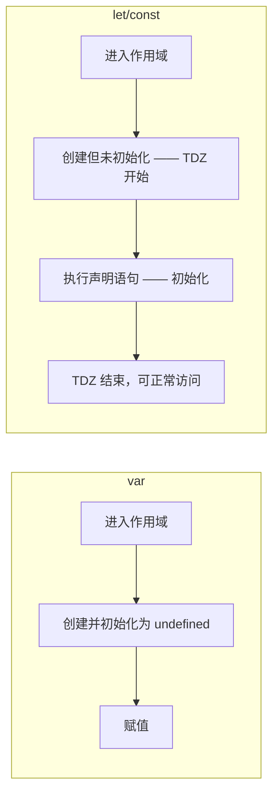
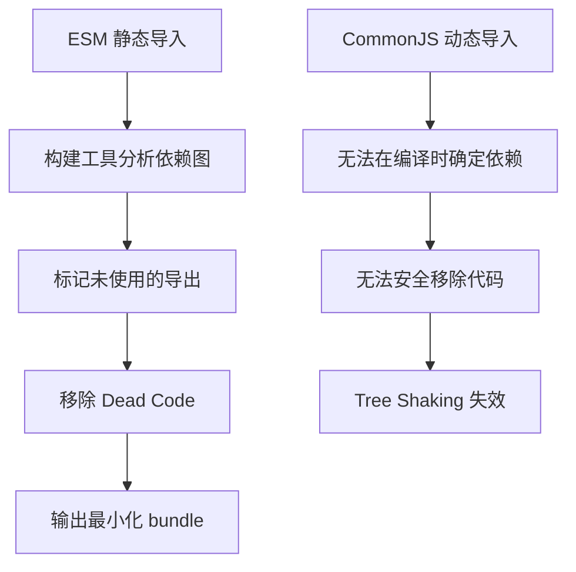
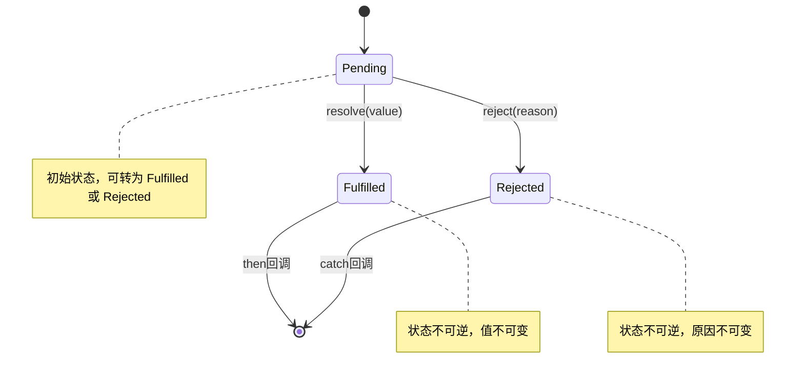

# ES6+ 新特性

## ⭐ 面试重点速览

| 知识模块 | 重点内容 | 面试频率 |
|----------|----------|----------|
| let/const | 块级作用域、暂时性死区 TDZ、与 var 对比 | 极高 |
| 箭头函数 | this/arguments/构造函数/prototype 四个维度区别 | 极高 |
| 解构赋值 | 数组解构、对象解构、默认值、嵌套解构 | 中 |
| 模块化 | ESM vs CommonJS、静态分析、Tree Shaking 原理 | 高 |
| Promise | 状态机、链式调用、手写 Promise.all/race/allSettled/any | 极高 |
| async-await | Generator + 自动执行器本质、错误处理、并发控制 | 极高 |
| ES2020+ | Optional Chaining (?.)、Nullish Coalescing (??) | 中 |

---

## let / const

### 三大核心特性

```javascript
// === 1. 块级作用域 ===
{
  var a = 1;
  let b = 2;
  const c = 3;
}
console.log(a); // 1 —— var 无视块级作用域
console.log(b); // ReferenceError: b is not defined
console.log(c); // ReferenceError: c is not defined

// === 2. 暂时性死区 (TDZ) ===
console.log(x); // undefined —— var 变量提升
var x = 1;

console.log(y); // ReferenceError: Cannot access 'y' before initialization
let y = 2; // TDZ 从块开始到 let 声明语句之间

// === 3. 不允许重复声明 ===
let z = 1;
let z = 2; // SyntaxError: Identifier 'z' has already been declared

// === const 的特殊性 ===
const obj = { name: 'Alice' };
obj.name = 'Bob'; // OK —— const 限制的是引用，不是值
obj = {};         // TypeError: Assignment to constant variable
```

### 与 var 的全面对比

| 对比维度 | `var` | `let` | `const` |
|----------|-------|-------|---------|
| 作用域 | 函数作用域 | 块级作用域 | 块级作用域 |
| 变量提升 | 是（初始化为 undefined） | 是（但处于 TDZ，不可访问） | 是（但处于 TDZ，不可访问） |
| 重复声明 | 允许 | 不允许 | 不允许 |
| 全局声明 | 挂载到 window | 不挂载到 window | 不挂载到 window |
| 重新赋值 | 允许 | 允许 | 不允许 |
| 必须初始化 | 否 | 否 | 是 |



::: warning 面试追问：let/const 有变量提升吗？
**有，但表现不同。** `let/const` 在编译阶段也会被提升（创建），但进入"暂时性死区"（TDZ），在声明语句执行前无法访问。可以说"有提升，但被 TDZ 屏蔽了访问"。如果在 TDZ 中访问会抛出 `ReferenceError`，而不是像 `var` 一样返回 `undefined`。
:::

---

## 箭头函数

### 与普通函数的四大区别

```javascript
// === 1. this 指向 ===
// 普通函数：this 在调用时确定，取决于调用方式
// 箭头函数：this 在定义时确定，继承自外层作用域

const obj = {
  name: 'obj',
  normalFn() {
    console.log(this.name); // 'obj'
  },
  arrowFn: () => {
    console.log(this.name); // undefined（继承外层 this，此处为 window）
  },
  delayedNormal() {
    setTimeout(function() {
      console.log(this.name); // undefined（普通函数，this 指向 window）
    }, 100);
  },
  delayedArrow() {
    setTimeout(() => {
      console.log(this.name); // 'obj'（箭头函数，继承 delayedArrow 的 this）
    }, 100);
  }
};

// === 2. arguments 对象 ===
function normalFn() {
  console.log(arguments); // [1, 2, 3]
}
const arrowFn = () => {
  console.log(arguments); // ReferenceError: arguments is not defined
};
normalFn(1, 2, 3);

// 箭头函数获取参数的方式：使用 rest 参数
const arrowWithRest = (...args) => {
  console.log(args); // [1, 2, 3]
};

// === 3. 不能作为构造函数 ===
const Foo = () => {};
const instance = new Foo(); // TypeError: Foo is not a constructor

// === 4. 没有 prototype 属性 ===
console.log(normalFn.prototype); // { constructor: f }
console.log(arrowFn.prototype);  // undefined
```

| 对比维度 | 普通函数 | 箭头函数 |
|----------|----------|----------|
| `this` | 动态绑定（调用时确定） | 词法绑定（定义时确定） |
| `arguments` | 有 | 无（使用 rest 参数替代） |
| 构造函数 | 可以 `new` | 不可以 `new` |
| `prototype` | 有 | 无 |
| `yield` | 可用作 Generator | 不可用作 Generator |
| 适用场景 | 对象方法、构造函数、事件回调需要动态 this | 回调函数、数组方法、需要固定 this 的场景 |

::: tip 箭头函数不适合的场景
1. **对象方法**：`this` 无法指向对象本身
2. **动态 this 的场景**：如事件处理中需要 `this` 指向触发元素
3. **原型方法**：`this` 无法指向实例
4. **构造函数**：直接报错
:::

---

## 解构赋值

```javascript
// === 数组解构 ===
const [a, b, c = 3] = [1, 2]; // a=1, b=2, c=3（默认值）
const [first, ...rest] = [1, 2, 3, 4]; // first=1, rest=[2,3,4]
const [, , third] = [1, 2, 3]; // third=3（跳过前两个）

// 交换变量（无需临时变量）
let x = 1, y = 2;
[x, y] = [y, x]; // x=2, y=1

// === 对象解构 ===
const user = { name: 'Alice', age: 25, address: { city: 'Beijing' } };
const { name, age, gender = 'unknown' } = user; // name='Alice', age=25, gender='unknown'
const { name: userName } = user; // 重命名：userName='Alice'

// 嵌套解构
const { address: { city } } = user; // city='Beijing'
const { address: { city: userCity } } = user; // 重命名 + 嵌套：userCity='Beijing'

// 函数参数解构
function greet({ name, age }) {
  console.log(`${name} is ${age} years old`);
}
greet(user); // 'Alice is 25 years old'
```

---

## 模块化

### ESM vs CommonJS

```javascript
// === CommonJS（Node.js 默认） ===
// 导出
module.exports = { foo, bar };
exports.foo = foo;
// 导入
const { foo, bar } = require('./module');
// 特点：运行时加载、动态、同步、值拷贝（浅拷贝）

// === ESM（ES Module，现代标准） ===
// 导出
export const foo = 1;
export default function bar() {}
// 导入
import { foo } from './module';
import bar from './module';
import * as all from './module';
// 动态导入（返回 Promise）
import('./module').then(module => { /* ... */ });
// 特点：编译时加载（静态分析）、异步、引用（只读实时绑定）
```

| 对比维度 | CommonJS | ESM |
|----------|----------|-----|
| 加载时机 | 运行时 | 编译时（静态分析） |
| 加载方式 | 同步 | 异步 |
| 导出内容 | 值的**拷贝** | 值的**只读引用**（实时绑定） |
| `this` | 指向当前模块 | `undefined` |
| Tree Shaking | 不支持 | 原生支持 |
| 动态导入 | `require()` 可在任意位置 | `import()` 返回 Promise |
| 循环引用 | 可能拿到未完成的值 | 通过引用绑定解决 |

### Tree Shaking 原理



```javascript
// Tree Shaking 友好的写法
// math.js
export function add(a, b) { return a + b; }
export function subtract(a, b) { return a - b; }

// main.js
import { add } from './math'; // 只导入 add
// 构建时，subtract 会被标记为未使用并移除

// tree shaking 失效的写法
// 副作用导入
import './polyfill'; // 不能 tree shake，因为可能有副作用
// CommonJS 语法
const utils = require('./utils'); // 无法静态分析，不能 tree shake
```

::: tip Tree Shaking 生效条件
1. 必须使用 ESM 语法（`import/export`）
2. 确保模块没有副作用（在 `package.json` 中标注 `"sideEffects": false`）
3. 使用支持 Tree Shaking 的打包工具（Webpack 4+、Rollup、Vite）
4. 生产模式下启用代码压缩（Terser）
:::

---

## Promise

### 状态机模型



```javascript
// Promise 核心特性
// 1. 状态不可逆：一旦 resolve/reject，状态就固定了
// 2. then/catch 返回新的 Promise，支持链式调用
// 3. 回调是微任务，在宏任务之前执行

const promise = new Promise((resolve, reject) => {
  // 异步操作
  setTimeout(() => resolve('success'), 1000);
});

promise
  .then(value => {
    console.log(value); // 'success'
    return value + '!'; // 返回普通值 → 包装为 resolved Promise
  })
  .then(value => {
    console.log(value); // 'success!'
    throw new Error('oops'); // 抛出异常 → 转为 rejected Promise
  })
  .catch(error => {
    console.log(error.message); // 'oops'
    return 'recovered'; // catch 返回的值也会被包装为 resolved Promise
  })
  .finally(() => {
    console.log('done'); // 无论成功失败都会执行
  });
```

### 手写 Promise.all / race / allSettled / any

```javascript
// ⭐ Promise.all —— 全部成功才成功，一个失败就失败
Promise.myAll = function(promises) {
  return new Promise((resolve, reject) => {
    if (!Array.isArray(promises)) {
      return reject(new TypeError('Argument must be an array'));
    }
    const results = [];
    let count = 0;
    const len = promises.length;

    if (len === 0) return resolve(results);

    promises.forEach((p, index) => {
      // 确保每个元素都是 Promise（处理非 Promise 值）
      Promise.resolve(p).then(
        value => {
          results[index] = value; // 用 index 保持顺序
          count++;
          if (count === len) resolve(results);
        },
        reason => reject(reason) // 任何一个失败，立即 reject
      );
    });
  });
};

// Promise.race —— 第一个完成的（无论成功或失败）决定结果
Promise.myRace = function(promises) {
  return new Promise((resolve, reject) => {
    promises.forEach(p => {
      Promise.resolve(p).then(resolve, reject);
    });
  });
};

// Promise.allSettled —— 等待全部完成，返回每个的结果状态
Promise.myAllSettled = function(promises) {
  return new Promise((resolve) => {
    const results = [];
    let count = 0;
    const len = promises.length;

    if (len === 0) return resolve(results);

    promises.forEach((p, index) => {
      Promise.resolve(p).then(
        value => {
          results[index] = { status: 'fulfilled', value };
          count++;
          if (count === len) resolve(results);
        },
        reason => {
          results[index] = { status: 'rejected', reason };
          count++;
          if (count === len) resolve(results);
        }
      );
    });
  });
};

// Promise.any —— 第一个成功的决定结果，全部失败才 reject
Promise.myAny = function(promises) {
  return new Promise((resolve, reject) => {
    const errors = [];
    let count = 0;
    const len = promises.length;

    if (len === 0) {
      return reject(new AggregateError([], 'All promises were rejected'));
    }

    promises.forEach((p, index) => {
      Promise.resolve(p).then(
        value => resolve(value), // 任何一个成功就 resolve
        reason => {
          errors[index] = reason;
          count++;
          if (count === len) {
            reject(new AggregateError(errors, 'All promises were rejected'));
          }
        }
      );
    });
  });
};
```

| 方法 | 行为 | 返回值 | 使用场景 |
|------|------|--------|----------|
| `Promise.all` | 全部成功才成功 | 成功值数组 | 并发请求，全部需要 |
| `Promise.race` | 第一个完成决定 | 第一个完成的值 | 超时控制、竞速 |
| `Promise.allSettled` | 等全部完成 | 状态对象数组 | 批量操作，关注结果 |
| `Promise.any` | 一个成功就成功 | 第一个成功值 | 多路请求，任一回就行 |

---

## async-await

### Generator + 自动执行器本质

```javascript
// async-await 是 Generator 的语法糖
// 核心原理：Generator 函数 + 自动执行器（co 模块）

// Generator 版本
function* fetchUser() {
  const user = yield fetch('/api/user').then(r => r.json());
  const posts = yield fetch(`/api/posts/${user.id}`).then(r => r.json());
  return { user, posts };
}

// 自动执行器（简化版 co 模块）
function co(gen) {
  const g = gen();

  return new Promise((resolve, reject) => {
    function step(nextFn) {
      let result;
      try {
        result = nextFn();
      } catch (e) {
        return reject(e);
      }

      if (result.done) return resolve(result.value);

      // 将 yield 的值包装为 Promise，递归执行
      Promise.resolve(result.value).then(
        value => step(() => g.next(value)),
        reason => step(() => g.throw(reason))
      );
    }

    step(() => g.next());
  });
}

// async-await 等价写法
async function fetchUser() {
  const user = await fetch('/api/user').then(r => r.json());
  const posts = await fetch(`/api/posts/${user.id}`).then(r => r.json());
  return { user, posts };
}
```

### 错误处理与并发控制

```javascript
// === 错误处理 ===
async function fetchData() {
  try {
    const data = await fetch('/api/data');
    const json = await data.json();
    return json;
  } catch (error) {
    console.error('Fetch failed:', error);
    // 可以根据错误类型决定重试或返回默认值
    return { error: true, message: error.message };
  }
}

// 优雅写法：封装 to 函数（类似 Go 的错误处理）
async function to(promise) {
  try {
    const data = await promise;
    return [null, data];
  } catch (error) {
    return [error, null];
  }
}

const [err, data] = await to(fetch('/api/data'));
if (err) { /* 处理错误 */ }

// === 并发控制 ===
// 错误写法：串行执行（性能差）
const user = await fetchUser();
const posts = await fetchPosts(); // 等 user 完成后才执行
const comments = await fetchComments(); // 等 posts 完成后才执行

// 正确写法：并行执行（互不依赖时）
const [user, posts, comments] = await Promise.all([
  fetchUser(),
  fetchPosts(),
  fetchComments()
]);

// 部分依赖：先获取 user，再并行获取 posts 和 comments
const user = await fetchUser();
const [posts, comments] = await Promise.all([
  fetchPosts(user.id),
  fetchComments(user.id)
]);
```

::: danger 常见陷阱：async 函数中的循环
```javascript
// 错误：forEach 中的 async 不会等待
[1, 2, 3].forEach(async (id) => {
  await fetch(`/api/item/${id}`); // 不会按顺序执行，也不会被等待
});
console.log('done'); // 先于 fetch 完成输出

// 正确：使用 for...of
for (const id of [1, 2, 3]) {
  await fetch(`/api/item/${id}`); // 串行执行
}

// 或并行执行
await Promise.all([1, 2, 3].map(id => fetch(`/api/item/${id}`)));
```
:::

---

## Optional Chaining (?.) 和 Nullish Coalescing (??)

```javascript
// === Optional Chaining (?.) ===
// 传统写法：层层判空
const city = user && user.address && user.address.city;

// ES2020 写法：安全链式访问
const city = user?.address?.city;

// 方法调用
const result = obj.method?.(); // 如果 method 存在则调用，否则返回 undefined

// 数组访问
const item = arr?.[0];

// === Nullish Coalescing (??) ===
// 与 || 的区别：|| 判断 falsy 值，?? 只判断 null/undefined
console.log(0 || 'default');   // 'default' —— 0 是 falsy
console.log(0 ?? 'default');   // 0 —— 0 不是 null/undefined
console.log('' || 'default');  // 'default' —— '' 是 falsy
console.log('' ?? 'default');  // '' —— '' 不是 null/undefined
console.log(null ?? 'default'); // 'default'
console.log(undefined ?? 'default'); // 'default'

// 实际应用
const pageSize = userInput ?? 10; // 只有 null/undefined 时才用默认值
const title = response?.data?.title ?? 'Untitled'; // 链式安全访问 + 默认值
```

---

## ⭐ 面试高频问题汇总

### Q1：手写 Promise.all

见上文 [Promise.all 手写实现](#手写-promiseall--race--allsettled--any)。关键点：
1. 用 `index` 而非 `push` 保证结果顺序
2. 用 `Promise.resolve()` 包装每个元素（兼容非 Promise 值）
3. 空数组直接 resolve

### Q2：async-await 的原理是什么？

async-await 是 **Generator + 自动执行器** 的语法糖：
- `async function` 等价于 `function*` + `co`
- `await` 等价于 `yield`
- 自动执行器递归调用 `generator.next(value)`，将每次的 yield 值包装为 Promise
- 当 Promise resolve 时，将结果传回 `next()`，继续执行下一步
- 错误处理通过 `generator.throw()` 实现，映射到 `try-catch`

### Q3：Arrow Function 和普通函数的区别（四大维度）

1. **this**：箭头函数没有自己的 this，继承定义时外层作用域的 this
2. **arguments**：箭头函数没有 arguments 对象，使用 rest 参数替代
3. **构造函数**：箭头函数不能通过 new 调用，会抛出 TypeError
4. **prototype**：箭头函数没有 prototype 属性