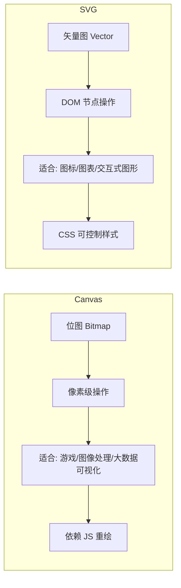
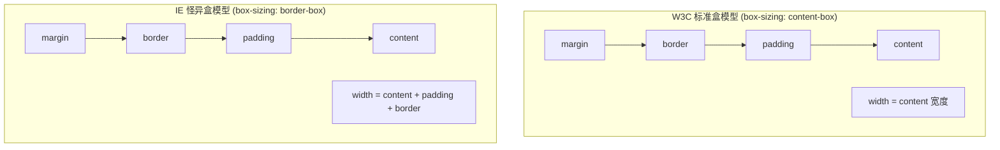
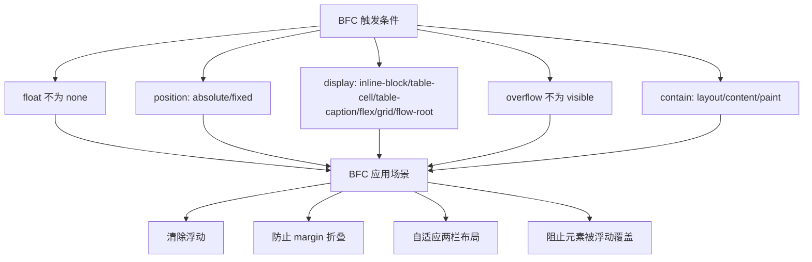

# HTML/CSS 核心

## ⭐ 面试重点速览

| 知识模块 | 重点内容 | 面试频率 |
|----------|----------|----------|
| 语义化标签 | header/nav/main/article/section/aside/footer 的使用场景 | 中 |
| 表单验证 | HTML5 约束验证 API（checkValidity/setCustomValidity） | 中 |
| Canvas/SVG | 位图 vs 矢量图、适用场景对比、性能差异 | 中 |
| 盒模型 | W3C 标准盒模型 vs IE 怪异盒模型、box-sizing | 极高 |
| Flexbox | justify-content/align-items/flex-grow/flex-shrink/flex-basis | 极高 |
| Grid | grid-template-columns/rows、fr 单位、grid-area | 高 |
| BFC | 原理、触发条件、应用场景 | 极高 |
| 响应式设计 | 媒体查询、移动优先、rem/vw/vh | 高 |
| CSS 新特性 | Container Queries、:has() 选择器、CSS Nesting | 中 |

---

## HTML 核心

### 语义化标签

HTML5 引入的语义化标签不仅提升了代码可读性，更重要的是对 **SEO** 和 **无障碍访问（A11Y）** 的支撑。

```html
<!-- 经典的语义化页面结构 -->
<body>
  <header>
    <nav>
      <ul>
        <li><a href="/">首页</a></li>
        <li><a href="/about">关于</a></li>
      </ul>
    </nav>
  </header>

  <main>
    <article>
      <h1>文章标题</h1>
      <section>
        <h2>第一节</h2>
        <p>内容...</p>
      </section>
    </article>
    <aside>
      <h3>侧边栏</h3>
      <p>相关内容</p>
    </aside>
  </main>

  <footer>
    <p>&copy; 2024</p>
  </footer>
</body>
```

| 标签 | 语义 | 使用场景 |
|------|------|----------|
| `<header>` | 页头/区块头 | 页面顶部导航、文章标题区域 |
| `<nav>` | 导航链接组 | 主导航、面包屑、分页 |
| `<main>` | 页面主要内容 | **每个页面只能有一个 main** |
| `<article>` | 独立内容块 | 博客文章、新闻、评论 |
| `<section>` | 文档分节 | 有标题的内容分组 |
| `<aside>` | 侧边/附加内容 | 侧边栏、广告、相关链接 |
| `<footer>` | 页脚/区块尾 | 版权信息、联系方式 |

::: tip 面试回答要点
语义化标签的核心价值排序：**无障碍访问 > SEO > 代码可读性 > 可维护性**。面试官更想听到你对 A11Y 的理解，而非仅仅"让代码看起来更清晰"。
:::

### HTML5 表单验证

HTML5 提供了内置的约束验证 API，无需 JavaScript 即可实现基础校验：

```html
<form id="myForm">
  <!-- required: 必填 -->
  <input type="text" required />

  <!-- pattern: 正则校验 -->
  <input type="text" pattern="[A-Za-z]{3,}" title="至少3个字母" />

  <!-- type 内置校验: email/url/number/date 等 -->
  <input type="email" />
  <input type="url" />
  <input type="number" min="1" max="100" />

  <!-- minlength / maxlength -->
  <input type="text" minlength="6" maxlength="20" />

  <button type="submit">提交</button>
</form>
```

```javascript
// 约束验证 API 核心方法
const form = document.getElementById('myForm');
const input = form.querySelector('input');

// 1. checkValidity() —— 检查单个元素或整个表单是否合法
input.checkValidity();  // 返回 boolean
form.checkValidity();   // 整个表单是否合法

// 2. reportValidity() —— 检查并触发浏览器默认错误提示
input.reportValidity();

// 3. setCustomValidity(message) —— 设置自定义错误信息
input.setCustomValidity('请输入有效的邮箱地址');
// 清空自定义错误（重置为默认校验）
input.setCustomValidity('');

// 4. validity 属性 —— 获取详细的校验状态
input.validity.valueMissing;   // 必填字段为空
input.validity.typeMismatch;   // 类型不匹配（如 email 格式错误）
input.validity.patternMismatch; // 正则不匹配
input.validity.tooLong;        // 超出 maxlength
input.validity.tooShort;       // 不足 minlength
input.validity.rangeUnderflow; // 小于 min
input.validity.rangeOverflow;  // 大于 max
input.validity.valid;          // 综合是否合法
```

::: warning 面试追问：如何阻止表单默认校验行为？
- 在 `<form>` 标签上添加 `novalidate` 属性
- 或在提交按钮上添加 `formnovalidate` 属性
- 使用 `event.preventDefault()` 阻止 submit 事件默认行为
:::

### Canvas vs SVG



| 对比维度 | Canvas | SVG |
|----------|--------|-----|
| 本质 | 位图（像素） | 矢量图（数学描述） |
| DOM | 单个 `<canvas>` 元素 | 每个图形都是独立 DOM 节点 |
| 事件处理 | 需要手动计算坐标命中 | 可直接绑定事件到图形元素 |
| 缩放 | 会失真（可设置 devicePixelRatio） | 不失真 |
| 性能 | 大量对象时性能好（无 DOM 开销） | 对象多时性能下降（DOM 节点多） |
| 修改方式 | 擦除重绘 | 直接修改属性或删除节点 |
| 适用场景 | 游戏、图像滤镜、大数据可视化 | 图标、图表、地图、交互式图形 |

::: tip 面试回答模板
"Canvas 是基于像素的即时模式，适合像素级操作和大量图形渲染；SVG 是基于 DOM 的保留模式，适合需要交互和缩放的图形。可以这样记忆：Canvas 像画板，画完就定型了；SVG 像乐高，每个零件都可以单独操作。"
:::

---

## CSS 核心

### 盒模型

CSS 盒模型是布局的最基础概念，面试中几乎必问。



```css
/* 标准盒模型（默认） */
.element {
  box-sizing: content-box;
  width: 200px;
  padding: 20px;
  border: 10px solid black;
  /* 实际占用宽度 = 200 + 20*2 + 10*2 = 260px */
}

/* 怪异盒模型（推荐用于全局重置） */
.element {
  box-sizing: border-box;
  width: 200px;
  padding: 20px;
  border: 10px solid black;
  /* 实际占用宽度 = 200px（content 自动缩小为 140px） */
}

/* 全局重置 —— 几乎所有项目都会做的第一件事 */
*,
*::before,
*::after {
  box-sizing: border-box;
}
```

::: danger 面试追问：为什么推荐全局使用 border-box？
- `content-box` 下，设置 `width: 100%` + `padding` 会导致溢出
- `border-box` 更符合直觉：设置多宽就占多宽，padding 和 border 向内计算
- 大部分 CSS 框架（Bootstrap、Tailwind）默认使用 `border-box`
:::

### Flexbox 核心属性

Flexbox 是一维布局模型，适合处理行或列方向的排列。

```css
.container {
  display: flex;

  /* 主轴方向（默认 row） */
  flex-direction: row | row-reverse | column | column-reverse;

  /* 主轴对齐 */
  justify-content: flex-start | flex-end | center | space-between | space-around | space-evenly;

  /* 交叉轴对齐（单行） */
  align-items: stretch | flex-start | flex-end | center | baseline;

  /* 多行对齐 */
  align-content: stretch | flex-start | flex-end | center | space-between | space-around;

  /* 是否换行 */
  flex-wrap: nowrap | wrap | wrap-reverse;

  /* 间距（取代 margin 的现代方案） */
  gap: 16px;
}

.item {
  /* 放大比例（默认 0，不放大；剩余空间按比例分配） */
  flex-grow: 1;

  /* 缩小比例（默认 1，空间不足时等比缩小） */
  flex-shrink: 0;

  /* 基础尺寸（默认 auto，在分配剩余空间前的基础值） */
  flex-basis: 200px;

  /* 简写：flex: flex-grow flex-shrink flex-basis */
  flex: 1 0 200px; /* 推荐写法 */

  /* 单独对齐（覆盖 align-items） */
  align-self: auto | flex-start | flex-end | center | baseline | stretch;
}
```

| 属性 | 作用 | 典型值 |
|------|------|--------|
| `flex-grow` | 定义放大比例 | `0`（不放大） / `1`（等分剩余空间） |
| `flex-shrink` | 定义缩小比例 | `0`（不缩小，可能溢出） / `1`（等比缩小） |
| `flex-basis` | 定义基础尺寸 | `auto`（取 width）/ 具体数值 |
| `flex: 1` | 简写 | 等价于 `flex: 1 1 0%` |
| `flex: auto` | 简写 | 等价于 `flex: 1 1 auto` |

::: tip `flex: 1` vs `flex: auto` 的区别
- `flex: 1` (即 `flex: 1 1 0%`)：基础尺寸为 0，所有子元素完全按比例分配空间
- `flex: auto` (即 `flex: 1 1 auto`)：基础尺寸为元素的 width/height，在此基础上分配剩余空间
- 实用场景：等分空间用 `flex: 1`；保留内容宽度后填充用 `flex: auto`
:::

### Grid 布局

Grid 是二维布局模型，适合复杂的页面级布局。

```css
.container {
  display: grid;

  /* 列定义：3 列，第一列 200px，第二列自适应，第三列 1fr */
  grid-template-columns: 200px 1fr 2fr;

  /* 行定义：3 行，第一行自适应，后两行固定 */
  grid-template-rows: auto 100px 100px;

  /* 间距 */
  gap: 16px; /* row-gap + column-gap 的简写 */

  /* 区域模板（配合 grid-area 使用） */
  grid-template-areas:
    "header header header"
    "sidebar main   aside"
    "footer footer footer";
}

.header  { grid-area: header; }
.sidebar { grid-area: sidebar; }
.main    { grid-area: main; }
.aside   { grid-area: aside; }
.footer  { grid-area: footer; }

/* fr 单位：fraction，剩余空间的比例分配 */
/* 以下定义 3 列，比例为 1:2:1 */
grid-template-columns: 1fr 2fr 1fr;

/* 与百分比的区别：fr 在扣除 gap 后计算，100% 包含 gap */
```

::: warning Flexbox vs Grid 选择指南
| 场景 | 推荐方案 |
|------|----------|
| 一维排列（单行/单列） | Flexbox |
| 二维布局（行和列同时控制） | Grid |
| 导航栏、工具栏、卡片列表 | Flexbox |
| 页面整体布局、仪表盘 | Grid |
| 内容驱动的布局（元素数量不确定） | Flexbox |
| 设计驱动的布局（位置固定） | Grid |
:::

### BFC（Block Formatting Context）

BFC 是 CSS 面试最高频考点之一。

::: tip BFC 定义
BFC（Block Formatting Context，块级格式化上下文）是一个独立的渲染区域，规定了内部 Block-level Box 如何布局，并且**与这个区域外部毫不相干**。
:::



```css
/* BFC 核心应用场景 */

/* 1. 清除浮动 —— 父元素触发 BFC 可包裹浮动子元素 */
.clearfix {
  overflow: hidden; /* 触发 BFC */
  /* 或使用现代方案：display: flow-root; */
  display: flow-root;
}

/* 2. 防止 margin 折叠 —— 属于不同 BFC 的元素不会发生 margin 折叠 */
.wrapper {
  overflow: hidden; /* 触发 BFC，内部元素的 margin 不会与外部折叠 */
}

/* 3. 自适应两栏布局 —— 左侧固定，右侧自适应 */
.left {
  float: left;
  width: 200px;
}
.right {
  overflow: hidden; /* 触发 BFC，不会与浮动元素重叠 */
}

/* 4. 阻止被浮动元素覆盖 */
.float-box {
  float: left;
  width: 100px;
}
.bfc-box {
  overflow: hidden; /* 触发 BFC，不与浮动元素重叠 */
}
```

::: danger 面试追问：为什么 overflow: hidden 能清除浮动？

记录准确的回答："`overflow: hidden`（值为非 `visible`）触发了 BFC。BFC 在计算高度时，**浮动元素也参与计算**，因此父容器能够感知到浮动子元素的高度，从而'包裹'住浮动元素。这并非真正的'清除'浮动，而是利用了 BFC 的高度计算规则。"

更现代的方案是 `display: flow-root`，它专门用于创建 BFC，没有 `overflow: hidden` 的副作用（如内容裁剪）。
:::

### 响应式设计

```css
/* 移动优先策略（Mobile First） */
/* 基础样式针对移动端 */
.container {
  padding: 16px;
  font-size: 14px;
}

/* 平板及以上 */
@media (min-width: 768px) {
  .container {
    padding: 24px;
    font-size: 16px;
  }
}

/* 桌面端 */
@media (min-width: 1024px) {
  .container {
    max-width: 1200px;
    margin: 0 auto;
    padding: 32px;
  }
}

/* 视口单位 */
.hero {
  height: 100vh; /* 视口高度的 100% */
  width: 100vw;  /* 视口宽度的 100% */
  font-size: clamp(1rem, 2vw, 2rem); /* 最小 1rem，最大 2rem，中间按 2vw 缩放 */
}

/* rem 方案 */
html {
  /* 1rem = 10px（基于 16px 默认字体，62.5% = 10px），方便计算 */
  font-size: 62.5%;
}
.title {
  font-size: 2.4rem; /* = 24px */
}
```

::: tip 移动优先 vs 桌面优先
- **移动优先（min-width）**：基础样式为移动端，逐步增强。推荐，因为移动端体验优先级更高。
- **桌面优先（max-width）**：基础样式为桌面端，逐步降级。适合桌面端为主的内部系统。
:::

### CSS 新特性

```css
/* Container Queries —— 基于容器宽度而非视口宽度的响应式 */
.card-container {
  container-type: inline-size; /* 声明为尺寸容器 */
  container-name: card;        /* 命名（可选） */
}

@container card (min-width: 400px) {
  .card {
    display: flex;
    flex-direction: row;
  }
}

@container (max-width: 399px) {
  .card {
    display: flex;
    flex-direction: column;
  }
}

/* :has() 选择器 —— "父选择器" */
/* 选中包含 .active 子元素的 .card */
.card:has(.active) {
  border-color: blue;
}

/* 选中包含 img 的 figure */
figure:has(img) {
  background: #f0f0f0;
}

/* 选中后跟 .error 的 .input（相邻兄弟选择器增强） */
.input:has(+ .error) {
  border-color: red;
}

/* CSS Nesting —— 原生嵌套 */
.card {
  background: white;

  & .title {
    font-size: 1.5rem;
    font-weight: bold;
  }

  &:hover {
    box-shadow: 0 2px 8px rgba(0,0,0,0.1);
  }

  @media (min-width: 768px) {
    & {
      padding: 24px;
    }
  }
}
```

---

## ⭐ 面试高频问题汇总

### Q1：BFC 是什么？如何触发？有什么应用场景？

**BFC**（Block Formatting Context）是一个独立的渲染区域，内部布局不受外部影响。

**触发条件**：
- `float` 不为 `none`
- `position` 为 `absolute` 或 `fixed`
- `display` 为 `inline-block`、`table-cell`、`flex`、`grid`、`flow-root`
- `overflow` 不为 `visible`

**应用场景**：
1. 清除浮动（父元素触发 BFC 包裹浮动子元素）
2. 防止 margin 折叠（相邻块级元素的 margin 会合并，BFC 可隔离）
3. 自适应两栏布局（左侧浮动 + 右侧 BFC）
4. 阻止元素被浮动元素覆盖

### Q2：Flexbox 和 Grid 分别适用于什么场景？

- **Flexbox**：一维布局，适合行或列方向的排列。导航栏、工具栏、卡片列表、居中对齐等。
- **Grid**：二维布局，同时控制行和列。页面整体布局、仪表盘、复杂网格系统。
- **记忆口诀**：一维用 Flex，二维用 Grid；内容驱动用 Flex，设计驱动用 Grid。

### Q3：如何实现元素居中？

```css
/* 方案一：Flexbox（推荐，最简洁） */
.parent {
  display: flex;
  justify-content: center; /* 水平居中 */
  align-items: center;     /* 垂直居中 */
}

/* 方案二：Grid（同样简洁） */
.parent {
  display: grid;
  place-items: center; /* justify-items + align-items 的简写 */
}

/* 方案三：绝对定位 + transform（兼容性好） */
.child {
  position: absolute;
  top: 50%;
  left: 50%;
  transform: translate(-50%, -50%);
}

/* 方案四：绝对定位 + margin:auto（需要知道宽高） */
.child {
  position: absolute;
  top: 0; right: 0; bottom: 0; left: 0;
  width: 200px;
  height: 100px;
  margin: auto;
}

/* 方案五：text-align + line-height（单行文本） */
.parent {
  text-align: center;
  line-height: 200px; /* 等于容器高度 */
}
```

### Q4：rem、em、vw、vh 的区别和使用场景？

| 单位 | 相对基准 | 使用场景 |
|------|----------|----------|
| `rem` | 根元素（`<html>`）的 font-size | 全局统一的字体和间距缩放 |
| `em` | 当前元素的 font-size | 组件内部相对缩放（注意嵌套叠加） |
| `vw` | 视口宽度的 1% | 全屏布局、流体排版 |
| `vh` | 视口高度的 1% | 全屏 hero、底部定位 |
| `%` | 父元素的对应属性 | 常规流式布局 |