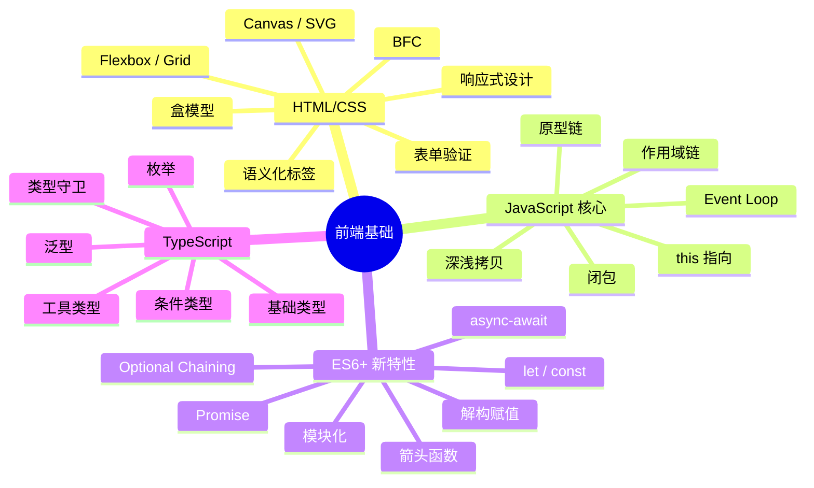

# 前端基础概览

## ⭐ 面试重点速览

| 知识模块 | 重点内容 | 面试频率 |
|----------|----------|----------|
| HTML/CSS | 语义化标签、盒模型、Flexbox/Grid、BFC、响应式设计 | 高 |
| JavaScript 核心 | 原型链、闭包、this 指向、作用域链、深浅拷贝 | 极高 |
| ES6+ 新特性 | let/const、箭头函数、Promise、async-await、模块化 | 极高 |
| TypeScript | 类型系统、泛型、工具类型、interface vs type | 中高 |

---

## 模块概述

前端基础知识是高级前端工程师面试的基石。无论框架如何演进（React、Vue、Angular、Svelte），底层始终是 HTML、CSS 和 JavaScript 三位一体。本模块面向**高级前端面试准备**，深入剖析每个知识点的底层原理、常见陷阱和面试追问方向。

::: danger 为什么前端基础如此重要？
- 大厂面试中，基础题占比通常在 40%~60%，是筛选候选人的第一道门槛
- 框架层的问题（如 Vue 响应式、React Fiber）本质上是基础知识的延伸应用
- 基础不牢的候选人，即使框架经验丰富，也容易被一道"手写深拷贝"或"BFC 原理"淘汰
:::

---

## 知识图谱

---

## 四个子模块简介

| 子模块 | 定位 | 核心难点 | 课时建议 |
|--------|------|----------|----------|
| [HTML/CSS 核心](./html-css.md) | 页面结构与样式基础 | BFC 原理、Flex/Grid 布局选择、响应式策略 | 2~3 天 |
| [JavaScript 核心概念](./javascript-core.md) | 语言底层机制 | 原型链查找、闭包内存模型、this 绑定优先级 | 3~5 天 |
| [ES6+ 新特性](./es6-plus.md) | 现代 JS 开发规范 | Promise 实现原理、async-await 本质、Tree Shaking | 3~4 天 |
| [TypeScript 核心](./typescript.md) | 类型系统保障 | 工具类型实现、条件类型推导、interface vs type | 2~3 天 |

---

## 学习路径建议

### 阶段一：HTML/CSS（1~2 天）

从最直观的页面呈现入手，重点掌握：

1. **盒模型**是 CSS 布局的基石，理解 `content-box` vs `border-box` 的差异
2. **BFC** 是面试高频考点，需要理解触发条件和应用场景（清除浮动、防止 margin 折叠）
3. **Flexbox** 和 **Grid** 分别适用于一维和二维布局，能独立完成常见布局需求
4. 响应式设计中 **rem/vw/vh** 的原理和选择策略

::: tip 面试建议
CSS 面试通常以"实现某个布局效果"为目的，而非单纯背诵属性。多动手写实际布局代码比死记硬背更有效。
:::

### 阶段二：JavaScript 核心（3~5 天）

这是整个前端基础中最关键的部分，投入时间应该最多：

1. **原型链**：画图理解 `__proto__` 和 `prototype` 的指向关系，理解 `instanceof` 原理
2. **闭包**：理解词法作用域 + 函数作为值传递 = 闭包，结合 Event Loop 理解闭包中变量的存活时机
3. **this 指向**：熟记四条绑定规则及优先级，箭头函数的特殊行为
4. **深浅拷贝**：能手写深拷贝，处理循环引用、特殊对象（Date/RegExp/Map/Set）
5. **Event Loop**：理解宏任务/微任务的执行顺序，结合 Promise 和 async-await

::: danger 避坑指南
- 不要只背诵概念，一定要能手写代码
- 原型链题目建议画图辅助理解
- 闭包相关的内存泄漏问题要能说清楚原因和解决方案
:::

### 阶段三：ES6+ 新特性（3~4 天）

现代前端开发的"新标准"，重点在于：

1. **let/const/var 对比**：块级作用域、TDZ、变量提升
2. **箭头函数 vs 普通函数**：this/arguments/prototype/new 四个维度的差异
3. **Promise**：状态机模型、链式调用、手写 Promise.all/race/allSettled/any
4. **async-await**：Generator + 自动执行器的本质
5. **模块化**：ESM vs CommonJS，Tree Shaking 原理

### 阶段四：TypeScript（2~3 天）

大厂必备技能，核心在于类型体操：

1. **基础类型系统**：interface vs type、联合类型、交叉类型
2. **泛型**：泛型约束、条件类型、infer 关键字
3. **工具类型**：Partial/Required/Readonly/Pick/Omit/Record/Exclude/Extract/ReturnType
4. **类型守卫**：typeof/instanceof/in/自定义类型谓词（is）

---

## 面试追问环节

**Q：前端基础知识中，你认为最重要的是哪一块？为什么？**

JavaScript 核心概念（原型链、闭包、this、Event Loop）是最重要的。原因有三：
1. 它们是理解所有前端框架的基础（Vue 的响应式依赖闭包、React Hooks 依赖闭包）
2. 它们是面试中区分初级和高级候选人的分水岭
3. 框架会过时，但 JavaScript 基础是长期不变的

**Q：如果面试官让你比较前端和后端的复杂度，你怎么回答？**

前端复杂在于**状态管理和异步编排**，后端复杂在于**并发控制和数据一致性**。前端的状态分散在 DOM、组件状态、路由、缓存等多个维度，异步操作的时序控制（Promise 链、竞态条件）是高频出错点。后端的并发问题有成熟方案（事务、锁、消息队列），而前端的复杂度往往被低估。

**Q：TypeScript 到底值不值得学？小项目用 TS 是不是过度设计？**

TS 的价值与项目规模成正比，但即使小项目，类型系统也能带来显著收益：
- 编译期发现类型错误，减少运行时 bug
- 更好的 IDE 智能提示和重构支持
- 类型注解即文档，降低维护成本
对于任何超过 3 个文件的项目，TS 的收益就超过成本。唯一的"成本"是学习曲线，但这是一次性投入。

---

## 面试策略建议

### 基础题回答框架

面试中遇到基础题，推荐使用 **STAR-L 框架**：

1. **S（Scenario）**：先给出概念定义，一句话说清楚"是什么"
2. **T（Theory）**：解释底层原理，展示深度理解
3. **A（Application）**：举出实际应用场景，证明你不仅懂理论
4. **R（Related）**：关联相关知识，展示广度
5. **L（Limitation）**：指出该技术的局限性/陷阱，展示批判性思维

**示例：面试官问"说一下闭包"**

> "闭包是指函数能够记住并访问其词法作用域，即使该函数在其词法作用域之外执行（S）。其原理是 JavaScript 引擎在函数创建时会保存对其外部词法环境的引用，形成作用域链（T）。实际应用中，闭包常用于模块模式、柯里化、防抖节流等场景（A）。需要注意的是，闭包会导致外部变量无法被 GC 回收，如果使用不当可能造成内存泄漏（L）。"

### 常见陷阱提醒

::: danger 面试中容易翻车的点
1. **概念混淆**：把原型链的 `__proto__` 和 `prototype` 说反
2. **只背不写**：说得出闭包定义，但写不出循环 + setTimeout 的解决方案
3. **深度不足**：知道 BFC 能清除浮动，但说不清为什么
4. **范围过窄**：知道 Promise.all 的用法，但不知 allSettled 和 any 的区别
5. **避重就轻**：面试官问深拷贝，只回答 JSON 方案而不提循环引用和特殊对象处理
:::