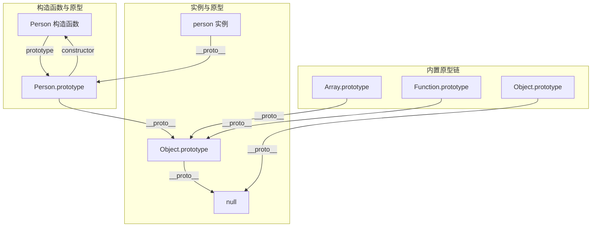
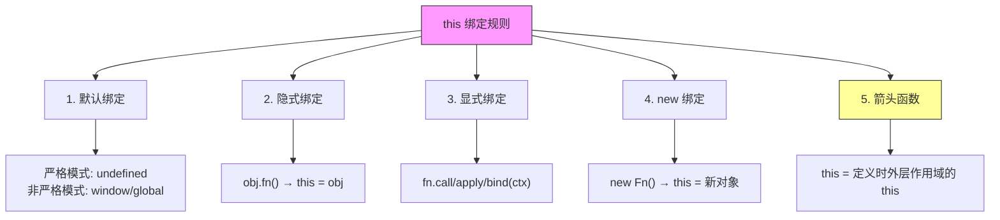

# JavaScript 核心概念

## ⭐ 面试重点速览

| 知识模块 | 重点内容 | 面试频率 |
|----------|----------|----------|
| 原型链 | `__proto__` vs `prototype`、原型链查找机制、继承方式对比 | 极高 |
| 闭包 | 定义与原理、应用场景、内存泄漏问题 | 极高 |
| this 指向 | 五种绑定规则、优先级、箭头函数特殊行为 | 极高 |
| 作用域链 | 词法作用域、作用域链查找机制 | 高 |
| 深浅拷贝 | 实现方式对比、循环引用处理、特殊对象处理 | 极高 |

---

## 原型链

原型链是 JavaScript 实现继承的核心机制，也是面试中最容易被深入追问的知识点。

### 核心关系图



```javascript
// 核心关系验证
function Person(name) {
  this.name = name;
}

Person.prototype.sayHi = function() {
  console.log(`Hi, I'm ${this.name}`);
};

const person = new Person('Alice');

// === 核心指向关系 ===
console.log(person.__proto__ === Person.prototype);        // true
console.log(Person.prototype.constructor === Person);       // true
console.log(Person.prototype.__proto__ === Object.prototype); // true
console.log(Object.prototype.__proto__ === null);           // true —— 原型链终点

// === Function 和 Object 的特殊关系 ===
console.log(Function.__proto__ === Function.prototype);     // true —— 鸡生蛋蛋生鸡
console.log(Object.__proto__ === Function.prototype);       // true
console.log(Function.prototype.__proto__ === Object.prototype); // true
```

::: danger 面试追问：`__proto__` 和 `prototype` 的区别

| 维度 | `__proto__` | `prototype` |
|------|-------------|-------------|
| 归属 | **每个对象**都有（除了 `Object.create(null)`） | **只有函数**才有（箭头函数除外） |
| 本质 | 指向**构造函数的 prototype** | 函数创建时自动生成的**对象** |
| 作用 | 构成原型链，用于属性查找 | 定义将被实例继承的共享属性和方法 |
| 标准 | `Object.getPrototypeOf()` / `Object.setPrototypeOf()` | 直接操作 |

一句话总结：`prototype` 是函数独有的，用于定义"实例的公共模板"；`__proto__` 是所有对象都有的，指向"自己的模板"。实例的 `__proto__` 指向其构造函数的 `prototype`。
:::

### 原型链查找机制

```javascript
const arr = [1, 2, 3];

// 查找 arr.toString() 的路径：
// 1. arr 自身 —— 没有 toString
// 2. arr.__proto__ (Array.prototype) —— 有 toString，但该方法是数组版的
// 3. 假设调用 arr.valueOf()：
//    arr 自身 —— 没有
//    arr.__proto__ (Array.prototype) —— 没有 valueOf
//    arr.__proto__.__proto__ (Object.prototype) —— 找到了！

// instanceof 原理：检查构造函数的 prototype 是否在实例的原型链上
function myInstanceof(instance, constructor) {
  let proto = Object.getPrototypeOf(instance);
  while (proto) {
    if (proto === constructor.prototype) return true;
    proto = Object.getPrototypeOf(proto);
  }
  return false;
}
```

### 继承方式对比

```javascript
// 1. 原型链继承 —— 缺点：引用类型共享、无法向父类传参
function Parent() { this.colors = ['red', 'blue']; }
function Child() {}
Child.prototype = new Parent(); // 问题：所有实例共享 colors 数组

// 2. 构造函数继承 —— 缺点：无法继承原型方法
function Child() {
  Parent.call(this); // 解决了引用共享，但原型方法无法复用
}

// 3. 组合继承 —— 缺点：调用了两次父类构造函数
function Child() {
  Parent.call(this); // 第二次调用 Parent
}
Child.prototype = new Parent(); // 第一次调用 Parent

// 4. ⭐ 寄生组合继承 —— 最佳方案（ES6 class 的底层实现）
function Child() {
  Parent.call(this); // 只调用一次父类构造函数
}
// 核心：以父类原型为原型创建新对象，避免调用父类构造函数
Child.prototype = Object.create(Parent.prototype);
Child.prototype.constructor = Child; // 修复 constructor 指向

// 5. ES6 class —— 语法糖，底层仍是寄生组合继承
class Child extends Parent {
  constructor() {
    super(); // 相当于 Parent.call(this)
  }
}
```

| 继承方式 | 优点 | 缺点 | 推荐度 |
|----------|------|------|--------|
| 原型链继承 | 方法可复用 | 引用类型共享、无法传参 | 不推荐 |
| 构造函数继承 | 属性独立、可传参 | 方法无法复用 | 不推荐 |
| 组合继承 | 综合上述优点 | 调用两次父类构造函数 | 一般 |
| 寄生组合继承 | 完美方案 | 代码稍复杂 | 强烈推荐 |
| ES6 class | 语法简洁 | 需要理解底层 | 实际开发推荐 |

---

## 闭包

### 定义与原理

::: tip 闭包的核心定义
闭包 = **函数 + 函数定义时的词法作用域**。当函数可以记住并访问所在的词法作用域时，就产生了闭包，即使函数是在当前词法作用域之外执行。
:::

```javascript
// 经典闭包示例
function outer() {
  let count = 0; // 这个变量会被闭包"记住"
  return function inner() {
    count++; // inner 访问了 outer 作用域的 count
    console.log(count);
  };
}

const counter = outer();
counter(); // 1 —— outer 已执行完毕，但 count 仍然存活
counter(); // 2

// 闭包原理图解：
// outer 执行 → 创建执行上下文（包含 count 变量）
// outer 返回 inner → inner 持有对 outer 词法作用域的引用
// outer 执行上下文出栈 → 但词法作用域因 inner 的引用未被 GC 回收
// 调用 counter() → 通过作用域链找到 count
```

### 闭包应用场景

```javascript
// 1. 私有变量（模块模式）
const Counter = (function() {
  let count = 0; // 私有变量，外部无法直接访问
  return {
    increment() { return ++count; },
    decrement() { return --count; },
    getCount() { return count; },
  };
})();
Counter.increment(); // 1
Counter.count;       // undefined —— 外部无法访问

// 2. 柯里化（Currying）
function curry(fn) {
  return function curried(...args) {
    if (args.length >= fn.length) {
      return fn.apply(this, args);
    }
    return function(...nextArgs) {
      return curried.apply(this, args.concat(nextArgs));
    };
  };
}

const add = (a, b, c) => a + b + c;
const curriedAdd = curry(add);
curriedAdd(1)(2)(3); // 6
curriedAdd(1, 2)(3); // 6

// 3. 防抖与节流 —— 闭包保存 timerId
function debounce(fn, delay) {
  let timer = null; // 闭包保存的 timer
  return function(...args) {
    clearTimeout(timer);
    timer = setTimeout(() => fn.apply(this, args), delay);
  };
}

// 4. 循环中的闭包经典问题
// 问题代码：
for (var i = 0; i < 5; i++) {
  setTimeout(() => console.log(i), 0); // 全部输出 5
}

// 解决方案一：使用 let（创建块级作用域）
for (let i = 0; i < 5; i++) {
  setTimeout(() => console.log(i), 0); // 0, 1, 2, 3, 4
}

// 解决方案二：IIFE（立即执行函数创建独立作用域）
for (var i = 0; i < 5; i++) {
  (function(j) {
    setTimeout(() => console.log(j), 0);
  })(i);
}
```

::: danger 闭包与内存泄漏
闭包本身不会造成内存泄漏，关键在于**不需要的闭包引用没有被释放**：

```javascript
// 潜在内存泄漏场景
function createHeavyClosure() {
  const heavyData = new Array(10000000).fill('*'); // 大量数据
  const element = document.getElementById('btn');
  element.addEventListener('click', function() {
    // 这个闭包引用了 heavyData，即使它并未使用
    console.log('clicked');
  });
  // 正确的做法：在不需要时移除事件监听，或让闭包只引用必要的变量
}
```

**排查方法**：
- Chrome DevTools → Memory → Heap Snapshot → 查找 Detached DOM 和大对象
- 使用 WeakMap/WeakSet 存储可被 GC 的对象引用
- 及时清理事件监听、定时器（`clearTimeout`/`clearInterval`）
:::

---

## this 指向

this 是 JavaScript 中最令人困惑的概念之一，但也是面试中最高频的考点。

### 绑定规则与优先级



```javascript
// === 绑定规则示例 ===

// 1. 默认绑定
function foo() {
  console.log(this);
}
foo(); // window（非严格模式）/ undefined（严格模式）

// 2. 隐式绑定
const obj = {
  name: 'obj',
  foo() { console.log(this.name); }
};
obj.foo(); // 'obj'

// 隐式丢失 —— 经典陷阱
const bar = obj.foo;
bar(); // undefined（this 丢失，变成了默认绑定）

// 3. 显式绑定
function greet(greeting, punctuation) {
  console.log(`${greeting}, ${this.name}${punctuation}`);
}
const person = { name: 'Alice' };
greet.call(person, 'Hello', '!');   // Hello, Alice!
greet.apply(person, ['Hi', '!!']); // Hi, Alice!!
const boundGreet = greet.bind(person, 'Hey');
boundGreet('!!!'); // Hey, Alice!!!

// 4. new 绑定
function Person(name) {
  this.name = name; // this 指向新创建的对象
}
const alice = new Person('Alice');

// 5. 箭头函数 —— 没有自己的 this
const obj2 = {
  name: 'obj2',
  foo: () => {
    console.log(this.name); // this 指向定义时的外层作用域（此处为 window）
  },
  bar() {
    const arrow = () => console.log(this.name); // this 继承自 bar 的 this
    arrow();
  }
};
obj2.foo(); // undefined
obj2.bar(); // 'obj2'
```

::: danger 面试追问：this 绑定优先级

**优先级排名**：`new 绑定 > 显式绑定(bind) > 隐式绑定 > 默认绑定`

```javascript
// 验证：new 绑定 > 显式绑定
function Foo() {
  console.log(this.a);
}
const bound = Foo.bind({ a: 1 });
const instance = new bound(); // undefined —— new 绑定的优先级更高
// new 绑定时，bind 传入的 this 被忽略，但 bind 传入的其他参数仍生效

// 验证：显式绑定 > 隐式绑定
const obj = {
  foo() { console.log(this.a); }
};
obj.foo.call({ a: 2 }); // 2
```
:::

### call / apply / bind 手写实现

```javascript
// call 手写实现
Function.prototype.myCall = function(context, ...args) {
  // 处理 null/undefined 情况
  context = context == null ? window : Object(context);
  // 使用 Symbol 避免属性名冲突
  const fnKey = Symbol('fn');
  context[fnKey] = this; // this 即调用 myCall 的函数
  // 执行并获取结果
  const result = context[fnKey](...args);
  // 清理临时属性
  delete context[fnKey];
  return result;
};

// apply 手写实现
Function.prototype.myApply = function(context, args) {
  context = context == null ? window : Object(context);
  const fnKey = Symbol('fn');
  context[fnKey] = this;
  const result = args ? context[fnKey](...args) : context[fnKey]();
  delete context[fnKey];
  return result;
};

// bind 手写实现
Function.prototype.myBind = function(context, ...bindArgs) {
  const fn = this; // 保存原函数
  // 返回绑定后的函数
  function boundFn(...callArgs) {
    // 合并 bind 时传入的参数和调用时传入的参数
    const allArgs = bindArgs.concat(callArgs);
    // 判断是否通过 new 调用：new 调用时 this 指向 boundFn 实例
    // 此时应忽略 context，使用原函数作为构造函数
    if (this instanceof boundFn) {
      return fn.apply(this, allArgs);
    }
    return fn.apply(context, allArgs);
  }
  // 维护原型链（寄生组合式继承）
  boundFn.prototype = Object.create(fn.prototype);
  return boundFn;
};
```

---

## 作用域链

```javascript
// 作用域链：由内向外查找变量
const global = 'global';

function outer() {
  const outerVar = 'outer';

  function inner() {
    const innerVar = 'inner';
    console.log(innerVar); // 在当前作用域找到
    console.log(outerVar); // 向上查找 outer 作用域
    console.log(global);   // 继续向上查找全局作用域
  }

  inner();
}

// 查找顺序：inner 作用域 → outer 作用域 → 全局作用域 → 报错(ReferenceError)
// 这个查找链在函数定义时（词法分析阶段）就已确定，而非执行时
```

::: tip 词法作用域 vs 动态作用域
JavaScript 使用**词法作用域**（静态作用域），作用域在**代码书写时**就确定了，与函数在何处被调用无关。`this` 是唯一具有动态特性的机制。
:::

---

## 深浅拷贝

### 浅拷贝实现

```javascript
// 浅拷贝：只复制第一层属性，嵌套对象仍共享引用

// 1. Object.assign
const shallow1 = Object.assign({}, obj);

// 2. 展开运算符
const shallow2 = { ...obj };

// 3. 数组浅拷贝
const arr = [1, 2, [3, 4]];
const arrCopy1 = arr.slice();
const arrCopy2 = [...arr];
const arrCopy3 = arr.concat();
```

### 深拷贝：从简单到完善

```javascript
// 1. JSON 方案 —— 有严重局限性
const deep1 = JSON.parse(JSON.stringify(obj));
// 问题：
// - 无法处理 undefined、Symbol、Function（直接忽略）
// - 无法处理 Date（转为字符串，反序列化后变成字符串而非 Date 对象）
// - 无法处理 RegExp（转为空对象 {}）
// - 无法处理 Map、Set、WeakMap、WeakSet
// - 无法处理循环引用（直接报错：TypeError: Converting circular structure to JSON）
// - 丢失原型链

// 2. ⭐ 完善的手写深拷贝（面试重点）
function deepClone(obj, map = new WeakMap()) {
  // 基本类型和 null 直接返回
  if (obj === null || typeof obj !== 'object') return obj;

  // 处理循环引用：如果已克隆过，直接返回缓存的副本
  if (map.has(obj)) return map.get(obj);

  // 处理 Date
  if (obj instanceof Date) return new Date(obj);

  // 处理 RegExp
  if (obj instanceof RegExp) return new RegExp(obj.source, obj.flags);

  // 处理 Map
  if (obj instanceof Map) {
    const clone = new Map();
    map.set(obj, clone);
    obj.forEach((value, key) => {
      clone.set(deepClone(key, map), deepClone(value, map));
    });
    return clone;
  }

  // 处理 Set
  if (obj instanceof Set) {
    const clone = new Set();
    map.set(obj, clone);
    obj.forEach((value) => {
      clone.add(deepClone(value, map));
    });
    return clone;
  }

  // 处理数组和普通对象
  const clone = Array.isArray(obj) ? [] : {};
  // 建立映射关系，用于处理循环引用
  map.set(obj, clone);

  // 递归复制所有属性（包括 Symbol 类型的 key）
  Reflect.ownKeys(obj).forEach((key) => {
    clone[key] = deepClone(obj[key], map);
  });

  return clone;
}
```

::: danger 面试追问：为什么使用 WeakMap 而不是 Map 处理循环引用？
- **WeakMap 的 key 是弱引用**：当原对象被 GC 回收时，WeakMap 中对应的 key-value 也会被自动回收，不会阻止 GC
- 使用 Map 会导致 key（原对象）一直被引用，即使外部已无引用，也无法被 GC
- 在深拷贝完成后，WeakMap 中的映射关系会随原对象一起被回收，无内存泄漏风险
:::

---

## ⭐ 面试高频问题汇总

### Q1：原型链的终点是什么？

原型链的终点是 `null`。查找路径：`实例.__proto__` → `构造函数.prototype` → `...` → `Object.prototype` → `null`。

### Q2：闭包经典面试题 —— for 循环 + setTimeout

```javascript
// 问题：以下代码输出什么？
for (var i = 0; i < 5; i++) {
  setTimeout(() => console.log(i), 0);
}
// 输出：5 5 5 5 5
// 原因：var 没有块级作用域，所有回调共享同一个 i

// 解决方案（按推荐程度排序）：
// 1. 使用 let（最佳）
for (let i = 0; i < 5; i++) { setTimeout(() => console.log(i), 0); }

// 2. 使用 IIFE
for (var i = 0; i < 5; i++) { (function(j) { setTimeout(() => console.log(j), 0); })(i); }

// 3. setTimeout 第三个参数
for (var i = 0; i < 5; i++) { setTimeout(console.log, 0, i); }
```

### Q3：手写深拷贝需要注意哪些点？

1. **基本类型直接返回**：`typeof !== 'object'` 或 `null`
2. **循环引用**：使用 WeakMap 缓存已复制的对象
3. **特殊对象**：Date、RegExp、Map、Set 需要特殊处理
4. **Symbol 属性**：使用 `Reflect.ownKeys` 而非 `Object.keys`
5. **原型链**：根据需求决定是否保留（通常不保留，但 `instanceof` 检查会失效）