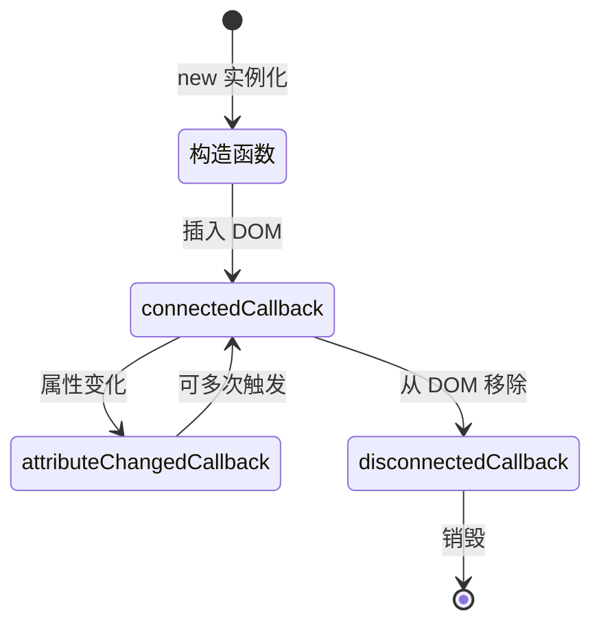

# Web Components 基础

## ⭐ 面试重点速览

| 考点 | 考察频率 | 难度 | 掌握要求 |
|------|----------|------|----------|
| Web Components 三大核心 | ⭐⭐⭐⭐⭐ | 简单 | Custom Elements / Shadow DOM / HTML Templates 必须记住 |
| Custom Elements 自定义元素 | ⭐⭐⭐⭐⭐ | 中等 | 生命周期、扩展方式（autonomous / built-in） |
| Shadow DOM 样式隔离原理 | ⭐⭐⭐⭐⭐ | 中等 | 为什么样式不会泄露和被污染 |
| 与 Vue/React 组件对比 | ⭐⭐⭐⭐ | 中等 | 框架无关 vs 框架依赖，生态 vs 标准 |
| Web Components 解决了什么问题 | ⭐⭐⭐⭐ | 中等 | 组件复用、框架中立、浏览器原生实现 |
| Shadow DOM 优缺点 | ⭐⭐⭐ | 中等 | 隔离了样式，但也带来了样式穿透问题 |

---

## 一、什么是 Web Components？

**Web Components** 是一组 **W3C 标准原生 API**，允许开发者创建**可复用、框架无关、样式隔离**的自定义组件，可以直接在现代浏览器中使用，不需要依赖 Vue、React 等框架。

```mermaid
graph TD
    WC[Web Components<br/>浏览器原生标准] --> CE[Custom Elements<br/>自定义元素]
    WC --> SD[Shadow DOM<br/>样式与 DOM 隔离]
    WC --> HT[HTML Templates<br/>模板复用]
    CE --> |注册| document.define()
    SD --> |创建| attachShadow()
    HT --> <template>标签
```

### 核心理念

组件化开发已经是前端的标配：

- **框架时代**：Vue 组件、React 组件... 都依赖各自框架
- **Web Components 理念**：组件应该是**浏览器原生支持**的，框架中立，哪里都能用

```html
<!-- 原生 HTML 就能用，不需要编译 -->
<user-card avatar="..." name="张三" role="管理员"></user-card>
```

一句话理解：**Web Components 把组件化变成了浏览器原生能力，不再需要框架也能写组件。**

### 为什么需要 Web Components？

| 痛点 | Web Components 的解决方案 |
|------|---------------------------|
| 框架绑定，无法复用 | 原生支持，任何框架都能使用 |
| 样式冲突，CSS 全局污染 | Shadow DOM 天然隔离样式 |
| DOM 结构暴露，容易被篡改 | Shadow DOM 内部封装，外部无法访问 |
| 大型应用组件维护困难 | 标准化封装，复用性更好 |
| 微前端场景下跨框架组件 | 框架中立，跨应用、跨框架复用 |

::: tip 适用场景
- 跨框架公共组件库（设计系统需要在多个框架项目中复用）
- 浏览器插件、浏览器扩展组件
- 微前端架构中，跨应用复用的通用组件
- 需要发布给第三方使用的独立组件
- 小型功能组件，不需要引入完整框架
:::

---

## 二、三大核心技术详解

Web Components 不是单一技术，而是由三个独立规范组成：**Custom Elements**、**Shadow DOM**、**HTML Templates**。

### 2.1 Custom Elements（自定义元素）

**Custom Elements** 允许你自定义 HTML 标签，定义自己的行为，扩展原生 HTML 元素。

#### 两种扩展方式

| 类型 | 说明 | 用法 |
|------|------|------|
| **Autonomous custom elements** | 完全独立元素，不继承现有 | `class MyEl extends HTMLElement {}` |
| **Customized built-in elements** | 继承并扩展现有 HTML 元素 | `class MyButton extends HTMLButtonElement {}` |

#### 生命周期钩子

```javascript
class MyElement extends HTMLElement {

  // 1. 元素被插入 DOM 时调用
  connectedCallback() {
    console.log('元素插入 DOM');
  }

  // 2. 元素从 DOM 移除时调用
  disconnectedCallback() {
    console.log('元素从 DOM 移除');
  }

  // 3. 属性被添加 / 删除 / 修改 时调用
  attributeChangedCallback(name, oldValue, newValue) {
    console.log(`属性 ${name} 从 ${oldValue} 变成 ${newValue}`);
  }

  // 4. 元素移动到新文档时调用（adoptNode）
  adoptedCallback() {
    console.log('元素被移动到新文档');
  }

  // 需要监听的属性列表
  static get observedAttributes() {
    return ['name', 'avatar']; // 这些属性变化会触发 attributeChangedCallback
  }
}

// 注册自定义元素
customElements.define('my-element', MyElement);
```

#### 使用自定义元素

```html
<!-- 在 HTML 中直接使用 -->
<my-element name="张三" avatar="https://..."></my-element>

<!-- 在 JavaScript 中动态创建 -->
const el = document.createElement('my-element');
el.setAttribute('name', '李四');
document.body.appendChild(el);
```

#### 扩展内置元素

```javascript
// 扩展原生 HTMLButtonElement
class MyFancyButton extends HTMLButtonElement {
  constructor() {
    super();
    this.addEventListener('click', () => {
      console.log('自定义按钮被点击');
    });
  }

  connectedCallback() {
    this.classList.add('fancy-button');
  }
}

// 注册扩展内置元素，第三个参数 is 必须指定
customElements.define('fancy-button', MyFancyButton, { extends: 'button' });
```

使用方式：
```html
<button is="fancy-button">我是美化版按钮</button>
```

::: warning 兼容性问题
有些浏览器（如 Safari）对**扩展内置元素**（customized built-in）的支持不好。如果需要兼容，请优先使用**完全独立元素**（autonomous）。
:::

---

### 2.2 Shadow DOM（影子 DOM）

**Shadow DOM** 提供了 DOM 和样式的**隔离机制**：
- Shadow DOM 内部的 DOM 对外部**不可见**（封装）
- Shadow DOM 内部的 CSS 对外部**不影响**（样式隔离）
- 外部 CSS 不会影响 Shadow DOM 内部（样式隔离）

#### 为什么需要 Shadow DOM？

没有 Shadow DOM：
```html
<!-- 全局样式不小心覆盖了组件样式 -->
<style>
div { color: red; } /* 会影响组件内部所有 div */
</style>

<div class="my-component">
  <div>文字变红色了，我并不想要</div></div>
</div>
```

有了 Shadow DOM：
- 组件内部 DOM 与文档 DOM 隔离
- 组件内部 CSS 不会污染全局
- 全局 CSS 不会污染组件内部

#### 创建 Shadow DOM

```javascript
class MyCard extends HTMLElement {
  constructor() {
    super();
    // 附加一个 Shadow Root 到当前元素
    // mode: 'open' → 外部可以通过 this.shadowRoot 访问
    // mode: 'closed' → 外部无法访问，完全封闭
    const shadow = this.attachShadow({ mode: 'open' });

    // 所有内容都放到 shadow 里面
    const wrapper = document.createElement('div');
    wrapper.className = 'wrapper';
    wrapper.textContent = '我在 Shadow DOM 里';

    // 添加样式，这些样式只影响当前 Shadow DOM，不影响外面
    const style = document.createElement('style');
    style.textContent = `
      .wrapper {
        padding: 16px;
        background: #f0f0f0;
        border-radius: 8px;
        color: #333; /* 只影响这里，外面不会变 */
      }
    `;

    shadow.appendChild(style);
    shadow.appendChild(wrapper);
  }
}

customElements.define('my-card', MyCard);
```

#### Shadow DOM 如何实现样式隔离？

Shadow DOM 的样式隔离不是靠 CSS 命名空间，而是靠**DOM 树的边界**：

```mermaid
graph TD
    Document[主文档 DOM]
    Document --> A[普通元素]
    Document --> B[Web Component]
    B --> ShadowRoot[Shadow Root]
    ShadowRoot --> C[组件内部元素<br/>样式只在这里生效]

    Note over Document,ShadowRoot: 主文档选择器无法穿透 Shadow DOM<br/>选择器查找不会进入 Shadow 边界
```

**原理详解**：

1. **DOM 树边界**：Shadow Root 是一个独立的 DOM 子树，与主文档分离
2. **选择器范围限制**：浏览器的 CSS 选择器匹配默认不会跨 Shadow DOM 边界
   - `document.querySelectorAll('div')` 不会找到 Shadow DOM 里的 div
   - `div { color: red; }` 在主文档中不会影响 Shadow DOM 内部
3. **样式封装**：Shadow DOM 内部的样式只应用于当前 Shadow Root，不会冒泡出去
4. **继承**：部分继承属性（color、font-family 等）仍然会从宿主继承，因为 CSS inherit 会穿透边界

::: tip 面试重点
**问：Shadow DOM 如何实现样式隔离？**

答：Shadow DOM 通过创建独立的 DOM 子树边界，配合浏览器 CSS 选择器范围限制来实现样式隔离。主文档的选择器无法穿透 Shadow DOM 边界，因此不会影响内部样式；Shadow DOM 内部的样式也只在边界内生效，不会污染全局，从而实现了双向隔离。

（注意：继承属性如 color、font 仍然会继承，这是规范设计，不是 bug。）
:::

#### 样式穿透（::part 和 ::slotted）

Shadow DOM 虽然默认隔离，但也提供了可控的样式穿透方式：

| 方式 | 用途 | 语法 |
|------|------|------|
| `::part(name)` | 允许外部选择 Shadow DOM 中带 `part` 属性的元素 | `my-card::part(header) { background: blue; }` |
| `::slotted()` | 选择通过 `<slot>` 插入的内容 | `::slotted(p) { margin: 0; }` |

示例：
```javascript
// 组件内部
class UserCard extends HTMLElement {
  constructor() {
    super();
    this.attachShadow({ mode: 'open' }).innerHTML = `
      <style>
        .card { padding: 16px; }
        ::slotted(.footer) { margin-top: 16px; border-top: 1px solid #eee; }
      </style>
      <div class="card" part="card">
        <div part="header">
          <h3 part="title"><slot name="title"></slot></h3>
        </div>
        <div>
          <slot></slot>
        </div>
      </div>
    `;
  }
}
```

```css
/* 外部可以通过 ::part 定制样式 */
user-card::part(card) {
  border: 1px solid #e5e7eb;
  border-radius: 8px;
}

user-card::part(title) {
  font-size: 20px;
  color: #111827;
}
```

---

### 2.3 HTML Templates（模板）

`<template>` 标签允许你声明一段**不立即渲染**的 HTML 模板，使用时再克隆到 DOM 中。

```html
<template id="user-card-template">
  <style>
    .card { /* ... */ }
  </style>
  <div class="card">
    
    <div class="info">
      <h3 class="name"></h3>
      <p class="role"></p>
    </div>
  </div>
</template>
```

在 Custom Elements 中使用模板：

```javascript
class UserCard extends HTMLElement {
  constructor() {
    super();
    // 获取模板
    const template = document.getElementById('user-card-template');
    // 克隆模板内容（因为模板可复用，每次用都要克隆）
    const content = template.content.cloneNode(true);

    this.attachShadow({ mode: 'open' }).appendChild(content);
  }
}
```

`<template>` 的特点：

- 内容在解析时不会渲染到页面上
- DOM 已经解析好了，用的时候直接克隆，比构造字符串快
- 内容惰性，使用前不会有性能开销
- 可以放任何内容，包括 script、style

#### `<slot>` 内容分发

`<slot>` 用于把外部内容分发到组件内部指定位置，类似 Vue/React 的插槽。

```javascript
// 组件模板
const template = `
  <div class="card">
    <div class="header">
      <slot name="header"></slot> <!-- 具名插槽 -->
    </div>
    <div class="content">
      <slot></slot> <!-- 默认插槽 -->
    </div>
    <div class="footer">
      <slot name="footer"></slot>
    </div>
  </div>
`;
```

使用时：
```html
<user-card>
  <div slot="header">
    <h2>用户信息</h2>
  </div>

  <p>这里是默认插槽的内容，会填到 <slot> 默认位置</p>

  <div slot="footer">
    <button>编辑</button>
    <button>删除</button>
  </div>
</user-card>
```

---

## 三、完整示例：创建一个 UserCard 组件

我们来创建一个完整的 `user-card` 自定义组件，包含头像、姓名、角色，属性变化会自动更新：

```javascript
// user-card.js
class UserCard extends HTMLElement {
  // 监听哪些属性变化会触发更新
  static get observedAttributes() {
    return ['avatar', 'name', 'role'];
  }

  constructor() {
    super();

    // 创建 Shadow DOM
    this.attachShadow({ mode: 'open' });

    // 初始化 DOM 结构
    this.shadowRoot.innerHTML = `
      <style>
        * {
          box-sizing: border-box;
          margin: 0;
          padding: 0;
        }

        .card {
          display: flex;
          align-items: center;
          gap: 16px;
          padding: 20px;
          border-radius: 12px;
          background: #ffffff;
          box-shadow: 0 1px 3px 0 rgba(0, 0, 0, 0.1), 0 1px 2px 0 rgba(0, 0, 0, 0.06);
          max-width: 400px;
        }

        .avatar-container {
          flex-shrink: 0;
        }

        .avatar {
          width: 64px;
          height: 64px;
          border-radius: 50%;
          object-fit: cover;
          border: 2px solid #f3f4f6;
        }

        .info {
          flex: 1;
          min-width: 0;
        }

        .name {
          font-size: 18px;
          font-weight: 600;
          color: #111827;
          margin-bottom: 4px;
        }

        .role {
          font-size: 14px;
          color: #6b7280;
        }

        /* 响应式适配 */
        @media (max-width: 480px) {
          .card {
            flex-direction: column;
            text-align: center;
            padding: 16px;
          }
        }
      </style>

      <div class="card">
        <div class="avatar-container">
          
        </div>
        <div class="info">
          <div class="name"></div>
          <div class="role"></div>
        </div>
      </div>
    `;

    // 缓存 DOM 引用
    this.avatarEl = this.shadowRoot.querySelector('.avatar');
    this.nameEl = this.shadowRoot.querySelector('.name');
    this.roleEl = this.shadowRoot.querySelector('.role');
  }

  // 元素插入 DOM 后更新渲染
  connectedCallback() {
    this.render();
  }

  // 属性变化时更新渲染
  attributeChangedCallback() {
    this.render();
  }

  // Getter / Setter 属性访问器
  get avatar() {
    return this.getAttribute('avatar');
  }

  set avatar(value) {
    this.setAttribute('avatar', value);
  }

  get name() {
    return this.getAttribute('name');
  }

  set name(value) {
    this.setAttribute('name', value);
  }

  get role() {
    return this.getAttribute('role');
  }

  set role(value) {
    this.setAttribute('role', value);
  }

  // 渲染方法：根据当前属性更新 DOM
  render() {
    if (this.avatarEl && this.avatar) {
      this.avatarEl.src = this.avatar;
    }
    if (this.nameEl && this.name) {
      this.nameEl.textContent = this.name;
    }
    if (this.roleEl && this.role) {
      this.roleEl.textContent = this.role;
    }
  }
}

// 注册自定义元素
customElements.define('user-card', UserCard);
```

使用方式：

```html
<!DOCTYPE html>
<html>
<head>
  <title>Web Components 示例</title>
  <!-- 引入组件 -->
  <script src="./user-card.js"></script>
</head>
<body>
  <!-- 直接用原生 HTML 使用 -->
  <user-card
    avatar="https://api.dicebear.com/7.x/avataaars/svg?seed=张三"
    name="张三"
    role="前端开发工程师">
  </user-card>

  <br>

  <user-card
    avatar="https://api.dicebear.com/7.x/avataaars/svg?seed=李四"
    name="李四"
    role="产品经理">
  </user-card>

  <script>
    // JavaScript 动态修改属性
    const card = document.querySelector('user-card');
    setTimeout(() => {
      card.name = '张三（已修改）';
    }, 2000);
  </script>
</body>
</html>
```

这个完整示例展示了：

1. Shadow DOM 的创建和样式隔离
2. `observedAttributes` + `attributeChangedCallback` 实现属性监听
3. Getter / Setter 方便 JS 操作属性
4. 完整的 CSS 样式都封装在组件内部
5. 在任何 HTML 文件中直接引入使用，不需要框架，不需要构建

---

## 四、Web Components 生命周期



| 生命周期 | 触发时机 | 常见用途 |
|----------|----------|----------|
| **constructor** | 创建实例时 | 初始化状态、创建 Shadow DOM、缓存 DOM 引用 |
| **connectedCallback** | 元素插入 DOM | 真正开始渲染、添加事件监听、请求数据 |
| **disconnectedCallback** | 元素从 DOM 移除 | 清理工作：移除事件监听、清除定时器、取消请求 |
| **attributeChangedCallback** | 监听的属性变化 | 根据新属性重新渲染 |
| **adoptedCallback** | 使用 `document.adoptNode()` 移动到新文档 | 很少用到 |

::: tip 最佳实践
- `constructor` 只做初始化，不要做副作用（网络请求、DOM 操作）
- 副作用放在 `connectedCallback` 中
- `disconnectedCallback` 一定要清理所有定时器、事件监听器，防止内存泄漏

```javascript
class TimerComponent extends HTMLElement {
  connectedCallback() {
    // 启动定时器
    this.timer = setInterval(() => {
      console.log('tick');
    }, 1000);
  }

  disconnectedCallback() {
    // 必须清理！否则组件移除后定时器还在运行 → 内存泄漏
    clearInterval(this.timer);
  }
}
```
:::

---

## 五、Web Components vs Vue/React 组件对比

| 对比维度 | Web Components | Vue / React 组件 |
|----------|----------------|-------------------|
| **框架依赖** | 零依赖，浏览器原生 | 必须依赖对应框架 |
| **可复用性** | 跨框架，任何地方能用 | 只能在对应框架用 |
| **打包体积** | 不需要引入框架运行时 | Vue 3 + runtime ~ 30KB gzipped |
| **样式隔离** | Shadow DOM 原生支持 | 需要框架方案（Vue scoped / CSS-in-JS） |
| **数据绑定** | 需要手动操作 DOM | 声明式，响应式自动更新 |
| **生态** | 生态相对较小 | 生态极其丰富，包管理完善 |
| **标准化** | W3C 标准，浏览器原生实现 | 框架社区标准，演进快 |
| **学习成本** | 原生 API，熟悉 HTML/CSS/JS 就能写 | 需要学习框架的概念和 API |

### 什么时候用 Web Components？

| 场景 | 推荐度 | 原因 |
|------|--------|------|
| **跨框架公共组件库** | ✅️ 强烈推荐 | 一份代码，Vue/React/Angular 都能用 |
| **微前端架构中的通用组件** | ✅️ 推荐 | 主应用和子应用技术栈不同，需要中立组件 |
| **浏览器扩展、浏览器插件** | ✅️ 推荐 | 不需要注入框架运行时，体积小 |
| **给第三方提供嵌入式组件** | ✅️ 推荐 | 嵌入第三方网站，不依赖对方技术栈 |
| **大型应用中的业务组件** | ⚠️ 看情况 | 如果整个应用用 React/Vue，业务组件还是用框架方便 |
| **复杂状态管理应用** | ❌ 不推荐 | Redux/Vuex 比原生手动状态管理方便多了 |

### Web Components 能替代框架吗？

**不能。** Web Components 解决的是**组件封装和复用**问题，不解决**整个应用开发**问题。

现代前端框架（Vue/React）提供的价值：

- 响应式数据绑定，状态变化自动更新视图
- 虚拟 DOM，高效的批量更新
- 成熟的状态管理方案
- 路由、SSR 等完整生态
- 开发工具链完善（DevTools、Hot Module Replacement）

Web Components 不能替代这些能力，它是对原生能力的补充，**和框架互补，不是替代关系**。

::: tip 常见误区
误区："Web Components 是原生组件，比框架更轻更快"

实际：框架编译优化之后（Vue 编译时优化、React 19 新特性），性能不一定比 Web Components 差。而且框架提供了开发效率，Web Components 手动 DOM 操作开发效率低。

结论：**Web Components 适合做封装好的独立组件，不适合做整个应用。**
:::

---

## 六、常见问题与面试题

### Q1: Web Components 解决了什么问题？

**A**：Web Components 主要解决三个问题：

1. **组件复用问题**：原生支持组件化，不需要框架就能写可复用组件
2. **框架绑定问题**：一个组件可以在所有框架中使用，不需要为每个框架重写
3. **样式隔离问题**：Shadow DOM 原生支持样式隔离，天然解决 CSS 全局污染问题

典型场景：设计系统组件库，一份实现，多个框架项目复用。

### Q2: Shadow DOM 和 Virtual DOM 的区别是什么？

| 维度 | Shadow DOM | Virtual DOM |
|------|------------|-------------|
| **是什么** | 浏览器原生的 DOM 隔离机制 | 框架用 JS 模拟的内存 DOM 树 |
| **核心目的** | 样式隔离和 DOM 封装 | 高效批量更新，减少真实 DOM 操作 |
| **位置** | 浏览器原生实现 | JavaScript 层实现 |
| **互斥吗** | 不互斥，可以共存 | 不互斥，可以共存 |

React/Vue 也可以用 Shadow DOM，Web Components 也可以用 Virtual DOM。

### Q3: 为什么 Shadow DOM 中外部 CSS 选择器选不到？

因为 Shadow DOM 是 DOM 树的边界，浏览器的 CSS 选择器匹配算法默认**不会穿透** Shadow DOM 边界。这是规范设计，正是这种边界带来了样式隔离的特性。

如果需要让外部定制样式，可以使用 `::part()` 语法显式开放可定制的部分。

### Q4: Web Components 有兼容性问题吗？

现代浏览器（Chrome、Firefox、Edge、Safari 10+）都已经支持了：

| 特性 | Chrome | Firefox | Safari | Edge |
|------|--------|---------|--------|------|
| Custom Elements | ✓ 54+ | ✓ 63+ | ✓ 10.1+ | ✓ 79+ |
| Shadow DOM | ✓ 53+ | ✓ 63+ | ✓ 11.1+ | ✓ 79+ |
| HTML Templates | ✓ 26+ | ✓ 22+ | ✓ 8+ | ✓ 13+ |

目前市场占有率数据：支持率超过 **95%**，面向现代浏览器的项目可以放心使用。需要兼容老浏览器可以使用 [@webcomponents/webcomponentsjs](https://github.com/webcomponents/polyfills) polyfill。

### Q5: 为什么需要 getter/setter 封装属性？

```javascript
// 这样做的好处：
get name() {
  return this.getAttribute('name');
}

set name(value) {
  this.setAttribute('name', value);
}
```

好处：

1. **统一**：HTML 属性（`<my-card name="xxx">`）和 JS 属性（`card.name = "xxx"`）保持一致
2. **自动更新**：`setAttribute` 会触发 `attributeChangedCallback` → 自动重新渲染
3. **使用方便**：用户可以用 `card.name = ...` 直接赋值，比 `setAttribute` 更符合 JS 习惯

### Q6: open 模式 vs closed 模式 Shadow DOM？

```javascript
this.attachShadow({ mode: 'open' });   // 开放模式
this.attachShadow({ mode: 'closed' }); // 封闭模式
```

| 模式 | 外部能否访问 | 用途 |
|------|--------------|------|
| open | 可以通过 `element.shadowRoot` 获取 Shadow Root | 绝大多数场景用这个，方便调试和扩展 |
| closed | 外部无法获取，完全封闭 | 需要完全封装、严格隐私保护的场景，很少用 |

**推荐都用 `mode: 'open'`**，开放才能扩展。

### Q7: Web Components 怎么处理事件？

和普通 DOM 元素一样：

```javascript
class MyButton extends HTMLElement {
  connectedCallback() {
    this.addEventListener('click', this.handleClick);
  }

  disconnectedCallback() {
    this.removeEventListener('click', this.handleClick);
  }

  handleClick = () => {
    // 自定义事件通知外部
    this.dispatchEvent(new CustomEvent('button-click', {
      detail: { id: this.id },
      bubbles: true,
      composed: true // composed: true → 事件能穿透 Shadow DOM
    });
  }
}
```

重要：如果要让自定义事件能被外部监听到（不管是否在 Shadow DOM 里），需要设置 `composed: true`。

---

## 七、生态与工具

### 常用库

| 库 | 说明 | Stars |
|----|------|-------|
| [Lit](https://lit.dev/) | 谷歌官方推广，轻量级 Web Components 开发框架，简化开发 | ~16k |
| [Stencil](https://stenciljs.com/) | 生成标准 Web Components，支持输出多框架包装 | ~13k |
| [@shoelace-style/shoelace](https://github.com/shoelace-style/shoelace) | 基于 Web Components 的成熟组件库 | ~12k |
| [FAST](https://www.fast.design/) | 微软推出的 Web Components 开发平台 | ~8k |
| [Svelte](https://svelte.dev/) | 编译输出标准 Web Components | ~75k |

::: tip Lit 示例
Lit 极大简化了 Web Components 开发，上面的 `user-card` 用 Lit 只需要：

```javascript
import { LitElement, html, css } from 'lit';
import { customElement, property } from 'lit/decorators.js';

@customElement('user-card')
export class UserCard extends LitElement {
  @property() avatar = '';
  @property() name = '';
  @property() role = '';

  static styles = css`
    .card { display: flex; ... }
  `;

  render() {
    return html`
      <div class="card">
        
        <div class="info">
          <div class="name">${this.name}</div>
          <div class="role">${this.role}</div>
        </div>
      </div>
    `;
  }
}
```

比原生开发简洁很多，推荐使用。
:::

### 在 Vue/React 中使用 Web Components

#### 在 Vue 中使用：

```vue
<template>
  <!-- 直接用，Vue 支持 -->
  <user-card :avatar="avatar" :name="name" @button-click="handleClick"></user-card>
</template>

<script>
// 引入组件
import 'path/to/user-card.js';

export default {
  // ...
};
</script>
```

注意：Vue 对于非 DOM 属性需要用 `.prop` 后缀：
```vue
<my-component :some-prop.prop="value"></my-component>
```

#### 在 React 中使用：

```jsx
import React from 'react';
import 'path/to/user-card.js';

function App() {
  return (
    <user-card
      avatar="https://..."
      name="张三"
      role="前端开发"
      onClick={(e) => console.log(e.detail)}
    />
  );
}
```

---

## 八、总结

Web Components 是浏览器原生提供的**组件化标准**，核心三要素：

1. **Custom Elements**：自定义 HTML 元素，定义生命周期、属性监听
2. **Shadow DOM**：提供 DOM 和样式隔离，解决全局污染问题
3. **HTML Templates + slot**：模板复用和内容分发

面试中要掌握的重点：

- **三大核心是什么？**：Custom Elements、Shadow DOM、HTML Templates
- **Shadow DOM 如何实现样式隔离？**：DOM 树边界 + 选择器不穿透，天然双向隔离
- **Web Components 解决了什么问题？**：框架中立的组件复用、天然样式隔离、跨框架/跨应用复用
- **和 Vue/React 的关系？**：互补不是替代，Web Components 适合封装可复用组件，框架适合整页开发

对于设计系统、微前端、跨框架组件库场景，Web Components 是非常好的选择，已经被业界广泛采用。

| 检查项 | 掌握程度 |
|--------|----------|
| 能说出三大核心技术名称和作用 | ⭐⭐⭐⭐⭐ |
| 能手写完整自定义组件示例 | ⭐⭐⭐⭐⭐ |
| 理解 Shadow DOM 样式隔离原理 | ⭐⭐⭐⭐⭐ |
| 能对比 Web Components vs Vue/React | ⭐⭐⭐⭐ |
| 知道生命周期各阶段用途 | ⭐⭐⭐⭐ |