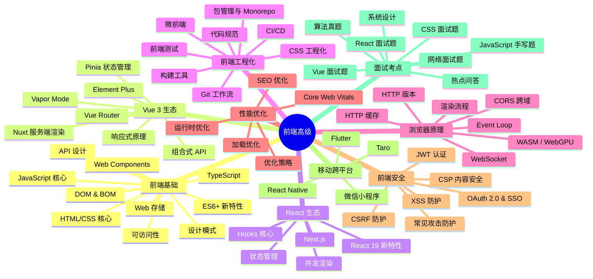

# 前端高级

## 模块概述

前端高级模块面向**高级前端工程师面试准备**，同时也为后端开发者构建全栈能力提供系统化的前端知识体系。从 JavaScript/TypeScript 基础原理，到 Vue 3 / React 19 主流框架生态，再到前端工程化、浏览器原理、性能优化、安全防护，形成完整的高级前端知识图谱。本模块聚焦 **2025-2026 最新技术趋势**，重点突出原理深度和面试高频考点。

::: tip 适用人群
具备 1-3 年前端开发经验，正在准备中大厂高级前端岗位面试的开发者；同时也适合后端开发者补充现代前端知识，建立全栈能力。
:::

::: info 模块定位
深入原理层面，强调最新生态发展（Vue Vapor Mode、React 19 Actions、Vite 6 Rolldown）、工程化最佳实践、面试考点系统梳理。
:::

## 知识图谱

## 核心模块

### 🔰 前端基础

| 子模块 | 核心内容 |
|--------|----------|
| [基础概览](./fundamentals/) | 知识体系总览、学习路径规划 |
| [HTML/CSS 核心](./fundamentals/html-css) | 语义化、Flex/Grid、BFC、盒模型、响应式、CSS 新特性 |
| [JavaScript 核心](./fundamentals/javascript-core) | 原型链、闭包、this 指向、作用域链、深浅拷贝 |
| [ES6+ 新特性](./fundamentals/es6-plus) | 模块化、箭头函数、Promise、async-await、Optional Chaining |
| [TypeScript](./fundamentals/typescript) | 泛型、工具类型、类型守卫、TS 5.5+ 新特性 |
| [CSS 预处理器](./fundamentals/css-preprocessors) | Sass/Less 核心特性、@mixin vs @extend、与原生 CSS 对比 |
| [DOM & BOM](./fundamentals/dom-bom) | DOM 操作、事件模型、BOM 核心对象、requestAnimationFrame |
| [Web 存储](./fundamentals/web-storage) | localStorage/sessionStorage/Cookie/IndexedDB 对比 |
| [设计模式](./fundamentals/design-patterns) | 前端常用模式：观察者/发布订阅/单例/工厂/策略 |
| [API 设计](./fundamentals/api-design) | RESTful vs GraphQL vs tRPC、接口设计原则 |
| [可访问性 (A11y)](./fundamentals/accessibility) | WCAG 标准、ARIA 属性、键盘导航、屏幕阅读器 |
| [Web Components](./fundamentals/web-components) | Custom Elements、Shadow DOM、HTML Templates |

### 🟢 Vue 3 生态

| 子模块 | 核心内容 |
|--------|----------|
| [Vue 概览](./vue-ecosystem/) | Vue 3 生态全景、版本演进 |
| [响应式原理](./vue-ecosystem/reactivity) | Proxy 实现、依赖收集 track/trigger、effectScope |
| [组合式 API](./vue-ecosystem/composition-api) | setup/reactive/ref/computed/watch、自定义 Hook |
| [Pinia 状态管理](./vue-ecosystem/pinia) | Pinia 设计理念、与 Vuex 对比、最佳实践 |
| [Vue Router](./vue-ecosystem/vue-router) | 动态路由、导航守卫、hash vs history |
| [Vapor Mode](./vue-ecosystem/vapor-mode) | 无虚拟 DOM、编译优化、性能提升 |
| [Nuxt 服务端渲染](./vue-ecosystem/nuxt) | SSR/SSG、Nuxt 3/4、全栈开发 |
| [Element Plus 组件库](./vue-ecosystem/element-plus) | 按需引入、主题定制、表单校验、三大 UI 库对比 |

### 🔵 React 生态

| 子模块 | 核心内容 |
|--------|----------|
| [React 概览](./react-ecosystem/) | React 演进、与 Vue 设计哲学对比 |
| [Hooks 核心](./react-ecosystem/hooks) | useState/useEffect/useMemo/useCallback、自定义 Hooks |
| [并发渲染](./react-ecosystem/concurrent-rendering) | Fiber 架构、时间分片、useTransition |
| [React 19 新特性](./react-ecosystem/react-19-features) | Actions API、RSC、useOptimistic、编译器自动优化 |
| [状态管理](./react-ecosystem/state-management) | Redux/Zustand/Jotai 对比选型 |
| [Next.js App Router](./react-ecosystem/nextjs) | RSC 默认、SSG/SSR/ISR、Turbopack |

### ⚙️ 前端工程化

| 子模块 | 核心内容 |
|--------|----------|
| [工程化概览](./engineering/) | 全链路工程化体系、模块化/规范化/自动化/组件化 |
| [包管理](./engineering/package-manager) | npm/yarn/pnpm 对比、Monorepo、Turborepo |
| [构建工具](./engineering/build-tools/) | Vite 6 / Turbopack / Rspack 全方位对比 |
| [代码规范](./engineering/code-standards) | ESLint + Prettier + Husky + commitlint |
| [CSS 工程化方案](./engineering/css-architectures) | CSS Modules / CSS-in-JS / Tailwind / UnoCSS 对比 |
| [微前端](./engineering/micro-frontends) | qiankun、Module Federation、JS 沙箱 |
| [CI/CD](./engineering/ci-cd) | 前端自动化流程、GitHub Actions 实践 |
| [Git 工作流](./engineering/git-workflow) | Git Flow / GitHub Flow / Trunk-Based、协作规范 |
| [前端测试](./engineering/testing) | 单元测试/集成测试/E2E 测试、Vitest/Playwright/Cypress |

### 🌐 浏览器原理

| 子模块 | 核心内容 |
|--------|----------|
| [浏览器概览](./browser/) | 多进程架构、渲染进程主线程 |
| [渲染流程](./browser/rendering) | DOM→CSSOM→Layout→Paint→Composite、重绘/回流 |
| [Event Loop](./browser/event-loop) | 宏任务/微任务、执行顺序、与 Node.js 区别 |
| [HTTP 缓存](./browser/http-cache) | 强缓存/协商缓存、缓存策略设计 |
| [HTTP 版本对比](./browser/http-version) | HTTP/1.1 vs HTTP/2 vs HTTP/3、多路复用对比 |
| [CORS 跨域](./browser/cors) | 同源策略、简单请求/预检请求、跨域解决方案 |
| [WebSocket](./browser/websocket) | 全双工通信、握手过程、心跳重连、与 SSE 对比 |
| [WASM / WebGPU](./browser/wasm-webgpu) | 新技术趋势、高性能计算场景 |

### ⚡ 性能优化与 SEO

| 子模块 | 核心内容 |
|--------|----------|
| [性能优化概览](./performance/) | 四大维度体系、指标体系 |
| [Core Web Vitals](./performance/core-web-vitals) | LCP/CLS/INP（已替换 FID）、达标标准 |
| [优化策略](./performance/optimization-strategies) | 加载/运行时/构建/传输 全景 |
| [加载优化](./performance/loading-optimization) | 懒加载、代码分割、Tree Shaking、CDN |
| [运行时优化](./performance/runtime-optimization) | 虚拟列表、防抖节流、事件委托、内存优化 |
| [SEO 优化](./performance/seo) | SSR/SSG、meta 标签、结构化数据、搜索引擎原理 |

### 🔒 前端安全

| 子模块 | 核心内容 |
|--------|----------|
| [安全概览](./security/) | 攻击类型全景、纵深防御原则 |
| [XSS 防护](./security/xss) | 存储型/反射型/DOM 型 XSS、防御方案 |
| [CSRF 防护](./security/csrf) | 攻击原理、Token 机制、SameSite Cookie |
| [CSP 内容安全](./security/csp) | 配置指令、nonce/hash 机制 |
| [JWT 认证](./security/jwt) | JWT 结构、签名验证、refresh token、无状态认证 |
| [OAuth 2.0 & SSO](./security/oauth-sso) | 授权码流程、PKCE、CAS 单点登录 |
| [常见攻击防护](./security/common-attacks) | 点击劫持、iframe 安全、中间人攻击 |

### 📝 面试高频考点

| 子模块 | 核心内容 |
|--------|----------|
| [考点概览](./interview/) | 考察重点、准备策略、STAR 法则 |
| [JavaScript 手写题](./interview/js-handwritten) | 防抖节流、深拷贝、Promise.all、bind/call/apply |
| [Vue 面试题](./interview/vue-questions) | 响应式、编译优化、keep-alive、nextTick |
| [React 面试题](./interview/react-questions) | Fiber、Hooks 原理、React 19 编译器优化 |
| [CSS 面试题](./interview/css-questions) | 布局、定位、动画、BFC、响应式、高频手写 CSS |
| [网络面试题](./interview/network-questions) | HTTP 协议、TCP 握手、CDN、DNS、安全相关 |
| [算法真题](./interview/algorithm) | 链表、二叉树、滑动窗口、双指针、LRU 缓存 |
| [系统设计](./interview/system-design) | 懒加载组件、虚拟列表、路由系统、状态管理库 |
| [热点问答](./interview/hot-qa) | 2025-2026 最新技术热点问答 |

### 📱 移动跨平台

| 子模块 | 核心内容 |
|--------|----------|
| [移动跨平台概览](./mobile/) | 移动端开发现状、技术选型对比 |
| [微信小程序](./mobile/wechat-miniprogram) | 双线程架构、WXML/WXSS、生命周期、性能优化 |
| [跨平台开发](./mobile/cross-platform) | React Native / Flutter / Taro / uni-app 对比 |

## 面试高频题（精选）

### Q1: 说一说 Vue 3 的响应式原理，Vue2 的 Object.defineProperty 有什么缺点？

Vue 3 使用 ES6 Proxy 拦截对象的读写操作，不需要递归遍历给每个属性添加 getter/setter。Proxy 可以拦截整个对象，支持动态新增/删除属性，也支持数组索引和 length 的监听。

Object.defineProperty 的缺点：
1. 需要递归遍历每个属性，初始化耗时
2. 无法监听动态新增和删除的属性，需要 `$set/$delete` 特殊处理
3. 无法监听数组索引和 length 的变化，需要重写数组方法
4. 对嵌套对象需要递归处理，深层对象性能较差

### Q2: React 19 的 Actions API 是什么？解决了什么问题？

Actions API 是 React 19 简化异步状态管理的新特性。在之前，处理表单提交等异步操作需要手动管理 loading/error/success 状态，代码繁琐。Actions API 允许传递异步函数给 `formAction`，React 自动管理 pending/完成/错误状态。

提供了三个新 Hooks：`useActionState`（获取 action 状态）、`useFormStatus`（表单 pending 状态）、`useOptimistic`（乐观更新），大幅简化表单和异步操作代码。

### Q3: 什么是 INP？为什么要用 INP 替换 FID？

INP（Interaction to Next Paint）是 Google 2024 年替换 FID 成为 Core Web Vitals 的指标，衡量页面响应交互的速度。FID 只测量**第一次交互**的延迟，而 INP 观察页面**整个生命周期**所有交互的延迟，能更准确反映用户在整个使用过程中的交互体验。

优化 INP：减少 JavaScript 执行时间、拆分长任务、使用 Web Worker、requestIdleCallback 处理非紧急任务。

### Q4: 说一说 Event Loop 中宏任务和微任务的执行顺序

执行顺序：1）执行全局同步代码；2）执行一个宏任务；3）清空所有微任务队列；4）可能 UI 渲染；5）回到第二步。

宏任务：setTimeout、setInterval、I/O、UI 渲染、script
微任务：Promise.then/catch/finally、MutationObserver、queueMicrotask

关键点：**每执行完一个宏任务，必须清空当前所有的微任务，然后再进入下一轮。**

::: danger 容易翻车的点
- 说不清宏任务和微任务的执行顺序，顺序搞反
- 混淆浏览器 Event Loop 和 Node.js Event Loop 的区别
- 对 Vue 3 的新特性（Vapor Mode）和 React 19 的新特性不了解
- 不知道 INP 已经替换 FID 成为 Core Web Vitals 指标
- 对构建工具的理解停留在 Webpack，不了解 Vite 6/Turbopack/Rspack
:::

## 学习建议

### 阶段一：基础夯实（1-2 周）

1. 攻克 JavaScript 核心三座大山：原型链、闭包、Event Loop
2. 练习高频手写题（防抖节流、深拷贝、Promise.all），每个都亲手实现一遍
3. 掌握 TypeScript 高级类型和工具类型用法

### 阶段二：框架深入（2-3 周）

4. 对比学习 Vue 3 和 React 19，理解两者设计哲学差异
5. 深入阅读框架源码核心部分（Vue 响应式、React Fiber）
6. 关注 2025 新特性：Vue Vapor Mode、React 19 Actions、RSC

### 阶段三：工程化与原理（1-2 周）

7. 对比理解新一代构建工具：Vite 6 / Turbopack / Rspack
8. 掌握浏览器渲染流程和性能优化方法论
9. 梳理前端安全攻击原理和防御方案

::: details 推荐资源
- 《JavaScript 高级程序设计（第4版）》—— Matt Frisbie
- Vue 官方文档（中文版）—— cn.vuejs.org
- React 官方文档（新版）—— react.dev
- 《TypeScript 编程》—— Boris Cherny
- MDN Web Docs —— developer.mozilla.org
- Google Core Web Vitals 文档 —— developers.google.com
- 前端九部 - 面试题合集
:::