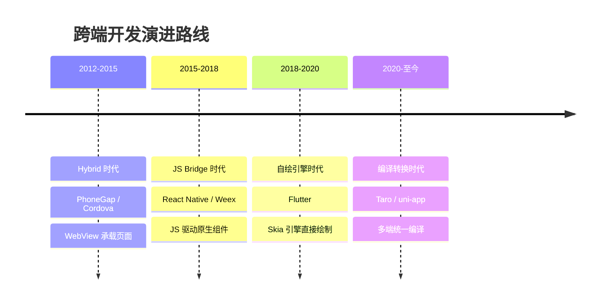
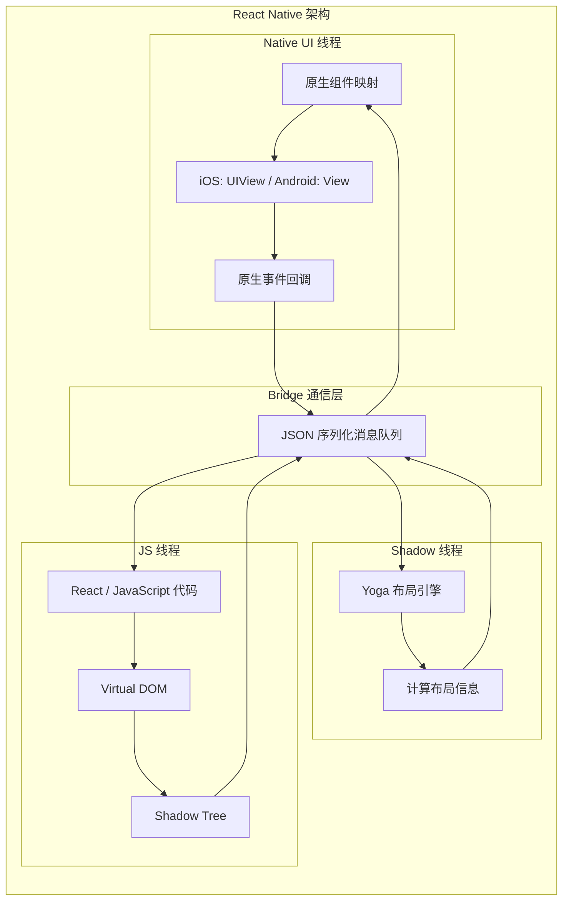
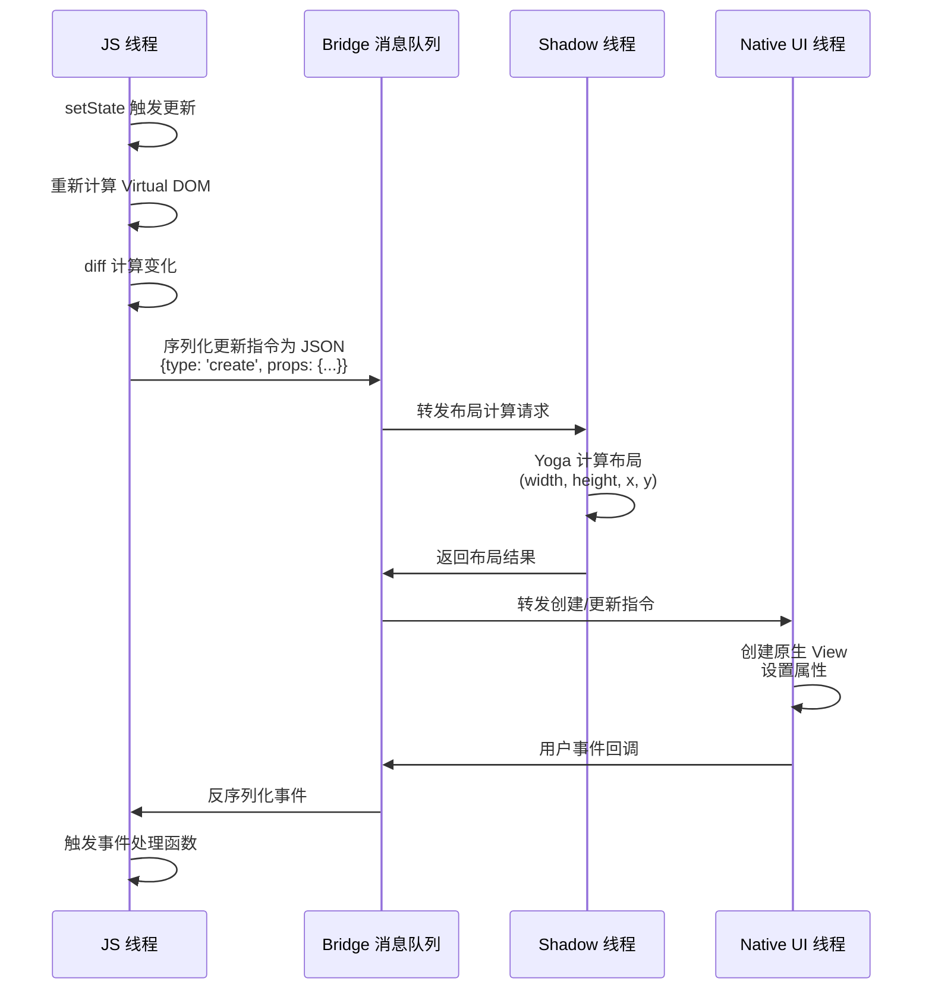
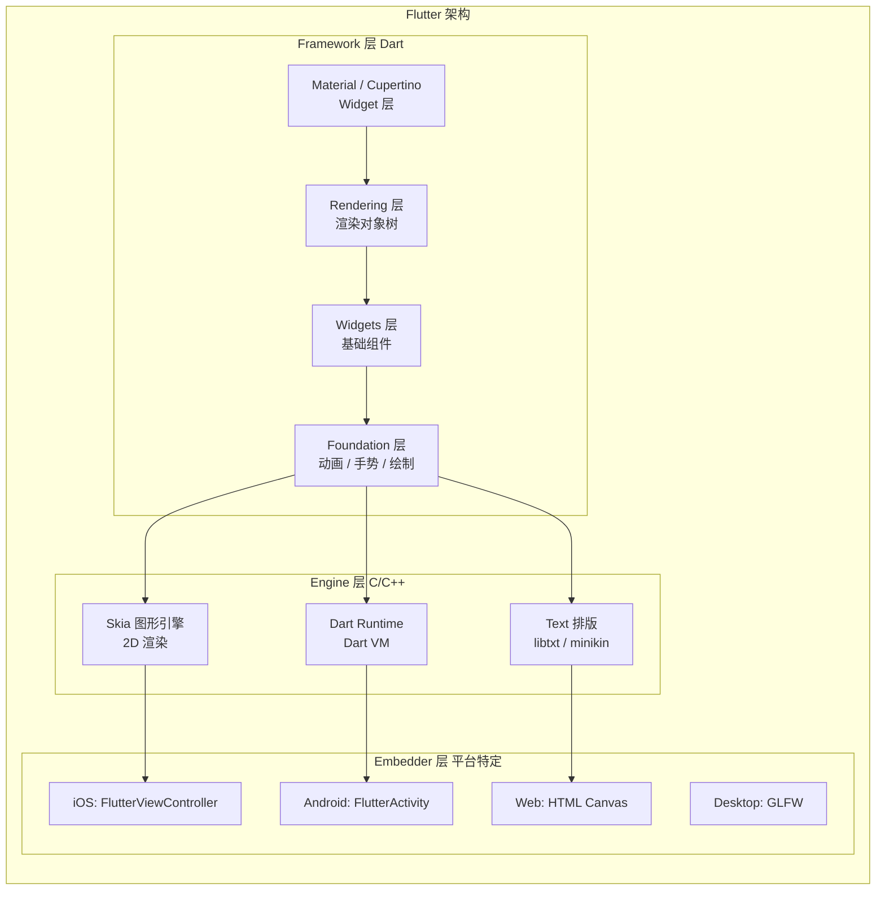
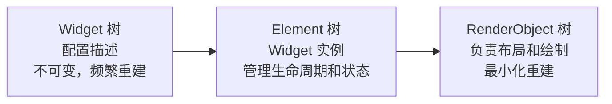
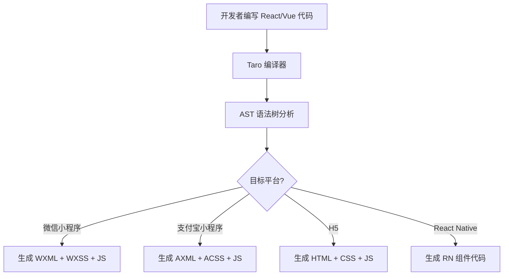
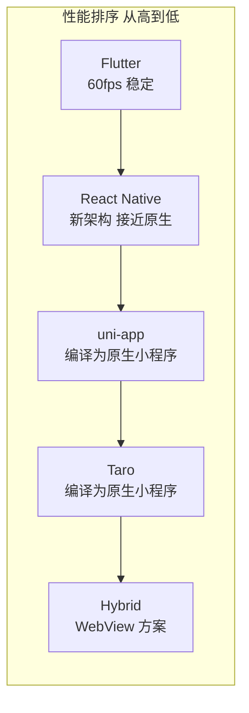

# 跨端框架原理对比

## ⭐ 面试重点速览

| 知识模块 | 重点内容 | 面试频率 |
|----------|----------|----------|
| 跨端开发演进 | Hybrid → RN/Weex → Flutter → Taro/uni-app，各阶段解决了什么问题 | 高 |
| React Native 原理 | JS Bridge 通信、Virtual DOM 映射 Native 组件、三线程架构 | 极高 |
| Flutter 原理 | Skia 自绘引擎、Dart 语言优势、Widget 三棵树、与 RN 区别 | 极高 |
| Taro/uni-app 原理 | 编译时转换、运行时适配、多端 UI 映射、与原生小程序区别 | 高 |
| 四大框架对比 | 渲染方式、性能、生态、学习成本、适用场景 | 极高 |
| 面试重点 | RN vs Flutter 区别、Taro 多端适配原理、如何选择框架 | 极高 |

---

## 一、跨端开发演进史

跨端开发经历了四个重要阶段，每个阶段都在解决不同的问题。



### 1.1 第一阶段：Hybrid（WebView 方案）

**代表框架**：PhoneGap / Cordova / Ionic

**核心原理**：整个应用运行在 WebView 中，使用 HTML/CSS/JS 开发，通过 JS Bridge 调用原生能力。

```
优点：开发成本低，Web 开发者可直接上手
缺点：性能差，交互体验不如原生，无法使用原生 UI 组件
```

### 1.2 第二阶段：JS Bridge 方案（原生渲染）

**代表框架**：React Native（2015）/ Weex（2016）

**核心原理**：JS 代码在独立线程运行，通过 Bridge 将指令转换为原生组件，UI 使用真正的原生组件渲染。

```
优点：接近原生的用户体验，热更新方便
缺点：Bridge 通信有性能瓶颈，无法直接使用原生 API，调试复杂
```

### 1.3 第三阶段：自绘引擎方案

**代表框架**：Flutter（2018）

**核心原理**：不使用原生组件，不依赖 WebView，通过 Skia 图形引擎直接绘制 UI，完全控制每一个像素。

```
优点：跨平台一致性极高，性能优秀，开发体验好
缺点：包体积较大，学习成本高（Dart 语言），原生能力需要写插件
```

### 1.4 第四阶段：编译时转换方案

**代表框架**：Taro（2018）/ uni-app（2018）

**核心原理**：使用类 React/Vue 语法编写代码，在编译时将代码转换为各平台的原生代码。

```
优点：学习成本低，一套代码多端运行，生态丰富
缺点：性能不如原生/Flutter，多端适配仍有差异，平台特性支持有限
```

---

## 二、React Native 原理

### 2.1 架构图



### 2.2 三线程模型

React Native 采用三种线程协同工作：

| 线程 | 职责 | 运行环境 |
|------|------|----------|
| **JS 线程** | 执行 React 代码、处理业务逻辑、计算 Virtual DOM | JavaScriptCore（iOS）/ Hermes（Android） |
| **Shadow 线程** | 使用 Yoga 布局引擎计算组件位置和尺寸 | C++ 线程 |
| **Native UI 线程** | 渲染原生组件、处理用户交互事件 | iOS/Android 主线程 |

### 2.3 JS Bridge 通信机制



::: tip JS Bridge 通信特点
- **异步通信**：JS 线程和 Native 线程通过消息队列异步通信
- **JSON 序列化**：所有数据必须序列化为 JSON 字符串
- **批量处理**：多个更新命令会合并为一批发送
- **性能瓶颈**：大量交互时序列化/反序列化开销大，Bridge 可能成为瓶颈
:::

### 2.4 Virtual DOM 到原生组件的映射

```javascript
// React Native 代码
import { View, Text, StyleSheet } from 'react-native';

const App = () => (
  <View style={styles.container}>
    <Text style={styles.title}>Hello React Native</Text>
  </View>
);

// 运行时映射过程：
// 1. JS 线程构建 Virtual DOM
// 2. diff 后通过 Bridge 发送指令
// 3. Native 线程接收指令后映射：
//    <View>    → iOS: UIView  / Android: android.view.View
//    <Text>    → iOS: UILabel / Android: android.widget.TextView
//    style     → 转换为原生样式属性
```

### 2.5 新架构（JSI + Fabric + TurboModules）

从 0.68 版本开始，React Native 推出了新架构来替代 Bridge：

| 旧架构 | 新架构 | 改进 |
|--------|--------|------|
| Bridge（异步 JSON 通信） | **JSI**（JavaScript Interface，同步调用） | 消除 Bridge 瓶颈，JS 可直接调用 Native |
| 旧渲染引擎 | **Fabric**（新渲染引擎） | 支持并发渲染、优先级调度 |
| Native Modules | **TurboModules**（懒加载原生模块） | 按需加载，减少启动时间 |
| JSON 序列化 | 直接内存共享 | 性能大幅提升 |

::: warning 面试注意
如果面试官问 RN 的 Bridge 是不是瓶颈，一定要补充说明新架构中 JSI 已经解决了这个问题。
:::

---

## 三、Flutter 原理

### 3.1 架构图



### 3.2 Skia 自绘引擎

Flutter 最大的特点是**不使用原生组件**，而是通过 Skia 图形引擎自己绘制所有 UI。

```
Flutter 渲染流程：
1. Dart 代码构建 Widget 树
2. 根据 Widget 树生成 Element 树和 RenderObject 树
3. Layout 阶段：计算每个 RenderObject 的位置和大小
4. Paint 阶段：将 RenderObject 绘制到 Layer 上
5. Composite 阶段：将 Layer 合成并提交给 Skia
6. Skia 通过 GPU 绘制到屏幕上
```

::: tip 自绘引擎的好处
- **跨平台一致性**：同一套代码在 iOS 和 Android 上渲染完全一致
- **不受平台限制**：不依赖原生控件，可以实现任意自定义 UI
- **性能优势**：直接绘制，无需 Bridge 通信
- **动画流畅**：60fps / 120fps 动画，利用 GPU 加速
:::

### 3.3 Widget 三棵树

Flutter 内部维护三棵树，这是理解 Flutter 渲染机制的关键：



| 树 | 特点 | 职责 |
|----|------|------|
| **Widget 树** | 不可变，轻量，频繁重建 | 描述 UI 配置 |
| **Element 树** | 可变，连接 Widget 和 RenderObject | 管理 Widget 生命周期和状态 |
| **RenderObject 树** | 可变，重量级，最小化重建 | 负责实际的布局和绘制 |

### 3.4 Dart 语言优势

::: tip 为什么 Flutter 选择 Dart？
1. **同时支持 JIT 和 AOT 编译**
   - JIT（Just-In-Time）：开发阶段，支持热重载（Hot Reload），毫秒级生效
   - AOT（Ahead-Of-Time）：发布阶段，编译为原生机器码，启动快、性能好

2. **单线程模型 + Isolate**
   - 主线程通过事件循环处理异步任务
   - 耗时任务通过 Isolate 在独立线程运行，不阻塞 UI

3. **内存分配优化**
   - Dart VM 对快速分配和回收小对象做了专门优化
   - 适应 Widget 频繁创建销毁的场景
:::

### 3.5 Flutter 性能分析

```javascript
// Flutter 性能关键指标
性能优势：
  - 启动速度：AOT 编译，接近原生
  - 渲染性能：60fps 稳定渲染，Skia GPU 加速
  - 动画性能：独立于 UI 线程，流畅度好
  - 内存占用：稍高于原生，但可控

性能挑战：
  - 包体积：Hello World 约 10MB+（包含 Dart VM 和 Skia）
  - 首屏渲染：复杂页面需要多个 Frame 才能完成
  - 平台通道：调用原生能力需要通过 Platform Channel，有通信开销
```

---

## 四、Taro / uni-app 原理

### 4.1 Taro 核心原理

Taro 的核心思想是**编译时转换** + **运行时适配**。



**编译时转换**：在编译阶段将代码 AST 转换为目标平台的代码。

```javascript
// Taro 源码（React 语法）
import { View, Text } from '@tarojs/components';

export default function Page() {
  const [count, setCount] = useState(0);
  return (
    <View className="container">
      <Text onClick={() => setCount(count + 1)}>{count}</Text>
    </View>
  );
}

// 编译到微信小程序后：
// page.wxml
// <view class="container" bindtap="onClick">
//   <text>{{count}}</text>
// </view>
//
// page.js
// Page({
//   data: { count: 0 },
//   onClick() {
//     this.setData({ count: this.data.count + 1 });
//   }
// })
```

**运行时适配**：Taro 提供了一套运行时库，在运行时抹平各平台差异。

```javascript
// Taro 运行时抹平 API 差异
// 开发者只需调用 Taro API
import Taro from '@tarojs/taro';

Taro.request({ url: '/api/data' }); // 自动适配各平台网络请求
Taro.getStorage({ key: 'token' });  // 自动适配各平台存储
```

### 4.2 uni-app 核心原理

uni-app 在 Vue 语法基础上，通过**条件编译**实现多端适配。

```vue
<template>
  <view class="container">
    <!-- #ifdef MP-WEIXIN -->
    <button open-type="getUserInfo">微信授权登录</button>
    <!-- #endif -->

    <!-- #ifdef H5 -->
    <button @click="h5Login">H5 登录</button>
    <!-- #endif -->
  </view>
</template>

<script>
export default {
  methods: {
    // #ifdef H5
    h5Login() {
      // 仅在 H5 平台编译的代码
      window.location.href = '/login';
    }
    // #endif
  }
};
</script>

<style>
/* #ifdef MP-WEIXIN */
.container { background: #07C160; } /* 微信绿 */
/* #endif */

/* #ifdef MP-ALIPAY */
.container { background: #1677FF; } /* 支付宝蓝 */
/* #endif */
</style>
```

::: tip 条件编译
uni-app 使用 `#ifdef` / `#ifndef` / `#endif` 注释控制不同平台的代码编译。这些注释是 uni-app 特有的语法，在编译时会根据目标平台进行处理。
:::

### 4.3 Taro 与 uni-app 对比

| 对比维度 | Taro | uni-app |
|----------|------|---------|
| 技术栈 | React / Vue / Nerv | Vue（主推）/ React 内测 |
| 编译原理 | AST 转换 + 运行时适配 | 条件编译 + 运行时适配 |
| 多端支持 | 微信/支付宝/百度/字节/QQ/京东/H5/RN | 微信/支付宝/百度/字节/QQ/快手/H5/快应用 |
| 社区生态 | React 生态为主 | Vue 生态为主，插件市场丰富 |
| 小程序性能 | 较优，运行时较小 | 较优，条件编译减少运行时开销 |
| 学习成本 | 需要理解编译原理 | 低，Vue 开发者直接上手 |

### 4.4 Taro 如何实现多端适配？

::: tip 面试高频问法：Taro 如何实现多端适配？

Taro 通过三个层面实现多端适配：

**1. 编译时转换**
- 将 React/Vue 代码通过 Babel 编译为 AST
- 根据不同平台，将 AST 转换为对应的模板语法
- 例如：`<View>` 编译为微信的 `<view>`，支付宝的 `<view>`，H5 的 `<div>`

**2. 运行时适配**
- 提供 `@tarojs/taro` 运行时库，封装各平台 API 差异
- 例如：`Taro.request` 内部调用 `wx.request`（微信）或 `my.request`（支付宝）或 `fetch`（H5）

**3. 组件库和 API 多端映射**
- `@tarojs/components` 提供跨端组件，内部映射到各平台原生组件
- 样式转换：px 自动转换为 rpx，处理各平台样式差异
:::

---

## 五、四大框架全面对比

### 5.1 核心差异对比表

| 维度 | React Native | Flutter | Taro | uni-app |
|------|-------------|---------|------|---------|
| **渲染方式** | 原生组件渲染 | Skia 自绘引擎 | 编译为小程序原生 + H5 DOM | 编译为小程序原生 + H5 DOM |
| **编程语言** | JavaScript/TypeScript | Dart | JavaScript/TypeScript | JavaScript/TypeScript |
| **UI 语法** | React（JSX） | Widget（Dart） | React/Vue | Vue（主推） |
| **性能** | 接近原生（新架构） | 优秀（60fps） | 取决于目标平台 | 取决于目标平台 |
| **包体积** | 较小 | 较大（10MB+） | 较小（小程序有限制） | 较小（小程序有限制） |
| **热更新** | 支持（CodePush） | 不支持（政策限制） | 小程序不支持热更 | 小程序不支持热更 |
| **跨平台一致性** | 部分差异 | 极高 | 目标平台原生体验 | 目标平台原生体验 |
| **学习成本** | 中（需要了解原生） | 高（Dart + Widget） | 低（React/Vue 开发者） | 低（Vue 开发者） |
| **社区生态** | 成熟，组件丰富 | 成熟，Google 推动 | 较成熟，京东维护 | 成熟，DCloud 维护 |
| **调试体验** | 较好（Chrome DevTools） | 优秀（DevTools） | 一般（依赖各平台工具） | 一般（依赖各平台工具） |
| **适用场景** | 已有 RN 技术栈的团队 | 追求高性能和一致性的项目 | 小程序为主，兼顾 H5 | 小程序为主，多点发布 |

### 5.2 适用场景分析

| 场景 | 推荐框架 | 原因 |
|------|----------|------|
| 高性能要求 + 跨平台一致性 | **Flutter** | 自绘引擎，无平台差异，60fps 保障 |
| 已有 React 团队，需要原生体验 | **React Native** | 复用 React 技术栈，接近原生体验 |
| 小程序为主，兼顾 H5 和 App | **Taro / uni-app** | 学习成本低，编译多端，小程序生态成熟 |
| 快速 MVP 验证 | **uni-app** | Vue 语法简单，插件市场丰富，开发速度快 |
| 混合开发（原生 + 部分跨端） | **Flutter** | 支持 Add-to-App，可以嵌入原生项目 |
| 企业内部工具 | **Taro / uni-app** | 一套代码覆盖多端，减少维护成本 |

### 5.3 性能对比



---

## 六、面试高频问题汇总

### Q1：React Native 和 Flutter 有什么区别？

::: tip 面试重点回答
这是面试中最高频的跨端问题，建议从四个维度回答：

**1. 渲染机制（最核心的区别）**
- RN：通过 Bridge 将 JS 指令转为原生组件，使用真正的原生 UI 组件
- Flutter：通过 Skia 引擎自绘 UI，不使用原生组件

**2. 编程语言**
- RN：JavaScript/TypeScript，前端开发者友好
- Flutter：Dart 语言，需要额外学习成本

**3. 性能**
- RN：Bridge 通信是瓶颈（新架构 JSI 已解决），复杂动画可能掉帧
- Flutter：AOT 编译 + Skia 自绘，性能优于 RN，动画流畅

**4. 跨平台一致性**
- RN：依赖原生组件，不同平台可能有细微差异
- Flutter：自绘引擎，所有平台渲染效果完全一致
:::

### Q2：Taro 如何实现多端适配？

A：Taro 通过三个层面实现：
1. **编译时转换**：将 React/Vue 代码通过 Babel 编译为 AST，再生成各平台代码
2. **运行时适配**：提供 `@tarojs/taro` 运行时库，封装各平台 API 差异
3. **组件映射**：`@tarojs/components` 提供跨端组件，编译时映射到原生组件

### Q3：什么是 JS Bridge？为什么它可能成为性能瓶颈？

A：JS Bridge 是 React Native 中 JS 线程和 Native 线程之间的通信机制：
- JS 线程通过 Bridge 发送 JSON 序列化的指令给 Native 线程
- Native 线程执行指令后，通过 Bridge 返回结果
- **瓶颈原因**：
  1. 所有通信必须序列化为 JSON，大对象序列化开销大
  2. Bridge 是异步的，大量通信时消息堆积
  3. 频繁交互场景（如动画、手势）性能下降明显
- **解决方案**：RN 新架构用 JSI（JavaScript Interface）替代 Bridge，实现 JS 和 Native 的直接内存交互

### Q4：Flutter 为什么要用 Dart 语言？

A：主要四个原因：
1. **JIT + AOT 双模式**：开发时 JIT 支持热重载，发布时 AOT 编译为原生代码
2. **内存分配优化**：Dart VM 对频繁创建和销毁小对象做了专门优化，适合 Widget 场景
3. **单线程 + Isolate**：通过事件循环 + Isolate 实现并发，不阻塞 UI
4. **Google 控制力**：Dart 是 Google 自研语言，可以针对 Flutter 场景深度优化

### Q5：如何选择跨端框架？

A：选择框架应该考虑以下因素：

| 考虑因素 | 推荐选择 |
|----------|----------|
| 团队技术栈是 React | React Native 或 Taro |
| 团队技术栈是 Vue | uni-app |
| 需要 60fps 流畅动画 | Flutter |
| 需要快速上线多端 | uni-app |
| 小程序为主要目标 | Taro 或 uni-app |
| 需要完全统一的 UI 风格 | Flutter |
| 需要嵌入现有原生项目 | Flutter（Add-to-App） |
| 团队有原生开发经验 | Flutter 或 React Native |

### Q6：新架构下的 React Native 性能能追上 Flutter 吗？

A：RN 新架构（JSI + Fabric + TurboModules）在很大程度上解决了 Bridge 的性能瓶颈：
- JSI 消除了 JSON 序列化开销，JS 可以直接调用 Native 方法
- Fabric 支持并发渲染和优先级调度
- TurboModules 按需加载原生模块

但 Flutter 的自绘引擎在以下场景仍有优势：
- 复杂动画和自定义 UI
- 跨平台 UI 一致性
- 不依赖平台版本的渲染行为

总体上，RN 新架构在大多数场景下性能已接近原生，与 Flutter 的差距在缩小。

### Q7：Taro 和 uni-app 分别适合什么场景？

A：
- **Taro**：适合 React 技术栈团队，需要兼顾小程序和 H5
- **uni-app**：适合 Vue 技术栈团队，快速开发多端应用，插件市场丰富
- 如果团队 Vue 更熟练，选 uni-app；如果 React 更熟练，选 Taro
- 如果需要编译到 React Native，Taro 支持更好

---

## 总结

跨端开发框架的选择没有绝对的"最好"，只有"最适合"：

1. **React Native**：适合已有 React 技术栈、需要原生体验的团队，新架构解决了 Bridge 性能问题
2. **Flutter**：适合追求极致性能和跨平台一致性的项目，学习成本最高但收益也最大
3. **Taro / uni-app**：适合小程序为主、多端发布的场景，学习成本低，开发效率高

理解每个框架的**核心原理**（渲染方式、通信机制、跨端策略），比记住 API 细节更重要。面试中，展现出对框架底层原理的深入理解，往往比表面的使用经验更有说服力。