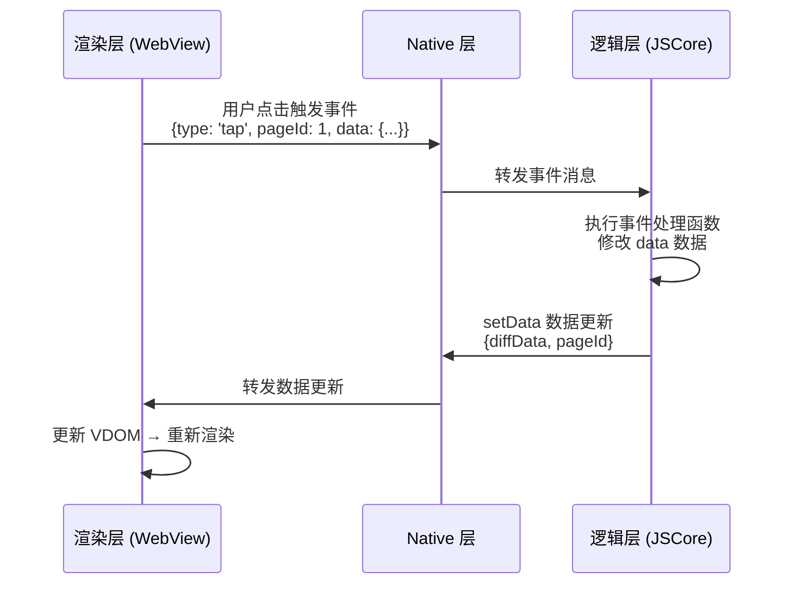
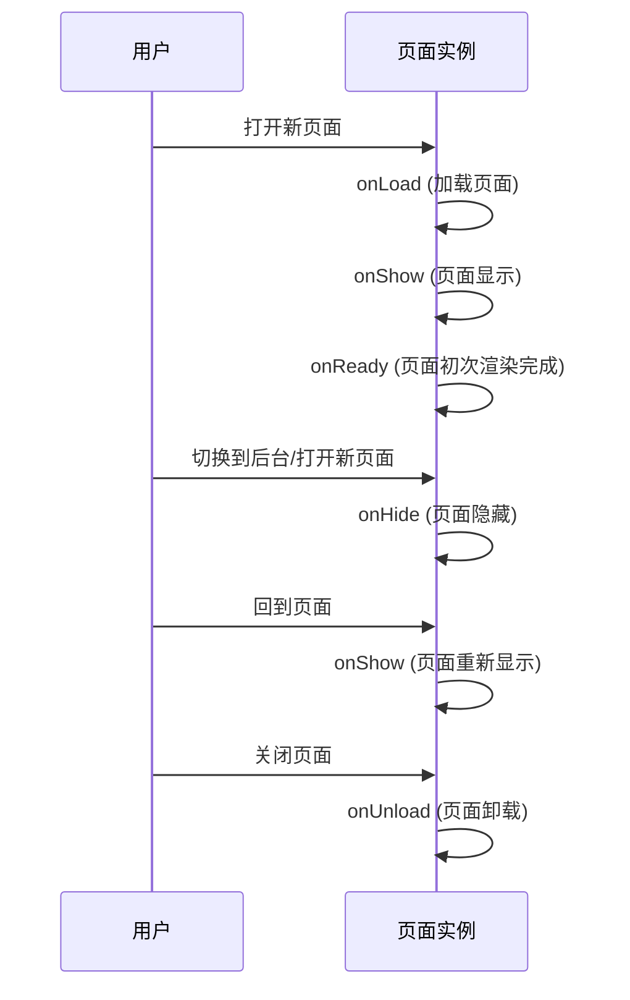

# 微信小程序核心原理

## ⭐ 面试重点速览

| 知识模块 | 重点内容 | 面试频率 |
|----------|----------|----------|
| 双线程架构 | 渲染层 WebView + 逻辑层 JSCore、通信机制 | 极高 |
| 双线程设计原因 | 安全管控、性能优化、避免 JS 执行阻塞渲染 | 极高 |
| setData 原理 | 数据传输、JSON 序列化、diff 更新机制 | 极高 |
| setData 性能优化 | 数据量控制、局部更新、减少调用频率 | 极高 |
| 生命周期 | App 生命周期 vs Page 生命周期、执行顺序 | 高 |
| 与 Web 区别 | 无 DOM/BOM、包大小限制、审核机制、运行环境 | 高 |
| 小程序为什么快 | 预加载、双线程分离、原生组件渲染、分包加载 | 高 |

---

## 一、双线程架构设计

微信小程序采用**双线程架构**，将渲染层与逻辑层分离，这是小程序最核心的设计思想。

### 1.1 架构图

```mermaid
flowchart TD
    subgraph 微信客户端 WeChat Client
        A[Native 层] --> B[渲染层]
        A --> C[逻辑层]

        subgraph 渲染层 Render Layer
            B1[WebView 1<br/>首页]
            B2[WebView 2<br/>次级页]
            B3[WebView N<br/>其他页]
            D[原生组件渲染<br/>map/video/camera]
        end

        subgraph 逻辑层 Logic Layer
            C1[JSCore<br/>JavaScript 引擎]
            C2[V8 (微信开发者工具)]
        end

        B1 -->|IPC 通信| A
        B2 -->|IPC 通信| A
        B3 -->|IPC 通信| A
        C1 -->|IPC 通信| A
        A -->|消息转发| B1
        A -->|消息转发| B2
        A -->|消息转发| B3
    end
```

### 1.2 各层职责

| 层次 | 运行环境 | 主要职责 |
|------|----------|----------|
| **渲染层** | WebView（iOS 是 WKWebView，Android 是 Tencent X5） | 负责渲染 WXML 和 WXSS，处理用户交互事件 |
| **逻辑层** | JavaScriptCore（iOS）/ V8（Android/开发者工具） | 运行开发者 JS 代码，处理业务逻辑、数据处理、事件处理 |
| **Native 层** | 微信客户端原生 | 负责线程间通信、路由管理、原生组件桥接 |

::: tip 关键理解
- **多个页面对应多个 WebView**：每个小程序页面都会创建一个独立的 WebView 实例
- **整个小程序只有一个 JSCore 线程**：所有页面的 JS 代码都在同一个 JS 线程执行
- **通信必须经过 Native 中转**：渲染层和逻辑层不直接通信，通过 Native 的 IPC（进程间通信）转发
:::

### 1.3 通信流程



---

## 二、为什么设计双线程？

双线程分离不是小程序首创，但在移动端场景下有其独特的设计考量。

### 2.1 安全性考虑

::: danger WebView 直接运行 JS 的风险
如果让小程序直接在 WebView 中运行 JS，开发者可以通过 DOM 操作访问 WebView 的 BOM 接口：
- 可以读取 `window.history` 篡改微信页面历史
- 可以通过 `iframe` 跨域访问微信内部页面
- 可以注入脚本获取用户隐私信息
- 可以利用 WebView 漏洞执行任意代码

**双线程隔离后**：
- 逻辑层没有 DOM/BOM API，无法直接操作渲染层
- JS 运行在独立的 JSCore 中，沙箱隔离
- 所有能力都由微信客户端统一暴露和管控
:::

### 2.2 管控性考虑

微信需要对小程序进行严格管控：

1. **接口管控**：只能使用微信提供的 API，不能随意使用 Web 能力
2. **版本管控**：确保用户使用的是最新版本，无法绕过审核
3. **权限管控**：相机、位置、存储等权限需要用户授权，由微信统一管理
4. **审核机制**：代码在逻辑层运行，微信可以对代码进行静态扫描和动态检测

### 2.3 性能考虑

**为什么双线程比单线程更快？**

| 对比维度 | 单线程（Web 传统模式） | 双线程（小程序模式） |
|----------|------------------------|----------------------|
| JS 执行 | JS 执行阻塞渲染，长任务会导致页面卡顿 | JS 在独立线程执行，不阻塞渲染线程 |
| 页面切换 | 切换页面需要重新加载整个页面 | 逻辑层早已在后台运行，只需切换 WebView |
| 预加载 | 需要等页面显示才能执行 JS | 逻辑层可以提前预加载，启动更快 |
| 滚动流畅度 | JS 持续执行会导致滚动掉帧 | 渲染层独立滚动，不受 JS 阻塞影响 |

::: tip 面试高频问法
**Q：小程序为什么比普通 Web 页面打开更快？**

A：主要原因有四点：
1. **双线程分离**：JS 不阻塞渲染，滚动更流畅
2. **预加载机制**：进入小程序前提前下载分包、预初始化逻辑层
3. **原生组件加速**：map/video 等复杂组件使用原生渲染，比 Web 更流畅
4. **分包加载**：按需加载代码，减少首次启动包体积
:::

---

## 三、setData 原理与性能优化

`setData` 是小程序中最常用也是最容易出性能问题的 API。

### 3.1 setData 工作原理

```javascript
Page({
  data: {
    title: 'Hello',
    user: {
      name: '小明',
      age: 18
    }
  },

  onLoad() {
    // 调用 setData 更新数据
    this.setData({
      'user.age': 19,
      title: 'World'
    });
  }
});
```

**执行过程：**

1. **逻辑层**：开发者调用 `setData(newData)`
2. **数据合并**：将 `newData` 合并到 `this.data`（浅拷贝）
3. **差异计算**：对比新数据与旧数据，计算出变化的部分（diff）
4. **序列化**：将 diff 结果序列化为 JSON 字符串
5. **IPC 通信**：通过 Native 将 diff 发送到渲染层
6. **渲染层**：反序列化 JSON，更新 VDOM，重新渲染页面

```mermaid
flowchart TD
    A[开发者调用 setData] --> B[合并到 this.data]
    B --> C[计算 diff 差异]
    C --> diff 为空? --> A[结束]
    C --> diff 非空 --> D[JSON 序列化]
    D --> E[IPC 发送到渲染层]
    E --> F[渲染层反序列化]
    F --> G[更新 VDOM]
    G --> H[重新渲染页面]
```

### 3.2 diff 机制

小程序的 diff 是**路径级别的 diff**，不是树结构 diff。

```javascript
// 原始 data
this.data = {
  user: {
    name: '小明',
    age: 18,
    address: {
      city: '北京',
      street: '长安街'
    }
  },
  list: [1, 2, 3]
};

// 调用 setData
this.setData({
  'user.age': 19,
  'list[1]': 20
});

// diff 结果：只包含变化的路径
// {
//   'user.age': 19,
//   'list[1]': 20
// }
```

::: tip diff 特点
- 基于**路径**进行差异对比，不是基于 VDOM 树
- 支持点语法 `'user.age'` 和数组语法 `'list[0]'`
- 只发送变化的部分，不会发送完整数据
- 对比速度快，但无法处理复杂的树结构移动
:::

### 3.3 为什么 setData 要控制数据量？

::: danger 性能问题分析
这是面试最常问的问题之一，答案要分三点：

**1. JSON 序列化耗时**
- 数据越大，序列化/反序列化时间越长
- 大对象序列化会阻塞 JSCore 线程

**2. IPC 通信开销**
- 进程间通信有拷贝开销
- 数据太大需要分片发送
- 频繁大量数据发送会导致 Native 线程阻塞

**3. 渲染层重渲染**
- 即使只改一个字节，也会触发重新渲染
- 大量数据更新会导致 VDOM 重建耗时增加
- 频繁 setData 会导致频繁重渲染，页面卡顿

**一句话总结：** 每次 setData 都要经历序列化 → IPC 传输 → 反序列化 → 重渲染，四个环节都与数据量正相关，所以必须控制数据量。
:::

### 3.4 setData 性能优化最佳实践

#### 优化 1：只更新需要变化的数据

```javascript
// ❌ 错误写法：传整个对象，即使只改一个属性
this.setData({
  user: {
    ...this.data.user,
    age: 19
  }
});

// ✅ 正确写法：只传变化的路径
this.setData({
  'user.age': 19
});
```

#### 优化 2：减少 setData 调用频率

```javascript
// ❌ 错误写法：频繁调用 setData
for (let i = 0; i < 100; i++) {
  this.setData({
    [`list[${i}]`]: i
  });
}

// ✅ 正确写法：批量更新
const newData = {};
for (let i = 0; i < 100; i++) {
  newData[`list[${i}]`] = i;
}
this.setData(newData);
```

#### 优化 3：控制数据体积

- 避免将超大数组放在 data 中（如千行以上的列表）
- 图片不要转 base64 存在 data 中
- 不需要渲染的数据不要放在 data 中，放在 `this` 上即可

```javascript
// 不需要渲染的存在 this 上
this.largeData = fetchBigData(); // 不会触发渲染

// 只将需要展示的分页数据放入 data
this.setData({
  currentPageData: this.largeData.slice(0, 10)
});
```

#### 优化 4：使用 page-container 减少页面重建

对于频繁切换的页面（如弹窗、Tab），使用 `page-container` 组件可以避免每次都重新渲染。

#### 优化 5：长列表使用 `wx:key` 并复用单元格

```xml
<!-- 使用 wx:key 帮助小程序复用节点 -->
<view wx:for="{{list}}" wx:key="id">
  {{item.text}}
</view>
```

### 3.5 setData 常见陷阱

::: warning 常见错误
1. **直接修改 this.data**
```javascript
// ❌ 错误：直接修改不会触发渲染
this.data.user.age = 19;

// ✅ 正确：必须调用 setData
this.setData({'user.age': 19});
```

2. **setData 回调中的 this 指向问题**
```javascript
// 需要注意绑定 this
this.setData({x: 1}, () => {
  // 这里的 this 仍然指向 page 实例
  console.log(this.data.x);
});
```

3. **短时间内大量 setData**
- 下拉刷新中频繁触发会导致卡顿
- 滚动事件中频繁 setData 会导致掉帧
- 建议使用节流防抖
:::

```javascript
// 滚动事件中使用节流
import { throttle } from 'lodash';

Page({
  onScroll: throttle(function(e) {
    this.setData({
      scrollTop: e.detail.scrollTop
    });
  }, 100) // 限制 100ms 最多更新一次
});
```

---

## 四、小程序生命周期

小程序生命周期分为 **App 生命周期** 和 **Page 生命周期** 两个层级。

### 4.1 App 生命周期（应用级别）

```javascript
App({
  // 小程序初始化完成时触发（全局只触发一次）
  onLaunch(options) {
    console.log('小程序启动');
    // 做初始化工作：读取缓存、登录、获取用户信息等
  },

  // 小程序启动或从后台进入前台显示时触发
  onShow(options) {
    console.log('小程序进入前台');
    // 重新连接、刷新数据
  },

  // 小程序从前台进入后台时触发
  onHide() {
    console.log('小程序进入后台');
    // 暂停定时器、取消网络请求、保存状态
  },

  // 小程序发生脚本错误或 API 调用报错时触发
  onError(error) {
    console.error('错误捕获', error);
    // 上报错误日志
  },

  // 新增页面不存在时触发
  onPageNotFound(path) {
    // 可以做重定向
    wx.redirectTo({ url: '/pages/home' });
  }
});
```

| 生命周期 | 触发时机 | 频率 | 常用操作 |
|----------|----------|------|----------|
| `onLaunch` | 小程序首次启动 | 全局 1 次 | 初始化、登录 |
| `onShow` | 进入前台 | 多次 | 刷新数据、恢复状态 |
| `onHide` | 进入后台 | 多次 | 暂停任务、保存状态 |
| `onError` | 发生错误 | 多次 | 错误上报 |
| `onPageNotFound` | 页面不存在 | 按需 | 错误重定向 |

### 4.2 Page 生命周期（页面级别）



```javascript
Page({
  // 页面加载时触发，一个页面只会调用一次
  onLoad(options) {
    // options 是打开页面时传递的 query 参数
    console.log('页面加载', options);
    // 获取参数、请求接口数据
  },

  // 页面显示/切入前台时触发
  onShow() {
    console.log('页面显示');
  },

  // 页面初次渲染完成时触发，一个页面只会调用一次
  onReady() {
    console.log('渲染完成');
    // 可以和 Vant Weapp 等组件交互了
  },

  // 页面隐藏/切入后台时触发
  onHide() {
    console.log('页面隐藏');
  },

  // 页面卸载时触发（redirectTo 或 navigateBack 后）
  onUnload() {
    console.log('页面卸载');
    // 清理定时器、取消事件监听
  },

  // 页面下拉刷新
  onPullDownRefresh() {
    // 刷新数据
    wx.stopPullDownRefresh(); // 停止刷新
  },

  // 页面上拉触底
  onReachBottom() {
    // 加载下一页
  },

  // 页面滚动
  onPageScroll(options) {
    console.log('滚动位置', options.scrollTop);
  },

  // 原生导航栏右侧按钮点击
  onShareAppMessage() {
    // 返回分享配置
    return {
      title: '分享标题',
      path: '/pages/index'
    };
  }
});
```

### 4.3 生命周期执行顺序面试题

**Q：打开一个新页面，App 和 Page 的生命周期执行顺序是什么？**

```
App.onLaunch → App.onShow → Page.onLoad → Page.onShow → Page.onReady
```

**Q：从页面 A 打开页面 B，A 和 B 的生命周期顺序？**

```
A.onHide → B.onLoad → B.onShow → B.onReady → A.onUnload?
```

实际上：如果是 `navigateTo` 打开新页面，A 只是隐藏，不会卸载。所以：

```
A.onHide → B.onLoad → B.onShow → B.onReady
```

如果是 `redirectTo` 打开新页面，A 会被卸载：

```
A.onHide → A.onUnload → B.onLoad → B.onShow → B.onReady
```

**Q：小程序从后台回到前台，生命周期执行顺序？**

```
App.onShow → 当前Page.onShow
```

---

## 五、与 Web 开发的区别

### 5.1 运行环境区别

| 对比维度 | Web 开发 | 微信小程序 |
|----------|----------|------------|
| 运行环境 | 浏览器内核 | 微信客户端 + WebView |
| DOM/BOM | 有 `document`/`window` | 完全没有 |
| JS 引擎 | V8（Chrome） | JSCore/V8 独立线程 |
| CSS 支持 | 完整支持 | 部分支持（无浮动问题，但有选择器限制） |
| 模块系统 | ESModule/CommonJS | 自定义模块化（CommonJS 风格） |

### 5.2 开发模式区别

```javascript
// Web 开发
document.getElementById('title').innerText = 'Hello';
document.getElementById('title').addEventListener('click', handler);

// 小程序开发
// 不能直接操作 DOM，通过数据绑定
Page({
  data: { title: 'Hello' },
  onTitleClick: handler
});
```

```xml
<!-- WXML -->
<view bindtap="onTitleClick">{{title}}</view>
```

::: tip 核心思想
小程序是**数据驱动**开发，不是 DOM 驱动。开发者只需要修改数据，框架负责更新视图。
:::

### 5.3 包大小限制

- 微信小程序主包限制：**2MB**（单个分包 2MB，整个包最大 20MB）
- Web 没有硬性限制，但太大加载慢

这就要求：
- 必须使用分包加载优化首屏
- 图片资源使用 CDN 不要内联
- 精简第三方依赖

### 5.4 审核发布机制

- Web：上传代码直接生效，无需审核
- 小程序：必须提交微信审核，审核通过后才能发布
- 审核不通过需要修改重新提交，审核时间几小时到一天不等

### 5.5 API 区别

- 小程序不能使用 `fetch`/`localStorage` 等 Web API
- 所有能力都通过 `wx.xxx` 提供，如 `wx.request`/`wx.getStorage`
- 权限管控严格，需要用户授权才能使用相机、位置等

---

## 六、面试高频问题汇总

### Q1：请解释微信小程序的双线程架构？

A：微信小程序采用渲染层和逻辑层分离的双线程架构：
- 渲染层：多个 WebView，负责页面渲染和用户交互
- 逻辑层：单个 JSCore/V8 线程，运行 JS 业务代码
- 两层不直接通信，通过微信客户端 Native 进行 IPC 中转
- 这样设计的好处是安全隔离、管控方便、JS 不阻塞渲染

### Q2：为什么小程序比普通 Web 快？

A：主要原因：
1. **双线程分离**：JS 在独立线程执行，不阻塞渲染线程，滚动更流畅
2. **预加载机制**：小程序启动前可以预加载代码和数据
3. **原生组件**：map/video 等复杂组件使用原生渲染，性能更好
4. **分包加载**：按需加载，减少首次启动需要加载的代码量
5. **缓存机制**：代码包打包下载后缓存，下次启动无需重新下载

### Q3：setData 的工作原理是什么？为什么要控制数据量？

A：setData 工作流程：
1. 将新数据合并到 this.data
2. 计算新旧数据的差异（diff）
3. 序列化 diff 为 JSON
4. 通过 IPC 发送到渲染层
5. 渲染层更新 VDOM 并重渲染

控制数据量的原因：
1. **序列化耗时**：数据越大，序列化/反序列化越慢
2. **IPC 开销**：进程间通信需要内存拷贝，大数据传输更慢
3. **渲染开销**：数据越大，VDOM 更新和重渲染越耗时
4. **频繁调用**会积累这些开销，导致页面卡顿

### Q4：setData 有哪些优化手段？

A：主要优化策略：
1. **只传变化数据**：使用路径语法 `'user.age'` 只更新变化部分
2. **减少调用次数**：批量更新，合并多次 setData 为一次
3. **控制数据体积**：不需要渲染的数据不要放在 data 中
4. **避免短时间频繁调用**：滚动、resize 等事件使用节流防抖
5. **长列表优化**：使用 wx:key 复用节点，只渲染可视区域

### Q5：小程序中为什么不能访问 DOM？

A：因为：
1. **架构设计**：JS 运行在逻辑层 JSCore，不在 WebView 中，没有 DOM 环境
2. **安全隔离**：禁止 JS 直接操作 DOM 可以避免安全问题，方便管控
3. **数据驱动**：小程序采用数据驱动思想，开发者只改数据，框架统一更新视图

### Q6：App.onLaunch 和 Page.onLoad 的区别？

A：
- `App.onLaunch`：整个小程序初始化时触发，全局只触发一次，早于任何页面生命周期
- `Page.onLoad`：单个页面加载时触发，每个页面都会触发一次
- 如果需要做全局初始化，放在 App.onLaunch；如果是页面初始化，放在 Page.onLoad

### Q7：navigateTo、redirectTo、switchTab、reLaunch 的区别？

| 方法 | 页面栈变化 | 能否回退 | 使用场景 |
|------|------------|----------|----------|
| `navigateTo` | 新页面入栈 | 可以，保留当前页 | 打开新页面 |
| `redirectTo` | 当前页出栈，新页入栈 | 不能，当前页被销毁 | 登录页等不需要回退的页面 |
| `switchTab` | 销毁其他非 Tab 页，只保留 Tab 页 | 切换到 Tab 页 | 底部 Tab 切换 |
| `reLaunch` | 清空所有页面，打开新页 | 不能，所有旧页面都销毁 | 清空页面栈重新开始 |

---

## 总结

微信小程序的核心设计思想可以概括为：

1. **双线程隔离**：解决安全管控和性能问题
2. **数据驱动**：开发者不需要操作 DOM，只需要维护数据
3. **原生能力整合**：通过原生组件提供更好的性能体验
4. **严格管控**：从设计层面保证平台的安全性和可控性

掌握这些原理，不仅能更好地应对面试，也能在开发中写出更高效的小程序代码。
