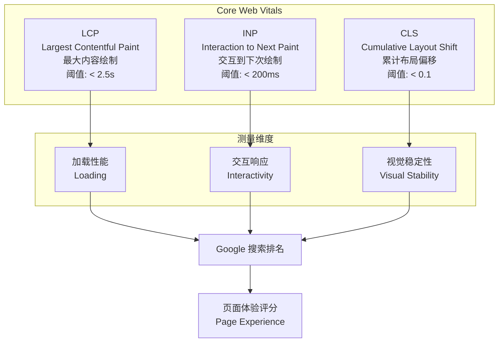
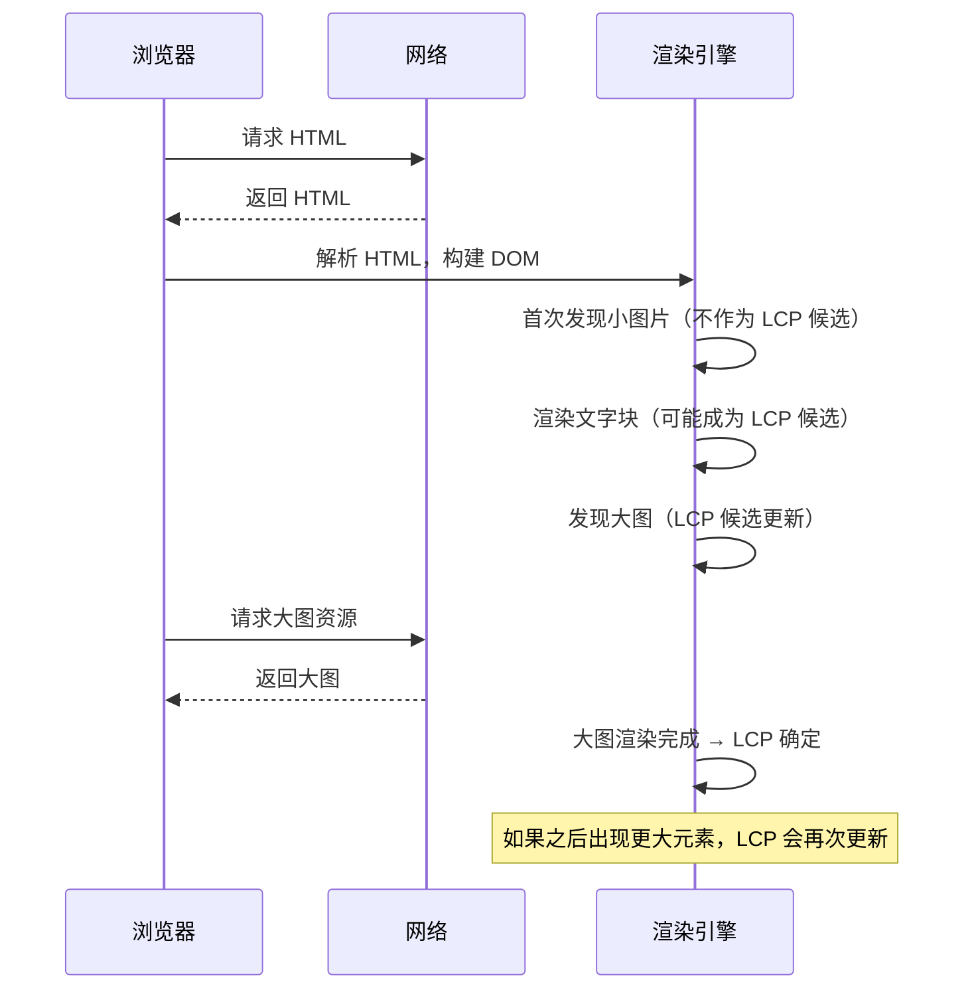
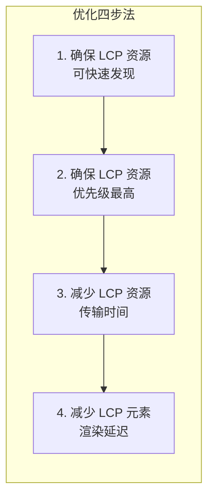
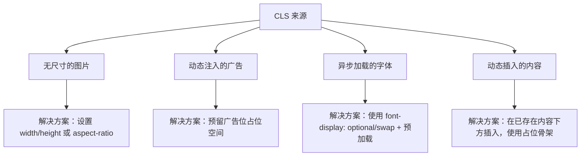
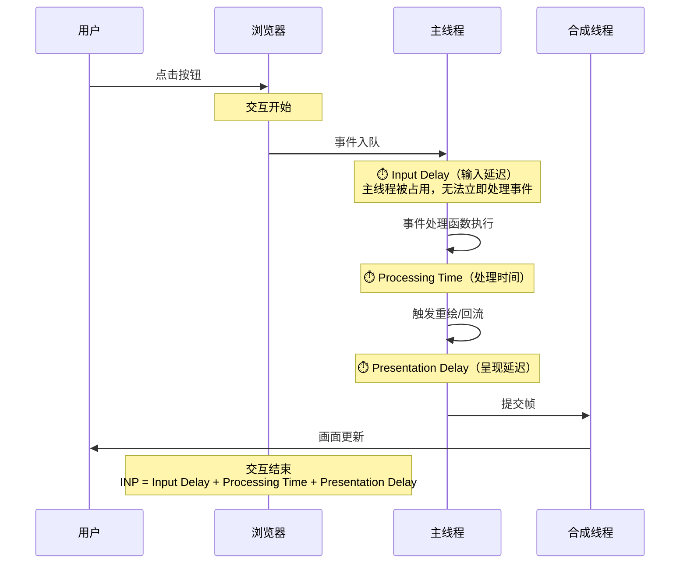
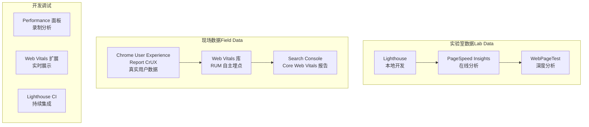

# Core Web Vitals

## ⭐ 面试重点速览

| 知识模块 | 重点内容 | 面试频率 |
|----------|----------|----------|
| LCP | 最大内容绘制定义、LCP 元素类型、优化策略（预加载/压缩/SSR/CDN） | 极高 |
| INP | 交互响应延迟、INP vs FID 本质区别、为什么 Google 替换 FID、长任务拆分 | 极高 |
| CLS | 布局偏移原因、图片/广告/字体预留空间、无 layout 动画 | 高 |
| 测量工具 | Lighthouse、PageSpeed Insights、CrUX、Web Vitals 库、RUM 监控 | 中高 |
| 面试必问 | INP 与 FID 的区别？为什么替换？如何优化 CLS？ | 极高 |

---

## 模块概述

Core Web Vitals 是 Google 定义的**统一用户体验质量标准**，是衡量 Web 页面性能的"黄金标准"。2021 年 6 月起正式纳入 Google 搜索排名因子，标志着性能优化从"加分项"变为"必选项"。

::: danger 为什么 Core Web Vitals 如此重要？
1. **SEO 排名**：Google 将 Core Web Vitals 作为页面体验排名信号
2. **面试必考**：大厂前端面试中，Core Web Vitals 是性能优化的核心考察点
3. **行业标准**：统一的指标让不同网站的性能可以直接对比
4. **持续演进**：INP 替换 FID 标志着 Google 从"首次交互"转向"全生命周期交互"的测量理念转变
:::

---

## Core Web Vitals 全景



---

## LCP —— 最大内容绘制

### 定义

LCP（Largest Contentful Paint）测量页面**视口内最大可见内容元素**完成渲染的时间点，反映用户感知的**加载速度**。

### LCP 元素类型

LCP 不是简单的"最大图片"，而是以下元素类型中**在视口内可见的最大者**：

| 元素类型 | 示例 |
|----------|------|
| `` 元素 | 首屏大图、Banner |
| `<image>` 在 `<svg>` 内 | SVG 内的图片元素 |
| `<video>` 的 poster 属性 | 视频封面图 |
| 通过 `url()` 加载的背景图片 | CSS background-image |
| 包含文本节点的块级元素 | 大标题（h1）、段落文字块 |

::: warning 注意
LCP 会动态变化。页面加载过程中，随着更大元素渲染完成，LCP 会更新。最终 LCP 是所有候选元素中**渲染完成时间最晚**的那个。
:::

### LCP 的生命周期



### LCP 优化策略



#### 策略一：确保 LCP 资源可快速发现

```html
<!-- 对 LCP 图片使用 preload，让浏览器尽早发现 -->
<link rel="preload" as="image" href="/hero-banner.webp" fetchpriority="high">

<!-- 使用 fetchpriority="high" 提升 LCP 图片的请求优先级 -->

```

```html
<!-- LCP 是文本块时，确保字体尽早加载 -->
<link rel="preload" as="font" href="/fonts/main.woff2" crossorigin>
```

#### 策略二：减少 LCP 资源传输时间

| 方法 | 说明 |
|------|------|
| 使用现代图片格式 | WebP / AVIF 比 PNG/JPEG 体积小 30%~50% |
| 响应式图片 | `<picture>` + `srcset` 根据设备加载合适尺寸 |
| CDN 加速 | 将 LCP 资源部署到 CDN，利用边缘节点缩短 RTT |
| 预连接 | `<link rel="preconnect" href="https://cdn.example.com">` |

```html
<!-- 响应式图片：不同设备加载不同尺寸 -->
<picture>
  <source srcset="/hero-desktop.webp" media="(min-width: 768px)">
  <source srcset="/hero-tablet.webp" media="(min-width: 480px)">
  
</picture>
```

#### 策略三：减少 LCP 元素渲染延迟

::: tip 关键原则
LCP = 资源加载时间 + 渲染时间。即使资源下载很快，如果被 JS 阻塞渲染，LCP 也会很差。
:::

```javascript
// 避免 JS 阻塞 LCP 渲染
// 将非关键 JS 标记为 async 或 defer
// <script async src="analytics.js"></script>
// <script defer src="app.js"></script>

// 服务端渲染（SSR）直接输出 LCP 元素的 HTML
// 避免客户端渲染导致 LCP 延迟
```

---

## CLS —— 累计布局偏移

### 定义

CLS（Cumulative Layout Shift）测量页面生命周期中**所有意外布局偏移的累计分数**。它反映了**视觉稳定性**。

### 计算公式

```
CLS = 影响分数（impact fraction） × 距离分数（distance fraction）

影响分数 = 不稳定元素在视口中所占面积（两帧之间的并集区域）
距离分数 = 不稳定元素移动的距离 / 视口最大尺寸
```

### 常见 CLS 来源及解决方案



#### 图片/视频预留空间

```css
/* 方案一：直接设置宽高属性（现代浏览器会自动计算 aspect-ratio） */
img {
  width: 100%;
  height: auto;
  /* 配合 HTML 中的 width/height 属性使用 */
}

/* 方案二：CSS aspect-ratio */
.video-container {
  aspect-ratio: 16 / 9;
  width: 100%;
  background: #f0f0f0; /* 占位背景色 */
}

/* 方案三：使用 padding-top 百分比技巧（兼容旧浏览器） */
.video-wrapper {
  position: relative;
  padding-top: 56.25%; /* 16:9 */
}
.video-wrapper iframe {
  position: absolute;
  top: 0;
  left: 0;
  width: 100%;
  height: 100%;
}
```

#### 广告位预留

```css
/* 广告加载前预留空间，避免内容跳动 */
.ad-slot {
  min-height: 250px; /* 根据广告尺寸设置 */
  background: #f5f5f5;
  display: flex;
  align-items: center;
  justify-content: center;
}

/* 广告加载失败时隐藏占位，避免留下空白 */
.ad-slot:empty {
  display: none;
}
```

#### 字体加载优化

```css
/* font-display 策略对比 */
/* optional: 极短阻塞期，字体未加载完就用回退字体，不产生 CLS（但可能不显示自定义字体） */
@font-face {
  font-family: 'MyFont';
  src: url('/fonts/MyFont.woff2') format('woff2');
  font-display: optional;
}

/* swap: 立即用回退字体，加载完再切换，会产生 CLS */
/* 解决方案：使用 size-adjust 减少字体切换时的布局偏移 */
@font-face {
  font-family: 'MyFont';
  src: url('/fonts/MyFont.woff2') format('woff2');
  font-display: swap;
  size-adjust: 105%; /* 调整字体度量，使回退字体与自定义字体尺寸接近 */
}
```

::: warning 面试追问：哪些动画不会产生 CLS？
使用 `transform` 属性的动画不会触发 CLS，因为 `transform` 只改变视觉呈现，不改变元素在文档流中的位置。同理，`opacity`、`filter` 等 CSS 属性也不会产生 CLS。**关键原则**：只要不改变元素在布局中的几何位置，就不会产生 CLS。
:::

---

## INP —— 交互到下次绘制（⭐ 极高）

### 定义

INP（Interaction to Next Paint）测量用户与页面进行**所有交互**（点击、触摸、按键）的延迟，最终取**整个页面生命周期中最差（或接近最差）的交互延迟**作为 INP 值。

### 为什么 INP 替换了 FID？

这是面试中**最高频**的追问点。FID（First Input Delay）从 2018 年起作为 Core Web Vitals 的交互指标，于 2024 年 3 月正式被 INP 替换。

::: danger 面试必问：INP 与 FID 的核心区别

| 维度 | FID（First Input Delay） | INP（Interaction to Next Paint） |
|------|--------------------------|----------------------------------|
| 测量范围 | **仅首次交互** | 页面**整个生命周期所有交互** |
| 测量内容 | 仅测量输入延迟（Input Delay） | 测量完整交互延迟：输入延迟 + 处理时间 + 呈现延迟 |
| 代表场景 | 页面加载时用户快速点击 | 整个使用过程中的所有交互响应 |
| 数据代表性 | 仅反映加载阶段的交互体验 | 反映用户完整使用体验 |
| 弃用原因 | 覆盖范围太窄，无法反映真实交互体验 | — |

**FID 的致命缺陷**：
- 只测量首次交互，但用户最痛苦的往往不是首次交互，而是**使用过程中某个按钮反复无响应**
- 只测量输入延迟，不包括事件处理时间和渲染时间，反映的延迟不完整
- Chrome 数据显示，FID 为"Good"的网站中，有相当比例在真实使用中交互体验仍然很差

**INP 的优势**：
- 覆盖全生命周期，更真实反映用户体验
- 测量完整交互延迟，从输入到画面更新
- 取接近最差的值（通常是第 98 百分位），鼓励优化最差情况的交互
:::

### INP 的完整交互延迟



### INP 优化策略

#### 策略一：拆分长任务（Long Task）

```javascript
// ❌ 长任务：阻塞主线程超过 50ms
function processLargeData(items) {
  // 所有处理在同一个任务中完成
  items.forEach(item => {
    heavyComputation(item); // 假设每个耗时 5ms，1000 个就是 5000ms
  });
}

// ✅ 使用 setTimeout 拆分长任务
function processLargeDataChunked(items, chunkSize = 50) {
  let index = 0;

  function processChunk() {
    const end = Math.min(index + chunkSize, items.length);
    for (let i = index; i < end; i++) {
      heavyComputation(items[i]);
    }
    index = end;

    if (index < items.length) {
      // 将剩余任务调度到下一个宏任务
      setTimeout(processChunk, 0);
    }
  }

  processChunk();
}

// ✅ 使用 scheduler.yield()（现代 API，更优雅）
async function processLargeDataYield(items) {
  for (let i = 0; i < items.length; i++) {
    heavyComputation(items[i]);

    // 每处理 50 个，让出主线程
    if (i % 50 === 0) {
      await scheduler.yield();
    }
  }
}
```

#### 策略二：使用 Web Worker 避免阻塞主线程

```javascript
// main.js —— 主线程
const worker = new Worker('/workers/heavy-task.js');

// 将耗时计算交给 Worker
worker.postMessage({ data: largeDataset, action: 'process' });

worker.onmessage = (event) => {
  // 计算完成后更新 UI
  updateUI(event.data.result);
};

// workers/heavy-task.js —— Worker 线程
self.onmessage = (event) => {
  const { data, action } = event.data;
  if (action === 'process') {
    const result = heavyComputation(data);
    self.postMessage({ result });
  }
};
```

#### 策略三：减少事件处理时间

```javascript
// ❌ 事件处理中做太多事情
button.addEventListener('click', (e) => {
  // 1. 复杂的计算
  const result = complexCalculation(data);
  // 2. 同步 DOM 操作
  document.getElementById('output').textContent = result;
  // 3. 发送分析请求
  fetch('/analytics', { method: 'POST', body: JSON.stringify({ event: 'click' }) });
  // 4. 更新多个组件状态
  updateStateA();
  updateStateB();
});

// ✅ 拆分事件处理，将非关键操作延迟
button.addEventListener('click', (e) => {
  // 1. 只做关键操作
  const result = complexCalculation(data);
  document.getElementById('output').textContent = result;

  // 2. 非关键操作延迟执行
  requestIdleCallback(() => {
    fetch('/analytics', { method: 'POST', body: JSON.stringify({ event: 'click' }) });
  });

  // 3. 状态更新批量处理
  queueMicrotask(() => {
    batchUpdateStates();
  });
});
```

#### 策略四：使用 `isInputPending` 检测待处理输入

```javascript
// 在长任务中插入检查点，让出控制权给用户交互
async function longRunningTaskWithInterrupt(data) {
  const tasks = data.map(item => () => processItem(item));

  for (const task of tasks) {
    task();

    // 检查是否有待处理的用户输入
    if (navigator.scheduling?.isInputPending?.()) {
      // 有用户输入等待处理，暂停当前任务，让出主线程
      await new Promise(resolve => setTimeout(resolve, 0));
    }
  }
}
```

### INP 测量与调试

```javascript
// 使用 web-vitals 库在应用中埋点测量 INP
import { onINP } from 'web-vitals';

onINP((metric) => {
  // metric.value —— INP 值（毫秒）
  // metric.entries —— 导致 INP 的具体交互事件
  console.log('INP:', metric.value, 'ms');

  // 发送到分析平台
  sendToAnalytics({
    name: 'INP',
    value: metric.value,
    rating: metric.rating, // 'good' | 'needs-improvement' | 'poor'
    entries: metric.entries,
  });
});
```

---

## 测量工具全景



::: tip 实验室数据 vs 现场数据
- **实验室数据（Lab Data）**：在受控环境中测量，可复现，适合开发和调试
- **现场数据（Field Data / RUM）**：收集真实用户数据，反映实际体验，是 Google 排名使用的数据源
- 两者互补：Lab 数据用于定位问题，Field 数据用于验证效果
:::

---

## 面试追问环节

**Q：为什么 Google 要在 2024 年用 INP 替换 FID？**

FID 只测量**首次交互的输入延迟**，存在两个致命缺陷：

1. **覆盖范围太窄**：只测量首次交互，但用户最痛苦的交互延迟往往发生在使用过程中（如反复点击无响应的按钮）。FID 为 "Good" 的网站，用户可能在后续交互中体验极差。

2. **测量不完整**：FID 只测量输入延迟（Input Delay），不包括事件处理时间和渲染时间。一个事件处理函数执行了 500ms，FID 可能仍然是 20ms，但这 500ms 的处理时间用户能明显感知到。

INP 解决了这两个问题：测量**全生命周期所有交互**的**完整延迟**（输入延迟 + 处理时间 + 呈现延迟），取接近最差的值，更真实地反映用户交互体验。

**Q：LCP 计算中，为什么文本块也可以成为 LCP 元素？**

LCP 的设计目标是反映**用户感知的主要内容加载完成时间**。在内容型网站（如博客、文档），最重要的内容往往是标题和正文文本，而非图片。如果只考虑图片，会导致这些网站的 LCP 值无法反映真实体验。

**Q：CLS 是累计值，如何定位具体是哪个元素导致的 CLS？**

在 Chrome DevTools 的 Performance 面板中录制页面加载过程，然后在 "Experience" 轨道中可以看到 Layout Shift 事件，点击即可高亮显示发生偏移的元素。也可以使用 Web Vitals 库的 `onCLS` 获取 `metric.entries`，其中包含每个偏移事件的源元素信息。

**Q：如果 Core Web Vitals 三个指标不能同时达到 "Good"，应该优先优化哪个？**

优先级排序：**LCP > CLS > INP**。理由：
- LCP 直接影响用户对"这个网站快不快"的第一印象，影响跳出率
- CLS 是用户最讨厌的体验之一（误点击），一旦发生用户会非常沮丧
- INP 虽然重要，但用户对交互延迟有一定容忍度

但这取决于你的网站类型：
- 电商/内容站：LCP > CLS > INP
- SaaS/工具类应用：INP > CLS > LCP
- 新闻/博客：LCP > CLS > INP