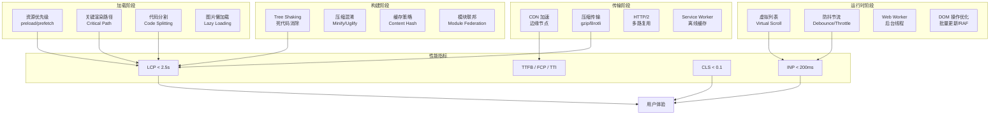

# 前端性能优化概览

## ⭐ 面试重点速览

| 知识模块 | 重点内容 | 面试频率 |
|----------|----------|----------|
| Core Web Vitals | LCP/INP/CLS 指标定义与优化、INP 为何替换 FID | 极高 |
| 加载优化 | 图片懒加载、Code Splitting、Tree Shaking、CDN、资源预加载 | 极高 |
| 运行时优化 | 虚拟列表、防抖节流（手写）、事件委托、内存泄漏排查 | 极高 |
| SEO 优化 | SSR/SSG 对 SEO 的影响、TDK、结构化数据、Core Web Vitals 排名因子 | 高 |
| 构建优化 | Webpack/Vite 优化配置、压缩混淆、缓存策略 | 中高 |
| 传输优化 | gzip/Brotli、HTTP/2 多路复用、CDN 缓存策略 | 中 |

---

## 模块概述

前端性能优化是高级前端工程师的核心竞争力之一。它不仅仅是一个技术问题，更是**用户体验、业务转化率和搜索引擎排名的直接驱动力**。据统计，页面加载时间每增加 1 秒，转化率下降约 7%（Google 研究数据）。

本模块从**面试准备**角度出发，系统梳理前端性能优化的四大维度和完整知识体系，涵盖从加载到渲染、从构建到传输的全链路优化策略。

::: danger 为什么性能优化至关重要？
1. **用户体验**：53% 的移动用户会在页面加载超过 3 秒时离开（Google 数据）
2. **SEO 排名**：Core Web Vitals 是 Google 搜索排名的重要因子（2021 年起纳入）
3. **业务转化**：Pinterest 将感知等待时间减少 40% 后，搜索流量和注册量提升 15%
4. **大厂面试**：性能优化是区分中级和高级候选人的关键考察维度
:::

---

## 性能优化四大维度



也可以使用 ASCII 理解全链路优化流程：

```
+============================================================+
|                   前端性能优化全链路                          |
|                                                            |
|  [构建阶段]           [传输阶段]          [加载阶段]         |
|  Tree Shaking  --->  CDN 缓存  ------->  关键资源加载       |
|  Code Splitting ->  gzip/Brotli ------>  图片懒加载         |
|  压缩混淆      --->  HTTP/2 多路复用 -->  代码按需导入       |
|                                     |                      |
|                                     v                      |
|                              [运行时阶段]                   |
|                              虚拟滚动 / 防抖节流             |
|                              Web Worker / 批量 DOM 更新     |
|                                                            |
|  +--------------------------------------------------+     |
|  |         Core Web Vitals 性能指标体系               |     |
|  |  LCP（加载性能）| INP（交互响应）| CLS（视觉稳定）  |     |
|  +--------------------------------------------------+     |
+============================================================+
```

---

## 性能指标体系

### 以用户为中心的性能指标

| 指标 | 含义 | 良好阈值 | 测量工具 |
|------|------|----------|----------|
| **LCP** (Largest Contentful Paint) | 最大内容绘制时间 | < 2.5s | Lighthouse / Web Vitals 库 |
| **INP** (Interaction to Next Paint) | 交互到下次绘制延迟 | < 200ms | Web Vitals 库 / Chrome User Experience Report |
| **CLS** (Cumulative Layout Shift) | 累计布局偏移分数 | < 0.1 | Lighthouse / Web Vitals 库 |
| **FCP** (First Contentful Paint) | 首次内容绘制 | < 1.8s | Lighthouse / Performance API |
| **TTFB** (Time to First Byte) | 首字节时间 | < 800ms | Performance API / WebPageTest |
| **TTI** (Time to Interactive) | 可交互时间 | < 3.8s | Lighthouse |

### 传统指标 vs 以用户为中心指标

::: tip 思维转变
传统性能优化关注 `DOMContentLoaded`、`load` 事件等**技术指标**，而 Core Web Vitals 关注的是**用户实际感知**：
- LCP 回答："主要内容什么时候出现？"——用户感知的加载速度
- INP 回答："点击/输入后多久响应？"——用户感知的交互流畅度
- CLS 回答："页面会不会突然跳动？"——用户感知的视觉稳定性
:::

---

## 各子模块简介

| 子模块 | 定位 | 核心难点 | 面试权重 |
|--------|------|----------|----------|
| [Core Web Vitals](./core-web-vitals.md) | Google 性能标准深度解析 | LCP 优化路径、INP 与 FID 的本质区别、CLS 排查方法 | ⭐⭐⭐⭐⭐ |
| [优化策略全景](./optimization-strategies.md) | 四维优化体系总览 | 全链路排查思路、性能瓶颈定位方法论 | ⭐⭐⭐⭐ |
| [加载优化](./loading-optimization.md) | 资源加载全流程优化 | Tree Shaking 原理、Code Splitting 策略、资源预加载优先级 | ⭐⭐⭐⭐⭐ |
| [运行时优化](./runtime-optimization.md) | 页面运行期性能保障 | 虚拟列表（手写实现）、防抖节流（手写实现）、内存泄漏分析 | ⭐⭐⭐⭐⭐ |
| [SEO 优化](./seo.md) | 搜索引擎优化实战 | CSR 的 SEO 困境与解决方案、结构化数据、Core Web Vitals 排名因子 | ⭐⭐⭐⭐ |

---

## 性能优化的核心方法论

### RAIL 模型

Google 提出的以用户为中心的性能模型：

| 维度 | 目标 | 关键指标 |
|------|------|----------|
| **R**esponse（响应） | 在 100ms 内响应用户输入 | INP < 200ms |
| **A**nimation（动画） | 在 16ms 内生成一帧（60fps） | 帧预算 < 10ms |
| **I**dle（空闲） | 利用空闲时间做预加载等优化 | 长任务 < 50ms |
| **L**oad（加载） | 在 5 秒内可交互（3G 网络） | LCP < 2.5s |

### PRPL 模式

适用于现代 Web 应用的性能模式：

- **P**ush（推送）：对关键资源使用 HTTP/2 Server Push 或 `<link rel="preload">`
- **R**ender（渲染）：尽快渲染初始路由，使用 SSR 或预渲染
- **P**re-cache（预缓存）：使用 Service Worker 缓存应用壳（App Shell）
- **L**azy-load（懒加载）：按需加载剩余路由和资源

---

## 性能排查工具链

| 阶段 | 工具 | 用途 |
|------|------|------|
| 本地开发 | Lighthouse（Chrome DevTools） | 综合性能评分和优化建议 |
| 本地开发 | Performance 面板 | 录制运行时性能，分析长任务和帧率 |
| 本地开发 | Network 面板 | 分析资源加载瀑布图、请求优先级 |
| 本地开发 | Coverage 面板 | 检测未使用的 CSS/JS 代码 |
| 线上监控 | PageSpeed Insights | 基于 Lighthouse 和 CrUX 真实数据 |
| 线上监控 | Chrome User Experience Report (CrUX) | 真实用户的 Core Web Vitals 数据 |
| 线上监控 | Web Vitals 扩展 / 库 | 在应用中埋点收集 RUM（真实用户监控）数据 |
| 专项分析 | WebPageTest | 多地域、多设备的详细瀑布图分析 |
| 构建分析 | webpack-bundle-analyzer | 可视化分析打包产物体积构成 |

---

## 面试追问环节

**Q：前端性能优化应该从哪里开始？**

遵循"测量—优化—监控"的闭环原则：
1. **先测量**：使用 Lighthouse 和 Performance 面板获取基准数据，不要凭感觉优化
2. **找瓶颈**：分析 Network 瀑布图找最长请求、分析 Performance 找长任务、分析 Coverage 找无用代码
3. **定优先级**：优先解决"投入产出比"最高的问题（如图片过大、关键资源阻塞渲染）
4. **后验证**：优化后重新测量，确认指标改善
5. **持续监控**：接入 RUM 监控（如 Web Vitals 库），追踪线上真实用户数据

::: danger 常见误区
- **误区一**：盲目使用 `will-change`、`translateZ(0)` 等 GPU 加速，可能导致内存飙升
- **误区二**：所有图片都用 `loading="lazy"`，首屏图片必须立即加载
- **误区三**：只在 Chrome 下测试，忽略低端设备和 Safari/Firefox 兼容性
- **误区四**：开发环境性能很好就认为没问题，生产环境有网络延迟、设备差异、数据量差异
:::

**Q：一个页面加载慢，如何系统排查？**

推荐使用 **分层排查法**：

```
第一层：网络与传输（Network 面板）
  → 检查请求总数、总传输体积、是否有大文件、是否有阻塞请求
  → 检查 CDN 命中情况、是否启用压缩、HTTP 协议版本

第二层：关键渲染路径（Performance 面板）
  → 检查 FCP/LCP 时间线，找出阻塞渲染的资源
  → 检查是否有 render-blocking CSS/JS
  → 分析关键请求链（Critical Request Chains）

第三层：运行时性能（Performance 面板录制）
  → 检查是否有长任务（Long Task > 50ms）
  → 检查帧率（FPS）、是否有强制同步布局（Forced Reflow）
  → 检查内存使用趋势，排查内存泄漏

第四层：构建产物（Coverage + Bundle Analyzer）
  → 检查首屏是否加载了不必要的代码
  → 分析包体积构成，找出可优化的依赖
  → 检查 Tree Shaking 和 Code Splitting 是否生效
```

**Q：性能优化和用户体验的平衡点在哪里？**

性能优化不是追求极致数值，而是**为真实用户创造更好的体验**：
- 骨架屏（Skeleton Screen）比 loading 转圈更好——让用户感知到内容"正在加载"
- 乐观更新（Optimistic UI）比严格等待接口返回更好——先给用户即时反馈，后台同步
- 预加载（Prefetch）在用户空闲时进行，不要抢占当前页面的网络带宽
- 目标不是 Lighthouse 100 分，而是所有 Core Web Vitals 达到 "Good" 阈值