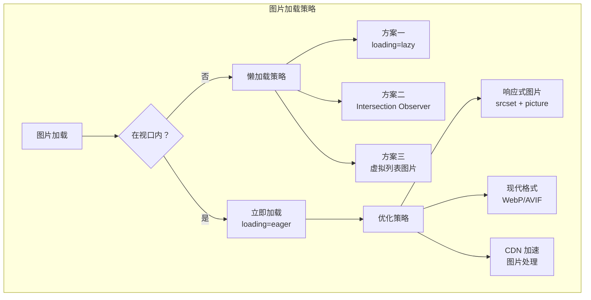
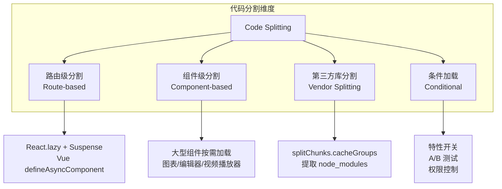
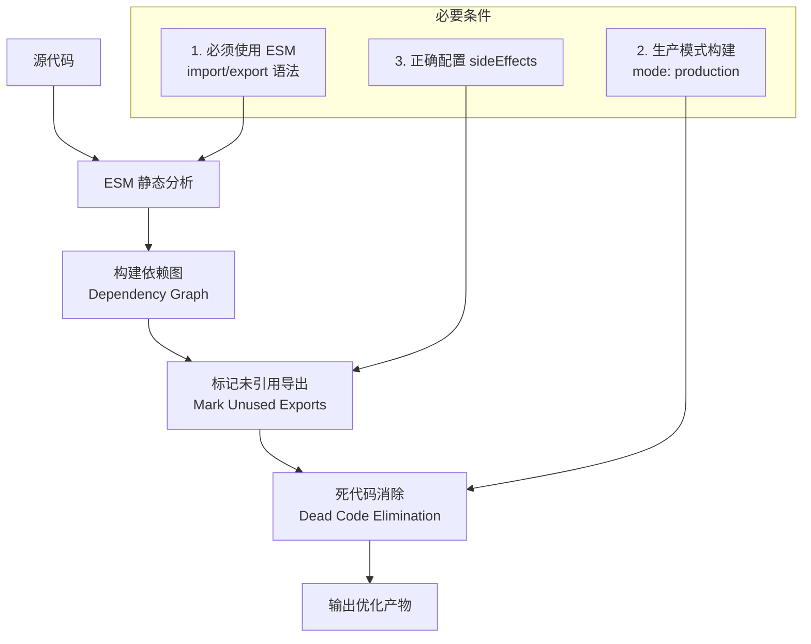
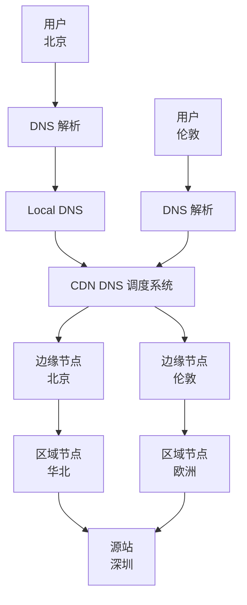

# 加载优化

## ⭐ 面试重点速览

| 知识模块 | 重点内容 | 面试频率 |
|----------|----------|----------|
| 图片懒加载 | loading="lazy"、Intersection Observer、虚拟列表图片方案 | 极高 |
| Code Splitting | 动态 import()、React.lazy、Vue defineAsyncComponent、splitChunks 配置 | 极高 |
| Tree Shaking | ESM 静态分析原理、sideEffects 配置、为什么 CJS 不支持 | 极高 |
| CDN 分发 | 边缘节点原理、回源策略、缓存层级、预热刷新 | 中高 |
| 压缩传输 | gzip vs Brotli 压缩率对比、压缩配置、字典压缩原理 | 中高 |
| 资源预加载 | preload/prefetch/preconnect/dns-prefetch 的区别与最佳实践 | 高 |

---

## 模块概述

加载优化关注的是**从用户输入 URL 到页面内容呈现**这整个过程中，如何让用户尽快看到、尽快交互。它是性能优化的第一道防线——加载阶段做得好，后续的运行时优化才有意义。

::: danger 加载性能对业务的影响
- Amazon 发现页面加载每慢 100ms，销售额下降 1%
- Google 发现搜索结果页每慢 400ms，搜索量下降 0.44%
- 首屏加载时间超过 3 秒，53% 的移动用户会离开
:::

---

## 一、图片懒加载

### 图片加载优化全景



### 方案一：原生 loading="lazy"

```html
<!-- 原生懒加载，浏览器原生支持，无需 JS -->


<!-- 首屏图片不要加 lazy！ -->


<!-- iframe 也支持懒加载 -->
<iframe src="https://www.youtube.com/embed/xxx" loading="lazy"></iframe>
```

::: warning 注意事项
- `loading="lazy"` 的**距离阈值**由浏览器决定（Chrome 根据网络状况动态调整，约 1250px~2500px）
- 对 LCP 图片**禁用** lazy，必须使用 `loading="eager"` 或 `fetchpriority="high"`
- 如果图片可能在懒加载触发前被 JS 移除/替换，优先使用 JS 方案（Intersection Observer）
- Safari 16.4+ 才完整支持，但已覆盖绝大多数用户
:::

### 方案二：Intersection Observer

```javascript
// 更灵活的懒加载方案，支持自定义阈值和回调
const imageObserver = new IntersectionObserver((entries, observer) => {
  entries.forEach(entry => {
    if (entry.isIntersecting) {
      const img = entry.target;
      // 从 data-src 读取真实图片 URL
      img.src = img.dataset.src;

      // 如果有 srcset
      if (img.dataset.srcset) {
        img.srcset = img.dataset.srcset;
      }

      // 图片加载完成后移除模糊占位
      img.onload = () => {
        img.classList.remove('lazy-placeholder');
      };

      // 已加载的图片停止观察，节省资源
      observer.unobserve(img);
    }
  });
}, {
  rootMargin: '200px', // 提前 200px 开始加载，提升体验
  threshold: 0.01      // 只要 1% 进入视口就触发
});

// 批量观察所有懒加载图片
document.querySelectorAll('img[data-src]').forEach(img => {
  imageObserver.observe(img);
});
```

```html
<!-- HTML 结构 -->

```

### 方案三：虚拟列表中的图片懒加载

```javascript
// 虚拟列表 + 图片懒加载组合方案
// 核心思路：只渲染可视区域 DOM + 图片进入视口才加载

class VirtualListWithLazyImage {
  constructor(container, items, itemHeight) {
    this.container = container;
    this.items = items;
    this.itemHeight = itemHeight;
    this.imageObserver = new IntersectionObserver(this.handleImageIntersect, {
      root: container,
      rootMargin: '300px',
    });
  }

  handleImageIntersect = (entries) => {
    entries.forEach(entry => {
      if (entry.isIntersecting) {
        const img = entry.target;
        img.src = img.dataset.src;
        this.imageObserver.unobserve(img);
      }
    });
  };

  render() {
    const visibleCount = Math.ceil(this.container.clientHeight / this.itemHeight);
    const startIndex = Math.floor(this.container.scrollTop / this.itemHeight);
    const visibleItems = this.items.slice(startIndex, startIndex + visibleCount + 2); // +2 缓冲

    // 渲染虚拟列表逻辑...
    // 渲染完成后，对图片元素调用 imageObserver.observe()
  }
}
```

---

## 二、代码分割（Code Splitting）

### 代码分割策略全景



### 路由级代码分割

```javascript
// React —— React.lazy + Suspense
import { lazy, Suspense } from 'react';
import { BrowserRouter, Routes, Route } from 'react-router-dom';

// 每个路由页面独立打包为 chunk
const HomePage = lazy(() => import(/* webpackChunkName: "home" */ './pages/Home'));
const AboutPage = lazy(() => import(/* webpackChunkName: "about" */ './pages/About'));
const DashboardPage = lazy(() => import(/* webpackChunkName: "dashboard" */ './pages/Dashboard'));

function App() {
  return (
    <BrowserRouter>
      <Suspense fallback={<PageLoading />}>
        <Routes>
          <Route path="/" element={<HomePage />} />
          <Route path="/about" element={<AboutPage />} />
          <Route path="/dashboard" element={<DashboardPage />} />
        </Routes>
      </Suspense>
    </BrowserRouter>
  );
}
```

```javascript
// Vue —— defineAsyncComponent
import { defineAsyncComponent } from 'vue';
import { createRouter, createWebHistory } from 'vue-router';

const router = createRouter({
  history: createWebHistory(),
  routes: [
    {
      path: '/',
      component: () => import(/* webpackChunkName: "home" */ './pages/Home.vue'),
    },
    {
      path: '/about',
      component: () => import(/* webpackChunkName: "about" */ './pages/About.vue'),
    },
    {
      path: '/dashboard',
      // 带加载状态和错误处理
      component: defineAsyncComponent({
        loader: () => import('./pages/Dashboard.vue'),
        loadingComponent: PageLoading,
        errorComponent: PageError,
        delay: 200,    // 200ms 后才显示 loading，避免闪烁
        timeout: 10000, // 10 秒超时
      }),
    },
  ],
});
```

### 第三方库分割（Webpack splitChunks）

```javascript
// webpack.config.js
module.exports = {
  optimization: {
    splitChunks: {
      chunks: 'all', // 对所有类型的 chunk 生效（async + initial）
      maxInitialRequests: 25,    // 入口的最大并行请求数
      minSize: 20000,            // 生成 chunk 的最小体积（20KB）
      cacheGroups: {
        // 提取 React 全家桶为独立 chunk
        react: {
          test: /[\\/]node_modules[\\/](react|react-dom|react-router-dom)[\\/]/,
          name: 'vendor-react',
          priority: 20, // 优先级高于 defaultVendors
        },
        // 提取 UI 组件库
        antd: {
          test: /[\\/]node_modules[\\/]antd[\\/]/,
          name: 'vendor-antd',
          priority: 20,
        },
        // 提取其他第三方库
        vendors: {
          test: /[\\/]node_modules[\\/]/,
          name: 'vendor-common',
          priority: 10,
        },
        // 提取公共模块
        common: {
          minChunks: 2,        // 至少被 2 个 chunk 引用
          priority: 5,
          reuseExistingChunk: true,
        },
      },
    },
  },
};
```

### 条件加载

```javascript
// 条件加载 —— 根据特性和权限按需加载
async function loadFeature(featureName) {
  switch (featureName) {
    case 'video-editor':
      // 只有需要使用视频编辑器的用户才加载（体积可能很大）
      const { VideoEditor } = await import('./features/VideoEditor');
      return VideoEditor;
    case 'data-export':
      const { exportToExcel } = await import('./features/ExcelExport');
      return exportToExcel;
    default:
      return null;
  }
}

// 移动端不加载桌面端专用组件
if (window.innerWidth >= 1024) {
  const { DesktopSidebar } = await import('./components/DesktopSidebar');
  render(DesktopSidebar);
}
```

---

## 三、Tree Shaking（⭐ 极高）

### Tree Shaking 工作原理



### 深入理解 Tree Shaking

Tree Shaking 本质上是**静态分析 + 死代码消除**的组合：

1. **静态分析阶段**：打包工具（Webpack/Rollup）分析 ESM 的 `import` 和 `export` 语句，构建模块依赖图，标记哪些导出被使用了，哪些没有被使用。

2. **死代码消除阶段**：压缩工具（Terser/esbuild）根据标记，将未被引用的导出从最终产物中移除。

```javascript
// 示例：为什么以下代码可以被 Tree Shaking？

// math.js
export function add(a, b) {
  return a + b;
}

export function subtract(a, b) {
  // 这个函数没有被任何地方导入
  return a - b;
}

// 副作用代码 —— 注意！这会影响 Tree Shaking
export function init() {
  window.MATH_INITIALIZED = true; // 有副作用！
}
// 即使 init 没有被导入，这个副作用代码也可能被保留，因为无法确定是否必要

// main.js
import { add } from './math.js';
console.log(add(1, 2));
// 打包后：subtract 和 init 的函数体可能被移除
// 但如果 init 有副作用，且 sideEffects 配置不当，可能被保留
```

### sideEffects 配置详解

```json
// package.json
{
  "name": "my-library",
  // 方案一：标记所有文件无副作用（最激进，Tree Shaking 效果最好）
  "sideEffects": false,

  // 方案二：列出有副作用的文件（推荐）
  "sideEffects": [
    "*.css",
    "*.scss",
    "*.less",
    "./src/polyfills.js",
    "./src/global-styles.js"
  ]
}
```

::: danger 面试必问：为什么 CommonJS 不支持 Tree Shaking？

**核心原因**：CommonJS 的模块导入导出是**运行时动态**的，打包工具无法在构建时进行静态分析。

```javascript
// CommonJS —— 动态特性，无法静态分析
// 1. 动态导入路径
const moduleName = condition ? 'moduleA' : 'moduleB';
const result = require(moduleName); // 运行时才知道导入什么

// 2. 动态导出
if (process.env.NODE_ENV === 'production') {
  module.exports = require('./prod');
} else {
  module.exports = require('./dev');
}

// 3. 可以修改导出对象
const utils = require('./utils');
utils.newMethod = function() {}; // 运行时修改模块

// 4. 重新赋值 module.exports
module.exports = someCondition ? objA : objB;
```

**ESM 为什么可以？** 因为 ESM 的设计约束使得静态分析成为可能：
- `import` 必须在模块顶层，不能在条件语句中
- 导入路径必须是字符串字面量，不能是变量
- 导出的绑定是只读的（live binding），不能重新赋值
- 这些约束使得打包工具可以在构建时精确分析依赖关系

**延伸问题：为什么 Webpack 使用 CommonJS 写的库也能部分 Tree Shaking？**

Webpack 在构建时会将 CommonJS 转换为 ESM 风格的内部表示，但转换后的分析能力有限。对于 `require(变量)` 这种动态导入，Webpack 无法确定导入了哪些内容，只能保守处理。因此，使用 ESM 编写的库 Tree Shaking 效果远好于 CommonJS。
:::

---

## 四、CDN 分发原理

### CDN 架构



### CDN 缓存层级

| 层级 | 位置 | 命中率 | 延迟 | 说明 |
|------|------|--------|------|------|
| L1（边缘节点） | 离用户最近 | 70%~90% | 最低 | 直接响应用户请求 |
| L2（区域节点） | 区域中心 | 10%~25% | 中等 | L1 未命中时回源 |
| L3（源站） | 原始服务器 | 5% 以下 | 最高 | 所有缓存未命中时的最终来源 |

### CDN 缓存策略

```nginx
# Nginx 作为 CDN 节点的缓存配置示例
proxy_cache_path /data/cache levels=1:2 keys_zone=my_cache:100m max_size=10g inactive=7d;

server {
    location / {
        proxy_cache my_cache;
        proxy_cache_key "$scheme$host$request_uri";  # 缓存键
        proxy_cache_valid 200 1h;                     # 200 响应缓存 1 小时
        proxy_cache_valid 404 1m;                     # 404 响应缓存 1 分钟
        proxy_cache_use_stale error timeout updating; # 后端出错时使用过期缓存
        add_header X-Cache-Status $upstream_cache_status; # 调试用缓存头

        proxy_pass http://origin-server;
    }
}
```

---

## 五、gzip 与 Brotli 压缩

### 压缩原理

两种压缩算法都基于 **LZ77 算法 + 字典编码**：

- **LZ77**：查找重复的字符串模式，用"距离+长度"的引用来替换
- **字典编码**：将常见的字符串预先构建字典，传输时只需传输字典索引

Brotli 相比 gzip 的额外优势：
- 更大的滑动窗口（Brotli 最大 16MB，gzip 只有 32KB），能发现更长距离的重复模式
- 预定义的静态字典，包含 HTML/JS/CSS 中常见字符串（如 `<html>`、`function`、`</body>`）
- 上下文建模，根据上下文选择不同的编码方式

### 压缩效果对比

```javascript
// 实测数据（以一个 150KB 的 JS bundle 为例）
// 原始大小：      150.0 KB
// gzip level 6：   45.2 KB（压缩率 70%）
// Brotli level 6： 38.7 KB（压缩率 74%）
// Brotli level 11：35.1 KB（压缩率 77%，但压缩时间显著增加）
```

::: tip 最佳实践
1. **静态资源**：构建时使用 Brotli 预压缩，CDN 直接分发 `.br` 文件
2. **动态内容**：服务端实时压缩时使用 gzip（压缩速度快，CPU 开销小）
3. **协商机制**：浏览器通过 `Accept-Encoding` 请求头声明支持的压缩算法，服务器通过 `Content-Encoding` 响应头告知实际使用的算法
4. **Brotli 的 level 选择**：level 6 是性价比最佳选择（压缩率接近 level 11，但速度快 3-4 倍）
:::

---

## 六、资源预加载策略对比

| 策略 | 作用 | 使用时机 | 浏览器行为 | 注意 |
|------|------|----------|------------|------|
| **preload** | 当前页面**必定需要**的资源 | 首屏关键资源（LCP 图片、字体、关键 CSS） | 立即以高优先级下载 | 不要滥用，只对 2-3 个关键资源使用 |
| **prefetch** | **未来导航**可能需要的资源 | 下一个路由的资源、预测用户可能访问的页面 | 空闲时低优先级下载 | 不保证一定会被使用 |
| **preconnect** | 提前建立到跨域服务器的连接 | CDN、API、第三方服务域名 | 提前完成 DNS+TCP+TLS | 只对跨域域名使用，控制在 4-6 个 |
| **dns-prefetch** | 仅提前解析 DNS | 不确定是否需要完整连接的域名 | 仅 DNS 解析 | 开销最小，适合批量使用 |

```html
<!-- 完整示例：合理的资源优先级配置 -->
<head>
  <!-- 第一步：预连接（最早执行） -->
  <link rel="preconnect" href="https://cdn.example.com">
  <link rel="preconnect" href="https://api.example.com">

  <!-- 第二步：DNS 预解析（低成本） -->
  <link rel="dns-prefetch" href="https://www.google-analytics.com">
  <link rel="dns-prefetch" href="https://fonts.googleapis.com">

  <!-- 第三步：预加载关键资源（当前页面必须） -->
  <link rel="preload" as="font" href="/fonts/main.woff2" crossorigin>
  <link rel="preload" as="image" href="/hero.webp" fetchpriority="high">

  <!-- 第四步：预获取未来资源 -->
  <link rel="prefetch" as="script" href="/chunks/next-page.js">
</head>
```

---

## 面试追问环节

**Q：Tree Shaking 的原理是什么？为什么 CommonJS 不支持？**

Tree Shaking 依赖 ESM 的两大特性：
1. **静态导入导出**：`import` 必须在模块顶层，路径必须是字符串字面量，这使得打包工具可以构建精确的依赖图
2. **编译时分析**：打包工具在构建时就能确定哪些导出被使用了，哪些没有被使用

CommonJS 不支持的根本原因是其**动态特性**：`require()` 可以放在条件语句中，路径可以是变量，`module.exports` 可以在运行时动态修改，这些动态行为使得构建时无法进行静态分析。

**Q：Code Splitting 的 splitChunks 配置中，chunks: 'all' 和 'async' 有什么区别？**

- `'async'`（默认）：只对异步加载的 chunk（即 `import()` 动态导入的模块）进行分割
- `'all'`：对所有 chunk（包括入口 chunk 和异步 chunk）进行分割，效果更好

推荐使用 `'all'`，因为入口 chunk 中的第三方库也可以被提取为独立 chunk，实现更好的缓存策略。

**Q：preload 和 prefetch 的核心区别是什么？会在什么场景下造成问题？**

核心区别：
- **preload**：高优先级，当前页面必须使用，立即下载
- **prefetch**：低优先级，未来页面可能使用，空闲时下载

常见问题：
1. **preload 滥用**：对过多资源使用 preload 会导致它们互相抢占带宽，反而延迟了关键资源的加载
2. **preload 未使用**：如果 preload 的资源在 3 秒内未被使用，Chrome 会发出警告（浪费带宽）
3. **prefetch 对当前页面的影响**：在移动网络下，prefetch 可能消耗用户流量。建议在 WiFi 或 4G 环境下使用

**Q：CDN 回源率过高可能是什么原因？如何优化？**

回源率过高的原因和对应的优化方案：
1. **缓存时间过短**：延长 `Cache-Control: max-age`（对不常变的资源设置 7 天以上）
2. **缓存键不合理**：URL 参数变化导致缓存未命中（如时间戳参数），考虑忽略无关参数
3. **CDN 预热不足**：大促前手动预热热点资源到 CDN 边缘节点
4. **缓存穿透**：对不存在的内容也设置短时间的缓存（如 404 缓存 1 分钟）
5. **冷数据**：长尾内容访问频率低，自然回源率高，可通过区域节点缓存缓解