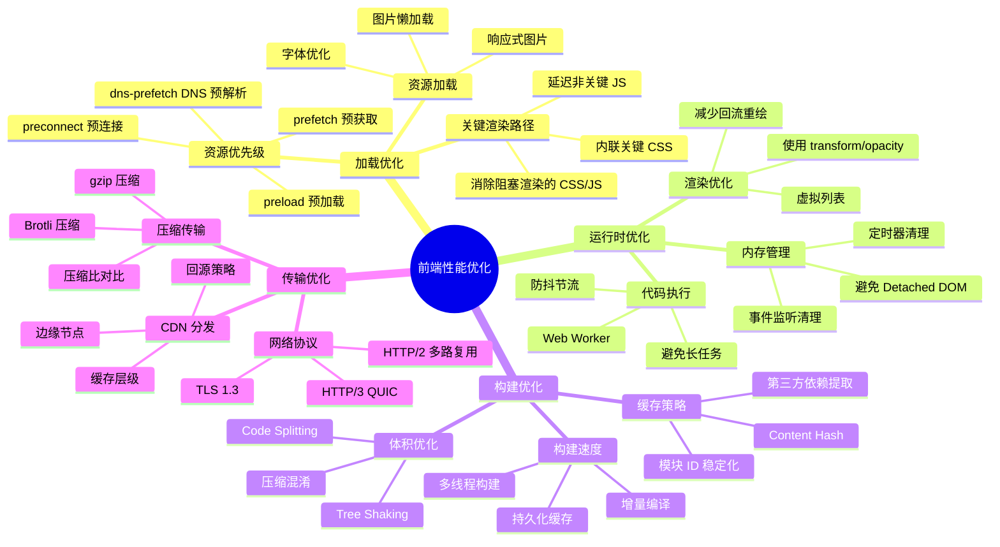
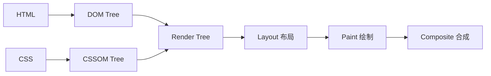
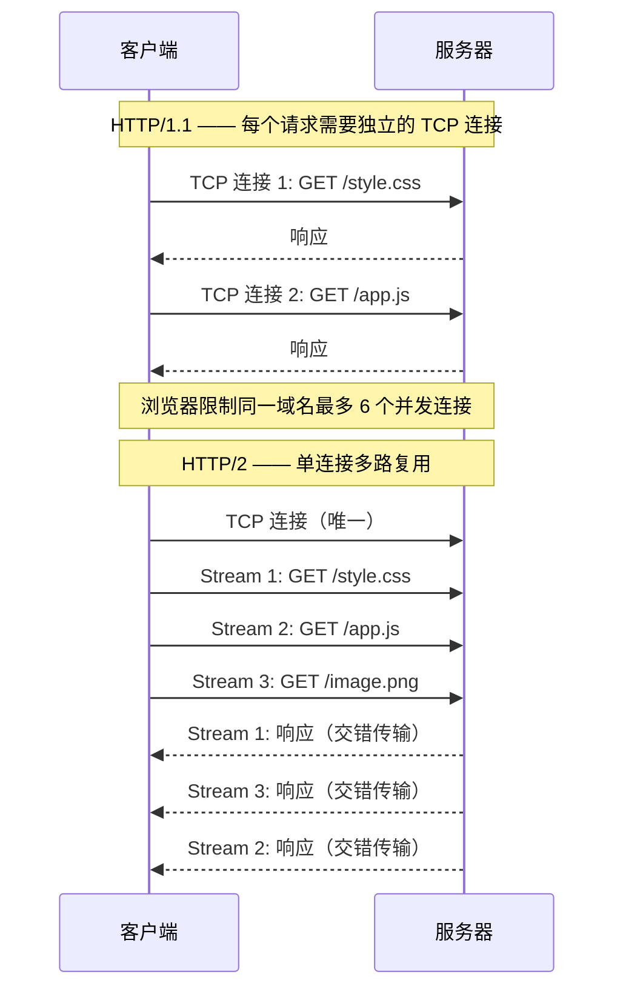

# 优化策略全景

## ⭐ 面试重点速览

| 知识模块 | 重点内容 | 面试频率 |
|----------|----------|----------|
| 加载优化 | 资源优先级（preload/prefetch/preconnect）、关键渲染路径优化 | 极高 |
| 运行时优化 | 避免长任务、虚拟滚动、Web Worker | 极高 |
| 构建优化 | Tree Shaking、Code Splitting、压缩混淆、缓存策略 | 高 |
| 传输优化 | CDN、gzip/Brotli、HTTP/2 多路复用 | 中高 |
| 面试必问 | 一个页面加载慢，如何排查？性能优化完整方法论 | 极高 |

---

## 模块概述

前端性能优化不是单点技术，而是一个**系统工程**。本章从全局视角梳理四大优化维度的完整策略体系，帮助你在面试中展现"系统化思考"的能力——这是高级工程师与中级工程师的核心区别。

::: tip 面试技巧
面试官问"如何做性能优化"时，不要直接讲具体技术（如"用 WebP"），而是先用**框架思维**定位问题维度，再展开具体策略。这能展示你的系统化思考能力。
:::

---

## 四维优化体系全景



也可以使用 ASCII 方式理解四个维度的关系：

```
+===============================================================+
|                    前端性能优化四维体系                          |
|                                                                |
|  +------------------+    +------------------+                  |
|  |   构建优化        |    |   传输优化        |                  |
|  |   (Build Time)   |    |   (Transfer)     |                  |
|  |                  |    |                  |                  |
|  | Tree Shaking     |    | CDN 加速         |                  |
|  | Code Splitting   |    | gzip / Brotli    |                  |
|  | 压缩混淆         |    | HTTP/2 多路复用   |                  |
|  | 缓存策略         |    | Service Worker   |                  |
|  +--------+---------+    +--------+---------+                  |
|           |                       |                            |
|           v                       v                            |
|  +--------------------------------------------------+         |
|  |              加载优化 (Loading)                    |         |
|  |  preload / prefetch / preconnect / 关键渲染路径    |         |
|  +--------------------------+-----------------------+         |
|                             |                                  |
|                             v                                  |
|  +--------------------------------------------------+         |
|  |              运行时优化 (Runtime)                   |         |
|  |  虚拟列表 / 防抖节流 / Web Worker / 内存管理       |         |
|  +--------------------------------------------------+         |
+===============================================================+
```

---

## 一、加载优化

### 资源优先级体系

浏览器资源加载有五个优先级，理解它们的作用是加载优化的基础：

| 优先级 | 说明 | 典型用法 |
|--------|------|----------|
| **preload** | 当前页面**必定使用**的关键资源，浏览器立即以高优先级下载 | 首屏大图、关键字体、关键 CSS/JS |
| **prefetch** | **未来页面**可能使用的资源，浏览器在空闲时低优先级下载 | 下一个路由页面的 JS bundle |
| **preconnect** | 提前完成 DNS + TCP + TLS 握手 | CDN 域名、API 域名、第三方资源域名 |
| **dns-prefetch** | 仅提前完成 DNS 解析 | 低成本预连接，适合不太确定是否需要连接的域名 |
| **prerender** | 预渲染整个页面（已废弃，用 prefetch 替代） | 几乎不再使用 |

```html
<!-- 资源优先级实战示例 -->
<head>
  <!-- 1. 预连接 CDN 和 API 域名 -->
  <link rel="preconnect" href="https://cdn.example.com">
  <link rel="preconnect" href="https://api.example.com">

  <!-- 2. DNS 预解析（低成本，适合不确定是否需要连接的域名） -->
  <link rel="dns-prefetch" href="https://analytics.google.com">

  <!-- 3. 预加载关键资源（当前页面必定使用） -->
  <link rel="preload" as="style" href="/critical.css">
  <link rel="preload" as="font" href="/fonts/main.woff2" crossorigin>
  <link rel="preload" as="image" href="/hero-banner.webp" fetchpriority="high">

  <!-- 4. 预获取下一个页面的资源 -->
  <link rel="prefetch" as="script" href="/chunks/about.js">
</head>
```

::: warning 使用注意事项
- **preload 不要滥用**：preload 的资源优先级最高，滥用会抢占其他关键资源的带宽。只对当前页面 LCP 相关的 2-3 个关键资源使用 preload。
- **preload 必须被使用**：如果 preload 的资源在 3 秒内未被使用，Chrome 会在控制台打印警告。这不仅浪费带宽，还会阻碍其他资源加载。
- **preconnect 只对跨域资源**：同源资源不需要 preconnect。
- **移动端慎用 preconnect**：每个连接都会消耗用户流量和电量，控制在 4-6 个以内。
:::

### 关键渲染路径（Critical Rendering Path）优化

关键渲染路径是浏览器将 HTML/CSS/JS 转换为屏幕上像素的步骤序列。



优化关键渲染路径的核心策略：

| 策略 | 具体做法 |
|------|----------|
| 减少关键资源数量 | 内联关键 CSS、延迟非关键 CSS/JS、代码分割 |
| 减少关键字节数 | 压缩 HTML/CSS/JS、Tree Shaking、移除未使用代码 |
| 缩短关键路径长度 | 减少资源请求链、使用 HTTP/2 服务端推送 |

```html
<!-- 关键渲染路径优化实战 -->
<head>
  <!-- 1. 内联关键 CSS（首屏样式），避免额外请求 -->
  <style>
    /* 首屏关键样式：header、hero 区域 */
    .header { /* ... */ }
    .hero { /* ... */ }
  </style>

  <!-- 2. 非关键 CSS 异步加载 -->
  <link rel="preload" as="style" href="/styles/full.css" onload="this.onload=null;this.rel='stylesheet'">
  <noscript><link rel="stylesheet" href="/styles/full.css"></noscript>

  <!-- 3. 非关键 JS 使用 defer/async -->
  <script defer src="/app.js"></script>
  <script async src="/analytics.js"></script>
</head>
```

---

## 二、运行时优化

运行时优化关注的是**页面加载完成后**，用户与页面交互过程中的性能表现。

### 核心策略速览

| 策略 | 解决的问题 | 关键技术 |
|------|-----------|----------|
| 避免长任务 | 主线程被阻塞，页面无响应（INP 差） | 任务拆分、Web Worker、scheduler.yield() |
| 虚拟滚动 | 大量 DOM 节点导致渲染卡顿、内存暴涨 | 只渲染可视区域内的 DOM 节点 |
| 防抖节流 | 高频事件（scroll/resize/input）导致性能问题 | 限制函数执行频率 |
| 事件委托 | 大量事件监听器消耗内存 | 利用事件冒泡，统一父级监听 |
| 减少回流重绘 | 频繁 DOM 操作导致卡顿 | DocumentFragment、classList、requestAnimationFrame |

### 长任务拆分

```javascript
// 浏览器将超过 50ms 的任务标记为 Long Task
// 长任务会阻塞用户交互，导致 INP 变差

// ✅ 使用 requestIdleCallback 在空闲时执行非关键任务
requestIdleCallback((deadline) => {
  while (deadline.timeRemaining() > 0 && tasks.length > 0) {
    const task = tasks.shift();
    task();
  }
}, { timeout: 2000 }); // 最多等待 2 秒，超时则强制执行
```

---

## 三、构建优化

### 构建优化策略矩阵

| 目标 | Webpack 方案 | Vite 方案 |
|------|-------------|-----------|
| Tree Shaking | `mode: 'production'` + ESM | 默认支持（Rollup） |
| Code Splitting | `optimization.splitChunks` | 默认支持（Rollup） |
| 压缩混淆 | TerserPlugin / CssMinimizerPlugin | esbuild / terser |
| 缓存策略 | `contenthash` + `splitChunks.cacheGroups` | 默认 contenthash |
| 构建速度 | thread-loader / swc-loader / esbuild-loader | 原生 esbuild 预构建 |

### Tree Shaking 原理

Tree Shaking 依赖 ES Module 的**静态分析**特性：

```javascript
// utils.js （ESM 模块）
export function used() {
  return 'used';
}

export function unused() {
  // 这个函数没有被任何地方 import，会被 Tree Shaking 移除
  return 'unused';
}

// main.js
import { used } from './utils.js'; // 只导入 used
console.log(used());
// 打包后，unused 函数不会出现在产物中
```

```json
// package.json —— 声明无副作用，增强 Tree Shaking 效果
{
  "name": "my-library",
  "sideEffects": false
  // 或指定有副作用的文件：
  // "sideEffects": ["*.css", "*.scss", "./src/polyfills.js"]
}
```

::: danger 面试必问：为什么 CommonJS 不支持 Tree Shaking？
CommonJS 的 `require()` 是**运行时动态加载**，模块的导入导出在运行时确定，打包工具无法在构建时进行静态分析：

```javascript
// CommonJS —— 动态导入，无法静态分析
const moduleName = condition ? './moduleA' : './moduleB';
const result = require(moduleName); // 运行时才知道导入了哪个模块

// ESM —— 静态导入，构建时即可分析
import { used } from './utils.js'; // 编译时确定导入关系
```
ESM 的 `import` 必须在模块顶层、不能放在条件语句中、导入路径必须是字符串字面量，这些约束使得打包工具可以在构建时分析出精确的依赖图，从而进行 Tree Shaking。
:::

### Code Splitting 策略

```javascript
// 路由级代码分割 —— 最常用
const HomePage = () => import(/* webpackChunkName: "home" */ './pages/Home');
const AboutPage = () => import(/* webpackChunkName: "about" */ './pages/About');

// 组件级代码分割 —— 大组件按需加载
const HeavyChart = lazy(() => import('./components/HeavyChart'));

// 条件加载 —— 只在需要时加载
if (featureEnabled) {
  const module = await import('./features/premium');
  module.init();
}
```

---

## 四、传输优化

### 压缩方案对比

| 压缩方案 | 压缩率 | 压缩速度 | 解压速度 | 浏览器支持 |
|----------|--------|----------|----------|------------|
| **gzip** | 中等（约 70%） | 快 | 快 | 所有浏览器 |
| **Brotli** | 高（约 75%~80%） | 慢（压缩） | 快（解压） | 现代浏览器 96%+ |
| **Zstandard** | 最高 | 快 | 快 | 较新，支持有限 |

::: tip 最佳实践
- 静态资源使用 Brotli 预压缩（构建时压缩好，CDN 直接分发）
- 动态内容使用 gzip（实时压缩，CPU 开销小）
- 两者都配置，通过 `Accept-Encoding` 请求头协商
:::

```nginx
# Nginx 配置 Brotli + gzip
brotli on;
brotli_comp_level 6;          # 压缩级别 0-11，6 是性价比最佳
brotli_types text/plain text/css application/javascript application/json image/svg+xml;

gzip on;
gzip_comp_level 6;
gzip_types text/plain text/css application/javascript application/json;
gzip_vary on;                  # 添加 Vary: Accept-Encoding 响应头
```

### HTTP/2 多路复用



::: tip HTTP/2 带来的优化策略变化
- **不再需要资源合并**（CSS Sprites、JS 打包成一个大文件），因为多路复用消除了请求开销
- **不再需要域名分片**（Domain Sharding），反而多个域名需要额外建立连接
- **Server Push** 可以主动推送客户端需要的资源（但实际使用较少，已被 preload 替代）
- **头部压缩（HPACK）** 减少了重复请求头的传输开销
:::

---

## 面试追问环节

**Q：一个页面加载慢，如何系统排查？**

这是面试中**最高频的开放性问题**。回答要点是展示**分层排查的系统化思维**。

推荐使用 **四层排查法**：

```
第一层：网络与传输（Network 面板）
  检查项：
  - 总请求数是否过多？（> 50 个需要优化）
  - 总传输体积是否过大？（> 2MB 需要优化）
  - 是否有超大文件？（单文件 > 500KB）
  - 是否有阻塞渲染的请求？（CSS 和同步 JS）
  - 是否启用了压缩？（检查 Content-Encoding 响应头）
  - DNS/TCP/TLS 耗时是否过长？（检查 Timing 标签）
  - CDN 是否生效？（检查 X-Cache 响应头）

第二层：关键渲染路径（Performance 面板）
  检查项：
  - FCP/LCP 时间线，定位阻塞渲染的资源
  - 是否有 render-blocking CSS/JS？
  - 分析关键请求链（Critical Request Chains）
  - HTML 是否过大？（影响 DOM 解析时间）

第三层：运行时性能（Performance 面板录制）
  检查项：
  - 是否有 Long Task（> 50ms）？
  - 帧率（FPS）是否稳定在 60fps？
  - 是否有强制同步布局（Forced Reflow）？
  - 内存使用是否持续增长（内存泄漏）？

第四层：构建产物（Coverage + Bundle Analyzer）
  检查项：
  - 首屏是否加载了不必要的代码？（Coverage 面板）
  - 包体积构成是否合理？（webpack-bundle-analyzer）
  - Tree Shaking 是否生效？
  - Code Splitting 是否合理？
  - node_modules 是否有体积异常的依赖？
```

**Q：性能优化有没有一套通用的方法论？**

有，推荐使用 **测量-分析-优化-验证-监控** 五步闭环：

1. **测量（Measure）**：使用 Lighthouse 和 Performance 面板获取基准数据
2. **分析（Analyze）**：使用四层排查法定位瓶颈，找到"投入产出比"最高的优化点
3. **优化（Optimize）**：针对瓶颈实施具体优化策略，一次只改一个变量
4. **验证（Verify）**：优化后重新测量，确认指标改善，避免"负优化"
5. **监控（Monitor）**：接入 RUM 监控，持续追踪线上真实用户数据

**Q：性能优化是否需要考虑低端设备？**

必须考虑。高端设备（iPhone 15 Pro / MacBook Pro）上的性能数据无法代表真实用户：

- 中低端 Android 设备占全球移动用户的 60% 以上
- CPU 性能差距可达 5-10 倍
- 内存差距可达 3-4 倍
- 建议使用 Chrome DevTools 的 CPU 节流（4x/6x slowdown）模拟低端设备
- 使用 Lighthouse 的 "Applied Slow 4G" 节流模拟移动网络