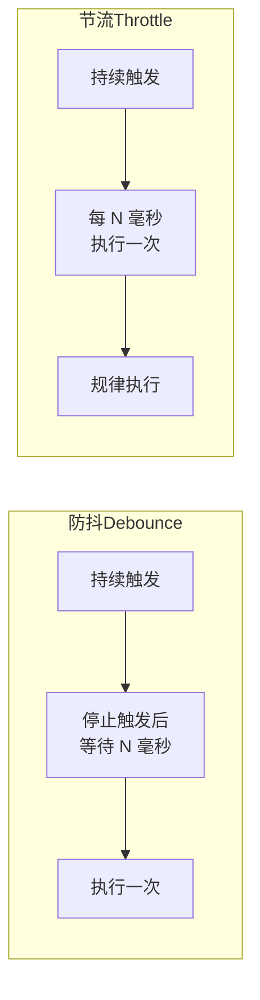
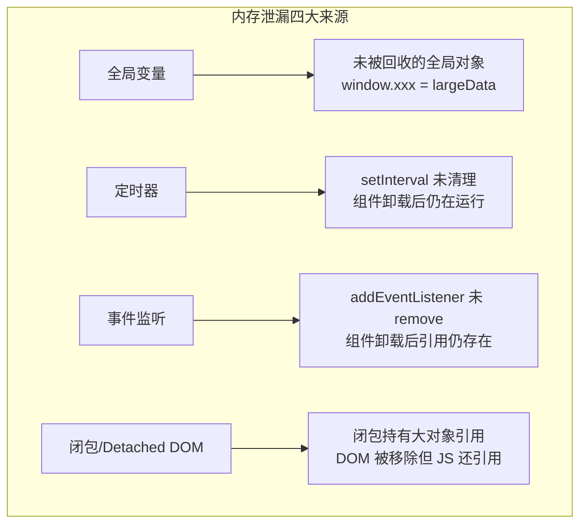
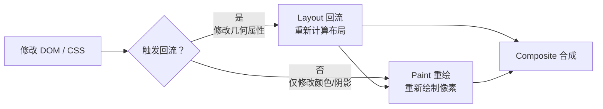

# 运行时优化

## ⭐ 面试重点速览

| 知识模块 | 重点内容 | 面试频率 |
|----------|----------|----------|
| 虚拟列表 | 固定高度/动态高度实现原理、DOM 回收、startIndex/endIndex 计算 | 极高 |
| 防抖节流 | 原理区别、手写实现（含立即执行版）、应用场景选择 | 极高 |
| 事件委托 | 事件冒泡机制、减少内存占用、动态元素绑定 | 高 |
| 内存泄漏 | 四类常见场景：全局变量/定时器/闭包/事件监听 + Detached DOM | 高 |
| DOM 操作优化 | DocumentFragment、批量更新、requestAnimationFrame、强制同步布局 | 中高 |

---

## 模块概述

运行时优化是面试中**手写代码频率最高**的模块。面试官不仅会问原理，更会要求你**当场写出防抖、节流、虚拟列表的核心实现**。本章从原理到实现，帮你建立完整的运行时优化知识体系。

::: danger 面试提醒
防抖和节流的手写实现是前端面试中**最常考的手写代码题**之一，仅次于 Promise 相关手写。虚拟列表的原理和实现是高级岗位面试中区分候选人的关键题目。
:::

---

## 一、虚拟列表（⭐ 极高）

### 为什么需要虚拟列表？

当列表数据量达到数千甚至数万条时，如果直接渲染所有 DOM 节点：

- **DOM 节点过多**：10000 条数据 = 10000+ 个 DOM 节点，占用大量内存（每个节点约 0.5~1KB）
- **渲染卡顿**：初始渲染和滚动时，浏览器需要处理大量回流和重绘
- **交互延迟**：主线程被大量 DOM 操作占用，用户交互无法及时响应

虚拟列表的**核心思想**：只渲染当前可视区域内的 DOM 节点，滚动时动态替换。

```mermaid
graph TB
    subgraph 虚拟列表原理
        A[总数据量: 10000 条] --> B[可视区域: 约 10 条]
        B --> C[实际渲染: 10~15 个 DOM 节点]
        C --> D[滚动时动态替换节点]
    end

    subgraph 关键计算
        E[scrollTop] --> F["startIndex = floor(scrollTop / itemHeight)"]
        G[containerHeight] --> H["visibleCount = ceil(containerHeight / itemHeight)"]
        F --> I["endIndex = startIndex + visibleCount + buffer"]
        I --> J[只渲染 items[startIndex...endIndex]]
    end
```

### 固定高度虚拟列表 —— 完整实现

```javascript
/**
 * 固定高度虚拟列表 —— 完整实现
 * 核心思路：
 * 1. 根据 scrollTop 计算可视区域的起始和结束索引
 * 2. 只渲染可视区域内的 DOM 节点
 * 3. 使用一个占位元素（phantom）撑开滚动条，高度 = 总数据量 * 每项高度
 * 4. 通过 transform: translateY 将可视节点定位到正确位置
 */
class FixedHeightVirtualList {
  constructor(container, options) {
    this.container = container;
    this.itemHeight = options.itemHeight;       // 每项固定高度
    this.bufferCount = options.bufferCount || 5; // 缓冲区数量（上下各多渲染几个）
    this.renderItem = options.renderItem;        // 渲染单个项目的函数

    // 创建 DOM 结构
    this.phantom = document.createElement('div');    // 占位元素，撑开滚动条
    this.phantom.className = 'virtual-list-phantom';

    this.content = document.createElement('div');    // 可视内容容器
    this.content.className = 'virtual-list-content';

    this.container.appendChild(this.phantom);
    this.container.appendChild(this.content);

    this.items = [];
    this.visibleNodes = []; // 当前可见的 DOM 节点池

    this.handleScroll = this.handleScroll.bind(this);
    this.container.addEventListener('scroll', this.handleScroll);
  }

  /** 设置数据并渲染 */
  setItems(items) {
    this.items = items;
    // 设置占位元素高度，撑开滚动条
    this.phantom.style.height = `${items.length * this.itemHeight}px`;
    this.render();
  }

  /** 处理滚动事件 */
  handleScroll() {
    requestAnimationFrame(() => this.render());
  }

  /** 核心渲染逻辑 */
  render() {
    const scrollTop = this.container.scrollTop;
    const containerHeight = this.container.clientHeight;

    // 计算可视区域索引范围
    const startIndex = Math.max(0, Math.floor(scrollTop / this.itemHeight) - this.bufferCount);
    const visibleCount = Math.ceil(containerHeight / this.itemHeight);
    const endIndex = Math.min(
      this.items.length,
      startIndex + visibleCount + this.bufferCount * 2
    );

    // 将可视内容容器定位到起始位置
    this.content.style.transform = `translateY(${startIndex * this.itemHeight}px)`;

    // 渲染可视区域内的节点
    this.content.innerHTML = '';
    for (let i = startIndex; i < endIndex; i++) {
      const itemElement = this.renderItem(this.items[i], i);
      // 设置每项的高度
      itemElement.style.height = `${this.itemHeight}px`;
      this.content.appendChild(itemElement);
    }
  }

  /** 销毁，清理事件监听 */
  destroy() {
    this.container.removeEventListener('scroll', this.handleScroll);
    this.container.innerHTML = '';
  }
}

// 使用示例
const container = document.getElementById('list-container');
const virtualList = new FixedHeightVirtualList(container, {
  itemHeight: 50,
  bufferCount: 5,
  renderItem: (item, index) => {
    const div = document.createElement('div');
    div.className = 'list-item';
    div.textContent = `#${index} - ${item.name}`;
    return div;
  },
});

// 加载数据
const data = Array.from({ length: 100000 }, (_, i) => ({ name: `Item ${i}` }));
virtualList.setItems(data);
```

### 动态高度虚拟列表

动态高度虚拟列表比固定高度复杂得多，因为**无法直接通过 `scrollTop / itemHeight` 计算起始索引**。

核心思路：使用**预估高度 + 缓存实际高度**的方式，通过**二分查找**定位起始索引。

```javascript
/**
 * 动态高度虚拟列表 —— 核心实现
 * 关键挑战：每项高度不固定，无法直接计算 startIndex
 * 解决方案：维护一个位置缓存（positions），通过二分查找定位
 */
class DynamicHeightVirtualList {
  constructor(container, options) {
    this.container = container;
    this.estimatedItemHeight = options.estimatedItemHeight || 80; // 预估高度
    this.bufferCount = options.bufferCount || 5;
    this.renderItem = options.renderItem;

    this.phantom = document.createElement('div');
    this.phantom.className = 'virtual-list-phantom';
    this.content = document.createElement('div');
    this.content.className = 'virtual-list-content';
    this.container.appendChild(this.phantom);
    this.container.appendChild(this.content);

    this.items = [];
    /** 位置缓存数组，记录每项的高度和偏移量 */
    this.positions = [];
    /** 存储已渲染 DOM 的实际高度，用于后续计算 */
    this.heightCache = new Map();

    this.handleScroll = this.handleScroll.bind(this);
    this.container.addEventListener('scroll', this.handleScroll);
  }

  /** 初始化位置缓存 */
  initPositions() {
    this.positions = this.items.map((_, index) => ({
      index,
      top: index * this.estimatedItemHeight,      // 预估顶部偏移
      bottom: (index + 1) * this.estimatedItemHeight, // 预估底部偏移
      height: this.estimatedItemHeight,             // 预估高度
    }));
  }

  /** 更新某个项目的实际高度（渲染后回调） */
  updateItemHeight(index, actualHeight) {
    const position = this.positions[index];
    if (!position) return;

    const diff = actualHeight - position.height;
    if (diff === 0) return;

    // 更新当前项的高度
    position.height = actualHeight;
    position.bottom = position.top + actualHeight;

    // 更新后续所有项的位置偏移
    for (let i = index + 1; i < this.positions.length; i++) {
      this.positions[i].top += diff;
      this.positions[i].bottom += diff;
    }
  }

  /** 二分查找：根据 scrollTop 找到起始索引 */
  findStartIndex(scrollTop) {
    let left = 0;
    let right = this.positions.length - 1;

    while (left <= right) {
      const mid = Math.floor((left + right) / 2);
      const pos = this.positions[mid];

      if (pos.bottom < scrollTop) {
        left = mid + 1;
      } else if (pos.top > scrollTop) {
        right = mid - 1;
      } else {
        // scrollTop 在当前项的范围内
        return mid;
      }
    }
    return Math.max(0, left);
  }

  setItems(items) {
    this.items = items;
    this.initPositions();
    this.render();
  }

  handleScroll() {
    requestAnimationFrame(() => this.render());
  }

  render() {
    const scrollTop = this.container.scrollTop;
    const containerHeight = this.container.clientHeight;

    // 二分查找起始索引
    const startIndex = Math.max(0, this.findStartIndex(scrollTop) - this.bufferCount);

    // 顺序查找结束索引
    let endIndex = startIndex;
    let currentTop = this.positions[startIndex]?.top || 0;
    while (endIndex < this.items.length && currentTop < scrollTop + containerHeight) {
      currentTop += this.positions[endIndex]?.height || this.estimatedItemHeight;
      endIndex++;
    }
    endIndex = Math.min(this.items.length, endIndex + this.bufferCount);

    // 更新占位元素高度
    const totalHeight = this.positions[this.positions.length - 1]?.bottom || 0;
    this.phantom.style.height = `${totalHeight}px`;

    // 定位可视内容
    this.content.style.transform = `translateY(${this.positions[startIndex]?.top || 0}px)`;

    // 渲染可视节点
    this.content.innerHTML = '';
    for (let i = startIndex; i < endIndex; i++) {
      const itemElement = this.renderItem(this.items[i], i);
      this.content.appendChild(itemElement);

      // 渲染后在下一帧更新实际高度
      requestAnimationFrame(() => {
        const actualHeight = itemElement.getBoundingClientRect().height;
        this.updateItemHeight(i, actualHeight);
      });
    }
  }

  destroy() {
    this.container.removeEventListener('scroll', this.handleScroll);
    this.container.innerHTML = '';
  }
}
```

::: tip 虚拟列表面试要点
面试官考察虚拟列表时，通常会追问：
1. **固定高度和动态高度的核心区别是什么？** —— 固定高度可以直接计算 startIndex，动态高度需要维护位置缓存 + 二分查找
2. **为什么需要缓冲区（buffer）？** —— 防止快速滚动时出现白屏，让用户感觉流畅
3. **如何处理图片加载导致的动态高度变化？** —— 图片加载完成后更新实际高度，重新计算偏移量
4. **虚拟列表的 DOM 回收是怎么回事？** —— 滚动时，离开可视区域的 DOM 节点被移除，新进入可视区域的节点被创建，始终保持 DOM 节点数量恒定
:::

---

## 二、防抖（Debounce）与节流（Throttle）（⭐ 极高）

### 原理对比



| 维度 | 防抖（Debounce） | 节流（Throttle） |
|------|-----------------|-----------------|
| 核心行为 | 持续触发时**只执行最后一次** | 持续触发时**每 N 毫秒执行一次** |
| 适用场景 | 搜索输入框、窗口 resize、表单验证 | 滚动事件、鼠标移动、动画帧 |
| 比喻 | 电梯关门——有人进出就重新计时 | 红绿灯——固定频率放行 |
| 返回结果 | 最后一次调用的结果 | 每次间隔执行的中间结果 |

### 防抖（Debounce）—— 完整实现

```javascript
/**
 * 基础版防抖
 * 原理：每次触发时清除上一个定时器，重新计时
 * 场景：搜索框输入、窗口 resize 结束
 */
function debounce(fn, delay = 300) {
  let timer = null;

  return function (...args) {
    // 清除上一次的定时器
    if (timer) clearTimeout(timer);

    // 重新设置定时器
    timer = setTimeout(() => {
      fn.apply(this, args);
      timer = null;
    }, delay);
  };
}

// 使用示例
const searchInput = document.getElementById('search');
searchInput.addEventListener('input', debounce(function (e) {
  console.log('搜索:', e.target.value);
  // 发送 API 请求
}, 500));
```

```javascript
/**
 * 立即执行版防抖（高频面试题）
 * 原理：第一次触发时立即执行，之后在冷却期内不再执行
 * 场景：按钮点击防重复提交（第一次点击立即生效）
 */
function debounceImmediate(fn, delay = 300) {
  let timer = null;

  return function (...args) {
    // 如果定时器存在，说明还在冷却期内，清除并重新计时
    if (timer) clearTimeout(timer);

    const callNow = !timer; // 是否可以立即执行（timer 为 null 表示冷却期已过）

    // 设置冷却期
    timer = setTimeout(() => {
      timer = null;
    }, delay);

    // 立即执行
    if (callNow) {
      fn.apply(this, args);
    }
  };
}

// 使用示例：防止按钮重复提交
const submitBtn = document.getElementById('submit');
submitBtn.addEventListener('click', debounceImmediate(function () {
  console.log('提交表单');
  // 3 秒内重复点击不会触发多次
}, 3000));
```

```javascript
/**
 * 完整版防抖 —— 支持立即执行 + 取消功能（面试推荐版本）
 * 同时支持两种模式，通过 immediate 参数控制
 */
function debounceFull(fn, delay = 300, immediate = false) {
  let timer = null;
  let result; // 保存返回值（仅立即执行模式有意义）

  const debounced = function (...args) {
    if (timer) clearTimeout(timer);

    if (immediate) {
      // 立即执行模式
      const callNow = !timer;
      timer = setTimeout(() => {
        timer = null;
      }, delay);
      if (callNow) {
        result = fn.apply(this, args);
      }
    } else {
      // 延迟执行模式
      timer = setTimeout(() => {
        fn.apply(this, args);
        timer = null;
      }, delay);
    }

    return result;
  };

  // 取消功能：清除定时器，取消待执行的函数
  debounced.cancel = function () {
    if (timer) {
      clearTimeout(timer);
      timer = null;
    }
  };

  // 立即执行功能：清除定时器并立即执行
  debounced.flush = function (...args) {
    if (timer) {
      clearTimeout(timer);
      timer = null;
      return fn.apply(this, args);
    }
  };

  return debounced;
}
```

### 节流（Throttle）—— 完整实现

```javascript
/**
 * 时间戳版节流
 * 原理：记录上一次执行时间，当前时间 - 上次时间 >= delay 时执行
 * 特点：第一次触发立即执行，最后一次不执行
 */
function throttleTimestamp(fn, delay = 300) {
  let lastTime = 0;

  return function (...args) {
    const now = Date.now();

    if (now - lastTime >= delay) {
      fn.apply(this, args);
      lastTime = now;
    }
  };
}
```

```javascript
/**
 * 定时器版节流
 * 原理：设置定时器，定时器存在时跳过，定时器触发后清除
 * 特点：第一次触发延迟执行，最后一次会执行
 */
function throttleTimer(fn, delay = 300) {
  let timer = null;

  return function (...args) {
    if (timer) return; // 定时器还在，跳过

    timer = setTimeout(() => {
      fn.apply(this, args);
      timer = null;
    }, delay);
  };
}
```

```javascript
/**
 * 完整版节流 —— 结合时间戳和定时器（面试推荐版本）
 * 特点：第一次触发立即执行，最后一次也会执行
 * 原理：使用时间戳控制首次执行，使用定时器保证最后一次执行
 */
function throttleFull(fn, delay = 300) {
  let lastTime = 0;
  let timer = null;

  const throttled = function (...args) {
    const now = Date.now();
    const remaining = delay - (now - lastTime);

    // 剩余时间 <= 0，说明可以执行
    if (remaining <= 0) {
      // 清除可能存在的定时器
      if (timer) {
        clearTimeout(timer);
        timer = null;
      }
      fn.apply(this, args);
      lastTime = now;
    } else if (!timer) {
      // 剩余时间 > 0 且没有定时器，设置定时器保证最后一次执行
      timer = setTimeout(() => {
        fn.apply(this, args);
        lastTime = Date.now();
        timer = null;
      }, remaining);
    }
  };

  // 取消功能
  throttled.cancel = function () {
    if (timer) {
      clearTimeout(timer);
      timer = null;
    }
    lastTime = 0;
  };

  return throttled;
}
```

### 防抖节流应用场景对比

```javascript
// 场景 1：搜索框输入建议 —— 用防抖
// 用户输入 "hello"，只发一次请求而不是 5 次
searchInput.addEventListener('input', debounce(async (e) => {
  const suggestions = await fetchSuggestions(e.target.value);
  renderSuggestions(suggestions);
}, 300));

// 场景 2：页面滚动加载更多 —— 用节流
// 滚动过程中每 200ms 检查一次，而不是每次 scroll 事件都检查
window.addEventListener('scroll', throttle(() => {
  if (isNearBottom()) {
    loadMoreData();
  }
}, 200));

// 场景 3：窗口 resize 重新计算布局 —— 用防抖
// 用户拖拽窗口边缘时，等停下来再重新计算
window.addEventListener('resize', debounce(() => {
  recalculateLayout();
}, 200));

// 场景 4：鼠标移动跟踪 —— 用节流（或用 requestAnimationFrame）
// 每次移动都触发性能开销大，每 50ms 更新一次即可
document.addEventListener('mousemove', throttle((e) => {
  updateTooltipPosition(e.clientX, e.clientY);
}, 50));
```

---

## 三、事件委托

### 原理

事件委托利用**事件冒泡**机制，将子元素的事件监听器统一绑定到父元素上，通过 `event.target` 判断实际触发事件的元素。

```javascript
// ❌ 为每个列表项绑定事件 —— 内存占用大，动态元素需要重复绑定
document.querySelectorAll('.list-item').forEach(item => {
  item.addEventListener('click', handleClick);
});

// ✅ 事件委托 —— 只需一个事件监听器
document.getElementById('list-container').addEventListener('click', (e) => {
  // 通过 event.target 判断实际点击的元素
  const item = e.target.closest('.list-item');
  if (item) {
    const id = item.dataset.id;
    handleItemClick(id);
  }
});
```

### 事件委托的优势

| 优势 | 说明 |
|------|------|
| 减少内存占用 | N 个子元素只需要 1 个事件监听器，而非 N 个 |
| 动态元素支持 | 新增的子元素自动继承事件处理（无需手动绑定） |
| 代码简洁 | 集中管理事件处理逻辑，易于维护 |

```javascript
/**
 * 事件委托的完整封装
 * 支持多种事件类型和动态元素匹配
 */
class EventDelegate {
  constructor(container) {
    this.container = container;
    this.handlers = new Map();
  }

  /**
   * 注册委托事件
   * @param {string} eventType - 事件类型
   * @param {string} selector - CSS 选择器，匹配目标子元素
   * @param {Function} handler - 事件处理函数
   */
  on(eventType, selector, handler) {
    // 将选择器与处理函数关联
    if (!this.handlers.has(eventType)) {
      this.handlers.set(eventType, new Map());
      // 只为每种事件类型绑定一次监听器
      this.container.addEventListener(eventType, this._handleEvent);
    }
    this.handlers.get(eventType).set(selector, handler);
  }

  /** 实际的事件处理函数 */
  _handleEvent = (e) => {
    const eventHandlers = this.handlers.get(e.type);
    if (!eventHandlers) return;

    // 遍历所有选择器，找到匹配的
    eventHandlers.forEach((handler, selector) => {
      const target = e.target.closest(selector);
      if (target && this.container.contains(target)) {
        handler.call(target, e, target);
      }
    });
  };

  /** 移除委托事件 */
  off(eventType, selector) {
    const eventHandlers = this.handlers.get(eventType);
    if (eventHandlers) {
      eventHandlers.delete(selector);
      if (eventHandlers.size === 0) {
        this.container.removeEventListener(eventType, this._handleEvent);
        this.handlers.delete(eventType);
      }
    }
  }
}

// 使用示例
const delegate = new EventDelegate(document.getElementById('app'));
delegate.on('click', '.btn-delete', (e, el) => {
  console.log('删除:', el.dataset.id);
});
delegate.on('click', '.btn-edit', (e, el) => {
  console.log('编辑:', el.dataset.id);
});
```

::: warning 事件委托的注意事项
- **不适用于不冒泡的事件**：`focus`、`blur`、`scroll`、`mouseenter`、`mouseleave` 等事件不冒泡，无法使用事件委托（但 `focusin`/`focusout` 可以冒泡）
- **`event.stopPropagation()` 会阻断委托**：如果子元素内部调用了 `stopPropagation()`，事件将无法冒泡到父元素
- **`e.target` vs `e.currentTarget`**：`e.target` 是实际触发事件的元素，`e.currentTarget` 是绑定监听器的元素（委托中的父元素）
- **性能权衡**：委托事件中每次都要执行选择器匹配，如果匹配逻辑很复杂，可能不如直接绑定
:::

---

## 四、内存泄漏

### 常见内存泄漏场景



#### 场景一：全局变量

```javascript
// ❌ 造成内存泄漏
function createLeak() {
  // 意外创建全局变量（this 指向 window）
  this.largeData = new Array(10000000).fill('leak');
}

// ❌ 全局缓存无限增长
window.cache = {};
function addToCache(key, value) {
  window.cache[key] = value; // 永远不会被清理
}

// ✅ 正确做法：使用 WeakMap 或限制缓存大小
const cache = new WeakMap(); // 键为对象时自动回收
// 或使用 LRU 缓存
```

#### 场景二：定时器未清理

```javascript
// ❌ React 组件示例 —— 内存泄漏
function TimerComponent() {
  const [count, setCount] = useState(0);

  useEffect(() => {
    // 定时器启动
    const timer = setInterval(() => {
      setCount(c => c + 1);
    }, 1000);

    // ⚠️ 忘记清理！组件卸载后定时器仍在运行
    // 组件卸载后 setCount 仍被调用，React 会警告
  }, []);

  return <div>{count}</div>;
}

// ✅ 正确做法：清理定时器
function TimerComponentFixed() {
  const [count, setCount] = useState(0);

  useEffect(() => {
    const timer = setInterval(() => {
      setCount(c => c + 1);
    }, 1000);

    // 清理函数：组件卸载时自动调用
    return () => clearInterval(timer);
  }, []);

  return <div>{count}</div>;
}
```

#### 场景三：事件监听未清理

```javascript
// ❌ 事件监听器泄漏
function Component() {
  useEffect(() => {
    const handler = () => {
      console.log('resize');
    };
    window.addEventListener('resize', handler);
    // 忘记 removeEventListener，组件卸载后 handler 仍然存在
  }, []);

  return <div>Content</div>;
}

// ✅ 正确做法
function ComponentFixed() {
  useEffect(() => {
    const handler = () => {
      console.log('resize');
    };
    window.addEventListener('resize', handler);

    return () => {
      window.removeEventListener('resize', handler);
    };
  }, []);

  return <div>Content</div>;
}
```

#### 场景四：Detached DOM（游离 DOM）

```javascript
// ❌ Detached DOM 泄漏
let detachedElement;

function createDetachedDOM() {
  const div = document.createElement('div');
  div.textContent = 'Hello';

  // 持有 DOM 引用，但 DOM 不在文档中
  detachedElement = div; // 即使 div 不再需要，也无法被 GC 回收

  // 更严重的情况：DOM 被移除，但 JS 仍然引用
  const element = document.getElementById('my-element');
  element.parentNode.removeChild(element); // 从 DOM 树移除
  // 但 element 变量仍持有引用 → Detached DOM 泄漏
}

// ✅ 正确做法：使用后释放引用
function processElement() {
  const element = document.getElementById('my-element');
  const data = extractData(element);
  element.parentNode.removeChild(element);
  // 不需要显式置 null，因为 element 是局部变量，函数结束后自动释放
  return data;
}
```

### 内存泄漏排查工具

| 工具 | 用途 |
|------|------|
| Chrome DevTools Memory 面板 | 堆快照对比（Heap Snapshot）、时间轴分配检测 |
| Performance 面板 + Memory 勾选 | 观察 JS Heap 是否持续增长（锯齿状上升 = 内存泄漏） |
| Performance Monitor | 实时监控 JS Heap Size、DOM Nodes 数量 |
| `window.performance.memory` | 程序中获取内存使用量（仅 Chrome 非标准 API） |

---

## 五、DOM 操作优化

### 回流（Reflow）与重绘（Repaint）



**触发回流的操作**（需要避免频繁执行）：
- 修改元素的几何属性（width/height/padding/margin/border/top/left 等）
- 读取 `offsetTop/offsetLeft/offsetWidth/offsetHeight`
- 读取 `scrollTop/scrollLeft/scrollWidth/scrollHeight`
- 读取 `clientTop/clientLeft/clientWidth/clientHeight`
- 调用 `getComputedStyle()`、`getBoundingClientRect()`
- 修改 DOM 树结构（添加/删除元素）
- 修改字体大小

### 批量 DOM 更新

```javascript
// ❌ 逐个修改 DOM —— 每次修改都可能触发回流
function updateListBad(items) {
  const list = document.getElementById('list');
  items.forEach(item => {
    const li = document.createElement('li');
    li.textContent = item.name;
    list.appendChild(li); // 每次 append 都可能触发回流
  });
}

// ✅ 使用 DocumentFragment 批量更新
function updateListGood(items) {
  const list = document.getElementById('list');
  const fragment = document.createDocumentFragment(); // 内存中的临时容器

  items.forEach(item => {
    const li = document.createElement('li');
    li.textContent = item.name;
    fragment.appendChild(li); // 在内存中操作，不触发回流
  });

  list.appendChild(fragment); // 一次性插入，只触发一次回流
}
```

```javascript
// ✅ 使用 display: none 批量更新（现代框架已内置优化）
function batchUpdate(element) {
  element.style.display = 'none'; // 从渲染树移除

  // 执行大量 DOM 操作
  element.style.width = '100px';
  element.style.height = '200px';
  element.style.padding = '10px';
  element.textContent = 'Updated content';

  element.style.display = 'block'; // 恢复，只触发一次回流
}
```

### 避免强制同步布局（Forced Synchronous Layout）

```javascript
// ❌ 强制同步布局 —— 读写交替
function badLayout() {
  elements.forEach(el => {
    const height = el.offsetHeight; // 读（触发 Layout 计算）
    el.style.height = height + 10 + 'px'; // 写
    // 下一轮循环中读 offsetHeight 时，浏览器必须同步计算 Layout
  });
}

// ✅ 先批量读，再批量写
function goodLayout() {
  // 阶段一：批量读取
  const heights = elements.map(el => el.offsetHeight);

  // 阶段二：批量写入
  elements.forEach((el, i) => {
    el.style.height = heights[i] + 10 + 'px';
  });
}
```

### requestAnimationFrame 优化动画

```javascript
// ❌ 使用 setInterval 做动画 —— 帧率不稳定
function badAnimation() {
  let position = 0;
  setInterval(() => {
    position += 5;
    element.style.transform = `translateX(${position}px)`;
  }, 16); // 16ms 约 60fps，但不精确
}

// ✅ 使用 requestAnimationFrame
function goodAnimation() {
  let position = 0;
  function animate() {
    position += 5;
    element.style.transform = `translateX(${position}px)`;
    if (position < 500) {
      requestAnimationFrame(animate); // 浏览器自动匹配刷新率
    }
  }
  requestAnimationFrame(animate);
}
```

::: tip requestAnimationFrame 的优势
1. **帧率自适应**：自动匹配显示器刷新率（60Hz → 60fps，120Hz → 120fps）
2. **后台标签页暂停**：页面不可见时自动暂停，节省 CPU 和电量
3. **与浏览器渲染同步**：在每一帧开始前执行，避免掉帧
4. **批量处理**：多个 RAF 回调会在同一帧中合并处理
:::

---

## 面试追问环节

**Q：手写一个防抖函数，并说明和节流的区别？**

回答要点：
1. 防抖：持续触发时只执行最后一次，用于搜索输入、resize 等场景
2. 节流：持续触发时每 N 毫秒执行一次，用于滚动加载、mousemove 等场景
3. 防抖的"立即执行版"：第一次触发时立即执行，适用于按钮防重复提交
4. 面试中要能写出完整实现（包括 `this` 指向、参数传递、取消功能）

**Q：虚拟列表的原理是什么？动态高度如何实现？**

回答要点：
1. 核心思想：只渲染可视区域内的 DOM 节点，用占位元素撑开滚动条
2. 固定高度：`startIndex = floor(scrollTop / itemHeight)`，直接计算
3. 动态高度：维护位置缓存数组，通过二分查找定位起始索引，渲染后更新实际高度
4. DOM 回收：滚动时移除离开可视区域的节点，创建新进入的节点，保持 DOM 数量恒定
5. 缓冲区：上下各多渲染几个节点，防止快速滚动时出现白屏

**Q：如何排查内存泄漏？**

回答要点：
1. 使用 Chrome DevTools Performance 面板录制，观察 JS Heap 是否持续增长（锯齿状上升 = 内存泄漏）
2. 使用 Memory 面板的 Heap Snapshot，对比两个时间点的快照，找出增长的对象
3. 常见泄漏源：全局变量、未清理的定时器、未移除的事件监听器、Detached DOM、闭包持有大对象引用
4. 框架中特别注意：组件卸载时清理副作用（useEffect 的 cleanup 函数、onUnmounted 生命周期）

**Q：为什么 `requestAnimationFrame` 比 `setInterval` 更适合做动画？**

回答要点：
1. RAF 与浏览器渲染同步，在每一帧开始前执行，避免掉帧和画面撕裂
2. RAF 自动匹配显示器刷新率，高刷屏可以获得更流畅的体验
3. 后台标签页自动暂停，节省资源
4. `setInterval` 的延迟不精确，累积误差会导致动画越来越快或越来越慢
5. RAF 在页面不可见时自动暂停，而 `setInterval` 即使不准确也会继续运行