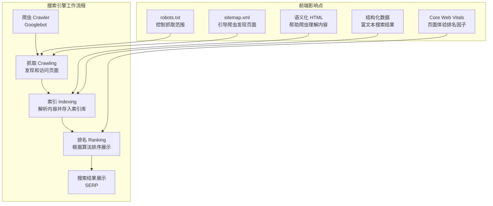
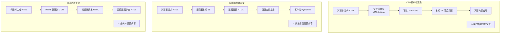
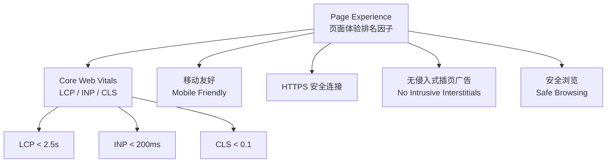

# SEO 优化

## ⭐ 面试重点速览

| 知识模块 | 重点内容 | 面试频率 |
|----------|----------|----------|
| SEO 基础 | TDK（title/description/keywords）、语义化 HTML、结构化数据（JSON-LD/Schema.org） | 高 |
| SSR/SSG | 服务端渲染/静态生成对 SEO 的优势、搜索引擎爬虫无法执行 JS 的问题 | 极高 |
| 搜索引擎抓取原理 | 爬虫→索引→排名三阶段、robots.txt、sitemap.xml | 高 |
| Core Web Vitals | Page Experience 排名因子、LCP/INP/CLS 对 SEO 的影响 | 极高 |
| 面试必问 | CSR 对 SEO 有什么影响？如何解决？SPA 的 SEO 方案对比 | 极高 |

---

## 模块概述

前端 SEO（Search Engine Optimization）是前端工程师容易被忽视但至关重要的技能域。在 SPA（单页应用）盛行的时代，CSR（客户端渲染）带来的 SEO 问题成为前端架构选型时的核心考量因素之一。

::: danger 为什么前端工程师需要懂 SEO？
1. **架构决策**：SSR/SSG/CSR 的选择直接影响 SEO 表现，需要前端工程师在项目初期做出正确决策
2. **性能即 SEO**：Core Web Vitals 是 Google 排名因子，性能优化 = SEO 优化
3. **面试高频**：大厂面试中，"CSR 对 SEO 有什么影响？如何解决？" 是经典问题
4. **全栈能力**：SEO 优化涉及前端、后端、运维的协作，是展示全栈思维的绝佳话题
:::

---

## 搜索引擎抓取原理



### 三阶段详解

| 阶段 | 说明 | 前端优化点 |
|------|------|------------|
| **抓取（Crawling）** | Googlebot 通过网络发现和访问页面 | robots.txt、sitemap.xml、内链结构、避免 `noindex` |
| **索引（Indexing）** | 解析页面内容，提取关键信息存入索引库 | 语义化 HTML、TDK 标签、结构化数据、确保内容可被解析 |
| **排名（Ranking）** | 根据 200+ 因子对页面进行排序 | 内容质量、外链、Core Web Vitals、移动友好、HTTPS |

::: warning 关键认知：爬虫无法执行 JavaScript（或能力有限）
Googlebot 虽然支持渲染 JS，但存在以下限制：
- **渲染延迟**：JS 渲染需要额外的计算资源，Google 会延迟渲染（可能几天甚至几周）
- **不保证渲染**：复杂 SPA 可能渲染失败或超时
- **其他搜索引擎**：Bing、百度、Yandex 等对 JS 渲染的支持更差
- **结论**：依赖 CSR 的内容，搜索引擎**可能看不到**你的内容
:::

---

## 一、SEO 基础：TDK + 语义化 HTML + 结构化数据

### TDK（Title / Description / Keywords）

```html
<head>
  <!-- ⭐ Title：最重要的 SEO 标签，搜索结果的主标题 -->
  <title>前端性能优化完全指南 —— Core Web Vitals 深度解析 | 技术博客</title>

  <!-- ⭐ Description：搜索结果摘要，影响点击率 -->
  <meta name="description"
        content="系统学习前端性能优化，涵盖 Core Web Vitals（LCP/INP/CLS）、加载优化、运行时优化、SEO 优化等核心知识体系。面向高级前端工程师面试准备。">

  <!-- Keywords：现代搜索引擎已不再作为排名因子，但仍建议填写 -->
  <meta name="keywords"
        content="前端性能优化, Core Web Vitals, LCP, INP, CLS, 虚拟列表, 防抖节流, SEO, SSR">

  <!-- 视口配置：移动友好是 SEO 排名因子 -->
  <meta name="viewport" content="width=device-width, initial-scale=1.0">

  <!-- Canonical URL：避免重复内容惩罚 -->
  <link rel="canonical" href="https://example.com/performance/core-web-vitals">

  <!-- Open Graph（社交分享） -->
  <meta property="og:title" content="前端性能优化完全指南">
  <meta property="og:description" content="系统学习前端性能优化...">
  <meta property="og:image" content="https://example.com/og-image.png">
  <meta property="og:url" content="https://example.com/performance/core-web-vitals">
  <meta property="og:type" content="article">
</head>
```

::: tip TDK 最佳实践
- **Title**：长度控制在 50-60 字符，关键词前置，每个页面独立
- **Description**：长度控制在 150-160 字符，包含关键词，自然吸引点击
- **Keywords**：5-10 个关键短语，用逗号分隔，不要堆砌
- **Canonical**：多 URL 指向同一内容时必须设置，避免"重复内容"惩罚
:::

### 语义化 HTML

```html
<!-- ✅ 语义化 HTML —— 帮助搜索引擎理解内容结构 -->
<body>
  <header>
    <nav>
      <ul>
        <li><a href="/">首页</a></li>
        <li><a href="/blog">博客</a></li>
      </ul>
    </nav>
  </header>

  <main>
    <article> <!-- 独立文章内容 -->
      <h1>文章标题</h1> <!-- h1 每页只有一个 -->
      <section>
        <h2>章节标题</h2>
        <p>正文内容...</p>
      </section>
      <section>
        <h2>另一章节</h2>
        <p>更多内容...</p>
      </section>
    </article>

    <aside>
      <!-- 侧边栏/相关内容 -->
      <h3>相关文章</h3>
    </aside>
  </main>

  <footer>
    <p>&copy; 2024 Example.com</p>
  </footer>
</body>
```

语义化标签对 SEO 的价值：

| 标签 | 语义 | SEO 价值 |
|------|------|----------|
| `<h1>` ~ `<h6>` | 标题层级 | 搜索引擎根据标题层级理解内容结构，h1 权重最高 |
| `<article>` | 独立内容 | 标记可独立分发的内容（如博客文章） |
| `<section>` | 内容分区 | 配合标题形成内容大纲 |
| `<nav>` | 导航链接 | 帮助搜索引擎理解网站结构 |
| `<header>/<footer>` | 页首/页尾 | 区分内容与辅助信息 |
| `<main>` | 主要内容 | 直接定位页面核心内容 |
| `<time>` | 时间 | 帮助搜索引擎识别发布时间 |
| `<figure>/<figcaption>` | 图片/说明 | 关联图片和说明文字 |

### 结构化数据（JSON-LD / Schema.org）

结构化数据让搜索引擎**不仅索引内容，还理解内容的含义**，从而在搜索结果中展示**富文本结果**（Rich Results）。

```html
<!-- JSON-LD 格式的结构化数据（Google 推荐格式） -->
<script type="application/ld+json">
{
  "@context": "https://schema.org",
  "@type": "Article",
  "headline": "前端性能优化完全指南",
  "description": "系统学习前端性能优化，涵盖 Core Web Vitals、加载优化等核心知识体系。",
  "author": {
    "@type": "Person",
    "name": "张三"
  },
  "datePublished": "2024-06-01",
  "dateModified": "2024-06-15",
  "image": "https://example.com/article-image.png",
  "publisher": {
    "@type": "Organization",
    "name": "技术博客"
  },
  "mainEntityOfPage": {
    "@type": "WebPage",
    "@id": "https://example.com/performance/core-web-vitals"
  }
}
</script>
```

```html
<!-- 产品页结构化数据 -->
<script type="application/ld+json">
{
  "@context": "https://schema.org",
  "@type": "Product",
  "name": "无线蓝牙耳机",
  "description": "高品质降噪无线蓝牙耳机",
  "image": "https://example.com/product.png",
  "sku": "WH-1000XM5",
  "brand": {
    "@type": "Brand",
    "name": "Sony"
  },
  "offers": {
    "@type": "Offer",
    "price": "2999.00",
    "priceCurrency": "CNY",
    "availability": "https://schema.org/InStock"
  },
  "aggregateRating": {
    "@type": "AggregateRating",
    "ratingValue": "4.8",
    "reviewCount": "1250"
  }
}
</script>
```

::: tip 结构化数据的价值
- **富文本搜索结果**（Rich Results）：产品评分星星、价格、库存状态、面包屑导航
- **知识图谱**：帮助 Google 构建知识图谱，提升品牌曝光
- **Featured Snippet**：提高被选为"精选摘要"的概率
- 使用 [Google Rich Results Test](https://search.google.com/test/rich-results) 验证结构化数据
:::

---

## 二、SSR/SSG 对 SEO 的优势

### 渲染模式对比



### 三种渲染模式 SEO 对比

| 维度 | CSR（客户端渲染） | SSR（服务端渲染） | SSG（静态生成） |
|------|-------------------|-------------------|-----------------|
| 爬虫看到的内容 | 空壳 HTML（`<div id="root"></div>`） | 完整 HTML 内容 | 完整 HTML 内容 |
| 首屏速度 | 慢（需下载+执行 JS） | 中等（服务器渲染耗时） | 最快（CDN 静态文件） |
| SEO 友好度 | 差 | 好 | 最好 |
| 服务器成本 | 最低（CDN 静态文件） | 高（需要 Node.js 服务器） | 低（CDN 静态文件） |
| 内容实时性 | 实时 | 实时 | 构建时更新 |
| 适用场景 | 后台管理系统、内部工具 | 内容多变、个性化页面 | 博客、文档、营销页面 |
| 代表框架 | 传统 React SPA | Next.js SSR、Nuxt SSR | Next.js SSG、Gatsby、VitePress |

### CSR 的 SEO 问题及解决方案

```javascript
// 问题：CSR 应用返回的是空壳 HTML
// 爬虫看到的内容：
// <html>
//   <head><title>My App</title></head>
//   <body>
//     <div id="root"></div>  <!-- 空壳！ -->
//     <script src="/bundle.js"></script>
//   </body>
// </html>

// 解决方案一：预渲染（Prerendering）—— 适用于内容不频繁变化的页面
// 使用 prerender-spa-plugin 或 react-snap 在构建时生成静态 HTML

// 解决方案二：SSR（服务端渲染）—— Next.js/Nuxt.js
// pages/article/[id].js (Next.js SSR)
export async function getServerSideProps({ params }) {
  const article = await fetchArticle(params.id);
  return {
    props: { article }, // 服务端获取数据，渲染完整 HTML
  };
}

// 解决方案三：SSG（静态生成）—— 适用于内容不经常变化的页面
// pages/article/[id].js (Next.js SSG)
export async function getStaticProps({ params }) {
  const article = await fetchArticle(params.id);
  return {
    props: { article },
    revalidate: 3600, // ISR：1 小时后重新生成
  };
}

export async function getStaticPaths() {
  const articles = await fetchAllArticles();
  return {
    paths: articles.map(a => ({ params: { id: a.id } })),
    fallback: 'blocking', // 未预生成的路径使用 SSR
  };
}

// 解决方案四：动态渲染（Dynamic Rendering）—— 对爬虫返回预渲染版本
// 服务器检测 User-Agent，对爬虫返回预渲染的静态 HTML
// 对普通用户返回 CSR 的 SPA
// 注意：Google 不推荐此方案，可能被视为 Cloaking（伪装）
```

::: danger 面试必问：CSR 对 SEO 有什么影响？如何解决？

**影响**：
1. 爬虫看到的是空壳 HTML（`<div id="root"></div>`），无法获取页面内容
2. Google 虽然支持 JS 渲染，但有延迟（可能几天），且不保证渲染成功
3. 其他搜索引擎（Bing、百度）对 JS 渲染支持很差
4. 影响 LCP 等 Core Web Vitals 指标，间接影响 SEO 排名

**解决方案**（按推荐程度排序）：
1. **SSG / ISR**（Next.js、Nuxt、VitePress）：构建时生成静态 HTML，SEO 最佳
2. **SSR**（Next.js、Nuxt）：服务端渲染，每次请求返回完整 HTML
3. **预渲染**（prerender-spa-plugin）：对特定路由预渲染
4. **动态渲染**：对爬虫返回预渲染版本（不推荐，可能被 Google 惩罚）

**关键原则**：确保搜索引擎爬虫能在**不执行 JavaScript**的情况下获取到完整的页面内容。
:::

---

## 三、sitemap.xml 与 robots.txt

### sitemap.xml

```xml
<?xml version="1.0" encoding="UTF-8"?>
<urlset xmlns="http://www.sitemaps.org/schemas/sitemap/0.9">
  <!-- 首页 -->
  <url>
    <loc>https://example.com/</loc>
    <lastmod>2024-06-15</lastmod>
    <changefreq>daily</changefreq>
    <priority>1.0</priority>
  </url>

  <!-- 博客文章 -->
  <url>
    <loc>https://example.com/blog/core-web-vitals</loc>
    <lastmod>2024-06-10</lastmod>
    <changefreq>weekly</changefreq>
    <priority>0.8</priority>
  </url>

  <!-- 产品页面 -->
  <url>
    <loc>https://example.com/products/wireless-earbuds</loc>
    <lastmod>2024-06-01</lastmod>
    <changefreq>monthly</changefreq>
    <priority>0.7</priority>
  </url>
</urlset>
```

::: tip Sitemap 关键点
- 提交到 Google Search Console 和 Bing Webmaster Tools
- 单个 sitemap 不超过 50,000 个 URL 或 50MB
- 可以创建 sitemap 索引文件（sitemap index）管理多个 sitemap
- 动态网站应自动生成 sitemap（如 Next.js 的 `getServerSideSitemap`）
- 在 robots.txt 中声明 sitemap 位置：`Sitemap: https://example.com/sitemap.xml`
:::

### robots.txt

```txt
# robots.txt —— 告诉爬虫哪些页面可以抓取，哪些不可以
User-agent: *                    # 适用于所有爬虫
Allow: /                         # 允许抓取所有页面
Disallow: /api/                  # 禁止抓取 API 路由
Disallow: /admin/                # 禁止抓取管理后台
Disallow: /private/              # 禁止抓取私有页面
Disallow: /*.json$               # 禁止抓取 JSON 文件
Disallow: /*?*                   # 禁止抓取带查询参数的 URL（避免重复内容）

# 指定 Googlebot 的爬取延迟（可选）
User-agent: Googlebot
Crawl-delay: 1

# 声明 Sitemap 位置
Sitemap: https://example.com/sitemap.xml
```

::: warning 注意
- robots.txt 是**协议**不是**安全机制**，恶意爬虫可以忽略它
- 敏感内容不要依赖 robots.txt 来保护，应使用认证机制
- 可以在页面中使用 `<meta name="robots" content="noindex, nofollow">` 禁止索引
:::

---

## 四、Core Web Vitals 对 SEO 排名的影响

### Page Experience 排名因子

Google 的页面体验（Page Experience）排名因子包含：



### 性能与 SEO 的关联

| 性能指标 | SEO 影响 | 说明 |
|----------|----------|------|
| LCP | 直接影响排名 | 加载慢 → 用户跳出率高 → 排名下降 |
| CLS | 直接影响排名 | 布局跳动 → 用户体验差 → 排名下降 |
| INP | 直接影响排名 | 交互响应慢 → 用户放弃 → 排名下降 |
| 移动友好 | 直接影响排名 | Mobile-First Indexing，移动端体验优先 |
| HTTPS | 直接影响排名 | 非 HTTPS 网站会被标记为"不安全" |

::: tip 性能与 SEO 的协同优化
1. **LCP 优化 → SEO 提升**：图片优化、CDN、SSR 不仅提升 LCP，也直接提升 SEO
2. **CLS 优化 → SEO 提升**：预留空间、字体优化同时提升用户体验和搜索排名
3. **移动端优化 → SEO 提升**：响应式设计、移动端性能优化直接受益于 Mobile-First Indexing
4. **核心原则**：提升 Core Web Vitals 的每一项优化，同时也是 SEO 优化
:::

---

## 五、前端 SEO 检查清单

```markdown
## 技术 SEO 检查清单

### 基础配置
- [ ] 每个页面有独立的、描述性的 `<title>`
- [ ] 每个页面有 `<meta name="description">`
- [ ] 设置了 `<meta name="viewport">`（移动友好）
- [ ] 设置了 `<link rel="canonical">`（避免重复内容）
- [ ] 网站使用 HTTPS

### 内容结构
- [ ] 使用语义化 HTML 标签（article/section/nav/header/footer）
- [ ] 标题层级合理（h1 → h2 → h3，不跳级）
- [ ] 图片有 alt 属性（描述性文字）
- [ ] 链接使用描述性文字（避免"点击这里"）

### 结构化数据
- [ ] 文章页面使用 Article Schema
- [ ] 产品页面使用 Product Schema
- [ ] 使用 JSON-LD 格式（Google 推荐）
- [ ] 通过 Rich Results Test 验证

### 爬虫抓取
- [ ] robots.txt 配置正确
- [ ] sitemap.xml 包含所有重要页面
- [ ] 提交 sitemap 到 Google Search Console
- [ ] 重要页面不被 noindex 标记

### 性能
- [ ] Core Web Vitals 全部达到 "Good"
- [ ] 移动端性能良好（Mobile-Friendly Test）
- [ ] 图片使用现代格式（WebP/AVIF）并压缩
- [ ] 启用资源压缩（gzip/Brotli）

### 渲染
- [ ] 关键内容在服务端渲染（SSR/SSG）
- [ ] 爬虫能获取到完整页面内容（不依赖 JS）
- [ ] 使用 `<a>` 标签而非 JS 事件处理导航
```

---

## 面试追问环节

**Q：CSR 对 SEO 有什么影响？如何解决？**

**核心影响**：搜索引擎爬虫抓取到的 CSR 页面是空壳 HTML（`<div id="root"></div>`），无法获取页面实际内容。虽然 Google 支持 JS 渲染，但存在延迟（可能几天）且不保证渲染成功；其他搜索引擎（Bing、百度）对 JS 渲染支持更差。

**解决方案（按推荐程度排序）**：
1. **SSG / ISR**：构建时生成静态 HTML，SEO 最佳，性能最优。适用于内容不经常变化的页面（博客、文档、营销页）。Next.js `getStaticProps` + `revalidate`（ISR）可以兼顾静态和动态。
2. **SSR**：服务端渲染，每次请求返回完整 HTML。适用于内容多变、个性化页面。Next.js `getServerSideProps`、Nuxt SSR。
3. **预渲染**：对特定路由使用 prerender-spa-plugin 或 react-snap 预渲染。适用于内容不频繁变化的 SPA。
4. **动态渲染**：对爬虫返回预渲染版本，对普通用户返回 CSR。**不推荐**，因为可能被 Google 视为 Cloaking（伪装）。

**关键原则**：确保搜索引擎爬虫能在**不执行 JavaScript**的情况下获取到完整页面内容。

**Q：SSR 和 SSG 如何选择？**

| 场景 | 推荐方案 | 原因 |
|------|----------|------|
| 博客、文档站 | SSG | 内容变化不频繁，构建时生成即可 |
| 电商商品页 | SSG + ISR | 商品信息不常变，但需要定期更新 |
| 新闻/资讯 | SSR | 内容需要实时更新 |
| 用户仪表盘 | CSR | 无需 SEO，重视交互体验 |
| 社交媒体动态 | SSR | 个性化内容，需要实时渲染 |
| 营销落地页 | SSG | 追求极致加载速度和 SEO |

**Q：结构化数据（Schema.org）为什么重要？**

结构化数据让搜索引擎从"理解关键字"升级为"理解实体和关系"。有了结构化数据，你的页面可以在搜索结果中展示：
- 评分星星（AggregateRating）
- 面包屑导航（BreadcrumbList）
- 产品价格和库存（Product + Offer）
- 常见问题（FAQ）
- 文章发布时间和作者（Article）

这些富文本结果能显著提升**点击率（CTR）**。即使排名不变，更高的 CTR 也意味着更多流量。

**Q：Core Web Vitals 对 SEO 排名的影响有多大？**

Google 明确将 Core Web Vitals 作为 Page Experience 排名因子。但需要理性看待：

1. **内容质量 > 页面体验**：即使 CWV 满分，内容质量差也不会排名靠前。反之，内容极好的页面即使 CWV 稍差，也可能排名靠前。
2. **CWV 是"锦上添花"**：在内容质量相近的页面之间，CWV 好的页面会获得排名优势。
3. **移动端影响更大**：Mobile-First Indexing 下，移动端的 CWV 表现对排名影响更大。
4. **不是一票否决**：CWV 不达标不会导致页面被降权，但排名潜力会受限制。

**结论**：如果你的网站内容质量已经很好，优化 CWV 可以带来显著的排名提升；但如果内容本身质量很差，CWV 优化无法挽救排名。