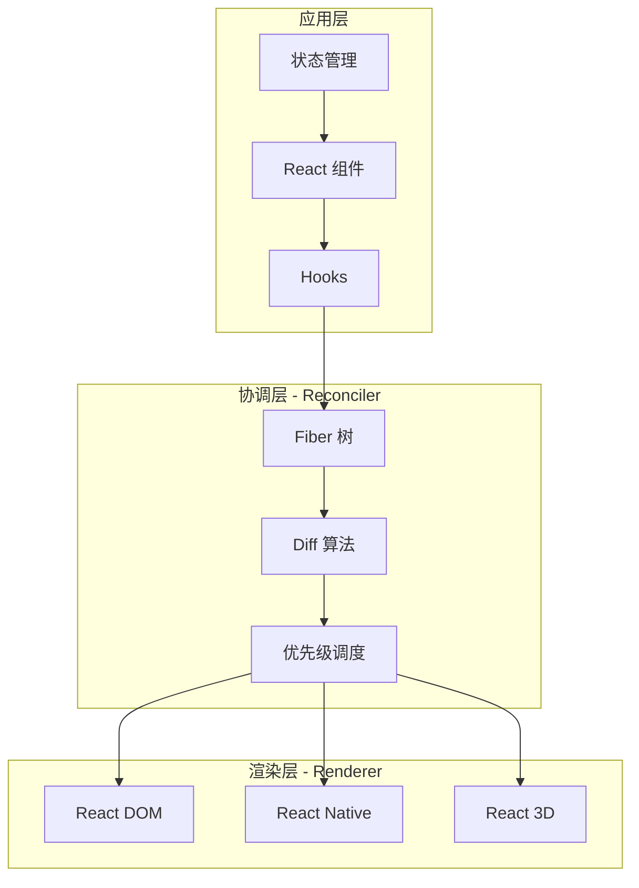

# React 生态概览

## ⭐ 面试重点速览

| 知识模块 | 重点内容 | 面试频率 |
|----------|----------|----------|
| Hooks 核心 | useState/useEffect/useMemo/useCallback/useRef/自定义 Hooks | 极高 |
| 并发渲染 | Fiber 架构、时间分片、useTransition、Suspense | 极高 |
| React 19 新特性 | Actions API、RSC、React Compiler、useOptimistic | 极高 |
| 状态管理 | Context/Redux/Zustand/Jotai 选型与原理 | 高 |
| Next.js | App Router、RSC、SSG/SSR/ISR 渲染策略 | 高 |

---

## React 概述

React 是由 Meta（原 Facebook）开源的用于构建用户界面的 JavaScript 库。其核心设计理念包括：

- **声明式（Declarative）**：描述 UI 应该是什么样子，而非如何操作 DOM
- **组件化（Component-Based）**：将 UI 拆分为独立、可复用的组件
- **跨平台（Learn Once, Write Anywhere）**：React DOM / React Native / React 3D

从 2013 年开源至今，React 经历了从 Class 组件到函数组件 + Hooks 的范式转变，再到如今并发渲染和 Server Components 的架构升级，始终引领前端框架的发展方向。

---

## React 版本演进

| 版本 | 发布时间 | 核心变化 | 影响力 |
|------|----------|----------|--------|
| v0.3 | 2013.05 | 首次开源 | 开创声明式 UI |
| v15 | 2016.04 | 稳定版本，生命周期的完善 | 中 |
| **v16.0** | 2017.09 | **Fiber 架构**发布，支持异步渲染 | 高 |
| **v16.8** | 2019.02 | **Hooks** 正式发布，函数组件成为主流 | 极高 |
| v17 | 2020.10 | 无新特性，渐进式升级方案 | 低 |
| **v18** | 2022.03 | **并发特性**（Concurrent Features） | 极高 |
| **v19** | 2024.12 | **Actions API、RSC 稳定、React Compiler** | 极高 |

::: tip 关键转折点
React 的三大范式转变：
1. **v16.8 Hooks** —— 从 Class 组件转向函数组件，解决了逻辑复用和生命周期碎片化问题
2. **v18 并发渲染** —— 从同步渲染转向可中断的并发渲染，解决了大量更新的阻塞问题
3. **v19 Server Components** —— 从纯客户端渲染转向服务端 + 客户端混合架构，解决了首屏性能和 bundle 体积问题
:::

---

## React vs Vue 设计哲学对比

| 维度 | React | Vue |
|------|-------|-----|
| 设计理念 | 函数式编程，UI = f(state) | 渐进式框架，模板 + 响应式 |
| 组件写法 | JSX（JavaScript 表达式能力） | SFC（模板 + script setup） |
| 响应式 | 不可变数据 + 手动 setState | Proxy 代理 + 自动追踪依赖 |
| 状态管理 | 依赖第三方（Redux/Zustand） | 官方 Pinia，开箱即用 |
| 路由 | React Router（第三方） | Vue Router（官方） |
| 编译优化 | React Compiler（React Forget） | 模板编译时优化（静态提升） |
| 学习曲线 | 陡峭（JSX+Hooks 心智模型） | 平缓（模板语法接近 HTML） |
| 生态特点 | 庞大分散，选择多、决策成本高 | 官方套件齐全，统一度高 |
| 适用场景 | 大型复杂应用、跨平台需求 | 中小型项目快速开发、渐进式迁移 |

::: warning 面试陷阱
面试中不要简单地回答"React 比 Vue 好"或反之。正确思路是：**根据场景分析**——React 适合大型项目、团队能力强、需要 React Native 跨平台；Vue 适合快速迭代、中小型项目、团队上手快的场景。框架没有绝对的好坏，只有适合与否。
:::

---

## 各子模块简介

| 子模块 | 定位 | 核心内容 |
|--------|------|----------|
| [Hooks 核心](./hooks.md) | React 开发基石 | useState/useEffect/useMemo/useCallback/自定义 Hooks 设计模式 |
| [并发渲染](./concurrent-rendering.md) | 性能优化核心 | Fiber 架构、时间分片、useTransition/useDeferredValue、Suspense |
| [React 19 新特性](./react-19-features.md) | 最新架构演进 | Actions API、Server Components、React Compiler、useOptimistic |
| [状态管理](./state-management.md) | 数据流方案 | Context/Redux Toolkit/Zustand/Jotai 选型与原理 |
| [Next.js App Router](./nextjs.md) | 全栈框架 | RSC、SSG/SSR/ISR、Server Actions、Turbopack |

---

## React 核心架构图



```
+--------------------------------------------------------+
|                      应用层                             |
|  React 组件  <-->  Hooks  <-->  状态管理                |
+------------------------|-------------------------------+
                         | 触发更新
                         v
+--------------------------------------------------------+
|                    协调层 (Reconciler)                   |
|                                                        |
|  Fiber 树  -->  Diff 算法  -->  优先级调度 (Lane)       |
|   (可中断)      (标记更新)       (时间分片)              |
+------------------------|-------------------------------+
                         | 提交变更
                         v
+--------------------------------------------------------+
|                    渲染层 (Renderer)                    |
|                                                        |
|  React DOM  |  React Native  |  React 3D  |  ...       |
+--------------------------------------------------------+
```

---

## ⭐ 面试高频问题汇总

### Q1：React 的核心设计思想是什么？

React 的核心可以用一个公式概括：**UI = f(state)**。界面是对状态的映射，状态变化 → 界面自动更新。React 通过以下机制实现这一思想：

1. **声明式编程**：开发者只需描述"UI 在不同状态下应该是什么样"，React 负责算出最小 DOM 操作
2. **组件化**：将 UI 拆分为独立、可组合的组件，每个组件管理自己的状态
3. **单向数据流**：数据从父组件流向子组件，通过 props 传递，状态变更可预测
4. **虚拟 DOM + Diff**：在内存中维护一个轻量 UI 表示，通过 Diff 算法计算出最小变更，批量更新真实 DOM

### Q2：React 18 的并发模式（Concurrent Mode）解决了什么问题？

传统 React 的渲染是**同步且不可中断的**——一旦开始渲染，必须完成整个组件树，期间浏览器无法响应用户输入。并发模式允许 React 在渲染过程中**暂停、放弃或恢复**渲染任务，从而：

- 保持应用对用户输入的响应（如输入框不卡顿）
- 低优先级更新（如数据展示）可以让位于高优先级更新（如用户交互）
- 通过 Suspense 实现数据获取和代码分割的统一加载状态管理

### Q3：为什么 React 16 要从 Stack Reconciler 迁移到 Fiber Reconciler？

Stack Reconciler 使用递归调用栈，**无法中断**。当组件树很大时，一次 setState 可能让主线程被阻塞数百毫秒，导致页面卡顿。Fiber Reconciler 将渲染任务拆分为一个个小单元（Fiber 节点），通过链表结构使工作可以暂停和恢复，从根本上解决了长任务阻塞主线程的问题。

---

## 面试追问环节

**Q：React 的 JSX 和模板语法（如 Vue template）的本质区别是什么？**

JSX 本质上是 `React.createElement()` 的语法糖，完全运行在 JavaScript 运行时中，具备完整的图灵完备能力（条件、循环、变量等）。Vue 的模板语法是编译时 DSL，在编译阶段被转换为渲染函数，编译器可以做更多静态优化（如静态提升、补丁标记）。

**Q：React 和 Vue 3 的响应式有什么区别？**

React 采用**不可变数据 + 显式更新**模式：通过 `setState` / `useState` 的 setter 通知 React 状态变化，React 通过 Object.is 比较新旧值。Vue 3 采用 **Proxy 代理 + 自动追踪**模式：修改对象的属性会被 Proxy 拦截，自动触发依赖更新。这意味着 React 需要手动保证不可变性（如 `[...arr, newItem]`），而 Vue 可以直接 `arr.push(newItem)`。

**Q：React 的 Hooks 不能放在条件语句中，为什么？**

React 依赖 Hooks 的**调用顺序**来维护状态与 Hooks 之间的映射关系。每次渲染时，React 按照 Hooks 被调用的顺序，通过链表形式依次取出对应的状态。如果 Hooks 被放在条件语句中，调用顺序可能在不同渲染之间发生变化，导致状态错乱。

```jsx
// ❌ 错误 —— Hooks 调用顺序不稳定
function BadComponent({ flag }) {
  if (flag) {
    const [a, setA] = useState(0); // 第二次渲染时如果 flag=false，这个 Hook 不会被调用
  }
  const [b, setB] = useState(0); // b 会错误地拿到 a 的状态
}

// ✅ 正确 —— Hooks 总是在顶层无条件调用
function GoodComponent({ flag }) {
  const [a, setA] = useState(0); // 始终在位置 0
  const [b, setB] = useState(0); // 始终在位置 1
}
```