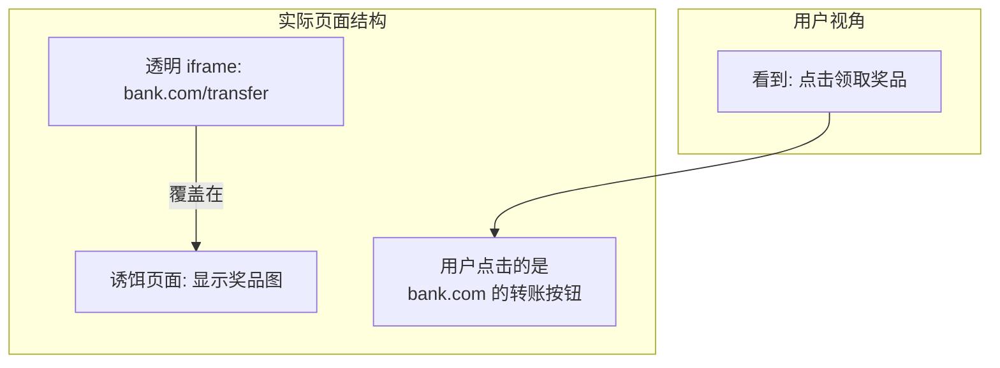
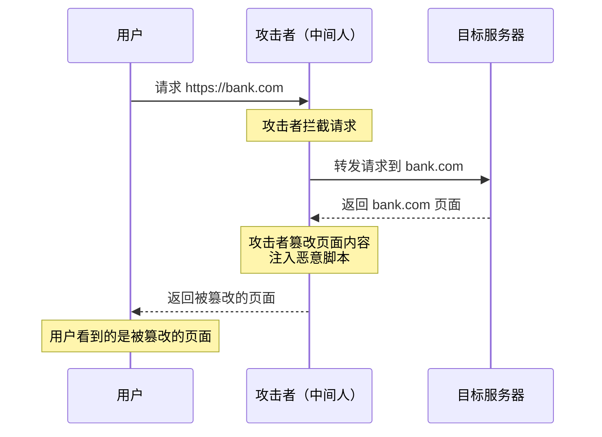

# 其他常见攻击与防御

## 面试重点速览

| 面试高频考点 | 重要程度 | 考察方向 |
| --- | --- | --- |
| 点击劫持防御 | :star::star::star::star: | X-Frame-Options + frame-ancestors + framebusting |
| iframe sandbox 属性 | :star::star::star::star: | allow-scripts/allow-same-origin/allow-forms 等 |
| 中间人攻击与 HTTPS | :star::star::star::star: | TLS 握手 + HSTS + 证书固定 |
| 敏感信息泄露防护 | :star::star::star: | 前端代码审查 + 环境变量 + 敏感信息扫描 |
| SQL 注入的前端防护 | :star::star::star: | 输入格式校验 + 参数化查询（服务端配合） |
| postMessage 安全 | :star::star::star: | 验证 origin + 结构化数据校验 |

---

## 一、点击劫持（Clickjacking）

### 1.1 攻击原理

点击劫持（Clickjacking），又称 UI 覆盖攻击（UI Redress Attack），攻击者通过透明 iframe 将目标网站覆盖在诱饵页面上，诱导用户点击看似无害的按钮，实际点击的是被覆盖的目标网站按钮。



### 1.2 攻击示例

```html
<!-- 攻击者网站 evil.com -->
<!DOCTYPE html>
<html>
<head>
  <style>
    /* 诱饵页面的样式 */
    #decoy {
      position: relative;
      width: 300px;
      height: 200px;
      background: linear-gradient(135deg, #667eea, #764ba2);
      display: flex;
      align-items: center;
      justify-content: center;
      color: white;
      font-size: 24px;
      cursor: pointer;
    }

    /* 将目标网站 iframe 设为透明，覆盖在诱饵按钮上 */
    #target-frame {
      position: absolute;
      top: 0;
      left: 0;
      width: 300px;
      height: 200px;
      opacity: 0;  /* 完全透明！ */
      z-index: 10;
    }
  </style>
</head>
<body>
  <div id="decoy">
    点击领取 iPhone 15 Pro Max
    <!-- 透明的 iframe 覆盖在上面 -->
    <iframe id="target-frame"
            src="https://bank.com/transfer?to=hacker&amount=10000&confirm=yes">
    </iframe>
  </div>
  <!-- 用户看到的是"点击领取奖品"，实际点击的是转账确认按钮 -->
</body>
</html>
```

### 1.3 防御方案

#### 方案一：X-Frame-Options（旧标准）

```nginx
# 禁止任何页面以 iframe 嵌入本页面
add_header X-Frame-Options "DENY";

# 仅允许同源页面以 iframe 嵌入
add_header X-Frame-Options "SAMEORIGIN";

# 允许指定域名嵌入（仅部分浏览器支持）
add_header X-Frame-Options "ALLOW-FROM https://trusted.example.com";
```

| 值 | 含义 | 适用场景 |
| --- | --- | --- |
| `DENY` | 完全禁止被嵌入 | 高安全需求页面 |
| `SAMEORIGIN` | 仅同源可嵌入 | 大多数页面 |
| `ALLOW-FROM uri` | 仅指定域名可嵌入 | 有第三方嵌入需求 |

#### 方案二：CSP frame-ancestors（推荐）

```nginx
# CSP frame-ancestors 比 X-Frame-Options 更灵活
# 禁止所有嵌入
add_header Content-Security-Policy "frame-ancestors 'none';";

# 仅同源可嵌入
add_header Content-Security-Policy "frame-ancestors 'self';";

# 指定多个域名
add_header Content-Security-Policy "frame-ancestors 'self' https://trusted.example.com;";
```

::: tip frame-ancestors vs X-Frame-Options
- `frame-ancestors` 支持多个域名，`X-Frame-Options` 的 `ALLOW-FROM` 仅支持一个
- `frame-ancestors` 是 CSP 标准，`X-Frame-Options` 是旧标准
- 建议两者都配置，确保兼容性
- 两者同时存在时，浏览器以 `frame-ancestors` 为准
:::

#### 方案三：Frame Busting（辅助手段）

```javascript
/**
 * 传统 Frame Busting 脚本 —— 检测是否被嵌入 iframe
 * 注意：现代浏览器中此方法可能被 sandbox 属性禁用
 */
if (window.top !== window.self) {
  // 当前页面被嵌入 iframe 中
  window.top.location = window.self.location;
}

// 更健壮的版本
<style id="anti-clickjack">
  body { display: none !important; }
</style>
<script>
  if (window.self === window.top) {
    // 不是 iframe，正常显示
    const antiClickjack = document.getElementById('anti-clickjack');
    antiClickjack.parentNode.removeChild(antiClickjack);
  } else {
    // 是 iframe，跳转到顶层
    window.top.location = window.self.location;
  }
</script>
```

::: warning Frame Busting 的局限性
攻击者可以通过 iframe 的 `sandbox="allow-forms"` 属性（不包含 `allow-top-navigation`）来阻止 frame busting 的跳转。因此不能作为唯一的防御手段。
:::

---

## 二、iframe 安全

### 2.1 sandbox 属性详解

`sandbox` 属性为 iframe 中的内容施加额外的安全限制：

```html
<!-- 最严格模式：禁止所有能力 -->
<iframe src="untrusted.html" sandbox></iframe>

<!-- 精确控制允许的能力 -->
<iframe src="widget.html"
  sandbox="allow-scripts allow-same-origin allow-forms allow-popups">
</iframe>
```

| sandbox 值 | 允许的能力 | 安全风险 |
| --- | --- | --- |
| （空值） | 禁止所有 | :green_circle: 最安全 |
| `allow-scripts` | 允许执行 JavaScript | :yellow_circle: 中 |
| `allow-same-origin` | 允许同源访问（Cookie、localStorage） | :red_circle: 高 |
| `allow-forms` | 允许表单提交 | :yellow_circle: 中 |
| `allow-popups` | 允许 `window.open()` | :yellow_circle: 中 |
| `allow-top-navigation` | 允许修改顶层窗口 URL | :red_circle: 高 |
| `allow-modals` | 允许 `alert()`/`confirm()` | :green_circle: 低 |
| `allow-downloads` | 允许下载文件 | :yellow_circle: 中 |

::: danger allow-scripts + allow-same-origin 的危险组合
同时设置 `allow-scripts` 和 `allow-same-origin` 时，iframe 中的脚本可以访问父页面的同源数据（Cookie、localStorage 等），实际上等同于没有 sandbox 保护。如果必须同时使用，应确保 iframe 内容完全可信。
:::

### 2.2 postMessage 安全

```javascript
// 父页面发送消息
const iframe = document.getElementById('child-frame');
iframe.contentWindow.postMessage(
  { type: 'auth', token: 'secret-token' },
  'https://trusted.example.com'  // 指定目标 origin，不要使用 '*'
);

// iframe 接收消息 —— 必须验证消息来源
window.addEventListener('message', (event) => {
  // 严格验证 origin
  const allowedOrigins = ['https://parent.example.com'];

  if (!allowedOrigins.includes(event.origin)) {
    console.warn('拒绝来自未授权来源的消息:', event.origin);
    return;
  }

  // 验证数据结构
  if (typeof event.data !== 'object' || event.data === null) {
    return;
  }

  // 处理消息
  switch (event.data.type) {
    case 'auth':
      handleAuth(event.data);
      break;
    default:
      console.warn('未知消息类型:', event.data.type);
  }
});
```

::: danger postMessage 常见错误
1. **使用 `'*'` 作为 targetOrigin**：任何页面都可以接收消息
2. **不验证 `event.origin`**：可能收到恶意页面发送的消息
3. **不验证 `event.data` 结构**：可能导致原型链污染或类型混淆
4. **在消息中传递敏感数据**：消息可能被中间人窃听
:::

---

## 三、中间人攻击（MITM）

### 3.1 攻击原理



### 3.2 防御方案

#### HTTPS（基础防御）

```nginx
# Nginx 强制 HTTPS
server {
    listen 80;
    server_name example.com;
    return 301 https://$server_name$request_uri;
}

server {
    listen 443 ssl http2;
    server_name example.com;

    ssl_certificate     /path/to/cert.pem;
    ssl_certificate_key /path/to/key.pem;

    # 仅使用安全协议
    ssl_protocols TLSv1.2 TLSv1.3;

    # 仅使用安全密码套件
    ssl_ciphers ECDHE-ECDSA-AES128-GCM-SHA256:ECDHE-RSA-AES128-GCM-SHA256;
    ssl_prefer_server_ciphers on;
}
```

#### HSTS（HTTP Strict Transport Security）

```nginx
# 通知浏览器：未来一年内（31536000 秒）只通过 HTTPS 访问
add_header Strict-Transport-Security "max-age=31536000; includeSubDomains; preload";
```

| HSTS 参数 | 含义 |
| --- | --- |
| `max-age=31536000` | 强制 HTTPS 的有效期（秒），建议至少 1 年 |
| `includeSubDomains` | 子域名也强制 HTTPS |
| `preload` | 允许加入浏览器 HSTS 预加载列表 |

::: tip HSTS 的作用
1. **自动升级 HTTP → HTTPS**：用户输入 `http://` 浏览器自动转为 `https://`
2. **阻止证书错误绕过**：用户无法手动跳过 SSL 证书错误警告
3. **防止 SSL 剥离攻击**：攻击者无法将 HTTPS 降级为 HTTP
:::

#### SRI（子资源完整性）

```html
<!-- 为 CDN 资源添加 integrity 属性 -->
<script src="https://cdn.example.com/library.js"
  integrity="sha384-oqVuAfXRKap7fdgcCY5uykM6+R9GqQ8K/uxy9rx7HNQlGYl1kPzQho1wx4JwY8wC"
  crossorigin="anonymous">
</script>

<link rel="stylesheet"
  href="https://cdn.example.com/styles.css"
  integrity="sha384-abc123..."
  crossorigin="anonymous">
```

```bash
# 生成 SRI hash
openssl dgst -sha384 -binary library.js | openssl base64 -A
# 输出: oqVuAfXRKap7fdgcCY5uykM6+R9GqQ8K/uxy9rx7HNQlGYl1kPzQho1wx4JwY8wC

# 或使用 shasum
cat library.js | openssl dgst -sha384 -binary | base64

# 在 CSP 中也可以通过 require-sri-for 强制 SRI
# Content-Security-Policy: require-sri-for script style;
```

---

## 四、敏感信息泄露

### 4.1 前端代码中的敏感信息

```javascript
// 危险：硬编码敏感信息
const API_KEY = 'sk-abc123xyz456';  // 不要这样做！
const DATABASE_PASSWORD = 'p@ssw0rd';
const SECRET_TOKEN = 'eyJhbGciOi...';

// 正确做法：使用环境变量
const API_KEY = import.meta.env.VITE_API_KEY;  // Vite
const API_KEY = process.env.REACT_APP_API_KEY;  // Create React App
const API_KEY = process.env.NEXT_PUBLIC_API_KEY;  // Next.js
```

### 4.2 常见泄露途径

| 泄露途径 | 风险 | 防护措施 |
| --- | --- | --- |
| 硬编码密钥 | 极高 | 使用环境变量 + 构建时注入 |
| Git 历史提交 | 高 | `.gitignore` + 使用 `git-secrets` |
| 错误信息暴露 | 中 | 生产环境禁用详细错误信息 |
| 调试日志 | 中 | 生产环境禁用 `console.log` 敏感数据 |
| Source Map | 高 | 生产环境不部署 Source Map |
| robots.txt 泄露路径 | 低 | 合理配置，不暴露敏感路径 |
| localStorage 敏感数据 | 高 | 敏感数据存 HttpOnly Cookie |
| 浏览器开发者工具 | 中 | 代码混淆 + 禁止生产环境调试 |

### 4.3 前端敏感信息扫描

```javascript
/**
 * 前端代码中常见的敏感信息模式
 * 可以集成到 CI/CD 流程中自动扫描
 */
const sensitivePatterns = [
  // API Key
  /(api[_-]?key|api[_-]?secret)\s*[:=]\s*['"][a-zA-Z0-9_-]{20,}['"]/gi,
  // JWT Token
  /eyJ[a-zA-Z0-9_-]{10,}\.[a-zA-Z0-9_-]{10,}\.[a-zA-Z0-9_-]{10,}/g,
  // 密码
  /(password|passwd|pwd)\s*[:=]\s*['"][^'"]+['"]/gi,
  // 私钥
  /-----BEGIN (RSA |EC )?PRIVATE KEY-----/g,
  // 数据库连接字符串
  /(mysql|postgres|mongodb):\/\/[^'"\s]+/gi,
];
```

### 4.4 robots.txt 安全

```text
# robots.txt 的正确配置
User-agent: *
# 允许搜索引擎索引的公共页面
Allow: /public/
Allow: /blog/

# 禁止搜索引擎索引的敏感路径
Disallow: /admin/
Disallow: /api/
Disallow: /internal/
Disallow: /backup/

# 注意：robots.txt 是公开的，不要在其中暴露敏感路径
# 错误示例：Disallow: /secret-admin-panel-with-default-password/
```

---

## 五、SQL 注入的前端层面防护

### 5.1 前端能做的不多，但很重要

::: warning 重要声明
SQL 注入的**核心防御在服务端**（参数化查询/预处理语句），前端只能做输入格式校验，无法替代服务端防护。
:::

```javascript
/**
 * 前端输入格式校验 —— 减少攻击面，但不替代服务端防护
 */
function validateInput(input, fieldType) {
  // 白名单验证
  const validators = {
    // 数字类型
    numeric: (val) => /^\d+$/.test(val),

    // 用户名：字母、数字、下划线
    username: (val) => /^[a-zA-Z0-9_]{3,20}$/.test(val),

    // 邮箱
    email: (val) => /^[a-zA-Z0-9._%+-]+@[a-zA-Z0-9.-]+\.[a-zA-Z]{2,}$/.test(val),

    // 搜索关键词：过滤 SQL 特殊字符
    search: (val) => {
      // 检查是否包含 SQL 关键词
      const sqlKeywords = /\b(SELECT|INSERT|UPDATE|DELETE|DROP|UNION|ALTER|CREATE|EXEC|TRUNCATE)\b/i;
      return !sqlKeywords.test(val);
    },

    // 严格模式：仅允许字母数字和中文
    safe: (val) => /^[\u4e00-\u9fa5a-zA-Z0-9\s.,!?-]+$/.test(val),
  };

  const validator = validators[fieldType];
  if (!validator) return false;

  // 长度限制（防止 SQL 截断攻击）
  if (input.length > 1000) return false;

  return validator(input);
}
```

### 5.2 前端校验 vs 服务端校验

| 对比维度 | 前端校验 | 服务端校验 |
| --- | --- | --- |
| **目的** | 提升用户体验 + 减少无效请求 | 安全防护 + 数据完整性 |
| **可绕过性** | 轻易绕过（修改 JS/直接发请求） | 不可绕过（攻击者无法控制服务端） |
| **安全性** | 零（不提供任何安全保障） | 100%（唯一的真实防线） |
| **必要性** | 有用（用户体验） | 必须（安全底线） |

---

## 六、面试重点

### Q1: 点击劫持如何防御？

**标准回答（三层防御）**：

1. **CSP frame-ancestors**（最推荐）：`Content-Security-Policy: frame-ancestors 'none'` 或 `'self'`
2. **X-Frame-Options**（兼容性）：`X-Frame-Options: DENY` 或 `SAMEORIGIN`
3. **Frame Busting 脚本**（辅助）：检测 `window.top !== window.self` 时跳出

### Q2: sandbox 属性的 allow-scripts 和 allow-same-origin 为什么不能同时用？

同时设置这两个属性时，iframe 中的脚本可以访问父页面的同源数据（Cookie、localStorage、SessionStorage 等），实际上等同于没有 sandbox 保护。如果必须同时使用，需确保 iframe 内容绝对可信。

### Q3: HSTS 的作用是什么？

1. **强制 HTTPS**：浏览器自动将 HTTP 请求升级为 HTTPS（307 Internal Redirect）
2. **阻止 SSL Stripping**：攻击者无法将 HTTPS 降级为 HTTP
3. **阻止证书错误绕过**：用户无法手动跳过 SSL 证书错误警告
4. **首次访问仍不安全**：HSTS 需要首次 HTTPS 访问后才会生效，可通过 `preload` 预加载列表解决

---

## 七、总结

| 攻击类型 | 核心防御 | 前端责任 |
| --- | --- | --- |
| 点击劫持 | frame-ancestors + X-Frame-Options | 响应头配置 + frame busting |
| iframe 安全 | sandbox 属性 + postMessage origin 校验 | 精确控制子页面权限 |
| 中间人攻击 | HTTPS + HSTS + SRI | 启用 HTTPS + 资源完整性校验 |
| 敏感信息泄露 | 环境变量 + 代码审查 | 不硬编码 + 构建时处理 |
| SQL 注入 | 参数化查询（服务端） | 前端输入格式校验（辅助） |

前端安全是一个系统工程，每个层面都需要关注。没有银弹，只有纵深防御。持续学习、定期审查、保持警惕是安全工程师的基本素养。