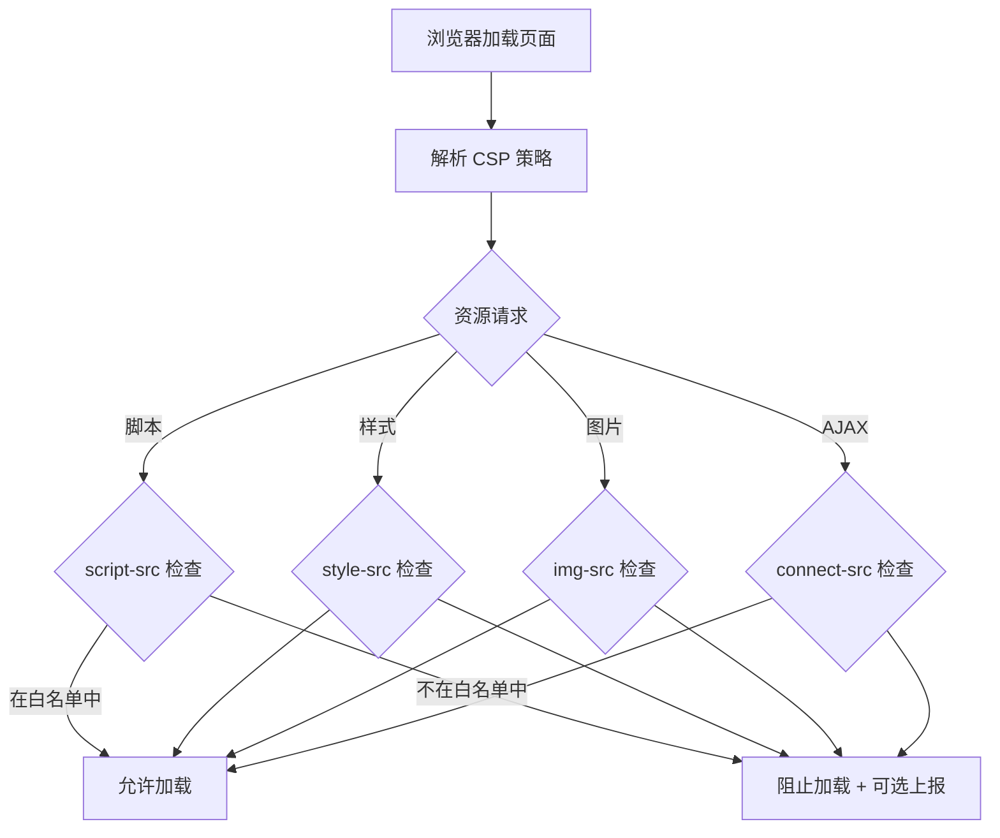

# 内容安全策略（CSP）

## 面试重点速览

| 面试高频考点 | 重要程度 | 考察方向 |
| --- | --- | --- |
| CSP 防御 XSS 的原理 | :star::star::star::star::star: | 白名单机制 + 禁止内联脚本 |
| 核心指令配置 | :star::star::star::star::star: | default-src/script-src/style-src/img-src |
| nonce 与 hash 机制 | :star::star::star::star: | 动态脚本白名单的实现方式与区别 |
| strict-dynamic 策略 | :star::star::star::star: | 信任已加载脚本创建的子脚本 |
| CSP 报告机制 | :star::star::star: | report-uri 与 report-to 的区别 |
| CSP 绕过技巧 | :star::star::star: | JSONP 劫持、DOM clobbering 等 |

---

## 一、CSP 概述

CSP（Content Security Policy，内容安全策略）是一套浏览器安全机制，通过 HTTP 响应头或 `<meta>` 标签声明允许加载的资源来源，从而防止 XSS、数据注入、点击劫持等攻击。

### 1.1 核心原理



CSP 本质上是**白名单机制**：只有明确声明的资源来源才被允许，其他全部拒绝。这与传统的黑名单方式（过滤已知恶意内容）完全不同，从根本上杜绝了未知攻击。

---

## 二、配置方式

### 2.1 HTTP 响应头（推荐）

```nginx
# Nginx 配置 —— 推荐方式
add_header Content-Security-Policy "
  default-src 'self';
  script-src 'self' 'nonce-{random}' 'strict-dynamic';
  style-src 'self' 'unsafe-inline';
  img-src 'self' data: https:;
  font-src 'self' data:;
  connect-src 'self' https://api.example.com;
  frame-src 'none';
  object-src 'none';
  base-uri 'self';
  form-action 'self';
  frame-ancestors 'none';
  upgrade-insecure-requests;
";
```

```javascript
// Node.js Express 配置
app.use((req, res, next) => {
  res.setHeader('Content-Security-Policy',
    "default-src 'self'; " +
    "script-src 'self' 'nonce-" + req.nonce + "' 'strict-dynamic'; " +
    "style-src 'self' 'unsafe-inline'; " +
    "img-src 'self' data: https:; " +
    "connect-src 'self' https://api.example.com; " +
    "frame-src 'none'; " +
    "object-src 'none';"
  );
  next();
});
```

### 2.2 Meta 标签（辅助方案）

```html
<!-- 在 HTML 中通过 meta 标签配置 -->
<meta http-equiv="Content-Security-Policy"
      content="default-src 'self'; script-src 'self'; style-src 'self'" />
```

::: warning Meta 标签的局限性
- 不支持 `frame-ancestors`、`report-uri`、`sandbox` 指令
- 不能用于 `Content-Security-Policy-Report-Only` 模式
- 仅适用于该页面，无法全局配置
- 建议始终使用 HTTP 响应头配置
:::

### 2.3 仅报告模式（Report-Only）

在正式上线 CSP 前，可以先使用 `Report-Only` 模式观察效果，避免误拦截：

```nginx
# 仅报告不拦截 —— 用于测试和调试
add_header Content-Security-Policy-Report-Only "
  default-src 'self';
  script-src 'self';
  report-uri /csp-report-endpoint;
";
```

---

## 三、核心指令详解

### 3.1 指令速查表

| 指令 | 控制内容 | 默认值 | 示例 |
| --- | --- | --- | --- |
| `default-src` | 所有资源的默认策略 | - | `default-src 'self'` |
| `script-src` | JavaScript 脚本 | `default-src` | `script-src 'self' 'nonce-abc'` |
| `style-src` | CSS 样式 | `default-src` | `style-src 'self' 'unsafe-inline'` |
| `img-src` | 图片资源 | `default-src` | `img-src 'self' data: https:` |
| `connect-src` | XHR/WebSocket/EventSource | `default-src` | `connect-src 'self' https://api.example.com` |
| `font-src` | 字体文件 | `default-src` | `font-src 'self' data:` |
| `frame-src` | iframe 内容 | `default-src` | `frame-src 'none'` |
| `frame-ancestors` | 谁可以嵌入本页面 | - | `frame-ancestors 'none'` |
| `object-src` | Flash/插件 | `default-src` | `object-src 'none'` |
| `base-uri` | `<base>` 标签 URL | - | `base-uri 'self'` |
| `form-action` | 表单提交目标 | - | `form-action 'self'` |
| `report-uri` | CSP 违规报告端点 | - | `report-uri /csp-report` |
| `report-to` | 报告组（新标准） | - | `report-to csp-endpoint` |

### 3.2 指令值说明

| 值 | 含义 | 示例 |
| --- | --- | --- |
| `'none'` | 禁止所有 | `frame-src 'none'` |
| `'self'` | 同源（协议+域名+端口一致） | `default-src 'self'` |
| `'unsafe-inline'` | 允许内联脚本/样式 | `style-src 'self' 'unsafe-inline'` |
| `'unsafe-eval'` | 允许 `eval()` 等动态执行 | 尽量避免使用 |
| `'strict-dynamic'` | 信任已加载脚本创建的子脚本 | 配合 nonce/hash 使用 |
| `'nonce-{random}'` | 随机数白名单 | `script-src 'nonce-a1b2c3d4'` |
| `'sha256-{hash}'` | 哈希值白名单 | `script-src 'sha256-abc123...'` |
| `https:` | 仅 HTTPS 来源 | `img-src https:` |
| `data:` | 允许 data URI | `img-src 'self' data:` |
| `*.example.com` | 域名通配符 | `script-src *.example.com` |

### 3.3 推荐配置示例

```nginx
# 严格 CSP 配置（最高安全级别）
add_header Content-Security-Policy "
  default-src 'none';
  script-src 'self' 'nonce-{random}' 'strict-dynamic';
  style-src 'self' 'unsafe-inline';
  img-src 'self' data: https:;
  font-src 'self';
  connect-src 'self' https://api.example.com;
  frame-src 'none';
  frame-ancestors 'none';
  object-src 'none';
  base-uri 'self';
  form-action 'self';
  upgrade-insecure-requests;
  report-uri /csp-violation-report;
";
```

---

## 四、Nonce 和 Hash 机制

### 4.1 Nonce（随机数）

每次请求生成一个唯一的随机数，脚本必须携带匹配的 nonce 属性才能执行：

```javascript
// 服务端生成 nonce
const crypto = require('crypto');
app.use((req, res, next) => {
  // 每次请求生成唯一的 nonce
  res.locals.nonce = crypto.randomBytes(16).toString('base64');
  next();
});

// 在响应头中声明 nonce
app.use((req, res, next) => {
  res.setHeader('Content-Security-Policy',
    `script-src 'self' 'nonce-${res.locals.nonce}' 'strict-dynamic'`
  );
  next();
});
```

```html
<!-- HTML 模板中使用 nonce -->
<script nonce="<%= nonce %>">
  // 这个脚本可以执行
  console.log('安全的内联脚本');
</script>

<script nonce="<%= nonce %>" src="/static/app.js"></script>
<!-- 外部脚本也支持 nonce -->

<!-- 攻击者注入的脚本没有 nonce，会被浏览器阻止 -->
<script>
  alert('xss');  // 拒绝执行！CSP 违规
</script>
```

### 4.2 Hash（哈希值）

计算脚本内容的哈希值，只有内容匹配的脚本才能执行：

```html
<!-- 声明允许的脚本哈希值 -->
<!-- Content-Security-Policy: script-src 'sha256-abc123...' -->
```

```nginx
# 在 CSP 中声明脚本的 SHA-256 哈希值
add_header Content-Security-Policy "
  script-src 'sha256-RFWPLDbv2BY+rCkDzsE+0fr8ylGr2R2faWMhq4lfEQc='
             'sha256-pcFmYa6Z5z5+P5Vq/qJBCBr5pJ5qS5J5q5J5q5J5q5J=';
";
```

```html
<!-- 只有内容完全匹配的脚本才能执行 -->
<script>
  // 这个脚本的 SHA-256 哈希值必须匹配 CSP 中声明的值
  console.log('Hello World');
</script>

<!-- 如果脚本内容被篡改，哈希值不匹配，浏览器拒绝执行 -->
<script>
  console.log('Hello World');  // 注意：末尾多了一个空格
  // 哈希值不同，被 CSP 阻止！
</script>
```

### 4.3 Nonce vs Hash 对比

| 对比维度 | Nonce | Hash |
| --- | --- | --- |
| **原理** | 每次请求生成唯一随机数 | 计算脚本内容的固定哈希值 |
| **动态性** | 每次请求不同 | 脚本内容不变则哈希不变 |
| **适用场景** | 动态生成的内联脚本 | 静态的、内容固定的内联脚本 |
| **服务端要求** | 需要服务端生成随机数 | 仅需计算哈希值 |
| **缓存友好** | 否（nonce 变化导致无法缓存） | 是（哈希值固定） |
| **维护成本** | 低（自动生成） | 中（脚本修改后需更新哈希） |
| **安全性** | 高（随机且不可预测） | 高（但需确保哈希算法安全） |

### 4.4 strict-dynamic 策略

`strict-dynamic` 允许已通过 nonce/hash 验证的脚本动态创建子脚本（如 `document.createElement('script')`）：

```nginx
# 配合 nonce 使用 strict-dynamic
add_header Content-Security-Policy "
  script-src 'nonce-{random}' 'strict-dynamic' https: http:;
  object-src 'none';
  base-uri 'none';
";
```

```javascript
// 主脚本（nonce 验证通过）
<script nonce="a1b2c3">
  // 动态创建的脚本自动获得信任
  const script = document.createElement('script');
  script.src = 'https://cdn.example.com/library.js';
  document.head.appendChild(script);  // 允许加载！
</script>
```

::: warning strict-dynamic 的注意事项
1. 启用 `strict-dynamic` 后，浏览器会忽略 `'self'`、`'unsafe-inline'` 和 URL 白名单
2. 必须配合 nonce 或 hash 使用
3. 不支持路径白名单（如 `https://cdn.example.com/specific/path/`）
4. 需要确保主脚本中不加载不受信任的第三方脚本
:::

---

## 五、报告机制

### 5.1 report-uri（旧标准）

```nginx
add_header Content-Security-Policy "
  default-src 'self';
  report-uri /csp-violation-report;
";
```

浏览器在 CSP 违规时，会向 `/csp-violation-report` 发送 JSON 报告：

```json
{
  "csp-report": {
    "document-uri": "https://example.com/page",
    "referrer": "https://evil.com/",
    "violated-directive": "script-src 'self'",
    "effective-directive": "script-src",
    "original-policy": "default-src 'self'; report-uri /csp-report;",
    "blocked-uri": "https://evil.com/malicious.js",
    "source-file": "https://example.com/page",
    "line-number": 25,
    "column-number": 10,
    "script-sample": "eval(evilCode)"
  }
}
```

### 5.2 report-to（新标准）

```nginx
# 先定义报告组
add_header Report-To '{"group":"csp-endpoint","max_age":10886400,"endpoints":[{"url":"https://example.com/csp-report"}],"include_subdomains":true}';

# 使用 report-to 引用报告组
add_header Content-Security-Policy "
  default-src 'self';
  report-to csp-endpoint;
";
```

### 5.3 服务端收集报告

```javascript
// Node.js 接收 CSP 报告
app.post('/csp-violation-report', (req, res) => {
  const report = req.body['csp-report'];

  // 记录违规信息
  console.error('CSP 违规:', {
    page: report['document-uri'],
    blocked: report['blocked-uri'],
    directive: report['violated-directive'],
    line: report['line-number'],
  });

  // 发送到监控系统
  // sendToMonitoring(report);

  res.status(204).end();
});
```

---

## 六、CSP 绕过技巧（面试加分项）

::: danger 以下内容仅供安全研究，不得用于非法攻击
:::

### 6.1 JSONP 劫持

如果 CSP 允许了某个 JSONP 端点的域名，攻击者可以利用 JSONP 回调执行代码：

```html
<!-- CSP: script-src 'self' https://api.example.com -->
<!-- 如果 api.example.com 提供 JSONP 接口 -->
<script src="https://api.example.com/jsonp?callback=alert(1)"></script>
<!-- 返回: alert(1)({...}) → 执行 alert(1) -->
```

### 6.2 路径绕过

如果 CSP 配置了 `script-src https://cdn.example.com`，攻击者可以利用该域名上的任意 JSONP 端点或上传的 JS 文件：

```html
<!-- 利用 CDN 上的 AngularJS 库执行代码 -->
<script src="https://cdn.example.com/angular.js"></script>
<div ng-app ng-csp>
  <!-- 利用 AngularJS 沙箱绕过 -->
  {{constructor.constructor('alert(1)')()}}
</div>
```

### 6.3 base-uri 劫持

如果未设置 `base-uri`，攻击者可以注入 `<base>` 标签改变相对路径的解析：

```html
<!-- CSP: script-src https://trusted-cdn.com -->
<!-- 攻击者注入 -->
<base href="https://evil.com/" />
<script src="app.js"></script>
<!-- 实际加载 https://evil.com/app.js -->
```

---

## 七、面试重点

### Q1: CSP 如何防御 XSS？

**标准回答**：

1. **禁止内联脚本**：不设置 `'unsafe-inline'`，阻止 `<script>alert(1)</script>` 这类注入
2. **禁止 `eval()`**：不设置 `'unsafe-eval'`，阻止动态代码执行
3. **白名单来源**：`script-src 'self'` 只允许同源脚本
4. **nonce/hash 机制**：为合法脚本提供唯一标识，未知脚本无法执行
5. **strict-dynamic**：减少白名单配置，降低配置错误风险

### Q2: nonce 和 hash 的区别？

| 维度 | Nonce | Hash |
| --- | --- | --- |
| 机制 | 随机数匹配 | 内容哈希匹配 |
| 动态性 | 每次请求变化 | 脚本内容不变则不变 |
| 适用 | 动态生成的内联脚本 | 静态内联脚本 |
| 缓存 | 不友好 | 友好 |

**关键点**：nonce 必须每次请求都不同（不可预测），否则攻击者可以猜测 nonce 值绕过 CSP。

### Q3: CSP 能完全防御 XSS 吗？

**不能**。CSP 是防御 XSS 的重要防线，但不是银弹：

1. **配置错误**：过于宽松的 CSP（如 `script-src *`）形同虚设
2. **JSONP 端点**：白名单中的 JSONP 端点可能被利用
3. **DOM clobbering**：CSP 不防御 DOM clobbering 攻击
4. **不防御 DOM 型 XSS 的注入点**：CSP 只防御执行阶段

---

## 八、总结

CSP 是前端安全架构中最重要的防御层之一：

1. **白名单机制**是核心思想 -- 默认拒绝，显式允许
2. **nonce + strict-dynamic** 是推荐策略 -- 兼顾安全与灵活性
3. **报告模式**先观察 -- 避免误拦截影响业务
4. **CSP 不是银弹** -- 需要与输出编码、输入验证等配合使用
5. **定期审查 CSP 策略** -- 随着业务变化调整白名单