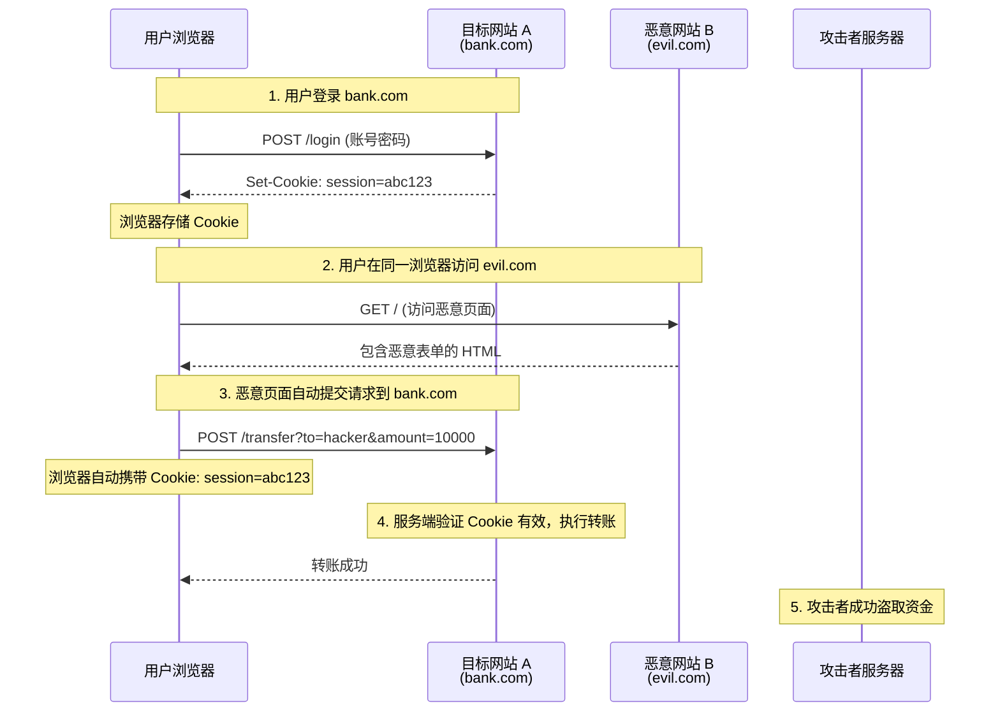
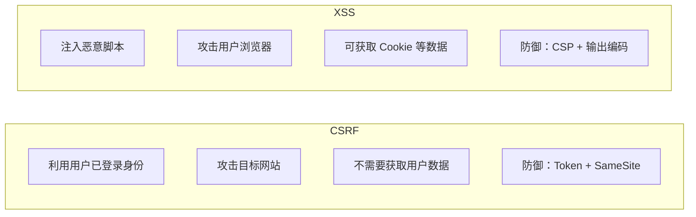

# CSRF 攻击与防御

## 面试重点速览

| 面试高频考点 | 重要程度 | 考察方向 |
| --- | --- | --- |
| CSRF 攻击原理 | :star::star::star::star::star: | 利用浏览器自动携带 Cookie 的特性 |
| CSRF Token 机制 | :star::star::star::star::star: | Token 生成、存储、校验的完整流程 |
| SameSite Cookie | :star::star::star::star::star: | Strict/Lax/None 三个值的区别与适用场景 |
| Referer/Origin 校验 | :star::star::star::star: | 请求头校验的原理与局限性 |
| CSRF 与 XSS 的区别 | :star::star::star::star: | 攻击方式、获取信息、防御重点的对比 |
| 双重 Cookie 验证 | :star::star::star: | 无状态 CSRF 防御方案 |

---

## 一、CSRF 攻击原理

CSRF（Cross-Site Request Forgery，跨站请求伪造）是指攻击者诱导用户访问第三方网站，利用用户在目标网站已登录的身份，以用户的名义发送恶意请求。

### 1.1 攻击流程图



### 1.2 攻击本质

CSRF 利用了浏览器的两个特性：

1. **Cookie 自动携带**：浏览器向某域名发送请求时，会自动附带该域名下的所有 Cookie
2. **跨域请求不限制**：浏览器允许页面发起跨域请求（表单提交、图片加载等）

### 1.3 攻击示例

```html
<!-- 恶意网站 evil.com 的页面代码 -->
<!DOCTYPE html>
<html>
<head>
  <title>恭喜中奖！</title>
</head>
<body>
  <h1>点击领取奖品</h1>

  <!-- 方式一：隐藏的自动提交表单（GET 请求） -->
  

  <!-- 方式二：自动提交的 POST 表单 -->
  <form id="csrf-form"
        action="https://bank.com/transfer"
        method="POST">
    <input type="hidden" name="to" value="hacker" />
    <input type="hidden" name="amount" value="10000" />
  </form>
  <script>
    // 页面加载后自动提交
    document.getElementById('csrf-form').submit();
  </script>

  <!-- 方式三：通过 AJAX（需 CORS 配置允许） -->
  <script>
    fetch('https://bank.com/api/transfer', {
      method: 'POST',
      credentials: 'include',  // 携带 Cookie
      headers: { 'Content-Type': 'application/json' },
      body: JSON.stringify({ to: 'hacker', amount: 10000 }),
    });
  </script>
</body>
</html>
```

---

## 二、防御方案

### 2.1 CSRF Token（最核心的防御手段）

**原理**：服务端生成一个随机 Token，同时存入 Session 和页面表单中。请求时携带 Token，服务端校验 Token 是否匹配。

```mermaid
sequenceDiagram
    participant U as 用户浏览器
    participant S as 服务端

    U->>S: GET /transfer (访问转账页面)
    Note over S: 生成随机 Token: "a1b2c3"
    Note over S: Session 中存储: csrfToken = "a1b2c3"
    S-->>U: 页面中包含隐藏字段: <br/>&lt;input name="_csrf" value="a1b2c3"&gt;

    U->>S: POST /transfer (携带 _csrf=a1b2c3 + Cookie)
    Note over S: 校验: Session.csrfToken == POST._csrf ?
    Note over S: a1b2c3 == a1b2c3 → 通过
    S-->>U: 转账成功

    Note over S: 攻击者无法获取 Token<br/>（同源策略阻止跨域读取）
```

**Token 生成与校验实现**：

```javascript
// Node.js Express 后端实现
const crypto = require('crypto');

// 1. 生成 CSRF Token
function generateCsrfToken() {
  return crypto.randomBytes(32).toString('hex');
  // 输出示例: "a1b2c3d4e5f6...（64位十六进制字符串）"
}

// 2. 中间件：渲染页面时注入 Token
app.get('/transfer', (req, res) => {
  // 生成 Token 并存入 Session
  const token = generateCsrfToken();
  req.session.csrfToken = token;

  // 渲染页面，Token 通过隐藏字段传递
  res.render('transfer', { csrfToken: token });
});

// 3. 中间件：校验 POST 请求的 Token
function csrfProtection(req, res, next) {
  // 跳过 GET/HEAD/OPTIONS 请求（幂等操作不需要 CSRF 保护）
  if (['GET', 'HEAD', 'OPTIONS'].includes(req.method)) {
    return next();
  }

  const sessionToken = req.session.csrfToken;
  // 从请求头或请求体中获取 Token
  const requestToken = req.headers['x-csrf-token'] || req.body._csrf;

  if (!sessionToken || !requestToken || sessionToken !== requestToken) {
    return res.status(403).json({ error: 'CSRF Token 校验失败' });
  }

  next();
}

app.post('/transfer', csrfProtection, (req, res) => {
  // 业务逻辑
});
```

**前端发送 Token 的方式**：

```html
<!-- 方式一：隐藏表单字段 -->
<form method="POST" action="/transfer">
  <input type="hidden" name="_csrf" value="<%= csrfToken %>" />
  <input type="text" name="to" />
  <input type="number" name="amount" />
  <button type="submit">转账</button>
</form>

<!-- 方式二：meta 标签 + AJAX 请求头 -->
<meta name="csrf-token" content="<%= csrfToken %>" />

<script>
  const csrfToken = document.querySelector('meta[name="csrf-token"]').content;

  fetch('/api/transfer', {
    method: 'POST',
    headers: {
      'Content-Type': 'application/json',
      'X-CSRF-Token': csrfToken,  // 自定义请求头携带 Token
    },
    credentials: 'include',
    body: JSON.stringify({ to: 'friend', amount: 100 }),
  });
</script>
```

::: tip 为什么 CSRF Token 能防御？
攻击者无法读取目标网站的页面内容（同源策略限制），因此无法获取 CSRF Token。即使攻击者构造了跨域请求，请求中也不会包含正确的 Token，服务端校验失败从而拒绝请求。
:::

### 2.2 SameSite Cookie

SameSite 属性控制 Cookie 在跨站请求中是否发送。

```javascript
// Cookie 设置示例
res.cookie('sessionId', token, {
  httpOnly: true,
  secure: true,
  sameSite: 'lax',  // 关键配置
});
```

| SameSite 值 | 跨站请求发送 Cookie？ | 适用场景 | 安全性 |
| --- | --- | --- | --- |
| **Strict** | 完全禁止 | 银行等对安全要求极高的场景 | :green_circle: 最高 |
| **Lax** | 仅顶级导航的 GET 请求允许 | 大多数 Web 应用（推荐默认值） | :green_circle: 高 |
| **None** | 允许（需配合 Secure） | 第三方嵌入场景（如 iframe 支付） | :red_circle: 低 |

**三种模式的详细行为**：

```html
<!-- SameSite=Strict 的行为 -->
<!-- 用户从 google.com 点击链接到 bank.com -->
<a href="https://bank.com/account">查看账户</a>
<!-- 浏览器行为：不发送 Cookie → 用户需要重新登录 -->
<!-- 体验差，但安全性最高 -->

<!-- SameSite=Lax 的行为（Chrome 默认值） -->
<a href="https://bank.com/account">查看账户</a>
<!-- 浏览器行为：发送 Cookie → 用户保持登录状态 -->

<!-- 但从 evil.com 通过表单提交 POST 请求 -->
<form action="https://bank.com/transfer" method="POST">
<!-- 浏览器行为：不发送 Cookie → CSRF 攻击被阻止 -->
```

::: warning SameSite 的局限性
1. **浏览器兼容性**：旧版浏览器不支持 SameSite 属性
2. **子域名场景**：SameSite 对同站（same-site）请求会发送 Cookie（如 `a.example.com` → `b.example.com`）
3. **不能完全替代 CSRF Token**：建议 CSRF Token + SameSite 双重防护
:::

### 2.3 Referer 与 Origin 请求头校验

```javascript
// 服务端校验请求来源
function validateReferer(req, res, next) {
  const referer = req.headers.referer;
  const origin = req.headers.origin;

  // 白名单域名列表
  const allowedOrigins = ['https://bank.com', 'https://www.bank.com'];

  // 优先使用 Origin 头（比 Referer 更可靠）
  const source = origin || (referer ? new URL(referer).origin : '');

  if (!allowedOrigins.includes(source)) {
    return res.status(403).json({ error: '非法请求来源' });
  }

  next();
}
```

| 对比维度 | Referer | Origin |
| --- | --- | --- |
| 包含路径信息 | 是（完整 URL） | 否（仅协议+域名+端口） |
| 隐私友好 | 低（泄露完整路径） | 高（仅域名级） |
| 被篡改风险 | 高（可通过 meta 标签控制） | 低（浏览器自动设置） |
| 可用性 | 用户可禁用 | 始终发送（POST 请求） |

::: danger Referer 校验的局限性
- 用户可以通过浏览器设置或插件禁用 Referer
- HTTPS → HTTP 跳转时，Referer 不会发送
- 可通过 `<meta name="referrer" content="no-referrer">` 控制
- 建议使用 Origin 作为主要校验手段
:::

### 2.4 双重 Cookie 验证（Double Submit Cookie）

适用于无状态服务（不依赖 Session 存储 Token）：

```javascript
// 服务端：设置一个随机值的 Cookie
res.cookie('csrf-token', token, {
  httpOnly: false,  // 前端需要能读取
  secure: true,
  sameSite: 'lax',
});

// 前端：从 Cookie 中读取 Token，放入请求头
const token = getCookie('csrf-token');
fetch('/api/transfer', {
  headers: { 'X-CSRF-Token': token },
});

// 服务端：对比 Cookie 中的 Token 和请求头中的 Token
function doubleSubmitCheck(req) {
  const cookieToken = req.cookies['csrf-token'];
  const headerToken = req.headers['x-csrf-token'];
  return cookieToken && cookieToken === headerToken;
}
```

**原理**：攻击者可以携带 Cookie，但无法读取 Cookie 内容（同源策略），因此无法在请求头中设置正确的 Token 值。

---

## 三、CSRF 与 XSS 对比



| 对比维度 | CSRF | XSS |
| --- | --- | --- |
| **攻击方式** | 伪造用户请求 | 注入恶意脚本 |
| **攻击目标** | 目标网站（以用户身份执行操作） | 用户浏览器（窃取信息/执行脚本） |
| **是否获取用户数据** | 不需要，仅利用登录状态 | 可以窃取 Cookie、Token、页面内容 |
| **核心防御** | CSRF Token + SameSite Cookie | CSP + 输出编码 + HttpOnly |
| **是否依赖用户操作** | 需诱导用户访问恶意页面 | 存储型不需要，反射/DOM 型需要 |
| **组合攻击** | 如果存在 XSS，CSRF Token 可能被窃取，CSRF 防御失效 | 如果存在 CSRF，可被利用发起 XSS 注入 |

::: danger CSRF + XSS 组合攻击
如果网站同时存在 XSS 漏洞，攻击者可以通过 XSS 读取页面中的 CSRF Token，从而绕过 CSRF 防御。因此，**防 XSS 是防 CSRF 的前提**。
:::

---

## 四、面试重点

### Q1: CSRF Token 的原理是什么？

**标准回答**：

1. 服务端生成随机 Token，存入 Session
2. Token 通过隐藏字段或 meta 标签嵌入页面
3. 前端提交请求时携带 Token（表单字段或请求头）
4. 服务端校验请求中的 Token 与 Session 中的 Token 是否一致
5. 攻击者无法跨域读取页面内容，因此无法获取 Token，防御成功

### Q2: SameSite 三个值的区别？

| 值 | 跨站请求发送 Cookie | 典型场景 |
| --- | --- | --- |
| **Strict** | 完全不发送 | 银行系统 |
| **Lax** | 仅顶级导航 GET 请求发送 | 大多数 Web 应用（Chrome 默认） |
| **None** | 始终发送（需配合 `Secure`） | 第三方嵌入场景 |

**关键细节**：`Lax` 模式下，`<a>` 链接点击、`<link rel="prerender">` 会发送 Cookie，但 ``、`<iframe>`、`XMLHttpRequest`、`fetch` 等跨站请求不会发送。

### Q3: CSRF Token 存在哪里？Cookie 还是 localStorage？

```javascript
// 方案一：存在 Session 中（推荐，服务端管理）
// 优点：Token 不会被客户端 JS 读取，配合 HttpOnly 更安全
// 缺点：需要服务端存储

// 方案二：存在 Cookie 中（双重提交验证）
// 优点：无状态，适合分布式系统
// 缺点：Cookie 可能被 XSS 读取（如果没设 HttpOnly）

// 方案三：存在 localStorage 中
// 优点：不会被自动携带发送
// 缺点：容易被 XSS 读取，不推荐
```

---

## 五、总结

CSRF 防御的核心是**确保请求是由用户主动发起的**：

1. **CSRF Token** -- 最可靠的防御手段，攻击者无法获取 Token
2. **SameSite Cookie** -- 浏览器原生支持，简单有效
3. **Origin/Referer 校验** -- 辅助校验，不可单独依赖
4. **双重 Cookie 验证** -- 无状态场景的替代方案

::: warning 面试提示
面试中回答 CSRF 防御时，建议按以下优先级：**CSRF Token > SameSite Cookie > Origin 校验**。同时必须提到：**如果有 XSS 漏洞，CSRF Token 可能被窃取，因此 XSS 防御是 CSRF 防御的前提**。
:::