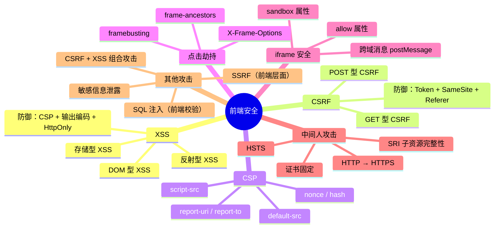

# 前端安全概览

## 面试重点速览

| 面试高频考点 | 重要程度 | 考察方向 |
| --- | --- | --- |
| XSS 三种类型区别与防御 | :star::star::star::star::star: | 存储型/反射型/DOM 型原理 + CSP + HttpOnly |
| CSRF 攻击与 Token 防御 | :star::star::star::star::star: | CSRF Token 生成/校验 + SameSite Cookie |
| CSP 内容安全策略 | :star::star::star::star: | 指令配置 + nonce/hash 白名单 |
| 点击劫持防御 | :star::star::star: | X-Frame-Options + frame-ancestors |
| HTTPS 与中间人攻击 | :star::star::star: | TLS 握手 + HSTS + 证书固定 |
| 安全设计原则 | :star::star::star: | 纵深防御 + 最小权限 + 输入验证 |

---

## 一、前端安全全景



---

## 二、攻击类型与防御对应表

| 攻击类型 | 攻击原理 | 危害等级 | 核心防御手段 | 前端负责范围 |
| --- | --- | --- | --- | --- |
| **XSS（跨站脚本）** | 注入恶意脚本到页面执行 | :red_circle: 极高 | CSP + 输出编码 + HttpOnly Cookie | 输入验证、输出编码、DOM 操作安全 |
| **CSRF（跨站请求伪造）** | 诱导用户点击，伪造用户请求 | :red_circle: 极高 | CSRF Token + SameSite Cookie | Token 携带、表单提交防护 |
| **点击劫持** | 透明 iframe 覆盖诱导点击 | :orange_circle: 高 | X-Frame-Options / frame-ancestors | 响应头配置、frame 破坏脚本 |
| **中间人攻击** | 网络劫持，篡改通信内容 | :orange_circle: 高 | HTTPS + HSTS + SRI | 全站 HTTPS、资源完整性校验 |
| **敏感信息泄露** | 前端代码/存储暴露敏感数据 | :yellow_circle: 中 | 代码审查 + 环境变量隔离 | 不硬编码密钥、Git 历史检查 |
| **SSRF（服务端请求伪造）** | 前端请求参数被利用攻击内网 | :orange_circle: 高 | 服务端 URL 白名单 | 前端输入校验与提示 |
| **SQL 注入** | 输入拼接 SQL 语句 | :red_circle: 极高 | 参数化查询（服务端） | 前端输入格式校验 |

---

## 三、安全设计原则

### 3.1 纵深防御（Defense in Depth）

不要依赖单一的安全措施。前端的每个安全层面都应该有独立的防护：

```
用户输入 → 前端校验 → 传输加密 → 服务端校验 → 输出编码 → CSP 限制
   :          :          :           :           :          :
 格式校验   XSS过滤    HTTPS      参数化查询   HTML实体   白名单机制
```

::: tip 纵深防御实践
即使服务端已经做了输入校验，前端仍然需要进行格式校验和 XSS 过滤。攻击者可能绕过前端直接请求后端 API，但前端校验能减少无效请求，同时作为第一道防线。
:::

### 3.2 最小权限原则（Least Privilege）

- **Cookie 权限**：`HttpOnly`、`Secure`、`SameSite` 属性组合使用
- **iframe 权限**：通过 `sandbox` 属性精确控制子页面的能力
- **CSP 权限**：`default-src 'self'` 作为基础策略，按需开放
- **CORS 权限**：精确配置 `Access-Control-Allow-Origin`，不使用 `*`

### 3.3 输入验证与输出编码

| 场景 | 策略 | 示例 |
| --- | --- | --- |
| 用户输入 | 白名单验证 + 长度限制 + 格式校验 | 邮箱正则：`/^[a-zA-Z0-9._%+-]+@[a-zA-Z0-9.-]+\.[a-zA-Z]{2,}$/` |
| HTML 输出 | HTML 实体编码 | `<` → `&lt;`、`>` → `&gt;`、`"` → `&quot;` |
| JavaScript 输出 | `\xHH` 或 `\uXXXX` 编码 | 避免将用户输入直接拼接到 `<script>` 中 |
| URL 输出 | `encodeURIComponent()` | 对 URL 参数进行百分号编码 |
| CSS 输出 | 避免用户输入进入 `<style>` | 使用 CSS.supports() 或白名单验证 |

### 3.4 默认安全（Secure by Default）

框架和库的选择应优先考虑默认安全的方案：

- React 默认对 JSX 中的变量进行 HTML 转义（`{username}` 不会执行 HTML）
- Vue 的 `{{ }}` 插值表达式默认转义 HTML
- Angular 内置 DomSanitizer 安全上下文
- Next.js 的 Server Components 天然避免客户端 XSS

::: danger 危险的 API
以下 API 会绕过框架的安全机制，使用时必须格外小心：

- `dangerouslySetInnerHTML`（React）
- `v-html`（Vue）
- `innerHTML`、`outerHTML`（原生 DOM）
- `document.write()`
- `eval()`、`new Function()`
- `setTimeout/setInterval` 传入字符串
:::

---

## 四、前端安全检测清单

### 4.1 开发阶段

- [ ] ESLint 配置 `no-eval` 规则，禁止 `eval()` 使用
- [ ] 使用 `eslint-plugin-security` 检测常见安全问题
- [ ] 代码审查中检查 `dangerouslySetInnerHTML` / `v-html` 的使用
- [ ] 检查所有用户输入点是否有校验逻辑
- [ ] 确认没有硬编码的 API Key、Token、密码

### 4.2 构建与部署阶段

- [ ] 配置 CSP 响应头，启用 `report-only` 模式先观察
- [ ] 启用 HTTPS 并配置 HSTS（`max-age=31536000; includeSubDomains; preload`）
- [ ] 配置 `X-Frame-Options: DENY` 或 `SAMEORIGIN`
- [ ] 配置 `X-Content-Type-Options: nosniff`
- [ ] 使用 SRI（Subresource Integrity）校验 CDN 资源完整性
- [ ] Cookie 设置 `Secure; HttpOnly; SameSite=Lax`

### 4.3 运行时监控

- [ ] 接入 CSP 报告收集端点（`report-uri` / `report-to`）
- [ ] 监控异常的资源加载和脚本执行
- [ ] 配置前端错误监控（Sentry 等），捕获 XSS 异常
- [ ] 定期进行安全扫描（OWASP ZAP、Burp Suite）

---

## 五、总结

前端安全是整体 Web 安全的第一道防线。核心要点：

1. **永远不要信任用户输入** -- 所有输入都可能被恶意构造
2. **纵深防御** -- 多层防护，不依赖单一手段
3. **默认安全** -- 使用安全的框架 API，避免危险的原始操作
4. **持续监控** -- CSP 报告 + 错误监控，及时发现攻击行为
5. **HTTPS 是基础** -- 没有 HTTPS，其他安全措施都形同虚设

::: warning 面试提示
面试中常被问到："前端安全有哪些？如何防御？" 回答时应从 **XSS**（三种类型 + CSP + 输出编码）和 **CSRF**（Token + SameSite）入手，再补充点击劫持、中间人攻击等，展示系统性的安全思维。
:::