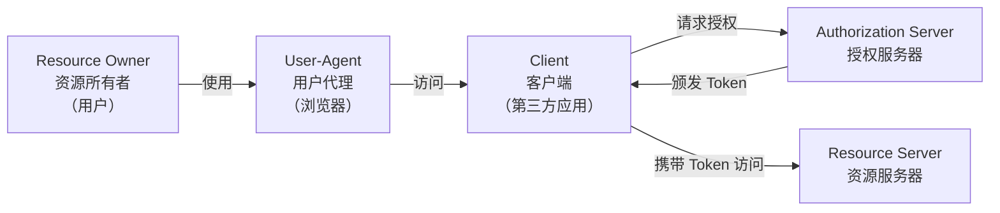
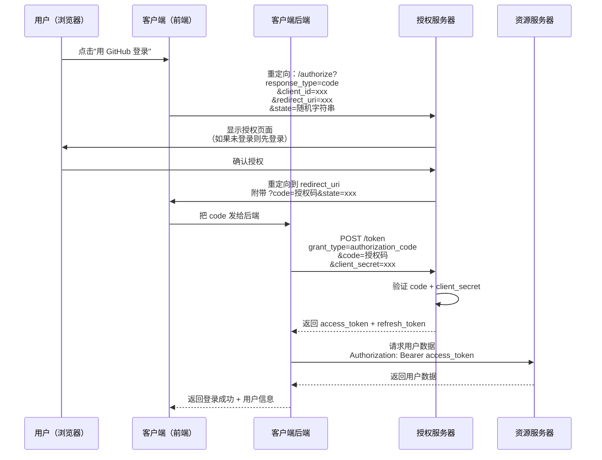
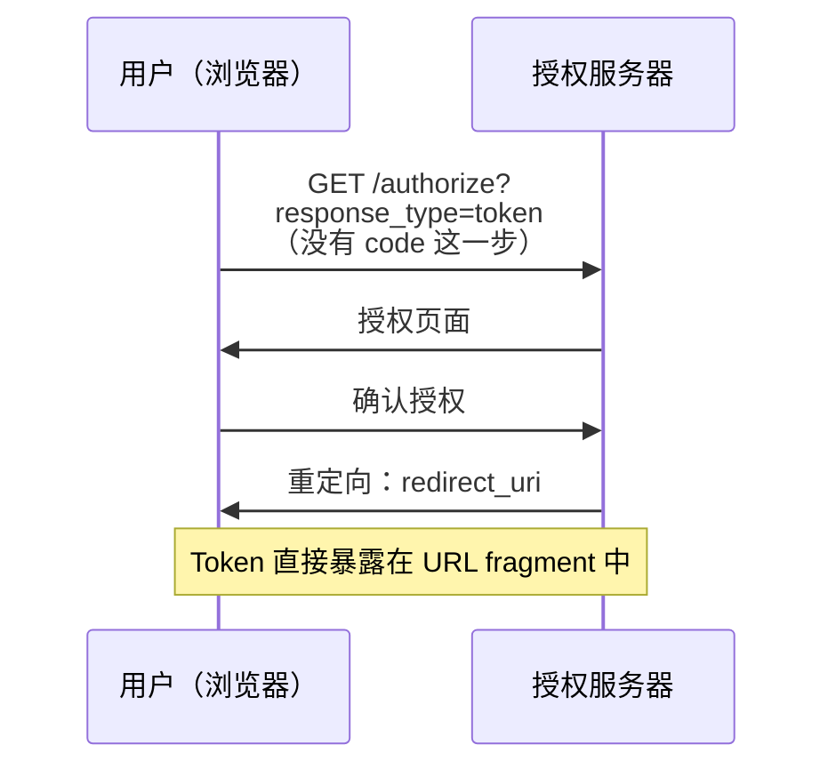
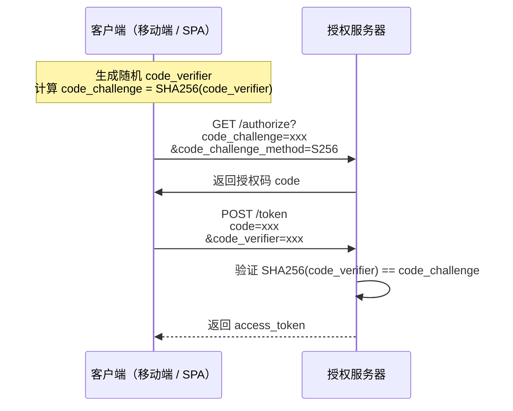
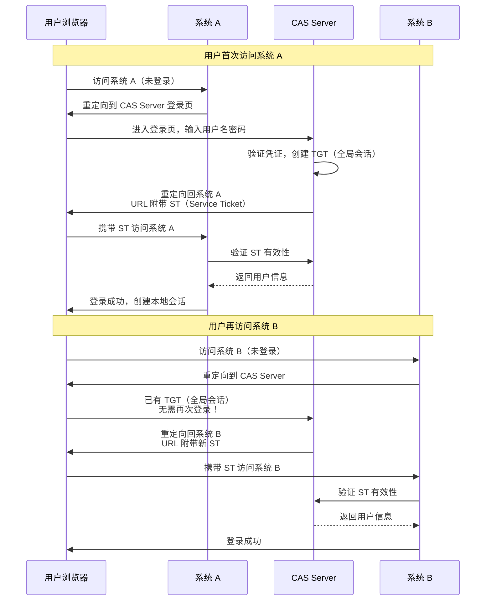
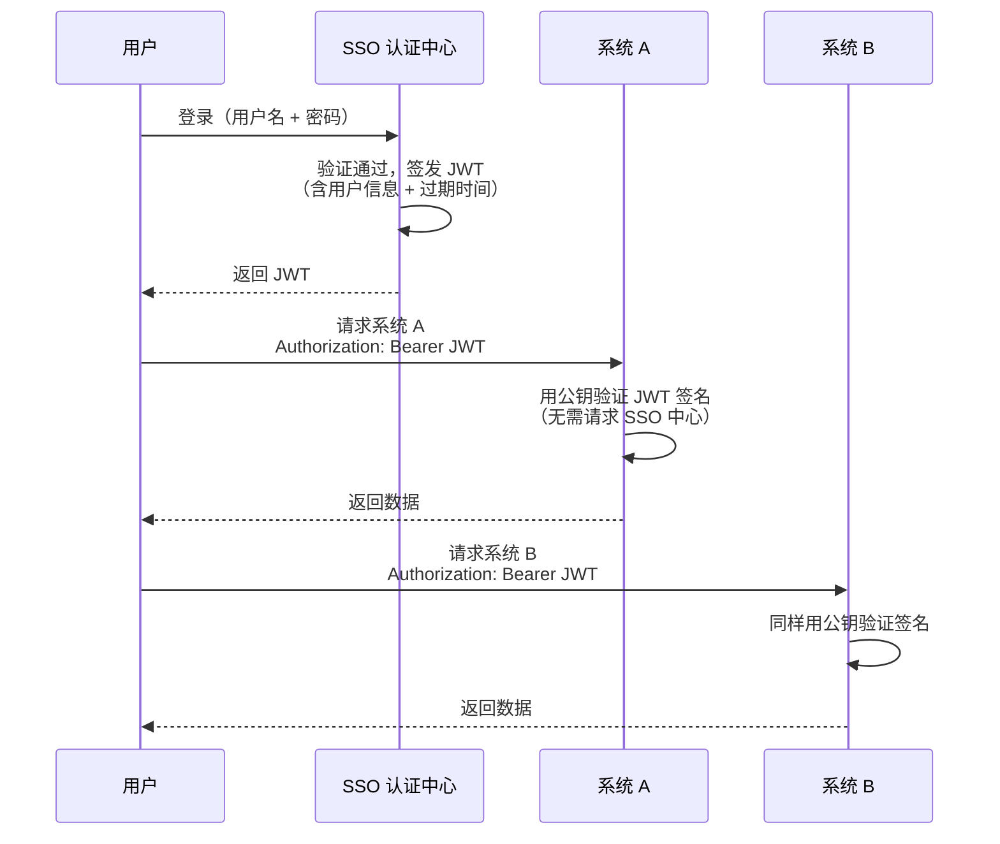
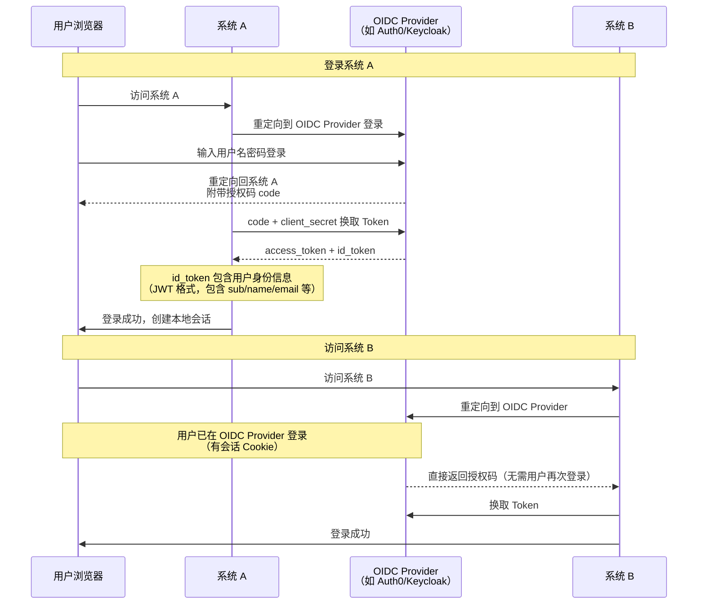

# OAuth 2.0 与 SSO

## ⭐ 面试重点速览

| 考点 | 考察频率 | 难度 | 掌握要求 |
|------|----------|------|----------|
| OAuth 2.0 四种授权模式 | ⭐⭐⭐⭐⭐ | 中等 | 必须能说出四种模式名称、区别和适用场景 |
| 授权码模式流程 | ⭐⭐⭐⭐⭐ | 中等 | 能画出时序图，解释为什么需要授权码换 Token |
| 授权码模式 vs 隐式模式 | ⭐⭐⭐⭐ | 中等 | 理解安全性差异，为什么隐式模式被淘汰 |
| SSO 单点登录原理 | ⭐⭐⭐⭐⭐ | 中等 | CAS 流程、JWT 方案、OAuth 2.0 方案对比 |
| 授权码模式为什么安全 | ⭐⭐⭐⭐ | 中等 | 后端通信不暴露 Token、state 防 CSRF |
| Token 类型（access / refresh） | ⭐⭐⭐ | 简单 | 区分两种 Token 的作用和生命周期 |

---

## 一、OAuth 2.0 是什么？

**OAuth 2.0** 是一种**授权框架**（不是认证框架），允许第三方应用在用户授权的前提下，获取用户在某服务上的资源，而**不需要用户把密码交给第三方应用**。

### 典型场景

```
你在某个网站 A 上想用 GitHub 账号登录：
  1. 网站 A 跳转到 GitHub 授权页面
  2. GitHub 问你："网站 A 想访问你的公开资料，允许吗？"
  3. 你点击"允许"
  4. GitHub 告诉网站 A："这个用户同意授权了，这是凭证"
  5. 网站 A 拿着凭证去 GitHub 拉取你的头像和昵称

整个过程，你的 GitHub 密码从没给过网站 A。
```

### 核心角色



| 角色 | 说明 | 举例 |
|------|------|------|
| **Resource Owner** | 资源所有者，即用户 | 你本人 |
| **Client** | 第三方应用，想访问用户资源 | 网站 A |
| **Authorization Server** | 授权服务器，用户在这里登录并授权 | GitHub 登录页 |
| **Resource Server** | 资源服务器，存放用户受保护的资源 | GitHub API |
| **User-Agent** | 用户的浏览器 | Chrome / Edge |

---

## 二、四种授权模式

OAuth 2.0 定义了四种授权模式，适用于不同场景：

| 授权模式 | 英文名 | 适用场景 | Token 获取方 | 安全性 |
|----------|--------|----------|-------------|--------|
| 授权码模式 | Authorization Code | 有后端服务的 Web 应用 | 后端 | ✅ 最高 |
| 隐式模式 | Implicit | 纯前端 SPA（已不推荐） | 前端 | ❌ 低 |
| 密码模式 | Resource Owner Password | 自家应用（高度信任） | 直接获取 | ⚠️ 中等 |
| 客户端凭证模式 | Client Credentials | 服务间通信，无用户参与 | 后端 | ✅ 高 |

### 2.1 授权码模式（Authorization Code）

**最主流、最安全**的模式，用于有后端服务的 Web 应用。

核心思想：**用户在前端授权，后端之间交换 Token**。



**为什么需要授权码再换 Token？**

这是授权码模式最核心的设计，回答这个问题的关键有三点：

1. **前端不可信 -- 不暴露 Token**：授权码通过浏览器重定向传递（前端可见），但授权码是**一次性且短有效期**的。真正的 access_token 是**后端对后端通信**获取的，浏览器永远看不到 Token，XSS 攻击无法窃取 Token。

2. **验证客户端身份 -- client_secret 保护**：换取 Token 时需要 `client_secret`，这个密钥存在后端，前端代码里没有。即使攻击者截获了授权码，没有 `client_secret` 也无法换取 Token。

3. **用户只授权一次 -- 前端不参与后续通信**：换取 Token 之后，所有资源请求都在后端进行，用户浏览器完全不知道 Token 的存在，将安全风险降到最低。

```
前端（不安全）                  后端（安全）
    │                              │
    │  授权码 code（一次性）        │
    │ ──────────────────────────→ │
    │                              │  code + client_secret
    │                              │ ──────────────→ 授权服务器
    │                              │ ←────────────── access_token
    │                              │
  用户看不到 Token                 Token 只在后端
```

### 2.2 隐式模式（Implicit）-- 已不推荐

OAuth 2.0 安全最佳实践中已**不推荐使用**，但面试中会问。



**为什么不安全？**

- Token 直接暴露在浏览器 URL 中（`#access_token=xxx`），任何能读取 URL 的脚本都能窃取
- 没有 `client_secret` 验证环节，无法验证客户端身份
- 无法使用 refresh_token（安全问题）
- 浏览器历史记录、Referer Header 都可能泄露 Token

::: danger 面试提示
OAuth 2.1 草案中已经**正式移除隐式模式**，推荐使用 **授权码模式 + PKCE** 替代。如果面试官问"隐式模式为什么被淘汰"，核心回答是：**Token 暴露在前端，缺乏客户端身份验证，安全性远不如授权码模式**。
:::

### 2.3 密码模式（Resource Owner Password）

用户直接把用户名和密码交给客户端，客户端用密码换 Token。

```javascript
// 直接提交用户名密码换 Token
POST /token
{
  "grant_type": "password",
  "username": "user@example.com",
  "password": "123456",
  "client_id": "xxx"
}
```

**适用场景**：仅限于**自家开发的应用**（如官方 App），用户高度信任客户端。

**不推荐原因**：第三方应用不应接触用户密码，违背了 OAuth 的设计初衷。

### 2.4 客户端凭证模式（Client Credentials）

**没有用户参与**，客户端直接用自己的身份获取 Token。

```javascript
// 服务间通信，只验证客户端身份
POST /token
{
  "grant_type": "client_credentials",
  "client_id": "xxx",
  "client_secret": "xxx"
}
```

**适用场景**：微服务间调用、后台任务、API 网关鉴权。

---

## 三、授权码模式 + PKCE（推荐方案）

PKCE（Proof Key for Code Exchange，发音 "pixy"）是授权码模式的增强版，解决**移动端和纯前端 SPA 无法安全存储 client_secret** 的问题。

### PKCE 流程



**PKCE 的核心思想**：用动态生成的密钥对（code_challenge / code_verifier）替代静态的 client_secret，即使授权码被拦截，没有 code_verifier 也无法换取 Token。

::: tip 面试重点
OAuth 2.1 草案中，**所有使用授权码模式的客户端都必须使用 PKCE**，包括传统 Web 应用。这是目前最安全的 OAuth 2.0 实践。
:::

---

## 四、Token 设计

### 4.1 access_token 与 refresh_token

| 维度 | access_token | refresh_token |
|------|-------------|---------------|
| 用途 | 访问资源 | 刷新 access_token |
| 有效期 | 短（15分钟 ~ 2小时） | 长（7天 ~ 30天） |
| 暴露面 | 每次请求都携带 | 仅在刷新时使用 |
| 存储位置 | 后端内存 / Cookie httpOnly | 后端数据库 / Redis |
| 泄漏后果 | 短时间内有效，影响可控 | 可长期冒充用户，危害大 |

### 4.2 JWT 作为 Token 格式

OAuth 2.0 没有规定 Token 的格式，实践中常用 JWT 作为 access_token 的载体：

```json
// JWT Payload 示例
{
  "sub": "user_12345",
  "scope": "read:profile read:email",
  "client_id": "my_web_app",
  "iat": 1688800000,
  "exp": 1688801800,
  "iss": "https://auth.example.com"
}
```

JWT 的好处是**自包含**：资源服务器可以直接从 Token 中解析出用户信息和权限范围，不需要回查授权服务器。

---

## 五、单点登录 SSO

**SSO（Single Sign-On，单点登录）**：用户在一个系统登录后，可以访问所有相互信任的系统，无需重复登录。

### 5.1 核心概念

```
场景：公司内部有多个系统（OA、CRM、邮件、GitLab）

没有 SSO：
  用户 → 登录 OA → 登录 CRM → 登录邮件 → 登录 GitLab
  （输入 4 次密码，管理 4 个会话）

有了 SSO：
  用户 → 登录 SSO 中心 → 访问 OA（自动登录） → 访问 CRM（自动登录） → ...
  （输入 1 次密码，统一管理）
```

### 5.2 三种主流 SSO 方案

| 方案 | 核心协议 | 优点 | 缺点 | 适用场景 |
|------|----------|------|------|----------|
| **CAS** | CAS 协议 | 成熟稳定，专注认证 | 较老，配置复杂 | 企业内部系统 |
| **JWT 方案** | 自定义 / JWT | 无状态，轻量 | 无法主动注销 | 小型系统，同域 |
| **OAuth 2.0 方案** | OAuth 2.0 + OIDC | 标准化，生态完善 | 相对复杂 | 现代 Web 应用（推荐） |

### 5.3 CAS 流程

CAS（Central Authentication Service）是经典的 SSO 协议，核心是通过**票据（Ticket）**实现认证传递。



**关键票据**：

| 票据 | 全称 | 作用 | 生命周期 |
|------|------|------|----------|
| **TGT** | Ticket Granting Ticket | 存储在 CAS Server 的 Cookie，证明用户已登录 | 较长（数小时） |
| **ST** | Service Ticket | 一次性票据，用于访问特定服务 | 极短（一次性） |

::: tip CAS 核心思想
用户在 CAS Server 登录一次后获得 TGT，之后访问任何系统都先跳转到 CAS Server，因为 TGT 仍在，CAS Server 直接签发新 ST，用户无需重复登录。这就是"单点登录"的本质。
:::

### 5.4 JWT 方案

通过**共享密钥**或**公私钥对**，让多个系统都能验证同一个 JWT。



**优点**：
- 各系统可以独立验证 JWT，不需要每次请求都回查 SSO 中心
- 完全无状态，扩展性好
- 实现简单，适合微服务架构

**缺点**：
- 无法主动注销（JWT 签发后直到过期前一直有效）
- 需要安全的密钥分发机制
- JWT 体积较大，每次请求都携带

### 5.5 OAuth 2.0 + OIDC 方案（推荐）

OIDC（OpenID Connect）是 OAuth 2.0 之上的**身份认证层**。OAuth 2.0 本身只解决"授权"问题，OIDC 补充了"认证"（你是谁）的能力。



**OIDC 的核心概念**：

| 概念 | 说明 |
|------|------|
| **ID Token** | JWT 格式，包含用户身份信息（sub, name, email, picture） |
| **Access Token** | 用于访问资源服务器（UserInfo Endpoint） |
| **UserInfo Endpoint** | 标准 API，用 access_token 获取用户详细信息 |
| **Discovery** | `.well-known/openid-configuration` 自动发现配置 |

**为什么 OAuth 2.0 + OIDC 是推荐方案？**

1. **标准化**：OIDC 是国际标准，各种语言和框架都有成熟库
2. **安全性**：建立在 OAuth 2.0 授权码模式之上，所有安全最佳实践都适用
3. **生态完善**：Auth0、Keycloak、Okta、Azure AD 等成熟方案
4. **支持社交登录**：Google、GitHub、微信等第三方登录本质都是 OAuth 2.0 + OIDC

---

## 六、三种 SSO 方案对比

| 维度 | CAS | JWT 方案 | OAuth 2.0 + OIDC |
|------|-----|----------|-------------------|
| **协议标准化** | CAS 协议（非国际标准） | 无标准，自定义 | OAuth 2.0 + OIDC（RFC 标准） |
| **认证与授权** | 仅认证 | 仅认证 | 认证 + 授权分离 |
| **主动注销** | 支持（CAS Server 通知各系统） | 困难（JWT 无法主动失效） | 支持（Backchannel Logout） |
| **第三方登录** | 不支持 | 不支持 | 原生支持 |
| **移动端支持** | 较差 | 一般 | 优秀 |
| **生态与工具** | 较少 | 自定义 | Auth0 / Keycloak / Okta 等 |
| **实现复杂度** | 中等 | 简单 | 中高 |
| **推荐场景** | 传统企业内部系统 | 小型、同域系统 | 现代 Web / 移动应用 |

---

## 七、面试重点：授权码模式为什么安全？

这是面试中关于 OAuth 2.0 最高频的问题，需要从多个维度回答：

### 安全设计要点

| 安全机制 | 解决的问题 | 具体做法 |
|----------|-----------|----------|
| **授权码换 Token** | 前端不可信，Token 不暴露在浏览器 | 授权码是临时的、一次性的，真正的 Token 在后端通信中获取 |
| **client_secret** | 验证客户端身份 | 换取 Token 时必须提供 client_secret，存储在服务端 |
| **state 参数** | 防止 CSRF 攻击 | 客户端生成随机 state，授权服务器原样返回，验证一致性 |
| **redirect_uri 校验** | 防止授权码被劫持到其他地址 | 授权服务器必须精确匹配预先注册的 redirect_uri |
| **PKCE** | 防止授权码拦截攻击 | 动态 code_challenge / code_verifier 替代静态 client_secret |
| **HTTPS** | 防止中间人攻击 | 所有通信必须走 HTTPS |

### state 参数防 CSRF 详解

```javascript
// 前端：发起授权请求前生成随机 state
const state = crypto.randomUUID();
sessionStorage.setItem('oauth_state', state);

// 重定向到授权服务器时带上 state
window.location.href = `https://auth.example.com/authorize?` +
  `response_type=code&` +
  `client_id=my_app&` +
  `redirect_uri=https://myapp.com/callback&` +
  `state=${state}&` +
  `scope=read:profile`;

// 回调页面：验证 state
const returnedState = new URLSearchParams(location.search).get('state');
const savedState = sessionStorage.getItem('oauth_state');
if (returnedState !== savedState) {
  // state 不匹配，可能是 CSRF 攻击，拒绝处理
  throw new Error('CSRF attack detected!');
}
```

**攻击场景**：攻击者用自己的授权码构造一个回调 URL，诱导受害者点击。如果受害者已登录攻击者的目标网站，网站会误将攻击者的账号关联到受害者当前会话。有了 state 参数，攻击者无法知道受害者的随机 state 值，攻击被阻止。

### PKCE 防授权码拦截

```
攻击者场景：恶意应用注册了相同的 redirect_uri scheme
（移动端常见问题）

没有 PKCE：
  1. 恶意应用拦截授权码
  2. 恶意应用用授权码 + client_secret 换取 Token
  3. 攻击者获得用户授权

有了 PKCE：
  1. 合法应用生成 code_verifier，计算 code_challenge
  2. 恶意应用拦截授权码
  3. 恶意应用不知道 code_verifier，无法证明身份
  4. 授权服务器拒绝换取 Token 的请求
```

---

## 八、常见面试题

### Q1: OAuth 2.0 和 OAuth 1.0 有什么区别？

**A**：OAuth 2.0 是 1.0 的简化版，主要区别：

| 维度 | OAuth 1.0 | OAuth 2.0 |
|------|-----------|-----------|
| 签名复杂度 | 需要复杂签名（HMAC-SHA1） | 依赖 HTTPS，不要求签名 |
| 客户端类型 | 仅 Web 应用 | Web、移动端、SPA、IoT 等 |
| Token 类型 | 单一 Token | access_token + refresh_token |
| 授权流程 | 一种 | 四种授权模式 |
| 移动端支持 | 差 | 好 |

OAuth 2.0 不向后兼容 1.0，两者是独立协议。

### Q2: OAuth 2.0 是认证（Authentication）还是授权（Authorization）？

**A**：OAuth 2.0 是**授权框架**，不是认证框架。

- **授权**：你能做什么（你能访问我哪些资源？）
- **认证**：你是谁（你的身份是什么？）

单独使用 OAuth 2.0 只能获取 access_token，服务端拿到 access_token 去资源服务器拉数据，但无法直接知道"用户是谁"。要解决认证问题，需要 OIDC（OpenID Connect），它基于 OAuth 2.0 增加了 id_token，包含用户身份信息。

### Q3: 如何实现 SSO 的单点注销（Single Logout）？

**A**：三种方案：

1. **CAS 方案**：CAS Server 维护各系统的会话，注销时通知所有系统清除会话
2. **OIDC Backchannel Logout**：OIDC Provider 通过后端通道直接通知各系统注销
3. **JWT 方案**：维护一个服务端 Token 黑名单，注销时加入黑名单，每次请求验证

### Q4: 前端 SPA 如何安全地使用 OAuth 2.0？

**A**：推荐使用**授权码模式 + PKCE**，而不使用隐式模式。

```javascript
// 使用 oidc-client-ts 库示例
import { UserManager } from 'oidc-client-ts';

const userManager = new UserManager({
  authority: 'https://auth.example.com',
  client_id: 'my_spa',
  redirect_uri: 'https://myapp.com/callback',
  response_type: 'code',           // 授权码模式
  scope: 'openid profile email',
  // PKCE 默认启用
});

// 登录
await userManager.signinRedirect();

// 回调处理
const user = await userManager.signinRedirectCallback();
// user.access_token 在内存中，不暴露到 localStorage
```

---

## 九、总结

OAuth 2.0 与 SSO 是前端安全面试的核心话题：

- **OAuth 2.0 四种模式**：授权码（最安全）、隐式（已淘汰）、密码（自家应用）、客户端凭证（服务间）
- **授权码模式安全性**：前端拿 code（临时、一次性），后端用 code + client_secret 换 Token，Token 不暴露在浏览器
- **PKCE**：授权码模式的增强，用动态密钥对替代静态 secret，适用于无法安全存储密钥的场景
- **SSO 三种方案**：CAS（传统、成熟）、JWT（轻量、无状态）、OAuth 2.0 + OIDC（现代、标准化，推荐）
- **面试核心**：Why is authorization code flow secure? How does SSO work? 这两个问题必须能深入回答