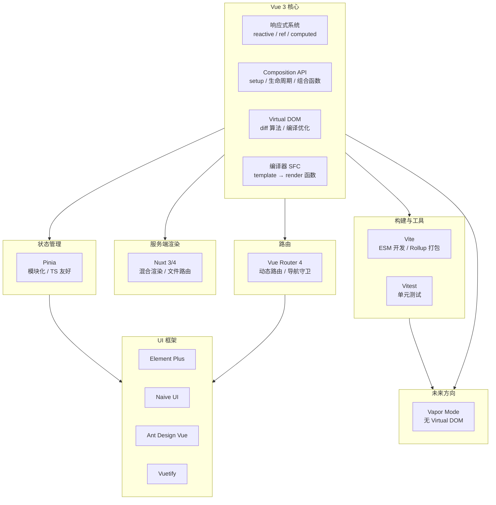

# Vue 3 生态全景

## ⭐ 面试重点速览

| 知识模块 | 重点内容 | 面试频率 |
|----------|----------|----------|
| 响应式原理 | Vue2 vs Vue3 响应式实现差异、Proxy 优势、Reflect 作用 | 极高 |
| 组合式 API | ref/reactive 区别、computed 缓存、watch 与 watchEffect 对比 | 极高 |
| 状态管理 | Pinia vs Vuex、Options Store vs Setup Store | 高 |
| 路由 | 动态路由、导航守卫执行顺序、history vs hash 模式 | 高 |
| Vapor Mode | 无虚拟 DOM 编译策略、与 Solid.js 对比 | 中高（趋势） |
| SSR | Nuxt 3 混合渲染、SSR vs SSG 选择、hydration 过程 | 中高 |

---

## 一、Vue 版本演进

Vue 从 2014 年发布至今，经历了从 MVVM 指令式框架到现代编译时 + 运行时融合框架的蜕变。

### 1.1 版本路线图

```
Vue 1.x (2015)               Vue 2.x (2016-2022)            Vue 3.x (2020-至今)
┌─────────────────┐     ┌──────────────────────────┐     ┌──────────────────────────────┐
│ 基于 Object.     │ ──▶ │ 引入 Virtual DOM           │ ──▶ │ 基于 Proxy 的响应式系统        │
│ defineProperty  │     │ 支持服务端渲染              │     │ Composition API               │
│ 无 Virtual DOM  │     │ 生态爆发（Vuex/Router/CLI） │     │ TypeScript 原生支持            │
│ 指令式响应式    │     │ 单文件组件 .vue             │     │ Fragments/Teleport/Suspense   │
└─────────────────┘     └──────────────────────────┘     └──────────────────────────────┘
                                                                        │
                                                                        ▼
                                            ┌──────────────────────────────────────────┐
                                            │        Vue 3.4 (2024) → Vue 3.5 (2025)   │
                                            │  · 响应式 Props 解构（defineProps）       │
                                            │  · useTemplateRef 替代 ref 模板引用       │
                                            │  · useId() 生成唯一 ID                    │
                                            │  · Vapor Mode 实验性支持                   │
                                            │  · 响应式系统性能优化（减少内存占用）       │
                                            └──────────────────────────────────────────┘
```

### 1.2 关键版本里程碑

| 版本 | 时间 | 核心变化 | 意义 |
|------|------|----------|------|
| Vue 1.0 | 2015.10 | 指令式绑定、无 Virtual DOM | 验证了响应式 UI 框架的可行性 |
| Vue 2.0 | 2016.09 | 引入 Virtual DOM、SSR 支持 | 对标 React 生态，建立完整方案 |
| Vue 2.6 | 2019.02 | 引入 Composition API 插件 | 为 Vue 3 过渡做准备 |
| Vue 3.0 | 2020.09 | Proxy 响应式、Composition API、TypeScript | 架构级重写，性能 + 灵活性双提升 |
| Vue 3.3 | 2023.05 | defineSlots、泛型组件、defineOptions | DX 大幅提升 |
| Vue 3.4 | 2023.12 | 响应式 Props 解构、同名 v-bind 简写 | 编译器优化，减少样板代码 |
| Vue 3.5 | 2024.09 | useTemplateRef、useId、响应式系统重构 | 内部优化，为 Vapor Mode 铺路 |
| Vue 3.6 | 2025.02 | Vapor Mode 正式进入实验阶段 | 无 Virtual DOM 的先驱尝试 |

---

## 二、核心生态全景图



---

## 三、各子模块简介

| 子模块 | 文件 | 核心内容 | 面试权重 |
|--------|------|----------|----------|
| 响应式原理 | [reactivity.md](./reactivity.md) | Proxy/Reflect、依赖收集 track、触发更新 trigger、effectScope | 极高 |
| 组合式 API | [composition-api.md](./composition-api.md) | ref/reactive/computed/watch、生命周期、自定义 Hook | 极高 |
| Pinia 状态管理 | [pinia.md](./pinia.md) | Setup Store、持久化、Pinia vs Vuex | 高 |
| Vue Router | [vue-router.md](./vue-router.md) | 动态路由、导航守卫、懒加载、history 模式 | 高 |
| Vapor Mode | [vapor-mode.md](./vapor-mode.md) | 无 Virtual DOM、编译期优化、适用场景 | 中高 |
| Nuxt SSR | [nuxt.md](./nuxt.md) | SSR/SSG/CSR 对比、useFetch、hydration | 中高 |

---

## 四、Vue 3 核心设计理念

::: tip 三大设计目标
1. **更小（Smaller）**：Tree-shaking 友好，按需引入，核心运行时约 10KB gzipped
2. **更快（Faster）**：基于 Proxy 的响应式（初始化更快）、静态提升（编译优化）、patchFlag 靶向更新
3. **更易维护（More Maintainable）**：TypeScript 原生支持、Composition API 逻辑复用、monorepo 源码管理
:::

### 4.1 编译时优化

Vue 3 的编译器做了大量 AOT（Ahead of Time）优化，这是相比 Vue 2 最大的性能提升来源：

```html
<template>
  <!-- 静态节点会被提升到 render 函数外部，避免重复创建 -->
  <div>
    <h1>静态标题 —— 永远不变</h1>
    <p>{{ dynamicText }}</p>
    <span :class="dynamicClass">动态样式</span>
  </div>
</template>
```

```js
// 编译后的结果（简化示意）
import { createElementVNode as _createElementVNode, toDisplayString as _toDisplayString, openBlock as _openBlock, createElementBlock as _createElementBlock } from "vue"

// 静态节点提升 —— 只在模块加载时创建一次
const _hoisted_1 = /*#__PURE__*/_createElementVNode("h1", null, "静态标题 —— 永远不变", -1 /* HOISTED */)

export function render(_ctx, _cache) {
  return (_openBlock(), _createElementBlock("div", null, [
    _hoisted_1,  // 直接复用静态节点
    _createElementVNode("p", null, _toDisplayString(_ctx.dynamicText), 1 /* TEXT */),
    _createElementVNode("span", { class: _ctx.dynamicClass }, null, 2 /* CLASS */)
  ]))
}
```

::: tip 关键优化标志（PatchFlag）
- `1` = TEXT：动态文本内容
- `2` = CLASS：动态 class
- `4` = STYLE：动态 style
- `8` = PROPS：动态属性
- `64` = STABLE_FRAGMENT：稳定的 Fragment
- `128` = KEYED_FRAGMENT：带 key 的 Fragment

这些标志让 diff 算法可以**跳过无需对比的部分**，实现"靶向更新"。
:::

### 4.2 与 React 的设计哲学对比

| 维度 | Vue 3 | React 18 |
|------|-------|----------|
| 响应式机制 | 基于 Proxy 的自动依赖追踪 | 手动声明依赖（useMemo/useCallback） |
| 渲染策略 | 组件级精确更新 | 自顶向下全量 diff（Fiber 可中断） |
| 编译优化 | 静态提升、靶向更新 | JSX 纯运行时（React Forget 编译中） |
| 状态管理 | 可变数据（mutable） | 不可变数据（immutable） |
| 学习曲线 | 渐进式，模板语法友好 | 函数式编程，JSX 灵活 |
| TypeScript | 原生支持，类型推导好 | 同样支持，但类型体操更复杂 |

::: danger 面试常问：Vue 和 React 谁性能更好？
- **初始化**：Vue 3 更快（Proxy 按需代理，React 需全量创建 Fiber 树）
- **更新**：Vue 3 组件级精确更新，React 需要手动优化（memo/useMemo）
- **大型应用**：React Fiber 架构对大量并发更新更友好（可中断渲染）
- **结论**：没有绝对优劣，取决于场景。Vue 3 在中小型应用和精细化更新上更优；React 在超大规模应用和异步渲染上更灵活
:::

---

## ⭐ 面试高频问题汇总

### Q1：Vue 3 相比 Vue 2 有哪些核心改进？

| 维度 | Vue 2 | Vue 3 |
|------|-------|-------|
| 响应式 | `Object.defineProperty` | `Proxy` |
| API 风格 | Options API 为主 | Composition API 为主 |
| TypeScript | 支持有限 | 原生 TypeScript 编写 |
| 性能 | 全量 Virtual DOM diff | 静态提升 + 靶向更新 |
| 打包体积 | 约 20KB gzipped | 约 10KB gzipped（Tree-shaking） |
| 组件 | 单根节点限制 | Fragment 支持多根节点 |
| 状态管理 | Vuex（mutations） | Pinia（无 mutations） |

### Q2：Vue 3 的 Tree-shaking 是如何实现的？

Vue 3 源码使用 ES Module 导出，构建工具（Vite/Rollup/Webpack）可以分析 import 语句，只打包实际使用的 API。

```js
// 只引入需要的 API，未使用的不会被打包
import { ref, computed, onMounted } from 'vue'
// reactive、watch 等未引入的 API 会被 Tree-shaking 掉
```

Vue 2 的 `Vue.nextTick`、`Vue.set` 等全局 API 挂在 Vue 构造函数上，无法被 Tree-shaking。

### Q3：Vue 3.4 的响应式 Props 解构是什么？

Vue 3.4 之前，通过 `defineProps` 获取的 props 变量**不是响应式的**，解构会丢失响应式：

```vue
<script setup>
// Vue 3.3 及之前 —— 解构丢失响应式
const { name } = defineProps(['name'])  // name 不再是响应式的！

// 需要使用 toRefs 或 props.xxx 方式访问
const props = defineProps(['name'])
const name = toRef(props, 'name')
</script>
```

Vue 3.4 起，编译器会**自动转换**解构操作，使其保持响应式：

```vue
<script setup>
// Vue 3.4+ —— 直接解构，自动保持响应式！
const { name, age } = defineProps(['name', 'age'])
// 在模板中直接使用 name 和 age，模板会自动追踪响应式依赖
</script>
```

---

## 学习建议

::: tip 推荐学习路径
1. **基础阶段**：通读 Vue 3 官方文档，完成教程中的例子
2. **原理阶段**：阅读 `@vue/reactivity` 源码，理解 `reactive`/`ref`/`effect` 的实现
3. **实践阶段**：用 Vue 3 + Pinia + Vue Router 完成一个中等复杂度项目
4. **面试阶段**：重点复习响应式原理、Composition API 设计模式、Vapor Mode 趋势
:::

::: details 推荐资源
- [Vue 3 官方文档](https://cn.vuejs.org/)
- [Vue 3 源码（@vue/reactivity）](https://github.com/vuejs/core/tree/main/packages/reactivity)
- [尤雨溪 - Vue 3 设计理念演讲](https://www.youtube.com/watch?v=WLpLYhnGqPA)
- [Vue.js 技术揭秘 - 黄轶](https://ustbhuangyi.github.io/vue-analysis/)
- [Vue 3 编译优化揭秘](https://vuejs.org/guide/extras/rendering-mechanism.html)
:::