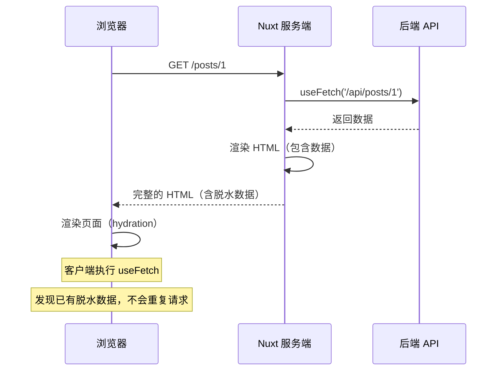
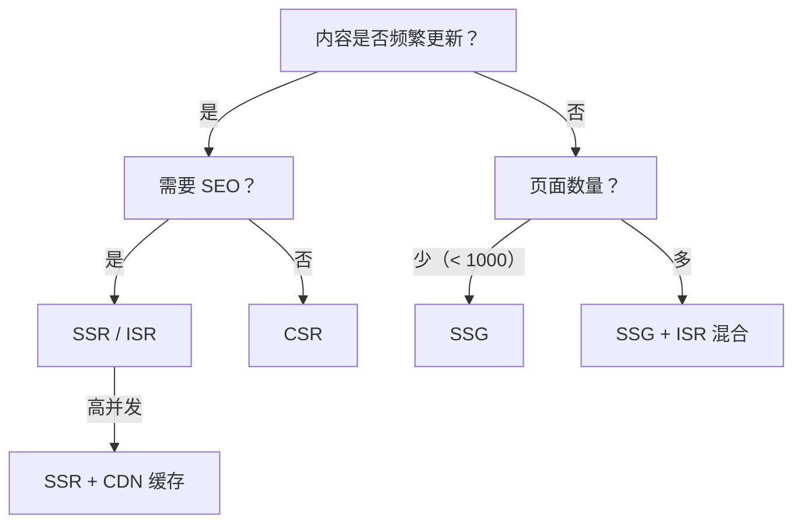

# Nuxt 服务端渲染

## ⭐ 面试重点速览

| 知识模块 | 重点内容 | 面试频率 |
|----------|----------|----------|
| Nuxt 3 核心特性 | 自动导入、文件路由、混合渲染模式 | 中高 |
| SSR vs SSG vs CSR | 渲染模式对比、选择策略 | 中高 |
| 数据获取 | useFetch / useAsyncData 原理与区别 | 高 |
| SSR 原理 | 服务端渲染流程、同构渲染 | 极高 |
| Hydration | 客户端激活过程、常见问题 | 高 |
| Nuxt 4 展望 | 新特性预览 | 中 |

---

## 一、Nuxt 3 核心特性

### 1.1 架构概览

```mermaid
flowchart TB
    subgraph NuxtCore["Nuxt 3 核心架构"]
        direction TB
        AUTO[自动导入<br/>composables / components]
        FSR[文件路由<br/>pages/ 目录]
        HYBRID[混合渲染<br/>SSR / SSG / CSR / ISR]
        SERVER[服务端引擎<br/>Nitro (基于 h3)]
        MODULES[模块系统<br/>官方/社区模块]
    end

    subgraph DevEx["开发体验"]
        HMR[热模块替换 HMR]
        TS[TypeScript 原生支持]
        DEVTOOLS[Nuxt DevTools]
    end

    subgraph Deployment["部署"]
        NODE[Node.js 服务]
        STATIC[静态站点]
        EDGE[Edge Function]
        CLOUDFLARE[Cloudflare Workers]
        VERCEL[Vercel / Netlify]
    end

    NuxtCore --> DevEx
    NuxtCore --> Deployment
```

### 1.2 自动导入

```vue
<script setup>
/**
 * Nuxt 3 自动导入机制
 * 无需手动 import，以下内容自动可用：
 *
 * - Vue 3 API：ref, reactive, computed, watch, onMounted 等
 * - Nuxt 组合函数：useFetch, useAsyncData, useRoute, useRouter 等
 * - components/ 目录下的组件（自动注册）
 * - composables/ 目录下的组合函数（自动导入）
 * - utils/ 目录下的工具函数
 * - server/ 目录下的服务端 API
 */

// 无需手动导入 Vue API
const count = ref(0)         // ✅ 自动导入
const doubled = computed(() => count.value * 2)  // ✅ 自动导入

// 无需手动导入组件（components/ 下自动注册）
// <MyButton /> 直接在模板中使用

// 无需手动导入组合函数（composables/ 下自动导入）
// const { data } = useMyFetch()  ✅ 自动导入

// 禁用自动导入（在 nuxt.config.ts 中配置）
export default defineNuxtConfig({
  imports: {
    autoImport: false  // 全局禁用
  }
})
</script>
```

### 1.3 文件路由系统

```
pages/
├── index.vue              → /
├── about.vue              → /about
├── users/
│   ├── index.vue          → /users
│   └── [id].vue           → /users/:id
├── blog/
│   ├── index.vue          → /blog
│   ├── [slug].vue         → /blog/:slug
│   └── [...all].vue       → /blog/* （通配路由）
├── admin/
│   └── [[...slug]].vue    → /admin 和 /admin/* （可选通配）
└── products/
    ├── index.vue          → /products （父路由）
    └── [id]/
        └── index.vue      → /products/:id （嵌套子路由）
```

```vue
<!-- pages/users/[id].vue -->
<script setup>
/**
 * 文件路由的路径参数自动映射到路由参数
 */
const route = useRoute()
const userId = route.params.id  // 自动获取 [id] 的值

// 使用 useAsyncData 获取数据（SSR 友好）
const { data: user } = await useAsyncData(
  `user-${userId}`,
  () => $fetch(`/api/users/${userId}`)
)
</script>

<template>
  <div>
    <h1>用户 {{ userId }}</h1>
    <p>{{ user?.name }}</p>
  </div>
</template>
```

---

## 二、SSR vs SSG vs CSR 对比

### 2.1 渲染模式对比

| 维度 | SSR（服务端渲染） | SSG（静态站点生成） | CSR（客户端渲染） |
|------|-------------------|---------------------|-------------------|
| 渲染时机 | 请求时在服务端渲染 | 构建时预渲染 | 浏览器端运行时渲染 |
| 首屏速度 | 快（返回完整 HTML） | 最快（返回静态 HTML） | 慢（需下载 JS 后渲染） |
| SEO 友好 | 友好 | 最友好 | 不友好（需额外处理） |
| 服务器负载 | 高（每次请求需渲染） | 低（静态文件） | 最低（仅提供静态资源） |
| 动态内容 | 实时 | 构建时确定 | 实时 |
| 交互性 | 需要 hydration | 需要 hydration | 直接可用 |
| 适用场景 | 内容型网站、电商 | 博客、文档站 | 后台管理系统 |
| Nuxt 配置 | `ssr: true`（默认） | `nuxi generate` | `ssr: false` |

### 2.2 混合渲染策略

```js
// nuxt.config.ts —— 为不同路由配置不同渲染模式
export default defineNuxtConfig({
  // 全局默认 SSR 模式
  ssr: true,

  // 路由规则 —— 精细控制每个路由的渲染模式
  routeRules: {
    // 首页：SSR（SEO 关键页面）
    '/': { ssr: true },

    // 博客文章：SSG（构建时预渲染，CDN 缓存）
    '/blog/**': { swr: 3600 },  // 首次请求 SSR，之后缓存 1 小时

    // 管理后台：CSR（无需 SEO）
    '/admin/**': { ssr: false },

    // 静态页面：SSG（构建时生成）
    '/about': { prerender: true },

    // API 代理
    '/api/**': { proxy: 'https://api.example.com/**' },

    // CDN 缓存策略
    '/images/**': {
      headers: {
        'Cache-Control': 'public, max-age=31536000, immutable'
      }
    }
  }
})
```

::: tip 渲染模式速查
| 路由规则 | 含义 |
|----------|------|
| `ssr: true` | 每次请求服务端渲染（默认） |
| `ssr: false` | 客户端渲染（SPA） |
| `prerender: true` | 构建时预渲染为静态 HTML |
| `swr: 3600` | 首次 SSR 后缓存 3600 秒（Stale While Revalidate） |
| `isr: 600` | 增量静态再生（Incremental Static Regeneration），600 秒后后台重新生成 |
:::

---

## 三、数据获取

### 3.1 useFetch vs useAsyncData

```vue
<script setup>
/**
 * useFetch —— 便捷的数据获取封装
 * 内部基于 useAsyncData + $fetch
 * 自动处理 URL 拼接、请求去重、缓存
 */
const { data, pending, error, refresh } = await useFetch('/api/posts', {
  // 查询参数
  query: { page: 1, limit: 10 },

  // 请求方法
  method: 'GET',

  // 缓存策略
  key: 'posts-list',  // 缓存 key，相同 key 的请求去重

  // 转换响应数据
  transform: (response) => {
    return response.data.map(post => ({
      ...post,
      createdAt: new Date(post.createdAt)
    }))
  },

  // 懒加载（不阻塞路由导航）
  lazy: false,  // 默认 false，阻塞导航直到数据加载完成

  // 服务端行为
  server: true,  // 是否在服务端也请求

  // 响应式监听（依赖变化时自动重新请求）
  watch: [page]  // 当 page 变化时自动重新请求
})
</script>
```

```vue
<script setup>
/**
 * useAsyncData —— 底层数据获取 API
 * 适合需要自定义请求逻辑的场景
 * useFetch 内部就是调用 useAsyncData
 */
const route = useRoute()

const { data, pending, error, refresh } = await useAsyncData(
  // 唯一 key —— 用于缓存和请求去重
  `user-${route.params.id}`,

  // 异步数据获取函数
  async () => {
    // 可以在这里执行任意异步逻辑
    const [user, posts] = await Promise.all([
      $fetch(`/api/users/${route.params.id}`),
      $fetch(`/api/users/${route.params.id}/posts`)
    ])

    return {
      user,
      posts,
      fetchedAt: new Date()
    }
  },

  // 选项
  {
    // lazy: true —— 不阻塞导航，数据在后台加载
    lazy: false,
    // server: false —— 仅在客户端请求
    server: true,
    // 数据过期后的处理
    getCachedData(key) {
      // 使用缓存数据，直到手动刷新
      const cached = useNuxtData(key)
      return cached.data.value
    }
  }
)
</script>

<template>
  <div>
    <!-- 加载状态 -->
    <div v-if="pending">加载中...</div>
    <!-- 错误状态 -->
    <div v-else-if="error">错误：{{ error.message }}</div>
    <!-- 数据展示 -->
    <div v-else>
      <h1>{{ data.user.name }}</h1>
      <ul>
        <li v-for="post in data.posts" :key="post.id">
          {{ post.title }}
        </li>
      </ul>
      <button @click="refresh()">刷新数据</button>
    </div>
  </div>
</template>
```

### 3.2 useFetch 和 useAsyncData 的 SSR 行为



---

## 四、SSR 原理与 Hydration

### 4.1 SSR 渲染流程

```
1. 请求到达
   │
   ├─ 2. 服务端初始化
   │     · 创建 Nuxt App 实例
   │     · 匹配路由
   │     · 执行路由守卫
   │
   ├─ 3. 数据获取
   │     · 执行 useAsyncData / useFetch
   │     · 等待所有阻塞的异步请求完成
   │
   ├─ 4. 服务端渲染
   │     · 执行组件 setup 函数
   │     · 渲染为 HTML 字符串
   │     · 将响应式数据序列化为 JSON（脱水 / Dehydration）
   │
   ├─ 5. 响应返回
   │     · 完整的 HTML + 内联的 __NUXT__ 状态数据
   │
   ├─ 6. 客户端激活（Hydration）
   │     · 加载 JS bundle
   │     · 读取 __NUXT__ 状态数据恢复响应式状态
   │     · 绑定事件监听器
   │     · 接管页面交互
```

### 4.2 Hydration（水合）过程详解

```js
/**
 * Hydration 的核心过程：
 *
 * 1. 服务端已渲染出完整的 HTML DOM
 * 2. 客户端加载 JS 后，需要"激活"这些 DOM
 * 3. 激活 = 绑定事件监听器 + 建立响应式关联
 * 4. 理想情况下，客户端生成的 Virtual DOM 与服务端 HTML 完全一致
 * 5. 如果不一致，会产生 Hydration Mismatch 错误
 */

// 服务端渲染的 HTML
/*
<div id="app" data-server-rendered="true">
  <h1>Hello, Alice!</h1>
  <p>当前时间：2025-06-07 12:00:00</p>
</div>
*/

// 客户端 hydration 时
// 1. 创建 Vue 应用实例
// 2. 使用服务端传来的初始状态
// 3. 对比客户端生成的 VNode 与服务端 HTML
// 4. 如果一致 → 绑定事件，完成激活
// 5. 如果不一致 → 报错 Hydration Mismatch
```

::: danger 常见的 Hydration Mismatch 原因
1. **服务端和客户端渲染不一致**：如 `new Date()`、`Math.random()` 在服务端和客户端产生不同值
2. **条件渲染依赖浏览器 API**：如 `if (window.innerWidth > 768)` 在服务端不可用
3. **异步数据未等待**：服务端渲染时数据未加载完成
4. **第三方库只在浏览器端运行**：部分库在 Node.js 环境中不可用

```vue
<script setup>
// ❌ 错误：会产生 Hydration Mismatch
const now = new Date().toLocaleTimeString()  // 服务端和客户端不同

// ✅ 正确：使用 onMounted 确保只在客户端执行
import { ref, onMounted } from 'vue'
const now = ref('')
onMounted(() => {
  now.value = new Date().toLocaleTimeString()
})

// ✅ 正确：使用 ClientOnly 组件
</script>
<template>
  <ClientOnly>
    <p>当前时间：{{ new Date().toLocaleTimeString() }}</p>
  </ClientOnly>
</template>
```
:::

### 4.3 同构渲染的关键点

```js
/**
 * 同构渲染（Isomorphic Rendering）：
 * 同一份代码在服务端和客户端都能运行
 *
 * Nuxt 3 的同构策略：
 * 1. 服务端：使用 unenv 模拟浏览器 API，执行 SSR 渲染
 * 2. 客户端：使用标准的浏览器环境执行
 * 3. 关键：确保代码在两端行为一致
 */

// 使用 Nuxt 提供的 API 避免环境差异
import { useRequestHeaders, useCookie } from 'nuxt/app'

// 在服务端获取请求头
const headers = useRequestHeaders(['user-agent'])

// 跨环境 cookie 操作
const token = useCookie('token')
token.value = 'new-token'  // 服务端和客户端均可使用
```

---

## 五、Nuxt 4 预览

| 新特性 | 说明 |
|--------|------|
| 新的目录结构 | `app/` 目录作为应用根目录，`server/` 优化 |
| Nitro v3 | 服务端引擎升级，更好的性能 |
| 增量构建 | 仅重新构建修改过的页面 |
| 更快的 Dev Server | 启动速度和 HMR 速度提升 |
| Vue Vapor Mode 兼容 | 可选启用 Vapor Mode 编译 |
| 更好的类型安全 | 路由参数、API 响应类型的自动推导 |

---

## ⭐ 面试高频问题

### Q1：SSR 的优缺点？

| 优点 | 缺点 |
|------|------|
| 首屏渲染快（直接返回 HTML） | 服务器负载高（每次请求需渲染） |
| SEO 友好（搜索引擎可直接抓取） | 开发复杂度增加（需注意同构问题） |
| 更好的 FCP/LCP 指标 | 不支持某些浏览器 API（需兼容处理） |
| 社交媒体分享预览友好 | 部署复杂（需要 Node.js 服务器） |

### Q2：hydration 过程中客户端会重新请求数据吗？

**不会**。Nuxt 3 的服务端渲染会将 `useFetch`/`useAsyncData` 获取的数据**序列化到 HTML 中**（称为"脱水"），客户端 hydration 时**直接读取这些数据**（称为"注水"），不会发起重复请求。

```html
<!-- 服务端返回的 HTML 中包含序列化的数据 -->
<script>
window.__NUXT__ = {
  data: {
    'posts-list': {
      data: [{ id: 1, title: 'Hello World' }],
      fetchedAt: 1700000000000
    }
  }
}
</script>
```

### Q3：Nuxt 3 如何处理"客户端专属"逻辑？

```vue
<script setup>
import { ref, onMounted } from 'vue'

// 方式一：使用 process.client 判断（编译时处理）
const isClient = process.client

// 方式二：在 onMounted 中执行（仅客户端）
onMounted(() => {
  // 此时在客户端，可以安全使用浏览器 API
  window.addEventListener('resize', handleResize)
})

// 方式三：使用 ClientOnly 组件
// 在模板中包裹客户端专属内容
</script>

<template>
  <!-- 方式三：ClientOnly 组件 -->
  <ClientOnly>
    <div class="browser-only-content">
      这部分内容仅在客户端渲染
    </div>
    <template #fallback>
      <div class="placeholder">加载中...</div>
    </template>
  </ClientOnly>
</template>
```

### Q4：SSR 和 SSG 如何选择？

