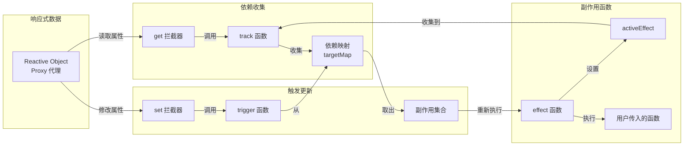

# 响应式原理

## ⭐ 面试重点速览

| 知识模块 | 重点内容 | 面试频率 |
|----------|----------|----------|
| Vue2 响应式 | Object.defineProperty 实现、数组劫持、$set/$delete 必要性 | 极高 |
| Vue3 响应式 | Proxy 实现、Reflect 配合、reactive/ref 对比 | 极高 |
| 依赖收集 | track 函数、effect 副作用函数、activeEffect 全局变量 | 极高 |
| 触发更新 | trigger 函数、effectStack 嵌套处理 | 高 |
| effectScope | 作用域管理、批量停止副作用 | 中高 |
| Vue2 vs Vue3 对比 | 为什么 Proxy 更好？为什么用 Reflect？ | 极高 |

---

## 一、Vue2 响应式系统

### 1.1 核心实现：Object.defineProperty

Vue 2 的响应式基于 `Object.defineProperty` 劫持对象的 getter/setter：

```js
/**
 * Vue 2 响应式核心 —— 简化实现
 * 通过 Object.defineProperty 劫持每个属性的 get/set
 */
function defineReactive(obj, key, val) {
  // 如果 val 是对象，递归劫持（Vue 2 在初始化时递归遍历所有属性）
  observe(val)

  // 每个属性对应一个 Dep 实例，管理依赖
  const dep = new Dep()

  Object.defineProperty(obj, key, {
    enumerable: true,
    configurable: true,
    get() {
      // 依赖收集：当前正在执行的 Watcher 收集到 Dep 中
      if (Dep.target) {
        dep.depend()
      }
      return val
    },
    set(newVal) {
      if (newVal === val) return
      val = newVal
      // 新赋的值如果是对象，也需要劫持
      observe(newVal)
      // 通知所有依赖更新
      dep.notify()
    }
  })
}

function observe(obj) {
  if (typeof obj !== 'object' || obj === null) return
  // 遍历对象的所有属性，逐个劫持
  Object.keys(obj).forEach(key => defineReactive(obj, key, obj[key]))
}
```

### 1.2 Vue 2 响应式的局限性

::: danger Vue 2 响应式的三大缺陷
1. **无法检测对象属性的添加和删除**：因为 `Object.defineProperty` 只能劫持已有属性，新增属性无法被代理
2. **数组变更检测不完整**：无法检测通过索引直接修改数组（`arr[0] = 'x'`）和修改数组长度（`arr.length = 0`）
3. **初始化时递归遍历**：对深层嵌套对象，初始化时需要递归遍历所有属性，性能开销大
:::

### 1.3 数组劫持的特殊处理

Vue 2 通过**重写数组原型方法**来劫持数组操作：

```js
/**
 * Vue 2 数组响应式 —— 重写 7 个变异方法
 */
const arrayProto = Array.prototype
const arrayMethods = Object.create(arrayProto)

// 7 个会改变原数组的方法
const methodsToPatch = [
  'push',
  'pop',
  'shift',
  'unshift',
  'splice',
  'sort',
  'reverse'
]

methodsToPatch.forEach(method => {
  const original = arrayProto[method]

  Object.defineProperty(arrayMethods, method, {
    value: function(...args) {
      // 先执行原始方法
      const result = original.apply(this, args)

      // 获取数组对应的 __ob__（Observer 实例）
      const ob = this.__ob__

      // 对于 push/unshift/splice 可能新增的元素，需要额外劫持
      let inserted
      switch (method) {
        case 'push':
        case 'unshift':
          inserted = args
          break
        case 'splice':
          inserted = args.slice(2)  // splice(start, deleteCount, ...items)
          break
      }
      if (inserted) ob.observeArray(inserted)  // 对新元素进行响应式处理

      // 通知依赖更新
      ob.dep.notify()
      return result
    }
  })
})

/**
 * 为什么 arr[0] = 'x' 和 arr.length = 0 不触发更新？
 * - arr[0] = 'x' 是通过索引直接赋值，Object.defineProperty 无法拦截
 * - arr.length = 0 是 length 属性，Vue 2 没有劫持 length
 *
 * 需要使用 Vue.set(arr, 0, 'x') 或 arr.splice(0, 1, 'x') 代替
 */
```

### 1.4 $set 和 $delete 的必要性

```js
/**
 * Vue 2 的 $set —— 为对象添加响应式属性
 * 原理：在新属性上调用 defineReactive，然后手动触发更新
 */
Vue.prototype.$set = function(target, key, value) {
  // 数组场景：使用 splice 触发更新
  if (Array.isArray(target)) {
    target.splice(key, 1, value)
    return value
  }
  // 对象场景：使用 defineReactive 劫持新属性
  defineReactive(target, key, value)
  // 手动通知依赖更新
  target.__ob__.dep.notify()
  return value
}

/**
 * Vue 2 的 $delete —— 删除属性并触发更新
 */
Vue.prototype.$delete = function(target, key) {
  delete target[key]
  target.__ob__.dep.notify()
}
```

---

## 二、Vue 3 响应式系统

### 2.1 核心实现：Proxy + Reflect

Vue 3 使用 ES6 的 `Proxy` 对整个对象进行代理，用 `Reflect` 配合操作：

```js
/**
 * Vue 3 响应式核心 —— reactive 简化实现
 * 使用 Proxy 代理整个对象，无需递归遍历
 */
function reactive(target) {
  // 基本类型或已代理对象直接返回
  if (typeof target !== 'object' || target === null) return target

  return new Proxy(target, {
    get(target, key, receiver) {
      // 依赖收集
      track(target, key)
      const result = Reflect.get(target, key, receiver)
      // 懒代理：嵌套对象只在访问时才进行代理
      return reactive(result)
    },
    set(target, key, value, receiver) {
      const oldValue = target[key]
      const result = Reflect.set(target, key, value, receiver)
      // 值发生变化时触发更新
      if (oldValue !== value) {
        trigger(target, key)
      }
      return result
    },
    deleteProperty(target, key) {
      const hadKey = Object.prototype.hasOwnProperty.call(target, key)
      const result = Reflect.deleteProperty(target, key)
      if (hadKey) {
        trigger(target, key)  // 删除属性也会触发更新
      }
      return result
    },
    has(target, key) {
      // in 操作符也进行依赖收集
      track(target, key)
      return Reflect.has(target, key)
    },
    ownKeys(target) {
      // 遍历操作（Object.keys / for...in）也进行依赖收集
      track(target, Symbol('iterate'))
      return Reflect.ownKeys(target)
    }
  })
}
```

### 2.2 为什么使用 Reflect？

::: tip Reflect 的三大作用
1. **正确的 receiver 传递**：确保 getter/setter 中的 `this` 指向代理对象而非原始对象
2. **统一的返回值**：`Reflect.set` 返回布尔值表示是否成功，比 `target[key] = value` 更可靠
3. **与 Proxy 拦截器一一对应**：`Reflect` 的方法和 `Proxy` handler 的方法完全对应，语义一致
:::

```js
/**
 * 演示 Reflect 的关键作用 —— receiver 传递
 */
const parent = {
  get name() {
    return this._name  // this 指向什么？
  }
}

const child = Object.create(parent)
child._name = 'child'

const proxy = new Proxy(child, {
  get(target, key, receiver) {
    // ❌ 错误：直接使用 Reflect.get(target, key)，this 指向 child（原始对象）
    // return Reflect.get(target, key)

    // ✅ 正确：传递 receiver，this 指向 proxy（代理对象）
    return Reflect.get(target, key, receiver)
  }
})

// 如果 receiver 传递不正确，访问 proxy.name 时，
// parent 的 get name() 中的 this 将指向 child 而不是 proxy
```

### 2.3 reactive vs ref vs shallowReactive vs shallowRef 对比

| API | 数据类型 | 代理层级 | 访问方式 | 使用场景 |
|-----|----------|----------|----------|----------|
| `reactive()` | 对象 | 深层代理 | 直接访问属性 | 复杂对象/数组的响应式 |
| `ref()` | 任意类型 | 深层代理（对象内部） | `.value` 访问 | 基本类型包装、模板引用 |
| `shallowReactive()` | 对象 | 仅第一层 | 直接访问属性 | 大量数据仅需浅层响应 |
| `shallowRef()` | 任意类型 | 仅 `.value` 本身 | `.value` 访问 | 大型对象替换而非修改 |

```js
import { reactive, ref, shallowReactive, shallowRef } from 'vue'

// reactive —— 深层代理，对象内所有嵌套属性都是响应式的
const state = reactive({
  user: { name: 'Alice', profile: { age: 25 } }
})
state.user.profile.age = 26  // 触发更新（深层代理）

// ref —— 包装任意值，通过 .value 访问
const count = ref(0)
count.value++  // 触发更新
// ref 内部对对象也使用 reactive 代理
const userRef = ref({ name: 'Bob' })
userRef.value.name = 'Charlie'  // 触发更新（深层代理）

// shallowReactive —— 仅第一层属性是响应式的
const shallow = shallowReactive({
  nested: { count: 0 }
})
shallow.nested = { count: 1 }   // 触发更新
shallow.nested.count = 2        // 不触发更新（内部属性非响应式）

// shallowRef —— 只有 .value 的替换才触发更新
const shallowData = shallowRef({ count: 0 })
shallowData.value = { count: 1 } // 触发更新（替换整个值）
shallowData.value.count = 2      // 不触发更新（内部修改不触发）
```

::: warning ref 的 .value 原理
`ref()` 内部创建了一个带 getter/setter 的类实例，getter 中调用 `track()`，setter 中调用 `trigger()`。模板中 ref 会自动解包（无需 `.value`），是因为 Vue 的模板编译器在编译时自动添加了 `.value`。
:::

---

## 三、依赖收集与触发更新

### 3.1 核心架构



### 3.2 track 函数 —— 依赖收集

```js
/**
 * 依赖收集核心 —— track 函数
 * 在 get 拦截器中被调用
 */

// 全局 WeakMap：target → Map(key → Set(effect))
const targetMap = new WeakMap()

// 当前正在执行的副作用函数
let activeEffect = null

function track(target, key) {
  // 没有活跃的 effect 时不收集（比如在组件外访问响应式数据）
  if (!activeEffect) return

  // 获取 target 对应的依赖映射
  let depsMap = targetMap.get(target)
  if (!depsMap) {
    targetMap.set(target, (depsMap = new Map()))
  }

  // 获取 key 对应的副作用集合
  let dep = depsMap.get(key)
  if (!dep) {
    depsMap.set(key, (dep = new Set()))
  }

  // 将当前 effect 添加到依赖集合中
  if (!dep.has(activeEffect)) {
    dep.add(activeEffect)
    // 反向收集：effect 也记录自己依赖了哪些 dep（用于清理）
    activeEffect.deps.push(dep)
  }
}
```

### 3.3 effect 函数 —— 副作用函数

```js
/**
 * 副作用函数 —— effect 实现
 * effect 是 Vue 3 响应式系统的最小执行单元
 */
function effect(fn, options = {}) {
  // 创建 effect 实例
  const _effect = new ReactiveEffect(fn, options)

  // 非懒执行时立即执行一次
  if (!options.lazy) {
    _effect.run()
  }

  // 返回 runner 函数，允许手动控制执行
  const runner = _effect.run.bind(_effect)
  runner.effect = _effect
  return runner
}

class ReactiveEffect {
  constructor(fn) {
    this.fn = fn          // 用户传入的函数
    this.deps = []        // 记录依赖的 dep 集合（用于清理）
    this.parent = null     // 父 effect（用于嵌套处理）
    this.active = true    // 是否激活
  }

  run() {
    if (!this.active) {
      return this.fn()    // 已停止的 effect 直接执行，不收集依赖
    }

    try {
      // 处理嵌套 effect：保存父级 activeEffect
      this.parent = activeEffect
      activeEffect = this

      // 清理旧的依赖（每次执行前清除，保证依赖始终是最新的）
      cleanupEffect(this)

      // 执行用户函数，期间访问的响应式数据会被 track 收集
      return this.fn()
    } finally {
      // 恢复父级 activeEffect
      activeEffect = this.parent
      this.parent = null
    }
  }

  stop() {
    if (this.active) {
      cleanupEffect(this)
      this.active = false
    }
  }
}

function cleanupEffect(effect) {
  const { deps } = effect
  if (deps.length) {
    for (let i = 0; i < deps.length; i++) {
      deps[i].delete(effect)
    }
    deps.length = 0
  }
}
```

### 3.4 trigger 函数 —— 触发更新

```js
/**
 * 触发更新核心 —— trigger 函数
 * 在 set/deleteProperty 拦截器中被调用
 */
function trigger(target, key, newValue) {
  const depsMap = targetMap.get(target)
  if (!depsMap) return

  // 收集需要执行的 effect
  const effects = new Set()

  // 1. 收集 key 对应的 effect
  const dep = depsMap.get(key)
  if (dep) {
    dep.forEach(effect => effects.add(effect))
  }

  // 2. 处理数组长度变化：当 key 是 'length' 且 target 是数组时
  //    需要触发索引大于等于新 length 的 effect
  if (Array.isArray(target) && key === 'length') {
    depsMap.forEach((dep, depKey) => {
      if (depKey >= newValue) {
        dep.forEach(effect => effects.add(effect))
      }
    })
  }

  // 3. 处理数组新增元素：当通过索引设置值时，触发 length 的 effect
  if (Array.isArray(target) && key !== 'length') {
    const lengthDep = depsMap.get('length')
    if (lengthDep) {
      lengthDep.forEach(effect => effects.add(effect))
    }
  }

  // 4. 触发 iterate 的 effect（用于 Object.keys / for...in 场景）
  const iterateDep = depsMap.get(Symbol('iterate'))
  if (iterateDep) {
    iterateDep.forEach(effect => effects.add(effect))
  }

  // 执行所有 effect
  effects.forEach(effect => {
    // 避免循环调用：如果当前 effect 正在执行中，跳过
    if (effect !== activeEffect) {
      if (effect.options && effect.options.scheduler) {
        // 调度执行（如 computed 的懒执行、组件的异步更新）
        effect.options.scheduler(effect)
      } else {
        effect.run()
      }
    }
  })
}
```

### 3.5 effectStack 嵌套处理

```js
/**
 * effect 嵌套处理 —— 组件渲染的典型场景
 *
 * 场景：父组件渲染 → 子组件渲染 → 父组件渲染
 * 如果没有 parent 指针，子组件渲染完成后 activeEffect 会丢失，
 * 导致父组件后续的响应式访问无法被正确收集
 */

// 嵌套 effect 执行流程
const parentEffect = new ReactiveEffect(() => {
  console.log('父组件渲染')
  // 执行子组件的 effect（子组件渲染）
  childEffect.run()
  // 这里的响应式访问需要被 parentEffect 收集
  console.log(state.someValue)
})

// 通过 parent 指针，子组件渲染完成后能正确恢复 activeEffect
//   1. activeEffect = parentEffect
//   2. parentEffect.parent = null
//   3. childEffect 执行时：activeEffect = childEffect, childEffect.parent = parentEffect
//   4. childEffect 执行完：activeEffect = parentEffect（恢复）
```

---

## 四、effectScope —— 副作用作用域

```js
import { effectScope, ref, watch, onScopeDispose } from 'vue'

/**
 * effectScope —— 批量管理副作用
 * 用于组件卸载时一次性停止所有副作用，避免手动逐个清理
 */
const scope = effectScope()

scope.run(() => {
  const count = ref(0)

  // 在 scope 内创建的 watcher/computed 都被 scope 管理
  watch(count, () => {
    console.log('count changed:', count.value)
  })

  // 注册清理回调
  onScopeDispose(() => {
    console.log('scope 被停止，清理资源')
  })
})

// 一次性停止 scope 内所有副作用
scope.stop()
// 输出："scope 被停止，清理资源"
// 此后 watch 不再响应 count 的变化
```

::: tip effectScope 的典型使用场景
- **组件销毁**：Vue 组件内部自动使用 effectScope，组件卸载时自动停止所有副作用
- **自定义 Hook**：在组合函数中使用 effectScope 管理内部副作用，对外暴露 stop 方法
- **测试环境**：每个测试用例使用独立的 effectScope，测试结束后清理
:::

---

## 五、Vue2 vs Vue3 响应式对比

### 5.1 核心差异

| 维度 | Vue 2 | Vue 3 |
|------|-------|-------|
| 实现方式 | `Object.defineProperty` | `Proxy` |
| 拦截能力 | 仅 get/set | get/set/deleteProperty/has/ownKeys 等 13 种操作 |
| 对象新增属性 | 无法检测（需 $set） | 自动检测 |
| 数组索引修改 | 无法检测 | 自动检测 |
| 数组 length 修改 | 无法检测 | 自动检测 |
| 初始化性能 | 递归遍历所有属性（慢） | 懒代理，按需劫持（快） |
| 内存占用 | 每个属性一个 Dep 实例 | 共享 proxy，内存更少 |
| Map/Set 支持 | 不支持 | 原生支持 |
| 浏览器兼容 | IE9+ | 不支持 IE（Proxy 不可 polyfill） |

### 5.2 Proxy 的优势

```js
/**
 * 直观对比：向对象新增属性
 */

// Vue 2 —— 需要 $set
const vm = new Vue({
  data: { obj: { a: 1 } }
})
vm.obj.b = 2           // ❌ 不触发更新
Vue.set(vm.obj, 'b', 2) // ✅ 需要手动使用 $set

// Vue 3 —— 自动检测
const state = reactive({ a: 1 })
state.b = 2             // ✅ 自动触发更新（Proxy 的 set 拦截器）
delete state.a          // ✅ 自动触发更新（Proxy 的 deleteProperty 拦截器）
```

---

## ⭐ 面试高频问题

### Q1：为什么 Vue 3 选择 Reflect 而不是直接操作 target？

```js
// 对比：直接操作 target vs 使用 Reflect

const obj = {
  _name: 'foo',
  get name() {
    return this._name  // this 指向问题！
  }
}

const proxy = new Proxy(obj, {
  get(target, key) {
    // ❌ 方式一：直接访问 target[key]
    // 问题：get name() 中的 this 指向 obj（原始对象），不是 proxy
    // 如果 _name 是响应式的，此处无法被 track 收集
    return target[key]

    // ✅ 方式二：使用 Reflect.get(target, key, receiver)
    // receiver 指向 proxy 对象，get name() 中的 this 指向 proxy
    // 访问 this._name 时，会再次触发 proxy 的 get 拦截器，正确收集依赖
    return Reflect.get(target, key, receiver)
  }
})
```

### Q2：reactive 的局限性是什么？

```js
// 局限性 1：不能替换整个对象
let state = reactive({ count: 0 })
state = reactive({ count: 1 })  // ❌ state 指向新对象，原响应式引用丢失

// 局限性 2：解构丢失响应式
const { count } = reactive({ count: 0 })
count++  // ❌ 解构后 count 是普通值，不再响应式

// 局限性 3：不能代理基本类型
const num = reactive(1)  // ❌ 报错或无效（Proxy 只能代理对象）

// 解决方案：使用 ref 或用 toRefs 保持解构响应式
const state = reactive({ count: 0 })
const { count } = toRefs(state)  // count 是 Ref 对象，保持响应式
```

### Q3：为什么组件渲染时能自动追踪依赖？

```
组件渲染流程中的响应式追踪：

1. 组件 setup 函数执行 → 创建组件渲染 effect
2. 渲染 effect 执行 → 调用组件的 render 函数
3. render 函数中访问响应式数据（如 state.count）→ 触发 Proxy 的 get
4. get 拦截器中调用 track() → 将当前渲染 effect 收集为依赖
5. 后续 state.count 变化 → 触发 set → trigger() → 重新执行渲染 effect → 组件更新
```

### Q4：Vue 3 的响应式是"精确更新"还是"全量更新"？

Vue 3 的更新是**组件级精确更新**。当一个响应式数据变化时，只有依赖该数据的组件才会重新渲染，不会影响兄弟组件或父组件（除非父组件也依赖了该数据）。

```vue
<script setup>
import { ref } from 'vue'

const count = ref(0)

// 只有当前组件依赖了 count，更新时只有当前组件重新渲染
// 兄弟组件和父组件不受影响
</script>
```

---

## 面试追问环节

### Q5：Vue 3 的 ref 内部是如何实现的？

```js
/**
 * ref 内部实现简化版
 */
class RefImpl {
  constructor(value) {
    this._value = toReactive(value)  // 对象转为 reactive，基本类型直接存储
    this._rawValue = value           // 保存原始值
    this.dep = new Set()            // 依赖集合（ref 只有一个 dep）
  }

  get value() {
    trackRefValue(this)  // 依赖收集
    return this._value
  }

  set value(newVal) {
    // 使用 Object.is 判断（处理 NaN 情况）
    if (Object.is(newVal, this._rawValue)) return
    this._rawValue = newVal
    this._value = toReactive(newVal)
    triggerRefValue(this)  // 触发更新
  }
}

function trackRefValue(ref) {
  if (activeEffect) {
    ref.dep.add(activeEffect)
  }
}

function triggerRefValue(ref) {
  ref.dep.forEach(effect => {
    effect.run()
  })
}
```

### Q6：computed 是如何实现缓存的？

```js
/**
 * computed 缓存机制简化实现
 */
class ComputedRefImpl {
  constructor(getter) {
    this._dirty = true       // 标记是否需要重新计算
    this._value = undefined  // 缓存的计算结果
    // 创建一个 lazy effect：依赖变化时只标记 dirty，不立即执行
    this.effect = new ReactiveEffect(getter, {
      lazy: true,
      scheduler: () => {
        if (!this._dirty) {
          this._dirty = true  // 依赖变化时标记为脏
          triggerRefValue(this)  // 通知 computed 的依赖者更新
        }
      }
    })
  }

  get value() {
    trackRefValue(this)  // 收集 computed 的依赖者
    if (this._dirty) {
      this._value = this.effect.run()  // 重新计算
      this._dirty = false              // 标记为干净
    }
    return this._value  // 返回缓存值
  }
}
```