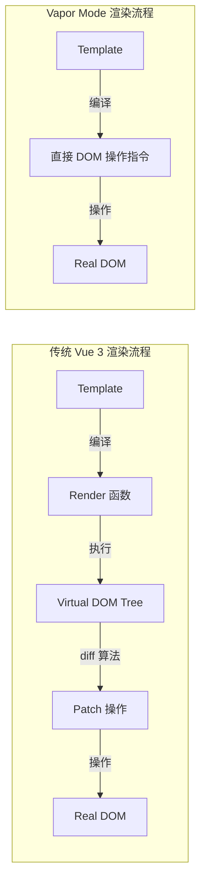
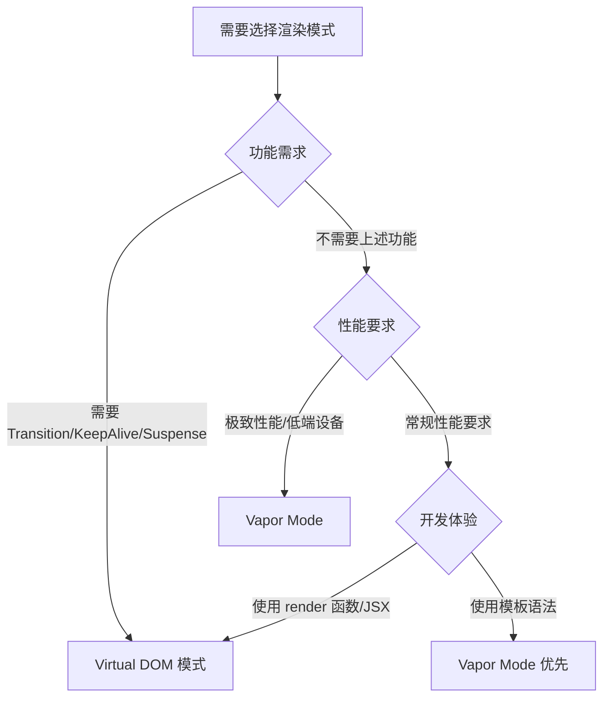

# Vapor Mode（无虚拟 DOM 模式）

## ⭐ 面试重点速览

| 知识模块 | 重点内容 | 面试频率 |
|----------|----------|----------|
| 设计理念 | 无 Virtual DOM、编译期直接生成 DOM 操作指令 | 中高 |
| 与传统 Vue 3 对比 | 包体积减少、运行时开销降低、无 diff 算法 | 中高 |
| 适用场景与限制 | 性能敏感场景、不支持的功能（如 render 函数） | 中 |
| 与 Solid.js 对比 | 编译策略异同、响应式粒度 | 中 |

---

## 一、Vapor Mode 设计理念

### 1.1 什么是 Vapor Mode？

Vapor Mode（蒸汽模式）是 Vue 3.6 引入的实验性编译策略，核心思想是**在编译阶段将模板编译为直接操作 DOM 的指令，完全跳过 Virtual DOM 层**。它的名字来源于"蒸发（Vaporize）掉 Virtual DOM"。



### 1.2 核心原理

```html
<!-- 传统 Vue 3 模板 -->
<template>
  <div class="counter">
    <button @click="decrement">-</button>
    <span>{{ count }}</span>
    <button @click="increment">+</button>
  </div>
</template>
```

```js
/**
 * 传统 Vue 3 编译结果（简化）
 * 生成 Virtual DOM 树 → diff 对比 → patch 更新
 */
export function render(_ctx, _cache) {
  return (_openBlock(), _createElementBlock("div", { class: "counter" }, [
    _createElementVNode("button", { onClick: _ctx.decrement }, "-"),
    _createElementVNode("span", null, _toDisplayString(_ctx.count), 1),
    _createElementVNode("button", { onClick: _ctx.increment }, "+")
  ]))
}
```

```js
/**
 * Vapor Mode 编译结果（简化示意）
 * 编译为直接操作 DOM 的指令，跳过 Virtual DOM 层
 *
 * 核心思路：
 * 1. 模板编译时分析出哪些节点是静态的、哪些是动态的
 * 2. 静态节点只创建一次
 * 3. 动态节点直接生成 DOM 操作指令（setText、setAttribute 等）
 * 4. 响应式数据变化时，直接调用对应的 DOM 操作指令
 */

// 初始渲染 —— 创建 DOM 结构
const root = document.createElement('div')
root.className = 'counter'

const btnDec = document.createElement('button')
btnDec.addEventListener('click', () => ctx.decrement())
btnDec.textContent = '-'

const span = document.createElement('span')
// 动态文本绑定 —— 直接使用 effect 更新 DOM
const textEffect = effect(() => {
  span.textContent = ctx.count  // 直接操作 DOM，无需 diff
})

const btnInc = document.createElement('button')
btnInc.addEventListener('click', () => ctx.increment())
btnInc.textContent = '+'

root.append(btnDec, span, btnInc)
```

---

## 二、与传统 Vue 3 对比

### 2.1 架构对比

| 维度 | 传统 Vue 3 | Vapor Mode |
|------|-----------|------------|
| Virtual DOM | 有（完整的 VNode 树） | 无（直接操作 DOM） |
| 编译产物 | render 函数 → VNode | DOM 操作指令 |
| 响应式更新 | 组件级精确更新（仍需要 diff） | 节点级精确更新（直接 setText） |
| diff 算法 | 有（patchFlag 优化） | 无（不需要 diff） |
| 运行时体积 | 约 10KB gzipped（核心运行时） | 预计减少 30-50% |
| 内存占用 | 需要维护 VNode 树 | 无需 VNode 树，内存更少 |
| 首次渲染 | 创建 VNode → 渲染 | 直接创建 DOM 元素 |

### 2.2 性能对比示例

```js
/**
 * 场景：列表渲染 10000 条数据
 */

// 传统 Vue 3 —— 创建 10000 个 VNode，执行 diff 算法
// 每次更新需要遍历 VNode 树进行 diff
<ul>
  <li v-for="item in list" :key="item.id">
    {{ item.name }}
  </li>
</ul>

// Vapor Mode —— 每条数据直接绑定 DOM 更新指令
// 更新单个 item.name 时，直接调用 element.textContent = newValue
// 无需遍历整个列表，无需 diff 算法
```

### 2.3 包体积减少

```
传统 Vue 3 运行时核心拆分：
┌────────────────────────────────────────────┐
│ 响应式系统 (@vue/reactivity)    ~3KB gzip  │
│ 运行时核心 (@vue/runtime-core)  ~5KB gzip  │
│   - Virtual DOM（创建、diff、patch）        │
│   - 组件系统（生命周期、插槽、provide）       │
│ 运行时 DOM (@vue/runtime-dom)   ~2KB gzip  │
│   - DOM 操作（属性、事件、样式）              │
├────────────────────────────────────────────┤
│ 合计：约 10KB gzipped                      │
└────────────────────────────────────────────┘

Vapor Mode 运行时拆分（预计）：
┌────────────────────────────────────────────┐
│ 响应式系统（精简版）             ~2KB gzip  │
│ Vapor 运行时                    ~2KB gzip  │
│   - DOM 操作指令                          │
│   - 组件系统（精简）                        │
│ 编译器输出（内联到构建产物）       ~1KB gzip │
├────────────────────────────────────────────┤
│ 合计：约 5KB gzipped（减少约 50%）         │
└────────────────────────────────────────────┘
```

---

## 三、适用场景与限制

### 3.1 适用场景

::: tip Vapor Mode 最适合的场景
1. **性能敏感的应用**：需要极致首屏渲染速度（如 Landing Page、活动页）
2. **低端设备**：内存受限设备（如 IoT 设备、低端手机）
3. **静态内容为主**：大部分内容不需要动态更新的页面
4. **嵌入式场景**：将 Vue 嵌入到现有非 Vue 项目中
5. **微前端子应用**：追求最小包体积的子应用
:::

### 3.2 当前限制

::: danger Vapor Mode 不支持的功能（2025 年实验阶段）
| 功能 | 状态 | 备注 |
|------|------|------|
| render 函数 / JSX | 不支持 | 核心区别 —— 编译期必须分析模板 |
| 动态组件 `<component :is>` | 部分支持 | 有限制 |
| Transition / TransitionGroup | 不支持 | 需要 Virtual DOM 生命周期 |
| KeepAlive | 不支持 | 需要 Virtual DOM 缓存 |
| Teleport | 部分支持 | 实现方式不同 |
| Suspense | 不支持 | 依赖 Virtual DOM 异步渲染 |
| 自定义指令 | 部分支持 | 需要适配 Vapor Mode API |
| provide/inject | 支持 | 不依赖 Virtual DOM |
| Composition API | 支持 | 响应式系统保留 |
| 插槽 | 支持 | 编译为静态回调 |
:::

### 3.3 与传统模式共存

Vue 3.6 的设计允许 Vapor Mode 与传统 Virtual DOM 模式**共存**：

```vue
<!-- 通过 vapor 标记启用 Vapor Mode 编译 -->
<template vapor>
  <!-- 此组件使用 Vapor Mode 编译，无 Virtual DOM -->
  <div class="simple-component">
    <p>{{ message }}</p>
  </div>
</template>

<!-- 不使用 vapor 标记的组件保持传统 Virtual DOM 模式 -->
<template>
  <!-- 此组件使用传统 Virtual DOM 模式 -->
  <div class="complex-component">
    <Transition name="fade">
      <p v-if="show">{{ message }}</p>
    </Transition>
  </div>
</template>
```

---

## 四、与 Solid.js 的对比

Vapor Mode 的编译策略与 Solid.js 有相似之处，但也有关键区别：

| 维度 | Vue 3 Vapor Mode | Solid.js |
|------|-----------------|----------|
| 核心理念 | 无 Virtual DOM 编译 | Signals 精密响应式 |
| 响应式系统 | Vue 3 响应式系统（Proxy） | 自研 Signals（getter/setter） |
| 编译策略 | 模板 → DOM 操作指令 | JSX → DOM 操作指令 |
| 组件模型 | 完整 Vue 组件（生命周期等） | 函数组件（无生命周期） |
| API 风格 | Vue 模板语法 / Composition API | 类 React Hooks 风格 |
| 生态 | Vue 生态（Router/Pinia 等） | 自有生态（较新，相对较小） |
| 学习成本 | Vue 开发者零成本迁移 | 需要学习新的 API 设计 |

```js
// Solid.js —— 纯粹的 Signals 响应式
import { createSignal, createEffect } from 'solid-js'

function Counter() {
  const [count, setCount] = createSignal(0)

  createEffect(() => {
    console.log('Count is:', count())  // 精确追踪，只更新使用了 count 的 DOM
  })

  return (
    <div>
      <button onClick={() => setCount(count() - 1)}>-</button>
      <span>{count()}</span>
      <button onClick={() => setCount(count() + 1)}>+</button>
    </div>
  )
}

// Vue Vapor Mode —— 模板语法 + Vue 响应式，但编译为类似的 DOM 操作
// 既保留了 Vue 的开发体验，又获得了 Solid 级别的性能
```

---

## ⭐ 面试高频问题

### Q1：Vapor Mode 解决什么问题？

**核心问题**：Virtual DOM 虽然解决了声明式 UI 的更新效率问题，但它本身引入了额外的运行时开销：

1. **内存开销**：每次渲染需要创建 VNode 树，对于大型组件树，内存占用显著
2. **diff 开销**：即使有 patchFlag 优化，仍需遍历组件树进行 diff
3. **包体积**：Virtual DOM 的实现代码（createVNode、diff、patch）占运行时体积的约 40-50%

Vapor Mode 通过**编译期分析**直接跳过 Virtual DOM 层，在编译阶段将模板转换为高效的 DOM 操作指令，从而消除上述开销。

### Q2：Vapor Mode 和 Virtual DOM 模式如何选择？



### Q3：Vapor Mode 会取代传统 Virtual DOM 模式吗？

**短期不会**。Vapor Mode 和传统 Virtual DOM 模式将长期共存：

- **Vapor Mode**：适合性能敏感、功能简单的场景
- **Virtual DOM 模式**：适合需要高级特性（Transition、KeepAlive、Suspense 等）的复杂场景
- **共存策略**：Vue 3.6 支持在同一应用中使用两种模式，按需选择

### Q4：Vapor Mode 对 Vue 生态的影响？

| 影响方面 | 说明 |
|----------|------|
| 组件库 | 需要适配 Vapor Mode，但传统 Virtual DOM 模式仍然可用 |
| 状态管理 | Pinia 不依赖 Virtual DOM，兼容 Vapor Mode |
| 路由 | Vue Router 需要适配，但核心路由逻辑不依赖 Virtual DOM |
| SSR | Nuxt 可能受益于 Vapor Mode 的更小体积和更快渲染 |
| 开发者 | 学习成本低，Vapor Mode 使用相同的模板语法和 Composition API |

---

## 面试追问环节

### Q5：Vapor Mode 如何实现列表渲染的精确更新？

```js
/**
 * 传统 Vue 3 列表渲染 —— 通过 diff 算法和 key 来复用/更新节点
 * Vapor Mode 列表渲染 —— 为每个列表项建立独立的响应式绑定
 */

// 传统 Vue 3：v-for 生成 VNode 数组，通过 key 进行 diff
// <li v-for="item in list" :key="item.id">{{ item.name }}</li>

// Vapor Mode 编译产物（概念示意）
// 为每个列表项创建独立的 DOM 操作效果
function renderList(container, list, renderItem) {
  // 维护 DOM 节点映射（key → DOM 节点）
  const keyMap = new Map()

  // 监听列表变化
  effect(() => {
    const newKeys = new Set()

    list.value.forEach((item, index) => {
      newKeys.add(item.id)

      if (!keyMap.has(item.id)) {
        // 新项：创建 DOM 并插入
        const dom = renderItem(item)
        keyMap.set(item.id, dom)
        container.insertBefore(dom, container.children[index])
      } else {
        // 已存在：移动 DOM 到正确位置
        const dom = keyMap.get(item.id)
        container.insertBefore(dom, container.children[index])
      }
    })

    // 移除不再存在的 DOM 节点
    keyMap.forEach((dom, key) => {
      if (!newKeys.has(key)) {
        dom.remove()
        keyMap.delete(key)
      }
    })
  })
}
```

### Q6：Vapor Mode 的响应式更新粒度是什么？

**节点级（Node-level）更新**。传统 Vue 3 是组件级更新（一个响应式数据变化触发整个组件重新渲染），而 Vapor Mode 是节点级更新（响应式数据变化只更新绑定了该数据的 DOM 节点）。

```js
// 传统 Vue 3：组件级更新
// state.name 变化 → 整个组件重新渲染 → 遍历 VNode 树 → diff → patch

// Vapor Mode：节点级更新
// state.name 变化 → 直接找到绑定了 state.name 的 DOM 节点 → 更新 textContent
// 其他节点完全不受影响，无需任何遍历
```