# 高级工程师 / AI应用工程师 面试准备知识图谱

> **创建日期：** 2026-06-06
> **适用岗位：** 高级Java工程师、AI应用工程师、技术专家
> **目标公司：** 一线互联网/科技公司（BAT、TMD、字节、蚂蚁等）

---

## 一、知识图谱总览

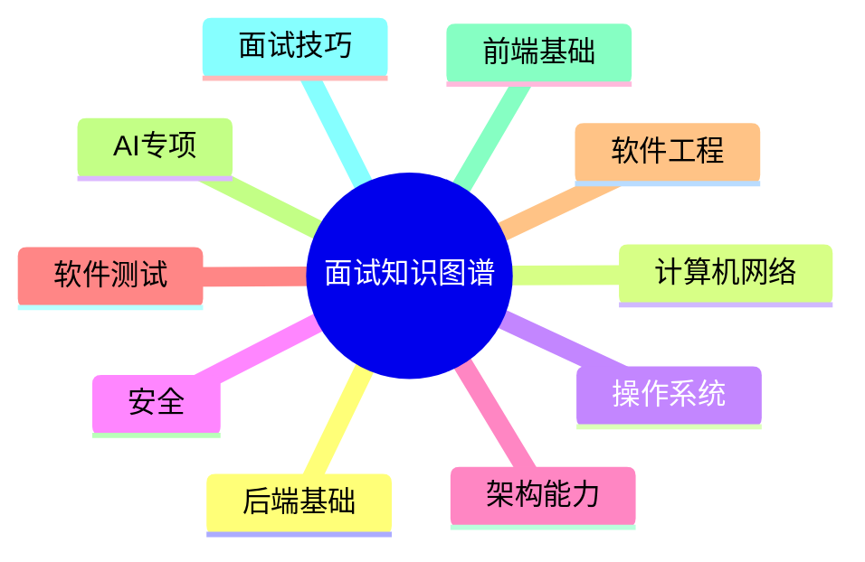

---

## 二、详细知识域图谱

### 2.1 Java高级知识域

> [!TIP]
> **Java高级**是整个后端技术栈的基石，所有上层框架和中间件的理解都依赖于此。面试中占比约 **25%~30%**。

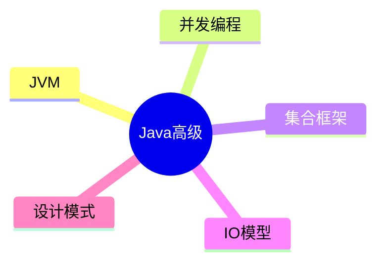

---

### 2.2 Spring生态知识域

> [!TIP]
> **Spring生态**是Java后端开发的标配，70%以上企业项目均基于此构建。面试中占比约 **20%~25%**。

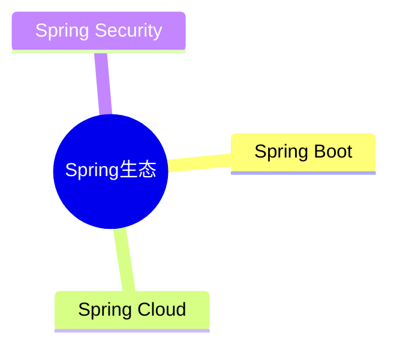

---

### 2.3 数据库知识域

> [!WARNING]
> 数据库是面试的**绝对核心**，几乎所有系统设计题都涉及存储方案设计。面试中占比约 **15%~20%**。

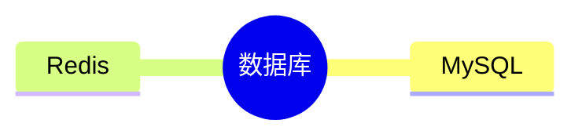

---

### 2.4 中间件知识域

> [!INFO]
> 中间件是**高级工程师**区别于普通工程师的关键分野，大厂面试中必问。面试占比约 **10%~15%**。

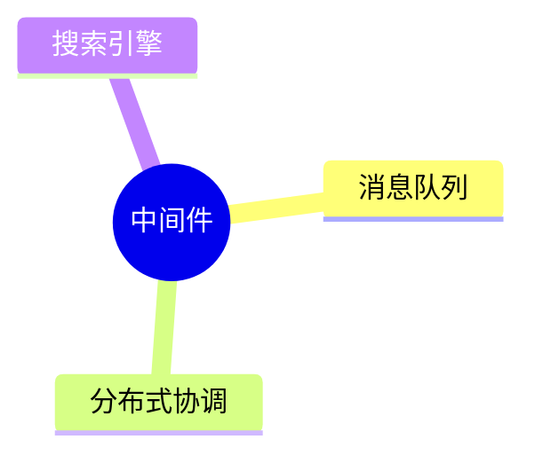

---

### 2.5 高并发架构知识域

> [!WARNING]
> 高并发架构是**P6+/P7**的分水岭，直接影响定级。大厂必考系统设计题。面试占比约 **15%~20%**。

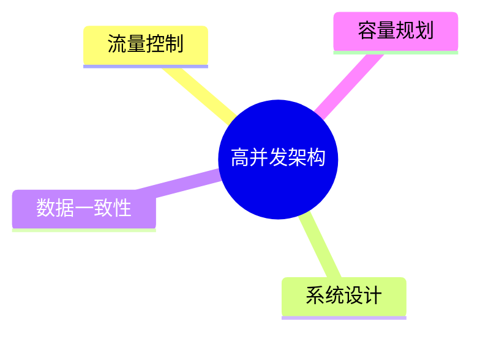

---

### 2.6 AI应用知识域

> [!TIP]
> **AI应用工程**是2024-2026年最热门方向，人才缺口大，薪资溢价明显。面试占比约 **20%~25%**（AI应用工程师岗可达40%）。

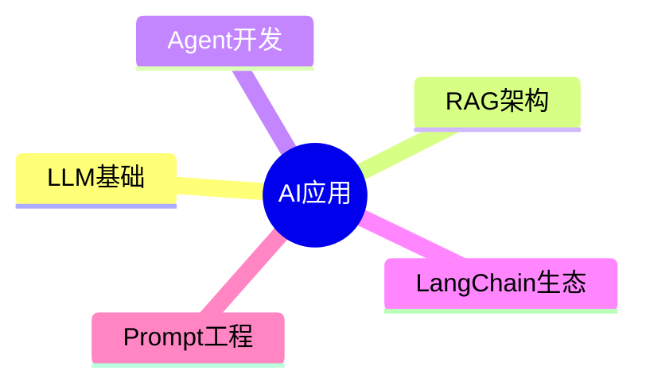

---

### 2.7 前端知识域

> [!INFO]
> 前端知识对**高级工程师**和**AI应用工程师**都至关重要（全栈能力、Demo展示、内部工具开发）。面试占比约 **10%~15%**，AI应用工程师岗可达 **20%**。

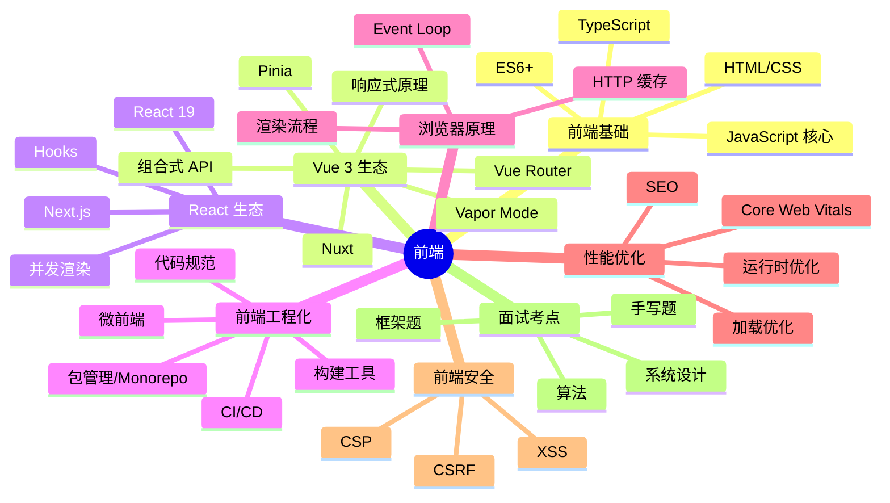

---

### 2.8 DevOps知识域

> [!INFO]
> DevOps体现**工程素养**，高级工程师需要具备端到端交付能力。面试占比约 **5%~10%**。

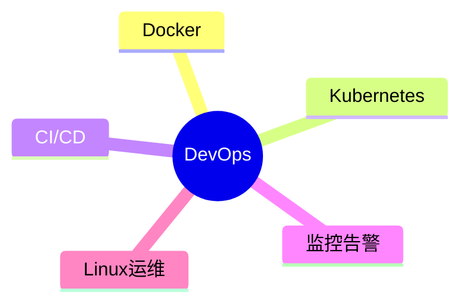

---

### 2.9 计算机网络知识域

> [!WARNING]
> 计算机网络是后端面试**三大必考基础**之一（Java基础、数据库、计算机网络）。面试占比约 **10%~15%**。

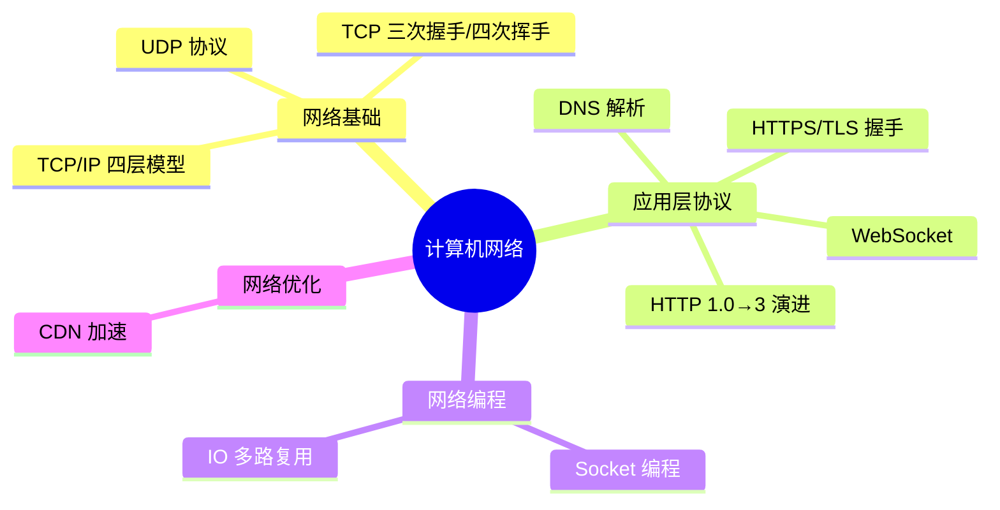

---

### 2.10 操作系统知识域

> [!WARNING]
> 操作系统是理解并发、IO、内存的底层基础，大厂面试中频繁考察。面试占比约 **8%~10%**。

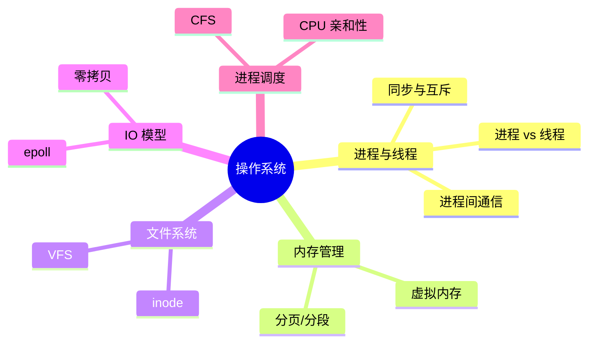

---

### 2.11 安全知识域

> [!WARNING]
> 安全知识是高级工程师的必备素养，OAuth2/JWT/加密几乎必问。面试占比约 **5%~10%**。

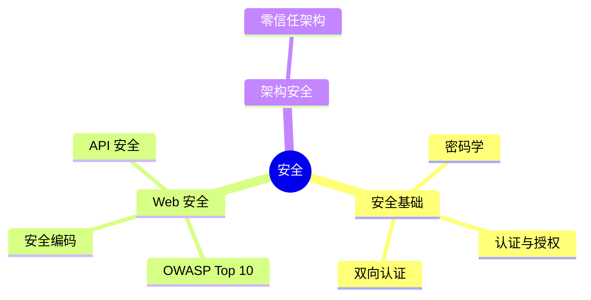

---

### 2.12 软件测试知识域

> [!INFO]
> 测试能力是高级工程师工程素养的体现，单元测试策略、Mock、TDD是高频考点。面试占比约 **5%~8%**。

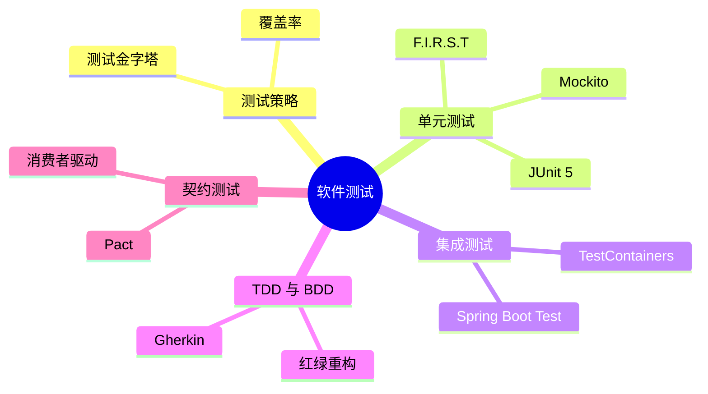

---

### 2.13 软件工程知识域

> [!INFO]
> 编码规范、设计原则、重构与Code Review反映了高级工程师的工程深度。面试占比约 **5%~8%**。

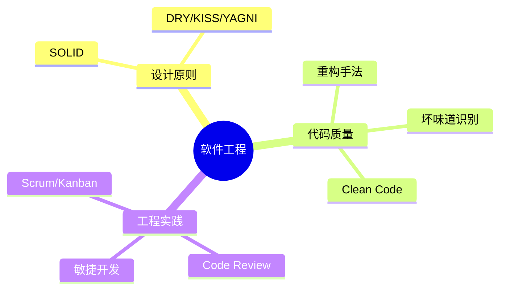

---

### 2.14 大数据基础知识域

> [!INFO]
> 大数据基础在部分公司面试中涉及，是后端工程师的场景扩展。面试占比约 **3%~5%**（视岗位而定）。

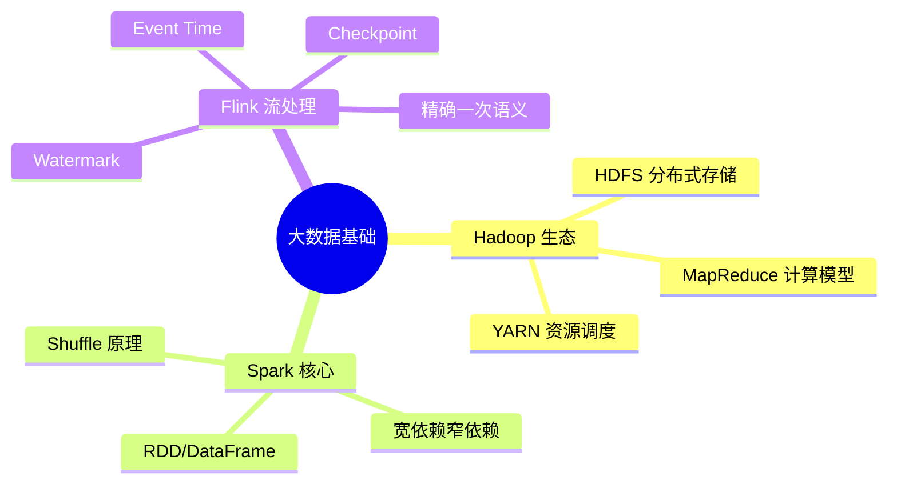

---

### 2.15 技术管理知识域

> [!INFO]
> 面向 P7+/技术专家岗位，涉及技术管理、技术决策和团队协作。面试占比约 **3%~5%**。

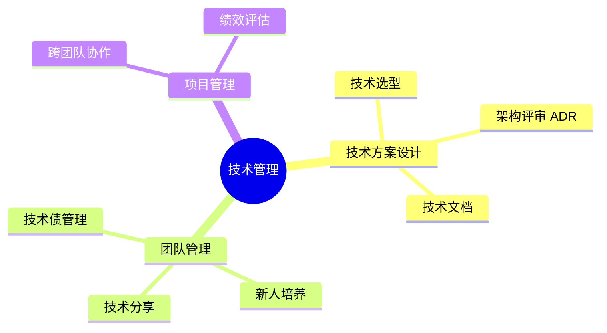

---

### 2.16 算法专题知识域

> [!TIP]
> **算法专题**是从经典算法到 AI 算法的完整知识体系，每个算法按"场景→原理→趣味解说→优缺点"统一模板组织。面试中占比约 **10%~15%**（大厂算法面），对 AI 应用工程师岗位可达 **20%~25%**。

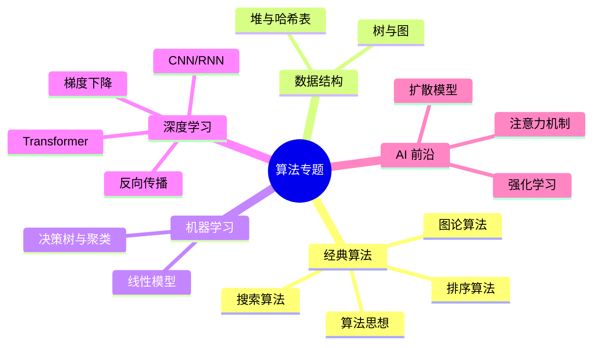

---

### 2.17 面试技巧知识域

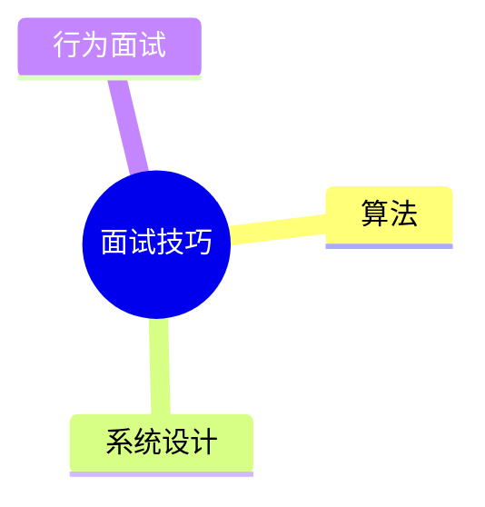

---

## 三、知识域依赖关系

> 箭头方向表示「前置依赖关系」—— 只有掌握了前置知识，才能有效学习后续内容。

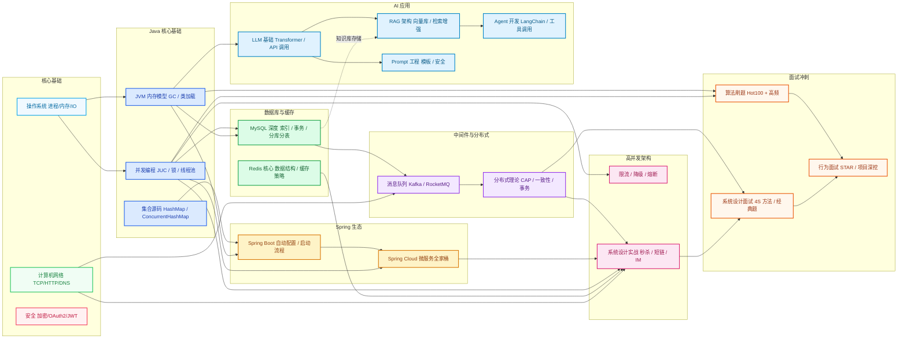

---

## 四、技术路线图（学习路线建议）

> 以下展示了从当前基础到面试通关的完整学习路径，从左到右逐步递进，每个阶梯内的箭头表示推荐学习顺序。

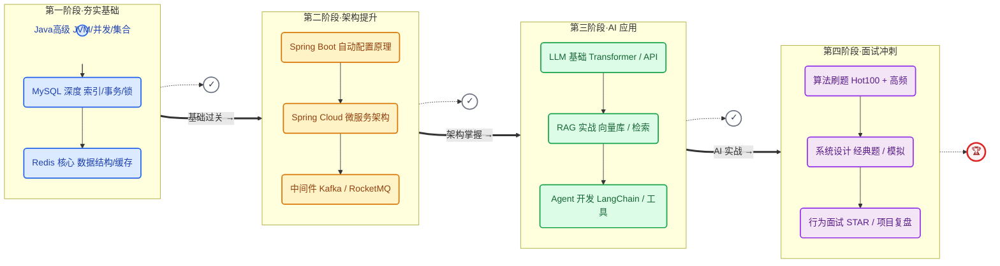

### 各阶段核心目标与产出

| 阶段 | 时间 | 核心目标 | 关键产出 | 难度 |
|------|------|----------|----------|------|
| 📘 夯实基础 | 第1-4周 | 源码级理解 Java 核心、MySQL 索引/事务 | 完成 java-core 示例、JVM 笔记 | ⭐⭐⭐⭐ |
| 🏗️ 架构提升 | 第5-8周 | 掌握微服务架构、中间件原理与实战 | 搭建微服务 Demo、MQ 实践 | ⭐⭐⭐⭐⭐ |
| 🤖 AI 应用 | 第9-12周 | 独立搭建 RAG 系统、开发 Agent 应用 | 完成 RAG Chatbot、Agent 项目 | ⭐⭐⭐⭐ |
| 🎯 面试冲刺 | 第13-16周 | 算法题量 100+、系统设计 5+ 模拟 | 刷题记录、项目复盘文档 | ⭐⭐⭐⭐⭐ |

---

## 五、学习时间线总览（甘特图）

> 以下甘特图清晰展示了 16 周的完整学习节奏，每项任务的「前置依赖」和「并行关系」一目了然。

```mermaid
gantt
    title 高级工程师 / AI 应用工程师 面试准备时间线
    dateFormat  YYYY-MM-DD
    axisFormat  第%W周
    tickInterval 1week

    section 第一阶段·夯实基础
    JVM 内存模型与调优           :a1, 2026-06-08, 7d
    并发编程（JUC/锁/线程池）    :a2, after a1, 7d
    集合源码解析                 :a3, after a2, 5d
    MySQL 索引与事务             :a4, after a1, 7d
    Redis 核心数据结构           :a5, after a4, 5d
    设计模式复习                 :a6, after a3, 3d
    阶段一自检 + 整理笔记        :a7, after a6, 2d

    section 第二阶段·架构提升
    Spring Boot 核心原理         :b1, after a7, 5d
    Spring Cloud 微服务          :b2, after b1, 7d
    Spring Security + OAuth2     :b3, after b2, 3d
    Kafka / RocketMQ 消息队列     :b4, after b1, 7d
    分布式理论 + 一致性协议      :b5, after b4, 5d
    高并发设计（限流/熔断/降级）  :b6, after b5, 5d
    阶段二自检 + 项目实战        :b7, after b6, 3d

    section 第三阶段·AI 应用
    LLM 基础（Transformer/API）   :c1, after b7, 5d
    RAG 架构 + 向量数据库         :c2, after c1, 7d
    Agent 开发（LangChain）       :c3, after c2, 7d
    Prompt 工程实践               :c4, after c1, 3d
    阶段三自检 + AI 项目实战      :c5, after c3, 5d

    section 第四阶段·面试冲刺
    LeetCode Hot100 刷题          :d1, after c5, 10d
    系统设计面试（5+ 经典题）     :d2, after c5, 8d
    行为面试（STAR + 项目梳理）   :d3, after d2, 4d
    模拟面试 + 查漏补缺           :d4, after d3, 4d
    简历优化 + 投递准备           :d5, after d4, 2d
```

> **使用建议：** 甘特图中的日期为示例，建议根据自己的实际开始日期调整 `dateFormat`。每项任务可以按实际进度自主调整时长。

---

## 六、各阶段时间与精力分配建议

| 阶段 | 时间预算 | 精力占比 | 重点产出 |
|------|----------|----------|----------|
| 夯实基础 | 2~4 周 | 25% | 源码级理解Java核心、MySQL索引/事务 |
| 架构提升 | 3~5 周 | 35% | 独立完成高并发系统设计、微服务架构设计 |
| AI专项 | 3~4 周 | 25% | 独立搭建RAG系统、开发Agent应用 |
| 冲刺面试 | 2~3 周 | 15% | 刷完Hot100、完成5+系统设计模拟 |

---

## 七、推荐资源

### 书籍

| 书名 | 适用阶段 | 说明 |
|------|----------|------|
| 《深入理解Java虚拟机(第3版)》 | 夯实基础 | JVM圣经，必读 |
| 《Java并发编程的艺术》 | 夯实基础 | JUC深入理解 |
| 《高性能MySQL(第4版)》 | 夯实基础 | MySQL必读 |
| 《Redis设计与实现》 | 夯实基础 | Redis源码级讲解 |
| 《Spring Boot编程思想》 | 架构提升 | Spring Boot深入 |
| 《企业IT架构转型之道》 | 架构提升 | 阿里巴巴中台实践 |
| 《设计数据密集型应用》(DDIA) | 架构提升 | 分布式系统圣经 |
| 《大规模分布式存储系统》 | 架构提升 | 分布式存储实践 |

### 在线资源

| 资源 | 说明 |
|------|------|
| LeetCode Hot100 | 算法刷题首选 |
| 小林Coding 图解系列 | 计算机基础图解 |
| LangChain官方文档 | AI应用开发权威参考 |
| DeepLearning.AI Short Courses | LLM/RAG/Agent短期课程 |
| GitHub Trending (LangChain/AutoGPT) | 跟踪AI应用最新动态 |
| 各大厂技术博客 (美团/字节/阿里) | 实战案例最佳来源 |

---

> [!WARNING]
> **注意：** 面试准备是一个系统工程，建议至少预留 **10~15 周** 的完整准备时间。
> 如果同时准备 **AI应用工程师** 方向，AI专项部分需要额外增加 2~3 周深入实战。
> 切忌跳过基础直接看面经，扎实的内功才是面试通关的根本保障。
