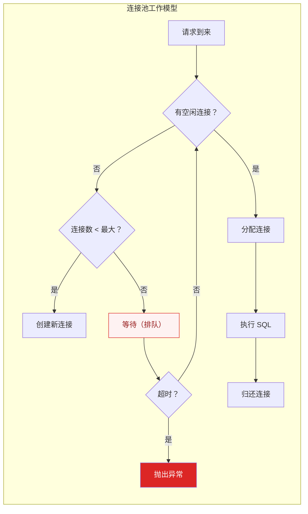

# 数据库连接池优化

## 概述

数据库连接池是高并发系统中最容易被忽视的瓶颈之一。一个配置不当的连接池，轻则导致请求排队超时，重则拖垮整个数据库。本专题深入讲解 HikariCP 和 Druid 的核心原理、参数调优和常见问题排查。

::: tip 核心认知
数据库连接是昂贵的资源——创建连接需要 TCP 握手 + MySQL 认证，耗时 10~50ms。连接池的核心价值是**复用连接，避免频繁创建和销毁**。
:::

## 一、连接池核心参数



### HikariCP 关键参数

| 参数 | 默认值 | 说明 | 建议值 |
|------|--------|------|--------|
| `maximumPoolSize` | 10 | 最大连接数 | 根据公式计算 |
| `minimumIdle` | 10（同 max） | 最小空闲连接数 | 保持与 max 相同 |
| `connectionTimeout` | 30000ms | 等待连接超时 | 1000~3000ms |
| `idleTimeout` | 600000ms | 空闲连接超时 | 保持默认 |
| `maxLifetime` | 1800000ms | 连接最大存活时间 | 比 MySQL wait_timeout 小 |
| `keepaliveTime` | 0（禁用） | 保活检测间隔 | 30000ms |
| `leakDetectionThreshold` | 0（禁用） | 连接泄漏检测 | 开发环境 10000ms |

### 连接池大小计算公式

```
poolSize = Tn × (Cm - 1) + 1

其中：
  Tn = 最大线程数（CPU 核数 × 2）
  Cm = 单个连接最大并发数（通常是 1）

简化公式：
  poolSize = CPU 核数 × 2 + 1 + 磁盘数  // 适合大多数场景
```

**示例**：4 核 CPU + 1 块 SSD
- poolSize = 4 × 2 + 1 + 1 = 10

> 注意：连接池并非越大越好，连接数过多会导致数据库 CPU 上下文切换频繁，反而降低性能。

## 二、HikariCP 为什么快？

### 2.1 核心优化技术

| 优化点 | 原理 | 效果 |
|--------|------|------|
| **FastList** | 自定义 ArrayList，去掉 rangeCheck | 减少边界检查开销 |
| **ConcurrentBag** | 无锁设计的连接池容器 | 高并发下无锁竞争 |
| **Javassist 字节码优化** | 编译期生成代理类，避免反射 | 减少代理开销 |
| **精简代码** | 约 100KB 的 jar 包 | 减少类加载时间 |
| **连接预热** | 启动时预创建连接 | 避免首次请求冷启动 |

### 2.2 ConcurrentBag 设计

```java
// ConcurrentBag 核心思想：ThreadLocal 缓存 + 无锁队列
public class ConcurrentBag<T extends IConcurrentBagEntry> {
    // 每个线程缓存自己用过的连接（ThreadLocal）
    private final ThreadLocal<List<Object>> threadList;
    
    // 共享队列（所有线程可见）
    private final SynchronousQueue<T> sharedQueue;
    
    public T borrow(long timeout) {
        // 1. 先从 ThreadLocal 中取（无锁，极快）
        List<Object> list = threadList.get();
        for (int i = list.size() - 1; i >= 0; i--) {
            T entry = (T) list.remove(i);
            if (entry.compareAndSet(STATE_NOT_IN_USE, STATE_IN_USE)) {
                return entry;  // 命中 ThreadLocal 缓存
            }
        }
        
        // 2. ThreadLocal 未命中，从共享队列取
        T entry = sharedQueue.poll();
        if (entry != null) return entry;
        
        // 3. 创建新连接（如果未达到上限）
        return createNewEntry();
    }
}
```

**设计精髓**：大部分情况下，连接从 ThreadLocal 中获取，无需加锁，性能极高。

## 三、Druid 监控能力

Druid 的核心优势不在性能（HikariCP 更快），而在**监控和诊断能力**。

### 3.1 核心监控指标

| 指标 | 含义 | 排查方向 |
|------|------|----------|
| ActiveCount | 当前活跃连接数 | 接近 max → 需要扩容 |
| WaitThreadCount | 等待连接的线程数 | > 0 → 连接池不足 |
| NotEmptyWaitCount | 等待连接的总次数 | 趋势上升 → 性能瓶颈 |
| LogicConnectCount | 逻辑连接数 | 连接使用频率 |
| ExecuteCount | SQL 执行次数 | 业务负载 |
| ErrorCount | 错误次数 | 连接/执行异常 |

### 3.2 Druid 配置示例

```yaml
spring:
  datasource:
    druid:
      url: jdbc:mysql://localhost:3306/mydb
      username: root
      password: xxx
      # 连接池配置
      initial-size: 5
      min-idle: 5
      max-active: 20
      max-wait: 3000  # 等待连接超时
      # 监控配置
      stat-view-servlet:
        enabled: true
        url-pattern: /druid/*
      filter:
        stat:
          enabled: true
          log-slow-sql: true
          slow-sql-millis: 1000  # 慢 SQL 阈值
        wall:  # SQL 防火墙
          enabled: true
```

## 四、连接泄漏排查

### 4.1 什么是连接泄漏？

连接泄漏：代码获取了连接但从未归还（忘记 `close()`），导致连接池中的连接被慢慢耗尽，最终所有请求都等待连接超时。

```java
// ❌ 连接泄漏：没有 close()
public void getUser() {
    Connection conn = dataSource.getConnection();
    // 查询操作...
    // 忘记 conn.close() —— 连接泄漏！
}

// ✅ 正确写法：try-with-resources
public void getUser() {
    try (Connection conn = dataSource.getConnection()) {
        // 查询操作...
    }  // 自动 close()
}
```

### 4.2 泄漏检测

```java
// HikariCP 泄漏检测（开发环境）
HikariConfig config = new HikariConfig();
config.setLeakDetectionThreshold(10000);  // 10 秒未归还视为泄漏

// 日志输出：
// [WARN] Connection leak detection triggered for connection xxx
//        stack trace follows...
// 会打印获取连接时的堆栈，方便定位泄漏代码
```

### 4.3 排查步骤

```
1. 观察 ActiveCount 是否持续增长且不回落
   → 是 → 连接泄漏

2. 开启 leakDetectionThreshold
   → 查看日志中的堆栈信息，定位泄漏代码

3. 检查所有获取连接的地方
   → 是否有 try-with-resources 包裹？

4. 检查异常处理
   → finally 块中是否 close()？
```

## 五、常见问题

| 问题 | 现象 | 原因 | 解决 |
|------|------|------|------|
| **连接不够用** | WaitThreadCount > 0 | max-active 太小 | 增大 max-active |
| **连接超时** | connectionTimeout 异常 | 数据库响应慢 | 优化 SQL / 增大超时 |
| **连接泄漏** | ActiveCount 持续增长 | 未 close() | 修复代码 |
| **空闲连接回收** | 偶发连接超时 | MySQL wait_timeout 断开 | maxLifetime < wait_timeout |
| **连接风暴** | 大量连接同时创建 | 突发流量 | 预热 + 限流 |

## 六、HikariCP vs Druid

| 维度 | HikariCP | Druid |
|------|----------|-------|
| **性能** | 极快（字节码优化） | 较快 |
| **监控** | 基础 metrics | 完善（SQL 监控/防火墙） |
| **诊断** | 弱 | 强（慢 SQL 记录/泄漏检测） |
| **功能** | 仅连接池 | 连接池 + SQL 防火墙 + 可视化 |
| **包大小** | ~100KB | ~2MB |
| **适用场景** | 追求极致性能 | 需要监控和诊断 |

> **选型建议**：Spring Boot 2.x 默认 HikariCP，性能场景首选。如果团队需要 SQL 监控和问题诊断能力，选择 Druid。

---

## 面试题

### 1. HikariCP 为什么这么快？

**四大核心优化：**
1. **FastList**：自定义 ArrayList，去掉 rangeCheck 边界检查
2. **ConcurrentBag**：无锁连接池容器，ThreadLocal 缓存 + 无锁队列，大部分获取无锁
3. **Javassist 字节码优化**：编译期生成代理类，避免 JDK 动态代理的反射开销
4. **精简设计**：jar 包仅 ~100KB，代码量少，类加载快

### 2. 连接池大小怎么计算？

**经典公式**：`poolSize = Tn × (Cm - 1) + 1`

- Tn = 最大线程数（CPU 核数 × 2）
- Cm = 单连接最大并发数（通常为 1，一个连接同时只能执行一个 SQL）

**简化公式**：`CPU 核数 × 2 + 1 + 磁盘数`

**核心原则**：连接池不是越大越好。连接数过多会导致数据库 CPU 上下文切换频繁，反而降低整体吞吐量。

### 3. 连接泄漏怎么排查？

**排查步骤：**
1. **观察指标**：ActiveCount 持续增长且不回落 → 连接泄漏
2. **开启泄漏检测**：HikariCP 设置 `leakDetectionThreshold=10000`，日志会打印泄漏连接的堆栈
3. **代码审查**：检查所有获取连接的地方，是否用 try-with-resources 包裹
4. **Druid 监控面板**：查看 ActiveCount 趋势图，定位泄漏发生的时间段

**常见泄漏原因**：忘记 close()、异常处理中未 close()、连接在循环中获取但未归还。

### 4. Druid 和 HikariCP 怎么选？

| 场景 | 推荐 |
|------|------|
| 追求极致性能，对启动速度有要求 | HikariCP |
| 需要 SQL 监控、慢查询分析、防火墙 | Druid |
| 开发/测试环境，需要排查问题 | Druid |
| 生产环境，已有一整套监控体系 | HikariCP |

**不冲突**：可以在开发环境用 Druid（方便排查），生产环境用 HikariCP（追求性能）。

### 5. 连接超时和连接池满的区别？

| 维度 | 连接超时 | 连接池满 |
|------|----------|----------|
| **现象** | 等待连接超时（connectionTimeout） | 连接数达到 max-active |
| **原因** | 数据库响应慢 / 网络慢 | 连接池配小了 / 连接泄漏 |
| **解决** | 优化 SQL / 增大超时 / 扩容数据库 | 增大 max-active / 排查泄漏 |
| **日志** | `Connection is not available, request timed out` | WaitThreadCount > 0 |

### 6. 连接池为什么要做空闲回收？

**原因：**
1. **数据库端超时**：MySQL 的 `wait_timeout`（默认 8 小时）会主动断开空闲连接，连接池中的连接可能已失效
2. **资源释放**：大量空闲连接占用数据库资源（内存/文件描述符）
3. **连接老化**：长时间未使用的连接可能状态异常

**HikariCP 配置：**
- `maxLifetime`：必须小于 MySQL 的 `wait_timeout`，确保连接在数据库断开前被回收
- `idleTimeout`：空闲连接超时，释放多余的连接（但保持 minimumIdle 个连接）
- `keepaliveTime`：定期发送探测查询，保持连接活跃