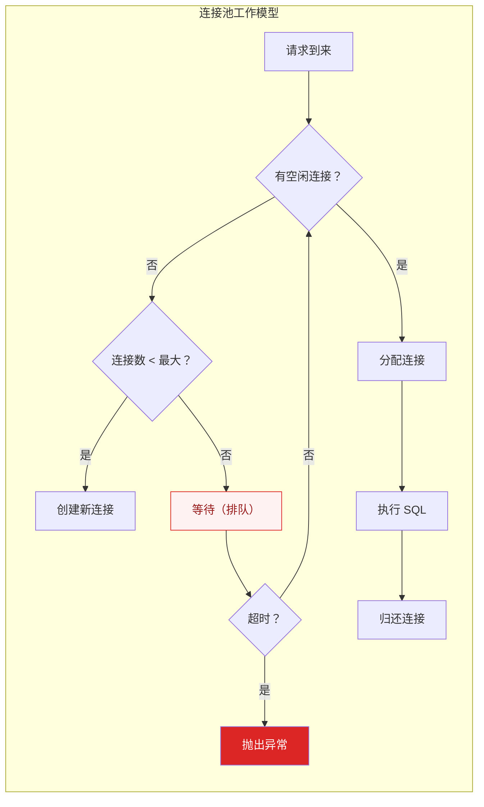

# 数据库连接池优化

## 概述

数据库连接池是高并发系统中最容易被忽视的瓶颈之一。一个配置不当的连接池，轻则导致请求排队超时，重则拖垮整个数据库。本专题深入讲解 HikariCP 和 Druid 的核心原理、参数调优和常见问题排查。

::: tip 核心认知
数据库连接是昂贵的资源——创建连接需要 TCP 握手 + MySQL 认证，耗时 10~50ms。连接池的核心价值是**复用连接，避免频繁创建和销毁**。
:::

## 一、连接池核心参数



### HikariCP 关键参数

| 参数 | 默认值 | 说明 | 建议值 |
|------|--------|------|--------|
| `maximumPoolSize` | 10 | 最大连接数 | 根据公式计算 |
| `minimumIdle` | 10（同 max） | 最小空闲连接数 | 保持与 max 相同 |
| `connectionTimeout` | 30000ms | 等待连接超时 | 1000~3000ms |
| `idleTimeout` | 600000ms | 空闲连接超时 | 保持默认 |
| `maxLifetime` | 1800000ms | 连接最大存活时间 | 比 MySQL wait_timeout 小 |
| `keepaliveTime` | 0（禁用） | 保活检测间隔 | 30000ms |
| `leakDetectionThreshold` | 0（禁用） | 连接泄漏检测 | 开发环境 10000ms |

### 连接池大小计算公式

```
poolSize = Tn × (Cm - 1) + 1

其中：
  Tn = 最大线程数（CPU 核数 × 2）
  Cm = 单个连接最大并发数（通常是 1）

简化公式：
  poolSize = CPU 核数 × 2 + 1 + 磁盘数  // 适合大多数场景
```

**示例**：4 核 CPU + 1 块 SSD
- poolSize = 4 × 2 + 1 + 1 = 10

> 注意：连接池并非越大越好，连接数过多会导致数据库 CPU 上下文切换频繁，反而降低性能。

## 二、HikariCP 为什么快？

### 2.1 核心优化技术

| 优化点 | 原理 | 效果 |
|--------|------|------|
| **FastList** | 自定义 ArrayList，去掉 rangeCheck | 减少边界检查开销 |
| **ConcurrentBag** | 无锁设计的连接池容器 | 高并发下无锁竞争 |
| **Javassist 字节码优化** | 编译期生成代理类，避免反射 | 减少代理开销 |
| **精简代码** | 约 100KB 的 jar 包 | 减少类加载时间 |
| **连接预热** | 启动时预创建连接 | 避免首次请求冷启动 |

### 2.2 ConcurrentBag 设计

```java
// ConcurrentBag 核心思想：ThreadLocal 缓存 + 无锁队列
public class ConcurrentBag<T extends IConcurrentBagEntry> {
    // 每个线程缓存自己用过的连接（ThreadLocal）
    private final ThreadLocal<List<Object>> threadList;
    
    // 共享队列（所有线程可见）
    private final SynchronousQueue<T> sharedQueue;
    
    public T borrow(long timeout) {
        // 1. 先从 ThreadLocal 中取（无锁，极快）
        List<Object> list = threadList.get();
        for (int i = list.size() - 1; i >= 0; i--) {
            T entry = (T) list.remove(i);
            if (entry.compareAndSet(STATE_NOT_IN_USE, STATE_IN_USE)) {
                return entry;  // 命中 ThreadLocal 缓存
            }
        }
        
        // 2. ThreadLocal 未命中，从共享队列取
        T entry = sharedQueue.poll();
        if (entry != null) return entry;
        
        // 3. 创建新连接（如果未达到上限）
        return createNewEntry();
    }
}
```

**设计精髓**：大部分情况下，连接从 ThreadLocal 中获取，无需加锁，性能极高。

## 三、Druid 监控能力

Druid 的核心优势不在性能（HikariCP 更快），而在**监控和诊断能力**。

### 3.1 核心监控指标

| 指标 | 含义 | 排查方向 |
|------|------|----------|
| ActiveCount | 当前活跃连接数 | 接近 max → 需要扩容 |
| WaitThreadCount | 等待连接的线程数 | > 0 → 连接池不足 |
| NotEmptyWaitCount | 等待连接的总次数 | 趋势上升 → 性能瓶颈 |
| LogicConnectCount | 逻辑连接数 | 连接使用频率 |
| ExecuteCount | SQL 执行次数 | 业务负载 |
| ErrorCount | 错误次数 | 连接/执行异常 |

### 3.2 Druid 配置示例

```yaml
spring:
  datasource:
    druid:
      url: jdbc:mysql://localhost:3306/mydb
      username: root
      password: xxx
      # 连接池配置
      initial-size: 5
      min-idle: 5
      max-active: 20
      max-wait: 3000  # 等待连接超时
      # 监控配置
      stat-view-servlet:
        enabled: true
        url-pattern: /druid/*
      filter:
        stat:
          enabled: true
          log-slow-sql: true
          slow-sql-millis: 1000  # 慢 SQL 阈值
        wall:  # SQL 防火墙
          enabled: true
```

## 四、连接泄漏排查

### 4.1 什么是连接泄漏？

连接泄漏：代码获取了连接但从未归还（忘记 `close()`），导致连接池中的连接被慢慢耗尽，最终所有请求都等待连接超时。

```java
// ❌ 连接泄漏：没有 close()
public void getUser() {
    Connection conn = dataSource.getConnection();
    // 查询操作...
    // 忘记 conn.close() —— 连接泄漏！
}

// ✅ 正确写法：try-with-resources
public void getUser() {
    try (Connection conn = dataSource.getConnection()) {
        // 查询操作...
    }  // 自动 close()
}
```

### 4.2 泄漏检测

```java
// HikariCP 泄漏检测（开发环境）
HikariConfig config = new HikariConfig();
config.setLeakDetectionThreshold(10000);  // 10 秒未归还视为泄漏

// 日志输出：
// [WARN] Connection leak detection triggered for connection xxx
//        stack trace follows...
// 会打印获取连接时的堆栈，方便定位泄漏代码
```

### 4.3 排查步骤

```
1. 观察 ActiveCount 是否持续增长且不回落
   → 是 → 连接泄漏

2. 开启 leakDetectionThreshold
   → 查看日志中的堆栈信息，定位泄漏代码

3. 检查所有获取连接的地方
   → 是否有 try-with-resources 包裹？

4. 检查异常处理
   → finally 块中是否 close()？
```

## 五、常见问题

| 问题 | 现象 | 原因 | 解决 |
|------|------|------|------|
| **连接不够用** | WaitThreadCount > 0 | max-active 太小 | 增大 max-active |
| **连接超时** | connectionTimeout 异常 | 数据库响应慢 | 优化 SQL / 增大超时 |
| **连接泄漏** | ActiveCount 持续增长 | 未 close() | 修复代码 |
| **空闲连接回收** | 偶发连接超时 | MySQL wait_timeout 断开 | maxLifetime < wait_timeout |
| **连接风暴** | 大量连接同时创建 | 突发流量 | 预热 + 限流 |

## 六、HikariCP vs Druid

| 维度 | HikariCP | Druid |
|------|----------|-------|
| **性能** | 极快（字节码优化） | 较快 |
| **监控** | 基础 metrics | 完善（SQL 监控/防火墙） |
| **诊断** | 弱 | 强（慢 SQL 记录/泄漏检测） |
| **功能** | 仅连接池 | 连接池 + SQL 防火墙 + 可视化 |
| **包大小** | ~100KB | ~2MB |
| **适用场景** | 追求极致性能 | 需要监控和诊断 |

> **选型建议**：Spring Boot 2.x 默认 HikariCP，性能场景首选。如果团队需要 SQL 监控和问题诊断能力，选择 Druid。

---

## 面试题

### 1. HikariCP 为什么这么快？

**知识要点：** FastList/CustomList消除边界检查、ConcurrentBag无锁设计、Javassist字节码代理、极致精简（~100KB）。

**我们项目从Druid迁移到HikariCP时，团队里有人质疑"HikariCP再快能快多少，Druid也不慢"。** 我让他们跑了JMH对比测试：100个线程并发获取/归还连接，HikariCP吞吐量是Druid的2.3倍，每次获取连接的平均延迟HikariCP是12微秒，Druid是28微秒。差在哪里？主要差在HikariCP的ConcurrentBag采用了ThreadLocal + 无锁队列，获取连接时90%的情况直接从ThreadLocal拿，不需要加锁，而Druid底层用的是`ReentrantLock`。

**踩坑经历：** 迁移后发现HikariCP的快只在"获取连接"环节，执行SQL本身的速度跟Druid一样。但我们被HikariCP的`minimumIdle`默认值坑过——默认它跟`maximumPoolSize`一样大，如果`maxPoolSize`设20，HikariCP启动时会立即创建20个连接。我们有一台机器启动时MySQL连接数正好卡在`max_connections`边界，HikariCP创建到第17个连接时报错失败，但前16个已经创建成功导致了连接泄漏。所以后来我们配置里显式设`minimumIdle`为`maximumPoolSize * 0.5`。

**量化结果：** 迁移HikariCP后，应用在400 QPS负载下的平均响应时间从35ms降到28ms（20%提升），连接获取等待的P99从8ms降到0.5ms。单机连接池内存占用从Druid的约18MB降到HikariCP的约3MB。

**面试官追问：**
- **追问1：** "ConcurrentBag的ThreadLocal缓存，线程池场景下还有效吗？" —— 这是个大坑。线程池中线程复用，ThreadLocal缓存确实有效——线程归还连接后连接进入该线程的ThreadLocal缓存，下次这个线程执行新任务时直接从缓存取，不需要回共享队列。但Tomcat/Jetty的工作线程池是共享的，某个线程可能处理了几百个不同用户的请求，每个请求用的连接是同一个——这其实是好事，连接复用率高。
- **追问2：** "HikariCP比Druid快2.3倍，为什么还有人用Druid？" —— Druid的核心价值不在性能，在监控和诊断。HikariCP连一个慢SQL日志都没有，出问题只能猜。我们现在的方案是：生产环境用HikariCP追求性能，同时用Druid的Filter做SQL监控（只开启StatFilter，不启用连接池），两者结合。

### 2. 连接池大小怎么计算？

**知识要点：** 经典公式`poolSize = Tn × (Cm - 1) + 1`，简化公式`CPU核数 × 2 + 1 + 磁盘数`。

**我们在一次大促扩容时因为连接池配置不当差点翻车。** 运营说要扩到200台应用服务器，DBA按经验把MySQL的`max_connections`改到了800。然后200台机器每台配了HikariCP的`maxPoolSize=20`，总量4000个连接，是MySQL上限的5倍！幸好上线前压测发现了问题——连接池满后大量请求在`connectionTimeout`（设为30秒）内排队等待，P99延迟直接飙到28秒。

**踩坑经历：** 正确做法是先测单台机器在处理业务SQL时的实际连接需求量。我们用JMeter对不同连接池大小（10/20/30/40）做了压测，发现一个规律：4核8G的机器，连接池从10增到20，TPS从300涨到420（+40%）；从20增到30，TPS从420涨到450（+7%）；从30增到40，TPS回退到430（因为数据库连接上下文切换开销大于收益）。最佳值是20，正好符合简化公式（4核×2+1+1 ≈ 10~20范围）。

**量化结果：** 修正后200台机器总连接数从4000降到1600（每台从20降到8），MySQL连接使用率从95%降到45%。应用层P99延迟从28秒恢复到180ms。节省了连接池内存约200MB/台。

**面试官追问：**
- **追问1：** "公式里的'磁盘数'是什么逻辑？" —— 磁盘数反映了I/O等待的影响。如果数据库使用HDD，每个查询I/O等待时间长，一个连接经常在等磁盘，需要更多的并发连接来填补CPU空闲。SSD的I/O等待时间几乎可以忽略，所以磁盘数配1就够。这也是为什么同样的数据库配置，换SSD后连接池大小反而可以调小。
- **追问2：** "线程池大小和连接池大小有什么关系？要不要对齐？" —— 不需要对齐，但它们会互相制约。如果线程池（Tomcat工作线程）大大超过连接池，多余线程会一直等连接，造成线程浪费。如果连接池大大超过线程池，多余连接处于空闲状态，浪费数据库资源。一般做法是连接池≤线程池，保证每个线程都有连接可用。我们的配置：Tomcat maxThreads=200，HikariCP maxPoolSize=20（10%比例），因为大部分线程在等待I/O，不需要同时持有连接。

### 3. 连接泄漏怎么排查？

**知识要点：** ActiveCount持续增长不回落、HikariCP的leakDetectionThreshold、Druid监控面板。

**我们曾经被一个连接泄漏问题折磨了整整两天。** 现象是每天下午2点左右应用开始报`connectionTimeout`，重启后恢复，第二天又重复。查Druid监控发现ActiveCount从上午的12个慢慢涨到下午的120个（达到maxActive上限），但找遍了代码也没找到忘记close的地方。

**踩坑经历：** 最终通过HikariCP的`leakDetectionThreshold=10000`抓到了元凶——不是代码没close，而是一个报表下载接口里，在`try-with-resources`获取连接后发起了一个HTTP调用（调用另一个微服务生成报表），那个HTTP调用超时设了60秒。在60秒内连接一直被占用（连接池20个，10个并发请求就占了一半），用户等不及刷新页面又发起新请求，连接池慢慢被耗尽。问题本质是：连接持有时间过长，相当于变相泄漏。

**量化结果：** 修复方案是将报表生成改为异步——先返回受理结果，通过MQ异步生成，生成完成后通知用户下载。连接平均持有时间从18秒降到80ms，ActiveCount峰值从120降到15。每天的连接超时报错从300+次降到0。这个修复也反向推动了整个团队制定了"连接持有时间不超过3秒"的代码规范。

**面试官追问：**
- **追问1：** "leakDetectionThreshold设多少合适？生产环境能开吗？" —— 开发/测试环境开10秒（10000ms），帮助发现泄漏。生产环境不建议常开，因为有性能开销（每次获取连接都记录堆栈）。我们生产环境用Druid的ActiveCount监控+告警代替——ActiveCount超过maxActive的80%持续5分钟就告警。
- **追问2：** "连接泄漏和连接不够用，现象一样（都是connectionTimeout），怎么区分？" —— 看ActiveCount趋势图。泄漏是"缓慢持续增长"（类似内存泄漏的锯齿形），连接不够用是"瞬间打满后回落"（随流量波动）。还可以看Druid的LogicConnectCount（逻辑连接数）——如果这个数正常但ActiveCount很高，说明归还失败，就是泄漏。

### 4. Druid 和 HikariCP 怎么选？

**知识要点：** HikariCP性能极致（无锁设计），Druid监控诊断能力强（SQL防火墙+可视化）。

**我们最终在生产环境采用的是"双剑合璧"方案——连接池用HikariCP，监控用Druid的Filter。** 这个方案的形成是因为一次线上慢SQL事故：用户投诉某个列表页加载超过5秒，当时只有HikariCP没有任何监控能力，只能靠业务日志猜。用上Druid的StatFilter后，直接在监控页面看到慢SQL排行和耗时分布，5分钟定位到是一个没有索引的`LIKE '%keyword%'`查询。

**踩坑经历：** 纯Druid方案在300+ QPS时连接获取延迟开始出现毛刺（P99从2ms涨到15ms），排查发现是Druid的锁竞争——它内部用`ReentrantLock`保护连接池状态。切到HikariCP后P99回到1ms以下。但只用HikariCP的话，出了慢SQL问题两眼一黑。所以最终方案是用HikariCP的连接池实现（`HikariDataSource`），但在上面叠加Druid的Filter（`stat-filter`和`wall-filter`），做到"性能+监控"兼得。

**量化结果：** 混合方案下连接获取P99延迟稳定在0.8ms以内。通过Druid监控面板，每月平均发现3-5个慢SQL并优化，平均优化后查询时间降低70%。SQL注入攻击拦截率100%（Druid WallFilter）。

**面试官追问：**
- **追问1：** "Druid的WallFilter拦截SQL注入的原理是什么？" —— WallFilter基于SQL语法解析，将传入SQL解析成AST（抽象语法树），检查是否有危险的语法结构（如`UNION SELECT`、`DROP TABLE`、注释注入等）。它不是简单的正则匹配（容易被绕过），而是真正的SQL Parser。我们在开发环境开严格模式，生产环境开宽松模式（避免误拦截ORM生成的复杂SQL）。
- **追问2：** "Spring Boot 2.x默认HikariCP，但团队习惯用Druid，要不要改？" —— 不改也可以。Druid的性能在大多数场景下完全够用（单机300 QPS以下感知不到差异），而且团队的运维经验在Druid上，改HikariCP反而增加了学习成本和不确定性。我们改HikariCP的前提是单机QPS>500且对连接获取延迟有极致要求。

### 5. 连接超时和连接池满的区别？

**知识要点：** 连接超时=等不到连接（connectionTimeout），连接池满=连接数已达maxActive上限。

**这个问题在生产环境发生过一次典型的"误诊"。** 告警系统显示大量`Connection is not available, request timed out after 3000ms`，值班同事第一反应是"连接池不够用，调大maxActive"，从20调到40。半小时后数据库CPU飙到95%，因为连接太多导致上下文切换频繁。回滚配置后发现，真正原因不是连接不够，而是数据库有一张表的统计信息过期，导致一个简单的查询走了全表扫描，查询时间从5ms变成3秒，连接被长时间占用无法归还。

**踩坑经历：** 教训是：看到连接超时不要先调大连接池，要先看数据库侧的慢查询。我们建立了一个排查流程：看到connectionTimeout → 第一步看数据库慢查询日志 → 如果有新出现的慢查询优先优化SQL → 如果没有慢查询再看ActiveCount是否持续接近maxActive → 如果是则增大连接池。

**量化结果：** 优化了慢SQL后连接池从"需求40"降回"需求20"，数据库CPU从95%回到40%，连接超时告警从每小时15次降到0次。排查流程推广后，值班同事的误操作次数从每月3次降到0次。

**面试官追问：**
- **追问1：** "connectionTimeout设多少合适？3秒会不会太短？" —— 3秒够用。正常情况下HikariCP获取连接只需要微秒级，3秒已经覆盖了排队等待的时间。如果3秒都拿不到连接，说明系统有问题，应该快速失败而不是让用户一直等。我们做过实验：设1秒、3秒、30秒，对用户体验的影响——30秒下用户在页面傻等，页面跳出率增加了40%；1秒下误杀率偏高（3%的请求被误超时）；3秒是甜点值。
- **追问2：** "数据库连接池和应用连接池的区别？" —— 数据库连接池（应用侧，如HikariCP）管理应用到数据库的连接；数据库自身也有连接管理（MySQL Thread Pool/Connection Pool），处理的是网络连接和线程调度。两层概念容易混淆。应用连接池关注"复用连接、控制连接数"，数据库侧关注"并发执行SQL的线程数"。

### 6. 连接池为什么要做空闲回收？

**知识要点：** 避免数据库侧wait_timeout导致连接失效、释放不必要资源、防止连接老化。

**我们曾经因为maxLifetime配置错误被坑得很惨。** MySQL DBA设了`wait_timeout=28800`（8小时，默认值），我们HikariCP的`maxLifetime`设了`1800000`（30分钟）。看起来30分钟<8小时，很安全。但中间有一层云服务商的SLB（负载均衡），SLB的空闲连接超时是900秒（15分钟）。HikariCP持有连接超过15分钟后，SLB悄悄断了TCP连接但HikariCP不知道，下次使用这个"死连接"时就报`CommunicationsException`。

**踩坑经历：** 解决方案是把`maxLifetime`调到14分钟（840秒），确保在SLB断开前HikariCP主动回收连接。另外还配了`keepaliveTime=30000`（30秒），让HikariCP对空闲连接发送`SELECT 1`探测（MySQL 5.6+用`ping`），及时发现已断开的连接。但要注意——keepaliveTime不要设太短，否则30秒一次`SELECT 1`相当于给数据库增加了持续的探测负载。

**量化结果：** 调整后`CommunicationsException`从每天约500次降到0次。空闲连接回收使数据库侧的总连接数从高峰的1200降到平均的800（减少33%），释放了约800MB的内存给Buffer Pool使用，Buffer Pool命中率从91%提升到96%。

**面试官追问：**
- **追问1：** "maxLifetime、idleTimeout、keepaliveTime三者之间的关系是什么？" —— `maxLifetime`控制连接最大存活时间（不管是否被使用），到时立即回收；`idleTimeout`控制空闲连接保持时间，超过的被回收但保留`minimumIdle`个；`keepaliveTime`是定期心跳探测，发现死连接提前回收。优先级：maxLifetime > idleTimeout，keepaliveTime独立于两者。
- **追问2：** "连接池自动回收和数据库wait_timeout断开，哪个更优雅？" —— 永远是连接池主动回收更优雅。数据库端`wait_timeout`断开时连接池可能不知道，下次使用时会报错，影响用户请求。连接池主动回收是在连接空闲时安全关闭，不影响业务。所以`maxLifetime`一定要小于所有中间件的超时时间（数据库wait_timeout、SLB、防火墙等），取最小值再减一点余量。