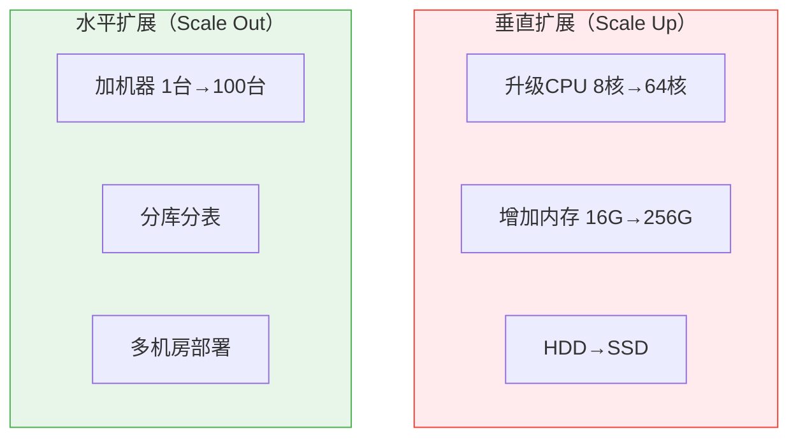
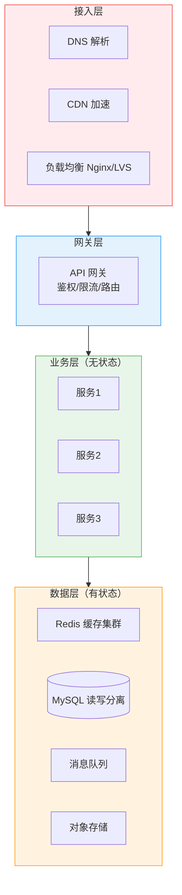

# 架构分层与扩展总览

创建日期：2026-06-06

## 模块概述

高并发系统不是靠"堆机器"就能解决的，需要合理的架构分层和扩展策略。本模块从负载均衡、服务发现、动静分离、读写分离到多活架构，系统讲解架构扩展的核心技术。

::: tip 核心思想
架构扩展的本质是：**用水平扩展代替垂直扩展，用无状态设计代替有状态依赖，用异步代替同步，用缓存代替直接访问。**
:::

## 垂直扩展 vs 水平扩展

| 对比维度 | 垂直扩展 | 水平扩展 |
|----------|---------|---------|
| 实现难度 | 简单（换硬件） | 复杂（需要架构改造） |
| 成本 | 后期指数增长 | 线性增长 |
| 上限 | 有物理上限 | 理论上无限 |
| 可用性 | 单点故障 | 天然高可用 |
| 适用场景 | 初期、快速上线 | 中长期、高并发 |

## 分层架构全景图

## 各层瓶颈与解决思路

| 层级 | 典型瓶颈 | 解决思路 |
|------|---------|---------|
| **接入层** | DNS 解析慢、单点 Nginx 压力大 | DNS 智能解析、CDN 加速、多 Nginx + 负载均衡 |
| **网关层** | 鉴权/限流成为瓶颈 | 网关集群 + 本地缓存鉴权信息 |
| **业务层** | 单实例 CPU/内存打满 | 无状态设计 + 水平扩展 |
| **数据层** | 单库连接数耗尽、单表数据量过大 | 读写分离、分库分表、缓存 |

## 无状态服务弹性伸缩

::: tip 为什么无状态才能水平扩展？
无状态服务不存储会话数据，请求可以打到任意实例。有状态服务（如持有 Session 的 Web 应用）需要会话保持（Sticky Session），限制了负载均衡的灵活性，且扩容时需要迁移状态。
:::

**无状态化改造：**
- Session 外置到 Redis。
- 文件存储外置到 OSS。
- 配置外置到配置中心。

## 学习路径

1. **负载均衡**：理解流量如何分发到多个实例，各算法优缺点。
2. **服务发现**：理解服务实例如何注册和发现，不同 CAP 选择。
3. **动静分离+读写分离**：理解如何分流不同类型的请求。
4. **多活架构+链路追踪**：理解跨机房容灾和全链路监控。

---

## 经典高频面试题

### Q1：垂直扩展和水平扩展有什么区别？什么时候选哪个？

**参考答案：**

- **垂直扩展**：升级单台机器硬件，简单但有上限，且单点故障。
- **水平扩展**：加机器分摊负载，复杂但理论上无限，天然高可用。

初期快速上线用垂直扩展，业务增长后转水平扩展。核心原则：**能水平扩展的绝不依赖垂直扩展**。

### Q2：为什么无状态服务才能水平扩展？有状态怎么处理？

**参考答案：**

无状态服务不存储会话数据，请求可以打到任意实例，扩容缩容自由。有状态服务需要将状态外置：Session 存 Redis、文件存 OSS、配置存配置中心。改造后即使实例重启，状态也不丢失。

### Q3：分层架构设计有什么好处？

**参考答案：**

- **关注点分离**：每层职责明确，接入层只管流量分发，业务层只管逻辑，数据层只管存储。
- **独立扩展**：哪层是瓶颈就扩哪层，不需要整体扩。
- **故障隔离**：一层挂了不影响其他层（如数据层降级，业务层仍可用缓存）。
- **安全**：接入层和网关层可以统一做鉴权、限流、防护。

### Q4：如何定位系统瓶颈在哪一层？

**参考答案：**

- **接入层**：看 Nginx 的连接数和 QPS，如果连接数打满说明接入层瓶颈。
- **网关层**：看网关的 CPU 和延迟，如果鉴权/路由耗时高说明网关瓶颈。
- **业务层**：看业务服务的 CPU 和 GC，如果线程池满说明业务层瓶颈。
- **数据层**：看数据库连接数和慢查询，如果连接数满或大量慢查询说明数据层瓶颈。

通过监控链路追踪和指标看板逐层排查。

### Q5：什么时候该做读写分离？

**参考答案：**

- 读 QPS 远大于写 QPS（如 10:1 以上）。
- 单库连接数接近上限。
- 业务可以接受主从延迟（读取非强一致数据）。

不适合读写分离的场景：写后立即读（需要强一致）、写 QPS 也很大（需要分库分表）。