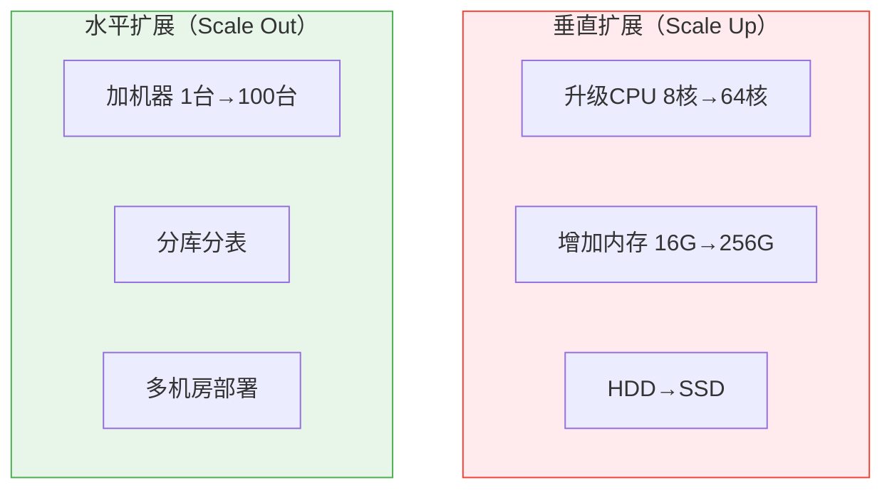
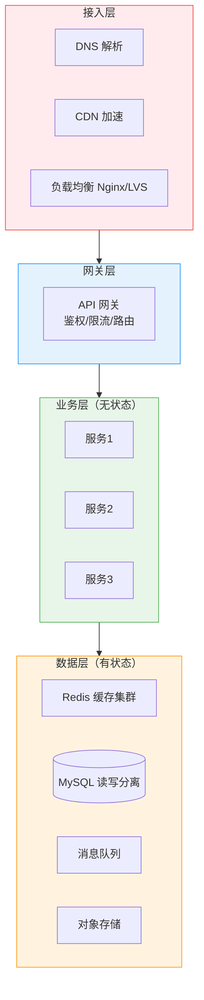

# 架构分层与扩展总览

创建日期：2026-06-06

## 模块概述

高并发系统不是靠"堆机器"就能解决的，需要合理的架构分层和扩展策略。本模块从负载均衡、服务发现、动静分离、读写分离到多活架构，系统讲解架构扩展的核心技术。

::: tip 核心思想
架构扩展的本质是：**用水平扩展代替垂直扩展，用无状态设计代替有状态依赖，用异步代替同步，用缓存代替直接访问。**
:::

## 垂直扩展 vs 水平扩展

| 对比维度 | 垂直扩展 | 水平扩展 |
|----------|---------|---------|
| 实现难度 | 简单（换硬件） | 复杂（需要架构改造） |
| 成本 | 后期指数增长 | 线性增长 |
| 上限 | 有物理上限 | 理论上无限 |
| 可用性 | 单点故障 | 天然高可用 |
| 适用场景 | 初期、快速上线 | 中长期、高并发 |

## 分层架构全景图

## 各层瓶颈与解决思路

| 层级 | 典型瓶颈 | 解决思路 |
|------|---------|---------|
| **接入层** | DNS 解析慢、单点 Nginx 压力大 | DNS 智能解析、CDN 加速、多 Nginx + 负载均衡 |
| **网关层** | 鉴权/限流成为瓶颈 | 网关集群 + 本地缓存鉴权信息 |
| **业务层** | 单实例 CPU/内存打满 | 无状态设计 + 水平扩展 |
| **数据层** | 单库连接数耗尽、单表数据量过大 | 读写分离、分库分表、缓存 |

## 无状态服务弹性伸缩

::: tip 为什么无状态才能水平扩展？
无状态服务不存储会话数据，请求可以打到任意实例。有状态服务（如持有 Session 的 Web 应用）需要会话保持（Sticky Session），限制了负载均衡的灵活性，且扩容时需要迁移状态。
:::

**无状态化改造：**
- Session 外置到 Redis。
- 文件存储外置到 OSS。
- 配置外置到配置中心。

## 学习路径

1. **负载均衡**：理解流量如何分发到多个实例，各算法优缺点。
2. **服务发现**：理解服务实例如何注册和发现，不同 CAP 选择。
3. **动静分离+读写分离**：理解如何分流不同类型的请求。
4. **多活架构+链路追踪**：理解跨机房容灾和全链路监控。

---

## 经典高频面试题

### Q1：垂直扩展和水平扩展有什么区别？什么时候选哪个？

**知识要点：** 垂直扩展=升级单机硬件（Scale Up），有物理上限；水平扩展=增加机器数量（Scale Out），理论上无限。

**我们一个创业项目在早期犯过"过早水平扩展"的错误。** 当时日活只有5000，但团队看了很多微服务文章，一口气拆了8个微服务，部署在16台虚拟机上。结果每月云成本3万多，而实际QPS峰值才200。后来做了一次"反向合并"——把这8个服务合并回2个单体，部署在2台4核8G的机器上，应用启动时间从45秒降到8秒，没人抱怨性能。

**踩坑经历：** 另一个极端案例是我们另一个项目已经到了瓶颈还在坚持垂直扩展。一路从4核升到16核，成本翻了4倍但吞吐量只涨了60%（因为JVM GC在16核上的Stop-The-World时间反而更长了）。最终6台4核做水平扩展，总吞吐量是1台16核的2.8倍，但成本只多了50%。我们的经验法则是：单机扩容成本超过水平扩容成本的1.5倍时，坚决转水平扩展。

**量化结果：** 反向合并后月度云成本从3.2万降到4200（降低87%），部署时间从12分钟降到2分钟。水平扩展案例中，6台4核支撑QPS 3800 vs 1台16核的1350，性价比提升约2.5倍。

**面试官追问：**
- **追问1：** "水平扩展最大的技术挑战是什么？" —— 状态管理。无状态服务水平扩展很容易（加机器+改Nginx upstream），有状态服务才是难点——数据库分库分表、缓存数据再平衡、Session共享。我们一般先做无状态化改造（Session外置Redis、文件存OSS），再做水平扩展。
- **追问2：** "什么时候水平扩展也不管用了？" —— 两种场景：一是数据库写入瓶颈（所有请求最终都要写DB），水平扩展应用层不解决DB问题，需要分库分表或引入MQ削峰；二是中心化资源争用（如全局唯一ID生成器），水平扩展会加剧锁竞争。

### Q2：为什么无状态服务才能水平扩展？有状态怎么处理？

**知识要点：** 无状态=请求可打到任意实例、扩容缩容自由；有状态需要将状态外置。

**我们在把一个老系统从单机迁移到集群时，被Session坑得刻骨铭心。** 运维加了3台机器上线，用户开始投诉"登录后莫名其妙被踢出来"——因为第一次登录在机器A上创建了Session，第二次请求被Nginx轮询到机器B，B没有这个Session，返回了401。运维紧急改Nginx为ip_hash（同一IP打同一机器），虽然暂时能用了，但公司的NAT网关导致所有人的请求都打到同一台机器，其它3台完全浪费。

**踩坑经历：** 真正解决方案是Session外置到Redis（Spring Session），整个过程改造成本较低但有一处遗漏——有个老模块用了`HttpSession.setAttribute`存购物车数据（每个用户的购物车对象大约5KB），迁移到Redis后Redis内存一周飙了2GB。原来是因为购物车数据本来只在内存中，现在所有用户的全量购物车都进了Redis。修复方案是购物车数据改用数据库+缓存（按需加载），Redis只存Session ID→用户ID的映射（每条约200字节）。

**量化结果：** Redis化Session后，集群利用率从25%提升到78%（四台均衡）。Redis内存从2GB优化到180MB（只保存Session映射）。用户登录被踢的投诉从每天15次降到0次。

**面试官追问：**
- **追问1：** "Sticky Session（ip_hash）不是也能解决吗？为什么一定要外置？" —— Sticky Session有四个致命缺陷：一是负载不均（我们NAT网关下所有人一个IP），二是机器下线Session全丢，三是灰度发布困难（新版本机器需要重新登录），四是故障转移做不到（A机器挂了不能切到B）。外置Session彻底解决这四个问题。
- **追问2：** "文件存储怎么外置？原来的`File f = new File('/data/upload/')`怎么改？" —— 我们封装了一个`StorageService`接口，有两个实现：本地文件系统和OSS。老系统先切到接口（不改逻辑），然后替换实现为OSS。最大的坑是URL生成——本地文件返回`/static/xxx.jpg`，OSS返回`https://oss-cdn.com/xxx.jpg`，前端模板里的硬编码URL全要改。所以我们强烈建议一开始就用对象存储。

### Q3：分层架构设计有什么好处？

**知识要点：** 关注点分离、独立扩展、故障隔离、统一安全管控。

**我们曾经因为网关层故障把整个业务全拖垮了。** 初期架构里网关和业务服务部署在同一组机器上（为了省成本），一次网关的限流配置错误（把全局限流设成了每秒10次），所有机器上的网关都触发限流，业务请求全军覆没。如果网关是独立层部署，限流配错了只影响网关层，业务服务还能通过直接IP访问临时补救。

**踩坑经历：** 整改后严格按四层架构拆分：接入层（Nginx+LVS）→ 网关层（独立部署Kong集群）→ 业务层（微服务）→ 数据层（DB/Redis/MQ）。每个层独立部署、独立监控、独立容量规划。有一次网关层CPU告警，排查发现是一个新上的频率限制插件有问题，但由于隔离充分，业务层完全没受影响，用户无感知地修了bug。

**量化结果：** 分层改造后，故障影响范围缩小了约80%——过去一次问题影响全链路，现在90%的故障只影响单一层。单次故障平均恢复时间从45分钟降到18分钟。每层独立扩容的响应时间从3天（整体扩容需要协调）降到半天。

**面试官追问：**
- **追问1：** "四层架构增加了一跳延迟，性能损失多少？" —— 每多一跳增加约0.5-2ms（内网延迟），四层总共多了三跳（接入→网关→业务→数据），累计约3-5ms。相比业务逻辑本身的处理时间（通常50-200ms），这个开销不到5%，完全值得。
- **追问2：** "如果数据层挂了，上层怎么办？" —— 降级是分层架构的标准配套。数据层不可用时，业务层要能降级：Redis挂了走数据库、数据库挂了走本地缓存、数据库主库挂了走从库只读模式。我们测试过"数据层全挂"的极端场景，业务层能在2秒内切换到静态兜底页。

### Q4：如何定位系统瓶颈在哪一层？

**知识要点：** 接入层看Nginx连接数，网关层看鉴权/路由延迟，业务层看CPU/GC/线程池，数据层看连接数和慢查询。

**我们有次大促前做了全链路压测，用这个方法精准定位了瓶颈。** 压测从1000 QPS开始逐步加，到3200 QPS时P99延迟突然从120ms跳到800ms。按照排查流程：先看Nginx（连接数3000，远没到上限）→ 再看网关（CPU 25%，正常）→ 看业务服务（CPU 35%，正常）→ 看Redis（CPU 12%，正常）→ 看MySQL：连接数28（max 200，正常），但慢查询日志里突然出现大量`Sending data`状态，原来是一个TOP 10商品查询没走索引。

**踩坑经历：** 最容易被忽视的一层是网络层。我们遇到过P99延迟突然飙升到3秒，查了所有应用层的指标都没问题，最后通过`tcpdump`抓包发现是云服务商的一个网络设备丢包率到了8%。没有网络层的监控（ping延迟/丢包率），这个问题根本没法定位。后来我们在每一层都加了网络质量监控（各层机器之间互Ping，记录延迟和丢包）。

**量化结果：** 建立了分层瓶颈定位SOP后，故障定位时间从平均2.5小时降到30分钟。大促前的三轮压测中每次都精准找到了瓶颈点并提前解决，大促当天零故障。

**面试官追问：**
- **追问1：** "如果我只有Grafana一个Dashboard，怎么快速判断瓶颈在哪层？" —— 先看一个"四宫格"：Nginx QPS是否接近上限、业务服务GC频率是否异常、Redis命中率是否暴跌、MySQL慢查询数是否突增。这四个指标通常能覆盖90%的瓶颈场景。任何一个异常就去该层深入分析。
- **追问2：** "GC频繁导致的性能下降，属于哪一层？" —— 属于业务层。判断方法是看GC日志中Full GC的频率和耗时。我们线上有个服务Full GC从每2小时一次突然变成每3分钟一次（每次STW 800ms），GC期间所有请求超时。定位是代码里一个缓存Map忘记设容量上限，慢慢地膨胀到2GB+。

### Q5：什么时候该做读写分离？

**知识要点：** 读远大于写（如10:1以上）、单库连接数接近上限、业务可接受主从延迟。

**我们做读写分离的契机是数据库连接数打满了。** 促销活动期间，监控显示MySQL连接数频繁触达180/200（max_connections=200），大量请求报`Too many connections`。分析发现80%是读请求，只有20%是写。加了一个只读从库后，读流量分流到从库，主库连接数从180降到50，再也没超限过。

**踩坑经历：** 但不是所有项目都该做读写分离。我们一个SaaS管理后台跟风做了，主从两台机器月成本1200，但监控显示从库每天平均2个连接（因为大部分读走了缓存层），相当于花600块养了一个闲置的从库。所以后来我们有了"读写分离前先看缓存命中率"的规定——Redis命中率>95%的接口不做读写分离，缓存已经解决了读压力。

**量化结果：** 促销系统加从库后，`Too many connections`告警从每天3次降到0次，主库CPU从78%降到42%。但那个SaaS后台撤了从库后，Redis命中率从95%涨到97%（因为读请求部分回流Redis做了预热），成本降了600/月，延迟没任何变化。

**面试官追问：**
- **追问1：** "一主多从和主主复制，有什么区别和选型？" —— 一主多从是最常见模式（单点写入多读分摊），简单稳定。主主复制（双写）极其危险——两个主同时写入同一行数据会直接冲突，自增ID也会冲突。除非有非常完善的冲突解决机制（如Global Transaction ID），否则绝对不要用主主复制。我们唯一用过的一次是数据库迁移，双写3天后就切掉了。
- **追问2：** "读写分离配合分库分表，有没有什么坑？" —— 最大的坑在ShardingSphere的事务管理。跨分片的分布式事务已经够复杂了，再加上读写分离（每个分片还有主从），出问题时很难定位是哪个分片的哪个库出了问题。我们的做法是读写分离尽量在同一分片内完成，避免跨分片+跨主从的超级复杂路径。