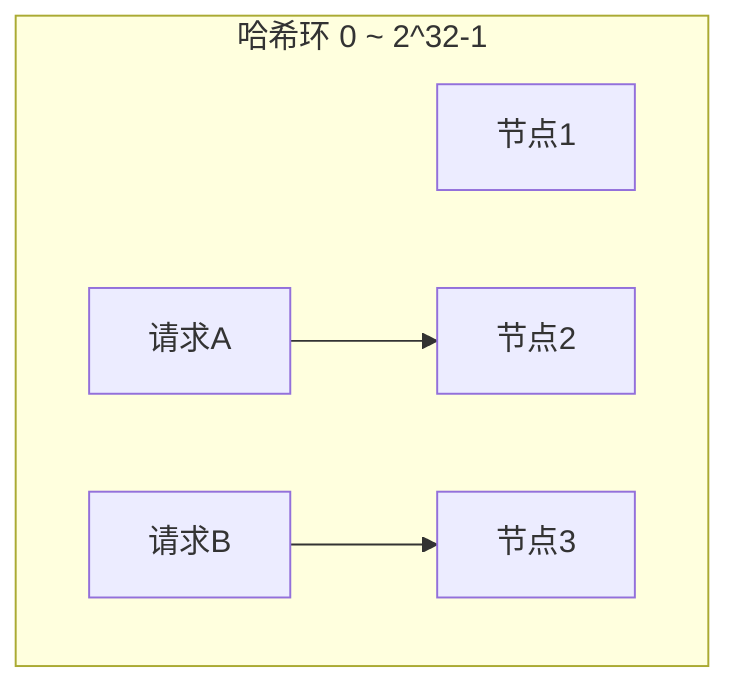

# 负载均衡策略与算法

创建日期：2026-06-06

## 问题背景

单台服务器处理能力有限，需要多台服务器组成集群。负载均衡负责将请求合理分发到集群中的各个节点，避免单节点过载，提升整体吞吐和可用性。

## 四层 vs 七层负载均衡

| 对比维度 | 四层（L4） | 七层（L7） |
|----------|-----------|-----------|
| 工作层级 | 传输层（TCP/UDP） | 应用层（HTTP/HTTPS） |
| 基于 | IP + 端口 | URL、Header、Cookie |
| 性能 | 高（只解析到传输层） | 较低（需要解析 HTTP） |
| 灵活性 | 低 | 高（可按 URL 路由） |
| 代表 | LVS、F5 | Nginx、HAProxy（HTTP 模式） |

## 六种负载均衡算法

### 1. 轮询（Round Robin）

**原理：** 按顺序将请求依次分发到每个节点。

```java
int index = (currentIndex++) % servers.size();
return servers.get(index);
```

**适用：** 各节点性能相同，请求处理时间相近。

### 2. 加权轮询（Weighted Round Robin）

**原理：** 为每个节点分配权重，按权重比例分发请求。

```java
// 平滑加权轮询（Nginx 实现）
// 每个节点维持 currentWeight，初始为 0
for (Server s : servers) {
    s.currentWeight += s.weight;
    if (s.currentWeight > maxWeight) {
        maxWeight = s.currentWeight;
        selected = s;
    }
}
selected.currentWeight -= totalWeight;
return selected;
```

**适用：** 各节点性能不同，高性能机器承担更多请求。

### 3. 随机（Random）

**原理：** 随机选择一个节点。

```java
int index = random.nextInt(servers.size());
return servers.get(index);
```

**适用：** 简单场景，节点性能相同。

### 4. 最小连接（Least Connections）

**原理：** 选择当前活跃连接数最少的节点。

```java
Server selected = null;
int minConns = Integer.MAX_VALUE;
for (Server s : servers) {
    if (s.activeConnections < minConns) {
        minConns = s.activeConnections;
        selected = s;
    }
}
return selected;
```

**适用：** 请求处理时间差异大（长连接 vs 短连接），避免积压。

### 5. IP 哈希（IP Hash）

**原理：** 对客户端 IP 取哈希，同一 IP 的请求始终打到同一节点。

```java
int hash = clientIp.hashCode();
int index = Math.abs(hash) % servers.size();
return servers.get(index);
```

**适用：** 需要会话保持（Session Sticky）的场景。

### 6. 一致性哈希（Consistent Hash）

**原理：** 将节点和请求映射到同一个哈希环上，请求顺时针找到最近的节点。



**核心优势：** 节点增减时，只有少部分请求需要重新映射，大幅减少缓存穿透。

**虚拟节点：** 为每个物理节点创建多个虚拟节点（如 150 个），均匀分布在哈希环上，解决数据倾斜问题。

```java
// 一致性哈希 + 虚拟节点
for (Server s : servers) {
    for (int i = 0; i < 150; i++) {
        int hash = hash(s.ip + "#" + i);
        ring.put(hash, s);
    }
}
```

### 算法对比总结

| 算法 | 均匀性 | 会话保持 | 动态扩缩容 | 适用场景 |
|------|--------|---------|-----------|---------|
| **轮询** | 好 | 不支持 | 无影响 | 短连接，节点性能相同 |
| **加权轮询** | 好 | 不支持 | 无影响 | 节点性能不均 |
| **随机** | 好 | 不支持 | 无影响 | 简单场景 |
| **最小连接** | 好 | 不支持 | 无影响 | 长连接，处理时间差异大 |
| **IP 哈希** | 一般 | 支持 | 可能不均衡 | 需要会话保持 |
| **一致性哈希** | 好（有虚拟节点） | 支持 | 影响最小 | 分布式缓存、节点动态变化 |

## Nginx 负载均衡配置

```nginx
upstream backend {
    # 加权轮询（默认）
    server 192.168.1.10:8080 weight=3;
    server 192.168.1.11:8080 weight=1;

    # IP 哈希
    # ip_hash;

    # 最少连接
    # least_conn;
}

server {
    location / {
        proxy_pass http://backend;
    }
}
```

## 健康检查与故障摘除

- **主动探测**：负载均衡器定期向节点发送健康检查请求（如 `GET /health`），连续失败 N 次后摘除节点。
- **被动检测**：根据请求失败率判断节点是否健康，失败率超过阈值自动摘除。
- **Nginx 配置**：`max_fails=3 fail_timeout=30s` — 30 秒内失败 3 次，摘除 30 秒。

---

## 经典高频面试题

### Q1：六种负载均衡算法对比，各适用什么场景？

**参考答案：**

- **轮询**：节点性能相同，短连接。
- **加权轮询**：节点性能不同，高性能机器多分流量。
- **随机**：简单场景，统计上均匀。
- **最小连接**：请求处理时间差异大，避免积压。
- **IP 哈希**：需要会话保持。
- **一致性哈希**：分布式缓存、节点频繁变动的场景。

### Q2：一致性哈希为什么能减少缓存穿透？虚拟节点解决什么问题？

**参考答案：**

普通哈希取模，增减节点时几乎所有的 key 都需要重新映射，导致大量缓存穿透。一致性哈希把节点映射到哈希环上，增减节点时只有相邻节点之间的 key 需要重新映射，影响范围小。

**虚拟节点**：解决物理节点少导致的数据倾斜问题。每个物理节点创建多个虚拟节点（如 150 个），均匀分布在哈希环上，使数据分布更均匀。

### Q3：Nginx 的 ip_hash 和 hash 有什么区别？

**参考答案：**

- **ip_hash**：按客户端 IP 取哈希，同一 IP 的请求始终打到同一节点，用于会话保持。
- **hash**：按任意 key（如 `$request_uri`）取哈希，用于缓存命中优化（同一 URL 打到同一节点）。

ip_hash 是 hash 的一个特例，key 固定为 `$remote_addr`。

### Q4：加权轮询的平滑加权算法怎么实现？

**参考答案：**

Nginx 的平滑加权轮询算法：
1. 每个节点维持 `currentWeight`，初始为 0。
2. 每次选择时，所有节点的 `currentWeight += weight`。
3. 选择 `currentWeight` 最大的节点。
4. 被选中的节点 `currentWeight -= totalWeight`。

这样权重高的节点被选中的次数比例正好等于权重比例，且分布平滑（不会连续选中同一个节点）。

### Q5：最少连接算法如何计算？加权最少连接呢？

**参考答案：**

最少连接：选择 `activeConnections` 最小的节点。加权最少连接：`activeConnections / weight` 最小的节点。这样权重高的节点可以承担更多连接。

### Q6：四层和七层负载均衡有什么区别？什么时候用哪个？

**参考答案：**

- **四层**：工作在传输层，只解析 IP+端口，性能高，但灵活性低。适合简单转发、高性能场景（如 LVS）。
- **七层**：工作在应用层，可以解析 URL、Header、Cookie，可以按路径路由、做 SSL 卸载。适合需要灵活路由的场景（如 Nginx 反向代理）。

一般架构：LVS（四层）→ Nginx（七层），四层扛流量，七层做灵活路由。