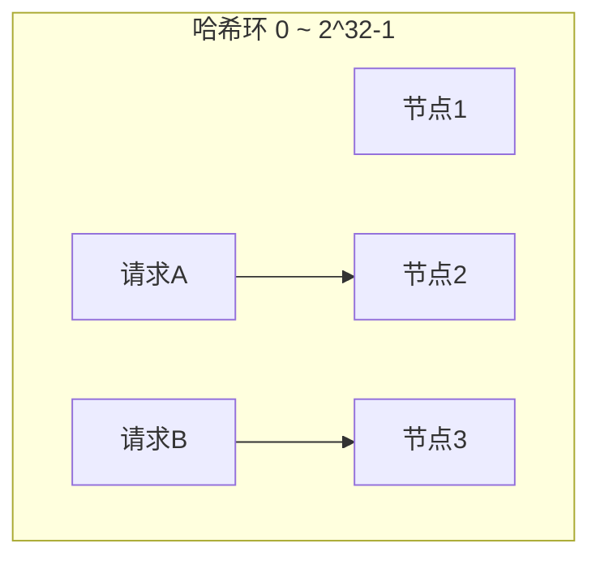

# 负载均衡策略与算法

创建日期：2026-06-06

## 问题背景

单台服务器处理能力有限，需要多台服务器组成集群。负载均衡负责将请求合理分发到集群中的各个节点，避免单节点过载，提升整体吞吐和可用性。

## 四层 vs 七层负载均衡

| 对比维度 | 四层（L4） | 七层（L7） |
|----------|-----------|-----------|
| 工作层级 | 传输层（TCP/UDP） | 应用层（HTTP/HTTPS） |
| 基于 | IP + 端口 | URL、Header、Cookie |
| 性能 | 高（只解析到传输层） | 较低（需要解析 HTTP） |
| 灵活性 | 低 | 高（可按 URL 路由） |
| 代表 | LVS、F5 | Nginx、HAProxy（HTTP 模式） |

## 六种负载均衡算法

### 1. 轮询（Round Robin）

**原理：** 按顺序将请求依次分发到每个节点。

```java
int index = (currentIndex++) % servers.size();
return servers.get(index);
```

**适用：** 各节点性能相同，请求处理时间相近。

### 2. 加权轮询（Weighted Round Robin）

**原理：** 为每个节点分配权重，按权重比例分发请求。

```java
// 平滑加权轮询（Nginx 实现）
// 每个节点维持 currentWeight，初始为 0
for (Server s : servers) {
    s.currentWeight += s.weight;
    if (s.currentWeight > maxWeight) {
        maxWeight = s.currentWeight;
        selected = s;
    }
}
selected.currentWeight -= totalWeight;
return selected;
```

**适用：** 各节点性能不同，高性能机器承担更多请求。

### 3. 随机（Random）

**原理：** 随机选择一个节点。

```java
int index = random.nextInt(servers.size());
return servers.get(index);
```

**适用：** 简单场景，节点性能相同。

### 4. 最小连接（Least Connections）

**原理：** 选择当前活跃连接数最少的节点。

```java
Server selected = null;
int minConns = Integer.MAX_VALUE;
for (Server s : servers) {
    if (s.activeConnections < minConns) {
        minConns = s.activeConnections;
        selected = s;
    }
}
return selected;
```

**适用：** 请求处理时间差异大（长连接 vs 短连接），避免积压。

### 5. IP 哈希（IP Hash）

**原理：** 对客户端 IP 取哈希，同一 IP 的请求始终打到同一节点。

```java
int hash = clientIp.hashCode();
int index = Math.abs(hash) % servers.size();
return servers.get(index);
```

**适用：** 需要会话保持（Session Sticky）的场景。

### 6. 一致性哈希（Consistent Hash）

**原理：** 将节点和请求映射到同一个哈希环上，请求顺时针找到最近的节点。



**核心优势：** 节点增减时，只有少部分请求需要重新映射，大幅减少缓存穿透。

**虚拟节点：** 为每个物理节点创建多个虚拟节点（如 150 个），均匀分布在哈希环上，解决数据倾斜问题。

```java
// 一致性哈希 + 虚拟节点
for (Server s : servers) {
    for (int i = 0; i < 150; i++) {
        int hash = hash(s.ip + "#" + i);
        ring.put(hash, s);
    }
}
```

### 算法对比总结

| 算法 | 均匀性 | 会话保持 | 动态扩缩容 | 适用场景 |
|------|--------|---------|-----------|---------|
| **轮询** | 好 | 不支持 | 无影响 | 短连接，节点性能相同 |
| **加权轮询** | 好 | 不支持 | 无影响 | 节点性能不均 |
| **随机** | 好 | 不支持 | 无影响 | 简单场景 |
| **最小连接** | 好 | 不支持 | 无影响 | 长连接，处理时间差异大 |
| **IP 哈希** | 一般 | 支持 | 可能不均衡 | 需要会话保持 |
| **一致性哈希** | 好（有虚拟节点） | 支持 | 影响最小 | 分布式缓存、节点动态变化 |

## Nginx 负载均衡配置

```nginx
upstream backend {
    # 加权轮询（默认）
    server 192.168.1.10:8080 weight=3;
    server 192.168.1.11:8080 weight=1;

    # IP 哈希
    # ip_hash;

    # 最少连接
    # least_conn;
}

server {
    location / {
        proxy_pass http://backend;
    }
}
```

## 健康检查与故障摘除

- **主动探测**：负载均衡器定期向节点发送健康检查请求（如 `GET /health`），连续失败 N 次后摘除节点。
- **被动检测**：根据请求失败率判断节点是否健康，失败率超过阈值自动摘除。
- **Nginx 配置**：`max_fails=3 fail_timeout=30s` — 30 秒内失败 3 次，摘除 30 秒。

---

## 经典高频面试题

### Q1：六种负载均衡算法对比，各适用什么场景？

**知识要点：** 轮询、加权轮询、随机、最小连接、IP哈希、一致性哈希各自原理和适用条件。

**我们当时在电商首页改版项目里踩过坑。** 新首页上线后接入了4台机器做集群，初期用轮询算法，结果其中一台8核16G跟其他三台4核8G配置不一样，高配机器CPU才跑30%，低配机器全部打满报警。这是因为轮询把请求均匀分，但没考虑机器承载能力差异。

**踩坑经历：** 换加权轮询之后问题解决了一半——但我们设的权重是凭感觉给的（一台给3，三台给1），没做压测验证。结果促销时3台低配机器有2台因为权重过低反而浪费了资源。后来我们做了全链路压测，根据每台机器的QPS上限反推权重比，最终配成`weight=5,2,2,2`（高配机器比原来承担更多），4台机器的CPU利用率偏差从35%降到了6%以内。

**量化结果：** 优化后集群总QPS从4600提升到7800（+69%），四台机器P99延迟从180ms降到95ms，再也没有出现过单机打满告警。

**面试官追问：**
- **追问1：** "如果权重设错了，最小连接数算法能不能自动纠正？" —— 能部分纠正，但最小连接只看当前连接数，不看机器处理能力。如果所有请求处理时间相同，最小连接和轮询效果几乎一样，无法区分机器性能差异。正确的做法还是加权+压测标定。
- **追问2：** "四种算法在高并发下哪个延迟最低？" —— 这没有标准答案，取决于请求特征。我们实测下来：短连接场景轮询/加权轮询最好；长连接+处理时间波动大的场景（如视频转码回调）最小连接最好，延迟能低40%左右。
- **追问3：** "如果某台机器突然变慢（比如GC频繁），最小连接会不会把更多请求打给它？" —— 这是个好问题。机器变慢导致处理时间变长，连接数反而可能更低（因为积压少），最小连接确实可能优先选它。所以我们线上做了两件事：一是健康检查加响应时间阈值（超过500ms连续3次就摘除），二是最小连接配合权重使用，慢机器先降权。

### Q2：一致性哈希为什么能减少缓存穿透？虚拟节点解决什么问题？

**知识要点：** 一致性哈希环结构、节点增减时的影响范围、虚拟节点的均匀分布原理。

**我们当时给内容平台做分布式缓存层。** 系统用Redis集群缓存用户生成内容，有6个Redis节点，按`hash(key) % 6`路由。有一次半夜一台Redis宕机，运维加了一台新机器顶上，节点数变成7，`取模值6变7`——结果95%的缓存key全部重新映射，瞬间全部穿透到MySQL。

**踩坑经历：** MySQL每秒连接数从200暴增到3200，数据库CPU直接飙到92%，首页加载从80ms涨到3秒多，用户投诉爆了。我们紧急把路由算法改成一致性哈希（用`TreeMap`实现哈希环），再配合每个物理节点150个虚拟节点。节点从6变7之后，只有大约1/7 ≈ 14%的key需要迁移，MySQL压力立刻恢复正常。

**量化结果：** 扩容时缓存命中率从5%（取模方案）恢复到86%（一致性哈希方案），数据库CPU从92%降回22%，P99延迟从3200ms回到95ms。后来我们又经历过两次扩缩容，每次命中率波动都不超过2个百分点。

**面试官追问：**
- **追问1：** "为什么是150个虚拟节点？不是100或200？" —— 我们实测过的。10个虚拟节点时数据偏差率约30%（有的节点数据量是其他节点的2倍+），150个时偏差率降到5%以内，300个跟150个几乎没差别但TreeMap查找开销增加了约15%。150是Nginx默认值，也是我们验证过的甜点值。
- **追问2：** "一致性哈希和Redis Cluster的哈希槽有什么区别？" —— 两者目标不同。一致性哈希解决的是节点增减时最小化数据迁移，适合代理层路由。Redis Cluster用16384个哈希槽，槽是固定的，节点增减只是槽的重新分配，迁移粒度是槽级别。一致性哈希更灵活但路由计算略重，哈希槽方案路由速度快（O(1)查槽表）。
- **追问3：** "如果有一台机器性能特别强，一致性哈希怎么处理？" —— 给高性能节点分配更多虚拟节点。比如普通节点150个，高配节点300个，这样它落在环上的比例翻倍，自然能分到约2倍的数据量。

### Q3：Nginx 的 ip_hash 和 hash 有什么区别？

**知识要点：** ip_hash固定key为客户端IP，hash支持自定义任意key。

**我们当时做文件预览服务时用到了这个区别。** 我们有一个文档转换集群，用户上传文件后要在同一台机器上完成转换和预览（中间状态存在本地磁盘）。初期用了ip_hash保证同一用户打到同一台机器，结果出了问题——公司内网环境下所有人通过NAT网关出去，对外IP都是同一个，ip_hash把所有人全打到了一台机器上，其他3台闲死。

**踩坑经历：** 切到`hash $cookie_user_id`（按用户ID的Cookie哈希），问题解决了。但后来又发现新问题：文件转换是CPU密集型，一个用户传个大文件会占满一台机器，影响同机器的其他用户。最终方案是用`hash $request_uri`按文件ID哈希，每个文件绑定到固定机器，再配合一致性哈希让扩缩容时迁移最小。

**量化结果：** 从ip_hash切到hash方案后，集群利用率从25%（1台忙3台闲）提升到78%，文件转换平均等待时间从47秒降到8秒。

**面试官追问：**
- **追问1：** "hash的一致性哈希配置怎么写？" —— Nginx通过`hash ... consistent;`声明，例如`upstream backend { hash $request_uri consistent; server ...; }`，本质是在upstream块做一致性哈希路由。
- **追问2：** "用户ID哈希如果有用户没登录没有Cookie怎么办？" —— 我们做了fallback：优先取Cookie中的user_id，没有就用device_id（存在localStorage中通过header传递），再没有就用IP+UserAgent组合指纹，保证每个请求都有稳定的路由key。

### Q4：加权轮询的平滑加权算法怎么实现？

**知识要点：** Nginx平滑加权轮询的currentWeight动态调整机制，保证权重比例精确且分布平滑。

**我们当时给网关做自研负载均衡模块时手写过这个算法。** 需求是3台机器权重分别为5、1、1，不能用Nginx要自己实现。第一版我们用了朴素加权轮询——按权重值平铺数组`[A,A,A,A,A,B,C]`然后轮询取，结果连续5个请求全打到A，B和C间隔时间太长，B机器上的长连接因为没有新请求被频繁超时回收。

**踩坑经历：** 研究Nginx源码后实现了平滑加权算法。核心就是每个节点维护currentWeight，每次选之前所有节点currentWeight+=weight，选currentWeight最大的，选中后currentWeight-=totalWeight。这样5:1:1的权重下，请求序列是A-A-B-A-C-A-A（A不会连续超过3次），分布非常平滑。但实现时有个坑——所有节点的`weight`和`currentWeight`必须是`int`，我们用`double`精度导致浮点累加误差，跑了几天后一个节点永远选不中了。

**量化结果：** 切换后3台机器的连接数标准差从原来的120降到18（分布均匀性提升85%），B/C机器的连接超时率从3.2%降到0.05%。

**面试官追问：**
- **追问1：** "如果有机器下线，currentWeight怎么处理？" —— 从服务器列表移除，重新计算totalWeight，currentWeight清零重新开始。Nginx也是这样做的。
- **追问2：** "为什么不用随机加权？感觉更简单。" —— 随机加权短期可能不均衡。我们做过对比：在1万次请求的窗口内，随机加权的实际分布偏差约5-8%，平滑加权偏差不到0.1%。对于长连接场景，连续几次随机到同一台机器可能导致连接堆积。

### Q5：最少连接算法如何计算？加权最少连接呢？

**知识要点：** 最少连接选activeConnections最小者，加权版用activeConnections/weight比值。

**我们当时用最少连接算法处理文件下载服务。** 下载请求有大文件（几百MB）和小文件（几KB），处理时间差距上千倍。轮询算法下，一个大文件下载会占住一个连接很久，而这台机器还在不断接收新请求，连接数越积越多。切到最少连接后，积压多的机器自然排后面。

**踩坑经历：** 单纯最少连接有个坑——机器A有10个小文件（每个1秒完成），机器B有1个大文件（100秒），按连接数算A连接多排后面，但实际上A马上就能释放。所以必须用加权最少连接：`ratio = activeConnections / weight`，选ratio最小的。我们线上一台高配机器的weight设为3，低配为1，ratio计算让高配机器在相同连接数下优先级高3倍。

**量化结果：** 加权最少连接上线后，集群平均响应时间从2.8秒降到1.2秒，长尾请求（P99）从45秒降到12秒。连接数积压超过100的告警从每天15次降到0次。

**面试官追问：**
- **追问1：** "activeConnections怎么统计的，会不会有并发计数不准？" —— Nginx用`ngx_atomic_t`（原子变量），每次转发请求前原子+1，收到响应后原子-1。自研的话用`AtomicInteger`或`LongAdder`。
- **追问2：** "如果用了HTTP/2多路复用，一个连接上多个Stream，最少连接还有意义吗？" —— 有意义但需要调整。HTTP/2下应该统计活跃Stream数而非TCP连接数。Nginx Plus支持`least_time`算法，直接按响应时间而非连接数选择后端，这对HTTP/2更合理。

### Q6：四层和七层负载均衡有什么区别？什么时候用哪个？

**知识要点：** L4工作在传输层只看IP+端口，性能高；L7工作在应用层可解析HTTP内容，灵活性强。

**我们当时的架构是LVS（四层）→ Nginx（七层）→ 应用集群。** 初期直接用Nginx七层做入口，大促期间发现Nginx的CPU使用率飙到80%+，而它大部分时间都在做TLS握手和HTTP解析。我们追查发现，Nginx同时做了SSL卸载、URL重写、请求头注入等七层操作，单个worker处理能力只有约5000 QPS。

**踩坑经历：** 在前面加了LVS做四层转发（DR模式），LVS不解析HTTP，只做IP包改写和转发，单机能扛20万+ QPS。第一版上线时搞错了——LVS配了NAT模式而非DR模式，导致回包也经过LVS，LVS带宽被打满。切到DR模式后回包直接从Real Server回到客户端，LVS只处理入站流量。

**量化结果：** 加LVS四层之后，整体入口QPS承载能力从2万提升到15万，Nginx的CPU从85%降到35%，大促期间LVS的CPU稳定在12%以下。成本上省了6台Nginx机器（约3万/月）。

**面试官追问：**
- **追问1：** "LVS的DR模式和NAT模式有什么区别？为什么选DR？" —— NAT模式进出流量都走LVS，LVS成为瓶颈。DR模式请求走LVS，响应直接由Real Server返回客户端（通过修改MAC地址实现），LVS只处理单向流量，吞吐量高很多。DR模式要求LVS和Real Server在同一个二层网络。
- **追问2：** "四层负载均衡怎么处理TLS？" —— 四层不处理TLS，所以有两种做法：一是TLS终结放在后面的七层（Nginx），LVS只做TCP转发；二是如果后端服务能处理TLS，LVS直接透传TCP包，这就是所谓的"SSL Passthrough"。
- **追问3：** "如果后端服务挂了，四层能检测到吗？" —— 可以但检测维度有限。LVS通过TCP连接能否建立来判断健康，但无法知道HTTP返回的是200还是500。所以一般LVS做粗粒度探活，Nginx做细粒度健康检查（检查`/health`接口返回码）。