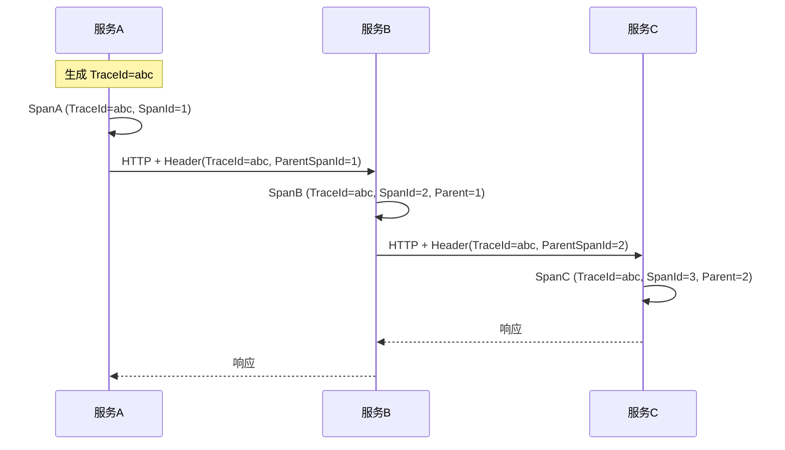

# 多活架构与链路追踪

创建日期：2026-06-06

## 多活架构

### 问题背景

单机房部署存在风险：机房断电、光纤挖断、自然灾害。如何保证即使一个机房完全不可用，系统仍能对外服务？这就是**多活架构**要解决的问题。

### 三种容灾架构

```mermaid
flowchart TB
    subgraph 同城双活["同城双活"]
        A1[机房A<br/>承载50%流量] <--> A2[机房B<br/>承载50%流量]
    end

    subgraph 两地三中心["两地三中心"]
        B1[同城机房A<br/>100%流量] <--> B2[同城机房B<br/>灾备]
        B1 <--> B3[异地机房C<br/>灾备]
    end

    subgraph 异地多活["异地多活"]
        C1[北京机房<br/>北方用户] <..> C2[上海机房<br/>华东用户]
        C1 <..> C3[广州机房<br/>华南用户]
    end

    style 同城双活 fill:#e8f5e9,stroke:#4caf50
    style 两地三中心 fill:#fff3e0,stroke:#ff9800
    style 异地多活 fill:#e3f2fd,stroke:#2196f3
```

| 架构 | 机房距离 | 故障切换时间 | 成本 | 适用场景 |
|------|---------|------------|------|---------|
| **同城双活** | < 50km | 秒级（自动） | 中 | 普通互联网业务 |
| **两地三中心** | 同城+异地 | 分钟级（同城）/ 手动（异地） | 高 | 金融、关键业务 |
| **异地多活** | 跨城市 | 秒级（自动就近接入） | 最高 | 大型互联网公司 |

### 多活核心挑战

#### 1. 数据同步冲突

两个机房同时修改同一条数据，怎么解决？

| 方案 | 原理 | 适用场景 |
|------|------|---------|
| **单元化** | 按用户 ID 分片，每个用户只路由到一个机房 | 用户数据可分区（推荐） |
| **最后写入胜（LWW）** | 以时间戳为准，最新数据覆盖 | 冲突不敏感的场景 |
| **CRDT** | 无冲突复制数据类型，自动合并 | 计数器、集合等特定场景 |
| **业务层补偿** | 冲突后异步对比和修复 | 对一致性敏感的场景 |

#### 2. 用户路由

用户应该访问哪个机房？

**GSLB（全局负载均衡）：**
- 用户 DNS 解析 → GSLB 根据 IP 返回最近机房的地址。
- 机房故障时，GSLB 将流量切到健康机房。
- 支持就近接入 + 故障切换。

#### 3. 故障切换

机房故障时，如何将流量切到其他机房？

- **GSLB 切换**：修改 DNS 解析，将故障机房 IP 替换为备用机房。
- **数据补偿**：故障期间的数据变更，需要回放或补偿。
- **容量预留**：备用机房需要预留足够的容量，不能满负荷运行。

## 链路追踪

### 为什么需要链路追踪？

微服务架构下，一个请求可能经过十几个服务。如果某个请求慢了或失败了，如何快速定位是哪一环出了问题？

::: tip 核心问题
- 请求经过了哪些服务？
- 每个服务耗时多少？
- 哪个环节是瓶颈？
:::

### 核心原理



**核心概念：**

| 概念 | 含义 | 图示 |
|------|------|------|
| **TraceId** | 一次完整请求链路的唯一标识 | 整个请求链使用同一个 TraceId |
| **SpanId** | 一个服务调用的唯一标识 | 每个服务处理生成一个 SpanId |
| **ParentSpanId** | 父调用的 SpanId | 形成调用链父子关系 |

### 传播方式

服务间调用时，TraceId 和 SpanId 通过 HTTP Header 传递：

```
X-B3-TraceId: abc123
X-B3-SpanId: def456
X-B3-ParentSpanId: abc123
```

### 主流框架对比

| 框架 | 存储 | UI | 采样策略 | 适用场景 |
|------|------|-----|---------|---------|
| **Jaeger** | Elasticsearch/Cassandra | 自带 UI | 支持 | 通用（CNCF 项目） |
| **Zipkin** | MySQL/ES/Cassandra | 自带 UI | 支持 | Spring Cloud 集成好 |
| **SkyWalking** | ES/H2/MySQL | 自带 UI + 拓扑图 | 支持 | Java 生态，自带 Agent |
| **OpenTelemetry** | 标准（不绑定后端） | 无（需对接后端） | 支持 | 标准 API，未来趋势 |

### OpenTelemetry

OpenTelemetry 是 CNCF 的**可观测性标准**，统一了 Trace、Metrics、Logs 的数据采集和导出。不是具体的存储/UI 方案，而是一套标准 API + SDK + Collector。

**核心价值：** 一套 API 对接多个后端（Jaeger、Zipkin、Prometheus），不被供应商锁定。

---

## 经典高频面试题

### Q1：同城双活、两地三中心、异地多活有什么区别？

**参考答案：**

- **同城双活**：两个机房距离近（<50km），同时承载流量，RTT 低，故障秒级切换。成本适中。
- **两地三中心**：同城双活 + 异地灾备。同城主备，异地做远程灾备。成本高，异地切换慢。
- **异地多活**：多个机房同时承载流量，用户就近接入。成本最高，数据同步和冲突解决最复杂。

选型：一般业务同城双活够了，金融类两地三中心，大厂异地多活。

### Q2：多活架构数据同步冲突怎么解决？

**参考答案：**

1. **单元化（推荐）**：按用户 ID 分片，每个用户只路由到一个机房。天然无冲突。
2. **最后写入胜（LWW）**：以时间戳为准，最新覆盖。适合冲突不敏感场景。
3. **CRDT**：无冲突数据类型，自动合并。适合计数器、集合。
4. **业务层补偿**：冲突后异步对比和修复。适合金融等敏感场景。

### Q3：GSLB 如何做到就近接入和故障切换？

**参考答案：**

GSLB（全局负载均衡）通过智能 DNS 解析：
- 根据用户 DNS 请求的源 IP，返回地理位置最近的机房 IP。
- 定期探测各机房健康状态。
- 故障时将故障机房 IP 从 DNS 解析中移除，切换到健康机房。

### Q4：链路追踪的核心原理是什么？TraceId 和 SpanId 是什么？

**参考答案：**

- **TraceId**：一次完整请求链路的全局唯一标识，所有服务调用共享同一个 TraceId。
- **SpanId**：链路中一个服务调用的唯一标识，记录开始时间、结束时间、操作名。
- **ParentSpanId**：父调用的 SpanId，形成调用链父子关系。

通过 TraceId 聚合一次请求的所有 Span，按 ParentSpanId 还原调用树，就能看到完整的调用链路和每个环节的耗时。

### Q5：OpenTelemetry 是什么？和 Jaeger/SkyWalking 什么关系？

**参考答案：**

OpenTelemetry 是 CNCF 的可观测性标准，定义了 Trace、Metrics、Logs 的统一数据采集 API 和 SDK。Jaeger 和 SkyWalking 是具体的后端实现（存储 + UI）。OpenTelemetry 提供统一 API，Jaeger/SkyWalking 提供后端。两者不是替代关系，而是标准与实现的关系。

### Q6：SkyWalking 和 Jaeger 怎么选？

**参考答案：**

- **SkyWalking**：Java 生态首选，自带 Java Agent，无代码侵入，拓扑图直观。适合 Java/Spring Cloud 项目。
- **Jaeger**：CNCF 项目，多语言支持好，原生支持 OpenTelemetry。适合多语言/云原生项目。
- 纯 Java 项目推荐 SkyWalking，多语言或云原生推荐 Jaeger + OpenTelemetry。