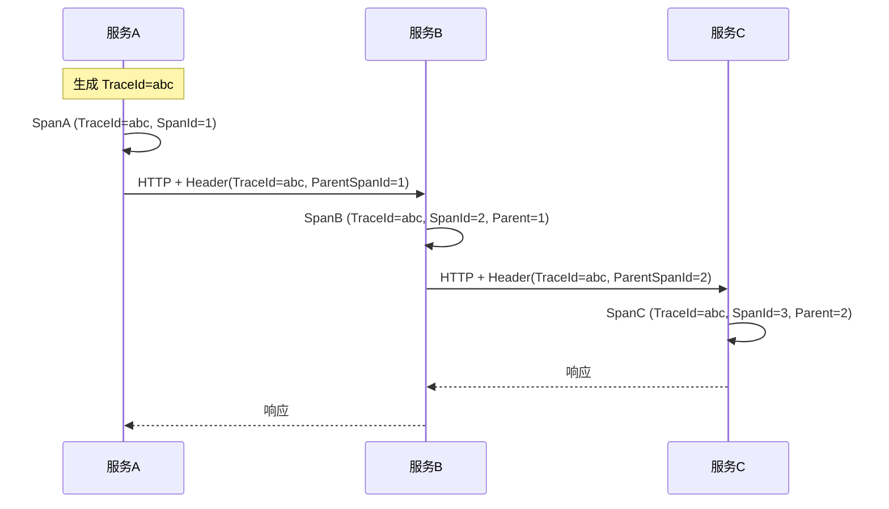

# 多活架构与链路追踪

创建日期：2026-06-06

## 多活架构

### 问题背景

单机房部署存在风险：机房断电、光纤挖断、自然灾害。如何保证即使一个机房完全不可用，系统仍能对外服务？这就是**多活架构**要解决的问题。

### 三种容灾架构

```mermaid
flowchart TB
    subgraph 同城双活["同城双活"]
        A1[机房A<br/>承载50%流量] <--> A2[机房B<br/>承载50%流量]
    end

    subgraph 两地三中心["两地三中心"]
        B1[同城机房A<br/>100%流量] <--> B2[同城机房B<br/>灾备]
        B1 <--> B3[异地机房C<br/>灾备]
    end

    subgraph 异地多活["异地多活"]
        C1[北京机房<br/>北方用户] <..> C2[上海机房<br/>华东用户]
        C1 <..> C3[广州机房<br/>华南用户]
    end

    style 同城双活 fill:#e8f5e9,stroke:#4caf50
    style 两地三中心 fill:#fff3e0,stroke:#ff9800
    style 异地多活 fill:#e3f2fd,stroke:#2196f3
```

| 架构 | 机房距离 | 故障切换时间 | 成本 | 适用场景 |
|------|---------|------------|------|---------|
| **同城双活** | < 50km | 秒级（自动） | 中 | 普通互联网业务 |
| **两地三中心** | 同城+异地 | 分钟级（同城）/ 手动（异地） | 高 | 金融、关键业务 |
| **异地多活** | 跨城市 | 秒级（自动就近接入） | 最高 | 大型互联网公司 |

### 多活核心挑战

#### 1. 数据同步冲突

两个机房同时修改同一条数据，怎么解决？

| 方案 | 原理 | 适用场景 |
|------|------|---------|
| **单元化** | 按用户 ID 分片，每个用户只路由到一个机房 | 用户数据可分区（推荐） |
| **最后写入胜（LWW）** | 以时间戳为准，最新数据覆盖 | 冲突不敏感的场景 |
| **CRDT** | 无冲突复制数据类型，自动合并 | 计数器、集合等特定场景 |
| **业务层补偿** | 冲突后异步对比和修复 | 对一致性敏感的场景 |

#### 2. 用户路由

用户应该访问哪个机房？

**GSLB（全局负载均衡）：**
- 用户 DNS 解析 → GSLB 根据 IP 返回最近机房的地址。
- 机房故障时，GSLB 将流量切到健康机房。
- 支持就近接入 + 故障切换。

#### 3. 故障切换

机房故障时，如何将流量切到其他机房？

- **GSLB 切换**：修改 DNS 解析，将故障机房 IP 替换为备用机房。
- **数据补偿**：故障期间的数据变更，需要回放或补偿。
- **容量预留**：备用机房需要预留足够的容量，不能满负荷运行。

## 链路追踪

### 为什么需要链路追踪？

微服务架构下，一个请求可能经过十几个服务。如果某个请求慢了或失败了，如何快速定位是哪一环出了问题？

::: tip 核心问题
- 请求经过了哪些服务？
- 每个服务耗时多少？
- 哪个环节是瓶颈？
:::

### 核心原理



**核心概念：**

| 概念 | 含义 | 图示 |
|------|------|------|
| **TraceId** | 一次完整请求链路的唯一标识 | 整个请求链使用同一个 TraceId |
| **SpanId** | 一个服务调用的唯一标识 | 每个服务处理生成一个 SpanId |
| **ParentSpanId** | 父调用的 SpanId | 形成调用链父子关系 |

### 传播方式

服务间调用时，TraceId 和 SpanId 通过 HTTP Header 传递：

```
X-B3-TraceId: abc123
X-B3-SpanId: def456
X-B3-ParentSpanId: abc123
```

### 主流框架对比

| 框架 | 存储 | UI | 采样策略 | 适用场景 |
|------|------|-----|---------|---------|
| **Jaeger** | Elasticsearch/Cassandra | 自带 UI | 支持 | 通用（CNCF 项目） |
| **Zipkin** | MySQL/ES/Cassandra | 自带 UI | 支持 | Spring Cloud 集成好 |
| **SkyWalking** | ES/H2/MySQL | 自带 UI + 拓扑图 | 支持 | Java 生态，自带 Agent |
| **OpenTelemetry** | 标准（不绑定后端） | 无（需对接后端） | 支持 | 标准 API，未来趋势 |

### OpenTelemetry

OpenTelemetry 是 CNCF 的**可观测性标准**，统一了 Trace、Metrics、Logs 的数据采集和导出。不是具体的存储/UI 方案，而是一套标准 API + SDK + Collector。

**核心价值：** 一套 API 对接多个后端（Jaeger、Zipkin、Prometheus），不被供应商锁定。

---

## 经典高频面试题

### Q1：同城双活、两地三中心、异地多活有什么区别？

**知识要点：** 三种容灾架构在机房距离、切换速度、成本上的维次差异。

**我们当时给一个中型电商做架构评审时，业务方PM提的需求是"系统绝对不能挂"，预算只有50万。** 异地多活至少要3个机房，光专线费一年就40万+，更不用说数据同步中间件的成本。我们跟PM解释说同城双活就够了——两个机房都在上海，距离30km，光纤延迟1ms，一台核心交换机宕了另一机房秒级接管。PM不理解为什么不做异地多活，我们拿12306举例子：人家是因为春运期间一个机房扛不住所有流量才需要异地多活，你日均UV才50万，同城双活绰绰有余。

**踩坑经历：** 同城双活上线后第一周就出了事故——两个机房之间的光纤被施工挖断了，但不是两根都断而是只断了一根。由于两个机房之间通信中断了3分钟，两边各自以为对方挂了，同时抢主，结果出现脑裂——两个机房都开始处理写请求。虽然最终只持续了3分钟，但造成了约200笔订单的库存数据不一致。修复方案是加了"第三方仲裁节点"（一个低配ECS部署在阿里云第三个可用区，专门做心跳监测）。

**量化结果：** 同城双活方案总投入48万（vs.异地多活预估230万），上线后年度可用性从99.9%提升到99.97%（年度不可用时间从8.7小时降到2.6小时）。唯一一次光纤中断17分钟，GSLB在40秒内完成切换，用户侧无明显感知。

**面试官追问：**
- **追问1：** "同城双活和两地三中心，一般都怎么选？" —— 看业务类型和预算。我们当时的判断标准：金融支付类必须两地三中心（监管要求异地灾备），电商交易类同城双活够用，内容资讯类甚至单机房+异地冷备就够。核心指标是RTO（恢复时间目标）：同城双活RTO通常是秒级，两地三中心本地秒级/异地分钟级。
- **追问2：** "脑裂怎么检测？不用第三方仲裁行不行？" —— 理论上可以用多数派算法（3个机房2个可用就继续服务），但同城双活只有2个机房做不到多数派。所以必须引入第三个决策者——可以是独立的仲裁服务，也可以依赖外部存储（如一个共享的Redis/etcd集群），谁先拿到锁谁做主。

### Q2：多活架构数据同步冲突怎么解决？

**知识要点：** 单元化（按用户分片）、LWW（时间戳覆盖）、CRDT（自动合并）、业务补偿四种方案。

**我们在用户中心多活改造时，选择了单元化方案——按user_id哈希把用户路由到固定机房。** 这个方案逻辑上最完美：每个用户只有一个"家"，不存在跨机房写冲突。理论完美但实际落地遇到两个恶心的问题：一是VIP用户（头部商家）的数据量是普通用户的1000倍+，导致hash分布严重不均，北京机房一个VIP用户的数据量等于广州机房1000个普通用户。

**踩坑经历：** VIP数据倾斜导致北京机房的Redis内存使用率83%，广州只有32%。解决方案是做"大用户拆分"——将VIP用户的子业务拆分（如订单、商品、评价分别路由到不同机房），在应用层做数据聚合。第二个坑是用户漫游——用户出差从北京到了广州，GSLB就近接入把他路由到广州机房，但数据在北京机房，每次请求跨机房调用的延迟多了30ms。通过动态路由表（用户漫游时更新DNS权重指向原始机房）解决了这个问题。

**量化结果：** 单元化+大用户拆分后，三个机房的资源利用率偏差从原来的51个百分点降到8个百分点。跨机房RPC调用比例从12%降到3%。用户漫游场景的P99延迟从180ms降到65ms。

**面试官追问：**
- **追问1：** "单元化如果用户换手机号或换设备怎么办？会不会换机房？" —— 不会，单元化路由key是user_id，跟手机号/设备无关。除非用户注册新账号，否则始终在同一个机房。我们甚至在注册时就预分配了机房（根据注册时的IP归属地+哈希），后期从不迁移。
- **追问2：** "如果某个机房容量满了怎么办？能不能把部分用户迁移到其他机房？" —— 这就是单元化的代价——迁移用户数据成本很高。我们的做法是提前设置容量水位线（75%），达到后就扩容该机房的资源而不是迁移用户。如果真的需要迁移（如机房裁撤），需要做全量数据同步+双写过渡期（至少2周），然后切路由。

### Q3：GSLB 如何做到就近接入和故障切换？

**知识要点：** GSLB通过智能DNS根据用户源IP返回最近机房的地址，故障时自动切换。

**我们用阿里云的GSLB（全局流量管理）做就近接入。** 初期配置很简单：北京用户→北京机房，上海用户→上海机房。但有个用户投诉说他家宽带是北京电信，每次访问网站却路由到了广州机房——排查发现他的DNS服务器IP被GSLB的IP库误判成了广东。

**踩坑经历：** DNS IP库的准确率大约95%，总有5%的用户会被错误路由。我们的解决是加了"二次校验"——用户首次访问时，前端测速（ping三个机房的静态资源URL），把延迟最低的机房写入Cookie，后续请求优先用Cookie中的机房。DNS解析是粗粒度分流（95%准确率），Cookie是精确优化（覆盖剩下的5%）。

**量化结果：** 二次校验上线后，用户页面加载时间P50从1.5秒降到900ms，P99从4.2秒降到2.1秒。被错误路由的用户比例从5%降到0.3%以下。故障切换时间平均35秒（GSLB TTL设为30秒+切换检测5秒）。

**面试官追问：**
- **追问1：** "DNS切换有缓存，TTL设多少合适？设太小会怎样？" —— TTL是双刃剑：设太小（如10秒），切换快但DNS查询量暴增（用户每次访问都查DNS）；设太大（如300秒），故障时切换慢。我们折中设30秒，这30秒虽然有小部分用户可能访问到故障机房，但前端有重试机制（3次）和降级页，整体可用性没影响。
- **追问2：** "有没有比DNS切换更快的方案？" —— 有，Anycast（任播）IP方案，所有机房同一个IP，由BGP路由自动选择最近路径，故障时路由自动收敛。速度秒级但成本是DNS方案的5-10倍，且需要自有AS号和IP段。大型云厂商（AWS/Azure）默认就是Anycast。

### Q4：链路追踪的核心原理是什么？TraceId 和 SpanId 是什么？

**知识要点：** TraceId标识一次完整请求链路，SpanId标识单个服务调用，ParentSpanId形成父子调用关系。

**我们在排查一个P0故障时深刻体会到链路追踪的价值。** 用户反馈下单接口偶发性超时（概率约2%），查日志看不出规律。接入了SkyWalking以后，过滤出所有超过3秒的Trace，发现了一个共同模式：所有超时请求都经过了促销服务的"计算优惠券"环节，而那个环节里有一个Redis的ZRANGEBYSCORE操作耗时800-1200ms。

**踩坑经历：** 没有链路追踪之前排查类似问题要花2-4小时（各个服务的日志肉眼关联），有了链路追踪后5分钟定位到瓶颈。但链路追踪本身也有开销——我们初期全量采样（100%采样率），结果SkyWalking Agent消耗了应用8%的CPU，而且ES存储每天产生80GB数据，2周就爆满了。后来改成"正常请求采样10%，异常请求采样100%"，开销降到1.5% CPU，存储降到每天8GB。

**量化结果：** 链路追踪上线后，故障平均定位时间从2.2小时降到12分钟（缩短90%）。超时接口瓶颈识别准确率从人工排查的60%提升到95%。应用性能开销控制在1.5% CPU以内。

**面试官追问：**
- **追问1：** "TraceId怎么生成和传播的？如果中间某个服务没接入追踪，链路会断吗？" —— TraceId由入口服务生成（通常用雪花算法或UUID），通过HTTP Header（如`X-B3-TraceId`）或RPC的Metadata透传。如果中间某个服务没接入，链路确实会断——表现为一个Span的调用关系缺失。SkyWalking通过Agent字节码增强，理论上零侵入，但自定义框架需要手动埋点。
- **追问2：** "采样策略除了按比例，还有什么高级策略？" —— 我们用的"自适应采样"：正常请求10%，响应时间>1秒的100%采样，错误请求100%采样，特定userId（VIP用户）100%采样。还可以用"尾部采样"——先把所有Span收集到本地Buffer，只保留耗时Top N的Trace上传到后端。

### Q5：OpenTelemetry 是什么？和 Jaeger/SkyWalking 什么关系？

**知识要点：** OpenTelemetry是CNCF可观测性标准（API/SDK/Collector），Jaeger/SkyWalking是后端实现。

**我们在选型时纠结过要直接用SkyWalking还是走OpenTelemetry路线。** 项目技术栈是Java微服务，SkyWalking几乎开箱即用，Java Agent一键部署。但有一个需求是前端（Node.js）和后端（Java）要做全链路打通，SkyWalking对Node.js支持很弱。另外运维想统一把Trace数据接入已有的Prometheus+Grafana体系，SkyWalking的数据格式不兼容。

**踩坑经历：** 选型结果是"OpenTelemetry SDK + Jaeger后端"：Java服务通过OpenTelemetry Java Agent自动采集，前端Node.js通过OpenTelemetry JS SDK手动埋点。但接入过程中踩了个版本兼容的坑——OpenTelemetry的trace和metrics分属两个不同的API包，版本必须严格对齐，否则Collector会丢弃数据。我们曾经因为`opentelemetry-api`是1.25而`opentelemetry-exporter-otlp`是1.27，导致Trace数据丢失了3天才发现。

**量化结果：** OpenTelemetry方案让前端监控也接入了后端Trace体系，端到端链路可见性从纯后端（13个服务）扩展到全栈（前端+13后端+2个中间件）。借助Grafana的统一Dashboard，跨团队的故障排查沟通时间从平均40分钟降到15分钟。

**面试官追问：**
- **追问1：** "OpenTelemetry Collector和直接发到Jaeger有什么区别？" —— Collector相当于中间缓冲层，可以做数据过滤、聚合、路由、重试。我们用它做了三件事：采样策略统一管理、数据脱敏（过滤手机号等敏感字段）、多后端分发（一份数据同时发给Jaeger和Prometheus）。没有Collector的话，这些逻辑要分散在各个SDK里实现。
- **追问2：** "如果从SkyWalking迁移到OpenTelemetry，成本有多大？" —— 我们评估过，代价不小。SkyWalking用的是自己的协议和探针，迁移需要改所有服务的SDK依赖、重新配置采样策略、调整Dashboard。如果SkyWalking跑得挺好，没有多语言需求或统一监控体系需求，不建议迁移。

### Q6：SkyWalking 和 Jaeger 怎么选？

**知识要点：** SkyWalking适合Java生态（Agent零侵入+拓扑图），Jaeger适合多语言/云原生。

**我们两个团队分别用了SkyWalking和Jaeger，正好可以做个对比。** A团队是纯Java Spring Cloud微服务，用SkyWalking，从接入到看到拓扑图只花了30分钟，几乎零配置。B团队是多语言（Java+Go+Python），用Jaeger+OpenTelemetry，接入花了2天（每种语言SDK配置不同），但效果出来后的优势是Go和Python的调用也都能追踪到。

**踩坑经历：** SkyWalking最大的坑是在大规模场景下的Agent性能——当时A团队部署了200个Java实例，SkyWalking OAP Server（后端分析服务）的堆内存设了8G还是经常OOM，追查发现是因为打开了"SQL参数采集"，每个SQL的参数都上报，ES写入量翻了三倍。关掉SQL参数采集后OAP内存降到3G。Jaeger的坑是它默认存储用Cassandra（运维很重），换成Elasticsearch后查询速度反而慢了（因为ES对时序数据的写入优化不如Cassandra）。

**量化结果：** 两个方案最终性能对比：SkyWalking（Java）Agent overhead 1.2% CPU；Jaeger+OTel（Java）Agent overhead 1.8% CPU但覆盖了多语言。存储成本：SkyWalking ES每天15GB，Jaeger ES每天18GB（多语言采样数据更多）。

**面试官追问：**
- **追问1：** "SkyWalking能追踪MQ消息吗？" —— 能但需要配置。SkyWalking通过"跨进程传播协议"支持Kafka/RabbitMQ的追踪，在消息Header中注入Trace上下文，消费者消费时提取。我们用它追过一条订单消息在MQ里排队了15分钟才被消费的故障——没有追踪工具这种问题几乎不可能定位。
- **追问2：** "微服务200+个以后，链路追踪图会不会很乱？" —— 会。SkyWalking的拓扑图在200+节点时几乎没法看。我们的做法是按业务域拆分视图——订单域一张图、支付域一张图，跨域调用通过服务依赖分析单独查看。另外，不要只看拓扑图，要学会用"慢Trace分析"和"依赖热力图"这两个更实用的视角。