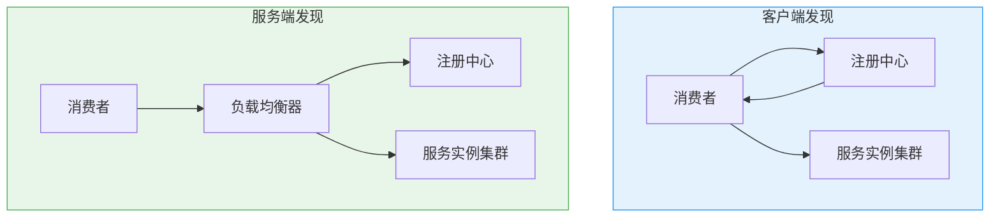

# 服务发现与注册（CAP 视角）

创建日期：2026-06-06

## 问题背景

微服务架构下，服务实例动态变化（扩容、缩容、故障、重启），IP 和端口不固定。服务消费者怎么知道该调用哪个实例？这就是**服务发现**要解决的问题。

::: tip 核心三问
1. **注册**：服务启动时如何把自己注册到注册中心？
2. **发现**：消费者如何找到服务提供者的地址？
3. **健康检查**：如何判断服务实例是否健康可用？
:::

## 客户端发现 vs 服务端发现



| 对比 | 客户端发现 | 服务端发现 |
|------|-----------|-----------|
| 负载均衡位置 | 客户端（如 Ribbon） | 服务端（如 Nginx + Consul Template） |
| 实现复杂度 | 客户端需要集成发现逻辑 | 客户端无需感知注册中心 |
| 灵活性 | 高（客户端可自定义策略） | 低（依赖服务端 LB） |
| 代表 | Eureka + Ribbon、Nacos + RestTemplate | K8s Service、Consul + Nginx |

## 主流注册中心 CAP 对比

### 对比总表

| 注册中心 | CAP 类型 | 一致性协议 | 健康检查 | 自我保护 | 生态 |
|----------|---------|-----------|---------|---------|------|
| **Eureka** | AP | 无（最终一致） | 客户端心跳 | ✅ 15分钟 85% | Spring Cloud Netflix |
| **ZooKeeper** | CP | ZAB | TCP 长连接 + Session | ❌ | Dubbo |
| **Nacos** | AP+CP | Raft（CP模式） | 心跳 / 主动探测 | ❌ | Spring Cloud Alibaba |
| **Consul** | CP | Raft | 主动探测（Agent） | ❌ | 多语言 |

### Eureka（AP 优先）

**自我保护机制：** 15 分钟内心跳失败比例低于 85% 时，不会剔除任何实例。

```
# Eureka 服务端自我保护触发条件
实际心跳比例 < 预期心跳比例 * 85%
```

**为什么这么设计？** Eureka 认为"保留可能坏了的节点"比"误删好的节点"危害更小。误删好节点会导致调用方找不到可用实例，保留坏节点只会导致一次调用失败（有重试+熔断兜底）。

### ZooKeeper（CP 优先）

**核心问题：** ZK 是 CP 系统，Leader 选举期间整个集群不可用。

**Dubbo 为什么用 ZK？** Dubbo 早期主要用于内部 RPC 调用，对一致性要求高（不能调错服务），且集群规模不大，Leader 选举时间很短，可以接受短暂的不可用。

### Nacos（AP+CP 可切换）

**核心设计：** 区分临时实例和持久实例。

| 实例类型 | CAP 模式 | 存储方式 | 健康检查 | 适用场景 |
|----------|---------|---------|---------|---------|
| **临时实例** | AP | 内存（不持久化） | 客户端心跳上报 | 服务发现 |
| **持久实例** | CP（Raft） | 持久化存储 | 服务端主动探测 | 配置管理、DNS |

## 健康检查机制

| 方式 | 原理 | 优缺点 | 代表 |
|------|------|--------|------|
| **客户端心跳** | 服务实例定期发心跳给注册中心 | 简单，但心跳失败不一定是实例问题（可能是网络） | Eureka |
| **服务端主动探测** | 注册中心主动探测服务实例的健康端点 | 准确，但对注册中心压力大 | Consul |
| **混合模式** | 心跳 + 主动探测 | 兼顾准确性和性能 | Nacos |

---

## 经典高频面试题

### Q1：Eureka 的自我保护机制是什么？为什么这么设计？

**参考答案：**

Eureka 在 15 分钟内心跳失败比例低于 85% 时，不会剔除任何实例。这是 Eureka 作为 AP 系统的设计选择——宁可保留可能坏了的节点，也不误删好的节点。误删会导致调用方找不到可用实例（大面积故障），而保留坏节点只会导致一次调用失败（有重试容错）。两害相权取其轻。

### Q2：为什么 ZooKeeper 做注册中心有 CP 问题？

**参考答案：**

ZK 是 CP 系统，Leader 选举期间整个集群不可用（拒绝读写）。如果注册中心不可用，新服务无法注册，消费者无法发现服务，虽然已有连接不受影响，但扩容、新调用都会失败。对于服务发现这种可用性优先的场景，ZK 的 CP 特性反而是劣势。

### Q3：Nacos 什么时候选 AP？什么时候选 CP？

**参考答案：**

- **临时实例走 AP**：用于服务发现。服务实例心跳上报，服务端不持久化。网络分区时优先保证可用性。
- **持久实例走 CP**：用于配置管理、DNS。数据持久化存储，基于 Raft 协议保证一致性。

配置中心通常用 CP（配置不能丢），服务发现通常用 AP（服务不能挂）。

### Q4：客户端发现和服务端发现有什么区别？各有什么优缺点？

**参考答案：**

- **客户端发现**：消费者从注册中心拉取服务列表，自己选择实例（Ribbon 负载均衡）。灵活，可以自定义负载均衡策略，但客户端需集成发现逻辑。
- **服务端发现**：消费者请求负载均衡器，负载均衡器从注册中心获取实例并转发。客户端简单，但 LB 是额外中间层，增加一跳延迟。

微服务一般用客户端发现（Spring Cloud），K8s 环境一般用服务端发现（K8s Service）。

### Q5：健康检查有心跳和主动探测两种，各有什么优缺点？

**参考答案：**

- **心跳**：服务实例主动上报，注册中心被动接收。简单、对注册中心压力小。但心跳失败可能只是网络问题，不一定是实例坏了。
- **主动探测**：注册中心主动探测实例。准确，但增加注册中心压力（每个实例都要探测）。

一般方案：心跳为主，辅助少量主动探测做兜底。

### Q6：服务发现选型标准？Eureka / Nacos / Consul / ZK 怎么选？

**参考答案：**

- **Spring Cloud 生态** → Nacos（阿里生态，AP/CP 可切换）或 Eureka（纯 AP，已停更但成熟）。
- **Dubbo 生态** → Nacos 或 ZooKeeper。
- **多语言/多数据中心** → Consul（多语言 SDK + 跨机房支持）。
- **强一致要求** → ZK 或 Etcd（但不推荐用于服务发现）。

推荐：大多数场景用 Nacos，功能最全，社区活跃。