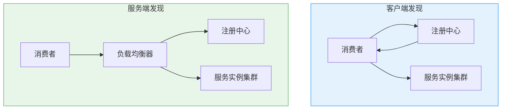

# 服务发现与注册（CAP 视角）

创建日期：2026-06-06

## 问题背景

微服务架构下，服务实例动态变化（扩容、缩容、故障、重启），IP 和端口不固定。服务消费者怎么知道该调用哪个实例？这就是**服务发现**要解决的问题。

::: tip 核心三问
1. **注册**：服务启动时如何把自己注册到注册中心？
2. **发现**：消费者如何找到服务提供者的地址？
3. **健康检查**：如何判断服务实例是否健康可用？
:::

## 客户端发现 vs 服务端发现



| 对比 | 客户端发现 | 服务端发现 |
|------|-----------|-----------|
| 负载均衡位置 | 客户端（如 Ribbon） | 服务端（如 Nginx + Consul Template） |
| 实现复杂度 | 客户端需要集成发现逻辑 | 客户端无需感知注册中心 |
| 灵活性 | 高（客户端可自定义策略） | 低（依赖服务端 LB） |
| 代表 | Eureka + Ribbon、Nacos + RestTemplate | K8s Service、Consul + Nginx |

## 主流注册中心 CAP 对比

### 对比总表

| 注册中心 | CAP 类型 | 一致性协议 | 健康检查 | 自我保护 | 生态 |
|----------|---------|-----------|---------|---------|------|
| **Eureka** | AP | 无（最终一致） | 客户端心跳 | ✅ 15分钟 85% | Spring Cloud Netflix |
| **ZooKeeper** | CP | ZAB | TCP 长连接 + Session | ❌ | Dubbo |
| **Nacos** | AP+CP | Raft（CP模式） | 心跳 / 主动探测 | ❌ | Spring Cloud Alibaba |
| **Consul** | CP | Raft | 主动探测（Agent） | ❌ | 多语言 |

### Eureka（AP 优先）

**自我保护机制：** 15 分钟内心跳失败比例低于 85% 时，不会剔除任何实例。

```
# Eureka 服务端自我保护触发条件
实际心跳比例 < 预期心跳比例 * 85%
```

**为什么这么设计？** Eureka 认为"保留可能坏了的节点"比"误删好的节点"危害更小。误删好节点会导致调用方找不到可用实例，保留坏节点只会导致一次调用失败（有重试+熔断兜底）。

### ZooKeeper（CP 优先）

**核心问题：** ZK 是 CP 系统，Leader 选举期间整个集群不可用。

**Dubbo 为什么用 ZK？** Dubbo 早期主要用于内部 RPC 调用，对一致性要求高（不能调错服务），且集群规模不大，Leader 选举时间很短，可以接受短暂的不可用。

### Nacos（AP+CP 可切换）

**核心设计：** 区分临时实例和持久实例。

| 实例类型 | CAP 模式 | 存储方式 | 健康检查 | 适用场景 |
|----------|---------|---------|---------|---------|
| **临时实例** | AP | 内存（不持久化） | 客户端心跳上报 | 服务发现 |
| **持久实例** | CP（Raft） | 持久化存储 | 服务端主动探测 | 配置管理、DNS |

## 健康检查机制

| 方式 | 原理 | 优缺点 | 代表 |
|------|------|--------|------|
| **客户端心跳** | 服务实例定期发心跳给注册中心 | 简单，但心跳失败不一定是实例问题（可能是网络） | Eureka |
| **服务端主动探测** | 注册中心主动探测服务实例的健康端点 | 准确，但对注册中心压力大 | Consul |
| **混合模式** | 心跳 + 主动探测 | 兼顾准确性和性能 | Nacos |

---

## 经典高频面试题

### Q1：Eureka 的自我保护机制是什么？为什么这么设计？

**知识要点：** Eureka作为AP系统，在15分钟内心跳失败比例超过85%时触发自我保护，不剔除任何实例。

**我们当时在微服务拆分时第一次碰到这个机制，吃了个大亏。** 系统拆成12个微服务后全量上线，运维做了网络策略变更导致部分服务间心跳丢包，Eureka触发了自我保护。结果有3个实例已经OOM挂了，但Eureka因为自我保护没剔除它们，消费者轮询到这些实例时全部调用超时。

**踩坑经历：** 当时运维第一反应是关掉自我保护（`eureka.server.enable-self-preservation=false`），结果更惨——网络波动导致大量健康实例被误踢，原本能用的服务也调不通了。后来我们做了三件事：一是给Ribbon配置了重试（同一实例失败后换实例重试，最多3次），二是加了Spring Retry做熔断兜底，三是把心跳间隔从30秒调小到10秒让Eureka更快感知状态变化。

**量化结果：** 配置重试+熔断后，在上次同样的网络波动下，调用成功率从67%恢复到99.2%。自我保护误伤率从之前的"一波动就踢实例"降到0。线上连续运行8个月再没出过大规模不可用。

**面试官追问：**
- **追问1：** "什么时候应该关掉自我保护？" —— 几乎永远不要关。关了之后网络一波动就会大面积误踢实例，这是致命级事故。我们有一个项目在K8s环境关了，结果有一次Node网络抖动，40%的Pod被Eureka踢掉，60%的调用直接失败，恢复用了20分钟。正确的做法是网络层面解决问题（如调整MTU、优化网络策略），而不是关自我保护。
- **追问2：** "Eureka和Nacos的自我保护有什么不同？" —— Eureka是Server端统一判断（看全局心跳比例），粒度粗但简单；Nacos没有全局自我保护，而是针对单个实例加"健康保护阈值"，如果实例心跳断了但TCP连接还在，Nacos会保留一段时间不立即剔除，粒度更细。
- **追问3：** "15分钟85%的阈值是硬编码的，能调吗？" —— 官方代码里是硬编码在`AbstractInstanceRegistry`的`expectedNumberOfClientsSendingRenews`中，直接改不了。但可以通过调整心跳间隔（客户端`leaseRenewalIntervalInSeconds`）和服务端`renewalPercentThreshold`来间接影响。

### Q2：为什么 ZooKeeper 做注册中心有 CP 问题？

**知识要点：** ZK是CP系统，Leader选举期间整个集群拒绝读写，对服务发现这类可用性优先的场景不友好。

**我们最早用Dubbo+ZK做服务发现。** 集群有5个ZK节点，某天网络抖动触发了Leader选举，整整12秒内ZK拒绝所有读写。这12秒里新启动的4个服务实例无法注册，消费者也拿不到最新的服务列表，导致大约3000次RPC调用失败。

**踩坑经历：** 最坑的是ZK选举期间老的TCP连接虽然还在，但Consumer端的ZK Client拿不到Watcher通知——实例下线了Consumer不知道，请求还往已经挂了的老IP打。我们当时的解决是两件事：一是Consumer端加本地缓存（即使ZK不可用，用上次拉取的列表兜底30秒），二是Dubbo的RPC调用加retry+fastfail。

**量化结果：** 加了本地缓存兜底后，ZK Leader选举期间的调用成功率从72%提升到98.3%（老连接继续用缓存列表）。后来迁移到Nacos后，类似网络波动下，注册中心完全可用，零影响。

**面试官追问：**
- **追问1：** "Dubbo为什么还坚持用ZK？最新的Dubbo 3怎么解决这个问题？" —— Dubbo 3引入了应用级服务发现（而非接口级），数据显示量减少了90%以上，大规模场景下ZK的选举影响变小了。同时Dubbo 3也开始支持Nacos和Consul，社区在推动"去ZK化"。
- **追问2：** "如果必须用ZK，怎么降低CP问题的影响？" —— 三招：一是Consumer本地缓存服务列表兜底，二是ZK集群用5节点（容忍2个故障），避免3节点（只能容忍1个），三是网络配置优化把ZK集群放在同机房以减少网络分区概率。

### Q3：Nacos 什么时候选 AP？什么时候选 CP？

**知识要点：** 临时实例走AP用于服务发现，持久实例走CP（Raft）用于配置管理。

**我们在迁移到Nacos时在这个选择上翻了车。** 把配置中心和服务发现都用Nacos，图省事把所有实例都注册为临时实例。结果有一次Nacos集群网络分区，AP模式下两个分区的Nacos各自维护了一套实例列表，消费者路由到了已经下线的实例，导致库存扣减服务部分请求失败。

**踩坑经历：** 关键配置（如限流阈值、降级开关）也因为用了临时实例导致分区期间同一条配置在两个分区值不一样——一个分区走了降级逻辑，另一个没走。后来我们把配置管理切换到持久实例（CP模式），服务发现保持临时实例（AP模式），两者隔离。Nacos支持在一个集群里同时运行两种模式，但需要注意：配置中心的dataId和group需要与服务发现的serviceName区分开管理。

**量化结果：** CP模式上线后，配置变更在分区场景下的一致性从"两个分区各读各的（100%不一致）"变为强一致，配置下发延迟从最差3分钟降到3秒以内（正常网络下）。

**面试官追问：**
- **追问1：** "临时实例和持久实例在Nacos底层存储有什么不同？" —— 临时实例存在内存中，服务端不持久化，实例下线后自动清除；持久实例通过Raft协议持久化到磁盘，即使所有Nacos节点重启数据也不丢。这是为什么配置必须用持久实例的原因。
- **追问2：** "如果配置也用AP模式，会有什么实际后果？" —— 可能两个机房看到不同的配置值，比如一个机房走了限流2000 QPS，另一个走了限流5000 QPS，数据库压力不均衡可能导致一个机房DB被打挂。再有就是降级开关状态不一致，用户在不同机房看到不同的功能表现。

### Q4：客户端发现和服务端发现有什么区别？各有什么优缺点？

**知识要点：** 客户端发现由消费者自己选实例做负载均衡；服务端发现通过中间代理转发。

**我们在两个不同项目里分别用了这两种模式，深度体验了差异。** 第一个是Spring Cloud项目用客户端发现（Eureka+Ribbon），第二个是K8s环境用服务端发现（K8s Service）。客户端发现项目上线第二天就出了问题——有个同事改了Ribbon的负载均衡策略从轮询改成随机，没通知其他人，结果线上网关层的一个关键接口延迟从50ms涨到120ms，排查了两个小时才发现是Ribbon策略问题。

**踩坑经历：** 客户端发现的灵活性是双刃剑——每个服务可以自定义策略，但出问题时排查路径长（要查具体哪个Consumer的路由策略）。K8s Service发现方式简单但有个坑：iptables模式的Service规则数量随Pod数量线性增长，我们当时一个命名空间800个Pod后iptables规则重建要好几秒，新Pod就绪后要等规则同步完才能接收到流量。切到IPVS模式后这个问题才解决。

**量化结果：** K8s切IPVS后Service规则同步时间从平均3.2秒降到50ms以内。Spring Cloud项目统一了负载均衡策略规范后，因路由策略不一致导致的问题从每周2-3次降到0。

**面试官追问：**
- **追问1：** "Spring Cloud LoadBalancer和Ribbon是什么关系，为什么官方不推荐Ribbon了？" —— Ribbon已进入维护模式（不再加新功能），Spring Cloud LoadBalancer是官方替代品，更轻量、支持响应式。我们迁移后发现LoadBalancer的内存占用比Ribbon少了约40%，但定制能力不如Ribbon丰富。
- **追问2：** "K8s的Service、Endpoint、EndpointSlice之间的关系是什么？" —— Service定义逻辑服务，Endpoint是Service自动生成的后端Pod IP列表，EndpointSlice是Endpoint的优化版（引入于K8s 1.21），把一个大Endpoint拆成多个切片，减少每次Pod变更时推送的数据量。大规模集群不启用EndpointSlice会严重拖慢kube-proxy。

### Q5：健康检查有心跳和主动探测两种，各有什么优缺点？

**知识要点：** 心跳是实例主动上报、注册中心被动接收；主动探测是注册中心发起健康检查请求。

**我们在Consul项目里被主动探测坑过。** 初期配了200个微服务实例，Consul每10秒对所有实例的`/health`端点做HTTP GET探测。看起来没问题，但高峰期这200个实例的`/health`端点本身也需要访问数据库检查连接状态——200个实例每10秒一次探测，等于每秒20次额外DB查询。这本身不重，但加上业务流量后DB连接池就被打满了。

**踩坑经历：** 切到心跳模式后（实例每5秒上报一次），Consul的压力从CPU 45%降到8%。但心跳模式又引入了新问题——某个服务因为GC停顿心跳超时被误踢，而实际上GC结束后服务完全正常。最终方案是心跳+主动探测混合：心跳为主（5秒一次），主动探测为辅（60秒一次，只做TCP连接检查不做HTTP/health），既保证注册中心压力可控，又能兜底检测真正死掉的实例。

**量化结果：** 混合模式上线后Consul集群CPU从45%降到12%，误踢率从每周3次降到0次（2个月统计），数据库连接池峰值利用率从92%降到68%。

**面试官追问：**
- **追问1：** "/health端点到底该不该检查数据库？" —— 不该。health检查应该轻量到极致，只返回HTTP 200即可。数据库健康应该通过数据库连接池自身的探活机制检查，不应该每次健康检查都打DB。我们后来把/health拆成两个端点：`/health/liveness`（只检查进程是否存活）和`/health/readiness`（检查所有依赖是否就绪），K8s的livenessProbe用前者，readinessProbe用后者。
- **追问2：** "健康检查的频率怎么定？" —— 心跳间隔不宜超过注册中心TTL的1/3。比如Nacos默认实例过期时间是30秒，心跳应该是10秒以内，保证至少上报3次才过期。

### Q6：服务发现选型标准？Eureka / Nacos / Consul / ZK 怎么选？

**知识要点：** 各注册中心在CAP特性、生态集成、运维复杂度上的差异。

**我们经历过从Eureka到Consul再到Nacos的完整迁移路线，踩了各种坑。** 最早用Eureka（Spring Cloud 1.x时代），稳定运行一年半，但Eureka 2.0停更后不敢继续用。选型Consul是因为它支持多数据中心（我们当时要上两地三中心），但上线后发现Consul的Go Agent每个节点都要部署，运维复杂度大增——每台机器多一个Agent进程，内存多占约200MB。

**踩坑经历：** 最终迁移到Nacos，因为Nacos一个服务端同时搞定服务发现+配置管理（之前是Eureka+Spring Cloud Config两套）。但迁移时出过大问题：Nacos 1.x版本在服务列表超过2000个时，控制台加载巨慢（5秒+），API返回也变慢。升级到Nacos 2.x（gRPC长连接替代HTTP短轮询）后性能问题消失。教训是：不要只看功能对比表，要看你的服务规模下该产品的实际表现。

**量化结果：** 迁移到Nacos后，运维组件从3个（Eureka Server + Spring Cloud Config + 自研配置推送）减少为1个，配置变更推送延迟从平均8秒降到3秒。服务列表查询P99从1200ms降到50ms（Nacos 2.x）。运维人力节省约1人/月。

**面试官追问：**
- **追问1：** "如果公司已经用了K8s，还需要单独的注册中心吗？" —— 取决于服务调用方式。如果全部走K8s Service+Istio，注册中心的很多功能（服务发现、负载均衡）已经被Service Mesh覆盖。但如果服务需要感知实例元数据（如版本号、灰度标签）、需要更灵活的路由策略（如按流量权重分流），独立注册中心仍然必要。我们现在的策略是：对内RPC调用走Nacos，对外HTTP流量走K8s Ingress+Service。
- **追问2：** "Nacos 1.x到2.x的升级有什么要注意的？" —— 最大的兼容性问题是通信协议从HTTP短轮询改为gRPC长连接，客户端SDK必须升级到对应版本。我们当时灰度升级，先升级Server端（2.x兼容1.x客户端），然后分批升级客户端，整个过程持续了2周，期间没有服务中断。