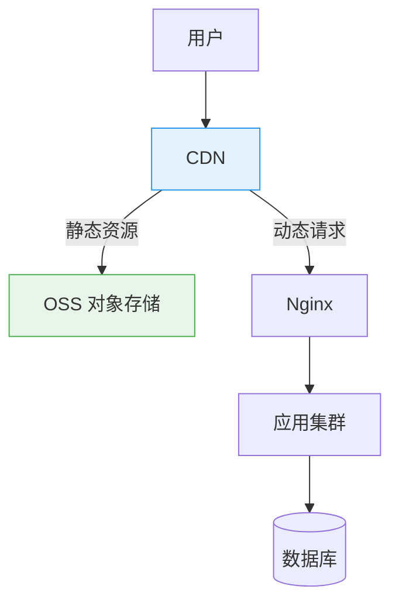
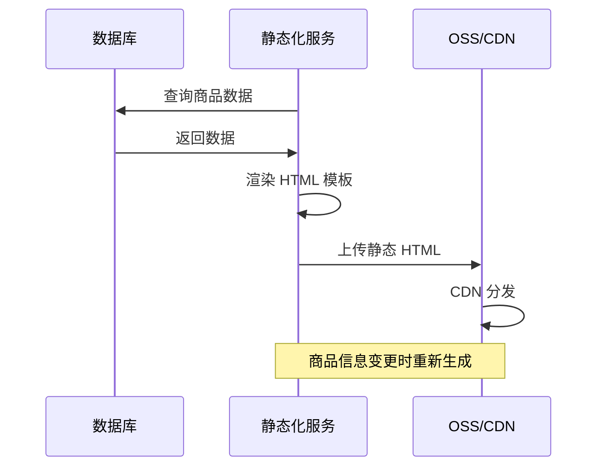
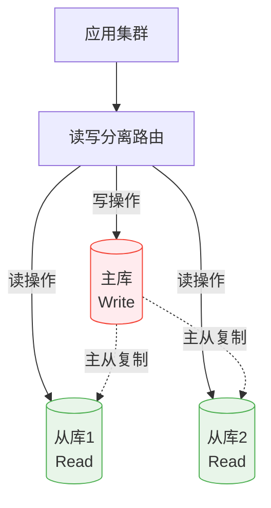
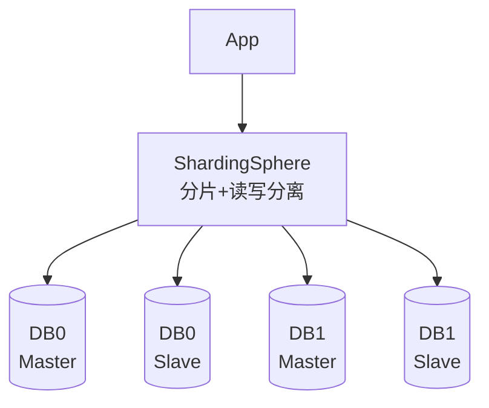

# 动静分离与读写分离

创建日期：2026-06-06

## 动静分离

### 问题背景

一个页面混合了静态内容（图片、CSS、JS、HTML 模板）和动态内容（用户数据、推荐列表、实时价格）。如果所有请求都打到应用服务器，大量带宽和 CPU 被静态资源消耗。

### 核心架构



### 静态化方案

| 方案 | 原理 | 适用场景 |
|------|------|---------|
| **CDN + OSS** | 静态资源上传到 OSS，CDN 加速分发 | 图片、CSS、JS 等不变资源 |
| **页面静态化** | 动态页面预生成 HTML，存到 CDN/OSS | 商品详情页、文章页 |
| **前后端分离** | 前端部署到 CDN，通过 API 获取动态数据 | SPA 应用 |

### 页面静态化实践

对于变化不频繁的页面（如商品详情），可以预生成静态 HTML：



**时效性处理：** 商品价格变化时，通过 MQ 通知静态化服务重新生成 HTML，推送到 CDN。

## 读写分离

### 核心架构



### 主从延迟问题

主从复制不是实时的，从库数据可能落后主库。延迟通常几十毫秒到几秒。

**典型问题：** 用户下单后立即查看订单，读从库可能查不到刚创建的订单。

### 四种解决方案

| 方案 | 做法 | 优缺点 |
|------|------|--------|
| **强制读主** | 写操作后，同一用户/同一会话的后续读操作强制走主库 | 简单可靠，但主库压力增加 |
| **延迟阈值** | 设置一个可接受的延迟时间（如 1 秒），通过中间件判断 | 大部分请求走从库 |
| **Pt-heartbeat 监控** | Percona Toolkit 监控主从延迟，延迟过高时切主库 | 自动切换，但需要额外组件 |
| **缓存兜底** | 写操作后同时更新 Redis 缓存，读优先读缓存 | 缓存一致性需要额外处理 |

::: tip 推荐策略
**核心写后读走主库 + 非核心读走从库 + 缓存兜底**。像订单状态这种关键数据，写后短时间内强制读主；像商品列表这种，走从库+缓存。
:::

### ShardingSphere 读写分离配置

```yaml
# ShardingSphere 读写分离配置
spring:
  shardingsphere:
    rules:
      readwrite-splitting:
        data-sources:
          ds_0:
            type: Static
            props:
              write-data-source-name: master
              read-data-source-names: slave1, slave2
            load-balancer-name: round_robin
```

### 分库分表 + 读写分离组合



每个分片有自己的主从，ShardingSphere 统一管理分片路由和读写分离路由。

---

## 经典高频面试题

### Q1：动静分离怎么分？什么内容算"动"，什么算"静"？

**参考答案：**

- **静**：不依赖用户/上下文的资源——图片、CSS、JS、字体、静态 HTML 模板。特点是同一 URL 对所有用户返回相同内容。
- **动**：依赖用户/上下文的资源——用户数据、购物车、推荐列表、实时价格。特点是不同用户/不同时间看到的内容不同。

静的内容走 CDN+OSS，动的请求走应用服务器。对于"变化慢的动态内容"（如商品详情），可以提前静态化。

### Q2：主从延迟怎么处理？四种方案各有什么优缺点？

**参考答案：**

1. **强制读主**：写后读走主库。简单可靠，但增加主库压力。
2. **延迟阈值**：延迟超过阈值时切主库。大部分请求走从库，但无法完全避免读到旧数据。
3. **Pt-heartbeat 监控**：自动监控和切换，但增加运维复杂度。
4. **缓存兜底**：写后更新缓存，读走缓存。需要保证缓存一致性。

推荐：核心写后读强制走主，非核心走从库+缓存。

### Q3：什么场景需要强制读主？举例说明。

**参考答案：**

- 用户下单后立即查看订单详情。
- 修改密码后立即用新密码登录。
- 扣减库存后立即查看剩余库存。

这些场景的共同特点是：**写操作后短时间内需要读到最新数据**，读从库可能读到旧数据导致业务错误。

### Q4：ShardingSphere 怎么配置读写分离？负载均衡策略有哪些？

**参考答案：**

ShardingSphere 通过 YAML 或 Java API 配置读写分离，指定写数据源和读数据源列表。读数据源的负载均衡策略支持：轮询、随机、权重。一般用轮询即可。写操作自动路由到写库，读操作自动路由到读库（负载均衡）。

### Q5：分库分表和读写分离怎么组合使用？

**参考答案：**

ShardingSphere 同时支持分片和读写分离。每个分片有自己的主从配置：

```
DB0: Master + Slave
DB1: Master + Slave
```

请求流程：分片路由（根据分片键定位到 DB0）→ 读写分离路由（写走 Master，读走 Slave）。两个路由是独立的，ShardingSphere 统一编排。

### Q6：什么时候不适合做读写分离？

**参考答案：**

- 业务写 QPS 本身就很大，读写分离不能解决写瓶颈（需要分库分表）。
- 业务需要强一致性，写入后必须立即读到（如果强制读主就失去了读写分离的意义）。
- 主库已经加了缓存层，读请求已经不走数据库了，读写分离收益有限。