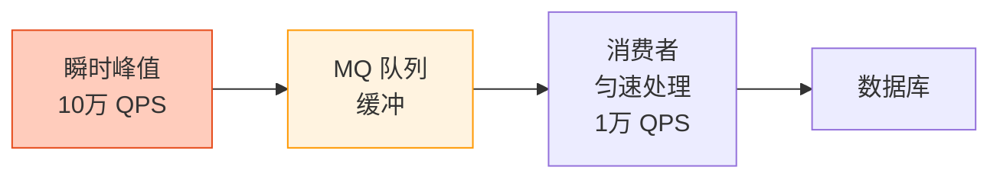

# 异步处理：MQ 削峰与 CompletableFuture 异步编排

创建日期：2026-06-06

## 为什么需要异步？

- **削峰填谷**：瞬时大流量，用 MQ 缓冲，平滑消费，保护系统。
- **提升吞吐**：同步等待浪费线程，异步处理让线程干更多活。
- **解耦**：下单后，通知、积分、物流都可以异步处理，下单主流程更快。
- **用户体验**：非关键操作异步做，页面响应更快。

## MQ 削峰设计

### 削峰原理



- 把瞬时流量转换成平稳流量。
- 系统按平时流量设计，不用按峰值扩容。
- 降低成本，保护系统。

### 设计要点

| 要点 | 说明 |
|------|------|
| **队列长度控制** | 太大导致 MQ 存储爆，太小还是会被冲。根据业务峰值设置合理容量。 |
| **消费速度控制** | 根据系统能力调整消费线程数，不能太快打垮 DB，不能太慢积压过多。 |
| **消息可靠性** | 保证消息不丢：持久化 + 手动 ACK。 |
| **过期丢弃** | 对时效性要求不高的，可以设置消息过期，超过时间直接丢弃。 |

### 典型案例：秒杀异步下单

用户秒杀请求 → Redis 预扣库存成功 → 发消息到 MQ → 立即返回用户"排队中"。消费者慢慢消费，创建订单扣数据库库存。瞬时 10 万 QPS，MQ 拦住，消费者几千 QPS 慢慢处理，DB 扛得住。

## CompletableFuture 异步编排

### 为什么用 CompletableFuture？

传统 Future 的缺点：
1. `get()` 会阻塞，不能非阻塞回调。
2. 多个 Future 不能组合编排。
3. 异常处理不友好。

CompletableFuture 解决了这些问题，支持流式 API、链式调用、任务组合。

### 核心 API 实战

```java
// 1. 异步执行，有返回值
CompletableFuture<String> future = CompletableFuture.supplyAsync(() -> {
    return queryFromDB();
}, executor);

// 2. 异步执行，无返回值
CompletableFuture.runAsync(() -> {
    sendLog();
}, executor);

// 3. 链式处理：上一个结果交给下一个
future.thenApply(result -> process(result))
      .thenAccept(finalResult -> System.out.println(finalResult));

// 4. 异常处理
future.exceptionally(ex -> {
    log.error("error", ex);
    return defaultValue;
});

// 5. 组合两个独立 future，都完成再处理
CompletableFuture<String> f1 = getInfo1();
CompletableFuture<String> f2 = getInfo2();
f1.thenCombine(f2, (a, b) -> a + b);

// 6. 等待所有 future 完成
CompletableFuture.allOf(f1, f2, f3).join();

// 7. 只要一个完成（哪个快用哪个）
CompletableFuture.anyOf(f1, f2).get();
```

### 实战案例：商品详情页并行查询

商品详情需要查多个数据：基本信息、推荐、库存、评价。这些来自不同服务，可以并行查询。

**串行做法（慢）：**
```java
info = getBaseInfo();     // 100ms
recommend = getRecommend(); // 100ms
stock = getStock();       // 100ms
// 总时间: 300ms
```

**CompletableFuture 并行（快）：**
```java
CompletableFuture<Info> info = CompletableFuture
    .supplyAsync(() -> baseService.get(id), executor);
CompletableFuture<Recommend> recommend = CompletableFuture
    .supplyAsync(() -> recommendService.get(id), executor);
CompletableFuture<Stock> stock = CompletableFuture
    .supplyAsync(() -> stockService.get(id), executor);

// 等待所有完成
CompletableFuture.allOf(info, recommend, stock).join();
// 总时间 ≈ 最慢一步的时间 ≈ 100ms，提升 3 倍
```

### 常见坑点

1. **默认用 ForkJoinPool，自定义线程池更好**：大量阻塞操作要自定义线程池，避免占满公共线程池。
2. **异常吞掉问题**：必须处理 `exceptionally` 或 `handle`，不然异常被吞了不知道。
3. **线程池混用**：不同类型业务用不同线程池，IO 密集和 CPU 密集线程数设置不同。

## 响应式编程（Reactor / WebFlux）

### 核心思想

- 基于事件流，异步非阻塞。
- **背压（Backpressure）**：消费者能控制生产者速度，防止生产者太快压垮消费者。
- 代表实现：Reactor（Spring WebFlux）、RxJava。

### 适用场景

- IO 密集型，大量并发连接（网关、代理服务）。
- 流媒体处理。

### vs CompletableFuture

- CompletableFuture 适合编排**少数几个异步任务**。
- 响应式适合处理**无限事件流**，适合整个链路全异步化。
- 复杂度：响应式 > CompletableFuture。业务开发推荐 CompletableFuture 足够。

## 请求合并（Request Collapsing）

### 原理

把一段时间窗口内的多个小查询请求攒起来，合并成一次批量查询，结果分发回各个请求。减少网络 IO 和 DB 查询次数，提升吞吐。

### 优缺点

- ✅ 减少 DB 查询次数，提升整体吞吐。
- ❌ 增加延迟，要等窗口攒齐请求。
- ❌ 实现复杂。

**适用场景：** 请求频率高，单个请求处理很快，批量收益远大于延迟增加。Hystrix 原生支持请求合并。

---

## 经典高频面试题

### Q1：MQ 削峰原理是什么？能解决什么问题？

**参考答案：**

瞬时流量大，系统处理不过来，把请求放到 MQ 队列里，消费者按照系统能承受的速度匀速处理。把瞬时峰值变成平稳流量，系统不用按峰值扩容，降低成本，保护 DB 不被冲垮。

### Q2：CompletableFuture 的 allOf 和 anyOf 有什么区别？用在什么场景？

**参考答案：**

- **allOf**：等待所有 CompletableFuture 都完成才继续。适合：商品详情页并行查多个服务，都拿到结果再渲染页面。
- **anyOf**：只要有一个完成就继续。适合：多个备份服务，哪个先返回用哪个，提高可用性、降低延迟。

### Q3：CompletableFuture 中 thenApply 和 thenAccept 的区别？

**参考答案：**

- **thenApply**：接收上一个结果，返回一个新结果，有返回值，可以继续链式调用。
- **thenAccept**：接收结果，消费掉，无返回值，一般是最后一步。
- 简单说：有返回值用 thenApply，没返回值消费用 thenAccept。

### Q4：异步一定比同步快吗？什么时候不该用异步？

**参考答案：**

不一定。异步适合：
- 有 IO 等待，利用等待时间做别的事，提升吞吐。
- 削峰填谷，瞬时高峰缓冲。
- 非关键链路异步化，让主流程更快返回。

不该用异步：
- 逻辑非常简单，本来就很快，异步增加复杂度没必要。
- 需要马上拿到结果才能继续往下走，不能异步。
- 业务要求强一致性，必须同步完成。

### Q5：什么是背压（Backpressure）？响应式编程为什么需要背压？

**参考答案：**

背压就是消费者告诉生产者"我处理不过来了，你慢点生产"。响应式是异步推送，如果生产者生产速度远大于消费者处理速度，队列会越来越大，最终 OOM。背压让消费者反馈速度给生产者，生产者按消费者能力控制生产速度，不会撑爆内存。

### Q6：请求合并的优缺点？什么时候用？

**参考答案：**

- **优点**：多个小请求合并成一个批量，减少网络 IO 和 DB 查询次数，提升整体吞吐。
- **缺点**：需要等待攒请求，增加了每个请求的延迟，实现复杂。
- **适用场景**：请求频率很高，单个请求处理很快，批量收益远大于延迟增加。比如批量查询多个商品信息。